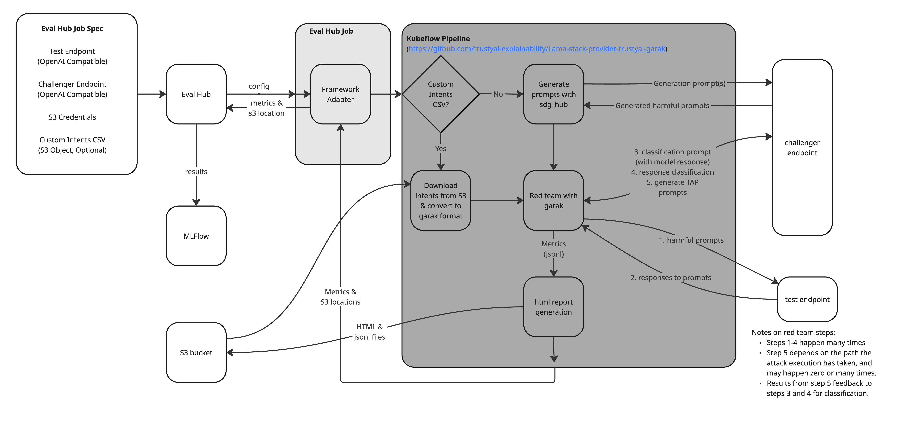

# Open Data Hub - Automated Red Teaming ADR

|                |            |
| -------------- | ---------- |
| Date           | tbc |
| Scope          | Red Teaming (Garak)|
| Status         | Draft |
| Authors        | [Stuart Battersby](@blastStu) |
| Supersedes     | N/A |
| Superseded by: | N/A |
| Tickets        | [RHAISTRAT-1179](https://redhat.atlassian.net/browse/RHAISTRAT-1179),[RHAISTRAT-1180](https://redhat.atlassian.net/browse/RHAISTRAT-1180), [RHAISTRAT-1178](https://redhat.atlassian.net/browse/RHAISTRAT-1178) |
| Other docs:    | none |

## What
This ADR is about decisions made for implementing an automated red teaming workflow (from former Chatterbox Labs work) into [garak](https://github.com/NVIDIA/garak) and [sdg_hub](https://github.com/Red-Hat-AI-Innovation-Team/sdg_hub), with execution via [Kubeflow Pipelines](https://www.kubeflow.org/docs/components/pipelines/) and [Eval Hub](https://github.com/eval-hub/eval-hub).

The release status targetted here is: Tech Preview in 3.4.

## Why

An ADR is needed for this because decisions are made with respect to:
1. Where to implement the core red teaming logic
2. How to execute this code in-cluster, and mitigate API changes as a result of upstream merging
3. How to show results to the user
4. How to trigger the process and store results

## Goals

* Execute a full run of red teaming evaluations, with custom intents, with HTML reports stored for future access
* Synthetically generate custom, harmful prompts as input for red teaming
* Use these prompt to execute attacks of increasing complexity to red team an inference endpoint
* Generate an HTML report with the results of red teaming
* Execute everything in cluster, with tracking of the process and storage of results

## Non-Goals

* Detailing how to deploy an LLM to test - the assumption is made that this is deployed and an OpenAI compatible endpoint is available
* Detailing how to deploy a challenger LLM - the assumption is made that this is deployed and an OpenAI compatible endpoint is available

## How

The key decisions that this ADR captures are:

### Where to implement the red teaming logic
**Context**: The aim is to align and merge into the main [upstream garak](https://github.com/NVIDIA/garak) project, and contribute fully.  There are time pressures to integrate this work for TP in 3.4.

**Decision**:  Implement the work on a midstream fork ([here](https://github.com/trustyai-explainability/garak/tree/automated-red-teaming)), whilst maintaining close coordination with the upstream maintainers to align.  Merge with upstream ASAP.

### Where to implement the prompt generation logic
**Context**: Harmful prompts, used for red teaming, need to be generated synethically.  Major work already exists in the [sdg_hub](https://github.com/Red-Hat-AI-Innovation-Team/sdg_hub) project that controls the flow of generating synethic data, guided by a teacher or challenger LLM.

**Decision**: Implement logic for generating prompts into the sdg_hub library.

### How to execute this in-cluster
**Context**: This process of generating synthetic data and carrying out red teaming should take place in a cluster, with a mechanism that gives a buffer to any API changes that may occur as a result of upstreaming the midstream code implementation.

**Decision**: Use Kubeflow Pipeline components, with S3 storage, to run the flow.  The pipeline consists an (optional) SDG step, followed by the garak red teaming step.  Artifacts are written to an S3 bucket.

### How to report results
**Context**:  The results of a red teaming flow are metrics and data.  However, some visualization is key to interpreting these and should provide a base for future UI integration.

**Decision**: Create a standalone HTML report artifact, including charting, that can be downloaded and opened in the browser.  This should not be implemented in the garak library as it is a specific way to view the results (and would conflict with garak's own HTML reporting).

### How to trigger the pipelines, track the process and store results
**Context**: Eval Hub is the home for evaluations and can be backed by experiment tracking in MLFlow.

**Decision**: Implement an [Eval Hub Adapter](https://github.com/eval-hub/eval-hub-sdk) to trigger the pipeline and capture results.  If Eval Hub is configured with MLFlow, an experiment is created there and artifacts linked.  Eval Hub should be the main customer entry point to the whole flow, and the place to view results.

### How to access the S3 bucket
**Context**: The S3 bucket needs to be accessible for all the components (within the kubeflow pipeline), with read and write operations.  Content written earlier in the pipeline (such as by sdg_hub) needs to be read by later components (garak).

**Decision**: S3 will be accessed using boto3 from within the pipeline, with credentials stored in k8s secrets.

This is achieved with the following overall architecture:

## Alternatives

### Where to implement the red teaming logic
**Alternative 1**: Create a new upstream project for red teaming

**Pros**: Absolute control of the project direction.

**Cons**: Many, to identify a few:
- This would conflict with well known projects, some of which we are already using.
- Whilst we would have absolute control we would also be the sole maintainers.
- We would need to recreate all components needed rather than collaborating on existing components.
- Confusion for customers over which red teaming library to use.

**Alternative 2**: Use a different red teaming project

**Pros**: Potentially different functionality.

**Cons**: Same as above.

### Where to implement the prompt generation logic
**Alternative 1**: Create a new upstream project for harmful prompt generation

**Pros**: More fine grained control over the generation process.

**Cons**: Same as above.

### How to execute this in-cluster
**Alternative 1**: Do not use kfp, integrate python libraries directly into Eval Hub.  This is quite a valid alternative after upstreaming the midstream garak work.

**Pros**:
- Less overhead for deployment
- Simpler execution
- Tighter coupling with Eval Hub

**Cons**:
- Minimal buffer to API changes as a result of upstreaming codebase
- No access to kfp execution scaffolding (including the UI experience)
- Forces integration direcly via Python or Eval Hub

### How to report results
**Alternative 1**: Pure data export, no visuals

**Pros**:
- Simple execution

**Cons**:
- Too hard to interpret for a user

**Alternative 2**: Direct UI integration.  This is less of an alternative, and more of a next step.

**Pros**:
- Tight coupling with the platform UX

**Cons**:
- Design and development time

## Risks

There is the risk that merging with upstream requires changes to the midstream codebase.  However, there are mitigation layers in this architecture via KFP and Eval Hub.

## Stakeholder Impacts

| Group                         | Key Contacts     | Date       | Impacted? |
| ----------------------------- | ---------------- | ---------- | --------- |
| group or team name            | key contact name | date       | ? |

## Reviews

| Reviewed by                   | Date       | Notes |
| ----------------------------- | ---------  | ------|
| name                          | date       | ? |
