# Open Data Hub - AutoML Architecture Decision

|                |            |
| -------------- | ---------- |
| Date           | 2026-01-21 |
| Scope          | AutoML Component |
| Status         | Proposed |
| Authors        | Lukasz Cmielowski |
| Supersedes     | N/A |
| Superseded by: | N/A |
| Tickets        | TBD |
| Other docs:    | N/A |

## What

This ADR documents the architecture decision for AutoML, an automated system for building and optimizing machine learning models for tabular data within Red Hat OpenShift AI. AutoML leverages Kubeflow Pipelines to orchestrate the model training workflow, using the AutoGluon library to automatically build, evaluate, and select optimal models. The system integrates with Model Registry for model versioning and KServe for model deployment, producing trained predictors that can be deployed for production machine learning applications.

AutoML provides **two separate pipelines** optimized for different use cases:

1. **Classification & Regression Pipeline** - For traditional tabular ML tasks (classification and regression)
2. **Time-Series Pipeline** - For time-series forecasting tasks

Each pipeline has distinct input parameters, defaults, and configurations tailored to its specific use case.

## Why

Manually building and optimizing machine learning models for tabular data is time-consuming and requires extensive ML expertise. This process involves:

- Feature engineering and data preprocessing
- Testing multiple model types and algorithms
- Hyperparameter tuning and optimization
- Model evaluation and selection
- Ensemble creation and refinement
- Model packaging and deployment preparation

AutoML automates this process, enabling users to:

- Automatically build and optimize models with minimal configuration
- Leverage AutoGluon's ensembling approach for high-performance models
- Generate production-ready predictors with comprehensive evaluation metrics
- Compare multiple models side-by-side with standardized metrics
- Deploy models seamlessly through Model Registry and KServe integration

## Goals

* Provide automated ML model building and optimization for tabular data within RHOAI
* Integrate with existing RHOAI infrastructure (Kubeflow Pipelines, Model Registry, KServe)
* Support multiple ML task types (classification, regression, time-series forecasting)
* Generate production-ready AutoGluon Predictor models as deployable artifacts
* Enable evaluation using standardized metrics (accuracy, ROC-AUC, R², RMSE, MAPE, etc.)
* Support multiple data sources and formats (S3, local filesystem; CSV, Parquet, XLSX)
* Maintain compatibility with RHOAI Connections for secure data access
* Provide both programmatic (API) and UI
* Support flexible configuration through optional parameters with sensible defaults

## Non-Goals

* Support for non-tabular data (images, text, audio)
* Traditional hyperparameter optimization (AutoGluon uses ensembling approach)
* Unsupervised learning support (e.g. clustering)

## How

AutoML is implemented as Kubeflow Pipelines that orchestrate the following workflow:

### Architecture Components

1. **Kubeflow Pipelines**: Orchestrates the model training workflow as a pipeline of containerized components
2. **KFP Reusable components**: for the end to end pipeline: https://github.com/kubeflow/pipelines-components
3. **AutoGluon Library**: Core ML optimization engine (open-source) that automatically builds, evaluates, and selects optimal models
4. **MLFlow**: Provides experiment tracking, metrics logging, and artifact management for training runs
5. **RHOAI Model Registry**: Manages model versioning and metadata
6. **KServe**: Provides model serving capabilities with custom AutoGluon runtime
7. **RHOAI Connections**: Manages secure access to data sources (S3, etc.) via Kubernetes Secrets

### Pipeline Workflow

The following flowchart illustrates the AutoML optimization workflow:

```mermaid
flowchart TB
    subgraph pipeline["AutoML training pipeline"]
        direction LR
        Start([Pipeline Start]) --> DataLoad["Data Loading<br/>Load tabular data from S3"]
        DataLoad --> DataSplit["Data Splitting<br/>Train/test split"]
        DataSplit --> ModelSelect["Model Selection<br/>Train models, select top N on sampled data"]
        ModelSelect -->|"top N models"| RefitLoop
        subgraph RefitLoop["for N models"]
            direction LR
            ModelRefit["Model Refit<br/>Refit on full dataset"]
        end
        RefitLoop --> Leaderboard["Leaderboard Evaluation<br/>Aggregate metrics, HTML leaderboard"]
        Leaderboard -->|"if auto_register=True"| ModelRegistry["Model Registry<br/>Register best predictor"]
        ModelRegistry -.->|if auto_deploy=True| ModelServing
        Leaderboard -->|"if auto_deploy=True"| ModelServing["Model Serving<br/>Deploy with KServe"]
        ModelRegistry --> End([Pipeline Complete])
        ModelServing --> End([Pipeline Complete])
    end

    style Start fill:#2d8659,color:#fff,stroke-width:3px
    style End fill:#2d8659,color:#fff,stroke-width:3px
    style ModelSelect fill:#d97706,color:#fff,stroke-width:3px
    style ModelRefit fill:#d97706,color:#fff,stroke-width:3px
    style Leaderboard fill:#1e40af,color:#fff,stroke-width:3px
    style ModelRegistry fill:#7c3aed,color:#fff,stroke-width:2px
    style ModelServing fill:#7c3aed,color:#fff,stroke-width:2px
```

**Workflow Steps:**

1. **Data Loading**: Tabular data is loaded from configured data sources (S3 or local filesystem). Supports CSV, Parquet, and XLSX formats and reading in batches of data.
2. **Data Sampling & Splitting**:  A subset of training data (default: 500 samples) is sampled for initial model building to reduce computational cost.
Data is split into train/test sets using appropriate techniques:
   - random or stratified for classification
   - time-series split for forecasting
3. **Model Building & Selection**: Multiple models are built using sampled data and AutoGluon library. Models are evaluated and the best performers (top N) are promoted to the refit stage. Uses AutoGluon's ensembling approach (stacking/bagging) rather than traditional hyperparameter optimization.
4. **Model Refit**: Best candidate models are refit on the full training dataset using AutoGluon. This stage produces fully trained models ready for evaluation. 
5. **Leaderboard Evaluation**: Fully trained models and intermediate models are evaluated. A leaderboard is generated ranked by the specified evaluation metric. Provides comprehensive performance metrics for all models.
6. **MLFlow Logging**: Model metrics, configurations, and leaderboard rankings are logged to MLFlow (if enabled) for experiment tracking and comparison.
7. **Results Storage**: All artifacts, metrics, and logs are stored in the configured results location. This includes model artifacts, run artifacts, metrics, and experiment summary.
8. **Model Registry** (optional): If `auto_register=True`, the best AutoGluon Predictor is registered with Model Registry with metadata.
9. **Model Deployment** (optional): If `auto_deploy=True`, the model is deployed using KServe with AutoGluon runtime (custom). When both `auto_register` and `auto_deploy` are enabled, deployment can use the registered model from Model Registry.
10. **MLFlow Finalization**: Experiment summary, final metrics, and artifact references are logged to MLFlow (if enabled) before pipeline completion.

### Input Parameters

The pipelines accept parameters organized into logical groups:

**Required Parameters:**
- Experiment metadata (`name`)
- Input data source (`input_data_reference`)
- Task-specific parameters:
  - Classification & Regression: `task_type`, `label_column`
  - Time-Series: `timestamp_column`, `target`

**Optional Parameters:**
- Experiment description
- Infrastructure configuration (results_reference)
- Test data reference (external test data for evaluation)
- MLFlow configuration for experiment tracking
- Data preparation (sampling_config, split_config)
- Model configuration (selection_config with time_limit, preset, eval_metric, top_n)
- Time-series specific (prediction_length, time_series_config with covariates, static features, etc.)
- Deployment options (auto_register, auto_deploy)

When optional parameters are omitted, AutoML uses AutoGluon default values.

### Artifacts Generated

For each pipeline run, AutoML generates:

1. **Model Artifact(s)** (multiple): Trained AutoGluon Predictor models with names following AutoGluon model naming conventions (e.g., `WeightedEnsemble_L3`, `CatBoost_BAG_L2`), each containing:
   - Model files and weights
   - Model configuration
   - Performance metrics

2. **AutoML Run Output Artifact** (single): Run-level artifact named `automl_output` with status properties and URI to log file with messages

3. **Metrics Artifacts** (optional):
   - **ClassificationMetrics**: Visual metrics for classification tasks (confusion matrix, ROC curve) rendered in Kubeflow Pipelines UI
   - **Metrics**: Scalar metrics (accuracy, precision, recall, F1, ROC-AUC for classification; R², RMSE, MAE for regression; MAPE, sMAPE, MASE for time-series)

4. **AutoML Experiment Summary**: Artifact named `automl_run_summary` providing a comprehensive report including:
   - Data preparation details
   - Model building and selection process
   - Leaderboard of models ranked by performance
   - Links to remaining artifacts

### Supported Features
Status: Tech Preview

- **Data Type**: Tabular data (CSV, Parquet, XLSX)
- **Data Sources**: S3, Local filesystem (FS)
- **Supported Task Types**: 
  - Classification (Binary, Multiclass)
  - Regression
  - Time-series forecasting
- **Model Training**: AutoGluon library
- **Model Types**: Neural networks, tree-based models (XGBoost, LightGBM, CatBoost), linear models, and more
- **Ensembling**: Stacking and bagging approaches
- **Experiment Tracking**: MLflow - For experiment tracking, metrics logging, and artifact management
- **Model Registry**: MLflow Model Registry
- **Model Serving**: KServe with AutoGluon runtime (custom runtime to be delivered)
- **Interfaces**: API (programmatic), UI (RHOAI Dashboard)

### Future Enhancements

* Notebooks generation as output artifacts for training and interaction with Predictor
* Distributed training (full refit) of models with Kubeflow Katib (handled by a separate RFE: https://issues.redhat.com/browse/RHAIRFE-997)
* ONNX converters for AutoGluon - contribution to experimental component `compile`. ONNX will solve the model/runtime lifecycle problem since onnx models are library version agnostic (library version used to train)
* Predictor (AutoGluon model) conversion to MCP tool

* Large tabular data support (1GB+) with incremental learning approaches
* Model interpretability and explainability features integration
* Bias detection and mitigation (fairness support)
* Enhanced time-series features (multi-variate)

## Alternatives

### Alternative 1: Manual Model Building and Optimization
**Approach**: Users manually build, tune, and optimize ML models
**Trade-offs**:
- ✅ Full control over model selection and hyperparameters
- ❌ Time-consuming and requires extensive ML expertise
- ❌ No systematic exploration of model types
- ❌ Difficult to create effective ensembles
- ❌ Manual feature engineering required

### Alternative 2: Traditional AutoML with Hyperparameter Optimization
**Approach**: Use AutoML frameworks that rely on extensive hyperparameter optimization (HPO)
**Trade-offs**:
- ✅ Systematic exploration of hyperparameter space
- ❌ Computationally expensive
- ❌ May overfit to validation data
- ❌ Longer training times
- ❌ More complex to tune and maintain

### Alternative 3: Custom ML Framework
**Approach**: Build custom automated ML framework from scratch
**Trade-offs**:
- ✅ Full control over optimization logic
- ❌ Significant development effort
- ❌ Requires ML expertise for model selection and ensembling
- ❌ Maintenance burden
- ❌ May not achieve state-of-the-art performance

**Selected Approach**: Use existing AutoGluon open-source library
**Rationale**: 
- Leverages proven ensembling approach (stacking/bagging) for high performance
- Reduces development and maintenance effort
- Provides production-ready predictors out of the box
- Actively maintained open-source project with strong community
- Does not require traditional HPO, making it more efficient
- Handles data preprocessing and feature engineering automatically

## Security and Privacy Considerations

* **Data Access**: AutoML uses RHOAI Connections (Kubernetes Secrets) for secure access to data sources, ensuring credentials are not exposed in pipeline parameters
* **Namespace Isolation**: Connections are namespace-scoped, preventing cross-namespace data access
* **Model Storage**: Trained models are stored in user-configured locations with appropriate access controls
* **Model Registry Access**: Model Registry credentials are managed through RHOAI, maintaining security boundaries
* **Model Serving**: KServe deployment maintains existing security policies and access controls
* **Data Privacy**: Training data is processed within the pipeline execution environment and not persisted beyond configured storage locations

## Risks

* **Performance**: Model training can take significant time depending on dataset size, model complexity, and time limits. Benchmarking required to mitigate the risk.
* **Resource Consumption**: Large datasets and complex models may require substantial compute resources or incremental learning approach (to be explored post TP)

## References

* [AutoGluon GitHub Repository](https://github.com/autogluon/autogluon)
* [Kubeflow Pipelines Components](https://github.com/kubeflow/pipelines-components)
* [RHOAI Connections API ADR](/architecture-decision-records/operator/ODH-ADR-Operator-0009-connection-api.md)

## Reviews

| Reviewed by | Date | Approval | Notes |
| ----------- | ---- | -------- | ----- |
| TBD         | TBD  | TBD      | TBD   |
