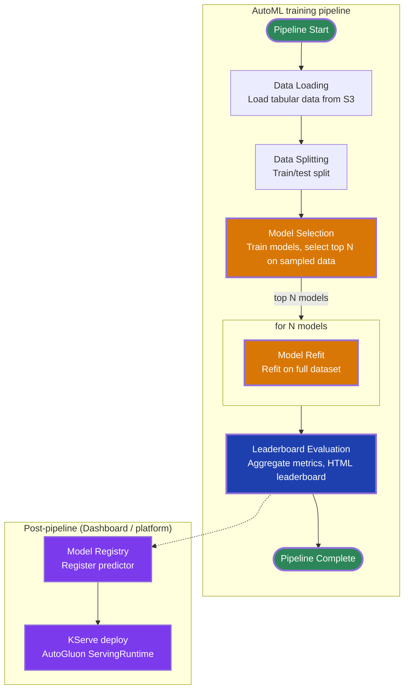

# Open Data Hub - AutoML Architecture Decision

|                |            |
| -------------- | ---------- |
| Date           | 2026-07-20 |
| Scope          | AutoML Component |
| Status         | Approved |
| Authors        | Lukasz Cmielowski |
| Supersedes     | N/A |
| Superseded by: | N/A |
| Tickets        | [RHAISTRAT-1066](https://redhat.atlassian.net/browse/RHAISTRAT-1066) |
| Other docs:    | [ODH-ADR-0002](./ODH-ADR-0002-experiment-settings.md) · [ODH-ADR-0003](./ODH-ADR-0003-model-insights.md) · [ODH-ADR-0004](./ODH-ADR-0004-mlflow-integration.md) |

## What

This ADR documents the architecture decision for AutoML, an automated system for building and optimizing tabular and time-series models within Red Hat OpenShift AI. AutoML uses Kubeflow Pipelines and AutoGluon to build, evaluate, and select predictors. Trained predictors can be registered in **RHOAI Model Registry** and deployed on **KServe** using the **AutoGluon ServingRuntime**.

AutoML provides **two separate pipelines** optimized for different use cases:

1. **Classification & Regression Pipeline** - For traditional tabular ML tasks (classification and regression)
2. **Time-Series Pipeline** - For time-series forecasting tasks

Each pipeline has distinct input parameters, defaults, and configurations tailored to its specific use case.

## Why

Manually building and optimizing tabular and time-series models is time-consuming and requires extensive ML expertise. This process involves:

- Feature engineering and data preprocessing
- Testing multiple model types and algorithms
- Hyperparameter tuning and optimization
- Model evaluation and selection
- Ensemble creation and refinement
- Model packaging and deployment preparation

AutoML automates this process, enabling users to:

- Automatically build and optimize models with minimal configuration
- Leverage AutoGluon's ensembling approach for high-performance models
- Generate production-ready predictors with comprehensive evaluation metrics
- Compare multiple models side-by-side with standardized metrics
- Register predictors in Model Registry and deploy them on KServe with the AutoGluon ServingRuntime

## Goals

* Provide automated ML model building and optimization for tabular and time-series data within RHOAI
* Integrate with existing RHOAI infrastructure (Kubeflow Pipelines, Model Registry, KServe / AutoGluon ServingRuntime)
* Support multiple ML task types (classification, regression, time-series forecasting)
* Generate production-ready AutoGluon Predictor models as registerable / deployable artifacts
* Enable evaluation using standardized metrics (accuracy, ROC-AUC, R², RMSE, MAPE, etc.)
* Support the pipeline-specific data formats and S3-compatible input contract in [ODH-ADR-0002](./ODH-ADR-0002-experiment-settings.md)
* Use RHOAI Connections for secure data access
* Provide both programmatic (API) and UI
* Support flexible configuration through optional parameters with sensible defaults

## Non-Goals

* Support for non-tabular data (images, text, audio)
* Traditional hyperparameter optimization (AutoGluon uses ensembling approach)
* Unsupervised learning support (e.g. clustering)
* Automatic Model Registry registration or KServe deployment as pipeline steps — those are post-training Dashboard / platform actions
* Requiring users or admins to build a custom AutoGluon serving image for the supported path (RHOAI provides the AutoGluon ServingRuntime image)

## How

AutoML is implemented as Kubeflow Pipelines that orchestrate the following workflow:

### Architecture Components

1. **Kubeflow Pipelines**: Orchestrates the model training workflow as a pipeline of containerized components
2. **Managed pipelines / reusable components**: Training pipelines are catalog-managed and composed from reusable components in [pipelines-components](https://github.com/red-hat-data-services/pipelines-components)
3. **AutoGluon Library**: Core ML optimization engine (open-source) that automatically builds, evaluates, and selects optimal models
4. **MLflow**: Provides experiment tracking, metrics logging, and artifact management for training runs
5. **RHOAI Model Registry**: Manages model versioning and metadata; entry point for post-training deploy
6. **KServe + AutoGluon ServingRuntime**: Serves registered AutoGluon predictors (Red Hat-provided runtime image; admin enables the runtime on the cluster)
7. **RHOAI Connections**: Manages secure access to data sources (S3, etc.) via Kubernetes Secrets

### Pipeline Workflow

The following flowchart illustrates the AutoML optimization workflow:

```mermaid
flowchart TB
    subgraph pipeline["AutoML training pipeline"]
        direction LR
        Start([Pipeline Start]) --> DataLoad["Data Loading<br/>Load tabular data from S3"]
        DataLoad --> DataSplit["Data Splitting<br/>Train/test split"]
        DataSplit --> ModelSelect["Model Selection<br/>Train models, select top N on sampled data"]
        ModelSelect -->|"top N models"| RefitLoop
        subgraph RefitLoop["for N models"]
            direction LR
            ModelRefit["Model Refit<br/>Refit on full dataset"]
        end
        RefitLoop --> Leaderboard["Leaderboard Evaluation<br/>Aggregate metrics, HTML leaderboard"]
        Leaderboard --> End([Pipeline Complete])
    end

    subgraph post["Post-pipeline (Dashboard / platform)"]
        Register["Model Registry<br/>Register predictor"] --> Deploy["KServe deploy<br/>AutoGluon ServingRuntime"]
    end

    Leaderboard -.-> Register

    style Start fill:#2d8659,color:#fff,stroke-width:3px
    style End fill:#2d8659,color:#fff,stroke-width:3px
    style ModelSelect fill:#d97706,color:#fff,stroke-width:3px
    style ModelRefit fill:#d97706,color:#fff,stroke-width:3px
    style Leaderboard fill:#1e40af,color:#fff,stroke-width:3px
    style Register fill:#7c3aed,color:#fff,stroke-width:2px
    style Deploy fill:#7c3aed,color:#fff,stroke-width:2px
```

**Workflow Steps:**

1. **Data Loading**: The pipeline loads the task-specific training data from S3-compatible storage. Parameter names and supported formats are defined in [ODH-ADR-0002](./ODH-ADR-0002-experiment-settings.md).
2. **Data Sampling & Splitting**: A preset-bounded subset of training data is used for initial model building to reduce computational cost.
Data is split into train/test sets using appropriate techniques:
   - random or stratified for classification
   - time-series split for forecasting
3. **Model Building & Selection**: Multiple models are built using sampled data and AutoGluon library. Models are evaluated and the best performers (top N) are promoted to the refit stage. Uses AutoGluon's ensembling approach (stacking/bagging) rather than traditional hyperparameter optimization.
4. **Model Refit**: Best candidate models are refit on the full training dataset using AutoGluon. This stage produces fully trained models ready for evaluation. Models are persisted as Model Artifacts.
5. **Leaderboard Evaluation**: Fully trained models and intermediate models are evaluated. A leaderboard is generated ranked by the specified evaluation metric. Provides comprehensive performance metrics for all models. Leaderboard, metrics, confusion matrix and feature importance is persisted as Artifact.
6. **Model Registry** (post-pipeline): Users select and register a refitted predictor artifact (for example, `{model_name}_FULL/predictor/` — the `clone_for_deployment` export) in **RHOAI Model Registry** with metadata for versioning and deployment. Do not register the leaderboard HTML or other run-summary artifacts.
7. **Model Deployment** (post-pipeline): Deploy that registered predictor artifact on **KServe** using the **AutoGluon ServingRuntime** (cluster runtime enabled by an admin; Red Hat-provided image).

**MLflow Logging**: When enabled by KFP-injected configuration, AutoML uses explicit MLflow APIs and nested runs; see [ODH-ADR-0004](./ODH-ADR-0004-mlflow-integration.md).

### KFP components

The training pipelines comprise:

   - Data Loading
   - Data Sampling and Splitting
   - Model Selection
   - Model Refitting
   - Leaderboard Evaluation
   - Notebook Generation (per-model predictor notebooks plus the run-level experiment notebook)

Model Registry registration and KServe deployment are platform / Dashboard flows outside the training pipeline.

### Input Parameters

The public pipeline contract uses explicit S3 references (`train_data_secret_name`, `train_data_bucket_name`, `train_data_file_key`), optional external test-data references, task fields, `preset`, `eval_metric`, and `top_n`. Time series additionally requires identifiers, timestamp, target, and forecast horizon. Exact names, defaults, supported formats, and metric constraints are defined in [ODH-ADR-0002](./ODH-ADR-0002-experiment-settings.md).

### Artifacts Generated

Each run emits refitted predictor artifacts, metrics and leaderboard artifacts, and a run-level experiment notebook. The per-model directory layout, `model.json`, insight artifacts, and serving schemas are defined in [ODH-ADR-0003](./ODH-ADR-0003-model-insights.md). The run-level experiment notebook is distinct from per-model predictor notebooks.

### Supported Features

- **Data Type**: Tabular and time-series data (formats vary by pipeline; see [ODH-ADR-0002](./ODH-ADR-0002-experiment-settings.md))
- **Data Sources**: S3-compatible storage
- **Supported Task Types**: 
  - Classification (Binary, Multiclass)
  - Regression
  - Time-series forecasting
- **Model Training**: AutoGluon library
- **Model Types**: Neural networks, tree-based models (XGBoost, LightGBM, CatBoost), linear models, and more
- **Ensembling**: Stacking and bagging approaches
- **Experiment Tracking**: MLflow — experiment tracking, metrics logging, and artifact management for training runs
- **Model Registry**: RHOAI Model Registry — register a selected refitted predictor artifact (e.g. `{model_name}_FULL/predictor/`) for versioning and deployment
- **Model Serving**: KServe with the **AutoGluon ServingRuntime** (Red Hat-provided image; admin enables the runtime). Users deploy registered models from Model Registry / Dashboard after training.
- **Interfaces**: API (programmatic), UI (RHOAI Dashboard)

## Alternatives

### Alternative 1: Manual Model Building and Optimization
**Approach**: Users manually build, tune, and optimize ML models
**Trade-offs**:
- ✅ Full control over model selection and hyperparameters
- ❌ Time-consuming and requires extensive ML expertise
- ❌ No systematic exploration of model types
- ❌ Difficult to create effective ensembles
- ❌ Manual feature engineering required

### Alternative 2: Traditional AutoML with Hyperparameter Optimization
**Approach**: Use AutoML frameworks that rely on extensive hyperparameter optimization (HPO)
**Trade-offs**:
- ✅ Systematic exploration of hyperparameter space
- ❌ Computationally expensive
- ❌ May overfit to validation data
- ❌ Longer training times
- ❌ More complex to tune and maintain

### Alternative 3: Custom ML Framework
**Approach**: Build custom automated ML framework from scratch
**Trade-offs**:
- ✅ Full control over optimization logic
- ❌ Significant development effort
- ❌ Requires ML expertise for model selection and ensembling
- ❌ Maintenance burden
- ❌ May not achieve state-of-the-art performance

**Selected Approach**: Use existing AutoGluon open-source library
**Rationale**: 
- Leverages proven ensembling approach (stacking/bagging) for high performance
- Reduces development and maintenance effort
- Provides production-ready predictors out of the box
- Actively maintained open-source project with strong community
- Does not require traditional HPO, making it more efficient
- Handles data preprocessing and feature engineering automatically

## Security and Privacy Considerations

* **Data Access**: AutoML uses RHOAI Connections (Kubernetes Secrets) for secure access to data sources, ensuring credentials are not exposed in pipeline parameters
* **Namespace Isolation**: Connections are namespace-scoped, preventing cross-namespace data access
* **Model Storage**: Trained models are stored in user-configured locations with appropriate access controls
* **Model Registry Access**: Model Registry credentials are managed through RHOAI, maintaining security boundaries
* **Model Serving**: KServe deployments using the AutoGluon ServingRuntime follow existing RHOAI serving security policies and access controls
* **Data Privacy**: Training data is processed within the pipeline execution environment and not persisted beyond configured storage locations

## Risks

* **Performance**: Model training can take significant time depending on dataset size, model complexity, and time limits. Benchmarking required to mitigate the risk.
* **Resource Consumption**: Large datasets and complex models may require substantial compute resources. Mitigation: apply the documented preset and resource limits.

## References

* [AutoGluon GitHub Repository](https://github.com/autogluon/autogluon)
* [Kubeflow Pipelines Components](https://github.com/red-hat-data-services/pipelines-components)
* [opendatahub-io/pipelines-components#235 — experiment notebook](https://github.com/opendatahub-io/pipelines-components/pull/235)
* [RHOAI Connections API ADR](/architecture-decision-records/operator/ODH-ADR-Operator-0009-connection-api.md)
* AutoML sibling ADRs:
  * [ODH-ADR-0002 — Experiment settings](./ODH-ADR-0002-experiment-settings.md)
  * [ODH-ADR-0003 — Model insights](./ODH-ADR-0003-model-insights.md)
* [AutoML component index](../../documentation/components/automl/README.md)

## Reviews

| Reviewed by  | Date      | Approval | Notes |
|--------------|-----------|----------|-------|
| Ana Biazetti | Jan, 27   | YES      | N/A   |
| Yuan Tang | Feb, 17th | YES      | N/A   |
