# Open Data Hub - AutoRAG Architecture Decision

|                |            |
| -------------- | ---------- |
| Date           | 2025-01-XX |
| Scope          | AutoRAG Component |
| Status         | Proposed |
| Authors        | Lukasz Cmielowski |
| Supersedes     | N/A |
| Superseded by: | N/A |
| Tickets        | TBD |
| Other docs:    | [AutoRAG Overview Documentation](../../documentation/components/autorag/overview.md) |

## What

This ADR documents the architecture decision for AutoRAG, an automated system for building and optimizing Retrieval-Augmented Generation (RAG) applications within Red Hat OpenShift AI. AutoRAG leverages Kubeflow Pipelines to orchestrate the optimization workflow, using the `ai4rag` optimization engine to systematically explore RAG configurations and identify optimal parameter settings.

## Why

Manually optimizing RAG applications is time-consuming and requires extensive experimentation with different configurations (chunking strategies, embedding models, retrieval methods, generation models). This process involves:
- Testing multiple combinations of parameters
- Evaluating performance across different metrics
- Iterating through configurations to find optimal settings
- Packaging and deploying optimized configurations

AutoRAG automates this process, enabling users to:
- Systematically explore the search space of RAG configurations
- Automatically identify optimal parameter settings
- Generate production-ready RAG Patterns with executable notebooks
- Compare multiple configurations side-by-side with standardized metrics

## Goals

* Provide automated optimization of RAG applications within RHOAI
* Integrate with existing RHOAI infrastructure (Kubeflow Pipelines, llama-stack, vector databases)
* Support flexible search space definition through constraints
* Generate production-ready RAG Patterns as deployable artifacts
* Enable evaluation using standardized metrics (answer_correctness, faithfulness, context_correctness)
* Support multiple document types and data sources (S3, local filesystem)
* Maintain compatibility with RHOAI Connections for secure data access
* Provide both programmatic (API) and UI interfaces

## Non-Goals

* Support for languages other than English (initially)
* Support for vector databases other than Milvus/Milvus Lite
* Direct LLM provider integration (uses llama-stack abstraction)
* Multi-tenant optimization (single experiment per run)

## How

AutoRAG is implemented as a Kubeflow Pipeline that orchestrates the following workflow:

### Architecture Components

1. **Kubeflow Pipelines**: Orchestrates the optimization workflow as a pipeline of containerized components
2. **ai4rag Engine**: Core optimization engine (open-source from IBM) that explores configurations and selects optimal parameters
3. **llama-stack API**: Provides LLM inference capabilities and vector database management
4. **Vector Databases**: Stores and manages document embeddings (supports Milvus and Milvus Lite)
5. **RHOAI Connections**: Manages secure access to data sources (S3, etc.) via Kubernetes Secrets

### Pipeline Workflow

The following flowchart illustrates the AutoRAG optimization workflow:

```mermaid
flowchart LR
    Start([Pipeline Start]) --> DataIngestion[Data Ingestion]
    DataIngestion --> DocProcessing[Document Processing]
    DocProcessing --> SearchSpace[Search Space Definition]
    SearchSpace --> ModelValidation[Model Validation]
    ModelValidation --> OptLoop{Optimization Loop}
    OptLoop --> SelectConfig[Select Config]
    SelectConfig --> ExecuteRAG[Execute RAG]
    ExecuteRAG --> Evaluate[Evaluate]
    Evaluate --> UpdateLeaderboard[Update Leaderboard]
    UpdateLeaderboard --> CheckMax{Max patterns?}
    CheckMax -->|No| OptLoop
    CheckMax -->|Yes| PatternGen[Pattern Generation]
    PatternGen --> ResultsStorage[Results Storage]
    ResultsStorage --> End([Complete])
    
    style Start fill:#2d8659,color:#fff
    style End fill:#2d8659,color:#fff
    style OptLoop fill:#d97706,color:#fff
    style CheckMax fill:#d97706,color:#fff
    style PatternGen fill:#1e40af,color:#fff
```

**Workflow Steps:**

1. **Data Ingestion**: Documents are loaded from configured data sources (S3 or local filesystem) and test data is loaded for evaluation
2. **Document Processing**: Documents are sampled, text is extracted using `docling` library, and content is prepared for indexing
3. **Search Space Definition**: Based on provided constraints (or defaults), the system defines the search space of possible RAG configurations
4. **Model Validation**: Available models are validated and preselected based on performance criteria using in-memory vector database
5. **Optimization Loop**: The system iteratively:
   - Selects promising configurations using GAM-based prediction
   - Executes RAG pipeline with selected configuration
   - Evaluates performance using test data
   - Updates the leaderboard with results
6. **Pattern Generation**: Top-performing configurations are packaged as RAG Patterns with executable notebooks
7. **Results Storage**: All artifacts, metrics, and logs are stored in the configured results location

### Input Parameters

The pipeline accepts parameters organized into logical groups:

**Required Parameters:**
- Experiment metadata (name, description)
- Input data sources (document data, test data)
- Infrastructure configuration (vector database ID, results storage)

**Optional Parameters:**
- Optimization settings (max patterns, metric to optimize)
- Search space constraints (chunking, embeddings, generation, retrieval)

When optional parameters are omitted, AutoRAG uses default values or explores the full available search space.

### Artifacts Generated

For each pipeline run, AutoRAG generates:

1. **RAG Pattern Artifacts** (multiple): Each optimized configuration packaged with:
   - Pattern metadata with configuration settings and evaluation metrics
   - URI to tar archive with executable notebooks (index building, retrieval/generation)
   - Performance metrics (answer_correctness, faithfulness, context_correctness)

2. **AutoRAG Run Artifact** (single): Run-level artifact with status and execution details

3. **AutoRAG Experiment Summary** (Markdown): Comprehensive report including data preparation details, search space, explored configurations, and leaderboard

### Supported Features (Tech Preview - MVP)

- **RAG Type**: Documents (documents provided as input)
- **Languages**: English
- **Document Types**: PDF, DOCX, PPTX, Markdown, HTML, Plain text
- **Data Sources**: S3 (Amazon S3), Local filesystem (FS)
- **Vector Databases**: Milvus, Milvus Lite
- **LLM Provider**: Llama-stack
- **Chunking Method**: Recursive
- **Retrieval Methods**: Simple, Simple with hybrid ranker
- **Interfaces**: API (programmatic), UI (RHOAI Dashboard)

## Alternatives

### Alternative 1: Manual Configuration and Optimization
**Approach**: Users manually experiment with different RAG configurations
**Trade-offs**:
- ✅ Full control over configuration
- ❌ Time-consuming and requires expertise
- ❌ No systematic exploration of search space
- ❌ Difficult to compare configurations objectively

### Alternative 2: Grid Search / Random Search
**Approach**: Exhaustive or random search through configuration space
**Trade-offs**:
- ✅ Simple to implement
- ❌ Inefficient for large search spaces
- ❌ No intelligent selection of next configurations
- ❌ May miss optimal configurations

### Alternative 3: Custom Optimization Framework
**Approach**: Build custom optimization framework from scratch
**Trade-offs**:
- ✅ Full control over optimization logic
- ❌ Significant development effort
- ❌ Requires ML expertise for optimization algorithms
- ❌ Maintenance burden

**Selected Approach**: Use existing `ai4rag` open-source engine
**Rationale**: 
- Leverages proven optimization algorithms (GAM-based prediction)
- Reduces development and maintenance effort
- Provides LLM and Vector Database provider agnostic design
- Actively maintained open-source project

## Security and Privacy Considerations

* **Data Access**: AutoRAG uses RHOAI Connections (Kubernetes Secrets) for secure access to data sources, ensuring credentials are not exposed in pipeline parameters
* **Namespace Isolation**: Connections are namespace-scoped, preventing cross-namespace data access
* **Vector Database Access**: Vector database credentials are managed through llama-stack, maintaining security boundaries
* **Artifact Storage**: Results are stored in user-configured locations with appropriate access controls
* **Model Access**: LLM model access is managed through llama-stack API, maintaining existing security policies

## Risks

* **Performance**: Optimization runs can take significant time depending on search space size and number of iterations
* **Resource Consumption**: Large document sets and extensive search spaces may require substantial compute resources
* **Model Availability**: Optimization depends on model availability through llama-stack, which may impact results
* **Search Space Complexity**: Very large or poorly constrained search spaces may not converge to optimal solutions efficiently

## Stakeholder Impacts

| Group              | Key Contacts     | Date       | Impacted? |
| ------------------ | ---------------- | ---------- | --------- |
| Data Science Pipelines Team | TBD | TBD | YES |
| LLM/Model Serving Team | TBD | TBD | YES |
| Dashboard Team     | TBD | TBD | YES |
| Platform Team      | TBD | TBD | YES |

## References

* [AutoRAG Overview Documentation](../../documentation/components/autorag/overview.md)
* [AutoRAG Artifacts Documentation](../../documentation/components/autorag/artifacts.md)
* [ai4rag GitHub Repository](https://github.com/IBM/ai4rag)
* [Kubeflow Pipelines Components](https://github.com/kubeflow/pipelines-components)
* [RHOAI Connections API ADR](../operator/ODH-ADR-Operator-0009-connection-api.md)

## Reviews

| Reviewed by | Date | Approval | Notes |
| ----------- | ---- | -------- | ----- |
| TBD         | TBD  | TBD      | TBD   |
