# Open Data Hub - AutoRAG Architecture Decision

|                |            |
| -------------- | ---------- |
| Date           | 2026-01-21 |
| Scope          | AutoRAG Component |
| Status         | Proposed |
| Authors        | Lukasz Cmielowski |
| Supersedes     | N/A |
| Superseded by: | N/A |
| Tickets        | TBD |
| Other docs:    | N/A |

## What

This ADR documents the architecture decision for AutoRAG, an automated system for building and optimizing Retrieval-Augmented Generation (RAG) applications within Red Hat OpenShift AI. AutoRAG leverages Kubeflow Pipelines to orchestrate the optimization workflow, using the `ai4rag` optimization engine to systematically explore RAG configurations and identify optimal parameter settings.

## Why

Manually optimizing RAG applications is time-consuming and requires extensive experimentation with different configurations (chunking strategies, embedding models, retrieval methods, generation models). This process involves:
- Testing multiple combinations of parameters
- Evaluating performance across different metrics
- Iterating through configurations to find optimal settings
- Packaging and deploying optimized configurations

AutoRAG automates this process, enabling users to:
- Systematically explore the search space of RAG configurations
- Automatically identify optimal parameter settings
- Generate production-ready RAG Patterns with executable notebooks
- Compare multiple configurations side-by-side with standardized metrics

## Goals

* Provide automated optimization of RAG applications within RHOAI
* Integrate with existing RHOAI infrastructure (Kubeflow Pipelines, llama-stack, vector databases, MLflow)
* Support flexible search space definition through constraints
* Generate production-ready RAG Patterns as deployable artifacts
* Enable evaluation using standardized metrics (answer_correctness, faithfulness, context_correctness)
* Support multiple document types and data sources (S3, local filesystem)
* Maintain compatibility with RHOAI Connections for secure data access
* Provide both programmatic (API) and UI

## Non-Goals
* Auto LLM deployment / shut down for experiment run purposes
* Direct LLM provider or Vector Database integration (uses llama-stack abstraction)
* Multi-modal RAG support (images, audio, video in documents)
* LLM fine-tuning or model training capabilities
* Optimization resume/checkpointing for interrupted runs

## How

AutoRAG is implemented as a Kubeflow Pipeline that orchestrates the following workflow:

### Architecture Components

1. **Kubeflow Pipelines**: Orchestrates the optimization workflow as a pipeline of containerized components
2. **ai4rag Engine**: Core optimization engine (open-source from IBM) that explores configurations and selects optimal parameters
3. **llama-stack API**: Provides LLM inference capabilities and vector database management
4. **Vector Databases**: Stores and manages document embeddings (supports Milvus and Milvus Lite)
5. **MLFlow**: Provides experiment tracking, metrics logging, and artifact management for optimization runs
6. **RHOAI Connections**: Manages secure access to data sources (S3, etc.) via Kubernetes Secrets

### Pipeline Workflow

The following flowchart illustrates the AutoRAG optimization workflow:

```mermaid
flowchart LR
    Start([Pipeline Start]) --> DataIngestion["Data Ingestion<br/>Load documents & test data"]
    DataIngestion --> DocProcessing["Document Processing<br/>Sample & extract text"]
    DocProcessing --> SearchSpace["Search Space Definition<br/>Define configurations & validate models"]
    SearchSpace --> OptLoop{"Optimization<br/>Loop"}
    OptLoop --> SelectConfig["Select Configuration<br/>GAM prediction"]
    SelectConfig --> ExecuteRAG["Execute RAG Pipeline<br/>Run configuration"]
    ExecuteRAG --> Evaluate["Evaluate Performance<br/>Test data metrics"]
    Evaluate --> MLFlowLog["MLFlow Logging<br/>Log metrics & config"]
    MLFlowLog --> UpdateLeaderboard["Artifacts storage<br/>RAG Pattern"]
    UpdateLeaderboard --> CheckMax{"Reached max<br/>patterns?"}
    CheckMax -->|No| OptLoop
    CheckMax -->|Yes| ResultsStorage["Artifacts Storage<br/>Leaderboard & logs"]
    ResultsStorage --> MLFlowFinal["MLFlow Finalize<br/>Log experiment summary"]
    MLFlowFinal --> End([Pipeline Complete])
    
    style Start fill:#2d8659,color:#fff,stroke-width:3px
    style End fill:#2d8659,color:#fff,stroke-width:3px
    style OptLoop fill:#d97706,color:#fff,stroke-width:3px
    style CheckMax fill:#d97706,color:#fff,stroke-width:3px
    style MLFlowLog fill:#9333ea,color:#fff,stroke-width:2px
    style MLFlowFinal fill:#9333ea,color:#fff,stroke-width:2px
```

**Workflow Steps:**

📝 **Note:** The AutoRAG experiment uses sample of documents for optimization purposes. The generated artifact is designed for full data load.

1. **Data Ingestion**: Documents are loaded from configured data sources (S3 or local filesystem) and test data is loaded for evaluation
2. **Document Processing**: Documents are **sampled** using a test data-driven approach (load documents referenced in ground truth records first, then add noise documents). Text is extracted using the `docling` library, and content (markdown files) is prepared for indexing
3. **Search Space Definition**: Based on provided constraints (or defaults), the system defines the search space of possible RAG configurations. Available models are validated and preselected based on performance criteria using an in-memory vector database
4. **RAG Templates Optimization**: (runs on the sample of data). The system iteratively:
   - Selects promising configurations using GAM-based prediction
   - Executes RAG Pattern with selected configuration
   - Evaluates performance using test data
   - Generates RAG Pattern artifacts
   - Logs metrics and configuration to MLFlow (if enabled)
   - Updates the leaderboard with results

5. **Results Storage**: All artifacts, metrics, and logs are stored in the configured results location
6. **MLFlow Finalization**: Experiment summary, final metrics, and artifact references are logged to MLFlow (if enabled)

### Input Parameters

The pipeline accepts parameters organized into logical groups:

**Required Parameters:**
- Experiment metadata (`name`)
- Input data sources (document data reference, test data reference)
- Infrastructure configuration (vector database ID)

**Optional Parameters:**
- Experiment metadata (`description`)
- Optimization settings:
  - `max_patterns`: Maximum number of patterns to generate (default: explores full search space)
  - `optimization_metric`: Metric to optimize (e.g., `answer_correctness`, `faithfulness`, `context_correctness`)
- Search space constraints:
  - Chunking parameters (chunk size, overlap)
  - Embedding model selection
  - Generation model selection
  - Generation parameters settings
  - Retrieval method selection (e.g.: Simple, Simple with hybrid ranker)
- MLFlow configuration for experiment tracking

When optional parameters are omitted, AutoRAG uses default values or explores the full available search space.

### Artifacts Generated

For each pipeline run, AutoRAG generates:

1. **RAG Pattern Artifacts** (multiple): Each optimized configuration packaged with:
   - Pattern metadata with configuration settings and performance metrics
   - URI to folder with executable notebooks (index building, retrieval/generation) and evaluation.json file (containing ground truth and answers)
   
   📝 **Note:** The index building notebook processes documents in batches.

2. **AutoRAG Run Artifact** (single): Run-level artifact named `autorag_output` with status properties and URI to log file with execution details

3. **AutoRAG Experiment Summary** (Markdown): Artifact named `autorag_run_summary` providing a comprehensive report including:
   - Data preparation details
   - Search space definition
   - Explored configurations and leaderboard
   - Links to remaining artifacts

### Supported Features

Status: Tech Preview

- **RAG Type**: Documents (documents provided as input)
- **Languages**: English
- **Document Types**: PDF, DOCX, PPTX, Markdown, HTML, Plain text
- **Data Sources**: S3, Local filesystem (FS)
- **Vector Databases**: Milvus, Milvus Lite
- **LLM Provider**: Llama-stack
- **Experiment Tracking**: MLFlow (optional) - For experiment tracking, metrics logging, and artifact management
- **Chunking Method**: Recursive chunking
- **Retrieval Methods**: 
  - Simple: Basic vector similarity search
  - Simple with hybrid ranker: Vector similarity search combined with a reranking step to improve relevance
- **Interfaces**: API (programmatic), UI (RHOAI Dashboard)

### Future Enhancements

* Multi-lingual support (prompt engineering)
* LLM as a Judge metrics
* Test data generation (SDG - either existing component or docling-sdg)
* Parallel optimization runs or distributed optimization
* Generating Kubeflow Pipeline as output artifact for index building (in the MVP, Jupyter notebook is produced only). Load testing/benchmarking of index building artifact will be performed, including investment in parallel data ingestion
* Generating RAG Pattern application (retrieval & generation) that can be deployed as completion endpoint (Kagenti)

## Alternatives

### Alternative 1: Manual Configuration and Optimization
**Approach**: Users manually experiment with different RAG configurations
**Trade-offs**:
- ✅ Full control over configuration
- ❌ Time-consuming and requires expertise
- ❌ No systematic exploration of search space
- ❌ Difficult to compare configurations objectively

### Alternative 2: Grid Search / Random Search
**Approach**: Exhaustive or random search through configuration space
**Trade-offs**:
- ✅ Simple to implement
- ❌ Inefficient for large search spaces
- ❌ No intelligent selection of next configurations
- ❌ May miss optimal configurations

### Alternative 3: Custom Optimization Framework
**Approach**: Build custom optimization framework from scratch
**Trade-offs**:
- ✅ Full control over optimization logic
- ❌ Significant development effort
- ❌ Requires ML expertise for optimization algorithms
- ❌ Maintenance burden

**Selected Approach**: Use existing `ai4rag` open-source engine
**Rationale**: 
- Leverages proven optimization algorithms (GAM-based prediction)
- Reduces development and maintenance effort
- Provides LLM and Vector Database provider agnostic design
- Actively maintained open-source project

## Security and Privacy Considerations

* **Data Access**: AutoRAG uses RHOAI Connections (Kubernetes Secrets) for secure access to data sources, ensuring credentials are not exposed in pipeline parameters
* **Namespace Isolation**: Connections are namespace-scoped, preventing cross-namespace data access
* **Vector Database Access**: Vector database credentials are managed through llama-stack, maintaining security boundaries
* **Artifact Storage**: Results are stored in user-configured locations with appropriate access controls
* **Model Access**: LLM model access is managed through llama-stack API, maintaining existing security policies
* **Data Privacy**: Documents and test data are processed within the pipeline execution environment and not persisted beyond configured storage locations

## References

* [ai4rag GitHub Repository](https://github.com/IBM/ai4rag)
* [Kubeflow Pipelines Components](https://github.com/kubeflow/pipelines-components)
* [RHOAI Connections API ADR](/architecture-decision-records/operator/ODH-ADR-Operator-0009-connection-api.md)

## Reviews

| Reviewed by | Date | Approval  | Notes |
| ----------- | ---- |-----------|-------|
| Francisco Javier Arceo | TBD  | Jan, 29th | N/A   |
