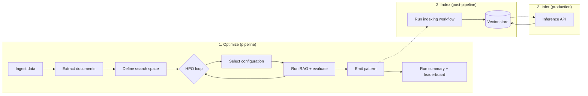

# Open Data Hub - AutoRAG Architecture Decision

|                |            |
| -------------- | ---------- |
| Date           | 2026-08-28 |
| Scope          | AutoRAG Component |
| Status         | Approved |
| Authors        | Lukasz Cmielowski |
| Supersedes     | N/A |
| Superseded by: | N/A |
| Tickets        | [RHAISTRAT-188](https://redhat.atlassian.net/browse/RHAISTRAT-188) · [RHAISTRAT-2623](https://redhat.atlassian.net/browse/RHAISTRAT-2623) |
| Other docs:    | [ODH-ADR-0002](./ODH-ADR-0002-experiment-settings.md) · [ODH-ADR-0003](./ODH-ADR-0003-rag-templates.md) · [ODH-ADR-0004](./ODH-ADR-0004-rag-pattern-inference.md) · [ODH-ADR-0005](./ODH-ADR-0005-rag-pattern-evaluation.md) · [ODH-ADR-0006](./ODH-ADR-0006-mlflow-integration.md) |

## What

This ADR documents the architecture decision for AutoRAG, an automated system for building and optimizing Retrieval-Augmented Generation (RAG) applications within Red Hat OpenShift AI. AutoRAG uses Kubeflow Pipelines to orchestrate a hyperparameter optimization (HPO) workflow, explore a configurable RAG search space, and select parameter settings using GAM-based prediction.

## Why

Manually optimizing RAG applications is time-consuming and requires extensive experimentation with different configurations (chunking strategies, embedding models, retrieval methods, generation models). This process involves:
- Testing multiple combinations of parameters
- Evaluating performance across different metrics
- Iterating through configurations to find optimal settings
- Packaging optimized configurations for indexing and inference

AutoRAG automates this process, enabling users to:
- Systematically explore the search space of RAG configurations
- Automatically identify optimal parameter settings
- Generate production-ready **RAG patterns** as portable artifacts
- Compare multiple configurations side-by-side with standardized metrics

## Goals

* Provide automated optimization of document RAG applications within RHOAI
* Integrate with existing RHOAI infrastructure (Kubeflow Pipelines, MaaS for chat and embeddings, database services, MLflow)
* Support flexible search space definition through constraints and presets
* Emit production-ready RAG patterns that separate **optimization**, **indexing**, and **inference** concerns
* Enable evaluation using standardized, comparable metrics on user-provided benchmark data
* Support multiple document types and data sources (S3, local filesystem)
* Maintain compatibility with RHOAI Connections for secure data access
* Provide both programmatic (API) and UI interfaces

## Non-Goals

* Auto LLM deployment / shut down for experiment run purposes
* Direct coupling to a specific LLM vendor or database product (access goes through platform abstractions)
* LLM fine-tuning or model training capabilities
* Optimization resume/checkpointing for interrupted runs

## How

AutoRAG is implemented as a Kubeflow Pipeline. The pipeline optimizes on a **document sample**; pattern artifacts are designed for **full-corpus indexing** and production inference.

### Architecture Components

| Component | Responsibility |
| --------- | -------------- |
| **Kubeflow Pipelines** | Orchestrates the optimization workflow as containerized components |
| **Managed pipelines** | Optimization and indexing ship as catalog-managed pipelines composed from reusable **pipelines-components** |
| **Optimization engine** | Search-space exploration, GAM-based configuration selection, pattern assembly, benchmark evaluation |
| **Document extraction** | Structured extraction from source documents (Docling) |
| **MaaS** | Chat completions, embeddings, model discovery, and Ragas evaluation via the MaaS Connection — see [ODH-ADR-0002](./ODH-ADR-0002-experiment-settings.md#connections) |
| **Database store** | Simple RAG uses a persistent vector index via LangChain adapters (Milvus / PGVector); Graph RAG uses Neo4j graph, vector, and full-text indexes. `db_secret_name` selects the backend. |
| **MLflow** | Optional experiment tracking, metrics, and tracing when enabled at the project level |
| **RHOAI Connections** | Secure, namespace-scoped credentials for data sources and platform endpoints |

Operational detail for each layer (parameter names, search-space dimensions, metric backends, MaaS / vector Connections, MLflow) lives in sibling AutoRAG ADRs (ODH-ADR-0002 through ODH-ADR-0006).

### Lifecycle Phases

AutoRAG spans three phases. Only the first runs inside the optimization pipeline; the others are driven by pattern artifacts.

```mermaid
flowchart LR
    subgraph optimize["1. Optimize (pipeline)"]
        Ingest[Ingest data] --> Extract[Extract documents]
        Extract --> SearchSpace[Define search space]
        SearchSpace --> Loop{HPO loop}
        Loop --> Select[Select configuration]
        Select --> Run[Run RAG + evaluate]
        Run --> Emit[Emit pattern]
        Run --> Loop
        Emit --> Summary[Run summary + leaderboard]
    end

    subgraph index["2. Index (post-pipeline)"]
        IndexRun[Run indexing workflow] --> VectorStore[(Vector store)]
    end

    subgraph infer["3. Infer (production)"]
        InferAPI[Inference API] --> VectorStore
    end

    Emit -.-> IndexRun
    VectorStore -.-> InferAPI
```

**Phase 1 — Optimize (pipeline):**

1. **Ingest** — Load source documents and benchmark (test) data from configured sources
2. **Extract** — Sample documents relevant to the benchmark, then extract structured content
3. **Define search space** — Apply constraints, validate models, and materialize the configuration search space
4. **HPO loop** — Iteratively select configurations (GAM), execute RAG on the sample, evaluate against the benchmark, and emit ranked **patterns** until a pattern budget is reached
5. **Finalize** — Store run artifacts, leaderboard, and optional MLflow experiment summary

**Phase 2 — Index** — User selects a pattern and runs an indexing workflow against the **full document corpus**, populating the vector store referenced by that pattern.

**Phase 3 — Infer** — Consumers retrieve from the pattern's `store_binding` (query embeddings via MaaS) and call MaaS chat completions assembled from `settings.generation` ([ODH-ADR-0004](./ODH-ADR-0004-rag-pattern-inference.md)).

### Pipeline Inputs (categories)

The pipeline surface is defined in [ODH-ADR-0002-experiment-settings](./ODH-ADR-0002-experiment-settings.md). At the architectural level, inputs fall into:

| Category | Purpose |
| -------- | ------- |
| **Data references** | One to ten document locations (object keys or prefixes) in one Connection/bucket, plus benchmark data for evaluation ([ODH-ADR-0002](./ODH-ADR-0002-experiment-settings.md#corpus-locations)) |
| **Platform credentials** | MaaS Connection (chat and embeddings) and one generic database Connection (`db_secret_name`): vector DB for simple RAG or Neo4j for Graph RAG |
| **Optimization controls** | Pattern budget, objective metric, quality preset |
| **Search-space constraints** | Optional allow-lists and bounds on chunking, embedding, retrieval, and generation dimensions |

When optional constraints are omitted, AutoRAG applies defaults or explores the available search space.

### Artifacts

Each optimization run produces run-level and per-pattern artifacts. **File names, layout, and `pattern.json` schema:** [ODH-ADR-0004 — Pattern artifacts](./ODH-ADR-0004-rag-pattern-inference.md#pattern-artifacts). Evaluation row schema: [ODH-ADR-0005](./ODH-ADR-0005-rag-pattern-evaluation.md).

At the architectural level:

| Concern | Role |
| -------- | ---- |
| **Optimize** | Emit portable RAG patterns (settings, indexing spec, evaluation) |
| **Index** | Full-corpus indexing from the pattern record (managed pipeline or notebook) |
| **Infer / deploy** | Retrieve-and-generate from `settings` ([ODH-ADR-0004](./ODH-ADR-0004-rag-pattern-inference.md)): notebook, Helm zip, or one-click Agent Sandbox. Dashboard tests a pattern via the AutoRAG BFF ([test endpoint](./ODH-ADR-0004-rag-pattern-inference.md#test-endpoint)); that path is not the agent contract. |

### Scope

Architectural boundaries:

| Dimension | In scope |
| --------- | -------- |
| **RAG type** | Document RAG (user-provided corpora) |
| **Languages** | English-primary (language handling may evolve in prompts and detection) |
| **Document types** | PDF, DOCX, PPTX, Markdown (including QMD/Rmd), HTML/XHTML, plain text, ODT, ODP, AsciiDoc, LaTeX, EPUB, and EML. This list is extensible; OCR-derived content and audio sources are future extensions, not current pipeline inputs. |
| **Data sources** | S3-compatible storage, local filesystem |
| **Search space** | Chunking, embedding, retrieval, and generation dimensions (see [ODH-ADR-0002](./ODH-ADR-0002-experiment-settings.md), [ODH-ADR-0003](./ODH-ADR-0003-rag-templates.md)) |
| **Evaluation** | Standardized metrics on user benchmark data with selectable optimization objective ([ODH-ADR-0005](./ODH-ADR-0005-rag-pattern-evaluation.md)) |
| **Observability** | Optional MLflow tracking aligned with the AutoML parent/child run model |
| **Interfaces** | Programmatic API and RHOAI Dashboard UI |

Specific parameter names, presets, retrieval modes, and metric backends are detailed in sibling ADRs rather than this parent overview.

## Alternatives

### Alternative 1: Manual Configuration and Optimization
**Approach**: Users manually experiment with different RAG configurations
**Trade-offs**:
- ✅ Full control over configuration
- ❌ Time-consuming and requires expertise
- ❌ No systematic exploration of search space
- ❌ Difficult to compare configurations objectively

### Alternative 2: Grid Search / Random Search
**Approach**: Exhaustive or random search through configuration space
**Trade-offs**:
- ✅ Simple to implement
- ❌ Inefficient for large search spaces
- ❌ No intelligent selection of next configurations
- ❌ May miss optimal configurations

### Alternative 3: Custom Optimization Framework
**Approach**: Build custom optimization framework from scratch
**Trade-offs**:
- ✅ Full control over optimization logic
- ❌ Significant development effort
- ❌ Requires ML expertise for optimization algorithms
- ❌ Maintenance burden

**Selected Approach**: Use existing `ai4rag` open-source engine
**Rationale**: 
- Leverages proven optimization algorithms (GAM-based prediction)
- Reduces development and maintenance effort
- Provides LLM and vector store provider-agnostic design at the optimization layer
- Actively maintained open-source project

## Security and Privacy Considerations

* **Data Access**: AutoRAG uses RHOAI Connections (Kubernetes Secrets) for secure access to data sources; credential names — not secret values — appear in pipeline parameters
* **Namespace Isolation**: Connections are namespace-scoped, preventing cross-namespace data access
* **Platform and database access**: MaaS credentials (`maas_secret_name`) for chat and embeddings; `db_secret_name` selects the vector database for simple RAG or Neo4j for Graph RAG. All are Connections/secrets.
* **Artifact Storage**: Results are stored in user-configured pipeline artifact locations with appropriate access controls
* **Data Privacy**: Documents and test data are processed within the pipeline execution environment; retention follows configured storage policies

## References

* [ai4rag GitHub Repository](https://github.com/IBM/ai4rag)
* [Kubeflow Pipelines Components](https://github.com/red-hat-data-services/pipelines-components/tree/main/pipelines/training/autorag)
* [RHOAI Connections API ADR](/architecture-decision-records/operator/ODH-ADR-Operator-0009-connection-api.md)
* AutoRAG sibling ADRs:
  * [ODH-ADR-0002 — Optimization settings](./ODH-ADR-0002-experiment-settings.md)
  * [ODH-ADR-0003 — RAG templates](./ODH-ADR-0003-rag-templates.md)
  * [ODH-ADR-0004 — Pattern inference](./ODH-ADR-0004-rag-pattern-inference.md)
  * [ODH-ADR-0005 — Pattern evaluation](./ODH-ADR-0005-rag-pattern-evaluation.md)
  * [ODH-ADR-0006 — MLflow integration](./ODH-ADR-0006-mlflow-integration.md)
* [AutoRAG component index](../../documentation/components/autorag/README.md)

## Reviews

| Reviewed by | Date | Approval | Notes |
| ----------- | ---- |----------|-------|
| Francisco Javier Arceo |  Jan, 29th | YES | N/A   |
