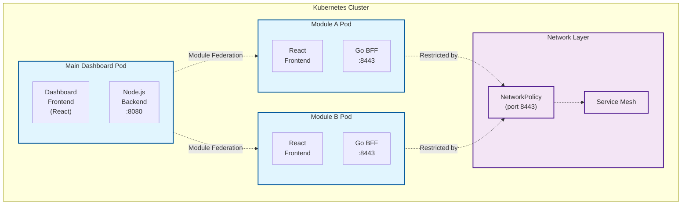
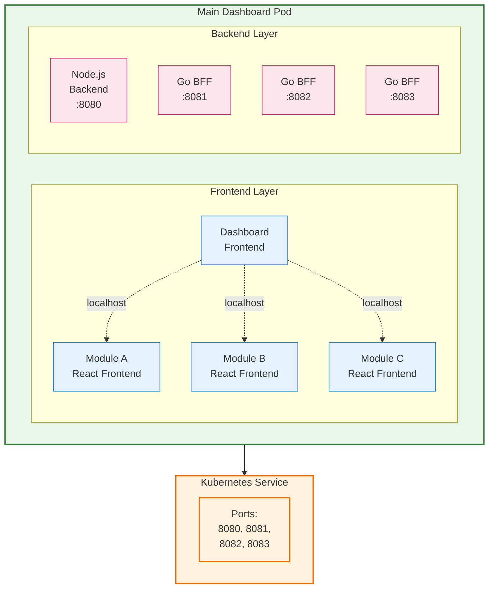
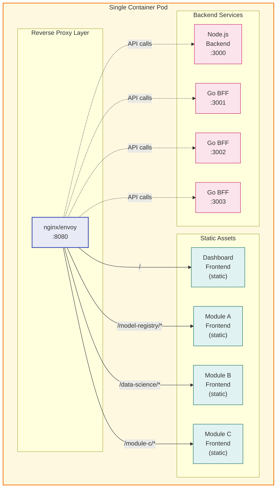

# Open Data Hub - Architecture Decision Record: Modular Architecture Deployment Strategy

|                |            |
| -------------- | ---------- |
| Date           | July 18, 2025 |
| Scope          | ODH Dashboard Modular Architecture Deployment |
| Status         | Approved |
| Authors        | [Lucas Fernandez](@lferrnan) |
| Supersedes     | N/A |
| Superseded by: | N/A |
| Tickets        | RHOAIENG-25523 |
| Other docs:    | [Module Federation Documentation](frontend/config/moduleFederation.js) |

## What

This ADR defines the deployment strategy for the new modular architecture of the Open Data Hub Dashboard, where the monolithic dashboard is being refactored into micro-frontends using Webpack Module Federation. Each module consists of a React frontend and Go Backend-for-Frontend (BFF) service.

## Why

The ODH Dashboard is transitioning from a monolithic to a modular micro-frontend architecture to enable independent development, deployment, and scaling of features. We need to decide between three deployment strategies: Independent Pod Deployments, Multi-Container Pod Deployment, or Single Container Bundle Deployment. This decision impacts resource utilization, operational complexity, security posture, development velocity, and runtime behavior.

## Goals

* Enable independent development and deployment of dashboard features
* Improve scalability and maintainability of the ODH Dashboard
* Allow selective feature deployment based on controller availability
* Reduce coupling between different MLOps platform components
* Maintain security boundaries and fault isolation
* Support Kubernetes-native operations and patterns
* Facilitate team independence for module development

## Non-Goals

* Complete rewrite of existing dashboard functionality
* Breaking changes to existing user workflows
* Immediate migration of all features to modules
* Support for non-Kubernetes deployment environments

## How

### Decision: Independent Pod Deployments (Option 1)

Each federated module will be deployed as a separate Kubernetes Pod with its own Service, NetworkPolicy, and dedicated resources. This approach provides true microservice isolation while leveraging Kubernetes-native orchestration capabilities.

### Current Implementation

Based on the roadmap of Modular Architecture, the proposed implementation will consist of:

**Architecture Components:**

* **Frontend**: React-based micro-frontends built with Webpack Module Federation
* **BFF (Backend-for-Frontend)**: Go-based services serving static assets and API proxying
* **Module Federation Config**: Dynamic configuration through Kubernetes ConfigMaps
* **Security**: TLS-enabled communication with certificate management
* **Authentication**: User token-based auth with header forwarding

**Example Module Structure** (Model Registry):

```text
frontend/packages/model-registry/
├── Dockerfile                    # Multi-stage build (Node.js + Go + Distroless)
├── manifests/base/              # Kubernetes manifests
│   ├── kustomization.yaml
│   ├── model-registry-ui-deployment.yaml
│   ├── model-registry-ui-service.yaml
│   ├── model-registry-ui-service-account.yaml
│   └── model-registry-ui-network-policy.yaml
```

**Resource Allocation (per module):**

* CPU: 500m requests/500m limits
* Memory: 2Gi requests/2Gi limits
* Port: 8443 (HTTPS with TLS)

### Implementation Details

* Each module runs in its own Pod with dedicated resources
* NetworkPolicies restrict traffic to main dashboard only
* TLS certificates managed per service
* Module Federation configuration via ConfigMap

### Architecture Diagram



## Open Questions

* Resource optimization strategies for production deployments
* Performance impact measurement and benchmarking approach
* Rollback strategy for failed module deployments

**Tradeoffs:**

* ✅ Easy to scale and manage modules independently
* ❌ Not resource-efficient for small modules, higher operational complexity, involvement of Platform team for deployment

## Alternatives

### Option 2: Multi-Container Pod Deployment

All federated modules deployed as additional containers within the main Dashboard Pod, sharing the same network namespace but running in separate containers.

**Architecture:**



**Tradeoffs:**

* ✅ Resource efficiency, simplified networking, faster communication
* ❌ Coupled lifecycle, no independent scaling, fault propagation

### Option 3: Single Container Bundle Deployment

All modules built into a single container image with a reverse proxy routing requests based on paths.

**Architecture:**



**Tradeoffs:**

* ✅ Maximum resource efficiency, simplified deployment, fast startup
* ❌ Monolithic deployment, no selective deployment, complex build process

### Comparison Matrix

| Criteria | Independent Pods | Multi-Container Pod | Single Container |
|----------|------------------|---------------------|------------------|
| **Resource Efficiency** | ❌ Low | ✅ Medium | ✅ High |
| **Fault Isolation** | ✅ High | ⚠️ Medium | ❌ Low |
| **Independent Deployment** | ✅ Full | ❌ None | ❌ None |
| **Operational Complexity** | ❌ High | ⚠️ Medium | ✅ Low |
| **Development Independence** | ✅ High | ⚠️ Medium | ❌ Low |
| **Scaling Flexibility** | ✅ High | ❌ None | ❌ None |
| **Kubernetes Native** | ✅ High | ✅ High | ⚠️ Medium |
| **CI/CD Complexity** | ⚠️ Medium | ❌ High | ❌ High |

**Decision Rationale:**

1. **Aligns with Microservice Principles**: True service independence and fault isolation
2. **Enables Progressive Migration**: Modules can be migrated from monolith incrementally
3. **Supports Kubernetes-Native Operations**: Leverages K8s scheduling, scaling, and lifecycle management
4. **Facilitates Team Independence**: Different teams can own and deploy modules independently
5. **Enables Selective Feature Deployment**: Critical for operator-based deployment where not all controllers may be available

## Security and Privacy Considerations

* **TLS Encryption**: All inter-service communication uses TLS
* **Network Policies**: Strict ingress/egress rules limit module access to main dashboard only
* **RBAC**: Minimal required permissions for each module
* **Secret Management**: Secure handling of certificates and user tokens
* **Attack Surface**: Independent pods provide stronger isolation boundaries

## Risks

* **Resource Overhead**: Higher CPU/memory consumption (mitigated by resource optimization strategies)
* **Operational Complexity**: More Kubernetes resources to manage (mitigated by operator automation)
* **Network Latency**: Additional network hops for module federation (acceptable for user experience)
* **Cold Start**: Module startup time during scaling events (mitigated by proper readiness probes)

## Stakeholder Impacts

| Group                     | Key Contacts                                                    | Date       | Impacted? |
| ------------------------- | --------------------------------------------------------------- | ---------- | --------- |
| ODH Platform Team         | @lphiri                                                         |            | y         |
| Model Serving             |                                                                 |            | n         |
| Model Serving Runtimes    |                                                                 |            | n         |
| Model Registry            |                                                                 |            | n         |
| ODH Dashboard Team        | @eignatow                                                       |            | y         |
| IDE Team                  |                                                                 |            | n         |
| DS Pipelines Team         |                                                                 |            | n         |
| Serving Team              |                                                                 |            | n         |
| TrustyAI Team             |                                                                 |            | n         |
| Distributed Workloads     |                                                                 |            | n         |


## Reviews

| Reviewed by                   | Date       | Notes |
| ----------------------------- | ---------  | ------|
| Architecture Council         | TBD        | Pending review |
| Platform Engineering Lead    | TBD        | Pending review |
| SRE Team Lead                | TBD        | Pending review |
