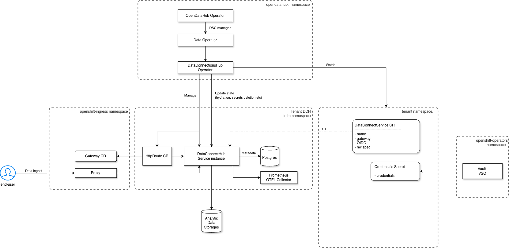
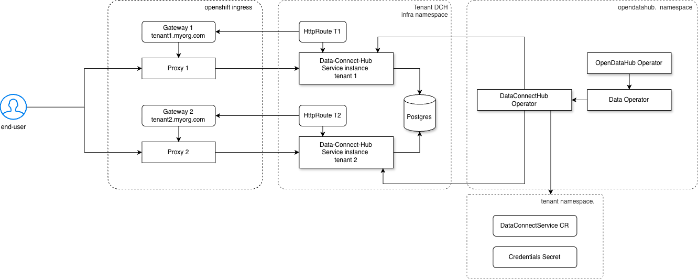
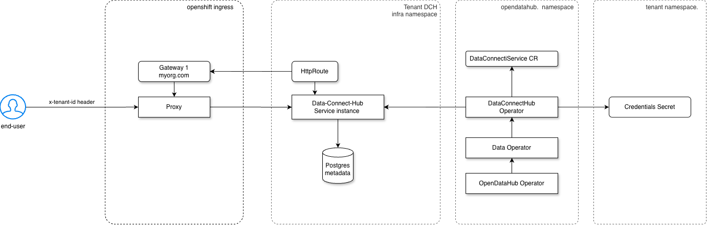
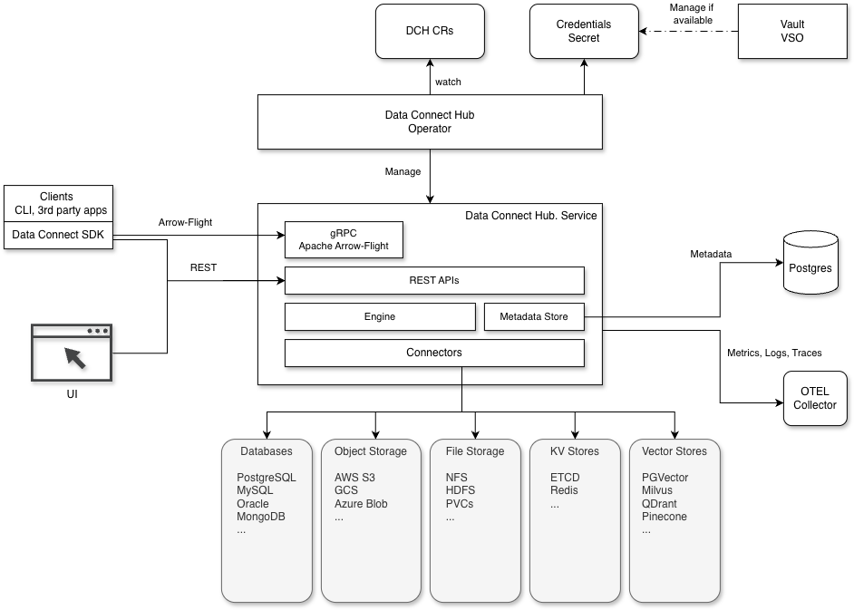

# Open Data Hub - Data Connect Hub

<!-- copy and paste this template to start authoring your own ADR -->
<!-- for the Status of new ADRs, please use Approved, since it will be approved by the time it is merged -->
<!-- remove this comment block too -->

|                |            |
| -------------- | ---------- |
| Date           | insert date |
| Scope          | |
| Status         | Approved |
| Authors        | Marius Danciu, Lukasz Cmielowski |
| Supersedes     | N/A |
| Superseded by: | N/A |
| Tickets        | |
| Other docs:    | none |

## What

This proposal focuses on a specific part of the overall data strategy, specifically on analytic data ingestions and connections metadata management.

## Why

Although in RHOAI today we do see that certain connection types are available (S3, OCI etc.) and these connections are materialized as Kube secrets that other services can mount and use, in reality there are services that need to support a variety of data stores to ingest data. One example is EvalHub where test data can live in various storages (S3, HDFS, NFS, relational databases etc.). To support such an ecosystem the EvalHub service would need to integrate and maintain the entire stack of client libraries with their dependencies. This can be very time-consuming to replicate in every service that needs to read analytic data from various sources. Thus, the Data Connect Hub proposes to be a middleware service that other services can use (a single dependency) that facilitates data ingestion from multiple data stores.

## Goals

* Define the data ingestion flow for tabular and unstructured data.
* Define Connections management
* Define the tenancy model
* Define access management


## Non-Goals

* OTLP
* ETL
* Document processing
* Higher level governance aspects (lineage, catalog, etc)
* MCP server. Not in scope initially but we envision a similar approach with EvalHub, where DCH Operator can also manage a DCH MCP server along with the DCH service instance. 
* Schema discovery and management pertain to the Catalog component. Note that this does not mean that DCH is unaware of schemas because Arrow Flight SQL protocol requires the schema for a query to be present. So in DCH we will provide this. But higher level operations for schema management pertain to Catalog. 


## How

### Architecture

#### Abbreviations

- DCH = Data Connect Hub
- DCHO = Data Connect Hub Operator
- DCHS = Data Connect Hub Service

#### High level overview



- `DCHO` 
    - Managed by OpenDataHub operator as a new DSC component. 
    - When a new `DataConnectService` CR is created, the operator creates the DCH Service instance in a dedicated `infra` namespace. 
    - Watches existing RHOAI Connection secrets and transforms them into DataConnection REST resources pointing to those secrets. This can be seen as auto-migration. Since the structure of the current RHOAI Connection secrets content is expected to remain the same, this step does not affect the current applications.

- `DCHS instance` 
    - Provides REST APIs for listing the available DataConnections
    - Provides REST APIs for unstructured data ingestion from different connections
    - Provides Arrow SQL Flight API for data ingestion of tabular data.


#### Multi tenancy

We propose to build the DCH solution with multi-tenancy in mind right from its inception. This is a critical aspect that we see growing in the OpenShift ecosystem for other services (MaaS, EvalHub, MLFlow etc.). The core ideas for multi-tenancy are:

##### Hard tenancy




##### Soft tenancy



- **Hard-tenancy** - Each tenant has its own DCHS instance that points to a dedicated gateway. This means that the Praxis proxy is also dedicated. This means:
  - Each tenant gets its own hostname / url
  - DCHS instance is dedicated to that tenant
  - Traffic is isolated per tenant (no neighbour noise)
  - Different TLS certificates managed via cert-manager can be used per tenant.
  - DataConnectService CR is created by the tenant in the tenant namespace. This triggers the creation of the DCHS instance in the DCH infra namespace
  - Implies the existence of a tenants discovery service since each tenant implies a different host name
  - Can support separate metadata store per tenant.

- **Soft tenancy** - There is a single DataConnectService CR in the opendatahub namespace and this is managed by the cluster admin, not by the tenant admins. This implies:
  - There is a single DCHS instance (that scales horizontally of course)
  - There is a single HttpRoute and a single Gateway. 
  - There is a single Praxis instance for all tenants.
  - All tenants use the same hostname / URL
  - Tenants can no longer be distinguished by the hostname. Instead we will require the presence of the `x-tenant-id` header. This is similar to EvalHub and MLFlow approaches for multi-tenancy.
  - Tenants are segregated by a tenant-id field in the metadata store (Postgres)

##### Tenancy mapping

- At REST and gRPC API level the tenant is specified via `x-tenant-id` header
- At metadata store level all records contain a `tenant-id` field that denotes the tenancy context.
- At kube level the tenant is represented by the namepace. Thus for `x-tenant-id: team-a` the RoleBindings checked for SAR will need to live in the `team-a` namespace. Kube secrets that DataConnection REST records point to must live in the namespace with the same name as the tenant-id. In other words `tenant-id == namespace`

##### Note
For the initial release we will adopt the soft tenancy approach as this implies less development and does not require a separate tenants discovery service.


#### Service overview


This diagram is a zoom-in from the above one. It describes the main internal components of the DCHS and how multiple data source types can be supported.

### Metadata storage

Exposing kube CRs via application REST APIs is challenging from multiple perspectives:
- Pressure on the kube API server. This is a critical system as it can affect the functionality of the entire cluster.
- Kube CRs listing APIs limitations (filtering, pagination etc)
- It is problematic for building modern UIs.

To address these challenges, we adopt the approach where the DataConnection records are REST resources, not Kube CR resources. The credentials secrets still remain entirely as Kube secrets, never stored in the DCH database. The DataConnection record contains extra metadata that doesn't qualify as credentials, and this record points to the actual kube credential secret.


### APIs

#### CRD APIs

- `DataConnectService` - describes the DCHS instance and configurations for this tenant. OIDC, hardware resources etc.


##### CR examples

```yaml
apiVersion: dataconnecthub.opendatahub.io/v1alpha1
kind: DataConnectService
metadata:
  name: data-connect-hub
  namespace: opendatahub
spec:
  description: Connection to the test data S3 bucket
  restApiReplicas: 3 # defaults to 2
  flightApiReplicas: 3 # defaults to 3

status:
  phase: Ready
  addresses:
    type: hostname
    value: example.myorg.com

```
       

#### GitOps flows

As DataConnections are not Kube CR resources, creating DataConnections via GitOps flow implies creating Kube secrets with the same labels and annotations used by the current RHOAI connections. Because the DCH operator watches these secrets, the DataConnection REST resources will be created automatically.

##### Future considerations

**InitDataConnection CR**
Because secrets have unstructured content and not all metadata should be stored in a secret, such CR would make GitOps flow create/reconstruct data connections in a cluster. This would have the same properties as the DataConnection REST resource. During a GitOps flow, these CRs are automatically watched by the DCH operator and the DataConnection REST resources will automatically be fully created. 

**InitDataConnectionType CR**
Such CR can used to automatically create/restore connection types in the cluster. The DCH Operator will reconcile these CRs and create the connection types as REST resources hence manageable in UI, SDK, CLI etc.


The current RHOAI Connection secrets contain the following labels and annotations:

```yaml
Labels:       opendatahub.io/dashboard=true
              opendatahub.io/managed=true
Annotations:  opendatahub.io/connection-type: s3
              opendatahub.io/connection-type-protocol: s3
              opendatahub.io/connection-type-ref: s3
              openshift.io/description: 
              openshift.io/display-name: s3-test
```

#### REST APIs

This is a non-exhaustive list of endpoints as the set of capabilities is expected to grow.

##### Connections management
- `GET /api/v1/data/connections` - List connections without sensitive information
- `POST /api/v1/data/connections` - Create a new connection that points to a prior existing secret.
- `PATCH /api/v1/data/connections/{id}` - Update connections (not secret data)
- `GET /api/v1/data/connections/{id}` - Get the details of a specific connection
- `DELETE /api/v1/data/connections/{id}` - Delete a specific connection

##### Connection types management

- `GET /api/v1/data/connection_types` - List connection types 
- `POST /api/v1/data/connections_types` - Create a new connection type.
- `PATCH /api/v1/data/connection_types/{id}` - Update a connection type 
- `GET /api/v1/data/connection_types/{id}` - Get the details of a specific connection type
- `DELETE /api/v1/data/connection_types/{id}` - Delete a connection type

  Currently Connection Types in RHOAI are represented as configmaps and they are very UI driven. We aim here for:
  1. Have a type safe API for managing connection types REST resources
  2. On the fly promotion of current configmaps to actual connection types resources. Once synced, these connections types are visible to all tenants (cluster scoped).
  
  Other connection types API consideration (non exhaustive):
  - A connection type can be scoped per cluster (visible to all tenants) or per tenant.
  - By default the current connection types (S3, OCI, URI) are going to be exposed as cluster scoped.
  - When creating a custom connection type the author can mark it as per cluster or per tenant. If it is per cluster all other tenants can see this new connetion type.
  

  **Note** - the actual API specification is not addressed in this ADR.

##### Unstructured data ingestion
- `GET /api/v1/data/ingestion/{id}` - Ingest unstructured data via HTTP


#### DataConnection REST resource

```yaml
metadata:
  id: 41212312-1234124-2r112341
  name: Eval-Prompts
resource:
  description: Test prompts
  provider: Postgres
  format: arrow
  properties:
    # Custom KV properties
  admin:
    secret-ref: postgres-secret
```

This is a rough object example as the exact API specification is outside the scope of this ADR.


#### gRPC APIs

For gRPC we have Arrow Flight endpoint for HTTP/2 and the path is constant: 

HTTP/2 endpoint: `/arrow.flight.protocol.FlightService`

#### SDK 

DCH team will create SDKs for integrating with the DCH service. Since data analytics are primarily needed in the Python ecosystem, the first SDK should be a Python SDK. 

#### CLI

A CLI tool can be handy for integrating into workflows that involve bash scripts. It could also be used in init-containers for downloading datasets prior to the process startup (e.g. training, evals etc.). It can be used as a SKILL for agentic workflows such as Claude.

### Access control 

#### Roles

#### DCH kube resources for data plane APIs

All resources below share the same api group: `dataconnecthub.opendatahub.io`

| Endpoint | Resource | Verbs |
|----------|----------|-------|
| POST /data/connections | data-connection | create |
| GET /data/connections | data-connection | read |
| GET /data/connections/{id} | data-connection | read |
| PATCH /data/connections/{id} | data-connection | patch |
| DELETE /data/connections/{id} | data-connection | delete |
| POST /data/connection_types | data-connection-types | create |
| GET /data/connection_types | data-connection-types | read |
| GET /data/connection_types/{id} | data-connection-types | read |
| PATCH /data/connection_types/{id} | data-connection-types | patch |
| DELETE /data/connection_types/{id} | data-connection-types | delete |
| GET /data/ingestion/{id} | data-store | get |
| (gRPC) /arrow.flight.protocol.FlightService | data-store | get |

**Note** - Other types of permissions can emerge as the service evolves

##### Examples

```yaml
apiVersion: rbac.authorization.k8s.io/v1
kind: Role
metadata:
  name: dch-ingest
  namespace: test
rules:
  - apiGroups: ["dataconnecthub.opendatahub.io"]
    resources: 
      - data-connections
      - data-store
    verbs: ["get"]

---

apiVersion: rbac.authorization.k8s.io/v1
kind: RoleBinding
metadata:
  name: dch-ingest-binding
  namespace: test
subjects:
  - kind: user
    name: Clark
roleRef:
  kind: Role
  name: dch-ingest
  apiGroup: rbac.authorization.k8s.io
```


#### Authentication

At this point in time (as Praxis is not yet available) authentication is done via TokenReview API for Openshift/JWT tokens. 

#### Authorization

SAR (Subject Access Review) is the foundation of authorization support. 

- Arrow Flight gRPC - we cannot use Kube RBAC proxy for Flight API because it is gRPC-based and Kube RBAC proxy is very limited in this area. Thus, for the time being, the SAR checks need to happen from within the DCHS when attempting to ingest data. 

- REST APIs - for REST endpoints like connection listing or unstructured data ingestion, we can use the Kube RBAC proxy (https://github.com/opendatahub-io/kube-rbac-proxy). This is also what EvalHub uses today.

#### Rate limiting 

For MVP we don't apply any specific rate-limiting logic. 


### Data Consumption

DCHS proposes data ingestion APIs via Arrow Flight or HTTP API. This ensures that the client using this API (or SDK) does not need to install and maintain various DB drivers or 3rd party libraries and this also implies that the actual database credentials are never exposed to these clients. Thus, we have two patterns for data ingestion:


#### Consumption via 3rd party libraries

While there are use cases where a data ingestion API is very useful, in other contexts using the 3rd party libraries is preferable. DCH is not opinionated on the approach that clients want to adopt. However, there are implications worth mentioning. If a client needs to use 3rd party libraries to connect directly to various data stores, it means that these clients require the actual backend credentials to connect. In this case, DCHS ingestion APIs are not used. However, the DCHO will automatically create a new kube secret (if the DataConnection resource is configured as such). This secret contains the DataConnection resource metadata plus the actual credentials from the secret that the DataConnection object points to. This looks like:

```
  DataConnection + credentials secret = Exported Secret
```

The admin can control the RBAC rules that are applied for the new secret and who can use it. At this point, DCHO will not automatically create and manage RBAC for this secret. It is up to the admin to manage RBAC for an Exported-Secret. The DataConnection resource needs to be configured in order to allow the auto creation of the new secret. Thus, the resource would need to contain the `exportAsSecret` flag:

```yaml 
metadata:
  name: my_eval
resource:
  exportAsSecret: {secret name}
  ...
```
The reason is that in cases where this is not needed, the system won't create and maintain stale secrets. Once the ExportedSecret is created, it can be mounted in other pods as well. 

As per the above example, the exported secret will be:

```yaml
apiVersion: v1
kind: Secret
metadata:
  name: my_eval
  namespace: test
  ownerReferences:
    - apiVersion: apps/v1
      kind: Deployment
      name: dataconnections-controller
      uid: a1b2c3d4-e5f6-7a8b-9c0d-1e2f3a4b5c6d 
      blockOwnerDeletion: true
  labels:
    dataconnecthub.opendatahub.io/connection_id=1fac3d4-e5f6-7a8b-9cff-1e2f3a4b5caa
    dataconnecthub.opendatahub.io/connection_name=my_eval

type: Opaque
Data:
  {KV properties here}
```

**Note** - The exported secret will always live in the same namespace with the credential secret. Thus the secret information never crosses the namespace boundaries. 

##### Exported Secret vs Credentials Secret

- The CredentialsSecret is the secret that the DataConnection resource points to. This is the initial secret created by an admin that holds the credentials.
- The ExportedSecret is constructed from the DataConnection resource metadata + the CredentialsSecret content.
- Applications can choose to mount the ExportedSecret in their pods if they need to access richer or even custom metadata, not only the pure credentials that were originally set by an admin.


#### Consumption via DCHS ingestion APIs

In this case, the client application uses the DCHS SDK or directly calls the DCHS data ingestion APIs. For instance, a Python or Go ADBC client can be used directly. In this scenario the ExportedSecret is not necessary as the client does not need the actual data store credentials. The client only needs to send the:
- `x-tenant-id` header (note that for gRPC all headers must be lower-case)
- `x-dch-connection-id` header denotes the targeted connection id where to read from.
- `Authorization` header

These apply for both REST and gRPC Flight APIs.

### Observability

- All actions for CRs management are tracked by the DCHO
- All data access requests from data consumers are tracked by DCHS as OTEL logs and metrics.
- OTEL Logs are managed by Loki as the logging solution for platform observability.
- Similarly to MaaS, the DCHO can also manage Perses dashboards for user consumption and usage awareness.


### Software stack

- DataConnectOperator - written in GoLang
- DataConnectService - written in Rust
 

### From RHOAI Connections to DCH DataConnections

All Connection objects in RHOAI today are stored as opaque secrets (S3, OCI, URI). For instance, an S3 connection secret contains this:

```
  - AWS_ACCESS_KEY_ID: {base64}
  - AWS_SECRET_ACCESS_KEY: {base64}
  - AWS_DEFAULT_REGION: {base64}
  - AWS_S3_BUCKET: {base64}
  - AWS_S3_ENDPOINT: {base64}
```

- Once DCH is installed it starts to watch these secrets (using label filtering)
- DCH Operator calls the DCH Service REST API to create the actual DataConnection resource. The DataConnection resource points to this secret by `secret_ref` property. The secret itself is never stored in DB.

**Outcome** 
- the existing RHOAI Connections are now visible as DCH DataConnections. From here users with proper RBAC permissions can enrich the DataConnections with other metadata if needed.
- the existing RHOAI Connection Secrets remain untouched as for DCH they are credential-secrets that DataConnection resources point to.


## Open Questions

TBD

## Alternatives

We did look for Go-based open source solutions and while they exist, we observe a significant growth of Rust open source libraries and frameworks (OpenDAL, arrow-rs, DataFusion etc.). Combined with Rust's benefits (zero-cost abstractions, no GC hence no GC spikes, and many others), these frameworks offer low-level memory and IO optimizations and are difficult to ignore, especially when data transfer on the wire is very sensitive.
 

## Security and Privacy Considerations


The [Access Control](#access-control) section describes the RBAC details for protecting REST resources. 

### TLS Certificates Management

DCHO when creating the Kube services automatically annotates the service with:

```yaml
annotations:
  service.beta.openshift.io/serving-cert-secret-name: {DCHS instance name}-tls
```

This tells the OpenShift service-serving-cert controller to create the TLS secret with that specific name and this will be mounted by the DCHO in:
  - Kube RBAC proxy container for the REST API kube service
  - gRPC container for the Flight service.

When these services start up, they will find the cert files in the `/etc/tls/private` path.

## Risks

Rust vs Go can be more challenging for developers that need to ramp up with Rust. However, with AI tools like Claude this can be mitigated significantly with both code and boilerplate generation but also a much faster learning curve for developers. 

## Stakeholder Impacts

| Group                         | Key Contacts     | Date       | Impacted? |
| ----------------------------- | ---------------- | ---------- | --------- |
| Data Connect Hub  | Monica Romila, Oronde Tucker, Marius Danciu, Lukasz Cmielowski   | date       | ? |
| Dashboard  | Andy Stoneberg  | date       | ? |
| ODH Platform  | Lindani Phiri  | date       | ? |

## References

* Actix-web - https://actix.rs/
* Arrow-rs - https://github.com/apache/arrow-rs 


## Reviews

| Reviewed by                   | Date       | Notes |
| ----------------------------- | ---------  | ------|
| name                          | date       | ? |
