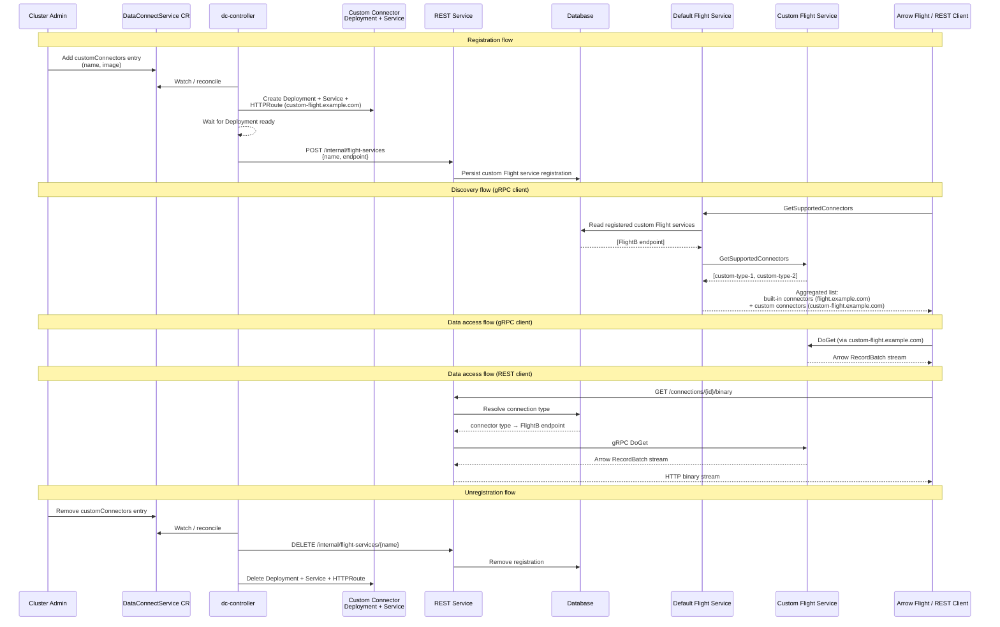

# Open Data Hub - Bring Your Own Connector

|                |            |
| -------------- | ---------- |
| Date           | 2026-09-07 |
| Scope          | Data Connect Hub |
| Status         | Draft |
| Authors        | [Marius Danciu](@marius-danciu) |
| Supersedes     | N/A |
| Superseded by: | N/A |
| Tickets        | |
| Other docs:    | ODH-ADR-0001-data-connect-hub |

## What

A mechanism that allows customers to implement and deploy their own data connectors for Data Connect Hub without forking or modifying the upstream project.

## Why

Data Connect Hub ships with a set of built-in connectors (PostgreSQL, SQLite, S3, Milvus, Elasticsearch, Neo4j, URI). However, customers may need to connect to proprietary or internal data sources that the project does not support. Today there is no supported path for extending the connector set without modifying the upstream codebase. A bring-your-own-connector (BYOC) model lets customers extend Data Connect Hub independently, on their own release cadence, without creating a maintenance burden on the upstream project.

## Goals

* Allow customers to implement custom connectors by depending on the `flight-service` library crate.
* Customers can build a custom Flight service binary that registers only their connectors, without pulling in any built-in connectors.
* The custom binary is packaged as an OCI image and deployed via the existing `DataConnectService` CR.
* No changes to the upstream Flight service binary or controller are required to support custom connectors.

## Non-Goals

* A dynamic plugin system (e.g. loading connectors at runtime via shared libraries or WASM).
* A connector marketplace or registry.
* Guaranteeing a stable public API for the `flight-service` crate across all releases — semver will be adopted incrementally.

## How

### Crate architecture

The `flight-service` crate is structured as both a library (`lib.rs`) and a binary (`main.rs`). All connectors are behind Cargo feature flags with optional dependencies:

```toml
[features]
default = ["postgres", "sqlite", "s3", "milvus", "elasticsearch", "neo4j", "uri"]
postgres = ["dep:postgres-connector"]
sqlite = ["dep:sqlite-connector"]
# ...
```

A customer creates a new Rust crate that depends on `flight-service` with `default-features = false`, which pulls in the Flight gRPC server machinery, the connector registry, the metadata store integration, TLS, auth, and metrics — but none of the built-in connectors:

```toml
[dependencies]
flight-service = { git = "https://...", default-features = false }
commons = { git = "https://..." }
```

### Implementing a connector

The customer implements the `FlightConnector` trait from `commons::api::connector` for their data source. This trait defines how to connect, execute queries, and stream results as Arrow `RecordBatch`es.

### Registering connectors

The customer writes a `main.rs` that builds a `ConnectorsRegistry` with their custom connectors and passes it to `DataIngestionService`:

```rust
use flight_service::flight::DataIngestionService;
use flight_service::flight::registry::ConnectorsRegistry;

fn build_connectors_registry() -> ConnectorsRegistry {
    ConnectorsRegistry::new()
        .with_connector(Arc::new(MyCustomConnector::new()))
}
```

The rest of the boilerplate (CLI args, config loading, TLS, auth, metrics, gRPC server startup) is reused from the `flight-service` library via its public API (`CommandLineArgs`, `load_config`, `configure_tls`, `configure_metrics`, `start_server`).

### Building and deploying the custom image

The customer builds their crate into a container image following the same multi-stage UBI9-minimal pattern used by the upstream services.

### Deployment via DataConnectService CR

The custom connector runs as a **separate Deployment and Service** alongside the default Flight service. The `DataConnectService` CR needs to be extended to declare custom connector deployments. The `ServiceOverrides` struct is extended with an `image` field:

```go
type ServiceOverrides struct {
    // image overrides the container image for this service.
    // +optional
    Image *string `json:"image,omitempty"`

    // ... existing fields ...
}
```

A new `customConnectors` field is added to the CR spec to declare one or more custom connector deployments:

```yaml
apiVersion: dataconnecthub.opendatahub.io/v1alpha1
kind: DataConnectService
metadata:
  name: default-dataconnectservice
spec:
  flightService:
    replicas: 2
  customConnectors:
    - name: my-custom-connector
      image: quay.io/customer-org/custom-flight-service:latest
      replicas: 1
```

For each entry in `customConnectors`, the dc-controller creates a separate Deployment and a headless or ClusterIP Service (e.g. `my-custom-connector-flight-service`).

### Routing

Data Connect Hub has two client-facing entry points: the REST API (HTTP) and the Flight service (gRPC). The REST service calls the Flight service internally for data operations, but external Arrow Flight clients — including the Python SDK — also connect to the Flight service directly. Both paths must route to the correct Flight service instance based on the connection's connector type.

**1. Connection-type to Flight service mapping**

Each connection in the metadata store is associated with a connection type (e.g. `postgres`, `s3`, `my-custom-type`). When a new flight service instance is created the controller sends the internal audit REST API `/audit/data-connection-types` and updates the `status.capabilities.flight` field of the DataConnectionType resource. This endpoint already exists. We can augment the capabilities object to also include the endpoint information. Therefore for a new custom connector say `foo`, all DataConnectionType objects will automatically be updated to reflect that ingestion via Arrow Flight is available. 

**2. REST service routing**

The REST service currently holds a single `FlightClient` pointing to one endpoint. This needs to become a routing layer:

- On data access requests (e.g. `download_binary`, `check_data_connection`), the REST service resolves the connection's type from the metadata store.
- It looks up the corresponding Flight service endpoint from the connector-to-endpoint mapping.
- It forwards the gRPC call to the correct Flight service.

This keeps routing transparent to REST clients — they continue to use the same API URLs.

**3. Flight (gRPC) client routing**

External Arrow Flight clients (e.g. the Python SDK) connect to the Flight service directly via gRPC. With multiple Flight services running, each service is exposed under its own hostname via a Kubernetes Gateway HTTPRoute (e.g. `flight.example.com` for the default, `custom-flight.example.com` for a custom connector).

Clients discover the correct endpoint through the existing `GetSupportedConnectors` Flight action. The response is extended to include the hostname for each connector type.

When the dc-controller reconciles a `customConnectors` entry and the Deployment becomes ready, it notifies the default REST service via an internal REST API (e.g. `POST /internal/flight-services`) with the custom Flight service's name and endpoint. The REST service persists this registration in the database. When a custom connector is removed from the CR, the controller calls a corresponding unregister endpoint (e.g. `DELETE /internal/flight-services/{name}`) and the REST service removes the entry from the database.

When a client calls `GetSupportedConnectors` on the default Flight service, it reads the registered custom Flight service endpoints from the database, fans out `GetSupportedConnectors` calls to each of them, and returns an aggregated view: its own built-in connectors plus all connectors from custom services, each tagged with the hostname of the service that provides it. The client receives the full list and connects to the appropriate hostname for subsequent data operations.

This approach requires no custom proxy — it relies on standard Gateway API routing by hostname and uses the existing discovery mechanism to direct clients to the right service.

#### Routing flow diagram



## Open Questions

* Should the `flight-service` crate be published to crates.io for easier consumption, or is a git/path dependency sufficient?
* Should we commit to a stable public API for the `FlightConnector` trait and `ConnectorsRegistry`, and what semver guarantees should we provide?

## Alternatives

### Dynamic plugin loading (shared libraries / WASM)

Connectors could be loaded at runtime as `.so`/`.dylib` shared libraries or WASM modules. This would avoid recompilation of the Flight service entirely.

**Tradeoffs:** Significantly more complex to implement and maintain. Shared libraries introduce ABI compatibility concerns across Rust versions. WASM adds a runtime overhead and limits access to system resources (network, filesystem). Both approaches make debugging harder. The compile-time approach is simpler, type-safe, and aligns with Rust's strengths.

### gRPC sidecar per connector

Each custom connector runs as a separate gRPC service, and the Flight service proxies requests to it.

**Tradeoffs:** Avoids any Rust dependency for the customer — connectors could be written in any language. However, this adds network hops, complicates deployment (multiple containers per connector), and requires defining a stable gRPC contract for the connector interface. The Arrow-native streaming path would also need serialization/deserialization across the proxy boundary, adding latency and memory overhead.

### Fork the repository

The customer forks Data Connect Hub and adds their connectors directly.

**Tradeoffs:** Simplest to start but creates a long-term maintenance burden. The customer must continuously rebase on upstream changes and resolve merge conflicts. Divergence accumulates over time and makes upgrades increasingly difficult.

## Security and Privacy Considerations

* Custom connector images run with the same privileges as the standard Flight service. Cluster admins should review custom images before deployment.
* The `image` field in `ServiceOverrides` is a CR-level setting. Access to create or modify the `DataConnectService` CR should be restricted to cluster admins via RBAC.

## Risks

* Breaking changes to the `FlightConnector` trait or `ConnectorsRegistry` API will require customers to update their connectors. Until semver is adopted, this risk should be communicated clearly.
* Custom connectors may introduce security vulnerabilities or performance issues that are outside the project's control.

## Stakeholder Impacts

| Group                         | Key Contacts     | Date       | Impacted? |
| ----------------------------- | ---------------- | ---------- | --------- |
| Data Connect Hub maintainers  |                  |            | Yes |
| ODH operator team             |                  |            | No |
| Customers / ISVs              |                  |            | Yes |

## References

* ODH-ADR-0001-data-connect-hub — foundational architecture for Data Connect Hub
* `samples/custom-connector/` — reference implementation for a custom connector crate

## Reviews

| Reviewed by                   | Date       | Notes |
| ----------------------------- | ---------  | ------|
|                               |            |       |
