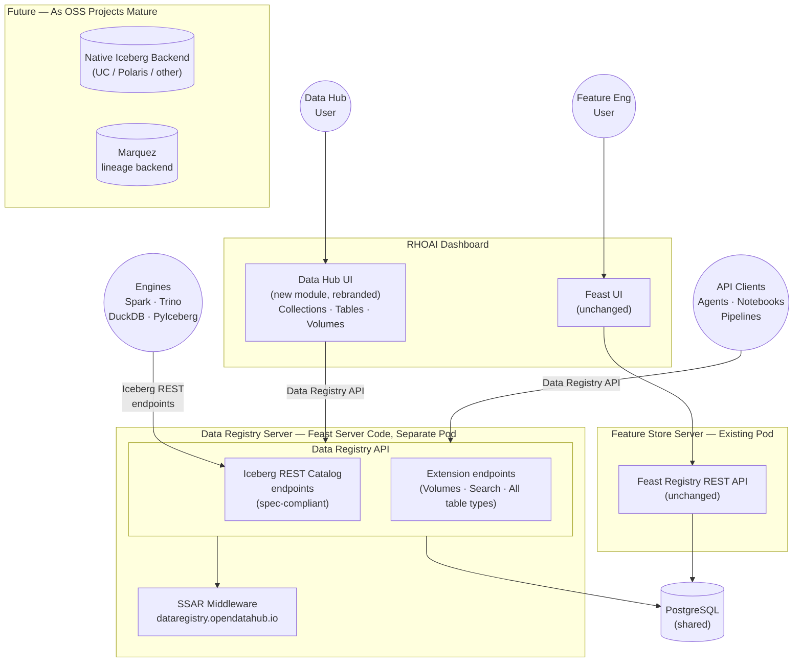

# ODH-ADR-DR-0001: Data Registry for RHOAI

|                |            |
| -------------- | ---------- |
| Date           | 2026-07-27 |
| Scope          | ODH |
| Status         | Approved |
| Authors        | [Ana Biazetti](@abiazetti) |
| Supersedes     | N/A |
| Superseded by  | N/A |
| Tickets        | TBD |
| Other docs     | [Internal architecture option analysis](internal-0001-data-catalog-architecture.md), [RBAC design](internal-0002-catalog-api-rbac.md), [Design options analysis](../design-options-draft.md) |

## What

RHOAI will ship a **Data Registry** as part of its Data capabilities. The Phase 1 implementation reuses the existing Feast server process and operator, exposes a **Data Registry API** that includes spec-compliant Iceberg REST Catalog endpoints for engine interoperability and extends them with additional endpoints for all asset types (volumes, search, non-Iceberg table types), and provides a rebranded **Data Hub UI** as a new module drawing on the existing `@odh-dashboard/feature-store` package for domain context and UX patterns. The Iceberg REST Catalog Spec is the foundation: we adopted it as the catalog standard, already identified search and volumes as necessary extensions beyond the spec, and now extend further to support additional table types — while keeping the Iceberg REST Catalog endpoints intact for engine consumers (Spark, Trino, DuckDB, PyIceberg). Access control uses the MLflow SSAR pattern: Kubernetes-native RBAC via SelfSubjectAccessReview against pseudo-resources in a `dataregistry.opendatahub.io` API group. No new operators or CRDs are introduced in Phase 1.

## Why

RHOAI has no unified way for users to discover, browse, or manage data assets across AI workloads. The [RHAI Data Strategy](https://gitlab.cee.redhat.com/data-strategy/data-strategy-proposal/-/blob/main/RHAI-data-strategy-proposal.md) identifies six customer challenges that this ADR addresses:

- **No discoverability.** The existing Connection concept handles only the access information to S3/PVC/URL but it doesn't track the actual content so it is not easily possible to discover without directly accessing it.
- **No shareability.** Sharing a dataset means exporting outside of RHOAI. No namespace-level access control, no metadata, no provenance.
- **No reusability across workflows.** Every workflow (pipeline, spark, ray-data, evals, SDG, red-teaming) requires users to manually wire data paths. The same dataset used in three tools means three manual configurations.
- **No agent-readiness.** Agentic workflows cannot discover or consume data artifacts at runtime — there is no registry, no API, no schema advertisement.
- **No lineage for auditability.** No audit trail for which data was used in which workflow or how the data was transformed/versioned.
- **Competitive gap.** SageMaker and Vertex have integrated dataset registries. RHOAI users absorb friction that competitors have eliminated.

Feast provides a feature store UI focused on Feature Engineering ([Scenario A](https://gitlab.cee.redhat.com/data-strategy/data-strategy-proposal/-/blob/main/scenarios/scenario-a-credit-scoring/scenario-a-credit-scoring.md)), but users working with knowledge retrieval ([Scenario B](https://gitlab.cee.redhat.com/data-strategy/data-strategy-proposal/-/blob/main/scenarios/scenario-b-underwriting-knowledge/scenario-b-underwriting-knowledge.md)), agentic AI, or multi-modal workflows have no catalog experience. There is no standards-based catalog API for engine interoperability, and no platform-native access control for data assets. Each AI scenario is a silo with its own asset management, making cross-scenario governance and discoverability impossible.

Three factors drive the timing:

1. **Customer demand.** Multiple FSI engagements require a data catalog for governed AI assets, including unstructured document management (Scenario B: P&C Underwriting Knowledge Assistant).
2. **Standards convergence.** The Iceberg REST Catalog Spec has emerged as the de facto OSS data catalog interoperability standard, with broad engine support (Spark, Trino, DuckDB, Polaris, Nessie). Building on this standard avoids lock-in and enables direct engine access.
3. **Existing infrastructure.** RHOAI already ships Feast (server, operator, UI components) and the MLflow SSAR auth pattern. Reusing both lets us deliver a registry MVP without new infrastructure, then support flexibility in future phases as additional OSS catalog implementations mature.

### Scope: MVP Within a Broader Strategy

This ADR scopes an MVP for the Data Registry. It is one layer of the broader [RHAI Data Strategy](https://gitlab.cee.redhat.com/data-strategy/data-strategy-proposal/-/blob/main/RHAI-data-strategy-proposal.md), which spans five pillars — ingestion, compute, catalog, lineage/governance, and unified experience. Lineage and governance (OpenLineage as the standard, with implementations like Marquez and MLflow) are addressed by the broader strategy and are not in scope for this Phase 1 MVP. The MVP delivers a focused, high-value starting point: giving RHAI clients a low-friction way to integrate their external data into the platform, browse and manage data assets, and connect AI workloads to governed data sources.

At the same time, the architecture is deliberately designed for openness and evolution. It adopts de facto OSS specifications and APIs (Iceberg REST Catalog Spec, OpenLineage) as external contracts, keeping the system interoperable with the broader data ecosystem — tools, engines, and platforms that clients already use. As OSS projects in this space mature (Unity Catalog, Apache Polaris, Marquez), the architecture accommodates them without rearchitecting, because the stable interface is a standard, not an implementation.

## Guiding Principles

Three principles from the RHAI Data Strategy shape every design decision in this ADR:

### 1. Open Source First

Adopt open-source technologies that are de facto winners in the OSS landscape, with wide adoption across clients and competitors.

- **Standard Specs & APIs:** Use Iceberg REST Catalog Spec and OpenLineage as external contracts — not proprietary or custom APIs.
- **Reference Implementations:** Prefer OSS solutions over building proprietary alternatives.

### 2. Platform-First & Rigor

Evolve existing RHOAI capabilities rather than adding new components from scratch, applying strict engineering rigor.

- **Native Security:** Leverage platform-native security and RBAC instead of custom auth.
- **Agnostic APIs:** Design backend-agnostic contracts to ensure stable interfaces.
- **Phased Evolution:** Prioritize translation layers now, native backends later.
- **Reuse Over Build:** Leverage existing platform components and capabilities to reduce productization overhead.

### 3. Client-Driven Adoption

Ground the strategy in real requirements from BU, field teams, and clients — not assumptions.

- **Integration, not replacement:** We are not building a complete data platform. We integrate with the data platforms clients already have and connect their data to RHAI.
- **Validated Scenarios:** Design around concrete scenarios validated directly with stakeholders.
- **Low-Friction Entry:** Minimize starting barriers, letting complexity grow progressively.

## Goals

* Deliver a Data Registry UI and API in RHOAI that lets users browse, search, and manage data assets from the RHOAI dashboard
* Expose a Data Registry API that includes spec-compliant Iceberg REST Catalog endpoints for engine interoperability and extends them to cover all asset types — from day one, not as a convergence target
* Support both predictive AI (Scenario A: feature engineering via Feast) and knowledge retrieval (Scenario B: document collections via Milvus + AIGW/OGX)
* Implement platform-native RBAC using the proven MLflow SSAR pattern, with zero new auth infrastructure
* Deliver without new operators or CRDs in Phase 1; evaluate additional OSS implementations as they mature in future phases
* Ensure the architecture is backend-swappable: the Data Registry API is the stable contract; backends can change without affecting consumers
* Support volume extensions for unstructured document management in S3/MinIO (Scenario B requirement)
* Link/integrate with [Data Connect Hub](https://github.com/mariusdanciu/architecture-decision-records/blob/data-connect-hub/architecture-decision-records/data-connect-hub/ODH-ADR-0001-data-connect-hub.md) for management of external data source connections, authentication, and ingestion

## Non-Goals

* **Model registry.** RHOAI uses MLflow for model registry. The Data Registry does not replace or duplicate MLflow model management.
* **Full Iceberg REST compliance in Phase 1.** Full Iceberg REST compliance in Phase 1 is out of scope. However, for tables registered with type=iceberg, it is possible to read real metadata.json from S3 and return genuine schemas, snapshots, and partition specs — enabling native engine queries (Spark, PyIceberg, Trino) for Iceberg tables.
* **Row-level or column-level access control.** Kubernetes RBAC operates at the resource level (table, volume, namespace). Fine-grained data-level filtering requires a policy engine (JCasbin, OPA) as a future layer.
* **Cross-namespace registry federation in Phase 1.** SSAR is namespace-scoped. Cross-namespace search and unified browsing across all namespaces are deferred to a future phase.
* **Replacing Feast for feature engineering.** Feast remains the feature store for predictive AI. The Data Registry adds a separate experience for broader data management use cases. Existing Feast APIs and UI are unchanged.
* **General-purpose data governance.** The Phase 1 scope covers registry CRUD, search, and RBAC. Policy management and compliance workflows are out of scope.
* **Moderated registration workflows.** Phase 1 uses open registration — any user with write access can register assets that are immediately visible. Approval queues (draft → review → publish) are a future consideration as a common platform capability across all RHOAI registries (data, models, pipelines), not a Data Registry–specific feature.

## How

### Architecture Overview

The Data Registry uses the **Reuse & Extend** approach: create a new Data Hub UI module (using existing Feast UI components as reference) with a **Data Registry API** implemented in a dedicated FeastStore instance. The Data Registry API includes spec-compliant Iceberg REST Catalog endpoints for engine interoperability and extends them with additional endpoints for volumes, search, and non-Iceberg table types.

The Data Registry server runs as a **separate pod** — a dedicated FeastStore instance distinct from the feature engineering Feast instance. This follows the same model as MLflow registries: one Data Registry instance per RHOAI installation serving all namespaces, with namespace-scoped SSAR authorization controlling access to individual registry objects. There is no per-namespace Data Registry instance. When both Feature Engineering and Data Registry are enabled, the cluster runs two Feast Server deployments — one for feature engineering, one for the Data Registry — each supporting multiple namespaces. They share the same PostgreSQL database but are separate pods. The FeatureStore CRD uses an annotation to designate the Data Registry instance.

### Frontend: Data Hub UI

Create a new `@odh-dashboard/data-hub` module drawing on the existing `@odh-dashboard/feature-store` package for domain context and UX patterns. This is a new module following the dashboard's BFF and modular federation patterns, not a long-lived fork. Completely rebranded with no feature engineering terminology. Shows Collections, Tables, and Volumes.

The Data Hub UI talks exclusively to the Data Registry API. It does not call Feast APIs directly. This makes the UI backend-agnostic: if a different registry backend is adopted in the future, the UI requires zero changes.

#### Dashboard Integration

The RHOAI dashboard uses **Module Federation** to load feature plugins at runtime, and the **BFF sidecar pattern** for modules that need server-side logic. The BFF sidecar is the recommended architecture for all new dashboard UI modules, established by model-registry and gen-ai.

The Data Hub UI follows this pattern: a new `@odh-dashboard/data-hub` package with a BFF sidecar that proxies Data Registry API requests to the Data Registry server, forwarding the user's OAuth bearer token. The BFF does not hold a privileged service account — authorization is evaluated by kube-rbac-proxy on the Data Registry server against the caller's identity. Runs on a dedicated port within the dashboard pod.

**Source:** [opendatahub-io/architecture-context](https://github.com/opendatahub-io/architecture-context), [opendatahub-io/odh-dashboard](https://github.com/opendatahub-io/odh-dashboard) packages directory.

See [Alternatives — UI Design](#ui-design) for the bundled library alternative that was considered.

### Backend: Data Registry API in Feast Server

The Data Registry server exposes a **Data Registry API**, implemented in the Feast server codebase alongside the existing Feast Registry REST API. The Data Registry API builds on the Iceberg REST Catalog Spec as its foundation and extends it:

- **Iceberg REST Catalog endpoints** — spec-compliant endpoints for engine interoperability. Serve only Iceberg tables with genuine metadata, enabling native engine queries (Spark, Trino, Flink, DuckDB, PyIceberg). Non-Iceberg assets are not visible through these endpoints.
- **Extension endpoints** — endpoints beyond the Iceberg REST Catalog Spec that serve the complete set of data assets. We already identified search and volumes as necessary extensions (neither is part of the Iceberg REST spec). Supporting additional table types (Parquet, CSV, PostgreSQL, and others) is a natural extension of the same approach — the Data Registry API covers all registered asset types, not just Iceberg tables.

The Iceberg REST Catalog Spec is the de facto standard catalog protocol, with native client support in every major query engine and data platform (Snowflake, Databricks, watsonx.data, AWS Glue). Including spec-compliant Iceberg REST Catalog endpoints in the Data Registry API gives RHOAI **multi-engine connectivity** — any engine or platform that speaks the Iceberg REST Catalog Spec can discover RHOAI-managed Iceberg table metadata with no custom connectors. See the [Interoperability Analysis](../iceberg-rest-registry/interoperability-analysis.md) for the full engine/platform matrix.

The Data Registry API translates to Feast registry internals in Phase 1.

#### Object Mapping: Data Registry → Feast Registry

The translation layer maps Feast registry objects to Data Registry API concepts. **SavedDataset** is the unified backing object for both tabular and unstructured assets:

| Data Registry Concept | Feast Registry Object | Notes |
|-----|-----|-----|
| **Namespace** (level 1) | Project | One top-level Feast project for all Data Registries |
| **Namespace** (level 2) | SavedDataset `namespace` field (proposed) | RHAI namespace — one Data Registry per RHAI namespace. Backward-compatible addition to `SavedDatasetSpec` proto. |
| **Namespace** (level 3) | SavedDataset `collection` field (proposed) | Collection grouping within a namespace |
| **Table** | SavedDataset | Single-object, direct mapping. Schema is user-provided at registration time (data dictionary fields). Can optionally reference a DCH `DataConnection` object at registration. |
| **Volume** | SavedDataset with `asset_type=volume` tag | Dedicated `/volumes/` extension endpoints. `storage_path` and `storage_type` fields represent volume pointers. No new Feast registry resource type. Can optionally reference a DCH `DataConnection` object at registration. |
| **View** | *(not supported in Phase 1)* | Deferred to Phase 2 — no customer need identified |
| **Table properties** | SavedDataset tags | Key-value metadata |

ML-specific Feast objects — Entity, DataSource, FeatureView, FeatureService, StreamFeatureView, ValidationReference, Infra — remain in the Feast API and are **not** exposed through the Data Registry API. These are consumed by the Feast UI, not the Data Hub UI.

**Proto compatibility note:** The `namespace` field, `collection` field, and `asset_type` tag on SavedDataset are all optional, backward-compatible proto additions. Existing Feast clients that do not set these fields are unaffected — `namespace` defaults to `"default"` and `asset_type` is an optional tag, not a required field. An upstream PR for these changes is already open: [feast-dev/feast#6623](https://github.com/feast-dev/feast/pull/6623).

#### Schema at Registration Time

When a user registers an external table, they provide schema metadata (column names, types, descriptions) as part of the registration form — the data dictionary. The schema is stored in the SavedDataset's `schema` field (Feast `Schema` proto). This matches the expected user flow, where users fill in the data dictionary at registration time.

**Automatic schema inference** (reading Parquet footers, Delta transaction logs) is deferred to Phase 2. Phase 1 relies on user-provided schema definitions. Tables registered without a schema are stored as metadata-only pointers with no column information.

Three-level namespaces are used from Phase 1 (`{project}/{rhai-namespace}/{collection}/{asset}`) so that asset paths are stable if a different registry backend is adopted in the future. The `namespace` and `collection` fields on SavedDataset are backward-compatible proto additions.

See [Concept Mapping: Feast × Iceberg REST × UC OSS](../concept-mapping-feast-iceberg-uc.md) for the full three-way data model comparison, translation operation table, and schema type mapping.

#### API Coverage: What Phase 1 Does and Does Not Support

The Data Registry API covers the following in Phase 1:

**Iceberg REST Catalog endpoints** — spec-compliant metadata operations for engine interoperability with Iceberg tables:
- Supported: namespace listing, table listing, table load, table exists, table metadata (schema, properties)
- Not supported in Phase 1: commit transactions, snapshot management, partition spec management, register table via metadata file, views

**Extension endpoints** — capabilities beyond the Iceberg REST Catalog Spec:
- Table registration and management for all types (Iceberg, Parquet, CSV, PostgreSQL, and others)
- Volume management for unstructured document collections in S3/MinIO (Scenario B)
- Search across collections, tables, and volumes
- Namespace management (projects, RHAI namespaces, collections)

Unsupported Iceberg REST operations return HTTP 501 (Not Implemented) with a JSON body listing the unsupported operation — not silent success. This prevents engines from assuming constraint enforcement that the translation layer cannot provide.

**What this means for consumers:** Phase 1 supports the browse/search/register/manage workflow — the operations needed by the Data Hub UI, notebooks, and pipeline orchestrators that register and discover data assets. For Iceberg tables specifically, the Iceberg REST Catalog endpoints provide spec-compliant metadata access for engines. Full engine query workflow support — where Spark or Trino loads table metadata to plan a scan with snapshots and partition specs — requires a native Iceberg backend (Phase 2+).

This is an intentional scope constraint, not a gap. The Non-Goals section explicitly states: "Full Iceberg REST compliance in Phase 1" is out of scope.

### Access Control: Platform-Native RBAC via SSAR

Every Data Registry API request is authorized via Kubernetes-native RBAC before reaching any backend. This uses the same SelfSubjectAccessReview pattern as MLflow in RHOAI.

**Pseudo-resources** in the `dataregistry.opendatahub.io` API group:

| Pseudo-resource | Maps to | Used for |
|---|---|---|
| `namespaces` | Iceberg Namespace / UC Schema | Schema-level browse and management |
| `tables` | Iceberg Table / UC Table | Table read, write, manage |
| `volumes` | UC Volume (unstructured data) | Volume browse and file access |

**ClusterRoles** with aggregation labels auto-inject into standard OCP roles:
- `dataregistry-view` aggregates into OCP `view` (read-only registry access)
- `dataregistry-edit` aggregates into OCP `edit` (read + write)
- `dataregistry-admin` aggregates into OCP `admin` (full access)

Users with existing namespace roles automatically receive the corresponding Data Registry access level — `view` grants read-only registry access, `edit` grants read-write, `admin` grants full access. No additional RBAC configuration is needed. Permissions are managed via standard `oc create rolebinding` or the OCP Console UI.

**Registry-only sharing:** For cross-team data sharing with reduced blast radius, admins can bind `dataregistry-view` or `dataregistry-edit` directly to users who do not have a namespace role. This grants registry access (browse collections, tables, volumes) without K8s infrastructure visibility (pods, Secrets, ConfigMaps). Note: because role aggregation is a one-way, cluster-wide property of the ClusterRole definition, users who *do* have namespace roles (`view`, `edit`, `admin`) will always receive the corresponding Data Registry permissions — this cannot be selectively disabled per user. The Data Registry server returns registry metadata only — it does not proxy data connections or storage access.

**Caching:** SSAR result caching will be handled by kube-rbac-proxy's standard caching capabilities.

**Granularity:** The initial product requirement scopes SSAR authorization at the **project/namespace level**, not per-table or per-volume. A user with access to a namespace can browse all registry assets within it. Per-resource granularity (table-level, volume-level) is architecturally supported via K8s `resourceNames` but is not required for Phase 1. This keeps SSAR call volume low — one check per namespace, not per item — and matches the MLflow SSAR implementation, which operates at the same granularity with no reported performance issues in production.

**Why SSAR over alternatives:** Three backend auth options were evaluated and rejected. Feast RBAC requires Python code (`feast apply`), has a default-open security model, no admin UI, and no group support. UC JCasbin has limited privileges (8 types), no groups, no inheritance, and ownership-based visibility. The Iceberg REST Catalog spec has zero authentication. Building or fixing auth in each backend means maintaining multiple auth implementations that must stay synchronized across backend swaps. The SSAR pattern avoids all of this by delegating auth to the platform — the same middleware works regardless of whether the backend is Feast, UC, or Polaris.

**Trade-offs:**
- **Resource-level only** — K8s RBAC cannot express row-level or column-level access control. Fine-grained data access would require a second layer (OPA, JCasbin) in the future.
- **Namespace-scoped** — SSAR evaluates per namespace. Phase 1 checks authorization at the project/namespace level only (per PM requirement prioritization), keeping SSAR call volume low — one check per namespace, not per asset. Cross-namespace search is handled server-side with batch SSAR checking. This follows the same SSAR approach as MLflow with similar scalability considerations.
- **No purpose-built RBAC UI** — Admins manage registry permissions via `oc create rolebinding` or the generic OCP Console RBAC views, which are not tailored for registry-specific permission management.
- **No metadata sensitivity classification** — The registry does not classify assets by sensitivity level (e.g., PII, confidential, internal). No existing RHAI registry (MLflow model registry, Feast feature store) implements data classification today. This is deferred to Phase 2 alongside lineage and governance work.

**POC validation:** The pattern was validated on a ROSA cluster (2026-06-24). Three ClusterRoles with aggregation labels, standard RoleBindings, SubjectAccessReview calls — all confirmed working. Setup time: 5 minutes. No operators or CRDs required.

See [ADR 0002: Data Registry API RBAC](internal-0002-catalog-api-rbac.md) for the full SSAR design, POC validation results, and per-resource granularity details.

### Phased Delivery

**Phase 1 (MVP):**
- Data Hub UI (new module, rebranded) in the RHOAI dashboard
- Dedicated Data Registry server pod (FeatureStore CRD with Data Registry annotation), sharing PostgreSQL with the feature store server
- Data Registry API (including Iceberg REST Catalog endpoints and extension endpoints), backed by Feast registry translation layer
- SSAR authorization via kube-rbac-proxy for platform-native RBAC
- Full CRUD for datasets and document collections
- Search and volume extensions
- PostgreSQL-backed registries only in Phase 1

**Phase 2+:**
- Evaluate mature OSS Iceberg REST Catalog Spec implementations (Unity Catalog OSS, Apache Polaris) as potential registry backends
- Full Iceberg REST compliance: Spark, Trino, DuckDB query the registry directly via standard Iceberg REST connectors
- Cross-platform lineage via Marquez/OpenLineage as a complementary standard alongside the registry API
- Marquez secured via the same SSAR pattern (lineage pseudo-resources added to existing ClusterRoles)
- Incorporate customer feedback from Phase 1 deployments to guide prioritization and scope

### Data Registry Server Provisioning

The Data Registry server is provisioned via the existing FeatureStore CRD, with an annotation designating the instance as a Data Registry. When present, the Feast operator deploys a separate Data Registry server pod alongside the feature store server, both pointing to the same PostgreSQL database. No new CRs are introduced.

Individual Data Registries are **not** provisioned via CRs or GitOps. A registry for a given RHAI namespace is created implicitly when users register their first dataset with that namespace — the same pattern used by MLflow registries. Registries are dynamically managed data objects, not cluster-level configurations.

### Migration Path: Feast Registry → Native Iceberg Backend

If a native Iceberg backend is adopted in a future release, registry metadata must be migrated from the Feast registry to the new backend. The migration path is:

1. **Export:** Read all registry metadata from the Feast registry via the Data Registry API. The export format captures namespaces, tables, schemas, and properties. Table properties carry all extension metadata (format, maturity stage, license, owner, tags, connection references) as key-value pairs, so the export captures the full Phase 1 metadata set.
2. **Transform:** Map Feast registry objects to native Iceberg catalog entries. The Phase 1 scope is already constrained to the subset that translates cleanly (see Non-Goals: "Full Iceberg REST compliance"), so this mapping is lossless for Phase 1 data — every field stored in SavedDataset tags is round-tripped through Iceberg REST properties.
3. **Load:** Import into the new backend via its catalog API. Any compliant implementation (UC, Polaris, or other) supports standard catalog operations.
4. **Cutover:** Update the configuration to route requests to the new backend instead of the Feast translation layer. The Data Hub UI, SSAR auth, and all API consumers require zero changes — the Data Registry API contract (endpoints, request/response shapes) remains stable regardless of the backend. For extension assets (volumes, non-Iceberg table types), the Phase 2 backend must support equivalent storage for the extension metadata currently held in Feast SavedDataset tags; the migration plan for these assets will be defined as part of the Phase 2 backend selection.

**What does not migrate automatically:** Any Feast-specific metadata that was not exposed via the Data Registry API translation layer (e.g., Feast feature view definitions, online store configurations). These remain in the Feast registry and continue to serve the Feast UI and feature engineering workflows. The Feast use case is not affected by the migration.

**Expected migration volume:** The registry stores metadata only — no data files are migrated. At expected Phase 1 scale (hundreds of objects, well under thousands), the full export/transform/load cycle is a lightweight operation over a small metadata set. A migration CLI tool that runs the steps idempotently allows dry-run validation before cutover.

**API compatibility requirement:** Backend migration requires an API compatibility test suite that verifies response fidelity (response shapes, error codes, property completeness) across the Feast-backed and new implementations before cutover. Consumers may depend on Feast-specific behaviors exposed through the translation layer; the test suite ensures these are identified and addressed before any transition.

### Assumptions

1. **Both predictive AI and knowledge retrieval are supported through the platform.** Scenario A (credit scoring, fraud detection) uses Feast for feature engineering with <100ms online serving. Scenario B (knowledge retrieval) uses Milvus + AIGW/OGX.
2. **Iceberg REST Catalog Spec is the long-term engine interoperability standard.** All architecture paths converge on the Iceberg REST Catalog Spec for engine access to Iceberg tables. This ADR adopts it from day one.
3. **K8s namespace = UC catalog = Marquez namespace is the target alignment.** Data Registries are created implicitly per RHAI namespace when datasets are registered (see [Data Registry Server Provisioning](#data-registry-server-provisioning)), enabling a single auth proxy for both registry and lineage.
4. **Phases are cumulative. No throwaway work.** The Data Registry API and SSAR auth added in Phase 1 remain the stable contracts regardless of which backend is used.

## Alternatives

The alternatives below are organized by decision area. The chosen approach (Reuse & Extend with Feast server extension plus BFF sidecar and SSAR) optimizes for the Phase 1 timeline while preserving the Data Registry API as a stable interface for future backend flexibility.

### Architecture

#### Alternative 1: Greenfield on Unity Catalog OSS

Build a new Data Registry server on UC OSS with a new operator, new image builds, and the existing RHOAI Catalogs & Registries UI components as a frontend foundation.

| Dimension | Rating | Notes |
|-----------|--------|-------|
| Time to MVP | 🔴 Tight | New operator, auth bridge, search API — ~16-24 weeks |
| Standards | 🟢 Strongest | Native Iceberg REST, no translation |
| Backend flexibility | 🟢 Strongest | Clean start, no legacy |
| Upstream risk | 🟡 Moderate | UC 0.3 has auth gaps, single-node only, no search |
| Technical debt | 🟢 Low | Purpose-built for registry |
| Operational complexity | 🔴 High | New operator, PostgreSQL, CRD |
| New infrastructure | 🔴 High | New pod, operator, CRD |

The Phase 2 POC revealed UC integration requires: a new operator (server deployment, PostgreSQL lifecycle, `UnityRegistry` CRD, SCIM sync controller, OAuthClient lifecycle, registry auto-provisioning), an auth bridge (UC has no auth plugin architecture — requires a code fork with `AuthDecorator.java` patch), and a search API build. The architecture is sound and offers the highest long-term flexibility, but front-loads infrastructure work that can be deferred until UC matures.

See [internal architecture analysis](internal-0001-data-catalog-architecture.md) and [UC OSS Learnings from POCs](../uc-oss-learnings-from-pocs.md) for details.

#### Alternative 2: Extend Feast into a General Registry

Widen Feast itself into a broader data registry by extending the UI and adding new resource types to the registry.

| Dimension | Rating | Notes |
|-----------|--------|-------|
| Time to MVP | 🟢 Fastest | UI tweaks + registry extensions only |
| Standards | 🔴 None | Feast API, not Iceberg REST |
| Backend flexibility | 🔴 Locked | Feast registry is the only backend |
| Upstream risk | 🟡 Moderate | Upstream Feast community may not adopt registry extensions |
| Technical debt | 🔴 Highest | Every release compounds non-standard debt |
| Operational complexity | 🟢 None | No new infrastructure |
| New infrastructure | 🟢 None | Same Feast process |

Feast has [10 fundamental catalog weaknesses](../../data-catalog-analysis/feast-catalog-weaknesses.md): no unstructured data awareness, no governance model beyond tags, a registry that serializes as a single protobuf blob, and only 2 of 13 Feast types have Iceberg counterparts. Technical debt compounds each release without convergence on OSS standards.

See [Feast Use Case Fit Analysis](https://gitlab.cee.redhat.com/data-strategy/data-strategy-proposal/-/blob/main/scenarios/feast-use-case-fit-analysis/feast-use-case-fit-analysis.md) and [Feast Gaps and Enhancements](https://gitlab.cee.redhat.com/data-strategy/data-oss-landscape/-/blob/main/feature-store-analysis/feast-gaps-and-enhancements.md).

#### Alternative 3: PyIceberg-Based Standalone Registry Server

Build a new, purpose-built server implementing the Iceberg REST Catalog API using PyIceberg's `SqlCatalog` backend. Fully decoupled from Feast.

| Dimension | Rating | Notes |
|-----------|--------|-------|
| Time to MVP | 🟡 Moderate | New service, but smaller scope than Alt 1 — ~14-21 weeks |
| Standards | 🟢 Strongest | Native Iceberg semantics, no translation |
| Backend flexibility | 🟢 Strongest | Clean interface, no Feast coupling |
| Upstream risk | 🟢 Strong | PyIceberg is ASF, multi-vendor |
| Technical debt | 🟢 Lowest | Purpose-built codebase |
| Operational complexity | 🟡 Moderate | New service, simple deployment |
| New infrastructure | 🔴 High | New pod, Konflux images, operator/sub-operator |

Shared library with MLflow (which used PyIceberg for trace storage in a POC). However, requires a new RHAI service to productize (Konflux images, operator or sub-operator, security review). The higher build cost (~14-21 weeks vs ~8-12 weeks for the chosen approach) is the primary trade-off.

See [Option 4: PyIceberg-Based Data Registry Server](../option4-pyiceberg-catalog.md).

#### Alternative 4: MLflow Server as Registry Backend

Add Iceberg REST Catalog API endpoints to the MLflow server instead of Feast, reusing the MLflow UI and Model Registry as part of the registry asset surface.

| Dimension | Rating | Notes |
|-----------|--------|-------|
| Time to MVP | 🔴 Slow | No data asset primitives to translate — greenfield registry store required |
| Standards | 🟡 Possible | Iceberg REST endpoints can be added (FastAPI), but no source objects to map |
| Backend flexibility | 🟡 Moderate | Clean FastAPI, but constrained by MLflow's model-centric data model |
| Upstream risk | 🟢 Low | MLflow is well-maintained, ASF-governed |
| Technical debt | 🔴 High | Hosting a data registry inside a model lifecycle platform — architectural mismatch |
| Operational complexity | 🟢 Low | Existing MLflow deployment |
| New infrastructure | 🟢 None | Same MLflow process |

**Rejected.** MLflow is evolving into a governed AI asset registry platform — purpose-built registries for Models (shipped), Prompts (shipped), MCP Servers ([RFC approved](https://github.com/mlflow/rfcs/tree/main/rfcs/0004-mcp-registry)), Skills ([proposed](https://github.com/mlflow/mlflow/issues/22833)), and Agents ([in progress](https://github.com/mlflow/mlflow/issues/22553)). Some of these registries are genuinely deep (the MCP Server Registry stores tool schemas, lifecycle states, and access bindings), but they are all AI/ML-scoped — none handle data assets (tables, schemas, partitions, volumes). MLflow has no unified namespace model, no cross-registry search, and no path toward Iceberg REST or data catalog standards. Unlike Feast, where DataSource/SavedDataset map (with translation) to Iceberg Tables, MLflow has no data asset primitives to translate from. Building Iceberg REST endpoints on MLflow would require a greenfield registry data model hosted inside the MLflow process — effectively Option 1 (Greenfield) deployed differently, without any of the reuse benefits. The MLflow UI also has no data catalog components (~30 Feast UI files for data sources, search, and entity views have no MLflow equivalent). MLflow is valuable in the RHOAI data strategy as a **peer service** — AI asset registries, model lineage, LLM tracing — not as the registry backend.

See [MLflow as Registry Backend Assessment](../mlflow-as-catalog-backend-assessment.md).

### Auth & Access Control

#### Alternative 5: Use Feast RBAC for Access Control

Ship the registry with Feast's built-in RBAC.

**Rejected.** Permissions require Python code (`feast apply`), default-open model, no separation of duties, no admin UI, no groups. See [ADR 0002](internal-0002-catalog-api-rbac.md) for the full comparison.

#### Alternative 6: Custom RBAC with Dedicated User/Role Storage

Implement a dedicated auth layer with its own user/role/permission storage.

**Rejected.** Duplicates what Kubernetes already does. Creates yet another auth system alongside Feast RBAC, UC JCasbin, and OCP RBAC. The MLflow SSAR pattern proves this duplication is unnecessary.

#### Alternative 7: OPA (Open Policy Agent) for Access Control

Deploy OPA as a policy sidecar for the Data Registry API.

**Rejected for Phase 1.** Adds infrastructure (OPA pod, policy bundles). OPA is powerful but overkill for resource-level access control that Kubernetes RBAC already handles. Could be reconsidered if row/column-level policies become a requirement.

### UI Design

#### Alternative 8: Bundled Library (No BFF Sidecar)

Fork `@odh-dashboard/feature-store` into a new `@odh-dashboard/data-hub` package as a bundled library — the same pattern the current `feature-store` uses. Register new extension points (`app.area: data-hub`, navigation under a new "Data Assets" section). API calls use `proxyGET` through the main dashboard backend to the Feast server's Data Registry API. No new BFF sidecar, no new container, no new port.

- **Pros:** Zero infrastructure overhead. Same deployment pattern as the existing feature store UI. Simplest path to MVP.
- **Cons:** The bundled library pattern is a legacy approach. The dashboard architecture has moved to the BFF sidecar pattern for all new feature domains.

**Not chosen** because the BFF sidecar is the recommended architecture for all new dashboard UI modules. The bundled library pattern is how `feature-store` was built, but the dashboard's direction — established by model-registry and gen-ai — is BFF sidecars for new modules.

## Security and Privacy Considerations

### Authentication

Users authenticate via OpenShift OAuth. The Data Registry server process receives requests through kube-rbac-proxy (ODH fork), which handles both authentication and authorization. Since RHOAI 3.5 EA1, kube-rbac-proxy performs per-request SubjectAccessReview checks — validating the caller's identity and evaluating SSAR authorization against the Data Registry's pseudo-resources in a single sidecar, consistent with the platform pattern.

### Authorization

All Data Registry API requests are authorized via SelfSubjectAccessReview against pseudo-resources in the `dataregistry.opendatahub.io` API group. Authorization is evaluated before any request reaches the backend. The model is default-deny: users without explicit RoleBindings cannot access any registry resources.

POC validation (ROSA cluster, 2026-06-24) confirmed the pattern works as expected. See [ADR 0002](internal-0002-catalog-api-rbac.md) for test results.

### Audit

Kubernetes audit logging captures every SSAR call with user identity, resource, verb, namespace, and decision. This provides an audit trail for all registry access without additional logging infrastructure.

### Encryption

The Data Registry server reuses the Feast server's existing database connection and its encryption configuration, which is already GA in RHOAI. Encryption in transit (TLS) and at rest are provided by the OpenShift platform and apply to all Data Registry traffic and stored metadata. No additional encryption infrastructure is introduced.

### Secrets and Credentials

The Data Registry does not store or manage credentials. When registering a table or volume, users can optionally link the dataset to a connection object that provides connectivity to the underlying data source. This link is metadata — the registry stores the reference, not the credentials themselves. Credential management is handled by the RHAI connectivity layer (either RHAI Connections or DCH connections).

### Known Gaps

- Row-level and column-level access control is not possible with Kubernetes RBAC. Requires a policy engine (JCasbin, OPA) as a future layer.
- Cross-namespace search is not implemented in Phase 1. SSAR is namespace-scoped, and cross-namespace discovery (unified browsing across all namespaces) is deferred to a future phase.
- Feast's internal RBAC is disabled for Data Registry API endpoints. SSAR is the sole authorization mechanism for registry operations. Feast RBAC remains active only for Feast-native API endpoints. This eliminates dual-auth ambiguity — each API surface has exactly one authoritative auth system.

## Operational Considerations

### Failure Modes and Blast Radius

The Data Registry server runs as a separate pod from the feature store server, providing process-level isolation. A registry crash does not affect feature serving, and vice versa. Both servers share the same PostgreSQL database — a database outage affects both, but this is the same shared-fate model as any multi-service database deployment.

**Isolation measures:**
- **Process isolation:** Separate pods ensure registry and feature store failures are independent.
- **Request timeouts:** Registry endpoints enforce a request timeout (default: 30s) at the router level.
- **Memory guardrails:** List endpoints enforce pagination (default page size: 100, max: 1000) to prevent unbounded response construction.
- **Restart coverage:** The Data Registry server runs as a Kubernetes Deployment with replica scaling and liveness/readiness probes.

**NetworkPolicy:** The Data Registry server runs in `redhat-ods-applications`. Notebooks, Spark jobs, and PyIceberg clients in user namespaces require a NetworkPolicy allowing ingress on the Data Registry server port from Data Science Project namespaces.

**Monitoring:** The `DataRegistryErrorRate` alert (see Observability) fires if registry error rate exceeds 5% over 5 minutes.

### Observability

The Data Registry must be observable from day one. The following instrumentation is required in Phase 1:

| Signal | Implementation | Details |
|--------|---------------|---------|
| **Metrics** | Prometheus `/metrics` endpoint (reuses Feast metrics infrastructure) | Add `dataregistry_request_total`, `dataregistry_request_duration_seconds`, and `dataregistry_ssar_latency_seconds` counters/histograms. Labels use route templates, verb, and HTTP status — bounded cardinality, consistent with Feast's existing label strategy |
| **Logging** | Structured JSON logs (existing Feast logging infrastructure) | Follows Feast's existing logging patterns. Phase 1 audit coverage: SSAR authorization decisions are recorded in Kubernetes audit logs; HTTP request logs capture caller identity, method, path, and status for all Data Registry API requests. Application-level CRUD audit events (dedicated audit sink with retention and redaction) are deferred to Phase 2. Log management delegated to the OpenShift platform |
| **Alerts** | PrometheusRule CRD | `DataRegistryErrorRate > 5%` over 5 minutes, `SSARLatencyP99 > 500ms`, `DataRegistryDown` (no successful requests in 2 minutes) |
| **Dashboard** | Grafana dashboard shipped with RHOAI | Registry request rate, error rate, SSAR latency, top namespaces by request volume |

### Rollback and Feature Flags

The registry capability must be independently disableable without redeploying or downgrading the Feast server.

- **Feature flag:** A Data Registry annotation on the FeatureStore CRD is the authoritative gate for registry functionality. The operator reconciles this into the Data Registry server Deployment. Without the annotation, no registry endpoints are registered and the SSAR authorization sidecar is inactive. The Data Registry is opt-in — existing and upgraded deployments do not expose registry endpoints unless explicitly enabled.
- **Rollback path:** Removing the Data Registry annotation triggers an operator reconciliation that removes the Data Registry server Deployment. No data migration is needed — the Feast registry continues to operate as before. Registry metadata stored via the translation layer is Feast registry data and remains intact. Rollback requires a Deployment rollout, not a live toggle.
- **ClusterRole rollback:** The 3 dataregistry ClusterRoles are additive. Removing them revokes registry permissions but does not affect other RBAC. Because the FeatureStore CR is namespace-scoped and ClusterRoles are cluster-scoped, standard Kubernetes OwnerReferences do not apply — the operator must include explicit cleanup logic for these cluster-scoped resources.

### Resource Footprint and Capacity Planning

| Resource | Estimate | Basis |
|----------|----------|-------|
| **CPU** | +50-100m per replica | Registry endpoints are stateless JSON serialization over Feast registry calls. No compute-intensive operations. SSAR adds one API server round-trip per request (~2-5ms). |
| **Memory** | +50-100Mi per replica | Iceberg REST response serialization buffers. No in-memory caches beyond SSAR result TTL cache (short-lived, bounded). |
| **PostgreSQL** | No additional DB | Feast registry already uses PostgreSQL. Registry metadata is stored as Feast registry objects. |

**Scaling characteristics:** Registry request volume is expected to be low compared to feature serving (registry browse/search is human-driven or pipeline-triggered, not real-time inference). Throughput targets will be baselined against Feast registry server benchmarks and validated with load testing during implementation. The translation layer adds serialization overhead that needs measurement. Capacity planning (scaling with registry size and user count) will be informed by Phase 1 deployment metrics; the PostgreSQL-backed approach is expected to handle initial scale based on Feast registry production data.

**Degradation signals:** If registry request latency exceeds 200ms at P95 (excluding SSAR), investigate Feast registry query performance. If SSAR latency exceeds 100ms at P95, investigate API server load.

### Latency and Throughput Targets

| Operation | Target (P95) | Notes |
|-----------|-------------|-------|
| Namespace list | < 100ms | Translates to Feast project list |
| Table list (per namespace) | < 200ms | Translates to SavedDataset list + namespace-level SSAR check |
| Table get (single) | < 100ms | Single Feast registry lookup |
| Table create/update | < 500ms | Registry write + SSAR check |
| Search | < 500ms | Feast registry search |
| SSAR authorization | < 50ms | Kubernetes API server round-trip (K8s client config cached at startup, only auth header swapped per request) |

These targets apply to the Feast translation layer in Phase 1. If a native Iceberg backend is adopted in a future release, it will have different performance characteristics and should be benchmarked independently.

### Service-Level Objective

The registry API surface SLO will be based on the existing Feast Registry SLO, to be confirmed during implementation. Since the registry endpoints share the Feast server process, the registry inherits Feast's availability and reliability characteristics.

### Runbook

No dedicated Feast runbook exists today. Feast provides [production deployment guidance](https://docs.feast.dev/how-to-guides/running-feast-in-production) and a [troubleshooting guide](https://docs.feast.dev/installing-feast/troubleshooting) covering Kubernetes deployment, service connectivity, and configuration. A Data Registry runbook covering registry-specific operational scenarios (SSAR latency spikes, translation layer errors, PostgreSQL connection exhaustion) will be created during implementation, extending the existing Feast operational documentation.

## Component Impacts

| Group | Key Contacts | Date | Impacted? |
| ----- | ------------ | ---- | --------- |
| ODH Dashboard | TBD | TBD | Yes |
| Feast / Feature Store | TBD | TBD | Yes |
| MLflow / Model Registry | TBD | TBD | No |
| RHOAI Operator | TBD | TBD | Yes |
| Data Science Pipelines (KFP) | TBD | TBD | No |
| Distributed Workloads (Ray) | TBD | TBD | No |
| Model Serving | TBD | TBD | No |
| Platform / Auth | TBD | TBD | No |

**Notes:**

- **ODH Dashboard:** Data Hub UI is a new module using `@odh-dashboard/feature-store` as reference. Dashboard team owns the reference source. New UI section added to the RHOAI dashboard.
- **Feast / Feature Store:** The FeatureStore CRD uses a Data Registry annotation to provision a separate Data Registry server pod. Data Registry API (including Iceberg REST Catalog endpoints) is additive code in the Data Registry server; SSAR authorization is handled by the kube-rbac-proxy sidecar. Existing Feast APIs and UI are unchanged.
- **MLflow / Model Registry:** No impact. MLflow's SSAR implementation is the reference pattern for the Data Registry's SSAR authorization, but MLflow itself is not modified. Model Registry is a peer service, not a dependency.
- **RHOAI Operator:** Feast operator extended to handle the Data Registry annotation on the FeatureStore CRD, deploying a separate Data Registry server pod. ClusterRole deployment uses the standard aggregated role pattern already in place for MLflow. No new CRDs.
- **Data Science Pipelines (KFP):** No impact. In future phases, KFP pipelines may emit OpenLineage events that surface in the Data Registry's lineage view, but Phase 1 has no KFP dependency.
- **Platform / Auth:** No impact. Uses existing Kubernetes RBAC, existing OCP OAuth, existing SSAR API. No new auth infrastructure is introduced.

## References

* [RHAI Data Strategy Proposal (v4.0)](https://gitlab.cee.redhat.com/data-strategy/data-strategy-proposal/-/blob/main/RHAI-data-strategy-proposal.md) — five-pillar strategy
* [OSS Landscape Pillar Alignment](https://gitlab.cee.redhat.com/data-strategy/data-oss-landscape/-/blob/main/data-analysis-general/oss-landscape-pillar-alignment.md) — component recommendations
* [Design Options Analysis](../design-options-draft.md) — full three-option comparison
* [Internal Architecture Analysis](internal-0001-data-catalog-architecture.md) — detailed option evaluation with consequences and assumptions
* [ADR 0002: Data Registry API RBAC](internal-0002-catalog-api-rbac.md) — SSAR pattern design, POC validation, per-resource granularity
* [Concept Mapping: Feast x Iceberg REST x UC OSS](../concept-mapping-feast-iceberg-uc.md) — three-way data model and API comparison
* [Feast Registry vs Iceberg REST Catalog](../feast-considerations/registry-vs-iceberg-catalog-api.md) — data model comparison and separability analysis
* [Iceberg REST Catalog Spec](https://iceberg.apache.org/rest-catalog-spec/#rest-catalog-protocol) — official Apache Iceberg REST Catalog protocol specification
* [Iceberg REST Catalog Adversarial Review](../iceberg-rest-registry/adversarial-review.md) — strengths, weaknesses, and risks
* [Iceberg REST Catalog Interoperability Analysis](../iceberg-rest-registry/interoperability-analysis.md) — engine interop matrix, credential vending, RHOAI value proposition
* [Scenario B Phase 1 POC](https://gitlab.cee.redhat.com/data-strategy/scenarioB-phase1-poc) — complete; two-layer lineage validated
* [Scenario B Phase 2 POC](https://gitlab.cee.redhat.com/data-strategy/scenarioB-phase2-poc) — design phase; 3 ADRs, 16 prioritized use cases
* [UC OSS Learnings from POCs](../uc-oss-learnings-from-pocs.md) — 14 UC integration gaps
* [Option 4: PyIceberg-Based Data Registry Server](../option4-pyiceberg-catalog.md) — standalone registry alternative analysis

## Reviews

| Reviewed by | Date | Notes |
| ----------- | ---- | ----- |
|             |      |       |
