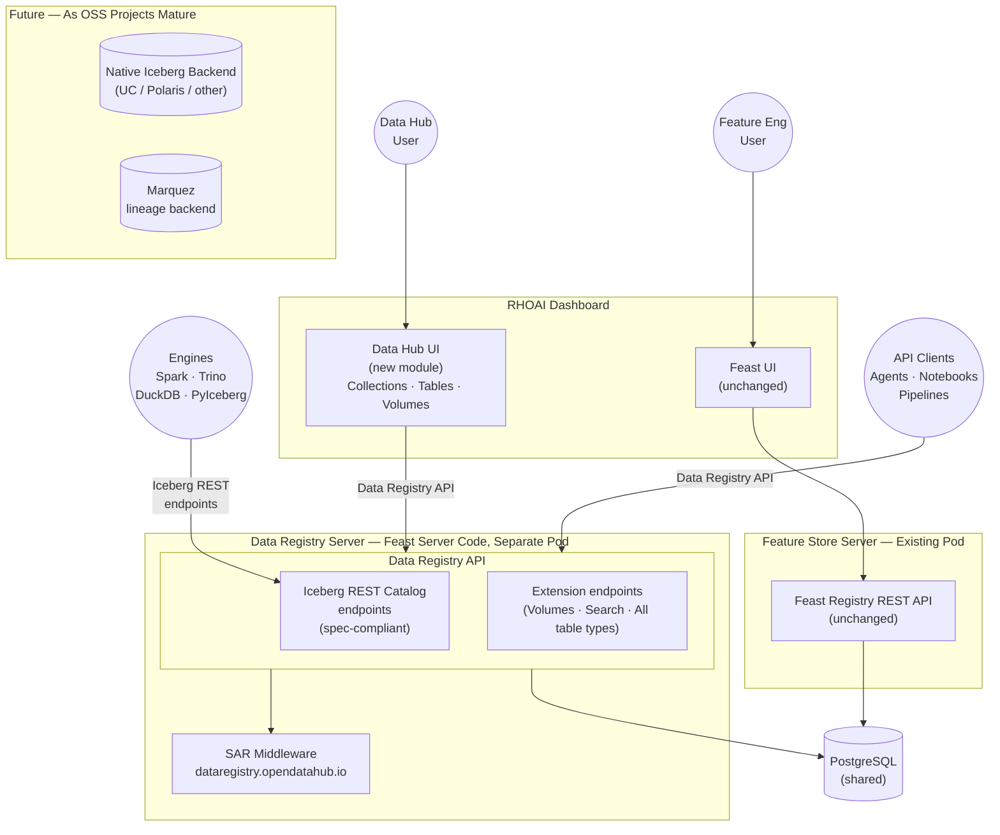

# ODH-ADR-DR-0001: Data Registry for RHOAI

|                |            |
| -------------- | ---------- |
| Date           | 2026-07-27 |
| Scope          | ODH |
| Status         | Approved |
| Authors        | [Ana Biazetti](@abiazetti) |
| Supersedes     | N/A |
| Superseded by  | N/A |
| Tickets        | TBD |
| Other docs     | N/A |

## What

RHOAI will ship a **Data Registry** as part of its Data capabilities. The Phase 1 implementation reuses the existing Feast server process and operator, exposes a **Data Registry API** that includes spec-compliant Iceberg REST Catalog endpoints for engine interoperability and extends them with additional endpoints for all asset types (volumes, non-Iceberg table types, search), and provides a **Data Hub UI** as a new module drawing on the existing Feast and MLflow Registries UX patterns. Access control uses the RHAI SAR pattern: Kubernetes-native RBAC via SubjectAccessReview against pseudo-resources. No new operators or CRDs are introduced in Phase 1.

## Why

RHOAI currently has no unified way for users to discover, browse, or manage data assets and their metadata across AI workloads:

- **No discoverability.** The existing Connection concept handles only the access information to S3/PVC/URL but it doesn't track the actual data asset metadata or content, so the data asset is not easily discoverable.
- **No agent-readiness.** Agentic workflows cannot discover or easily consume data artifacts at runtime — there is no registry, no API, no schema advertisement.
- **No lineage for auditability.** No audit trail for which data was used in which workflow or how the data was transformed/versioned. There is a level of lineage available in Feast, but only for Feature Engineering.
- **Competitive gap.** SageMaker and Vertex have integrated dataset registries. RHOAI users absorb friction that competitors have eliminated.

Feast provides a feature store UI focused on feature engineering (e.g., credit scoring, fraud detection using Feast for real-time feature serving), but users working on knowledge retrieval (e.g., document collections via Milvus and AIGW/OGX for RAG), agentic AI, or multi-modal workflows have no catalog experience.

Three factors drive the timing: (1) multiple FSI engagements require a data catalog for governed AI assets, (2) the Iceberg REST Catalog Spec has emerged as the de facto catalog interoperability standard with broad engine support, and (3) RHOAI already ships Feast and the kube-rbac-proxy SAR auth pattern — reusing both lets us deliver a registry MVP without new infrastructure.

This ADR scopes an MVP. Lineage and governance are addressed by the broader RHAI Data Strategy and are not in scope for Phase 1.

## Goals

* Deliver a Data Registry UI and API in RHOAI that lets users browse, search, and manage data assets from the RHOAI dashboard
* Expose a Data Registry API that includes spec-compliant Iceberg REST Catalog endpoints for engine interoperability and extends them to cover all asset types
* Support both predictive AI (feature engineering via Feast) and knowledge retrieval (document collections via Milvus + AIGW/OGX)
* Implement platform-native RBAC using the proven RHAI SAR pattern, with zero new auth infrastructure
* Ensure the architecture is backend-swappable: the Data Registry API is the stable contract; backends can change without affecting consumers
* Support volume extensions for unstructured document management in S3/MinIO (knowledge retrieval requirement)
* Link/integrate with [Data Connect Hub](https://github.com/opendatahub-io/architecture-decision-records/pull/149) for management of external data source connections, authentication, and ingestion

This ADR scopes the initial delivery using Feast as the registry backend with PostgreSQL storage, deployed as a dedicated server pod via the FeatureStore CRD with a Data Registry annotation.

## Non-Goals

* **Model registry.** RHOAI uses MLflow for model registry. The Data Registry does not replace or duplicate MLflow model management.
* **Full Iceberg REST compliance in Phase 1.** Full Iceberg REST compliance in Phase 1 is out of scope. However, for tables registered with type=iceberg, it is possible to read real metadata.json from S3 and return genuine schemas, snapshots, and partition specs — enabling native engine queries (Spark, PyIceberg, Trino) for Iceberg tables.
* **Row-level or column-level access control.** Kubernetes RBAC operates at the resource level (table, volume, namespace). Fine-grained data-level filtering requires a policy engine (JCasbin, OPA) as a future layer.
* **Cross-namespace registry federation in Phase 1.** SAR is namespace-scoped. Cross-namespace search and unified browsing across all namespaces are deferred to a future phase.
* **Replacing Feast for feature engineering.** Feast remains the feature store for predictive AI. The Data Registry adds a separate experience for broader data management use cases. Existing Feast APIs and UI are unchanged.
* **General-purpose data governance.** The Phase 1 scope covers registry CRUD, search, and RBAC. Policy management and compliance workflows are out of scope.
* **Moderated registration workflows.** Phase 1 uses open registration — any user with write access can register assets that are immediately visible. Approval queues (draft → review → publish) are a future consideration as a common platform capability across all RHOAI registries (data, models, pipelines), not a Data Registry–specific feature.
* **Cross-platform lineage.** Lineage tracking via Marquez/OpenLineage is out of scope for this ADR, but planned to be addressed separately by follow on phases of the Data Registry.

## How

### Architecture Overview

The Data Registry uses the **Reuse & Extend** approach: create a new Data Hub UI module with a **Data Registry API** implemented in a dedicated FeastStore instance. The Data Registry API includes spec-compliant Iceberg REST Catalog endpoints for engine interoperability and extends them with additional endpoints for volumes, search, and non-Iceberg table types.

The Iceberg REST Catalog Spec is the foundation: we adopted it as the catalog standard, already identified search and volumes as necessary extensions beyond the spec, and now extend further to support additional table types — while keeping the Iceberg REST Catalog endpoints intact for engine consumers (Spark, Trino, DuckDB, PyIceberg).

The Data Registry server runs as a **separate pod** — a dedicated FeastStore instance distinct from the feature engineering Feast instance. This Data Registry follows the same multitenant model as MLflow registries: one Data Registry instance per RHOAI installation serving all namespaces, with namespace-scoped SAR authorization controlling access to individual registry objects. There is no per-namespace Data Registry instance. When both Feature Engineering and Data Registry are enabled, the cluster runs two Feast Server deployments — one for feature engineering, one for the Data Registry. They share the same PostgreSQL database but are separate pods. The FeatureStore CRD uses an annotation to designate the Data Registry instance.

Engines query the Data Registry for table metadata, then access the underlying storage (S3/MinIO) using RHAI connections or DCH.

### Frontend: Data Hub UI

The Data Hub UI is a new module drawing on existent Feast and MLflow Registry UX patterns. This is a new module following the dashboard's BFF and modular federation patterns, not a long-lived fork. Completely rebranded with no feature engineering terminology. Shows Collections, Tables, and Volumes.

The Data Hub UI talks exclusively to the Data Registry API. It does not call Feast APIs directly. This makes the UI backend-agnostic: if a different registry backend is adopted in the future, the UI does not require changes.

#### Dashboard Integration

The RHOAI dashboard uses **Module Federation** to load feature plugins at runtime, and the **BFF sidecar pattern** for modules that need server-side logic. The BFF sidecar is the recommended architecture for all new dashboard UI modules, established by model-registry and gen-ai.

The Data Hub UI follows this pattern: a new `@odh-dashboard/data-hub` package with a BFF sidecar that proxies Data Registry API requests to the Data Registry server, forwarding the user's OAuth bearer token. The BFF does not hold a privileged service account — authorization is evaluated by kube-rbac-proxy on the Data Registry server against the caller's identity. Runs on a dedicated port within the dashboard pod.

### Backend: Data Registry API in Feast Server

The Data Registry server exposes a **Data Registry API**, implemented in the Feast server codebase alongside the existing Feast Registry REST API. The Data Registry API builds on the Iceberg REST Catalog Spec as its foundation and extends it:

- **Iceberg REST Catalog endpoints** — spec-compliant endpoints for engine interoperability. Serve only Iceberg tables with genuine metadata, enabling native engine queries (Spark, Trino, Flink, DuckDB, PyIceberg). Non-Iceberg assets are not visible through these endpoints.
- **Extension endpoints** — endpoints beyond the Iceberg REST Catalog Spec that serve the complete set of data assets. We already identified search and volumes as necessary extensions (neither is part of the Iceberg REST spec). Supporting additional table types (Parquet, CSV, PostgreSQL, and others) is a natural extension of the same approach — the Data Registry API covers all registered asset types, not just Iceberg tables.

The Iceberg REST Catalog Spec is the de facto standard catalog protocol, with native client support in every major query engine and data platform. Including spec-compliant Iceberg REST Catalog endpoints in the Data Registry API gives RHOAI **multi-engine connectivity** — any engine or platform that speaks the Iceberg REST Catalog Spec can discover RHOAI-managed Iceberg table metadata with no custom connectors.

The Data Registry API translates to Feast registry internals in Phase 1. Feast SavedDataset backs both tables and volumes. Three-level namespaces are used from Phase 1 (`{project}/{rhai-namespace}/{collection}/{asset}`) so that asset paths are stable if a different registry backend is adopted in the future.

When a user registers an external dataset, they provide schema metadata (column names, types, descriptions) as part of the registration form. Automatic schema inference is deferred to Phase 2. Phase 1 relies on user-provided schema definitions.

### Access Control: Platform-Native RBAC via SAR

Every Data Registry API request is authorized via Kubernetes-native RBAC before reaching any backend. This uses the same SubjectAccessReview pattern as MLflow in RHOAI.

**Pseudo-resources** in the `dataregistry.opendatahub.io` API group:

| Pseudo-resource | Maps to | Used for |
|---|---|---|
| `namespaces` | Iceberg Namespace | RHAI multi-tenancy |
| `collections` | Iceberg Namespace / UC Schema | Grouping of datasets |
| `tables` | Iceberg Table / UC Table | Table read, write, manage |
| `volumes` | UC Volume (unstructured data) | Volume browse and file access |

**ClusterRoles** with aggregation labels auto-inject into standard OCP roles:
- `dataregistry-view` aggregates into OCP `view` (read-only registry access)
- `dataregistry-edit` aggregates into OCP `edit` (read + write)
- `dataregistry-admin` aggregates into OCP `admin` (full access)

Users with existing namespace roles automatically receive the corresponding Data Registry access level — `view` grants read-only registry access, `edit` grants read-write, `admin` grants full access. No additional RBAC configuration is needed. Permissions are managed via standard `oc create rolebinding` or the OCP Console UI.

**Registry-only sharing:** For cross-team data sharing with reduced blast radius, admins can bind `dataregistry-view` or `dataregistry-edit` directly to users who do not have a namespace role. This grants registry access (browse collections, tables, volumes) without K8s infrastructure visibility (pods, Secrets, ConfigMaps). Note: because role aggregation is a one-way, cluster-wide property of the ClusterRole definition, users who *do* have namespace roles (`view`, `edit`, `admin`) will always receive the corresponding Data Registry permissions — this cannot be selectively disabled per user. The Data Registry server returns registry metadata only — it does not proxy data connections or storage access.

**Caching:** SAR result caching will be handled by kube-rbac-proxy's standard caching capabilities.

**Granularity:** The initial product requirement scopes SAR authorization at the **project/namespace level**, not per-table or per-volume. A user with access to a namespace can browse all registry assets within it. Per-resource granularity (table-level, volume-level) is architecturally supported via K8s `resourceNames` but is not required for Phase 1. This keeps SAR call volume low — one check per namespace, not per item — and matches the MLflow SAR implementation, which operates at the same granularity with no reported performance issues in production.

**Why SAR over alternatives:** Three backend auth options were evaluated and rejected. Feast RBAC requires Python code (`feast apply`), has a default-open security model, no admin UI, and no group support. UC JCasbin has limited privileges (8 types), no groups, no inheritance, and ownership-based visibility. The Iceberg REST Catalog spec has zero authentication. Building or fixing auth in each backend means maintaining multiple auth implementations that must stay synchronized across backend swaps. The SAR pattern avoids all of this by delegating auth to the platform — the same middleware works regardless of whether the backend is Feast, UC, or Polaris.

**Trade-offs:**
- **Resource-level only** — K8s RBAC cannot express row-level or column-level access control. Fine-grained data access would require a second layer (OPA, JCasbin) in the future.
- **Namespace-scoped** — SAR evaluates per namespace. Phase 1 checks authorization at the project/namespace level only (per PM requirement prioritization), keeping SAR call volume low — one check per namespace, not per asset. Cross-namespace search is handled server-side with batch SAR checking. This follows the same SAR approach as MLflow with similar scalability considerations.
- **No purpose-built RBAC UI** — Admins manage registry permissions via `oc create rolebinding` or the generic OCP Console RBAC views, which are not tailored for registry-specific permission management.
- **No metadata sensitivity classification** — The registry does not classify assets by sensitivity level (e.g., PII, confidential, internal). No existing RHAI registry (MLflow model registry, Feast feature store) implements data classification today. This is deferred to Phase 2 alongside lineage and governance work.

### Data Registry Server Provisioning

The Data Registry server is provisioned via the existing FeatureStore CRD, with an annotation designating the instance as a Data Registry. When present, the Feast operator deploys a separate Data Registry server pod alongside the feature store server, both pointing to the same PostgreSQL database. No new CRs are introduced.

Individual Data Registries are **not** provisioned via CRs or GitOps. A registry for a given RHAI namespace is created implicitly when users register their first dataset with that namespace — the same pattern used by MLflow registries. Registries are dynamically managed data objects, not cluster-level configurations.

### Assumptions

1. **Both predictive AI and knowledge retrieval are supported through the platform.** Feature engineering (e.g., credit scoring, fraud detection) uses Feast. Knowledge retrieval (e.g., document collections for RAG) uses Milvus + AIGW/OGX.
2. **Iceberg REST Catalog Spec is the long-term engine interoperability standard.** All architecture paths converge on the Iceberg REST Catalog Spec for engine access to Iceberg tables. This ADR adopts it from day one.
3. **Phases are cumulative. No throwaway work.** The Data Registry API and SAR auth added in Phase 1 remain the stable contracts regardless of which backend is used.

## Alternatives

#### Alternative 1: Greenfield on Unity Catalog OSS

Build a new Data Registry server on Unity Catalog OSS with a new operator, new image builds, and new CRDs.

**Why not:** Evaluation revealed UC integration requires filling in multiple OSS gaps, as well as a new operator (server deployment, PostgreSQL lifecycle, `UnityRegistry` CRD, SCIM sync controller, OAuthClient lifecycle, registry auto-provisioning), an auth bridge (UC has no auth plugin architecture — requires a code fork), and a search API build. The architecture offers the highest long-term flexibility, but front-loads ~16-24 weeks of infrastructure work that can be deferred until UC matures.

#### Alternative 2: Extend Feast into a General Registry

Widen Feast itself into a broader data registry by extending the UI and adding new resource types to the registry, using Feast APIs directly (no Iceberg REST).

**Why not:** Feast has fundamental catalog weaknesses — no unstructured data awareness, no governance model beyond tags, and only 2 of 13 Feast types have Iceberg counterparts. Using Feast APIs instead of Iceberg REST locks consumers to a non-standard interface, and technical debt compounds each release without convergence on OSS standards.

#### Alternative 3: PyIceberg-Based Standalone Registry Server

Build a purpose-built server implementing the Iceberg REST Catalog API using PyIceberg's `SqlCatalog` backend. Fully decoupled from Feast.

**Why not:** Requires a new RHAI service to productize (Konflux images, operator or sub-operator, security review). The higher build cost (~14-21 weeks vs ~8-12 weeks for the chosen approach) is the primary trade-off. The productization overhead does not justify a standalone server for Phase 1.

#### Alternative 4: MLflow Server as Registry Backend

Add Iceberg REST Catalog API endpoints to the MLflow server instead of Feast, reusing the existing MLflow deployment.

**Why not:** MLflow has no data asset primitives to translate from — unlike Feast, where DataSource/SavedDataset map to Iceberg Tables. Building Iceberg REST endpoints on MLflow would require a greenfield registry data model hosted inside the MLflow process, without any reuse benefits. MLflow is valuable as a **peer service** (AI asset registries, model lineage, LLM tracing), not as the registry backend.

## Security and Privacy Considerations

Users authenticate via OpenShift OAuth. The Data Registry server receives requests through kube-rbac-proxy (ODH fork), which handles both authentication and SAR authorization in a single sidecar. The model is default-deny: users without explicit RoleBindings cannot access any registry resources. Kubernetes audit logging captures every SAR call with user identity, resource, verb, namespace, and decision.

Encryption in transit (TLS) and at rest are provided by the OpenShift platform. The Data Registry reuses the Feast server's existing encryption configuration, which is already GA in RHOAI.

The Data Registry does not store or manage credentials. When registering a table or volume, users can optionally link the dataset to a connection object. The registry stores the reference, not the credentials themselves.

## References

* [Iceberg REST Catalog Spec](https://iceberg.apache.org/rest-catalog-spec/#rest-catalog-protocol) — official Apache Iceberg REST Catalog protocol specification
* [Feast](https://github.com/feast-dev/feast) — open-source feature store used as Phase 1 registry backend
* [opendatahub-io/odh-dashboard](https://github.com/opendatahub-io/odh-dashboard) — RHOAI dashboard (Module Federation, BFF sidecar pattern)
* [opendatahub-io/architecture-context](https://github.com/opendatahub-io/architecture-context) — ODH architecture context and patterns
* [Data Connect Hub ADR (PR #149)](https://github.com/opendatahub-io/architecture-decision-records/pull/149) — data connectivity complement

## Reviews

| Reviewed by | Date | Notes |
| ----------- | ---- | ----- |
|  @danielezonca   |   2027-08-14   |       |
