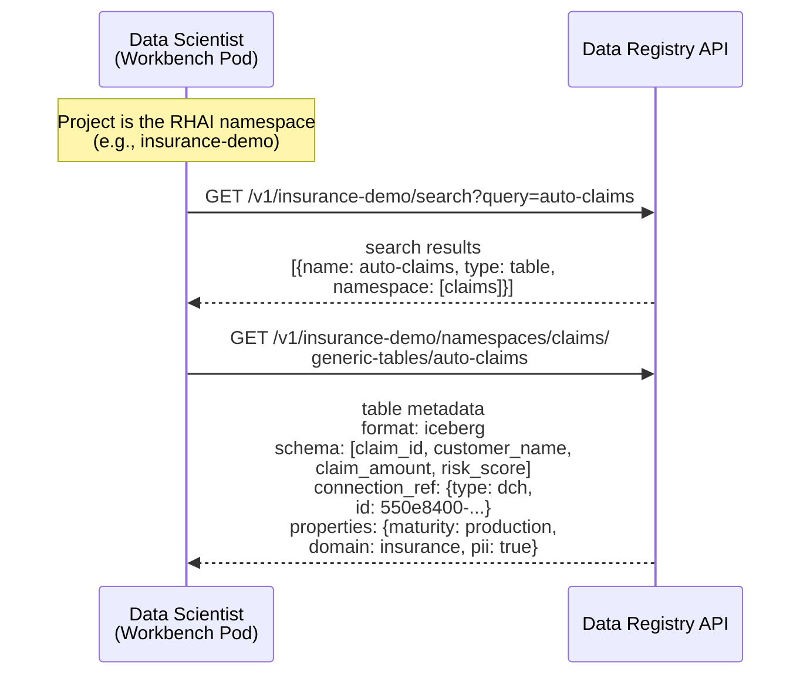
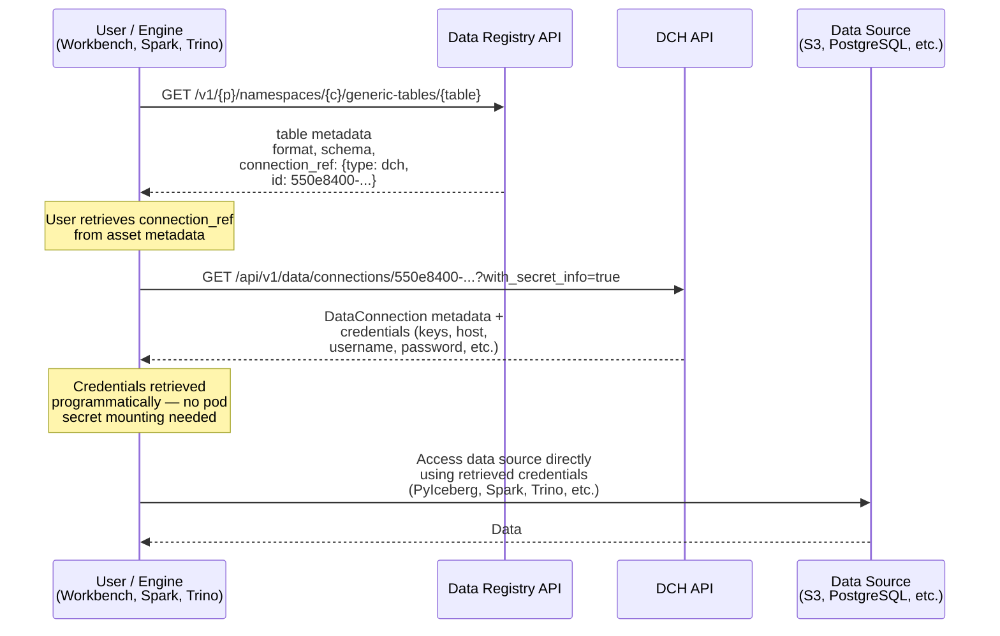
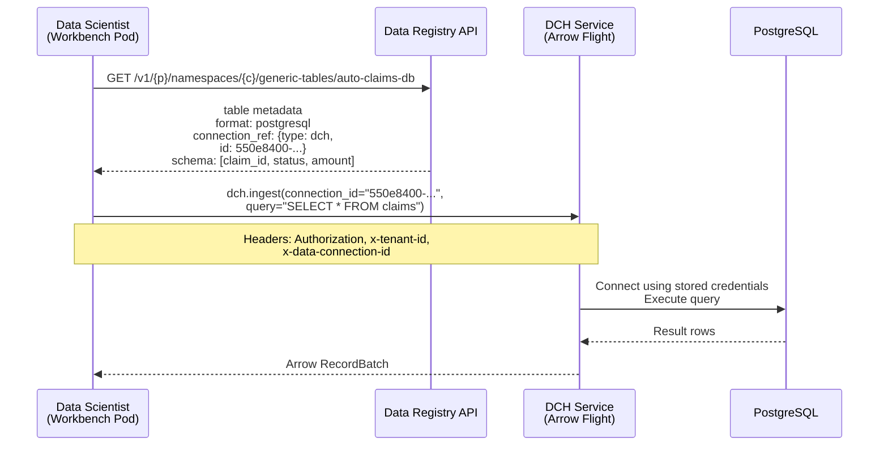
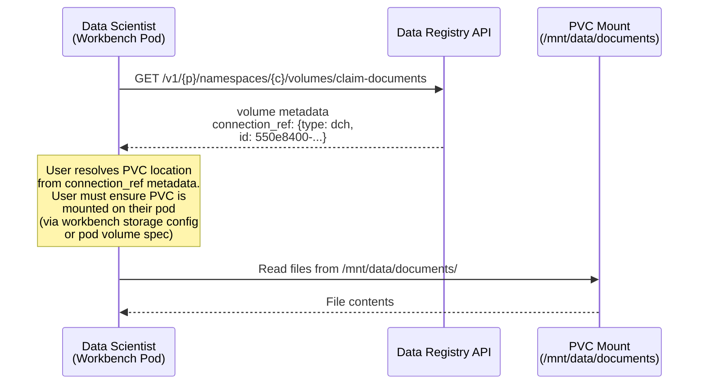

# ODH-ADR-DR-0002: Data Registry and Data Connect Hub Integration

|                |            |
| -------------- | ---------- |
| Date           | 2026-08-05 |
| Scope          | ODH |
| Status         | Draft |
| Authors        | [Ana Biazetti](@abiazetti) |
| Supersedes     | N/A |
| Superseded by  | N/A |
| Tickets        | TBD |
| Other docs     | [ADR-DR-0001: Data Registry](https://github.com/opendatahub-io/architecture-decision-records/pull/150), [DCH ADR](https://github.com/opendatahub-io/architecture-decision-records/pull/149) |

## What

This ADR defines the integration contract between the **Data Registry** ([ADR-DR-0001](https://github.com/opendatahub-io/architecture-decision-records/pull/150)) and the **Data Connect Hub** (DCH, [PR #149](https://github.com/opendatahub-io/architecture-decision-records/pull/149)). The Data Registry tracks *what* data exists — tables, volumes, metadata, schema. DCH manages *how* to connect to and ingest data from external sources.

The integration is based on a `connection_ref` field that each Data Registry asset (table or volume) can optionally carry, pointing to a DCH DataConnection or an RHAI Connection. The `connection_ref` includes a type discriminator (`dch` or `rhai`) and the connection identifier (UUID for DCH, secret name for RHAI). In both cases, `connection_ref` references a *connection object* — not raw credentials. The actual secret is resolved through the respective connection API. This ADR defines the connection reference contract and three consumption scenarios for the 3.6 release.

Future integration scenarios (automated schema discovery and cross-component lineage via OpenLineage) are defined in [ADR-DR-0003](https://github.com/opendatahub-io/architecture-decision-records/pull/154).

## Why

The Data Registry and DCH are being developed in parallel. Defining the integration contract now — before either component ships — ensures users get a coherent "find to use" experience from the first release, rather than requiring a retrofitted integration later.

- **Unified "find to use" experience.** The product requirement is that discovering an asset and accessing its data should work as an unified and consistent flow, although underlying systems may be different.
- **Connection flexibility.** DCH connections must work like RHAI Connection secrets at the basic level — mountable on pods for direct data access via standard libraries. For clients that need mediated access to data sources (e.g., PostgreSQL via Arrow Flight), DCH provides ingestion APIs that handle driver complexity and credential isolation.
- **Consistent authorization.** Both the Data Registry and DCH use SubjectAccessReview (SAR) via kube-rbac-proxy with Kubernetes-native RBAC. The auth model is already aligned, but the integration contract — which permissions are needed for the end-to-end flow — must be explicit.
- **Local storage independence.** Not all data requires external connections. Volumes backed by PVC storage use OpenShift-managed credentials with no DCH involvement. The Registry must work both with and without DCH.

## Goals

* Define the `connection_ref` contract: how Data Registry assets reference DCH DataConnections and RHAI Connections, including a type discriminator
* Define three consumption scenarios for the 3.6 release, each with an end-to-end flow diagram
* Establish the shared SAR authorization model across the Data Registry and DCH API groups
* Define edge-case behavior: deleted connections, DCH not enabled, connection status visibility

## Non-Goals

* **Changing the internal architecture of either component.** The Data Registry and DCH internals are defined by their own ADRs. This ADR covers only the integration boundary.
* **Schema synchronization in 3.6.** Automated schema discovery from data sources is a future scenario documented in [ADR-DR-0003](https://github.com/opendatahub-io/architecture-decision-records/pull/154).
* **Lineage tracking across the integration boundary in 3.6.** Cross-component lineage via OpenLineage is out of scope for 3.6, documented in [ADR-DR-0003](https://github.com/opendatahub-io/architecture-decision-records/pull/154).

## How

### Connection Reference Model

The Data Registry `connection_ref` field on tables and volumes stores a reference to a connection object — either a DCH DataConnection (identified by UUID) or an RHAI Connection (identified by secret name). The field is optional — assets with locally mounted PVC volumes do not require a connection reference.

`connection_ref` always points to a connection *object*, never to raw credentials. It includes two subfields:

| Subfield | Description | Example |
|---|---|---|
| `type` | Discriminator: `dch` or `rhai` | `dch` |
| `id` | DCH DataConnection UUID or RHAI Connection secret name | `550e8400-e29b-41d4-a716-446655440000` |

The `type` field tells consumers how to resolve the connection:
- **`dch`:** Call `GET /api/v1/data/connections/{id}` to retrieve the DCH DataConnection resource, which includes a `secret-ref` pointing to the credentials secret.
- **`rhai`:** The `id` is the name of a labeled Kubernetes secret (`opendatahub.io/dashboard=true`, `opendatahub.io/managed=true`). The secret is resolved directly via the Kubernetes API.

In the table below we list the different Data Registry Asset Types and formats, and which connection pattern they support as well as whether DCH will support their direct Ingestion (in 3.6).

| Asset Type | Format | Connection Pattern | connection_ref | Ingestion |
|---|---|---|---|---|
| Table | iceberg | S3 credentials via DCH API or RHAI secret | `{type: dch, id: uuid}` or `{type: rhai, id: secret-name}` | Direct (PyIceberg, Spark, Trino) |
| Table | postgresql | DCH DataConnection | `{type: dch, id: uuid}` | DCH SDK |
| Table | oci (OCI Artifact registry) | Credentials via DCH API or RHAI secret | `{type: dch, id: uuid}` or `{type: rhai, id: secret-name}` | Direct (user libraries) |
| Volume | s3 | S3 credentials via DCH API or RHAI secret | `{type: dch, id: uuid}` or `{type: rhai, id: secret-name}` | DCH SDK (jsonl, binary via Flight) or Direct (user libraries) |
| Volume | uri/pvc | Credentials via DCH API or RHAI secret, or OpenShift-managed (local PVC) | `{type: dch, id: uuid}` or `{type: rhai, id: secret-name}` or None (local) | Direct (user libraries / filesystem) |
| Volume | hugging face (custom uri) | Credentials via DCH API or RHAI secret | `{type: dch, id: uuid}` or `{type: rhai, id: secret-name}` | Direct (user libraries) |

**Ingestion column:** "Direct" means the user's own client libraries access the data source using credentials retrieved from the connection — DCH does not mediate the data transfer. "DCH SDK" means DCH handles the connection, query execution, and data transfer on the user's behalf (Scenario 2).

DCH auto-migrates existing RHAI Connections by watching labeled Kubernetes secrets. When DCH and the Data Registry are both enabled, existing RHAI Connections are converted into DCH DataConnections. Data assets with a `connection_ref` pointing to an RHAI Connection continue to work — the underlying secret remains the same. New data assets created after migration will reference the DCH DataConnections directly.

**Retrieving credentials from a DCH DataConnection:**

For Scenario 1, users need direct access to connection credentials (e.g., S3 keys) without relying on DCH ingestion APIs. Rather than requiring users to mount the connection secret onto their pod — which can cause conflicts when multiple connections use the same environment variable names (e.g., `AWS_ACCESS_KEY_ID`) — DCH supports retrieving credentials programmatically:

```http
GET /api/v1/data/connections/{id}?with_secret_info=true
```

By default, the DCH DataConnection response does not include credential values — the admin/secret section is omitted for regular users. If the caller has RBAC permissions to read secrets (`secrets: get` in the namespace), the `?with_secret_info=true` query parameter instructs DCH to unpack the secret keys and include them in the response. This allows users to retrieve credentials on demand without pod-level secret mounting, avoiding environment variable collisions across multiple connections.


### Client Integration for 3.6

For 3.6, the client (notebook, pipeline, agent) performs the multi-step flow: discover via Data Registry API, resolve connection via DCH API, access data. A platform SDK that orchestrates this flow into a single call is a future enhancement (see [Alternative 2](#alternative-2-credential-vending-via-data-registry-loadtable) and [ADR-DR-0003](https://github.com/opendatahub-io/architecture-decision-records/pull/154)).

### Scenario 0: Discovering a Data Asset

A data scientist working in a workbench pod wants to find claims-related data. They search the Data Registry using the Data Registry API, find the asset they need, and retrieve its full metadata — including schema, connection reference, and properties.



The search endpoint is defined in the [Data Registry API contract](https://github.com/opendatahub-io/architecture-decision-records/pull/150). It returns matching assets across all collections in the project. The user then retrieves the full table metadata — format, schema, connection reference, and properties — which provides information needed to decide how to access the data (Scenarios 1-3).

### Scenario 1: Direct Data Access Without DCH Ingestion

The user retrieves connection credentials from the DCH API and accesses the data source directly, without delegating ingestion to DCH. This scenario applies when:

- The user already has specific libraries to access certain data sources (e.g., PyIceberg for Iceberg tables on S3)
- A compute engine (Spark, Trino, DuckDB) needs raw credentials because it has its own connectors and query optimizer — it cannot delegate ingestion to DCH
- The data source type is not yet supported by DCH ingestion

The user discovers the asset in the Data Registry, retrieves the `connection_ref`, and calls the DCH API with `?with_secret_info=true` to get the credentials programmatically.



The user resolves the `connection_ref` by calling the DCH API with `?with_secret_info=true`, which returns the credential values inline (requires `secrets: get` RBAC permission). This avoids the need to mount connection secrets on the pod. DCH's role is managing the connection lifecycle (creation, credential rotation, auto-migration from RHAI Connections) and serving credentials on demand. The Data Registry's role is providing the table schema and metadata.

**Note:** Clients may continue to use the current approach of mounting connection secrets as environment variables or files on their pods, as documented in [Alternative 1](#alternative-1-mounting-connection-secrets-on-pods). The `?with_secret_info=true` flow is an additional option — not a replacement for direct secret mounting.

### Scenario 2: User takes advantage of DCH Ingestion to access data - PostgreSQL Table via DCH Ingestion API

A data scientist discovers a PostgreSQL table in the Data Registry. They use the DCH Python SDK to ingest data — without needing database credentials or PostgreSQL driver libraries on their pod.



The user never sees database credentials. DCH handles driver dependencies, connection pooling, and credential management. The Data Registry provides the `connection_ref` that links the table asset to the right DCH DataConnection.

This pattern is essential for:
- Data sources where users benefit from DCH handling the connection and data transfer (e.g., PostgreSQL, S3 with jsonl/binary formats)
- Environments where credential exposure to user pods must be minimized
- Clients that do not want to install and maintain database-specific driver libraries

### Scenario 3: Local PVC Volume

A data scientist discovers a volume in the Data Registry backed by local PVC storage. The volume's `connection_ref` points to the RHAI or DCH connection that describes the PVC, but the user must still ensure the PVC is mounted on their pod.



Local storage is managed by OpenShift (PersistentVolume / PersistentVolumeClaim). The `connection_ref` points to the connection describing the PVC, but no credential retrieval via DCH is needed — the user is responsible for ensuring the PVC is mounted on their pod, via workbench storage configuration in the RHOAI Dashboard or by specifying the volume in their pod spec.

**Broader applicability:** This scenario is not limited to PVC-backed volumes. Any RHAI Connection type can follow this pattern — the user mounts the connection secret directly on their pod (as environment variables or files) and accesses the data source without involving DCH or the Data Registry at runtime. This is the default approach today for RHAI Connections. The Data Registry is optional in this flow: users can continue to discover and use RHAI Connections through the RHOAI Dashboard exactly as they do today, whether or not the corresponding data asset is registered in the Data Registry.

### Edge Cases

| Edge Case | Behavior |
|---|---|
| `connection_ref` points to a deleted DCH DataConnection | Data Registry still shows the asset. UI shows connection status as "Not Found". User can update `connection_ref` to point to a valid connection. |
| DCH not enabled in namespace | Data Registry works standalone. `connection_ref` can store RHAI Connection secret names (`type: rhai`). DCH-specific actions (e.g., `?with_secret_info=true`) are unavailable; UI hides them. |
| DCH DataConnection exists but is not ready | UI shows connection status. Asset is browsable in the Data Registry, but accessing data may fail. UI warns about connection state. |
| Asset registered without `connection_ref` | Valid for local PVC volumes and assets where the user manages access independently. |
| RHAI Connection after DCH auto-migration | Both `type: rhai` and `type: dch` references remain valid. The underlying Kubernetes secret is preserved by DCH during migration. |
| `connection_ref` type does not match the asset format | The consuming client must validate that the connection type is compatible with the asset format before resolving credentials — e.g., reject PostgreSQL connection credentials for an Iceberg table, or S3 credentials for a PostgreSQL ingestion. Mismatched references should be surfaced as a validation error, not silently resolved. |

**Connection status visibility:** The Data Registry stores `connection_ref` as metadata — it does not track or validate the connection's runtime status. When an asset has a `connection_ref`, the consuming client (notebook, pipeline, agent, Data Hub UI) resolves connection status through the path appropriate for the connection type: for `type: dch`, call the DCH API (`GET /api/v1/data/connections/{id}`) to determine whether the connection exists, is ready, or is accessible to the current user; for `type: rhai`, check the referenced Kubernetes secret directly in the asset's namespace. The Data Registry returns the asset regardless of connection state; it is the responsibility of the consuming client to check connection status and surface appropriate guidance — such as "connection not found", "connection not ready", or "insufficient permissions" — before the user attempts to access the data.

## Alternatives

### Alternative 1: Mounting Connection Secrets on Pods

Current (as of RHAI 3.5) RHAI Connections expose credentials as Kubernetes secrets that can be mounted on pods as environment variables. Users attach an RHAI Connection to a workbench via the RHAI Dashboard, and clients can continue to use this approach.

**Known restrictions with environment variable mounting:**

- **Environment variable collisions.** Mounting connection secrets as environment variables on the pod causes conflicts when multiple connections use the same variable names (e.g., `AWS_ACCESS_KEY_ID`). RHAI connections currently enforce a restriction that only one connection of the same type (e.g., S3) can be attached to a workbench, specifically because of these environment variable name collisions. This can be addressed by mounting secrets as files in different paths or by using environment variable prefixes in the pod descriptor.
- **Workbench restart required.** A workbench must be restarted to attach a new connection to the pod — whether mounted as environment variables or files. For secrets already mounted as files, the kubelet updates the file contents automatically when credentials rotate, without requiring a restart.

**DCH ExportedSecret:** When a DCH DataConnection is marked as `exportAsSecret`, the DCH service API layer automatically creates the exported secret — it is ready to use. The user specifies the secret name, so the user knows directly where to find it. The exported secret can then be mounted on pods following the same patterns described above.

### Alternative 2: Credential Resolution via Data Registry loadTable

Iceberg engines (PyIceberg, Spark, Trino) expect `loadTable` to return credentials in the response `config` field — this is the standard Iceberg REST Catalog pattern (how Unity Catalog and Polaris work). If DCH had a credential resolution API, the Data Registry `loadTable` could call it internally and return credentials in `config`. Engines would get everything in one call — no separate DCH API call, no mounting secrets, no workbench restart.

This approach would improve Scenario 1 by eliminating the extra step of calling the DCH API with `?with_secret_info=true` — credentials would be returned as part of the standard Iceberg REST Catalog flow. However, it requires a new server-to-server integration between the Data Registry and DCH (the Registry would need to call DCH's credential resolution API during `loadTable`), which introduces a runtime dependency and is out of scope for the current release. This is tracked as a future integration scenario in [ADR-DR-0003](https://github.com/opendatahub-io/architecture-decision-records/pull/154).

**Scoping note:** DCH returns credentials from Kubernetes secrets only (given proper RBAC permissions). There is no plan in DCH to integrate with cloud-native credential resolution services (AWS STS, IBM Cloud IAM, GCP, Azure) or Vault. A future `loadTable` credential resolution integration would be scoped to Kubernetes secret-based credentials resolved through DCH.

## Security and Privacy Considerations

### Shared Authorization Model

Both the Data Registry and DCH use SubjectAccessReview (SAR) via kube-rbac-proxy for authorization. Each component defines its own Kubernetes API group and RBAC resources.

**Data Registry — namespace-scoped authorization for 3.6:**

The Data Registry defines three ClusterRoles that grant access to all registry resources within a namespace:

| ClusterRole | Access Level |
|---|---|
| `dataregistry-view` | Read-only access to all Data Registry resources (namespaces, tables, volumes) |
| `dataregistry-edit` | Read and write access to Data Registry resources |
| `dataregistry-admin` | Full access including administrative operations |

Authentication uses bearer token (JWT) validated via Kubernetes TokenReview. Authorization uses SAR scoped to the namespace (RHOAI project). A user with `dataregistry-view` in namespace `ml-team` can view all tables and volumes in that namespace, but cannot access assets in other namespaces. Per-resource authorization (e.g., restricting access to a specific collection or table) is a future enhancement.

**Data Connect Hub — resource-level authorization:**

DCH uses API group `dataconnecthub.opendatahub.io` with the following resources and verbs:

| Resource | Verbs | Used For |
|---|---|---|
| `data-connection` | create, read, patch, delete | Managing DCH DataConnection resources (CRUD) |
| `data-connection-types` | create, read, patch, delete | Managing connection type definitions |
| `data-store` | get | Data ingestion via REST and Arrow Flight gRPC |

DCH uses kube-rbac-proxy for REST endpoints and in-service SubjectAccessReview for Arrow Flight gRPC (since gRPC does not pass through the HTTP proxy).

**End-to-end permissions for "find to use" scenarios:**

| Scenario | Data Registry Permission | DCH Permission |
|---|---|---|
| Scenario 0: Discover assets | `dataregistry-view` in namespace | -- |
| Scenario 1: Direct access without DCH ingestion | `dataregistry-view` in namespace | `data-connection: read` + `secrets: get` |
| Scenario 2: PostgreSQL via DCH ingestion | `dataregistry-view` in namespace | `data-connection: read` + `data-store: get` |
| Scenario 3: PVC volume | `dataregistry-view` in namespace | `data-connection: read` |

**Permissions for asset registration and connection creation:**

The table above covers the consumption side — discovering and using data. Registering assets and creating connections require additional permissions:

| Operation | Data Registry Permission | DCH Permission | K8s Permission |
|---|---|---|---|
| Register a table or volume | `dataregistry-edit` in namespace | -- | -- |
| Create a DCH DataConnection (secret exists) | -- | `data-connection: create` | -- |
| Create a DCH DataConnection (new secret) | -- | `data-connection: create` | `secrets: create` in namespace |
| Retrieve credentials via DCH API (`?with_secret_info=true`) | -- | `data-connection: read` | `secrets: get` in namespace |

DCH does not introduce new K8s Secret permissions — credentials still live in standard Kubernetes secrets, and mounting or reading them requires the same `secrets: get` permission as any other secret. Creating a DataConnection via the DCH API requires `data-connection: create`; if the underlying secret does not yet exist, `secrets: create` is also needed.

Both components use ClusterRole aggregation labels to auto-inject permissions into standard OpenShift roles (`view`, `edit`, `admin`). Users with existing namespace roles automatically receive the corresponding Data Registry and DCH permissions without additional RBAC configuration.

**Aggregated roles summary:**

| OpenShift Role | Data Registry ClusterRole | Data Registry Verbs | DCH Permissions |
|---|---|---|---|
| `view` | `dataregistry-view` | `get`, `list` on namespaces, tables, volumes | `data-connection: read`, `data-store: get` |
| `edit` | `dataregistry-edit` | `get`, `list`, `create`, `update`, `delete` on namespaces, tables, volumes | `data-connection: create, read, patch, delete`, `data-store: get` |
| `admin` | `dataregistry-admin` | Same as edit (future: grant/revoke capabilities) | Full DCH access |

For most deployments, this means zero additional RBAC configuration — users who can already work in a namespace can automatically use the Data Registry and DCH in that namespace.

### Credential Isolation

- The Data Registry stores `connection_ref` — a pointer to a DCH DataConnection (UUID) or RHAI Connection (name). It never stores or accesses credential content. Credentials are resolved through the connection object's API.
- SAR authorization is evaluated independently by each component. Compromising one component's authorization does not grant access to the other.
- In Scenario 1, the `?with_secret_info=true` flow requires Kubernetes `secrets: get` permission in the namespace. This permission grants read access to *all* secrets in that namespace, not just connection secrets. This is consistent with the existing RHAI security model (users who mount connection secrets on workbenches already have `secrets: get`), but administrators should be aware of the blast radius. Future releases may scope this more narrowly via DCH-level access controls.
- In Scenario 2, DCH mediates all credential access. The calling user's pod never receives raw database credentials — DCH connects to the data source on the user's behalf and returns only query results.
- In Scenario 3, volume security relies entirely on OpenShift PV/PVC access control model.
- Both components use TLS for all API communication. The Data Registry reuses the Feast server's existing TLS configuration; DCH uses OpenShift service-serving certificates.

## Risks

- **DCH availability affects Scenarios 1 and 2.** If DCH is down, Scenario 1 users cannot retrieve credentials via `?with_secret_info=true`, and Scenario 2 users cannot ingest data via the DCH SDK. Only Scenario 3 (PVC) is fully independent of DCH. Users with pre-existing RHAI Connection references (`type: rhai`) can still resolve credentials directly via the Kubernetes API, bypassing DCH.
- **Auto-migration timing.** DCH auto-migrates RHAI Connections by watching labeled Kubernetes secrets. If migration has not completed, a `connection_ref` with `type: dch` pointing to a DCH DataConnection UUID may not yet resolve. The UI should handle this gracefully.
- **RHAI migration lifecycle (open — DCH team to resolve).** When DCH auto-migrates an RHAI Connection, it is not yet specified whether the original Kubernetes secret is preserved as-is (with the DCH DataConnection pointing to it) or copied into a new secret. This affects: (1) whether existing `type: rhai` references continue to resolve after migration, (2) what happens if someone deletes the original RHAI secret after a DCH DataConnection has been created from it, and (3) whether both the RHAI secret and the DCH DataConnection must be kept in sync. The DCH team should define this lifecycle in the DCH ADR.


## Stakeholder Impacts

| Group | Key Contacts | Date | Impacted? |
| ----- | ------------ | ---- | --------- |
| Data Registry | Ana Biazetti | 2026-08-05 | Yes — defines `connection_ref` contract on registry assets; Data Hub UI renders registry assets with `connection_ref` |
| Data Connect Hub | Marius Danciu | 2026-08-05 | Yes — Registry references DCH DataConnections; DCH manages connection lifecycle |
| Dashboard | Andy Stoneberg, Andrew Ballantyne | 2026-08-05 | Yes — impacts on RHAI connections and their current users |
| ODH Platform | Lindani Phiri | 2026-08-05 | Yes — ClusterRole aggregation across both API groups |

## References

* [ADR-DR-0001: Data Registry for RHOAI (PR #150)](https://github.com/opendatahub-io/architecture-decision-records/pull/150)
* [ADR-DR-0003: Future Integration Scenarios (PR #154)](https://github.com/opendatahub-io/architecture-decision-records/pull/154)
* [Data Connect Hub ADR (PR #149)](https://github.com/opendatahub-io/architecture-decision-records/pull/149)
* [Iceberg REST Catalog Spec](https://iceberg.apache.org/rest-catalog-spec/#rest-catalog-protocol)
* [opendatahub-io/kube-rbac-proxy](https://github.com/opendatahub-io/kube-rbac-proxy) — SAR authorization sidecar

## Reviews

| Reviewed by | Date | Notes |
| ----------- | ---- | ----- |
| N/A | | |
