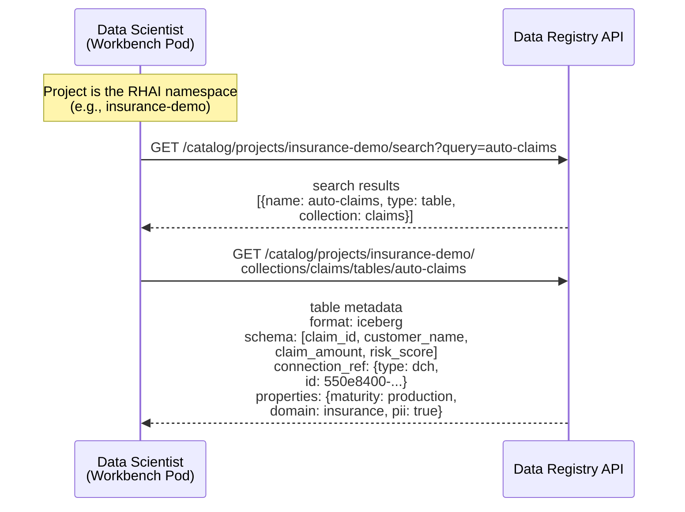
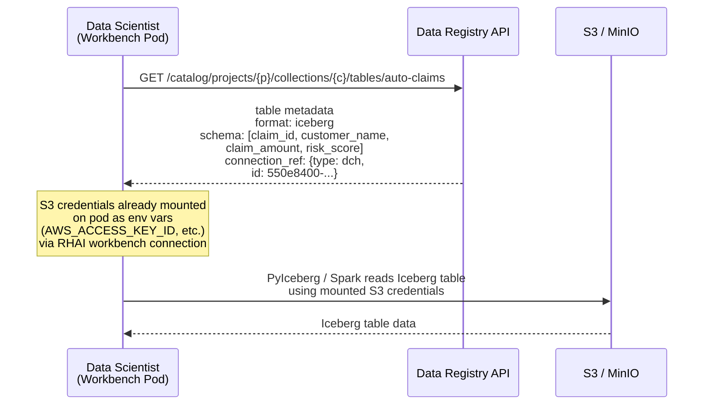
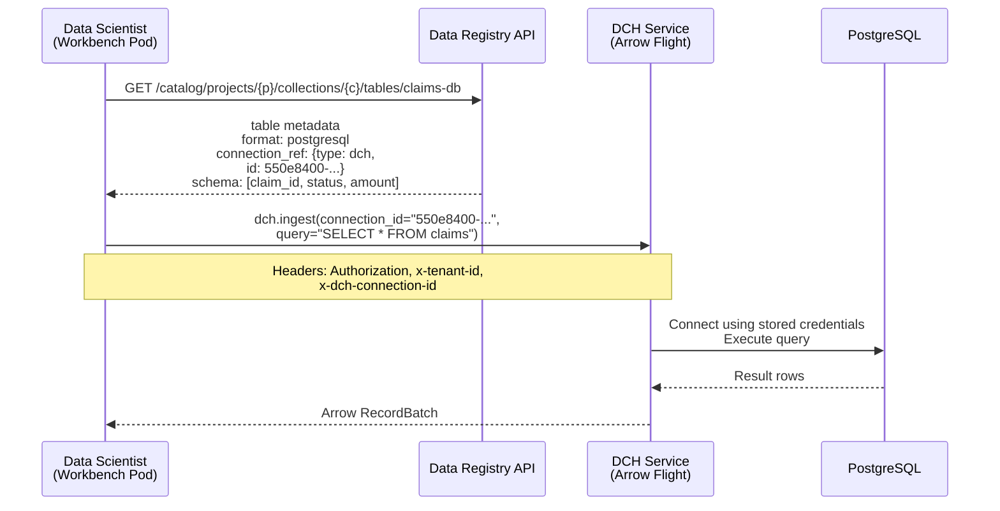
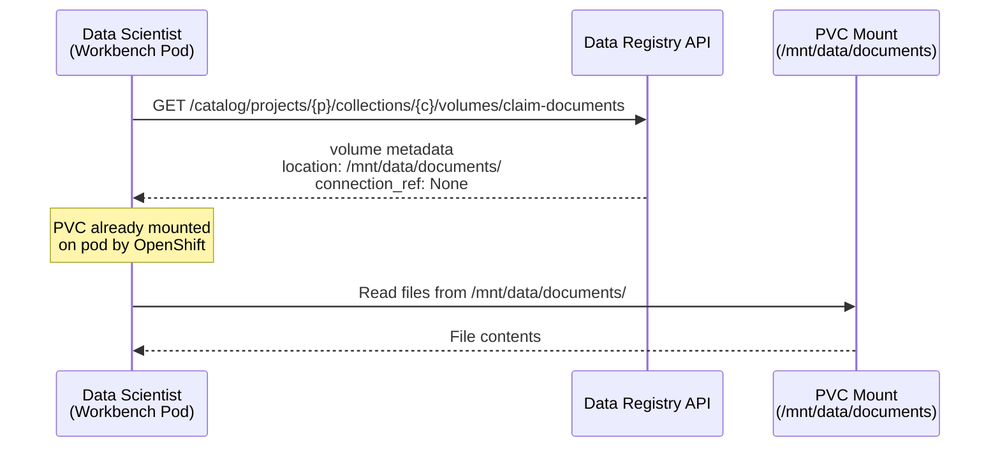

# ODH-ADR-DR-0002: Data Registry and Data Connect Hub Integration

|                |            |
| -------------- | ---------- |
| Date           | 2026-08-05 |
| Scope          | ODH |
| Status         | Draft |
| Authors        | [Ana Biazetti](@abiazetti) |
| Supersedes     | N/A |
| Superseded by  | N/A |
| Tickets        | TBD |
| Other docs     | [ADR-DR-0001: Data Registry](https://github.com/opendatahub-io/architecture-decision-records/pull/150), [DCH ADR](https://github.com/opendatahub-io/architecture-decision-records/pull/149) |

## What

This ADR defines the integration contract between the **Data Registry** ([ADR-DR-0001](https://github.com/opendatahub-io/architecture-decision-records/pull/150)) and the **Data Connect Hub** (DCH, [PR #149](https://github.com/opendatahub-io/architecture-decision-records/pull/149)). The Data Registry tracks *what* data exists — tables, volumes, metadata, schema. DCH manages *how* to connect to and ingest data from external sources.

The integration is based on a `connection_ref` field that each Data Registry asset (table or volume) can optionally carry, pointing to a DCH DataConnection or an RHAI Connection. The `connection_ref` includes a type discriminator (`dch` or `rhai`) and the connection identifier (UUID for DCH, secret name for RHAI). In both cases, `connection_ref` references a *connection object* — not raw credentials. The actual secret is resolved through the respective connection API. This ADR defines the connection reference contract and three consumption scenarios for the 6.3 release.

Future integration scenarios (automated schema discovery and cross-component lineage via OpenLineage) are defined in [ADR-DR-0003](https://github.com/opendatahub-io/architecture-decision-records/pull/154).

## Why

The Data Registry and DCH are being developed in parallel. Defining the integration contract now — before either component ships — ensures users get a coherent "find to use" experience from the first release, rather than requiring a retrofitted integration later.

- **Unified "find to use" experience.** The product requirement is that discovering an asset and accessing its data should feel like one action, not two disconnected systems.
- **Connection flexibility.** DCH connections must work like RHAI Connection secrets at the basic level — mountable on pods for direct data access via standard libraries. For clients that need mediated access to data sources (e.g., PostgreSQL via Arrow Flight), DCH provides ingestion APIs that handle driver complexity and credential isolation.
- **Consistent authorization.** Both the Data Registry and DCH use SelfSubjectAccessReview (SSAR) via kube-rbac-proxy with Kubernetes-native RBAC. The auth model is already aligned, but the integration contract — which permissions are needed for the end-to-end flow — must be explicit.
- **Local storage independence.** Not all data requires external connections. Volumes backed by PVC storage use OpenShift-managed credentials with no DCH involvement. The Registry must work both with and without DCH.

## Goals

* Define the `connection_ref` contract: how Data Registry assets reference DCH DataConnections and RHAI Connections, including a type discriminator
* Define three consumption scenarios for the 6.3 release, each with an end-to-end flow diagram
* Establish the shared SSAR authorization model across the Data Registry and DCH API groups
* Define edge-case behavior: deleted connections, DCH not enabled, connection status visibility

## Non-Goals

* **Changing the internal architecture of either component.** The Data Registry and DCH internals are defined by their own ADRs. This ADR covers only the integration boundary.
* **New APIs for 6.3.** No new Data Registry or DCH APIs are introduced for 6.3. The `connection_ref` attribute on tables and volumes is a metadata field, not a new API surface.
* **Schema synchronization in 6.3.** Automated schema discovery from data sources is a future scenario documented in [ADR-DR-0003](https://github.com/opendatahub-io/architecture-decision-records/pull/154).
* **Lineage tracking across the integration boundary in 6.3.** Cross-component lineage via OpenLineage is out of scope for 6.3, documented in [ADR-DR-0003](https://github.com/opendatahub-io/architecture-decision-records/pull/154).

## How

### Connection Reference Model

The Data Registry `connection_ref` field on tables and volumes stores a reference to a connection object — either a DCH DataConnection (identified by UUID) or an RHAI Connection (identified by secret name). The field is optional — assets with locally mounted PVC volumes do not require a connection reference.

`connection_ref` always points to a connection *object*, never to raw credentials. It includes two subfields:

| Subfield | Description | Example |
|---|---|---|
| `type` | Discriminator: `dch` or `rhai` | `dch` |
| `id` | DCH DataConnection UUID or RHAI Connection secret name | `550e8400-e29b-41d4-a716-446655440000` |

The `type` field tells consumers how to resolve the connection:
- **`dch`:** Call `GET /api/v1/data/connections/{id}` to retrieve the DCH DataConnection resource, which includes a `secret-ref` pointing to the credentials secret.
- **`rhai`:** The `id` is the name of a labeled Kubernetes secret (`opendatahub.io/dashboard=true`, `opendatahub.io/managed=true`). The secret is resolved directly via the Kubernetes API.

| Asset Type | Format | Connection Pattern | connection_ref |
|---|---|---|---|
| Table | iceberg | S3 credentials mounted on pod | `{type: dch, id: uuid}` or `{type: rhai, id: secret-name}` |
| Table | postgresql | DCH DataConnection (ingestion via DCH SDK) | `{type: dch, id: uuid}` |
| Volume | s3 | S3 credentials mounted on pod | `{type: dch, id: uuid}` or `{type: rhai, id: secret-name}` |
| Volume | local (PVC) | OpenShift-managed, credentials on pod | None |

DCH auto-migrates existing RHAI Connections by watching labeled Kubernetes secrets. When DCH creates a DCH DataConnection resource from an RHAI Connection, the asset's `connection_ref` can be updated from `{type: rhai, ...}` to `{type: dch, ...}` — but existing RHAI Connection references remain valid.

### Scenario 0: Discovering a Data Asset

A data scientist working in a workbench pod wants to find claims-related data. They search the Data Registry using the Catalog API, find the asset they need, and retrieve its full metadata — including schema, connection reference, and properties.

The search endpoint is defined in the [Data Registry API contract](https://github.com/opendatahub-io/architecture-decision-records/pull/150). It returns matching assets across all collections in the project. The user then retrieves the full table metadata — format, schema, connection reference, and properties — which provides everything needed to decide how to access the data (Scenarios 1-3).

### Scenario 1: Iceberg Table with S3 Connection

A data scientist discovers an Iceberg table in the Data Registry. The S3 connection — either a DCH DataConnection or an RHAI Connection — has its credentials already mounted on their workbench pod. They use PyIceberg to query the table.

Credential mounting on workbench pods is a standard RHAI capability. Users attach connection secrets to their workbench through the RHAI Dashboard, and the workbench controller mounts them as environment variables on the pod. The same mechanism applies to Data Science Pipelines (KFP) pods.

The connection credentials are already on the pod — the user does not call DCH APIs to access the data in this scenario. DCH's role is managing the connection lifecycle (creation, credential rotation, auto-migration from RHAI Connections). The Data Registry's role is providing the table schema and metadata.

### Scenario 2: PostgreSQL Table via DCH Ingestion API

A data scientist discovers a PostgreSQL table in the Data Registry. They use the DCH Python SDK to ingest data — without needing database credentials or PostgreSQL driver libraries on their pod.

The user never sees database credentials. DCH handles driver dependencies, connection pooling, and credential management. The Data Registry provides the `connection_ref` that links the table asset to the right DCH DataConnection.

This pattern is essential for:
- Non-S3 data sources (e.g., PostgreSQL) where credential mounting alone is insufficient for data ingestion
- Environments where credential exposure to user pods must be minimized
- Clients that do not want to install and maintain database-specific driver libraries

### Scenario 3: Local PVC Volume

A data scientist discovers a volume in the Data Registry backed by local PVC storage. Credentials are managed entirely by OpenShift — no DCH connection is involved.

Not all assets require DCH. Local storage is managed by OpenShift (PersistentVolume / PersistentVolumeClaim). The Data Registry tracks the asset metadata and location, but `connection_ref` is null. The Registry operates fully independently of DCH in this scenario.

## Alternatives

### Alternative 1: Tight Coupling — Registry Embeds DCH Client

The Data Registry server calls DCH APIs directly to resolve connections, verify status, and proxy data ingestion requests.

**Why not:** Creates a hard runtime dependency — the Registry cannot function if DCH is down or not installed. This conflicts with the requirement that the Registry works independently (Scenario 3) and that DCH is optional.

### Alternative 2: No Integration — Separate Experiences

Users discover assets in the Data Registry and separately locate connections in DCH. No `connection_ref` linking the two.

**Why not:** Product management explicitly flagged this as unacceptable UX. The "find to use" flow must feel unified — users should not need to manually correlate assets with connections across two different interfaces.

### Alternative 3: Registry Manages Connections Directly

Build connection CRUD capabilities into the Data Registry, eliminating the need for DCH integration.

**Why not:** Duplicates DCH scope. Connections are a shared platform resource used by multiple components (EvalHub, MLflow, notebooks, pipelines), not just the Data Registry. Managing connections in the Registry would violate single-responsibility and create a parallel connection management system.

## Security and Privacy Considerations

### Shared Authorization Model

Both the Data Registry and DCH use SelfSubjectAccessReview (SSAR) via kube-rbac-proxy for authorization. Each component defines its own Kubernetes API group and RBAC resources.

**Data Registry — namespace-scoped authorization for 6.3:**

The Data Registry defines three ClusterRoles that grant access to all registry resources within a namespace:

| ClusterRole | Access Level |
|---|---|
| `dataregistry-view` | Read-only access to all Data Registry resources (tables, volumes, collections, search) |
| `dataregistry-edit` | Read and write access to Data Registry resources |
| `dataregistry-admin` | Full access including administrative operations |

Authentication uses bearer token (JWT) validated via Kubernetes TokenReview. Authorization uses SSAR scoped to the namespace (RHOAI project). A user with `dataregistry-view` in namespace `ml-team` can view all tables and volumes in that namespace, but cannot access assets in other namespaces. Per-resource authorization (e.g., restricting access to a specific collection or table) is a future enhancement.

**Data Connect Hub — resource-level authorization:**

DCH uses API group `dataconnecthub.opendatahub.io` with the following resources and verbs:

| Resource | Verbs | Used For |
|---|---|---|
| `data-connection` | create, read, patch, delete | Managing DCH DataConnection resources (CRUD) |
| `data-connection-types` | create, read, patch, delete | Managing connection type definitions |
| `data-store` | get | Data ingestion via REST and Arrow Flight gRPC |

DCH uses kube-rbac-proxy for REST endpoints and in-service SubjectAccessReview for Arrow Flight gRPC (since gRPC does not pass through the HTTP proxy).

**End-to-end permissions for "find to use" scenarios:**

| Scenario | Data Registry Permission | DCH Permission |
|---|---|---|
| Scenario 0: Discover assets | `dataregistry-view` in namespace | -- |
| Scenario 1: Iceberg table (mounted secret) | `dataregistry-view` in namespace | -- |
| Scenario 2: PostgreSQL via DCH ingestion | `dataregistry-view` in namespace | `data-connection: read` + `data-store: get` |
| Scenario 3: PVC volume (no connection) | `dataregistry-view` in namespace | -- |

Both components use ClusterRole aggregation labels to auto-inject permissions into standard OpenShift roles (`view`, `edit`, `admin`). Users with existing namespace roles automatically receive the corresponding Data Registry and DCH permissions without additional RBAC configuration.

### Credential Isolation

- The Data Registry stores `connection_ref` — a pointer to a DCH DataConnection (UUID) or RHAI Connection (name). It never stores or accesses credential content. Credentials are resolved through the connection object's API.
- SSAR authorization is evaluated independently by each component. Compromising one component's authorization does not grant access to the other.
- In Scenario 2, DCH mediates all credential access. The calling user's pod never receives raw database credentials — DCH connects to the data source on the user's behalf and returns only query results.
- In Scenario 3, volume security relies entirely on OpenShift PV/PVC access control model.
- Both components use TLS for all API communication. The Data Registry reuses the Feast server's existing TLS configuration; DCH uses OpenShift service-serving certificates.

## Risks

- **DCH availability affects Scenario 2.** If DCH is down, users cannot ingest data from external sources via the DCH SDK. Scenario 1 (mounted secrets) and Scenario 3 (PVC) are unaffected.
- **Auto-migration timing.** DCH auto-migrates RHAI Connections by watching labeled Kubernetes secrets. If migration has not completed, a `connection_ref` with `type: dch` pointing to a DCH DataConnection UUID may not yet resolve. The UI should handle this gracefully.
- **Credential rotation in Scenario 1.** If DCH or RHAI rotates credentials on a connection while a user has already-mounted (now-stale) credentials on their pod, Scenario 1 may fail with authentication errors. The standard RHAI workbench restart cycle picks up rotated credentials, but there is a window of inconsistency.

## Stakeholder Impacts

| Group | Key Contacts | Date | Impacted? |
| ----- | ------------ | ---- | --------- |
| Data Registry | Ana Biazetti | 2026-08-05 | Yes — defines `connection_ref` contract on registry assets |
| Data Connect Hub | Marius Danciu | 2026-08-05 | Yes — Registry references DCH DataConnections; DCH manages connection lifecycle |
| Dashboard | Andy Stoneberg | 2026-08-05 | Yes — Data Hub UI renders registry assets with `connection_ref` |
| ODH Platform | Lindani Phiri | 2026-08-05 | Yes — ClusterRole aggregation across both API groups |

## References

* [ADR-DR-0001: Data Registry for RHOAI (PR #150)](https://github.com/opendatahub-io/architecture-decision-records/pull/150)
* [ADR-DR-0003: Future Integration Scenarios (PR #TBD)](https://github.com/opendatahub-io/architecture-decision-records/pull/154)
* [Data Connect Hub ADR (PR #149)](https://github.com/opendatahub-io/architecture-decision-records/pull/149)
* [Iceberg REST Catalog Spec](https://iceberg.apache.org/rest-catalog-spec/#rest-catalog-protocol)
* [opendatahub-io/kube-rbac-proxy](https://github.com/opendatahub-io/kube-rbac-proxy) — SSAR authorization sidecar

## Reviews

| Reviewed by | Date | Notes |
| ----------- | ---- | ----- |
| N/A | | |
