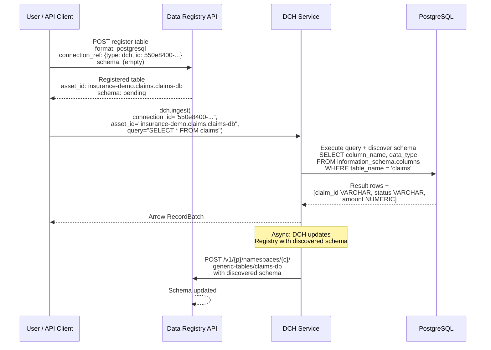
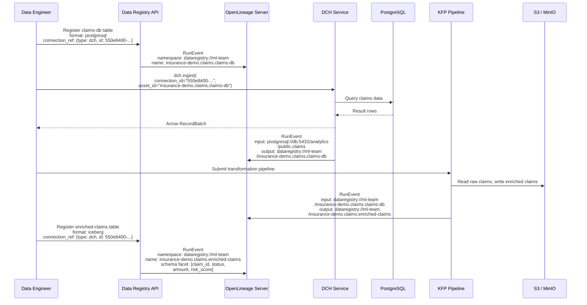

# ODH-ADR-DR-0003: Data Registry and Data Connect Hub — Future Integration Scenarios

|                |            |
| -------------- | ---------- |
| Date           | 2026-08-05 |
| Scope          | ODH |
| Status         | Draft |
| Authors        | [Ana Biazetti](@abiazetti) |
| Supersedes     | N/A |
| Superseded by  | N/A |
| Tickets        | TBD |
| Other docs     | [ADR-DR-0001: Data Registry](https://github.com/opendatahub-io/architecture-decision-records/pull/150), [ADR-DR-0002: Registry-DCH Integration](https://github.com/opendatahub-io/architecture-decision-records/pull/153), [DCH ADR](https://github.com/opendatahub-io/architecture-decision-records/pull/149) |

## What

This ADR defines two future integration scenarios between the Data Registry ([ADR-DR-0001](https://github.com/opendatahub-io/architecture-decision-records/pull/150)) and the Data Connect Hub (DCH, [PR #149](https://github.com/opendatahub-io/architecture-decision-records/pull/149)) that are out of scope for the 3.6 release but documented here for directional alignment:

1. **Automated Schema Discovery** — DCH discovers the schema of external data sources (e.g., PostgreSQL column names and types) and asynchronously populates the Data Registry, eliminating manual schema entry at table registration time.
2. **Cross-Component Lineage via OpenLineage** — Both the Data Registry and DCH emit OpenLineage events to a shared lineage server, enabling end-to-end data provenance tracking from external sources through ingestion, transformation, and registration.

These scenarios build on the 3.6 integration contract defined in [ADR-DR-0002](https://github.com/opendatahub-io/architecture-decision-records/pull/153), specifically the `connection_ref` model and DCH ingestion flow.

## Why

- **Schema entry is manual in 3.6.** When registering a non-Iceberg table (e.g., PostgreSQL), users must provide column names and types manually. For large schemas, this is tedious and error-prone. Automated discovery via DCH eliminates this friction.
- **No cross-component lineage in 3.6.** The Data Registry and DCH operate independently — there is no shared lineage graph that traces data from external sources through ingestion and transformation. Users cannot answer "where did this data come from?" across component boundaries.
- **Directional alignment.** Defining these scenarios now — before the 3.6 components ship — ensures future enhancements are architecturally compatible with the 3.6 design. Retrofitting lineage or schema discovery into an incompatible design is significantly more expensive.

## Goals

* Define the automated schema discovery flow: how DCH discovers source schemas and updates the Data Registry asynchronously
* Define the cross-component lineage model: OpenLineage event types, asset identifiers, and the common namespace convention
* Establish the asset UUID requirement for stable lineage correlation
* Identify open questions and design decisions that must be resolved before implementation

## Non-Goals

* **Committing to implementation timelines.** These scenarios are directional — no release target is set.
* **Defining the OpenLineage server deployment model.** Which OpenLineage-compatible server (e.g., Marquez) to deploy and how is a separate decision.
* **Changing the 3.6 integration contract.** Nothing in this ADR modifies the `connection_ref` model, consumption scenarios, or authorization model defined in ADR-DR-0002.

## How

### Scenario 4: Automated Schema Discovery via DCH

In 3.6, when a user registers a non-Iceberg table (e.g., PostgreSQL) in the Data Registry, they provide the schema manually (column names and types). This scenario eliminates manual entry by having DCH discover the schema from the data source and asynchronously update the Data Registry.

Discovered schemas will typically be richer than manually-entered ones — including column types, nullability, constraints, and defaults. The Data Registry schema model may need to be extended to accommodate this additional metadata.

Schema discovery is triggered by `dch.ingest()`. When the user ingests data from a source, they pass the Data Registry asset ID alongside the connection ID. DCH uses the asset ID to discover the source schema and asynchronously update the Data Registry asset — table registration is never blocked.



Table registration returns immediately — the user does not wait for schema discovery. When the user subsequently ingests data via DCH, the `asset_id` parameter tells DCH which Data Registry asset to update. DCH discovers the source schema as part of the ingestion, then asynchronously patches the Registry asset with the column names and types. On subsequent lookups, the table metadata includes the populated schema.

**Service-to-service authentication:** DCH uses the asset ID from the original table registration to POST the discovered schema back to the Data Registry. The authentication mechanism for this service-to-service call (e.g., dedicated ServiceAccount with `dataregistry-edit` permissions, or delegated user token) is an open question.

### Scenario 5: Cross-Component Lineage via OpenLineage

Cross-component lineage enables users and platform components to answer key data provenance questions: *Where did this data come from?* *What downstream assets are affected if this source changes?* *What ingestion or transformation produced this dataset?* These questions are essential for impact analysis, debugging data quality issues, and compliance reporting.

Both the Data Registry and DCH emit OpenLineage events at key moments in the data lifecycle to a shared OpenLineage-compatible server (e.g., Marquez). The server correlates events by matching dataset identifiers across producers, building an end-to-end lineage graph.

This requires three prerequisites:

1. **An OpenLineage server** deployed on the cluster that accepts OpenLineage events from multiple producers.
2. **A stable asset UUID on Data Registry assets.** Feast SavedDataset (the underlying storage model for tables and volumes) does not have a built-in UUID field. The Data Registry must add a persistent UUID to each table and volume, generated once at registration time. This UUID is immutable — it survives renames, moves between collections, and metadata updates. It serves as the stable dataset identifier in lineage events, decoupled from the mutable asset path.
3. **A common identifier convention** that all producers use when emitting OpenLineage events, so the lineage server can correlate events from different components into a single graph.

#### OpenLineage Event Types

OpenLineage defines two relevant event types:
- **RunEvent** — emitted at runtime when a job executes (ingestion, transformation). Associated with a run and carries input/output datasets. Broadly supported across platforms.
- **DatasetEvent** — emitted at design-time when dataset metadata changes (registration, schema update). Not associated with a run. More limited platform support (e.g., AWS SageMaker only supports RunEvent).

For broader compatibility, all events can use RunEvent — modeling registration and schema updates as lightweight "runs". The trade-off is that registration events carry an unnecessary run context. The recommended approach depends on which OpenLineage server is deployed.

| Component | Event | OpenLineage Event Type |
|---|---|---|
| Data Registry | Table/volume registered | RunEvent (or DatasetEvent where supported) with namespace + name + asset UUID facet |
| DCH | Data ingested from external source | RunEvent with input dataset (external source), output dataset (Registry asset UUID), and connection UUID in run facets |
| KFP / Notebooks | Data transformed | RunEvent with input and output datasets (Registry asset UUIDs) |
| Data Registry | Transformed table registered | RunEvent (or DatasetEvent) with namespace + name + asset UUID + schema facet |

#### Example: End-to-End Lineage

A data engineer registers a PostgreSQL table in the Data Registry, ingests claims data via DCH, transforms it in a KFP pipeline, and registers the transformed result as an Iceberg table. The lineage graph shows the full provenance chain.



The OpenLineage server now holds a lineage graph: `PostgreSQL (claims) -> DCH ingestion -> claims-db (registered) -> KFP transform -> enriched-claims (Iceberg)`. A lineage UI (e.g., Marquez) can render this as a DAG.

#### Design Principle: Decoupled Event Emission

Each component emits its own OpenLineage events independently to the OpenLineage server. There is no centralized emitter or event aggregation layer. This is consistent with the model already adopted by Spark and Ray OpenLineage integrations, and planned for MLflow — each producer is responsible for emitting its own events, and the OpenLineage server correlates them by dataset identifier.

#### Asset UUID vs Connection UUID in Lineage

The Data Registry asset UUID and the DCH DataConnection UUID serve different roles in the lineage graph:

| Identifier | Lineage Role | What It Represents |
|---|---|---|
| Asset UUID | **Dataset node** — the data entity in the lineage graph | *What* data is — a registered table or volume |
| Connection UUID | **Run context** — metadata on the ingestion event | *How* data was accessed — the connection used for a specific ingestion |

The lineage graph is built from dataset-to-dataset edges linked by runs. The asset UUID appears on the dataset node; the connection UUID appears as a facet on the run event. They are related through the `connection_ref` field on the asset — which tells DCH which connection to use, and which DCH then includes in the run context when emitting the lineage event.

Example OpenLineage RunEvent emitted by DCH during ingestion:

```json
{
  "run": {
    "runId": "a1b2c3d4-e5f6-7890-abcd-ef1234567890",
    "facets": {
      "dch_connection": {
        "connectionId": "550e8400-e29b-41d4-a716-446655440000"
      }
    }
  },
  "inputs": [{
    "namespace": "postgresql://db.example.com:5432/analytics",
    "name": "public.claims"
  }],
  "outputs": [{
    "namespace": "dataregistry://ml-team",
    "name": "insurance-demo.claims.auto-claims",
    "facets": {
      "dataRegistryAsset": {
        "assetUuid": "7f3b1a2c-9d4e-5f6a-b7c8-d9e0f1a2b3c4"
      }
    }
  }]
}
```

The `connectionId` on the run tells you *which connection was used* for this ingestion. The `assetUuid` on the output dataset is the stable identifier that links this event to the dataset node in the lineage graph — even if the asset is later renamed or moved between collections.

#### Proposed Common Asset Identifier

OpenLineage identifies datasets with two fields: `namespace` (the data source or catalog) and `name` (the specific dataset). For lineage correlation to work across components, all producers must use the same namespace + name pair when referring to the same dataset.

**Proposed convention:**

| Dataset Location | OpenLineage namespace | OpenLineage name | Example |
|---|---|---|---|
| Data Registry asset | `dataregistry://{rhai-namespace}` | `{project}.{collection}.{asset}` | `dataregistry://ml-team` / `insurance-demo.claims.auto-claims` |
| External database (DCH source) | `{protocol}://{host}:{port}/{database}` | `{schema}.{table}` | `postgresql://db.example.com:5432/analytics` / `public.claims` |
| S3 storage | `s3://{bucket}` | `{path}` | `s3://poc-underwriting` / `insurance-demo/claims/auto_claims` |

When DCH ingests data from an external source and the user has linked the result to a Data Registry asset (via `connection_ref`), DCH emits a RunEvent with:
- **input**: the external source identifier (e.g., `postgresql://...` / `public.claims`)
- **output**: the Data Registry asset identifier (e.g., `dataregistry://ml-team` / `insurance-demo.claims.enriched-claims`)

This allows the OpenLineage server to correlate the DCH ingestion event with the Data Registry dataset event for the same asset — building the lineage edge between the external source and the registered asset.

The `dataregistry://` namespace scheme follows the pattern used by other OpenLineage integrations (e.g., Spark uses `spark://` for application-level namespaces). The `{rhai-namespace}` qualifier scopes identifiers to a Kubernetes namespace, consistent with the Data Registry SAR authorization boundary.

## Open Questions

1. **Schema discovery API contract.** The `dch.ingest()` call will accept an `asset_id` parameter so DCH can asynchronously update the Data Registry with discovered schema. The exact API contract (new parameter on existing ingestion endpoint vs. separate schema discovery endpoint) is to be defined.
2. **Service-to-service authentication for schema discovery.** DCH must POST discovered schema back to the Data Registry. The identity used for this call (dedicated ServiceAccount with `dataregistry-edit`, delegated user token, or other mechanism) is to be defined.
3. **Asset UUID implementation.** Feast SavedDataset does not have a built-in UUID field. The Data Registry needs to add a persistent UUID to the Table and Volume metadata — either as a new field in the SavedDataset proto, or as a reserved property key in the existing tags map. The UUID must be generated once at registration time and remain immutable across renames and collection moves.
4. **Schema drift handling.** If the source schema changes between ingestions, DCH may update the Registry with a different schema each time. A conflict resolution strategy (e.g., additive-only, version history, user confirmation) is needed.
5. **Schema model extension.** Discovered schemas from external sources may include richer metadata (nullability, constraints, defaults) than the current Data Registry schema model supports. The schema model may need to be extended to store this additional metadata without losing fidelity.
6. **Schema discoverability.** For tables with large schemas (dozens or hundreds of columns), users need the ability to search, filter, and browse schema metadata — both in the UI and via the API. The Data Registry API and UI design should account for this.

## Alternatives

### Alternative 1: Synchronous Schema Discovery at Registration

The Data Registry calls DCH synchronously during table registration to discover the schema before returning to the user.

**Why not:** Blocks table registration on DCH availability. Registration fails if DCH is down. Users cannot register tables when DCH is not installed in the namespace.

### Alternative 2: No Schema Discovery — Manual Entry Only

Users always provide schema manually at registration time.

**Why not:** Acceptable for small schemas but impractical for tables with dozens or hundreds of columns. Error-prone and time-consuming. Does not scale.

### Alternative 3: Centralized Lineage Emitter

A single component collects data lifecycle events from the Registry and DCH, then emits consolidated OpenLineage events.

**Why not:** Creates a single point of failure and a tight coupling between components. Inconsistent with the decoupled model used by existing OpenLineage integrations (Spark, MLflow, Ray).

## Security and Privacy Considerations

- **Service-to-service schema updates.** DCH writing schema data to the Data Registry requires a controlled authentication mechanism. The identity should have minimal permissions (write access to schema metadata only, not full `dataregistry-admin`).
- **Lineage data sensitivity.** OpenLineage events contain dataset names, namespaces, and schema metadata. The lineage server must enforce access controls consistent with the Data Registry and DCH authorization models — a user should not see lineage for assets they cannot access in the Registry.
- **Asset UUID as stable identifier.** The asset UUID is not a credential, but it is a stable correlation key. If exposed outside the cluster, it could be used to track dataset identity across environments. The UUID should be treated as internal metadata.

## Risks

- **Schema discovery depends on DCH availability.** If DCH is down when a user calls `dch.ingest()` with an `asset_id`, the schema update does not happen. The table remains with its manually-entered (or empty) schema until a successful ingestion occurs.
- **Schema drift from source changes.** Repeated ingestions from a changing source schema may update the Registry schema unpredictably. Without a conflict resolution strategy, users may see schema metadata that does not match their expectations.
- **OpenLineage server is a new dependency.** Cross-component lineage requires deploying and operating an OpenLineage-compatible server. This adds infrastructure complexity and an additional failure domain.
- **Asset UUID migration.** Adding UUIDs to existing assets (registered before the UUID feature ships) requires a one-time migration. Assets without UUIDs cannot participate in the lineage graph until migrated.
- **Lineage reflects tracked operations, not underlying data changes.** The lineage graph is built from events emitted by instrumented components (Data Registry, DCH, KFP). Changes to underlying data that bypass these components (e.g., direct S3 writes) are not captured. This is consistent with how lineage works in other platforms — lineage tracks what instrumented producers report.
- **Lineage event history retention.** Without event history retention on the OpenLineage server, the lineage graph reflects the latest state — point-in-time queries (e.g., "what was in this dataset on July 15th?") are not supported. Retention policies depend on the OpenLineage server deployment.

## Stakeholder Impacts

| Group | Key Contacts | Date | Impacted? |
| ----- | ------------ | ---- | --------- |
| Data Registry | Ana Biazetti | 2026-08-05 | Yes — must implement asset UUID and accept schema updates from DCH |
| Data Connect Hub | Marius Danciu | 2026-08-05 | Yes — must implement schema discovery on `dch.ingest()` and emit OpenLineage events |
| Data Science Pipelines (KFP) | TBD | 2026-08-05 | Yes — KFP pipelines emit OpenLineage RunEvents in the lineage scenario |

## References

* [ADR-DR-0001: Data Registry for RHOAI (PR #150)](https://github.com/opendatahub-io/architecture-decision-records/pull/150)
* [ADR-DR-0002: Data Registry and DCH Integration (PR #153)](https://github.com/opendatahub-io/architecture-decision-records/pull/153)
* [Data Connect Hub ADR (PR #149)](https://github.com/opendatahub-io/architecture-decision-records/pull/149)
* [OpenLineage Spec](https://openlineage.io/docs/spec/object-model)
* [Marquez — OpenLineage-compatible metadata server](https://marquezproject.ai/)

## Reviews

| Reviewed by | Date | Notes |
| ----------- | ---- | ----- |
| N/A | | |
