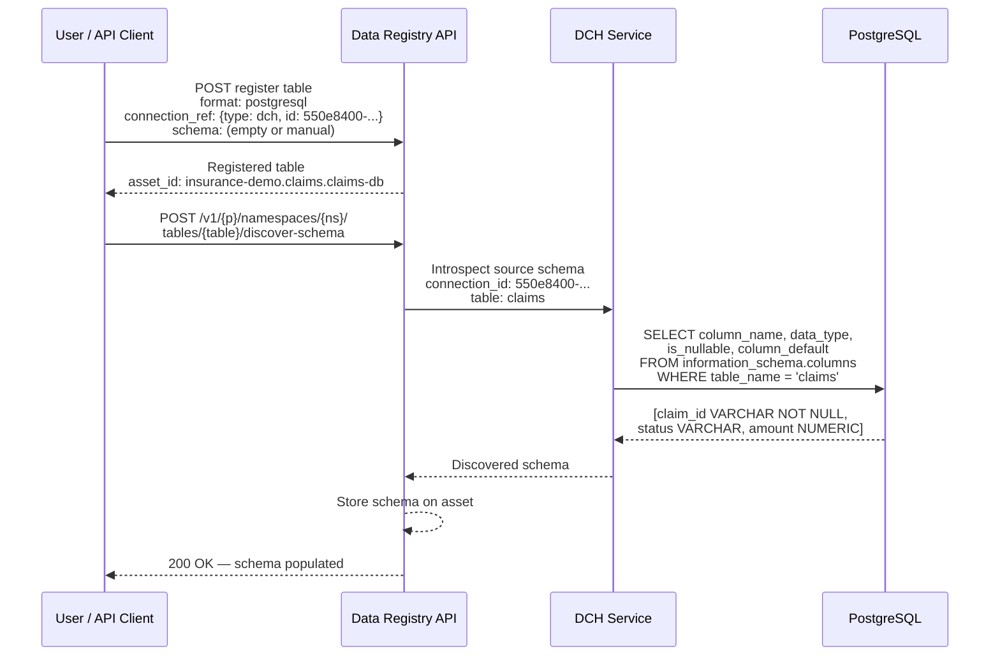
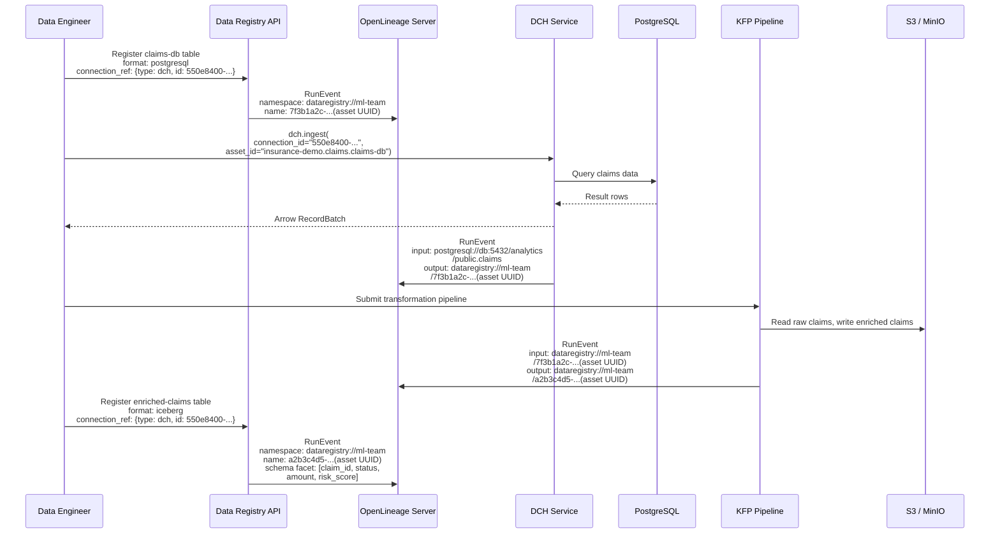

# ODH-ADR-DR-0003: Data Registry and Data Connect Hub — Future Integration Scenarios

|                |            |
| -------------- | ---------- |
| Date           | 2026-08-05 |
| Scope          | ODH |
| Status         | Draft |
| Authors        | [Ana Biazetti](@abiazetti) |
| Supersedes     | N/A |
| Superseded by  | N/A |
| Tickets        | TBD |
| Other docs     | [ADR-DR-0001: Data Registry](https://github.com/opendatahub-io/architecture-decision-records/pull/150), [ADR-DR-0002: Registry-DCH Integration](https://github.com/opendatahub-io/architecture-decision-records/pull/153), [DCH ADR](https://github.com/opendatahub-io/architecture-decision-records/pull/149) |

## What

This ADR defines two future integration scenarios between the Data Registry ([ADR-DR-0001](https://github.com/opendatahub-io/architecture-decision-records/pull/150)) and the Data Connect Hub (DCH, [PR #149](https://github.com/opendatahub-io/architecture-decision-records/pull/149)) that are out of scope for the 3.6 release but documented here for directional alignment:

1. **Automated Schema Discovery** — DCH discovers the schema of external data sources (e.g., PostgreSQL column names and types) and asynchronously populates the Data Registry, eliminating manual schema entry at table registration time.
2. **Cross-Component Lineage via OpenLineage** — Both the Data Registry and DCH emit OpenLineage events to a shared lineage server, enabling end-to-end data provenance tracking from external sources through ingestion, transformation, and registration.

These scenarios build on the 3.6 integration contract defined in [ADR-DR-0002](https://github.com/opendatahub-io/architecture-decision-records/pull/153), specifically the `connection_ref` model and DCH ingestion flow.

## Why

- **Schema entry is manual in 3.6.** When registering a non-Iceberg table (e.g., PostgreSQL), users must provide column names and types manually. For large schemas, this is tedious and error-prone. Automated discovery via DCH eliminates this friction.
- **No cross-component lineage in 3.6.** The Data Registry and DCH operate independently — there is no shared lineage graph that traces data from external sources through ingestion and transformation. Users cannot answer "where did this data come from?" across component boundaries.
- **Directional alignment.** Defining these scenarios now — before the 3.6 components ship — ensures future enhancements are architecturally compatible with the 3.6 design. Retrofitting lineage or schema discovery into an incompatible design is significantly more expensive.

## Goals

* Define the schema discovery flow for populating asset schemas from external data sources
* Define the cross-component lineage model for tracking data provenance across the Data Registry and DCH
* Establish the asset UUID requirement for stable lineage correlation
* Identify open questions and design decisions for further exploration

## Non-Goals

* **Committing to implementation timelines.** These scenarios are directional — no release target is set.
* **Defining the OpenLineage server deployment model.** Which OpenLineage-compatible server (e.g., Marquez) to deploy and how is a separate decision.
* **Changing the 3.6 integration contract.** Nothing in this ADR modifies the `connection_ref` model, consumption scenarios, or authorization model defined in ADR-DR-0002.

## How

### Scenario 4: Schema Discovery via DCH

In 3.6, when a user registers a non-Iceberg table (e.g., PostgreSQL) in the Data Registry, they provide the schema manually (column names and types). This scenario eliminates manual entry by letting the user request schema discovery as a separate operation — the Data Registry orchestrates the introspection by calling DCH, which connects to the data source and returns the discovered schema.

This approach follows the pattern established by Unity Catalog and similar metadata registries: the catalog is the metadata store, not the introspection engine. Schema discovery is delegated to the connector layer (DCH) which already holds the credentials and knows how to connect to each data source type. The Data Registry acts as the orchestrator — it receives the user's request, delegates introspection to DCH, and stores the result.

Discovered schemas will typically be richer than manually-entered ones — including column types, nullability, constraints, and defaults. The Data Registry schema model may need to be extended to accommodate this additional metadata (see Open Questions).

Schema discovery is a **separate API** from asset registration. The user first registers the table (with or without a manual schema), then calls the discover-schema endpoint to populate or enrich the schema from the live data source.



The discover-schema call is synchronous from the user's perspective — the Data Registry calls DCH, waits for the introspection result, stores it, and returns the populated schema. This keeps the interaction simple and avoids the need for polling or webhooks. For large or slow data sources, the API may support an async mode in a future iteration.

**Scope:** Schema discovery is available only for assets with `connection_ref.type: dch`, since DCH is the component that holds the connection credentials and connector logic. Assets with `connection_ref.type: rhai` (Kubernetes-secret-backed connections) are not supported in the initial implementation — extending discovery to RHAI connections is a potential future enhancement.

### Scenario 5: Cross-Component Lineage via OpenLineage

Cross-component lineage enables users and platform components to answer key data provenance questions: *Where did this data come from?* *What downstream assets are affected if this source changes?* *What ingestion or transformation produced this dataset?* These questions are essential for impact analysis, debugging data quality issues, and compliance reporting.

Both the Data Registry and DCH emit OpenLineage events at key moments in the data lifecycle to a shared OpenLineage-compatible server (e.g., Marquez). The server correlates events by matching dataset identifiers across producers, building an end-to-end lineage graph.

This requires three prerequisites:

1. **An OpenLineage server** deployed on the cluster that accepts OpenLineage events from multiple producers.
2. **A stable asset UUID on Data Registry assets.** Feast SavedDataset (the underlying storage model for tables and volumes) does not have a built-in UUID field. The Data Registry must add a persistent UUID to each table and volume, generated once at registration time. This UUID is immutable — it survives renames, moves between collections, and metadata updates. It serves as the stable dataset identifier in lineage events, decoupled from the mutable asset path.
3. **A common identifier convention** that all producers use when emitting OpenLineage events, so the lineage server can correlate events from different components into a single graph.

#### OpenLineage Event Types

OpenLineage defines two relevant event types:
- **RunEvent** — emitted at runtime when a job executes (ingestion, transformation). Associated with a run and carries input/output datasets. Broadly supported across platforms.
- **DatasetEvent** — emitted at design-time when dataset metadata changes (registration, schema update). Not associated with a run. More limited platform support (e.g., AWS SageMaker only supports RunEvent).

For broader compatibility, all events can use RunEvent — modeling registration and schema updates as lightweight "runs". The trade-off is that registration events carry an unnecessary run context. The recommended approach depends on which OpenLineage server is deployed.

| Component | Event | OpenLineage Event Type |
|---|---|---|
| Data Registry | Table/volume registered | RunEvent (or DatasetEvent where supported) with namespace + name + asset UUID facet |
| DCH | Data ingested from external source | RunEvent with input dataset (external source), output dataset (Registry asset UUID), and connection UUID in run facets |
| KFP / Notebooks | Data transformed | RunEvent with input and output datasets (Registry asset UUIDs) |
| Data Registry | Transformed table registered | RunEvent (or DatasetEvent) with namespace + name + asset UUID + schema facet |

#### Example: End-to-End Lineage

A data engineer registers a PostgreSQL table in the Data Registry, ingests claims data via DCH, transforms it in a KFP pipeline, and registers the transformed result as an Iceberg table. The lineage graph shows the full provenance chain.



The OpenLineage server now holds a lineage graph: `PostgreSQL (claims) -> DCH ingestion -> claims-db (registered) -> KFP transform -> enriched-claims (Iceberg)`. A lineage UI (e.g., Marquez) can render this as a DAG.

#### Design Principle: Decoupled Event Emission

Each component emits its own OpenLineage events independently to the OpenLineage server. There is no centralized emitter or event aggregation layer. This is consistent with the model already adopted by Spark and Ray OpenLineage integrations, and planned for MLflow — each producer is responsible for emitting its own events, and the OpenLineage server correlates them by dataset identifier.

#### Asset UUID vs Connection UUID in Lineage

The Data Registry asset UUID and the DCH DataConnection UUID serve different roles in the lineage graph:

| Identifier | Lineage Role | What It Represents |
|---|---|---|
| Asset UUID | **Dataset node** — the data entity in the lineage graph | *What* data is — a registered table or volume |
| Connection UUID | **Run context** — metadata on the ingestion event | *How* data was accessed — the connection used for a specific ingestion |

The lineage graph is built from dataset-to-dataset edges linked by runs. The asset UUID appears on the dataset node; the connection UUID appears as a facet on the run event. They are related through the `connection_ref` field on the asset — which tells DCH which connection to use, and which DCH then includes in the run context when emitting the lineage event.

Example OpenLineage RunEvent emitted by DCH during ingestion:

```json
{
  "run": {
    "runId": "a1b2c3d4-e5f6-7890-abcd-ef1234567890",
    "facets": {
      "dch_connection": {
        "connectionId": "550e8400-e29b-41d4-a716-446655440000"
      }
    }
  },
  "inputs": [{
    "namespace": "postgresql://db.example.com:5432/analytics",
    "name": "public.claims"
  }],
  "outputs": [{
    "namespace": "dataregistry://ml-team",
    "name": "7f3b1a2c-9d4e-5f6a-b7c8-d9e0f1a2b3c4",
    "facets": {
      "dataRegistryAsset": {
        "displayPath": "insurance-demo.claims.auto-claims"
      }
    }
  }]
}
```

The `connectionId` on the run tells you *which connection was used* for this ingestion. The asset UUID in the output dataset `name` field is the stable identifier that links this event to the dataset node in the lineage graph — even if the asset is later renamed or moved between collections. The human-readable path is available in `facets.dataRegistryAsset.displayPath` for UI display.

#### Proposed Common Asset Identifier

OpenLineage identifies datasets with two fields: `namespace` (the data source or catalog) and `name` (the specific dataset). For lineage correlation to work across components, all producers must use the same namespace + name pair when referring to the same dataset.

**Proposed convention:**

| Dataset Location | OpenLineage namespace | OpenLineage name | Example |
|---|---|---|---|
| Data Registry asset | `dataregistry://{rhai-namespace}` | `{asset-uuid}` | `dataregistry://ml-team` / `7f3b1a2c-9d4e-5f6a-b7c8-d9e0f1a2b3c4` |
| External database (DCH source) | `{protocol}://{host}:{port}/{database}` | `{schema}.{table}` | `postgresql://db.example.com:5432/analytics` / `public.claims` |
| S3 storage | `s3://{bucket}` | `{path}` | `s3://poc-underwriting` / `insurance-demo/claims/auto_claims` |

When DCH ingests data from an external source and the user has linked the result to a Data Registry asset (via `connection_ref`), DCH emits a RunEvent with:
- **input**: the external source identifier (e.g., `postgresql://...` / `public.claims`)
- **output**: the Data Registry asset identifier (e.g., `dataregistry://ml-team` / `{asset-uuid}`)

This allows the OpenLineage server to correlate the DCH ingestion event with the Data Registry dataset event for the same asset — building the lineage edge between the external source and the registered asset.

The `dataregistry://` namespace scheme follows the pattern used by other OpenLineage integrations (e.g., Spark uses `spark://` for application-level namespaces). The `{rhai-namespace}` qualifier scopes identifiers to a Kubernetes namespace, consistent with the Data Registry SAR authorization boundary.

## Open Questions

1. **Schema discovery API contract.** The Data Registry exposes a `discover-schema` endpoint that calls DCH to introspect the data source. The exact DCH API contract for schema introspection (e.g., Flight `GetSchema` command, dedicated endpoint, or Python SDK call) is to be defined with the DCH team.
2. **Service-to-service authentication for schema discovery.** The Data Registry must call DCH to introspect the data source schema. The identity used for this call (delegated user token, dedicated ServiceAccount, or other mechanism) is to be defined.
3. **Asset UUID implementation.** Feast SavedDataset does not have a built-in UUID field. The Data Registry needs to add a persistent UUID to the Table and Volume metadata — either as a new field in the SavedDataset proto, or as a reserved property key in the existing tags map. The UUID must be generated once at registration time and remain immutable across renames and collection moves.
4. **Schema drift handling.** If the source schema changes between schema discovery calls, the discovered schema may differ from the previously stored one. A conflict resolution strategy (e.g., additive-only, version history, user confirmation before overwrite) is needed.
5. **Schema model extension.** Discovered schemas from external sources may include richer metadata (nullability, constraints, defaults) than the current Data Registry schema model supports. The schema model may need to be extended to store this additional metadata without losing fidelity.
6. **Schema discoverability.** For tables with large schemas (dozens or hundreds of columns), users need the ability to search, filter, and browse schema metadata — both in the UI and via the API. The Data Registry API and UI design should account for this.
7. **DCH lineage context.** For DCH to include the Data Registry asset UUID in lineage events, it needs to receive the asset context. For schema discovery (where the Data Registry calls DCH), the Registry can pass the asset UUID in the request. For user-initiated ingest flows where the user may not provide asset context, the correlation mechanism is TBD.

## Alternatives

### Alternative 1: Schema Discovery Coupled to Ingest

DCH discovers the schema during `dch.ingest()` and asynchronously pushes the discovered schema to the Data Registry.

**Why not:** Multiple issues identified during review:

- **Query-based schema is incomplete.** DCH dynamically computes the Flight schema for the user's query, not for the entire table. If the user queries `SELECT col_a, col_b FROM claims`, DCH would need to run a separate query (`information_schema.columns`) to get the full table schema — parsing the user query to extract the table name, with performance implications from running an extra query on every ingest call.
- **Eventual consistency.** The async update creates a window where the Registry has no schema or a stale schema. Consumers reading the asset between registration and the async patch make decisions on incomplete metadata.
- **Tight coupling.** DCH writing directly to the Registry creates a direct dependency. DCH must know the Registry API, authenticate to it, and handle write failures — responsibilities outside its core data movement function.
- **Placeholder assets.** If ingestion never happens (or DCH is unavailable), registered tables remain permanently without schema, creating a poor user experience.
- **Concurrency issues.** Parallel ingestion requests could race to update the schema, with no guarantee of ordering or idempotency.

### Alternative 2: Synchronous Schema Discovery at Registration

The Data Registry calls DCH synchronously during table registration to discover the schema before returning to the user.

**Why not:** Blocks table registration on DCH availability. Registration fails if DCH is down. Users cannot register tables when DCH is not installed in the namespace. The chosen approach (separate discover-schema API) gives the user control over when to discover the schema without coupling it to registration.

### Alternative 3: No Schema Discovery — Manual Entry Only

Users always provide schema manually at registration time.

**Why not:** Acceptable for small schemas but impractical for tables with dozens or hundreds of columns. Error-prone and time-consuming. Does not scale.

### Alternative 4: Centralized Lineage Emitter

A single component collects data lifecycle events from the Registry and DCH, then emits consolidated OpenLineage events.

**Why not:** Creates a single point of failure and a tight coupling between components. Inconsistent with the decoupled model used by existing OpenLineage integrations (Spark, MLflow, Ray).

## Security and Privacy Considerations

- **Service-to-service schema introspection.** The Data Registry calling DCH for schema discovery requires a controlled authentication mechanism. The identity should have minimal permissions — sufficient to call DCH's schema introspection API but not to initiate ingestion or modify connections.
- **Lineage data sensitivity.** OpenLineage events contain dataset names, namespaces, and schema metadata. The lineage server must enforce access controls consistent with the Data Registry and DCH authorization models — a user should not see lineage for assets they cannot access in the Registry.
- **Credential sanitization in lineage events.** External source identifiers (e.g., PostgreSQL connection URLs) may contain embedded credentials. Components emitting OpenLineage events must strip credentials from namespace URIs before emission — the namespace should contain only `host:port/database`, never usernames or passwords. This is a responsibility of each emitting component (DCH, KFP).
- **Asset UUID as stable identifier.** The asset UUID is not a credential, but it is a stable correlation key. If exposed outside the cluster, it could be used to track dataset identity across environments. The UUID should be treated as internal metadata.

## Risks

- **Schema discovery depends on DCH availability.** If DCH is down when the Data Registry calls it for schema introspection, the discover-schema request fails. The table retains its manually-entered (or empty) schema until DCH is available and the user retries.
- **Schema drift from source changes.** Repeated ingestions from a changing source schema may update the Registry schema unpredictably. Without a conflict resolution strategy, users may see schema metadata that does not match their expectations.
- **OpenLineage server is a new dependency.** Cross-component lineage requires deploying and operating an OpenLineage-compatible server. This adds infrastructure complexity and an additional failure domain.
- **Asset UUID migration.** Adding UUIDs to existing assets (registered before the UUID feature ships) requires a one-time migration. Assets without UUIDs cannot participate in the lineage graph until migrated.
- **Lineage reflects tracked operations, not underlying data changes.** The lineage graph is built from events emitted by instrumented components (Data Registry, DCH, KFP). Changes to underlying data that bypass these components (e.g., direct S3 writes) are not captured. This is consistent with how lineage works in other platforms — lineage tracks what instrumented producers report.
- **Lineage event history retention.** Without event history retention on the OpenLineage server, the lineage graph reflects the latest state — point-in-time queries (e.g., "what was in this dataset on July 15th?") are not supported. Retention policies depend on the OpenLineage server deployment.

## Stakeholder Impacts

| Group | Key Contacts | Date | Impacted? |
| ----- | ------------ | ---- | --------- |
| Data Registry | Ana Biazetti | 2026-08-05 | Yes — must implement asset UUID, discover-schema API, and OpenLineage event emission |
| Data Connect Hub | Marius Danciu | 2026-08-05 | Yes — must expose schema introspection API for Data Registry to call, and emit OpenLineage events for ingestion runs |
| Data Science Pipelines (KFP) | TBD | 2026-08-05 | Yes — KFP pipelines emit OpenLineage RunEvents in the lineage scenario |

## References

* [ADR-DR-0001: Data Registry for RHOAI (PR #150)](https://github.com/opendatahub-io/architecture-decision-records/pull/150)
* [ADR-DR-0002: Data Registry and DCH Integration (PR #153)](https://github.com/opendatahub-io/architecture-decision-records/pull/153)
* [Data Connect Hub ADR (PR #149)](https://github.com/opendatahub-io/architecture-decision-records/pull/149)
* [OpenLineage Spec](https://openlineage.io/docs/spec/object-model)
* [Marquez — OpenLineage-compatible metadata server](https://marquezproject.ai/)

## Reviews

| Reviewed by | Date | Notes |
| ----------- | ---- | ----- |
| N/A | | |
