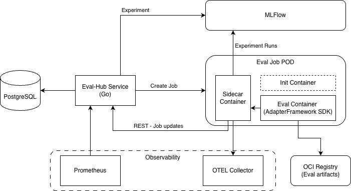
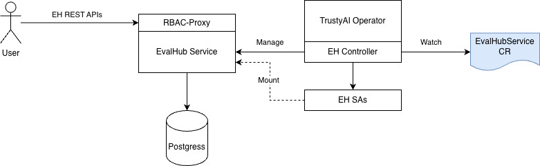
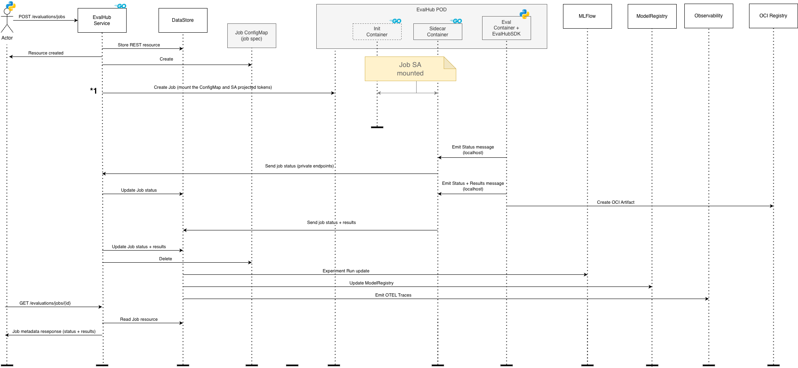

# ADR RHAISTRAT-979 "(feat) Core Evaluation Stack (control plane) for Red Hat AI"

| Field | Value |
|-------|-------|
| Date | January, 2026 |
| Scope | EvalHub (TrustyAI) |
| Status | Draft |
| Authors | TrustyAI |
| Supersedes | N/A |
| Superseded by | N/A |
| Tickets | RHAISTRAT-979 |
| Other docs | ApiDocs: https://eval-hub.github.io/eval-hub/<br>Common folder for eval-hub: https://drive.google.com/drive/u/0/folders/1V1yaf_p_iZZ9DhXg56KTI_TuPkCMxn9q<br>EvalHub service: https://issues.redhat.com/browse/RHOAIENG-47646 |

## What

This document presents the EvalHub architecture - a comprehensive evaluation service that provides a unified API for orchestrating evaluations across multiple heterogeneous evaluation frameworks on OpenShift AI. The service acts as a lightweight routing and orchestration layer that manages evaluation backend lifecycle and result aggregation.

## Why

- Starting from RHAI platform strategy for evaluations (RHAISTRAT-26) the eval-hub provides an abstraction layer on top of a variety of eval frameworks allowing the users to seamlessly switch between frameworks, test with multiple frameworks etc.
- The notion of collections introduced with this service allows the users to group various benchmarks from various providers and run them as a single evaluation job

## Goals

- EvalHub service provides a set of REST APIs and a Python SDK that allows the users to use a variety of evaluation frameworks with a common API.
- Evaluation Framework are pluggable although a default set will be included: lm_evaluation_harness, ragas, garak, guidellm, light_eval. Integration of the default evaluators as well as BYOF (Bring Your Own Framework) relies on a Python Adapter SDK
- Metadata storage is pluggable so that different adopters can integrate with their own preferred data stores. As default we will provide support for Postgres when the service runs in OCP, and SQLite when the server runs locally.

## Non-Goals

- No UI work is part of this ADR. BFF component for UI is subject to a different ADR.
- Define a tenancy and an auth(z) model for eval-hub. This is subject to a separate ADR.
- MLFlow integration beyond experiment tracking and traces.

## How

### Architecture summary (RHOAI - OCP):



- Eval-Hub service layer is written in GoLang as extensively discussed in slack and meetings.
- All data science workloads are executed in separate PODs as Kube Jobs in Python as so far all evaluation frameworks are Python based.
- Actual evaluation workload can happen in the PODs managed by the eval-hub service or the evaluation POD can delegate the job to another external system (i.e. a kube controller, KFP etc). This is a provider specific implementation detail. A Kube Job managed by the eval-hub service is needed for proper Job monitoring decoupled from the service itself.

### Service Deployment Architecture



The deployment architecture consists of:

1. Eval-hub service receives the incoming REST requests for running and managing evaluations, managing collections etc.
2. Objects created via the REST endpoints are called meta-data and stored in the "metastore" (PostgreSQL or SQLite (local)).
3. Eval-hub service exposes operational metrics to Prometheus hence exposing a /metrics endpoint.
4. When a new evaluation job is created, after validating the request, the evalhub service creates a Kube Job where the underlying POD has several components:
   - **Init container** - only needed when test data needs to be fetched from external sources are not available in a mounted PVC. This is optional for now.
   - **Sidecar container** - needed to proxy communication happening during the job execution. For instance intermediate status updates needs to be reported back to the eval-hub service. However this communication needs to be secured and guarded by valid SA tokens. The existence of the sidecar component avoids us exposing secrets to the actual eval container where in case of BYOF can run user provided code.
   - **Eval container** - incorporates the actual evaluation logic and this is where the Adapter Framework SDK lives.

### Evaluation Flow



The evaluation flow follows these steps:

1. Eval-hub service receives the request to run an evaluation
2. After validations it creates the eval job REST resource in DB
3. EvalHub service creates:
   - A ConfigMap holding the json job metadata
   - A SA specific for jobs
   - A Kube Job where the above ConfigMap is mounted in the POD
   - The jobs SA token is never mounted in the Eval container. Only to the sidecar container and if needed in the init container.
4. Eval job runs and starts emitting status updates
5. Eval job artifacts are written to the OCI registry as OCI artifacts. Addressed in a separate ADR
6. Client code calls an SDK callback function to report a new status update
7. The SDK calls a localhost status update API (no tokens involved here) to the sidecar
8. The sidecar receives the status-update request, injects the SA token and calls the eval-hub service status update API
9. Eval-hub service updates the job status in the DB
10. Any GET /api/v1/evaluations/jobs/{id} call coming from the user will reflect the current records status in DB. There is no kube api invocation in this flow. This is how the users or UIs can monitor the job progress via a polling mechanism. Different monitoring mechanisms can be considered later on:
    - Web-sockets or SSE.
    - Web-hooks - this can be handy for a UI to submit an eval job and also register a web hook that eval-hub service would call to keep the UI BFF up to date, hence avoiding the chatty polling approach.
11. Eval-hub service creates the MLFlow experiment and runs. The top level MLFlow experiment needs to be created at the eval-hub service level because an evaluation can run multiple benchmarks using multiple providers. Exepriment runs however are managed by the AdapterFramework SDK because each experiment ran is 1-1 mapped with a benchmark job.

12. Eval-Hub service emits OTEL traces and metrics to the Observability system if available. The exact traces and metrics still need to be determined. <a href="#metrics-and-traces-documentation">This document discussed these details</a>  

### Folder Structure

**Folder structure for the evalhub-service POD:**
- `/app/config` - holds the service configuration file
- `/app/config/providers` - configuration files (one per eval provider)
- `/app/config/collections` - configuration for public default collections available to all users. These are runtime immutable system defined collections. 

**Folder structure inside the eval job POD:**
- `/data` - where any eval test data can be mounted
- `/meta/job.json` - this is where the ConfigMap holding the job definition is mounted
- `/meta/connection-oci.yaml` - this is where the oci registry connection json file is mounted
- `/results` - contains all the output files produced by this job

### Bring Your Own Framework (BYOF)

Each supported provider has its own configuration yaml file where it describes itself in terms of name, supported benchmarks, metrics etc. Also this yaml file describes the runtime information such as:
- The image that contains the eval jobs or the KFP that represents the eval job
- Require env vars
- Default runtime resources (CPU, RAM)

At runtime, the eval-hub service is aware of the configured available providers so upon receiving the evaluation run request, it validates the required provider and benchmarks and can start the Kube job for that specific provider.

But not all providers are packaged as separate images. A provider can mean a KFP. In this case the KFP that is required to run needs to be configured in the provider yaml file. This is subject for a later phase.

### Adapter Framework SDK

Each eval implementation must use the Adapter SDK regardless if this is an out of the box provider (framework) or a custom one (BYOF).

This is best described here: https://issues.redhat.com/browse/RHOAIENG-47436

Essentially the implementation of a specific framework needs to extend `FrameworkAdapter(ABC)` class that exposes a single method:

```python
def run_benchmark_job(self, config, callbacks) -> Results
```

Where:
- `config` - represents the input object holding the job metadata
- `callbacks` - is an object that exposes functions for reporting the job status, results, write to the OCI registry etc. So far the envisioned callback functions are:
  - `report_status(update: JobStatusUpdate) -> None`
  - `create_oci_artifact(spec: OCIArtifactSpec) -> OCIArtifactResult`
  - `report_results(results: JobResults) -> None`

  But in time more can be added.

At container startup the SDK will instantiate the proper implementation of the ABC class and call the `run_benchmark_job` method.

### Local Mode

In local mode an eval-hub python wheel will contain the go server binary. In this way the `pip install` will also bring the server along with other Python dependencies locally. The Python SDK needs to provide a start/stop API for the server. The Go server will be wrapped by a simple Python class in the client SDK.

As in this mode there is no kubernetes available, no operators, the runtimes are not run as Kube Jobs or containers. The eval runtimes are simple python processes started by the eval-hub service. This allows the local user to implement locally the FrameworkAdapter class and run it using the eval-hub SDK without any other packaging steps.

To accommodate different runtime environments the eval-hub service abstracts these implementations via a Runtimes interface and the concrete implementation is chosen at startup based on a service program arg `–local`. The `–local` arg indicates that the service is running in local mode so the actual evaluation happens in separate processes spawned by the service. No Kube API is used.

For storage, SQLite is used in local mode with WAL (Write-Ahead Logging) mode enabled to lock writes without affecting reading during concurrent access. Thus at service startup when the Local Runtime is created:

```sql
PRAGMA journal_mode = WAL;
```

It is important to state the writes in the meta store are fairly small and typically in local mode the concurrency scale may be of order of tens (typically much lower) as in local mode a single user is using the system. However an evaluation may run multiple benchmarks in parallel.

### Operator Resource Management

The TrustyAI operator automatically manages:

1. **Resource Creation**: Creates Deployment, Service, Route, ConfigMap, ServiceAccount, and RBAC resources
2. **Configuration Updates**: Updates ConfigMap when provider configuration changes
3. **Status Management**: Monitors pod health and updates EvalHub CR status
4. **Secret Management**: Creates and rotates TLS certificates for RBAC proxy
5. **Service Discovery**: Monitors external framework adapters and updates provider registry

### Storage Integration

- **PostgreSQL** for metadata storage. In local mode SQLite.
- **MLFlow Tracking**: Experiment metadata and metrics stored in external MLFlow instance
- **Artifact Storage**: S3-compatible storage for evaluation results and large artifacts
- **Configuration**: Kubernetes ConfigMaps for dynamic provider configuration
- **Secrets**: TLS certificates and sensitive configuration data
- **Logs**: Structured logging to stdout for collection by cluster log aggregators

### Kubeflow Pipelines Integration

There are different areas and use cases where KFP integration happens:

#### Invoke eval-hub evaluation from within a KFP component

In this case the eval-hub Python client SDK can safely be used in a KFP Component that can be part of a much larger KFP pipeline.

#### Eval-hub runs evaluations via KFP

In this case eval-hub creates a kube job (along with the sidecar etc) but the eval container does not run the evaluation locally. The eval container uses the KFP SDK to run the evaluation in KFP and still report status updates back to eval-hub via Framework Adapter SDK. The eval-hub team can provide a reference KFP provider implementation that can virtually invoke any KFP that the user points to.

### MLFlow Integration


#### Experiment tracking in MLFlow

This is the current integration that is happening. The eval-hub service needs to create the initial Experiment in MLFlow but to track each run within that experiment we have two options:
- **Centralized** - Track the run from within eval-hub service itself
- **Decentralized** - Each job tracks its own run from the eval job POD. The FrameworkAdapter SDK needs to perform the tracking.

The decentralized option has the advantage of offloading work from the service itself and let each job track itself in MLFlow, including potential integration with MLflow SDK additional capabilities.

#### Tracing in MLFlow

MLFlow supports traces and the nice part is that it support OTEL traces. See here: https://mlflow.org/blog/opentelemetry-tracing-support. 

This means that the same traces we are sending to the Observability system can also be sent directly to the MLFlow server. Or the provider author (BYOF) can decide to send their own traces to MLFlow. The AdapterFramework SDK will add this capability.


### Observability

Eval-Hub service layer and the AdapterFramework SDK will have capabilities to emit OTEL traces to an OTEL Collector. Typically in RHOAI the OTEL Collector comes from the RH Observability Operator however adopters can use any OTEL Collector.

The required metrics and traces are captured here: https://docs.google.com/document/d/1_3TTJGkUcBIXFhRCQJIM7Usx0pa3drRak1gl9JRdD_c/edit?tab=t.u14g5f70k3lc

For metrics, the Eval-Hub service layer exposes /metrics endpoint that will be queried by Prometheus.

For MLFlow tracing please see <a href="#tracing-in-mlflow">Tracing in MLFlow</a> section.

## Open Questions

N/A

## Alternatives

N/A - To be documented if alternatives are considered.

## Security and Privacy Considerations

The EvalHub architecture implements multiple layers of security:

- **RBAC Proxy Sidecar**: All external traffic routed through authenticated proxy
- **TLS Encryption**: End-to-end encryption with automatic certificate management
- **Service Account**: Minimal permissions following principle of least privilege
- **Network Policies**: Optional network isolation for production deployments
- **Pod Security**: Non-root containers with read-only root filesystems
- **Token Management**: Service account tokens are never mounted in the Eval container, only in the sidecar container and optionally in the init container, preventing exposure of credentials to user-provided code in BYOF scenarios

## Risks

N/A - To be documented as risks are identified during implementation.

## Stakeholder Impacts

| Group | Key Contacts | Date | Impacted? |
|-------|--------------|------|-----------|
| PM(BU) | William Caban | | PM for awareness |

## References

#### ApiDocs
https://eval-hub.github.io/eval-hub/
#### Common folder for eval-hub
https://drive.google.com/drive/u/0/folders/1V1yaf_p_iZZ9DhXg56KTI_TuPkCMxn9q
#### EvalHub service: https://issues.redhat.com/browse/RHOAIENG-47646
#### Adapter Framework SDK
https://issues.redhat.com/browse/RHOAIENG-47436
#### Metrics and traces documentation
https://docs.google.com/document/d/1_3TTJGkUcBIXFhRCQJIM7Usx0pa3drRak1gl9JRdD_c/edit?tab=t.7kclrig9a1cj#heading=h.kcyiaxpzsivd

## Reviews

| Reviewed by | Date | Notes |
|-------------|------|-------|
| name | date | ? |
