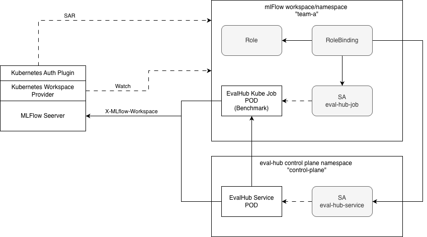

# ADR - Eval-Hub multi-tenancy and auth(z)

| Field | Value |
|-------|-------|
| Date | January, 2026 |
| Scope | EvalHub (TrustyAI) |
| Status | Draft |
| Authors | mdanciu@redhat.com |
| Supersedes | N/A |
| Superseded by | N/A |
| Tickets | |
| Other docs | |

## What

Currently Eval-Hub service does not have a notion of multi-tenancy built in and certainly not a way to bind it to ml-flow. By design we did add placeholders for tenancy at the code level but this needs to be materialized with the right multi-tenancy approach that must be aligned with MLFlow.

MLFlow brings in the notion of workspaces and workspace providers. A workspace is defined as *"A logical grouping of MLflow resources that provides organizational isolation"*. This is great because a workspace naturally maps to a tenant concept as tenancy is mainly about isolation and access control.

To manage workspaces, MLFlow introduces the notion of WorkspaceProvider that is defined as *"A pluggable backend that manages workspace metadata and determines which workspaces are visible to the current request"*

This document describes the multi-tenancy aspects for Eval-Hub service that is aligned with MLFlow not only conceptually but also during MLFlow interactions such as experiment tracking and tracing. However we assume that this integration always relies on the **Kubernetes Workspace Provider** and **Kubernetes Auth Plugin** being applied on the MLFlow server. See doc Ref 1 above.

## Why

MLFlow is the RHAI strategy for several key aspects, such as experiment tracking, tracing, evaluations and even registry. But the need for multi-tenancy, while based on MLFlow, exists in order to address the isolation aspects for easier adoption for larger organizations or even by SaaS applications.

## Goals

- Define how Eval-Hub APIs work in multi tenancy mode
- Define how Eval-Hub service interacts with MLFlow in multi tenancy mode
- Define the prerequisites for admins allowing e2e access using k8s MLFlow Roles and ServiceAccounts.
- Define the metadata isolation per tenant in Eval-Hub storage (PostgreSQL)
- Support only Kubernetes service account tokens.

## Non-Goals

- Support 3rd party OIDC providers
  - While this is a non goal here supporting this should be implicit because it would not affect EvaHub service code as this is a matter of OIDC tokens validation at the proxy layer (which RBAC Proxy supports) and creating the Kube Role pointing the user or groups instead of service accounts. This will require separate testing, documentation etc..

## How

**Note** - *The rest of the document assume that MLFlow Workspace == Kube namespace == Tenant* since per above we already assume the presence of Kubernetes Workspace Provider and the Kubernetes Auth Plugin in MLFlow.

### Tenant specification during REST API calls

MLFlow APIs use `X-Mlflow-Workspace` HTTP header to specify the desired tenant specification. However, adopting this is not proper for the EvalHub service. We need to define the tenant specification for the EvalHub REST APIs

In this case the JWT Token contains the namespace information for this ServiceAccount. Example:

```json
{
  "iss": "https://kubernetes.default.svc",
  "sub": "system:serviceaccount:default:my-sa",
  "aud": ["https://kubernetes.default.svc"],
  "exp": 1700000000,
  "kubernetes.io": {
    "namespace": "finance",
    "serviceaccount": {
      "name": "my-sa",
      "uid": "..."
    }
  }
}
```

**IMPORTANT** - this is the namespace of the identity, not the namespace of a particular resource (like an evaluation job). **SA from different namespaces can be granted access to resources from other namespaces via RoleBindings.**

Thus it is not enough to assume that the tenant that EvalHub service manages is the namespace of the identity. It needs to be the namespace of the resource and this must be specified in the request.

### RBAC Proxy limitations

We want to allow the users to define access to different service capabilities:
- Permissions to run evaluations vs read-only
- Permissions to create collections vs read-only
- etc.

#### Limitation 1

Current RBAC-Proxy does not support byPath rewrites. For instance we want to have this resource mapping:

**Table 1**

| Endpoint | Api Group | Resource | Verbs |
|----------|-----------|----------|-------|
| POST /evaluations/jobs | trustyai.opendatahub.io<br/>mlflow.kubeflow.org | evaluations<br/>experiments | create<br/>create, update |
| DELETE /evaluations/jobs | trustyai.opendatahub.io | evaluations | delete |
| POST /evaluations/collections | trustyai.opendatahub.io | collections | create |
| PUT/PATCH /evaluations/collections | trustyai.opendatahub.io | collections | update |
| DELETE /evaluations/collections | trustyai.opendatahub.io | collections | delete |
| POST /evaluations/providers | trustyai.opendatahub.io | providers | create |
| PUT/PATCH /evaluations/providers | trustyai.opendatahub.io | providers | update |
| DELETE /evaluations/providers | trustyai.opendatahub.io | providers | delete |

Current RBAC-Proxy config only allows rewrites **byQuery** or **byHttpHeader** for a single set or resourceAttributes. Example:

```yaml
authorization:
  rewrites:
    byHttpHeader:
      name: "X-Tenant"
    resourceAttributes:
      apiVersion: v1
      resource: "evaluations"
      namespace: "{{ .Value }}"
```

RBAC-Proxy does allow static path mappings for different endpoints but this is static. No SAR involved so this is not useful.

#### Limitation 2

Extraction of user information from the incoming bearer token and propagate this information to the downstream service as a new HTTP header **X-User**.

Therefore to address the above limitation we've explored several options:

### Option 1 - Extend RBAC Proxy - Fork & contribute back

1. Extend the current RBACProxy to allow path - resources mapping. In this way the RBACProxy config.yaml can define the exact mapping as per Table 1.

Extending the RBAC Proxy would imply a config.yaml file perhaps similar this this:

```yaml
# Test config: evaluations jobs endpoint (POST and other methods)
authorization:
  endpoints:
    - path: /api/v1/evaluations/jobs
      mappings:
        - methods: [post]
          resources:
            - rewrites:
                byHttpHeader:
                  name: X-Tenant
              resourceAttributes:
                namespace: "{{.FromHeader}}"
                apiGroup: trustyai.opendatahub.io
                resource: evaluations
                verb: create
            - rewrites:
                byHttpHeader:
                  name: X-Tenant
              resourceAttributes:
                namespace: "{{.FromHeader}}"
                apiGroup: mlflow.kubeflow.org
                resource: experiments
                verb: create

        - resources:
            - rewrites:
                byHttpHeader:
                  name: X-Tenant
              resourceAttributes:
                namespace: "{{.FromHeader}}"
                apiGroup: trustyai.opendatahub.io
                resource: evaluations
                verb: "{{.FromMethod}}"
```

Thus `endpoints` would be a new supported configuration. It can map individual paths to a set of kube resources that will be verified via SAR.

2. Add support for sending the extracted user (from the JWT bearer token) and send it downstream as X-User header so that the downstream service will get the HTTP headers:
   - **X-User** - the service account name
   - **X-Tenant** - the tenant that scopes this request.

#### Flow example

1. Client sends the request

```
POST /api/v1/evaluations/jobs HTTP/1.1
Host: example.com
Content-Type: application/json
Content-Length: 225
Authorization: Bearer {SA token here}
X-Tenant: team-a

{...payload ...}
```

2. When the RH-RBAC proxy receives the request, extract the SA identity, the claims and the tenant information from the X-Tenant header. It then performs the SAR request to Kube API server:

Given the above ServiceAccount token example and the X-Tenant header the SAR requests payloads will look like:

```yaml
apiVersion: authorization.k8s.io/v1
kind: SubjectAccessReview
spec:
  user: "system:serviceaccount:dev:my-sa"
  groups:
  - "system:serviceaccounts"
  - "system:serviceaccounts:dev"
  resourceAttributes:
    namespace: "team-a"
    verb: "create"
    group: trustyai.opendatahub.io
    resource: "evaluations"
```

The requests below are predicated by the enablement of the MLFlow experiments.

```yaml
apiVersion: authorization.k8s.io/v1
kind: SubjectAccessReview
spec:
  user: "system:serviceaccount:dev:my-sa"
  groups:
  - "system:serviceaccounts"
  - "system:serviceaccounts:dev"
  resourceAttributes:
    namespace: "team-a"
    verb: "create"
    group: mlflow.kubeflow.org
    resource: "experiments"
```

```yaml
apiVersion: authorization.k8s.io/v1
kind: SubjectAccessReview
spec:
  user: "system:serviceaccount:dev:my-sa"
  groups:
  - "system:serviceaccounts"
  - "system:serviceaccounts:dev"
  resourceAttributes:
    namespace: "team-a"
    verb: "update"
    group: mlflow.kubeflow.org
    resource: "experiments"
```

If all these SAR requests succeed, it is guaranteed that the current SA has the proper access to kube resources such as `evaluations` and `experiments` and the request can be sent to the downstream EvalHub service.

3. If the SAR responses allow the access, the RH-RBAC proxy forwards the request to the actual EvalHub service. The request now looks like:

```
POST /api/v1/evaluations/jobs HTTP/1.1
Host: example.com
Content-Type: application/json
Content-Length: 225
X-User: my-sa
X-Tenant: team-a

{...payload ...}
```

As the downstream EvalHub service receives the above request from the RH-RBAC proxy it is guaranteed that the auth(z) steps were already been performed. Note that only the RH-RBAC proxy sidecar is exposed as a Kube Service at deployment time. Not the EvalHub server itself. So at this point the actual SA bearer token is not needed by the downstream service.

Note that this option implies a new OCI image from the DevTestOps team and this may take 1-2 weeks.

### Option 2 - Embedded SAR Filters

This implies having the EvaHub service itself using SAR with Kube API in order to authorize the incoming request. This can be implemented as a Go net/http filter that is applied before the actual request handlers.

While technically this is possible, architecturally breaks a common pattern adopted in RHOAI and it has very diminished potential for reusability.

Of course this option can be easily deployed as a separate sidecar container as well. This would not require a new image.

### Option 3 - Envoy + Authorino

In this case we don't need an RBACProxy component as we'll rely on Authorino authorization policies. However this create a significant dependency that it is maybe too early.

An Authorino config would look like

```yaml
apiVersion: authorino.kuadrant.io/v1beta3
kind: AuthConfig
metadata:
  name: eval-hub-api-protection
spec:
  hosts:
  - eval-hub.your-domain.com
  authentication:
    "k8s-service-accounts":
      kubernetesTokenReview:
        audiences: ["https://kubernetes.default.svc.cluster.local"]
  authorization:
    # Different authorization configs for different paths
    "evaluations-rbac":
      when:
      - selector: context.request.http.path
        operator: matches
        value: "^*/evaluations.*"
      kubernetesSubjectAccessReview:
        user:
          selector: auth.identity.user.username
        resourceAttributes:
          namespace:
            value: team-a
          group:
            value: trustyai.opendatahub.io
          resource:
            value: evaluations
          verb:
            selector: context.request.http.method.@case:lower
```

*But to check for /evaluations for multiple resources like evaluations and experiments, we probably need multiple AuthConfig CRs.*

### Recommendation

**Option 1** - is the preferred architectural approach as this can be re-used by multiple components (EvalHub, MLFlow etc). However this implies other dependencies such as:
- DevTestOps image readiness
- Fork RBAC proxy and extend
- Contribute to RBAC proxy upstream

All these things add up and make this option impractical for EA2.

### Tactical approach for EA2

Implement Option 2 but with major constraints and care:
- Code is isolated and does not depend on any internal packages for EvalHub service. The reason is that post EA2 we want to port this code in RBAC proxy with minimal changes.
- This code can be disabled from EvalHub config.

### Kubernetes Roles and resource-path mapping for EvalHub APIs

As described above, we proposed a set of kubernetes resources to be used for accessing EvalHub APIs:
- **evaluations** mapped to `/evaluations/jobs` endpoints
- **collections** mapped to `/evaluations/collections` endpoints
- **providers** mapped to `/evaluations/providers` endpoints

Note: `/metrics` and `/health` endpoints do not need auth(z)

Having this, the admin can customize access to the EvalHub API

```yaml
apiVersion: v1
kind: ServiceAccount
metadata:
  name: test
  namespace: qa
---
apiVersion: rbac.authorization.k8s.io/v1
kind: Role
metadata:
  name: eval-hub-service-full-access
  namespace: team-a
rules:
- apiGroups:
  - trustyai.opendatahub.io
  resources:
  - evaluations
  - collections
  verbs:
  - get
  - list
  - create
  - update
  - delete
- apiGroups:
  - mlflow.kubeflow.org
  resources:
  - experiments
  verbs:
  - create
  - update
---
apiVersion: rbac.authorization.k8s.io/v1
kind: RoleBinding
metadata:
  name: eval-hub-test-binding
  namespace: team-a
roleRef:
  apiGroup: rbac.authorization.k8s.io
  kind: Role
  name: eval-hub-service-full-access
subjects:
- kind: ServiceAccount
  name: test
  namespace: qa
```

Of course the admin can choose to use ClusterRoles and ClusterRole bindings. Also the admin can define read-only roles, prevent access to create new collections to certain SAs etc. There is a great deal of flexibility in deciding who has access to which EvalHub resources.

### Tenancy at meta-store level

As the EvalHub service exposes REST APIs, the REST resources are persisted in PostgreSQL (by default). However, each evaluation or collection (or any other REST resource in the future) needs to be bound to the tenant name information. This will ensure that there are no leaks cross-tenants. For instance tenant A won't be able to query evaluation jobs and collections from tenant B.

There are a number of ways to can materialize the tenant information

#### Option 1 - Discriminate by a table column

This is probably the simplest option where for each row in the database we have a tenant field. Thus any INSERT, UPDATE, SELECT statement would specify the tenant column.

This option implies that data for ALL tenants are kept in the same database and in the same tables just discriminated by different columns.

#### Option 2 - Discriminate by separate tables

In this case there is no tenant column instead we create separate tables per each tenant. The table names would have the pattern `evaluations-{tenant}`.

#### Option 3 - Discriminate by a separate database

Going further this option does not discriminate tenants by a column or by table names. Instead it uses a completely different database name in the same PostgreSQL server. Now the database name would be formed by `{db-name}-{tenant}`

Of course if some adopters choose not to use PostgreSQL but provide a custom storage, the abstractions for the Storage API will contain the tenant information. This means that the storage implementation is free to choose how tenancy information is stored.

### Recommendation

However, provided that we are focusing on PostgreSQL, we propose OPTION 1 as being the simplest option and it has the potential of minimal maintenance cost by ops teams. Managing an increased number of tables of a large number of databases can be a devops problem. Scalability is another concern as for a relatively large number of tenants Option 2 and Option 3 would likely expose limitations. **Thus, for the foreseeable future we propose OPTION 1**. This is also the approach adopted by MLFlow - see Ref 2 document, "Schema migration" section.

While Option 1 is the proposed approach for now, later on we can extend the support for Option 3 so that in case where stronger isolation requirements this path can be adopted if needed.

### MLFlow interaction

As the very first assumption in this doc is that MLFlow needs to run with the Kubernetes Workspace Provider and the Kubernetes Auth Plugin, whenever EvalHub needs to call MLFlow APIs is need to use a ServiceAccount that has permissions to access that particular MLFlow workspace. However since the SA has granted access to the EvalHub endpoint (say `/evaluations/jobs`) we already have the **X-Tenant** information in the request header. When calling the MLFlow APIs we need to ensure that the X-Mlflow-Workspace header has the same value as the **X-Tenant** header.

As the tenant information will be passed to MLFlow we now need to ensure that the SA token has the right permissions to call into MLFlow server for this tenant. By default EvalHub service and EvalHub Jobs has a specific SA mounted on the EvalHub service POD and also a different SA mounted on the jobs POD.

When creating experiments from the EvalHub, the experiment itself is created from the EvalHub service POD but the experiment runs are created from the eval job PODs. So both SAs need to be bound to the appropriate MLFlow Role or ClusterRole in order to use the MlFlow API in multitenant mode.

### The Authorization model




The namespace `team-a` is the tenant. The namespace "control-plane" is the namespace where the EvalHub service was created. The diagram above shows that the Role and the RoleBinding needs to exist in the `team-a` namespace (unless they are defined as ClusterRole and ClusterRoleBindings which we avoid for now).

The `eval-hub-job` SA is also created in the team-a namespace because this is the actual tenant context.

The `eval-hub-service` SA is created in the control plane namespace where the EvalHub service runs. This is a different namespace from team-a.

However both eval-hub-service and eval-hub-job service accounts need to be able to access mlFlow APIs. Thus the following manifest addresses this:

```yaml
apiVersion: v1
kind: ServiceAccount
metadata:
  name: eval-hub-service
  namespace: control-plane
---
apiVersion: v1
kind: ServiceAccount
metadata:
  name: eval-hub-job
  namespace: team-a
---
kind: Role
metadata:
  name: eval-hub-mlflow
  namespace: team-a
rules:
- apiGroups:
  - mlflow.kubeflow.org
    resources:
    - experiments
    verbs:
    - create
    - update
---
apiVersion: rbac.authorization.k8s.io/v1
kind: RoleBinding
metadata:
  name: eval-hub-mlflow
  namespace: team-a
roleRef:
  apiGroup: rbac.authorization.k8s.io
  kind: Role
  name: eval-hub-mlflow
subjects:
- kind: ServiceAccount
  name: eval-hub-service
  namespace: control-plane
- kind: ServiceAccount
  name: eval-hub-job
  namespace: team-a
```

This means that EvalHub needs to document the above service accounts:
- **eval-hub-service** - service account mounted on the multitenant EvalHub service in the control plane namespace. This is the namespace in which the EvalHub service runs.
- **eval-hub-job** - service account mounted in the kube job pods for each benchmark. **This SA must be created in each tenant namespace.**

With the above the EvalHub system will be able to call into MLFlow and create experiments and experiment runs in the context of `team-a` tenant. These experiments will be visible in mlflow APIs and UIs only for the team-a workspace.

Importantly, when the EvalHub service creates an experiment in MLFlow it should tag the experiment object with more information. MLFlow does not seem to have an authoring mechanism built in but tagging is a simple way of describing whose actions lead to the creation of the experiment. Setting experiment tags can be done via *POST /api/2.0/mlflow/experiments/set-experiment-tag* from a Go app. The following tags would be helpful:

```
author: {X-User header}
eval-hub-job-id: {eval hub job id}
```

### Automating the ServiceAccounts, Roles and RoleBindings

As a cluster admin can manually create the above setup, all these steps can be automated by the EvalHub Controller using the following steps:

1. When an EvalHub CR is submitted for the control plane namespace, the controller automatically creates the `eval-hub-service` SA in the control plane namespace.

As `team-a` (for example) namespace is detected, as an mlflow namespace (based on the below annotation), the EvalHub Controller performs the following:

```
annotations:
  mlflow.kubeflow.org/workspace-description: "Workspace for my team"
```

1. Create the `eval-hub-mlflow` Role in `team-a` namespace
2. Create the `eval-hub-job` SA in `team-a` namespace

3. Created the `eval-hub-mlflow` RoleBinding in `team-a` namespace
   a. Bind the `eval-hub-job` SA from `team-a` namespace to the evalhub-mlflow Role
   b. Bind the `eval-hub-service` SA from `control-plane` namespace to the evalhub-mlflow Role

Now the eval-hub service is able to call the mlflow experiments APIs from both the service itself as well as from the benchmark job to manage the experiment runs. The benchmark jobs will be scheduled in the `team-a` namespace as this is the tenant specified in the `X-Tenant` request header.

All this assumes that the EvalHub Controller itself uses a SA that has the proper permissions for `team-a` namespace to create Roles, RoleBindings and ServiceAccounts.

**Important** - *The EvalHub service should not use the incoming user bearer tokens to call other remote services like mlFlow. The reason is while this is usable from the eval-service perspective to create the initial MLFlow experiment, it is risky to use it from the eval jobs which run asynchronously thus using the user's token may lead to failures as the token could expire. Thus in order to maintain consistency for S2S communication we should not use the user's tokens but rather use the service accounts as described above.*

### OTEL interaction

The interaction with the OTEL Collector happens in a similar way with MLFlow in the sense that `/v1/traces` OTEL calls will contain the service account token of both `eval-hub-service` and `eval-hub-job` service accounts. These SAs will need to be bound to the proper Roles required to access the OTEL Collector, if of course the OTEL collector itself requires auth(z).

## Stakeholder Impacts

| Group | Key Contacts | Date | Impacted? |
|-------|--------------|------|-----------|
| PM(BU) | William Caban | | PM for awareness |

## References

Ref 1
[MLFlow multi tenancy via Kubernetes provider](https://mlflow.org/docs/latest/auth/index.html#kubernetes-auth)

Ref 2
[MLFlow workspaces](https://mlflow.org/docs/latest/workspaces/index.html)

## Reviews

| Reviewed by | Date | Notes |
|-------------|------|-------|
| name | date | ? |
