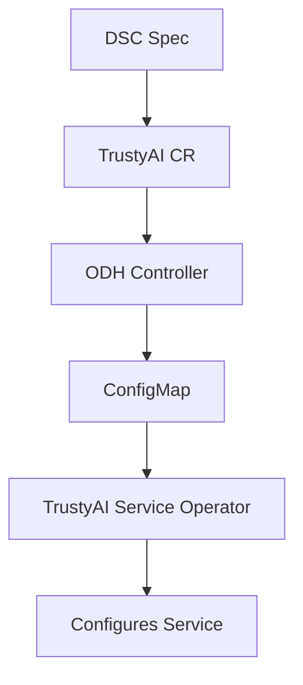

# TrustyAI DSC configuration

|                |                                                                  |
| -------------- |------------------------------------------------------------------|
| Date           | 23 Jul 2025                                                      |
| Scope          | Explainability                                                   |
| Status         | Proposed                                                         |
| Authors        | [Rui Vieira](@ruivieira)                       |
| Supersedes     | N/A                                                              |
| Superseded by: | N/A                                                              |
| Tickets        | [Tracking Issue](https://issues.redhat.com/browse/RHOAISTRAT-507) |
| Other docs:    | none                                                             |

## What

This ADR defines the addition of TrustyAI-specific configuration options to the DataScienceCluster (DSC) resource, specifically for controlling LLM Evaluation (LMEval) security settings through DSC configuration. The configuration will be propagated to TrustyAI service operator via a dedicated `ConfigMap`, complementing the existing operator configuration.

## Why

Currently, TrustyAI operator configuration requires direct manipulation of operator `ConfigMaps` or environment variables, which:

1. **Breaks the DSC abstraction**: Users need to understand TrustyAI service operator internals rather than using the DSC interface
2. **Settings "hidden"**: Security controls like `allowCodeExecution` and `allowOnline` are not exposed through the standard ODH configuration surface
3. **Inconsistency**: Other components (Kserve, ModelMeshServing) expose configuration through DSC, creating inconsistent patterns
4. **Complexity**: Direct operator configuration changes involve potentially manual steps, not easily automatable

## Goals

1. **Unified Configuration**: Expose TrustyAI component settings through DSC interface
2. **Operator Integration**: Create complementary configuration that TrustyAI service operator can read alongside its default configuration
3. **DevFlags Compatibility**: Ensure new configuration works alongside existing `devFlags`
4. **Backward Compatibility**: Maintain compatibility with existing TrustyAI deployments

## Non-Goals

1. **Configuration Replacement**: Only deploy time settings (and admin-controlled), not full TrustyAI configuration
2. **Operator Configuration Migration**: No automatic migration from existing operator-specific configuration

## How

### Type System Changes

#### New Configuration Types

```go
// TrustyAIConfigSpec defines TrustyAI service configuration
type TrustyAIConfigSpec struct {
    // Eval configuration for TrustyAI evaluations
    Eval TrustyAIEvalSpec `json:"eval,omitempty"`
}

// TrustyAIEvalSpec defines evaluation configuration for TrustyAI
type TrustyAIEvalSpec struct {
    // LMEval configuration for language model evaluations
    LMEval TrustyAILMEvalSpec `json:"lmeval,omitempty"`
}

// TrustyAILMEvalSpec defines configuration for language model evaluations
type TrustyAILMEvalSpec struct {
    // AllowCodeExecution controls whether code execution is allowed during evaluations
    // +kubebuilder:default=false
    AllowCodeExecution *bool `json:"allowCodeExecution,omitempty"`
    // AllowOnline controls whether online access is allowed during evaluations
    // +kubebuilder:default=false
    AllowOnline *bool `json:"allowOnline,omitempty"`
}
```

#### Modified Common Spec

```go
type TrustyAICommonSpec struct {
    common.DevFlagsSpec `json:",inline"`
    // Config contains TrustyAI service configuration options
    Config TrustyAIConfigSpec `json:"config,omitempty"`
}
```

#### DSC Configuration Example

```yaml
apiVersion: datasciencecluster.opendatahub.io/v1
kind: DataScienceCluster
spec:
  components:
    trustyai:
      managementState: "Managed"
      config:
        eval:
          lmeval:
            allowCodeExecution: true  # Default: false
            allowOnline: false        # Default: false
      devFlags:  # DevFlags continue to work independently
        manifests:
          - uri: "https://..."
```

### Controller Implementation

#### New Controller Action

```go
func createConfigMap(ctx context.Context, rr *odhtypes.ReconciliationRequest) error {
    trustyai, ok := rr.Instance.(*componentApi.TrustyAI)
    if !ok {
        return fmt.Errorf("resource instance %v is not a componentApi.TrustyAI)", rr.Instance)
    }

    // Skip ConfigMap creation if no configuration is specified
    if trustyai.Spec.Config.Eval.LMEval.AllowCodeExecution == nil && 
        trustyai.Spec.Config.Eval.LMEval.AllowOnline == nil {
        return nil
    }

    // Create supplementary ConfigMap for DSC configuration
    configMap := &corev1.ConfigMap{
        ObjectMeta: metav1.ObjectMeta{
            Name:      "trustyai-dsc-config",  // To not conflict with operator's own ConfigMap configuration
            Namespace: rr.DSCI.Spec.ApplicationsNamespace,
            Labels: map[string]string{
                labels.ODH.Component(ComponentName): labels.True,
                labels.K8SCommon.PartOf:             ComponentName,
                "app.opendatahub.io/config-type":   "dsc-config",
            },
            Annotations: map[string]string{
                "opendatahub.io/managed-by": "dsc-trustyai-controller",
                "opendatahub.io/config-source": "datasciencecluster",
            },
        },
        Data: make(map[string]string),
    }

    // Map DSC configuration to TrustyAI service operator expected format
    if trustyai.Spec.Config.Eval.LMEval.AllowCodeExecution != nil {
        configMap.Data["eval.lmeval.allowCodeExecution"] = 
            strconv.FormatBool(*trustyai.Spec.Config.Eval.LMEval.AllowCodeExecution)
    }
    if trustyai.Spec.Config.Eval.LMEval.AllowOnline != nil {
        configMap.Data["eval.lmeval.allowOnline"] = 
            strconv.FormatBool(*trustyai.Spec.Config.Eval.LMEval.AllowOnline)
    }

    // Server-side apply for atomic updates
    return rr.Client.Patch(ctx, configMap, client.Apply, 
        client.ForceOwnership, client.FieldOwner("trustyai-dsc-controller"))
}
```

#### Controller Action

The new action is inserted in the reconciliation chain after `devFlags` and before `kustomize`:

```go
WithAction(checkPreConditions).
WithAction(initialize).
WithAction(devFlags).              // Process devFlags first
WithAction(createConfigMap).       // Then create DSC configuration
WithAction(releases.NewAction()).
WithAction(kustomize.NewAction())  // Process manifests
```

### Configuration Integration Pattern

#### Configuration Flow



#### ConfigMap Strategy

- **Name**: `trustyai-dsc-config` (avoids conflicts with TrustyAI operator's own `ConfigMap`)
- **Namespace**: Applications namespace (e.g., `opendatahub`)
- **Ownership**: Owned by TrustyAI CR for garbage collection
- **Update Strategy**: has field ownership
- **Integration**: TrustyAI service operator reads this `ConfigMap` alongside its default configuration

#### DevFlags Interaction

DevFlags and DSC configuration work independently:

1. **DevFlags**: _Override_ manifest sources and deployment configurations
2. **DSC Config**: Provides component configuration values
3. **Precedence**: DevFlags affect deployment, DSC config affects component behavior
4. **Compatibility**: Both can be used simultaneously without conflict
5. **Migration Path**: Since the TrustyAI operator has a fallback to missing DSC-configuration, upgrades would work (downgrades would ignore existing DSC-configmap)

### TrustyAI Service Operator Integration

The TrustyAI service operator must be modified to:

1. **Read DSC ConfigMap**: Watch for `trustyai-dsc-config` ConfigMap in addition to its own configuration
2. **Merge Configuration**: Combine DSC configuration with its default configuration
3. **Configuration cascade**: Pass configuration to TrustyAI components as previously, when all configuration was done by the default TrustyAI operator ConfigMap
4. **Configuration Precedence**: DSC configuration should override operator defaults but be overridden by direct operator configuration

#### Expected Integration Points

```go
// In TrustyAI service operator
func (r *TrustyAIServiceReconciler) getDSCConfiguration(ctx context.Context, namespace string) (map[string]string, error) {
    configMap := &corev1.ConfigMap{}
    err := r.Get(ctx, client.ObjectKey{
        Name:      "trustyai-dsc-config",
        Namespace: namespace,
    }, configMap)
    if err != nil {
        if errors.IsNotFound(err) {
            return nil, nil  // No DSC configuration, use defaults
        }
        return nil, err
    }
    return configMap.Data, nil
}
```

## Technical Considerations

### Security Defaults

Both configuration options default to `false` (previous behaviour):
- `allowCodeExecution: false` - Prevents arbitrary code execution during evaluations
- `allowOnline: false` - Prevents network access during evaluations

### CRD Generation

Kubebuilder annotations ensure proper OpenAPI schema generation:
- `+kubebuilder:default=false` - Sets schema defaults
- Field documentation becomes part of CRD schema
- Validation rules can be added if needed


### Error Handling

- **Missing Configuration**: Gracefully handled (no `ConfigMap` created)
- **Invalid Values**: Type system prevents invalid boolean values
- **Operator Integration**: TrustyAI operator must handle missing ConfigMap gracefully

## Open Questions

1. **Configuration Priority**: Should DSC configuration always override TrustyAI operator defaults, or provide fallback behavior?
2. **Extension Points**: What additional configuration should be exposed in future iterations?

## Alternatives

### Alternative 1: Manual ConfigMap Editing and Operator Redeployment
**Description**: Manually edit the TrustyAI operator's ConfigMap and redeploy the operator to apply configuration changes.
**Rejected because**:
- Requires manual intervention for each configuration change
- Not automatable or user-friendly
- Breaks the abstraction provided by the DSC
- Increases risk of misconfiguration and operational errors
