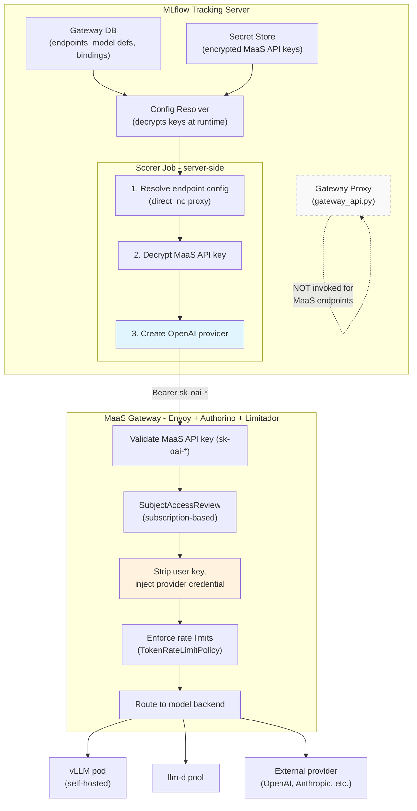

# Open Data Hub - MLflow MaaS Integration for Online Scoring


|                |                                                                                                                                                                                                 |
| -------------- | ----------------------------------------------------------------------------------------------------------------------------------------------------------------------------------------------- |
| Date           | June 25, 2026                                                                                                                                                                                   |
| Scope          | OpenShift AI — MLflow and MaaS (Models-as-a-Service) Integration                                                                                                                                |
| Status         | Draft                                                                                                                                                                                           |
| Authors        | [Edson Tirelli](@etirelli)                                                                                                                                                                      |
| Supersedes     | N/A                                                                                                                                                                                             |
| Superseded by: | N/A                                                                                                                                                                                             |
| Tickets        | [RHAISTRAT-1579](https://redhat.atlassian.net/browse/RHAISTRAT-1579)                                                                                                                            |
| Other docs:    | [MLflow AI Gateway Adoption Analysis](internal), [AI Gateway F2F Notes](internal), [MaaS API Documentation](https://github.com/opendatahub-io/models-as-a-service/blob/main/maas-api/README.md) |


## What

Enable MLflow in OpenShift AI to use MaaS-managed model endpoints for online scoring (LLM-as-a-Judge evaluation of traces) without requiring the MLflow AI Gateway proxy. MLflow retains its existing key management and endpoint metadata storage, but at runtime resolves endpoint credentials directly from its database and calls MaaS model endpoints without routing through the gateway proxy. MaaS endpoints are discovered via the MaaS REST API and stored as MLflow endpoints so that the existing UI flows continue to work.

## Why

MLflow's built-in AI Gateway bundles two responsibilities into one component: (1) key management — storing, encrypting, and resolving API keys, and (2) an HTTP proxy — receiving scoring requests, resolving credentials, and forwarding to model providers via LiteLLM. In OpenShift AI, the proxy function is redundant because MaaS already provides a governed gateway with authentication, credential injection, rate limiting, and routing through the Envoy + Authorino + Limitador stack.

The MLflow AI Gateway proxy is completely disabled in the RHOAI deployment and will not be supported. This is a deliberate product decision — MaaS is the governed model access layer for OpenShift AI, and enabling a second gateway would create:

- **Architectural duplication** — two gateways performing overlapping functions (credential management, request routing, rate limiting).
- **Credential confusion** — MLflow's secret store would hold provider API keys (OpenAI, Anthropic, etc.) that MaaS already manages via `ExternalModel` CRDs and `credentialRef` Secrets. Users would need to manage credentials in two places.
- **Governance bypass risk** — requests routed through MLflow's gateway proxy would bypass MaaS's subscription-based authorization, rate limiting, and audit trail.

With the proxy disabled, MLflow's online scoring features (LLM-as-a-Judge, automatic trace evaluation) have no way to call model endpoints. This ADR addresses how to restore those capabilities by routing through MaaS instead.

MaaS exposes an OpenAI-compatible REST API with its own API key system (`sk-oai-`*). MLflow can treat MaaS as an OpenAI-compatible provider, storing only the MaaS API key (not individual provider credentials) and delegating all credential injection and governance to MaaS.

## Goals

- Enable users to discover MaaS model endpoints from within the MLflow UI and select them as judge models for trace evaluation.
- Store MaaS endpoint metadata and API keys in MLflow's existing gateway database and secret store — no new storage systems.
- Execute online scoring (automatic trace evaluation) against MaaS endpoints without invoking the MLflow AI Gateway proxy.
- Support both interactive evaluation (UI-triggered, SDK-based) and continuous online scoring (server-side async jobs) against MaaS endpoints.
- Support per-scorer API keys — each online scoring configuration stores its own MaaS API key (provided by the user who creates the scorer), enabling per-user metering and subscription-scoped access at the scorer level.
- Ensure upstream compatibility — changes to MLflow's scoring path should be designed as generic improvements (e.g., direct config resolution as a performance optimization) that work for all gateway endpoints, not just MaaS, so they are acceptable as upstream contributions.

## Non-Goals

- Enabling or supporting the MLflow AI Gateway proxy in RHOAI — the MLflow AI Gateway component is completely disabled in the RHOAI deployment of MLflow and will not be supported. This ADR addresses how to deliver online scoring capabilities without it.
- Managing MaaS subscriptions, rate limits, or model deployments from within MLflow — these are MaaS platform concerns.
- Automatic API key minting in Phase 1 — in the initial release, users provide their own MaaS API key when configuring an online scorer. Phase 2 will add auto-minting (see below).
- Upstream contribution of MaaS-specific code to the MLflow project — all changes to MLflow must be designed as generic pluggability improvements (e.g., plugin hooks, provider abstractions) suitable for upstream acceptance. MaaS-specific logic lives in external plugins or the RHOAI operator, not in MLflow core. Downstream fork patches are a temporary fallback only and should be minimized.

## How

### Architecture Overview

The solution decouples MLflow's key management from its proxy, then bridges the abstraction gap between MLflow's endpoint-centric model and MaaS's model-centric addressing.




### Component Changes

#### 1. Endpoint Discovery — Server-Side MaaS Model Listing

Add a new server handler that proxies the MaaS `GET /v1/models` API, using the authenticated user's identity to filter results by their MaaS subscription. The UI calls this handler when presenting model choices during endpoint creation.

The MaaS gateway URL is configured via a server-level setting (environment variable). The user's authentication token (already present in the request from the Kubernetes auth provider) is forwarded to MaaS for model listing.

#### 2. Endpoint Storage — MaaS Models as MLflow Endpoints

When a user selects a MaaS model, MLflow creates a standard gateway endpoint in its database:


| Field              | Value                                                  | Notes                                        |
| ------------------ | ------------------------------------------------------ | -------------------------------------------- |
| Endpoint name      | User-chosen or derived from model name                 | e.g., `gpt-4o-maas`                          |
| Provider           | `openai`                                               | MaaS is OpenAI-compatible                    |
| Model name         | MaaS model name                                        | e.g., `gpt-4o`                               |
| Secret (encrypted) | `{"api_key": "sk-oai-xxx"}`                            | User's MaaS API key                          |
| Auth config        | `{"base_url": "https://maas.cluster/{ns}/{model}/v1"}` | MaaS model URL                               |
| Tag                | `source: maas`                                         | Distinguishes from locally-managed endpoints |


No schema changes — `auth_config` (existing JSON field) carries the base URL. The secret store encrypts the MaaS API key using the existing KEKManager envelope encryption.

#### 3. Runtime Scoring — Direct Config Resolution (Bypass Proxy)

Modify the `gateway:/` provider resolution path (`mlflow/metrics/genai/model_utils.py:_get_provider_instance`) to resolve endpoint configuration directly from the database when running server-side, instead of making an HTTP call to the gateway proxy.

Current flow:

```
_get_provider_instance("gateway", name)
  → get_gateway_config(name)           # resolves gateway HTTP URL
  → HTTP POST to gateway proxy         # proxy resolves config, calls provider
```

Proposed flow (server-side only):

```
_get_provider_instance("gateway", name)
  → config_resolver.get_endpoint_config(name)   # direct DB resolution
  → decrypt API key from secret store
  → create OpenAI provider with base_url + api_key
  → call MaaS directly                          # no proxy
```

The server-side detection is a capability check: if the tracking store is a `SqlAlchemyStore`, direct resolution is available. This is not a security boundary — the tracking store type is set at server startup and is not user-controllable. Client-side code uses `RestStore` and naturally falls back to the existing proxy path. Scorer jobs run as Huey workers within the server process and inherit the server's store instance.

This change is generic — it benefits all gateway endpoints, not just MaaS ones. Any endpoint stored in the gateway DB can be resolved directly server-side, reducing latency by eliminating the proxy HTTP round-trip.

#### 4. Credential Lifecycle

**Interactive users (SDK, UI-triggered evaluation):**

- User mints a MaaS API key via the MaaS API (`POST /maas-api/v1/api-keys`) using their OCP token — this is part of the standard MaaS workflow.
- User provides the key when creating the endpoint in MLflow.
- Key stored encrypted; decrypted at runtime for scoring calls.

**Online scoring jobs (server-side, continuous):**

- Each online scorer is bound to an endpoint that has its own MaaS API key, provided by the user who configured the scorer.
- At runtime, the scorer job resolves the bound endpoint's config, decrypts the API key, and calls MaaS directly.
- The API key carries the creating user's subscription, so metering and rate limits are attributed to the user who set up the scorer, not to a shared server identity.
- MaaS API keys have a maximum 90-day TTL; users are responsible for rotating their keys. The UI should surface key expiry status so users can update before scoring fails.

**Key point:** MLflow stores only MaaS API keys — one opaque token per endpoint configuration. It never stores or manages individual provider API keys (OpenAI, Anthropic, etc.). MaaS's Authorino layer handles the credential swap from MaaS key to provider key at the gateway level.

### Phase 2: Automatic API Key Minting

In Phase 1, users manually provide a MaaS API key when configuring a scorer endpoint. Phase 2 adds an auto-mint option so the system can provision keys transparently.

**User experience:** When configuring a judge in the UI, the user sees the MaaS model selector and two options:

- **Use existing key** — paste a pre-existing MaaS API key (Phase 1 behavior)
- **Mint new key** — the system automatically creates a scoped API key for this scorer configuration

**How auto-minting works:**

1. The user's OCP token is already available in the request (via the Kubernetes auth provider).
2. MLflow server calls `POST /maas-api/v1/api-keys` with the user's token, requesting a key scoped to the selected model's subscription.
3. MaaS returns an API key (`sk-oai-`*). MLflow stores it encrypted in the gateway secret store, bound to the scorer's endpoint.
4. The user never sees or handles the key.

**Key lifecycle with auto-minting:**

- Auto-minted keys use the regular 90-day TTL by default.
- The user's OCP token is used only during the mint request and is NOT retained by MLflow. Re-minting on expiry requires one of: (a) the user re-authenticates and triggers a key refresh via the UI, (b) a service account with delegated minting authority refreshes on behalf of the user, or (c) ephemeral keys (1-hour max TTL) are minted per scoring batch, eliminating the rotation problem at the cost of more frequent MaaS API calls. The specific re-minting mechanism will be designed in Phase 2.
- MLflow does not perform SubjectAccessReview itself — it passes the user's OCP token to the MaaS API, which performs its own authorization checks (subscription membership, model access). If the user lacks access, the MaaS API returns an error that MLflow surfaces directly.

**Implementation considerations:**

- Auto-minting requires the MLflow server to integrate with the MaaS key-minting API — this is RHOAI-specific logic that would live in the RHOAI MLflow operator or a server plugin, not in upstream MLflow.
- The user must belong to an OpenShift group referenced by a `MaaSSubscription` for the mint call to succeed. If the user lacks a subscription for the selected model, the mint fails with a clear error.
- Auto-minted keys inherit the user's subscription, so metering and rate limits are correctly attributed.

### MaaS Auth Flow (for reference)

MaaS uses a two-stage authentication model:

1. **Admin operations** (minting keys, managing subscriptions): authenticated via OCP tokens, validated through Kubernetes TokenReview.
2. **Inference** (`/v1/chat/completions`): authenticated via MaaS API keys (`sk-oai-`*) only. The API key encodes the caller's identity, subscription, and access scope. No OCP token needed at inference time.

At the gateway, Authorino validates the API key, performs a SubjectAccessReview against the bound identity, strips the user's key, and injects the provider's API key from the `ExternalModel` CRD's `credentialRef` Secret. The user (and MLflow) never sees or handles provider credentials.

## Open Questions

1. **Model-in-path vs model-in-body:** MaaS currently uses path-based routing (`/{ns}/{model}/v1/chat/completions`). MLflow's OpenAI provider sends the model name in the request body. MaaS accepts model-in-body, but the path-based URL must still be correct. How should the model URL be constructed when the unified entry point (RHAIRFE-1304) is not yet available?
2. **UI prefix for MaaS endpoints:** The UI currently hardcodes `gateway:/` as the model URI prefix (`formatGatewayModelFromEndpoint()`). Since the direct resolver handles the `gateway:/` scheme, MaaS endpoints stored as gateway endpoints will use the same prefix — no new scheme is needed. The `source: maas` tag distinguishes them from locally-managed endpoints at the data level, not the URI level. This must be validated end-to-end during implementation.
3. **Key rotation for online scoring:** The server's MaaS API key has a 90-day max TTL. What mechanism handles rotation? Options: init container that re-mints on startup, sidecar that watches expiry, or CronJob.
4. **Upstream contribution sequencing:** All MLflow changes must be designed and packaged for upstream acceptance, including creating plugin hooks where they don't currently exist (e.g., pluggable endpoint discovery, direct config resolution). Carrying changes in our downstream fork is a temporary fallback only — it should be avoided if at all possible. The open question is sequencing: which changes should be proposed as upstream RFCs first, and which can proceed in parallel with implementation?

## Alternatives

### Alternative 1: Enable the MLflow AI Gateway proxy alongside MaaS

Run both the MLflow AI Gateway proxy and MaaS gateway. MLflow endpoints store provider credentials directly (not MaaS API keys). The MLflow proxy handles credential injection and calls providers.

**Ruled out.** The MLflow AI Gateway proxy is disabled in RHOAI by product decision and will not be supported. This alternative is documented for completeness only.

**Tradeoffs:**

- (+) Zero changes to MLflow.
- (-) Dual credential management — provider keys in both MLflow secret store and MaaS `credentialRef` Secrets.
- (-) Overlaps and conflicts with MaaS governance (subscription-based rate limiting, audit trail, SubjectAccessReview).
- (-) Architectural duplication — two proxies, two auth chains, two rate limiters.

### Alternative 2: Sync MaaS endpoints into MLflow's database

A background process watches MaaSModelRef CRDs and creates corresponding gateway endpoints in MLflow's database with a service-level API key.

**Tradeoffs:**

- (+) No MLflow code changes — purely operational.
- (-) Sync lag — dynamically created MaaS endpoints won't appear in MLflow until the sync runs.
- (-) Sync trigger complexity — polling interval vs watch-based requires operator logic.
- (-) Still routes through the gateway proxy at runtime (same credential resolution problem).

### Alternative 3: Custom MLflow Deployment Client Plugin Only

Use the `mlflow.deployments` entrypoint system to register a MaaS deployment client. Endpoint discovery and scoring go through the plugin. No gateway involvement.

**Tradeoffs:**

- (+) Zero MLflow source changes — pure external plugin.
- (+) Works for the SDK path (`endpoints:/` URI scheme).
- (-) The judge adapter chain does NOT route `endpoints:/` through the deployment client when the prompt is a list of ChatMessages — falls through to LiteLLMAdapter.
- (-) The UI hardcodes `gateway:/` prefix — endpoints from the deployment client don't appear in the gateway UI and can't be selected for judges.
- (-) Two separate systems: deployment client for SDK, gateway DB for UI — no unified story.

### Alternative 4: Replace the MLflow tracking store entirely

Register a custom tracking store (via `mlflow.tracking_store` entrypoint) that overrides the `GatewayStoreMixin` to query MaaS.

**Tradeoffs:**

- (+) Zero MLflow source changes.
- (+) UI gets MaaS endpoints via the standard API.
- (-) Must reimplement or delegate all `AbstractStore` methods (~100+).
- (-) Runtime scoring still routes through `gateway:/` → proxy → credential resolution fails for MaaS endpoints.
- (-) Only solves listing, not the scoring credential chain.

## Security and Privacy Considerations

- **MaaS API keys are stored encrypted** in MLflow's secret store using envelope encryption (KEKManager). Keys are never exposed to clients via the REST API. KEK isolation and access controls are enforced by the deployment configuration (see RHOAI operator documentation).
- **Provider credentials never enter MLflow** — MaaS handles the swap from user API key to provider API key at the Authorino layer. MLflow stores and transmits only MaaS API keys.
- **Key scope is subscription-bound** — a MaaS API key can only access models permitted by its associated `MaaSSubscription`. Access enforcement is performed entirely by the MaaS gateway (Authorino) on every request — MLflow does not cache subscription validity. If a subscription is modified or revoked, the next scoring call receives a 403 from MaaS. MLflow treats any MaaS 403/401 response as a terminal error for that scoring job (fail closed) and surfaces the error to the user.

## Risks

- **MaaS API stability:** The MaaS REST API (`maas.opendatahub.io/v1alpha1`) is alpha. Breaking changes could require updates to the MLflow integration. Mitigation: isolate MaaS-specific logic behind an abstraction layer.
- **API key expiry during long-running evaluations:** A 90-day key could expire mid-evaluation if not rotated. Mitigation: monitor key expiry, rotate proactively with buffer.
- **Guardrails are a MaaS platform concern:** The MLflow AI Gateway proxy includes guardrail capabilities (content filters), but since the proxy is disabled in RHOAI, these were never active. This ADR does not introduce a guardrails regression. Content filtering and safety guardrails for model access are the responsibility of the MaaS gateway layer (NeMo/TrustyAI via Kuadrant ext_proc adapters).
- **Upstream acceptance of direct resolution:** The `_get_provider_instance` change is generic, but modifying the server-side scoring path may face scrutiny. Supporting argument: highlight as a performance optimization (eliminates HTTP round-trip) as well.

## Stakeholder Impacts

| Group                        | Key Contacts    | Date       | Impacted?                                         |
| ---------------------------- | --------------- | ---------- | ------------------------------------------------- |
| MLflow / Experiment Tracking | Matt Prahl      |            | Yes — scoring path change, endpoint creation flow |
| MaaS / AI Gateway            | Marius Daciu    |            | Yes — MLflow becomes a MaaS API consumer          |
| RHOAI Dashboard              | Juntao Wang     |            | Yes — UI changes for MaaS model discovery         |
| Architecture                 | Edson Tirelli, Lindani Phiri |  | Yes — cross-component integration, API key management and MaaS |
| RHOAI Operator               | Luca Burgazzoli |            | Maybe — API key lifecycle management              |


## References

- [MaaS API Documentation](https://github.com/opendatahub-io/models-as-a-service/blob/main/maas-api/README.md)
- [MaaS API Types (Go)](https://pkg.go.dev/github.com/opendatahub-io/models-as-a-service/maas-controller/api/maas/v1alpha1)
- [Introducing Models-as-a-Service in OpenShift AI](https://developers.redhat.com/articles/2025/11/25/introducing-models-service-openshift-ai)
- [MLflow AI Gateway Architecture](https://mlflow.org/articles/ai-gateway-architecture-a-guide-for-technical-teams/)
- [MLflow Deployment Client Plugin Interface](https://github.com/mlflow/mlflow/blob/master/mlflow/deployments/base.py#L319)

## Reviews


| Reviewed by | Date | Notes |
| ----------- | ---- | ----- |
|             |      |       |


