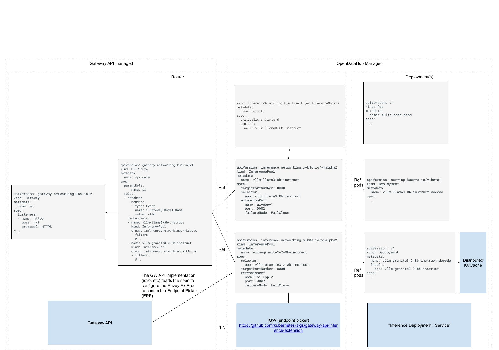

# Open Data Hub - Gateway Inference Extension CRDs owners

|                |                                      |
|----------------|--------------------------------------|
| Date           | Jun 25, 2024                         |
| Scope          | Model Serving, OCP Networking, llm-d |
| Status         | Approved                             |
| Authors        | Model Serving team                   |
| Supersedes     | N/A                                  |
| Superseded by: | N/A                                  |
| Tickets        | N/A                                  |
| Other docs:    | none                                 |

## What

This Architecture Decision Record (ADR) defines the ownership and installation responsibility for the Gateway Inference
Extension (GIE) CRDs within Open Data Hub (ODH).

## Why

The Gateway Inference Extension (GIE) introduces several CRDs. While most are leveraged by the GIE scheduler (
llm-d-inference-scheduler), which is owned by OpenDataHub, the InferencePool CRD presents a cross-team dependency. It is
used by both the llm-d-inference-scheduler and the OpenShift Container Platform (OCP) Networking team's Gateway API
implementation (Istio) to configure the Envoy ExtProc. This shared dependency necessitates a clear ownership model to
avoid installation conflicts and ensure a clear lifecycle management.

## Goals

- To establish a single, authoritative owner for the installation and management of the Gateway Inference Extension
  CRDs.
- To ensure a seamless user experience where features dependent on these CRDs are enabled dynamically.

## Non-Goals

- This ADR will not propose any modifications to the existing GIE CRD schemas.
- This ADR does not cover the implementation details of the llm-d-inference-scheduler or the Envoy ExtProc integration.

## How

OpenDataHub, through its Model Serving components, will be responsible for installing and managing the lifecycle of all
Gateway Inference Extension (GIE) CRDs, including InferencePool.

The OCP Gateway API implementation (Istio) will be designed to detect the presence of the InferencePool CRD on the
cluster. Its controller will dynamically enable the logic to reconcile InferencePool resources only when the CRD is
available. This "watch-based" enablement decouples the OCP Networking components from the installation of the GIE CRDs,
allowing each component to evolve independently. If OpenDataHub is uninstalled, the GIE CRDs will be removed. This could
negatively impact the OCP Networking components if they are still configured to use them. The OCP Gateway controller
must be robust enough to handle the absence of the CRD gracefully.

## Alternatives

### OCP Networking Owns the CRDs

The OCP Networking team, as owners of the Gateway API implementation, could own the installation of the `InferencePool`
CRD, while leaving the remaining CRDs to OpenDataHub.

#### Pros:

- The InferencePool CRD is tightly coupled with their Envoy configuration. This would keep the CRD and its primary
  consumer within the same domain.

#### Cons:

- Unstable CRD in the core platform
- Potentially multiple midstream and downstream forks to maintain for GIE by different teams (ODH, RHOAI and OpenShift)
- Timeline for TP at risk

## Risks

- If the InferencePool CRD evolves with breaking changes, a coordinated update process is required. OpenDataHub must
  ensure the installed CRD version is compatible with the OCP version in use, while the OCP Networking team must ensure
  their components can utilize the newer CRD version in future updates.
- If the OCP Networking team's Istio implementation requires a different version of the InferencePool CRD than what
  OpenDataHub installs, it could lead to feature incompatibility or unexpected behavior. This risk is mitigated by clear
  communication channels between the teams and robust integration testing.
- Users of the OCP Gateway API who wish to use InferencePool will have a dependency on OpenDataHub being installed.
  This is considered an acceptable trade-off, as the primary use case for GIE is driven by the model serving
  capabilities provided by ODH.
- CRD Removal: If OpenDataHub is uninstalled, the GIE CRDs will be removed. This could negatively impact the OCP
  Networking components if they are still configured to use them. The OCP Gateway controller must be robust enough to
  handle the absence of the CRD gracefully.

## Stakeholder Impacts

| Group            | Key Contacts  | Date         | Impacted? |
|------------------|---------------|--------------|-----------|
| Model Serving    | Daniele Zonca | Jun 25, 2025 | yes       |
| OCP Networking   | Shane Utt     | Jun 25, 2025 | yes       |
| OCP Service Mesh | Aslak Knutsen | Jun 25, 2025 | yes       |

## Reviews

| Reviewed by | Date | Notes |
|-------------|------|-------|
| name        | date | ?     |
