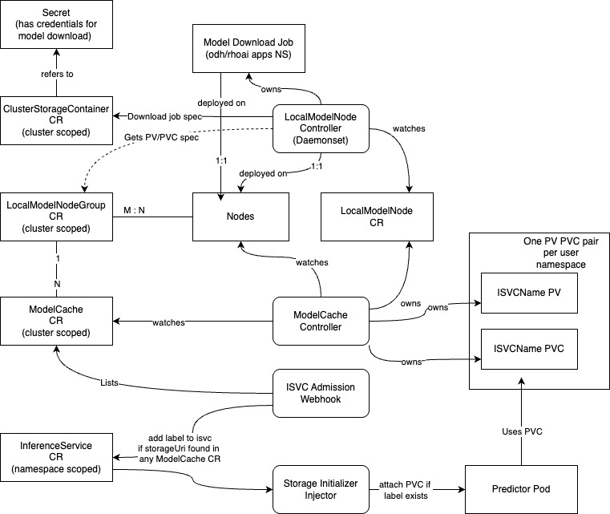

# Open Data Hub - KServe Enable Private Endpoint

|                |                                                                   |
| -------------- |-------------------------------------------------------------------|
| Date           | May 5, 2024                                                       |
| Scope          | Model Serving                                                     |
| Status         | Review                                                            |
| Authors        | Vedant Mahabaleshwarkar                                           |
| Supersedes     | N/A                                                               |
| Superseded by: | N/A                                                               |
| Tickets        | [Tracking Issue](https://issues.redhat.com/browse/RHOAISTRAT-649) |
| Other docs:    | [Refinement Doc](https://docs.google.com/document/d/1Oo98bTBHTL-RmrEnEEi3n4O3_zmZkeYOwfsvYq2mUu4/edit?tab=t.0#heading=h.nk0gqur98cd3)                                               |

## What
This ADR discusses the current architecture of the Kserve ModelCache feature as implemented upstream and it's feasibility in RHOAI 

## Why
GenAI models are quite large in size compared to Predictive AI models. These workloads are latency sensitive, and the large size of the models usually mean long initialization times. These long initialization times also affect scaling of the workloads, as trying to scale up takes a long time when the new replicas need to download large sized models. The ModelCache feature in Kserve allows models to be pre-pulled and stored on the disk. This significantly reduces the initialization time when first deploying the workload, and also while scaling the workload.

## Goals
- RHOAI admins(?) should be able to pre-pull/cache models on desired nodes 
- RHOAI users should be able to leverage cached models while deploying InferenceServices

## How
Models can be pre-cached on to desired nodes as follows: 
- Label the desired nodes as `kserve/localmodel: worker`
- Models are cached by creating a ModelCache CR that specifies the NodeGroup on which the model should be cached
  - LocalModelNode Agent creates a download job on the specified nodes to download the model
    - The download job spec is obtained via a compatible ClusterStorageContainer CR which contains the credentials to download the model
    - The PV/PVC spec to store the model is obtained from the LocalModelNodeGroup CR
- InferenceServices that have the same URI as specified in any ModelCache CR will use the cached models attached as a PV+PVC

Example : https://kserve.github.io/website/docs/model-serving/generative-inference/modelcache/localmodel 

## Security and Privacy Considerations
- RHOAI users cannot cache models themselves as the ClusterStorageContainer + Secret that define the credentials don't live in user owned namespaces

## Risks
- Changes to architecture might delay planned delivery of the ModelCache feature

## Stakeholder Impacts

| Group        | Key Contacts  | Date | Impacted? |
| ------------ |---------------|------| --------- |
| ModelServing | Daniele Zonca |      | Yes       |

# Reviews

| Reviewed by           | Date         | Approval | Notes |
|-----------------------| -----------  | -------- | ----- |
| Daniele Zonca         |   |  |       |
| Yuan Tang             |   |  |       |
