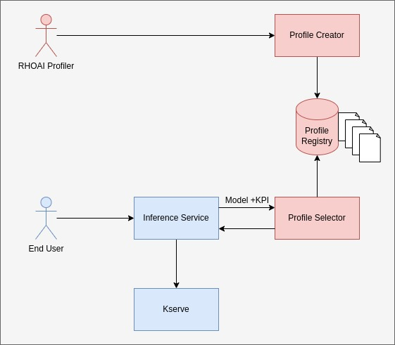
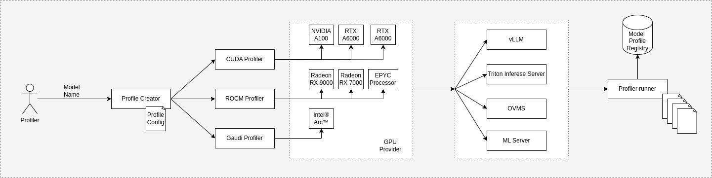
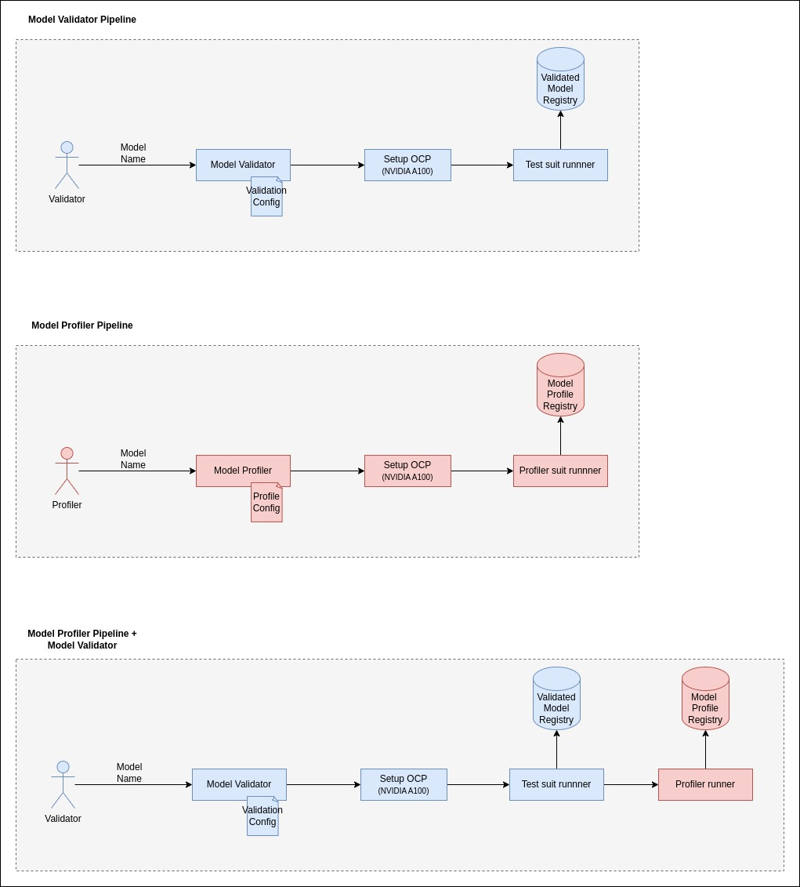

# AI model serving optimization

|                |                                                                  |
| -------------- |------------------------------------------------------------------|
| Date           | March 21, 2025                                                   |
| Scope          | RHOAI                                                            |
| Status         | Review                                                           |
| Authors        | [Vaibhav Jain](@vajain)                                          |
| Supersedes     | N/A                                                              |
| Superseded by: | N/A                                                              |
| Tickets        | |
| Other docs:    | none                                                             |

## What
To enhance Red Hat OpenShift AI by introducing a functionality that simplifies the deployment of AI/ML models, abstracting away the complexity of choosing model-serving frameworks and optimizing parameters. This functionality will allow users to specify only the model and their desired Key Performance Indicator (KPI), such as low latency, high throughput, or quantization, while the system automatically determines the optimal configuration for the underlying hardware.

## Why
- Reduce complexity in configuring AI model serving.
- Optimize performance based on hardware and KPIs (e.g., low latency, high throughput).
- Enhance OpenShift AI’s competitiveness and usability.

## Goals
This proposal seeks to introduce a new functionality in Red Hat OpenShift AI that mirrors Nvidia’s NIM approach, simplifying the deployment of AI models by automatically selecting an optimal model-serving framework and runtime parameters.

## Non-Goals
- Immediate overhaul of the existing Model Serving flow.

## How
### Automated Model Selection & Optimization:
- User could manually c

### Hardware-Aware Optimization:
- Tooling detects runtime hardware (CPU/GPU type, memory, available accelerators, etc.).
- Filters profiles that match the desired model and KPI to determine the best configuration.

### Profile-Based Inference Service Deployment:
- Profiles act as predefined recipes specifying:
  - Model server framework (e.g., vLLM, Triton, OVMS).
  - Number of GPU cards and memory allocation.
  - Tensor parallelism, batch size, and other optimizations.
- The profile is used to launch the inference service on the given hardware seamlessly.
.

  

### Example Workflow

##### User Input:
- Users select a model (e.g., Llama-2) and a KPI (e.g., low latency).
##### System Action:
- The system detects the hardware (e.g., 2x NVIDIA A100 GPUs).
- It selects a profile optimized for low latency on A100 GPUs, specifying:
  - Framework: vLLM
  - GPU cards: 2
  - Tensor parallelism: 2
  - Batch size: 1
##### Deployment:
The system launches the inference service using the selected profile.

### Vision
  

### Alignment With RHOAI Roadmap

## Alternatives
User could manually choose model-serving frameworks and optimizing parameters for model.

## Security and Privacy Considerations

## Risks

## Stakeholder Impacts

| Group        | Key Contacts                                                                                                                                    | Date        | Impacted? |
| ------------ | ----------------------------------------------------------------------------------------------------------------------------------------------- | ----------- | --------- |

# Reviews

| Reviewed by           | Date         | Approval | Notes |
| --------------------- | -----------  | -------- | ----- |

