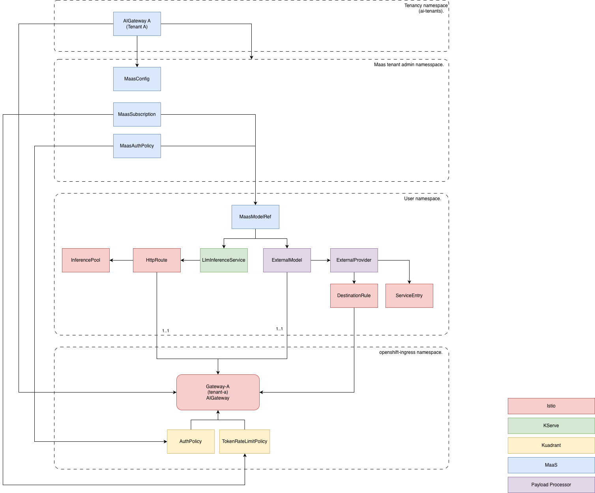

# Open Data Hub - Architecture Decision Record

|                |            |
| -------------- | ---------- |
| Date           | 2026-05-27 |
| Scope          | AI Gateway, Models-as-a-Service (MaaS), Multi-tenancy |
| Status         | Proposed |
| Authors        | Marius Danciu, Lindani Phiri, Jamie Land |
| Supersedes     | N/A |
| Superseded by: | N/A |
| Tickets        | TBD |
| Other docs:    | none |

## What

This ADR defines multi-tenancy for the AI Gateway (previously MaaS), introducing a one-gateway-per-tenant architecture with dedicated maas-api instances, tenant-scoped auth policies, and database-level isolation.

## Why

MaaS currently operates as a single-tenant system where all subscriptions and auth policies are managed in one namespace. The only isolation mechanism is Kubernetes RBAC. Organizations need to segregate access, management, compute resources, and traffic for different purposes such as internal departments, projects, or teams. Multi-tenancy enables:

- **Resource isolation**: Separate compute and network resources per tenant
- **Security boundaries**: Independent OIDC configurations and auth policies
- **Operational separation**: Tenant lifecycle management without cross-tenant impact
- **Cost allocation**: Per-tenant usage tracking and chargeback

## Goals

- Define tenant as a dedicated AI Gateway with its own namespace, OIDC config, and maas-api instance
- Establish automatic tenant lifecycle management via the AITenant CR
- Ensure complete isolation of access, Kubernetes CRs, and database records per tenant
- Support migration from single-tenant to multi-tenant without downtime
- Enable tenant-specific observability (metrics, traces, logs)

## Non-Goals

- Define dashboard behavior and UX design for multi-tenant scenarios (deferred to UI team)
- Define a platform-wide RHOAI tenancy system (this ADR is scoped to AI Gateway/MaaS)
- Support cross-tenant model sharing (explicitly out of scope for v1)
- Tenant suspend/resume functionality (future enhancement)
- Per-tenant physical database instances (logical isolation sufficient for v1)

## How

### Architecture Overview

The multi-tenant architecture follows a **one-gateway-per-tenant** pattern. Each tenant gets:

1. An AITenant CR in the `ai-tenants` namespace (cluster-level registry). For now this CR is managed by the mass-controller but in the future this can be managed by a higher level platform controller. 
2. A dedicated tenant admin namespace. This namespace is automatically labeled as `ai-gateway.opendatahub.io/tenant`.
3. A dedicated Gateway CR (gateway.networking.k8s.io/v1) with separate Envoy pods
4. A dedicated maas-api service instance with its own HttpRoute
5. A MaasTenantConfig CR for tenant-specific configuration
6. OIDC configuration scoped to the tenant

Tenant identification at the data plane level uses hostname: `{tenant-name}.{domain}`.



### Control Plane

#### Tenant Lifecycle Management (RHOAI Admin Role)

##### Tenant Creation

**Workflow**:

1. RHOAI admin creates an AITenant CR in the `ai-tenants` namespace
2. maas-controller reconciles the CR and performs the following:
   - Creates tenant admin namespace: `ai-tenant-{tenant-name}`
   - Creates Gateway CR in the tenant namespace
   - Creates default MaasTenantConfig CR in the tenant namespace
   - Deploys maas-api service instance for this tenant
   - Creates HttpRoute for maas-api attached to the tenant Gateway
   - Updates AITenant status with provisioning results

**AITenant CR Specification**:

```yaml
apiVersion: maas.opendatahub.io/v1alpha1
kind: AITenant
metadata:
  name: redteam
  namespace: ai-tenants  # Fixed namespace for all tenant CRs
  annotations:
    openshift.io/display-name: "Red Team Tenant"
    openshift.io/description: "To be used only by the red team members."
spec:
  # OIDC configuration for this tenant
  oidc:
    issuerUrl: https://keycloak.example.com/realms/redteam
    clientId: ai-tenant-redteam
  
  # Optional TLS configuration
  tls:
    certificateRef:
      name: redteam-tls-cert
      namespace: ai-tenants
  
  # Optional resource quotas for this tenant
  resourceQuotas:
    maxModels: 10
    maxSubscriptions: 100
    maxApiKeys: 1000

status:
  conditions:
    - type: Ready
      status: "True"
      reason: TenantProvisioned
      message: "Tenant resources successfully created"
      lastTransitionTime: "2026-05-27T10:00:00Z"
  
  # References to created resources
  tenantAdminNamespace: ai-tenant-redteam
  gatewayName: redteam-gateway
  maasApiEndpoint: https://redteam.ai-gateway.apps.example.com/api
  
  # Resource creation timestamps
  provisionedAt: "2026-05-27T10:00:00Z"
```

**MaasTenantConfig CR Structure**:

```yaml
apiVersion: maas.opendatahub.io/v1alpha1
kind: MaasTenantConfig
metadata:
  name: config
  namespace: ai-tenant-redteam
spec:
  # API key defaults
  apiKeyDefaults:
    expirationDays: 90
  
  # Observability configuration
  observability:
    otelCollectorEndpoint: http://otel-collector:4317
  
  # Default rate limits (can be overridden per subscription)
  rateLimits:
    defaultRequestsPerMinute: 60
    burstSize: 10
```

##### Tenant Deletion

**Workflow**:

1. Admin deletes the AITenant CR from the `ai-tenants` namespace
2. maas-controller reconciles deletion and performs the following:
   - Deletes the Gateway CR (triggers Envoy pod deletion). Consequently Istio updates HttpRoute status to `NotReady` or `Conflicted` when the Gatway is deleted.
   - Deletes the tenant admin namespace (cascades to MaasTenantConfig, maas-api deployment)
   - Updates database records: marks tenant as deleted (soft delete). 
   - User namespace CRs (LlmInferenceService, HttpRoute, MaasModelRef) are **not** deleted

**Resource Cleanup**:
- Tenant namespace: deleted automatically
- Database api_keys: soft deleted with 90-day retention (configurable)
- User models: remain deployed but unreachable until attached to a new tenant
- Audit logs: retained per compliance requirements

##### Tenant Suspend & Resume

**Status**: Not in scope for v1. Under discussion whether this is a requirement.

If implemented in future:
- Suspend would scale Gateway and maas-api to zero replicas
- Resume would restore to previous replica counts
- Database records remain active during suspension

##### Default tenant

During a fresh install the following will happen:

1. The controller creates the `nodel-as-a-service` namespace as today
2. The controller creates the AITenant CR in the `ai-tenants` namespace
```yaml
apiVersion: maas.opendatahub.io/v1alpha1
kind: AITenant
metadata:
  name: models-as-a-service
  namespace: ai-tenants
spec:

```
3. The controller creates the MaasTenantConfig CR in the `nodels-as-a-service` namespace
4. The controller creates the corresponding Gateway object in the `openshift-ingress` namespace

See the [Upgrade process](#upgrade-process) for more information about the upgrade.

#### Model Deployment (Model Deployer Role)

**Namespace Flexibility**: Users can deploy models in any namespace. They may use:
- Separate namespaces per tenant
- Shared namespace for multiple tenants
- Per-project or per-team namespaces

**Workflow**:

1. User creates a LlmInferenceService CR and references a single AITenant
   - **Constraint**: Only one gateway per model (must be an AI Gateway)
   - **Rationale**: Multi-gateway attachment creates policy management complexity (deferred to future)
   - **Note**: 1:1 association between tenant and gateway (tenant == ai-gateway)

2. KServe controller creates HttpRoute and InferencePool CRs for the LlmInferenceService

3. KServe deploys the model runtime

4. User creates MaasModelRef CR pointing to the LlmInferenceService

**At this point**: Model is deployed and attached to the gateway but **not accessible** (no auth/rate-limit policies yet).

#### Making Models Accessible (Tenant Admin Role)

**Workflow**:

1. From the tenant admin namespace, create:
   - MaasAuthPolicy CR
   - MaasSubscription CR

2. maas-controller reconciles and creates:
   - Kuadrant AuthPolicy CR
   - Kuadrant TokenRateLimitPolicy CR (per-user rate limits)

**Now accessible**: Model can be used for inference and is discoverable via `/v1/models` endpoint.

### Data Plane

#### Tenant Identification

Tenants are identified by hostname: `{tenant-name}.{domain}`

Examples:
- `research.ai-gateway.apps.example.com` → `research` tenant
- `redteam.ai-gateway.apps.example.com` → `redteam` tenant
- `dev.ai-gateway.apps.example.com` → `dev` tenant

#### maas-api Architecture

The maas-api service exposes:
- Model discovery: `GET /v1/models`
- API key management: `POST /v1/apikeys`, `GET /v1/apikeys`, `DELETE /v1/apikeys/{id}`
- Subscription listing: `GET /v1/subscriptions`

**Three Options Evaluated**:

##### Option 1: Dedicated maas-api per Tenant (RECOMMENDED)

- **Approach**: Each tenant gets its own maas-api service, deployment, and HttpRoute
- **PROS**:
  - Simpler lifecycle management (create/delete tenant = create/delete service)
  - Traffic isolation (no neighbor noise)
  - Per-tenant TLS certificates
  - Service pre-configured with tenant name (no runtime hostname parsing)
  - Easier future physical database segregation
- **CONS**: Higher memory footprint (~128MB per tenant)

##### Option 2: Shared maas-api with Multi-Gateway HttpRoute

- **Approach**: Single maas-api service with one HttpRoute attached to all tenant Gateways
- **PROS**: Lower cluster footprint, single deployment
- **CONS**: 
  - Complex reconciliation (update HttpRoute on every tenant create/delete)
  - Must extract tenant from hostname at runtime (proxy header or service parsing)
  - Complex authentication (each tenant may have different OIDC provider)


##### Option 3: Single Gateway for maas-api

- **Approach**: One maas-api with its own Gateway (not AI Gateway): `https://maas.acme.com/api/...`
- **PROS**: Single deployment, low footprint
- **CONS**: 
  - **Unaware of tenancy**: `/v1/models` returns all models user can access across all tenants (security risk)
  - API key creation requires additional header to specify tenant (contradicts hostname-based routing)
  - Customers may distrust APIs operating outside tenant boundaries

**Decision**: **Option 1** (Dedicated maas-api per Tenant)

**Rationale**:
- Aligns with one-gateway-per-tenant architecture (Istio already creates separate Envoy pods per Gateway)
- Clear security boundaries (no cross-tenant data leakage risk)
- Simpler OIDC validation (one provider per instance)
- Operational simplicity outweighs memory cost

#### Inference Traffic Flow

1. Client sends request to `https://{tenant}.{domain}/v1/chat/completions`
2. DNS resolves to tenant-specific Gateway (Envoy pods)
3. Gateway enforces:
   - Kuadrant AuthPolicy (OIDC or API key validation)
   - Kuadrant RateLimitPolicy (per-user limits)
4. Request proxied to vLLM backend via HttpRoute
5. All policies are attached to HttpRoutes, which are attached to tenant Gateway
6. Traffic isolated per tenant (no cross-tenant routing)

### Database Schema

#### Changes Required

**api_keys table**:

```sql
-- Add tenant_id column
ALTER TABLE api_keys ADD COLUMN tenant_id VARCHAR(253);

-- Create index for tenant-scoped queries
CREATE INDEX idx_api_keys_tenant ON api_keys(tenant_id);

-- Backfill default tenant for existing keys (migration only)
UPDATE api_keys SET tenant_id = 'models-as-a-service' WHERE tenant_id IS NULL;

-- Make tenant_id required
ALTER TABLE api_keys ALTER COLUMN tenant_id SET NOT NULL;

-- Add unique constraint: key hash must be unique within tenant
-- (allows same key pattern across tenants if needed, though not recommended)
ALTER TABLE api_keys ADD CONSTRAINT uk_api_keys_hash_tenant UNIQUE (key_hash, tenant_id);
```
**Query Changes**:

All queries must filter by `tenant_id`:

```sql
-- Before (single-tenant)
SELECT * FROM api_keys WHERE key_hash = ?;

-- After (multi-tenant)
SELECT * FROM api_keys WHERE key_hash = ? AND tenant_id = ?;
```

### Migration Strategy

#### Pre-Upgrade State

- Single `models-as-a-service` namespace with one Gateway
- API keys in database without tenant association
- Models deployed with HttpRoutes attached to global Gateway

#### Upgrade Process

**Phase 1: Create the Default Tenant** (automatic on first reconciliation)

The current models-as-a-service namespace automatically becomes the default tenant. Maas-controller will automatically create the models-as-a-service AITenant CR to make this the actual default tenant. The existent Gateway becomes the gateway for this default tenant. 

1. The controller detects the existent `models-as-a-service` namespace and adds the necessary tenant label.
2. The controller creates the AITenant CR with `models-as-a-service` name
3. If there is an existing Tenant CR the controller copies the oidc properties in the AITenant CR. 
4. The Tenant CR is replaced with MaasTenantConfig CR.
5. The existent AuthPolicies and MaasSubscriptions will remain unchanged
4. All LllInferenceServices, MaasModelRef, ExternalModels, ExternalProviders will remain unchanged. 

**Phase 2: Database Schema Migration** (during operator upgrade)

1. Add `tenant_id` column to `api_keys` tables
2. Create indexes
3. Backfill `tenant_id='models-as-a-service'` for all existing records
4. Apply NOT NULL constraint


**Phase 3: Preserve Existing Routes**

- Existing LlmInferenceService CRs remain unchanged
- Existing HttpRoutes remain attached to default Gateway
- Existing API keys work with `tenant_id='models-as-a-service'`

**Phase 4: Validation**

Automated tests verify:
- [ ] All existing API keys authenticate successfully
- [ ] All existing models accessible via default tenant domain
- [ ] New tenants can be created without affecting default tenant
- [ ] Default tenant behaves identically to pre-upgrade

#### Rollback Procedure

If upgrade fails during Phase 1 or 2:

1. Drop `tenant_id` column from database (if backfill incomplete)
2. Delete `ai-tenants` namespace (if created)
3. Restore original Gateway configuration

**Note**: Rollback not supported after users create additional tenants (data loss risk).

### Error Handling

#### Partial Tenant Creation Failure

If any step fails during tenant provisioning:

1. Update AITenant CR status to `Failed` with detailed reason
2. Do **not** auto-cleanup created resources (allow admin inspection)
3. Admin options:
   - Fix the issue and trigger reconciliation
   - Delete AITenant CR to trigger full cleanup

**Example Failure Scenarios**:

| Failure | Status | Reason | Resolution |
|---------|--------|--------|------------|
| Gateway CR creation fails | `Failed` | `GatewayCreationFailed` | Check Gateway API CRDs, RBAC permissions |
| maas-api deployment fails | `Degraded` | `ApiServiceDegraded` | Check image pull policy, resource quotas |

#### Tenant Deletion Failure

If namespace deletion hangs (finalizers blocking):

1. Update AITenant status to `DeletionBlocked`
2. Log which resources have blocking finalizers
3. Require manual intervention (delete finalizers or fix underlying issue)

## Alternatives

### Single Gateway, Multiple Tenants

**Approach**: One shared Gateway with tenant identification via hostname routing rules.

**Why rejected**:
- Policy management complexity: All MaasAuthPolicy and RateLimitPolicy CRs attached to single Gateway
- HttpRoute conflicts: All tenants' routes in one namespace or complex cross-namespace references
- Security risk: Policy misconfiguration could expose models across tenants
- Operational risk: Gateway restart affects all tenants simultaneously
- No clear traffic isolation (Envoy processes all tenant traffic in shared pods)

**Conclusion**: Complexity and security risks outweigh resource savings.

## Observability

### Metrics

All Prometheus metrics include `tenant_name` label:

```
maas_api_requests_total{tenant_name="redteam", method="POST", endpoint="/v1/apikeys", status="200"} 42
maas_token_usage_total{tenant_name="research", model="llama-3-70b"} 15680
```

### Traces

OTEL traces span: Gateway → maas-api → vLLM backend

Each span tagged with:
- `tenant.name`: Tenant identifier
- `tenant.namespace`: Tenant admin namespace
- `gateway.name`: Gateway CR name

### Logs

Structured logs include tenant context (example):

```json
{
  "timestamp": "2026-05-27T10:15:30Z",
  "level": "info",
  "msg": "API key created",
  "tenant": "redteam",
  "user": "alice@example.com",
  "api_key_id": "key-12345"
}
```

### Audit Logging

All tenant admin operations logged (example):

```json
{
  "action": "tenant.create",
  "tenant": "redteam",
  "user": "admin@example.com",
  "timestamp": "2026-05-27T10:00:00Z",
  "status": "success"
}
```

## Security and Privacy Considerations

### Cross-Tenant Access Prevention

**Database-level**:
- All queries filter by `tenant_id`
- Unique constraint on `(key_hash, tenant_id)` prevents key reuse across tenants

**Kubernetes RBAC**:
- Tenant admins have RoleBindings only in their tenant namespace
- Users cannot list/read other tenants' MaasAuthPolicy or MaasSubscription CRs

**Gateway-level**:
- HttpRoutes attached only to tenant Gateway
- No cross-tenant routing possible (separate Envoy pods)

## Risks

| Risk | Likelihood | Impact | Mitigation |
|------|------------|--------|------------|
| Migration breaks existing API keys | Low | High | Extensive testing, canary rollout, rollback plan |
| Resource exhaustion (100 tenants) | Medium | Medium | ResourceQuotas per tenant, cluster capacity planning |
| Database performance degradation | Low | Medium | Index on `tenant_id`, connection pooling, query optimization |
| Tenant deletion leaves orphaned resources | Medium | Low | Automated reconciliation, status tracking, admin alerts |

## Stakeholder Impacts

| Group | Key Contacts | Date | Impacted? | Notes |
|-------|--------------|------|-----------|-------|
| Model Serving team | TBD | TBD | Yes | Primary implementers of multi-tenancy |
| Dashboard team | TBD | TBD | Yes | UI must support tenant selection and switching |
| Operator team | TBD | TBD | Yes | maas-controller must reconcile AITenant CRs |
| KServe/Inference | TBD | TBD | Yes | LlmInferenceService must reference AITenant |
| Kuadrant team | TBD | TBD | Maybe | AuthPolicy and RateLimitPolicy per tenant |
| Platform/OpenShift | TBD | TBD | Maybe | Gateway API, Istio configuration |

**Detailed impacts**:

- **Model Serving**: Core implementation team. Must implement AITenant controller, maas-api multi-tenancy, database schema changes.
- **Dashboard**: Must add tenant selector, scope all views to selected tenant, handle tenant creation/deletion UI.
- **Operator**: Must extend maas-controller to reconcile AITenant CRs, manage tenant namespaces.
- **Kuadrant**: Verify AuthPolicy and RateLimitPolicy work correctly when attached to multiple tenant Gateways.

## References

- [Kubernetes Gateway API](https://gateway-api.sigs.k8s.io/)
- [Kuadrant Multi-tenancy](https://docs.kuadrant.io/)
- [Istio Multi-tenancy Best Practices](https://istio.io/latest/docs/ops/deployment/deployment-models/#multiple-tenants)
- [OpenShift Multi-tenancy](https://docs.openshift.com/container-platform/latest/authentication/using-rbac.html)

## Reviews

| Reviewed by | Date | Notes |
|-------------|------|-------|
| TBD | TBD | TBD |
