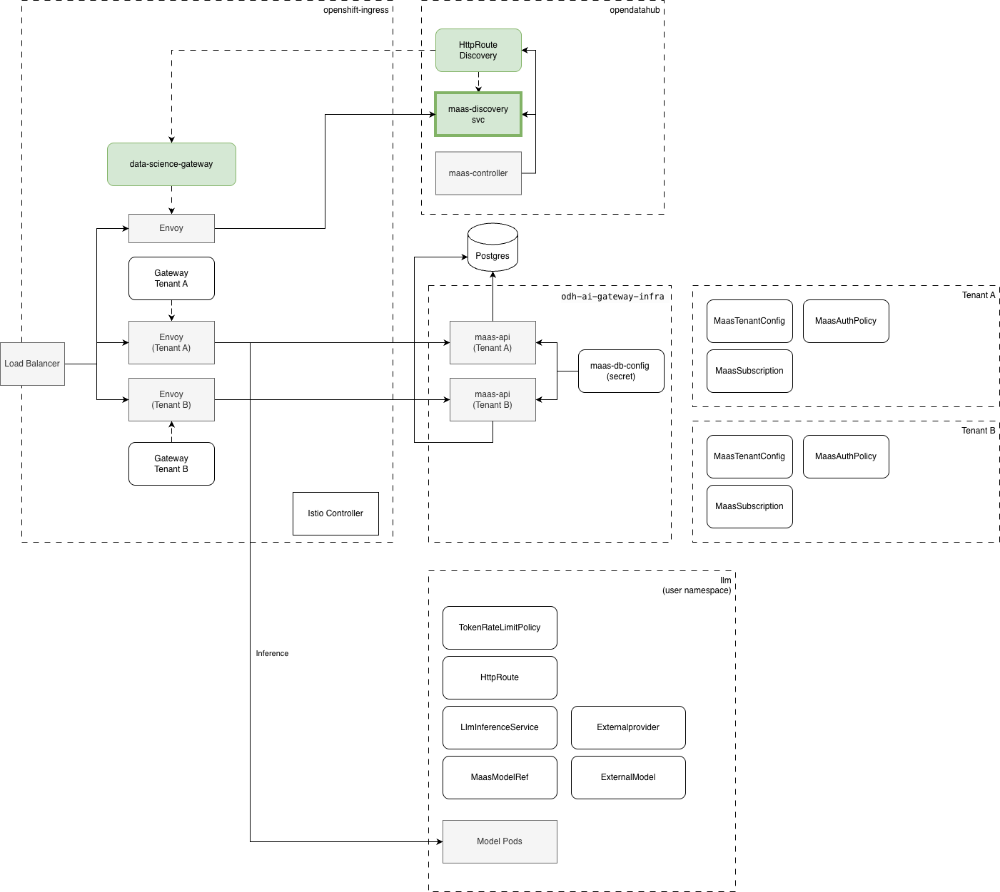

# Open Data Hub - AI Gateway tenants discovery

<!-- copy and paste this template to start authoring your own ADR -->
<!-- for the Status of new ADRs, please use Approved, since it will be approved by the time it is merged -->
<!-- remove this comment block too -->

|                |            |
| -------------- | ---------- |
| Date           | 2026-01-07 |
| Scope          | AI Gateway, Models-as-a-Service (MaaS), Multi-tenancy |
| Status         | Approved |
| Authors        | Marius Danciu
| Supersedes     | N/A |
| Superseded by: | N/A |
| Tickets        | |
| Other docs:    | none |

## What

[REF-1](#ref-1) discusses how multi-tenancy is represented in ODH from a MaaS perspective. However, the discovery process of the available tenants in the system was not part of that ADR; therefore, this document describes it. 


## Why

Applications, UIs, CLIs, etc. need to first know the URL for a particular tenant before making any requests in the scope of that tenant. 

## Goals

* Define the tenants discovery API
* Define the discovery service

## Non-Goals

* API for managing/updating tenant configurations

## How

Before going into other details, as per [REF-1](#ref-1), the maas-api service instances live in the following namespaces:
* `redhat-ai-gateway-infra` - for RHOAI deployments
* `odh-ai-gateway-infra` - for Opendatahub deployments

    We can also consider exposing these namespaces in ODH DSC CR under the ai-gateway component as (example):

    ```
    ai-gateway:
      ...
      models-as-a-service:
        maasApiTenantsNamespace: odh-ai-gateway-infra
    ```


As a reminder, each tenant gets its own Gateway and maas-api instance in order to obtain traffic segregation from other tenants. The same happens at the Envoy level and its `ext-procs`. 

In this context, it is clear that the discovery endpoints cannot exist at the maas-api service level since this is one of the things we want to discover. 

### Note
> For short term approach (3.5) due to time constraints the discovery endpoint will live in the default tenant maas-api service instance. The reasons are:
> - This needs to be available even if kserve is not available.
> - There is not enough time to spin up a new HTTP service to host this endpoint.

Long term, we need a proper discovery HTTP service that exposes the discovery endpoint and potentially, in time, exposes other types of global capabilities that are not scoped per tenant.

### Architecture



This proposal introduces a new HTTP Kube service managed by maas-controller that binds to the default Gateway (data-science-gateway).

- Authn/z - managed via Authorino policy allowing valid OpenShift tokens.
- The discovery service provides a REST API to query the available tenants in the cluster. The tenant information is maintained in an in-memory cache that is marked as "dirty" after a configurable TTL. This allows limiting the number of kube-api server hits while making the discovery endpoint extremely responsive.

### API

GET /v1/tenants

```json
{
  "tenants": [
    {
      "name": "models-as-a-service",
      "namespace": "models-as-a-service" 
      
      "gateway": {
         "name": "maas-default-gateway",
         "namespace": "openshift-ingress",
         "protocol": "https",
         "externalUrl": "https://maas.apps.rosa.qzhq9-eu9g5-5aj.orkd.p3.openshiftapps.com",
         "port": 443,
      }
    }
  ]
}
```
The gateway name and namespace are important for model deployer personas, as this information is needed when creating LlmInferenceService CRs.


## Open Questions

TBD

## Alternatives

##### Tenants cache stored in Postgres

The problem with this approach is that while it greatly reduces the number of hits to the kube-api server, it creates more complexity for the service and potentially adds a risk since there is no longer a single source of truth for the tenancy information, but rather two: kube-api and Postgres, and these need to be kept in sync.

##### maas-controller continuously informs the discovery service of any change in the tenants/gateway state

The problem with this is the increase in complexity. Also, it is not enough for the maas-controller to send an update request to the discovery service because the service may have N replicas at one point in time, and all replicas would need to be informed about the changes. This can be mitigated with the above alternative of using a DB layer, but again, this would increase complexity. 

##### Signal cache refresh via a storage (Postgress, Redis, etc)

In this scenario maas-controller can signal that "something changed' in the AITenant or Gateway by making an internal request to the discovery-service. This request may land in any POD replica and this will record that the state changed in a persistent store. Then, each replica can watch this flag and when detected the cache gets refreshed. This can be more efficient that time based cache refresh as changes in tenants may happen rarely and the discovery service does not really need to hit the kube-api server periodically. However this is more complex to implement than time base cach refresh and may be considered in a later phase.

## Security and Privacy Considerations

None at this point. 

## Risks

N/A

## Stakeholder Impacts

| Group                         | Key Contacts     | Date       | Impacted? |
| ----------------------------- | ---------------- | ---------- | --------- |
| models-as-a-service           | Marius Danciu, Jamie Land | 01/07.2026       | yes |
| dashboards           | Andrew Ballantyne | 01/07.2026       | yes |

## References

#### REF-1 
[AI-Gateway multi tenancy ADR](https://github.com/mariusdanciu/architecture-decision-records/blob/main/architecture-decision-records/model-serving/ODH-ADR-MS-0003-ai-gateway-tenancy.md)


## Reviews

| Reviewed by                   | Date       | Notes |
| ----------------------------- | ---------  | ------|
| name                          | date       | ? |
