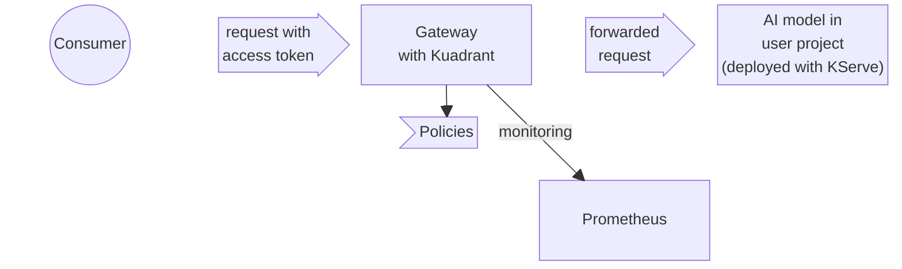

# Open Data Hub - Extension API Server for Model Serving

|                |            |
| -------------- | ---------- |
| Date           | Oct 7, 2025                     |
| Scope          | Open Data Hub / Model Serving   |
| Status         | Draft                           |
| Authors        | [Edgar Hernandez](@israel-hdez) |
| Supersedes     | N/A                             |
| Superseded by: | N/A                             |
| Tickets        |                                 |
| Other docs:    | none                            |

## What

This document proposes a Kubernetes Extension API Server for general _model
serving_ features, initially created to support the new _Model-as-a-Service
(MaaS)_ capabilities in the ODH project.

## Context and Why

### Context

The ODH project already has serving capabilities of AI models. However, these
serving capabilities assume organization in _projects_ (teams), where each
project is isolated from the others. It is possible to have a public endpoint
for a deployed AI model for sharing it, but there is no mechanism that can ensure
fairness usage from consumers.

The first developer preview version of a _Model-as-a-Service_ (MaaS) feature
will extend the existing serving capabilities of ODH project to cover the
following basic and minimal end-user requirements:

* Selective enrollment of AI models deployments to publish/share them as
  services (outside the project/team and, possibly, via a public endpoint).
* Ability for an AI model owner to configure rate limits based on _AI model
  tokens_ (AI-token).
  * Limits are set to tiers, to which users can subscribe.
* Per-user tracking of the utilized AI-tokens, for any given AI model.
* Access to an AI model is granted only if the user has a valid subscription,
  and hasn't depleted theirs AI-token rate limit.

Broadly, the technical implementation for the first iteration is as follows:

* The AI models are deployed via the existing ODH capabilities (KServe project).
  * Only models deployed through llm-d mechanism are subject to MaaS.
* The AI models are going to be (selectively) published using the Gateway API,
  to enable them as a service.
  * Istio (or compatible) is the chosen project implementing Gateway API.
* Kuadrant is chosen to act on the Gateway API layer for policies: auth
  verification and AI-tokens rate limits.
  * Users are OpenShift identities; credentials (access tokens) for auth are
    based on Kubernetes ServiceAccount tokens.
  * Prometheus collects from Kuadrant utilization metrics.

The following diagram depicts the previous:

As part of the implementation, a new support component `maas-api` is introduced
providing RESTful API for the following operations:

* Listing of AI models that are available as a service to a user (model
  discovery).
* Creation of user access tokens (self-service).
* Revocation of access tokens (self-service).
* User-to-tier resolution for supporting Kuadrant policies.

Most of these operations may be considered as _helpers_, since all are backed by
Kubernetes resources. Excluding the _User-to-tier resolution_ operations, users
may directly create the resources to achieve the same outcomes, rather than
using the RESTful API. However, the configurations were complex enough to
deserve a helper API.

### Why an ADR is needed

At the time of writing, the new support component `maas-api` is only partially
secured. It is enough to have a valid login to the cluster (i.e a token) to get
access to it. However, its provided functionality is sensitive enough to require
RBAC security.

## Goals

* Add security to the helper APIs:
  * Follow ODH project's typical pattern of using Kubernetes-based security.
  * Protect the MaaS helper APIs with standard Kubernetes RBAC mechanisms.
* Serve as an implementation reference for other helper APIs that ODH's model
  serving capabilities may require (like
  [RHOAIENG-11853](https://issues.redhat.com/browse/RHOAIENG-11853)).

## Non-Goals

* Modify MaaS functionality (although interfaces may be impacted).

## How

Since adherence to the Kubernetes security model is ideal, it is proposed to
evolve the MaaS RESTful API into a [Kubernetes Extension API
Server](https://kubernetes.io/docs/tasks/extend-kubernetes/setup-extension-api-server/).
For this, the reference implementation
[`sample-apiserver`](https://github.com/kubernetes/sample-apiserver) is going to
be used, making sure that both authentication (delegated to the cluster) and
authorization (using cluster's RBAC) are handled properly.

The functionality currently provided by the `maas-api` is backed by Kubernetes
resources (e.g. creation of `ServiceAccounts` as pivot entities for providing
_access tokens_). This should not be a problem since the Extension API Server
pattern allows for using any database in case of requiring storage, which
includes the possibility to use other Kubernetes resources.

To interact with the Extension API Server, users can use the normal `kubectl`
client and YAML.

The Extension API Server would target _ODH's model serving_ in general.
Initially, it will provide functionalities for _models-as-a-service_. However,
it should be the place to host any other functionality related to _model
serving_, like the proposed one in ticket
[RHOAIENG-11853](https://issues.redhat.com/browse/RHOAIENG-11853).

Examples of APIs that Kubernetes provides which reflect how the Extension API
Server for MaaS may work are the `TokenReview`, the `TokenRequest` and the
`SubjectAccessReview` APIs which don't expose _resources_, but provide a way to
query the cluster for specific data. These Kubernetes APIs should also work to
demonstrate that normal `Roles` and `RoleBindings` (or their cluster-scoped
equivalents) can be used to achieve the needed RBAC security (e.g. The
`system:auth-delegator` ClusterRole can work as an example of the RBAC involved
for the `TokenReview` and `SubjectAccessReview` APIs).

## Open Questions

1. Should the Extension API replace the RESTful `maas-api`?
    - _Potential answer_: Initially, not. This is for compatibility reasons with
      the ODH front-end and the Kuadrant configurations. To prevent
      implementation duplication, the RESTful API should make use of the Extension
      API Server to provide the functionality (forward requests). However,
      unless an OpenAI-compatible API is required, there _may_ be no strong
      reason to keep `maas-api` in the long term.

## Alternatives

* **Using controller-based approach (CRDs).** The _model as a service_
  functionality is conceived more as an architecture (or a pattern) than a
  feature. Flexibility on the configuration can be important to adapt to users
  needs. The [controller pattern](https://kubernetes.io/docs/concepts/architecture/controller/#controller-pattern),
  where a _desired state_ should be achieved, may not provide enough flexibility.
  E.g. users may require a starting configuration that can modify.
* **Continue with the RESTful API.** It can still make sense for simplicity and
  if users are expected to use its capabilities only via the ODH Dashboard, in
  which case security can be achieved with `NetworkPolicies`. However, feedback
  from users show that ODH's _model serving_ capabilities are often used
  headless, which can mean that the helper APIs should be available for
  non-Dashbard cases. In such cases, Kubernetes-based security is more
  appropiate, and evolving the component into an Extension API Server is the
  natural next step, allowing users to continue using standard Kubernetes tools
  like `kubectl`.

### Development-related
* **Develop the Extension API Server with
  [apiserver-builder](https://github.com/kubernetes-sigs/apiserver-builder-alpha).**
  The `apiserver-builder` tool provides a similar experience to `kubebuilder`.
  However, its maintenance seems to have ceased (last commit on April 2022).
  Despite the lack of tooling for scaffolding code, the [`sample-apiserver`
  reference implementation](https://github.com/kubernetes/sample-apiserver) is
  actively maintained making it a better choice.

## Security and Privacy Considerations

This ADR addresses security to prevent unauthorized access to the `maas-api`.

## Risks

No risks have been identified.

## Stakeholder Impacts

| Group                         | Key Contacts     | Date       | Impacted? |
| ----------------------------- | ---------------- | ---------- | --------- |
| Model Serving                 | Jamie Land       | date       | ?         |
| Platform?                     | ?                |            | ?         |
| Dashboard?                    | ?                |            | ?         |

## References

* Linked in place.

## Reviews

| Reviewed by                   | Date       | Notes |
| ----------------------------- | ---------  | ------|
| name                          | date       | ? |
