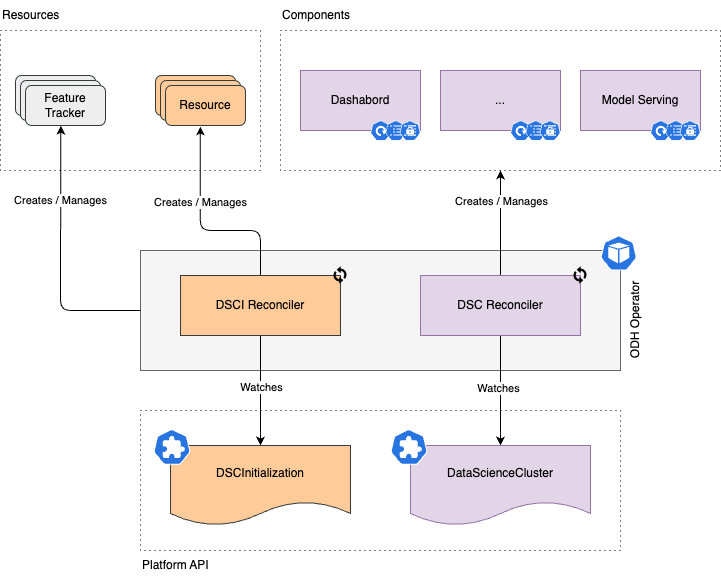

# Open Data Hub - Architecture Decision Record template

<!-- copy and paste this template to start authoring your own ADR -->
<!-- for the Status of new ADRs, please use Approved, since it will be approved by the time it is merged -->
<!-- remove this comment block too -->

|                |            |
| -------------- | ---------- |
| Date           | Sep 13th, 2024 |
| Scope          | Open Data Hub Operator |
| Status         | Approved |
| Authors        | [Luca Burgazzoli](@lburgazzoli), [Vaishnavi Hire](@VaishnaviHire) |
| Supersedes     | N/A |
| Superseded by: | N/A |
| Tickets        | |
| Other docs:    | none |

## What

The Open Data Hub Operator is a meta-operator that manages a number of resources and other operators in the OpenShift cluster leveragin a number of CRDs:
- **DSCInitialization (DSCI)**: a cluster scope user-facing API that the operator creates to perform initial setup common for all components.
- **DataScienceCluster (DSC)**: a cluster scope user-facing API that the ODH Operator watches to enable and configure various data science components.
- **FeatureTracker**: an internal API that represents a cluster-scoped resource in the Data Science Cluster specifically designed for monitoring and managing component related resources created by the operator.

This document outlines design decision to introduce additional, internal only, components specific CRDs.

## Why

The deployment of components is handled by a single reconcile loop that is in charge to deploy all the enabled components within the platform. 
This means that one centralized loop handles the configuration, updates, and error handling for all components.

However, this design introduced following drawbacks:
- **Scalability**: as the ODH Operator evolves and new features or components are added, the single reconcile loop can become a significant bottleneck. The centralized nature of the loop means that any update or change in one component triggers a reconciliation for all components, even those unaffected by the change. This can lead to delays in processing, reduced responsiveness, and a potential decrease in the overall performance of the operator.
- **Granularity**: the single reconcile loop lacks granularity, meaning that any update or error in one component forces the loop to reconcile all components. This can cause unnecessary workload and resource consumption, particularly in large deployments where only a subset of components may need updating. 
- **Error handling and failure isolation**: One of the most significant challenges with this model is error handling and failure isolation. Since all components are managed within the same loop, a failure in one part of the reconciliation process can affect the entire loop, potentially disrupting the deployment or management of other components. 

## Goals

- Improve efficiency and scalability of the ODH Operator. 
- Improve developer productivity and ability to add more features/components/subsystems over time.
- Improve visibility of the state of the platform.
- Reduce resource ustilisation, having a more fine grained reconciliation and impacting only components that have changed, so less resources spent rendering not impacted resources and less call to the API server.

## Non-Goals

* Provide additional, user facing CRDs. 

## How

Move from a monolithic reconciliation loop to a more modular approach that manages components individually by:

- Introducing more granular reconciliation.
- Introducing a set of internal APIs/CRDs. 
  - These CRDs will be used exclusively by the operator for internal management and will not be exposed to end-users and marked as [internal objects](https://docs.openshift.com/container-platform/4.16/operators/operator_sdk/osdk-generating-csvs.html#osdk-hiding-internal-objects_osdk-generating-csvs) so the OCP console hides them in the Operator UIs.
  - Since CRDs are public, the ODH Operator will exclusively own them and it will revert any changes applied outside its control.
- Each internal API/CRD will have its own reconciliation loop, which:
  - Is responsible for managing the lifecycle and state of the associated components.
  - Surfaces any relevant information as part of the component specific status (versions, namespace, routes, service, etc). 
- The DSC reconciler would be in charge:
    - To create/update/delete internal CRs depending on the management state and configuration of the components.
    - To updates status of the DSC based on individual component CR statuses. 

## Alternatives

N/A

## Stakeholder Impacts

| Group              | Key Contacts     | Date       | Impacted? |
| ------------------ | ---------------- | ---------- | --------- |
| ODH Platform Team  | [Luca Burgazzoli](@lburgazzoli), [Vaishnavi Hire](@VaishnaviHire) | 2024/09/13 | YES |

## Reviews

| Reviewed by                   | Date       | Notes |
| ----------------------------- | ---------  | ------|
| name                          | date       | ? |
