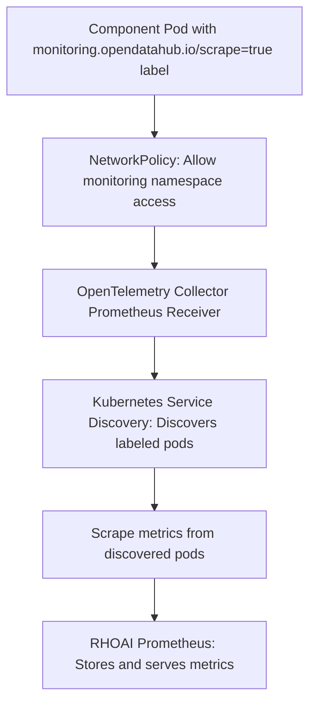

# Open Data Hub - Architecture Decision Record: RHOAI Component Metrics Scraping Guidelines

| **Date** | October 16, 2025 |
|----------|-------------------|
| **Scope** | RHOAI Platform |
| **Status** | Proposed |
| **Authors** | [Dayakar Maruboena](@dayakar349) |
| **Supersedes** | N/A |
| **Superseded by** | N/A |
| **Tickets** | RHOAIENG-25580 |
| **Other docs** | none |

## What

This ADR defines the current and recommended strategy for RHOAI component metrics scraping using annotation-based pod/service scraping with the OpenTelemetry Collector's Prometheus receiver. It also documents alternative approaches using ServiceMonitor and PodMonitor CRs for future consideration, along with the required NetworkPolicy configurations.

## Why

As Red Hat OpenShift AI (RHOAI) grows in complexity with multiple components running across various namespaces, there is a need for standardized guidelines on how components can expose their metrics for collection by the RHOAI Prometheus instance. Different components have varying deployment patterns, service architectures, and monitoring requirements, necessitating multiple strategies for metrics collection while maintaining security and consistency.

## Goals

- Provide clear guidelines for component developers on metrics integration
- Support multiple deployment patterns (Deployments, StatefulSets, Services)
- Maintain security through controlled NetworkPolicy access  
- Enable automatic metrics discovery through standardized labeling
- Integrate seamlessly with existing OpenTelemetry collector infrastructure
- Support both simple and complex metrics collection scenarios

## Non-Goals

- Replace existing component monitoring implementations immediately
- Support non-Prometheus metrics formats
- Provide metrics storage or visualization (handled by existing Prometheus/Grafana stack)
- Define specific metrics that components should expose
- Handle metrics collection outside of Kubernetes environments

## How

### Current Implementation

RHOAI currently uses **annotation-based scraping** as the primary and recommended strategy for component metrics collection. The OpenTelemetry Collector's Prometheus receiver uses Kubernetes service discovery to automatically discover and scrape pods labeled with `monitoring.opendatahub.io/scrape: "true"`.

### Alternative Strategies for Future Consideration

While the current implementation focuses on annotation-based scraping, this ADR also documents ServiceMonitor and PodMonitor approaches that could be adopted in future iterations if advanced use cases require them:

### Metrics Collection Flow (Current Implementation)



### 1. Annotation-Based Pod/Service Scraping (Default Strategy)

Components can expose metrics by annotating their pods or services with standard Prometheus scraping annotations **plus** the required RHOAI monitoring label:

**Required Labels/Annotations:**
- `monitoring.opendatahub.io/scrape: "true"` - RHOAI monitoring enablement label
- `prometheus.io/scrape: "true"` - Standard Prometheus annotation (optional for backwards compatibility)
- `prometheus.io/port: "<port>"` - Port where metrics are exposed (optional, defaults to 8080)
- `prometheus.io/path: "<path>"` - Metrics endpoint path (optional, defaults to /metrics)

**Automatic Application:** For deployments and statefulsets created by the ODH operator, the `monitoring.opendatahub.io/scrape: "true"` label is applied automatically when the component has metrics enabled.

### 2. ServiceMonitor Custom Resource (Future Strategy)

**IMPORTANT**: While ServiceMonitor CRs can be created with the `monitoring.rhobs/v1` API, they are **not currently consumed** for component metrics scraping. The OpenTelemetry Collector does not use Prometheus Operator or Target Allocator. This strategy is documented for future implementation.

**Current Status**: ServiceMonitor CRs are only used to monitor the collector itself.

**Future Requirement**: Requires enabling OpenTelemetry Target Allocator or integrating with Prometheus Operator.

ServiceMonitor CRs could be used for more advanced service-based metrics collection scenarios:

**Required Labels:**
- `monitoring.opendatahub.io/scrape: "true"` - Must be present on the ServiceMonitor CR

### 3. PodMonitor Custom Resource (Future Strategy)

**IMPORTANT**: PodMonitor CRs are **not currently used** in the RHOAI implementation. The OpenTelemetry Collector does not use Prometheus Operator or Target Allocator. This strategy is documented for future implementation.

**Future Requirement**: Requires enabling OpenTelemetry Target Allocator or integrating with Prometheus Operator.

PodMonitor CRs could be used for direct pod-based metrics collection:

**Required Labels:**
- `monitoring.opendatahub.io/scrape: "true"` - Must be present on the PodMonitor CR

### NetworkPolicy Requirements

All approaches require that the component namespace allows ingress from the RHOAI monitoring namespace (`redhat-ods-monitoring` or `<odh_monitoring_project>`). Components must define appropriate NetworkPolicy resources to permit metrics scraping.

### Strategy Selection Guidelines and Use Cases

#### When to Use Annotation-Based Scraping (Default)

**Best for simple, straightforward metrics collection scenarios:**
- Components with a **single metrics endpoint** on standard port (8080) and path (/metrics)
- **Operator-managed deployments** where the ODH operator can automatically apply labels
- Components that don't require **custom scraping configuration**
- **Quick setup** with minimal configuration overhead

**Limitations of annotation-based approach:**
- Limited to basic scraping configuration
- Cannot handle multiple endpoints with different configurations
- No support for advanced authentication or TLS settings
- Limited relabeling and metric transformation capabilities

#### When to Choose ServiceMonitor CR Over Annotations

**ServiceMonitor provides advanced capabilities that annotations cannot:**

**Multiple Endpoints:** Components exposing metrics on different ports/paths require separate endpoint configurations:
```yaml
# Example: Model serving with separate inference and admin metrics
endpoints:
- port: inference-metrics    # Business metrics on :8080/metrics
  interval: 15s
- port: admin-metrics       # Admin metrics on :9090/admin/metrics  
  interval: 60s
```

**Custom Authentication & TLS:** Enterprise components requiring secure metrics access:
- Bearer token authentication beyond default ServiceAccount tokens  
- Custom TLS configuration with specific certificate validation
- mTLS requirements for sensitive metrics

**Advanced Metric Processing:** Components needing metric transformation:
- Filtering specific metrics via relabeling rules
- Renaming metrics for consistency across the platform
- Adding custom labels based on Kubernetes metadata

**Service-Based Discovery:** Components where metrics should be accessed through Services rather than direct pod access for load balancing or service mesh integration.

#### When to Choose PodMonitor CR Over Annotations

**PodMonitor provides pod-level capabilities that annotations cannot:**

**StatefulSet Scenarios:** When individual pod metrics are critical:
```yaml
# Example: Distributed training where each replica has unique metrics
# Pod my-training-0: worker_rank=0, training_loss=0.23
# Pod my-training-1: worker_rank=1, training_loss=0.19  
```

**Sidecar Pattern Integration:** Components using service mesh or logging sidecars:
- Envoy proxy metrics from Istio sidecars
- Fluentd/Fluent Bit logging metrics
- Security scanning agent metrics

**Dynamic Pod Discovery:** Scenarios where Services might not be stable:
- Job-based workloads with temporary pods
- Auto-scaling deployments where pod IPs change frequently
- Development environments with frequent pod recreation

**Pod-Level Metadata:** When metrics need pod-specific context:
- Including pod name, IP, and node information in metrics
- Tracking per-pod resource utilization
- Debugging scenarios requiring pod-level granularity

## Implementation Examples

### Annotation-Based Scraping Example

```yaml
apiVersion: apps/v1
kind: Deployment
metadata:
  name: my-component
  namespace: redhat-ods-applications
spec:
  template:
    metadata:
      labels:
        monitoring.opendatahub.io/scrape: "true"
      annotations:
        prometheus.io/scrape: "true"
        prometheus.io/port: "8080"
        prometheus.io/path: "/metrics"
    spec:
      containers:
      - name: my-component
        image: my-component:latest
        ports:
        - containerPort: 8080
          name: metrics
```

### ServiceMonitor CR Example

```yaml
apiVersion: monitoring.rhobs/v1
kind: ServiceMonitor
metadata:
  name: my-component-monitor
  namespace: redhat-ods-applications
  labels:
    monitoring.opendatahub.io/scrape: "true"
    component: my-component
spec:
  selector:
    matchLabels:
      app: my-component
  endpoints:
  - port: metrics
    path: /metrics
    interval: 30s
    scrapeTimeout: 10s
  # Example: Multiple endpoints with different configurations
  - port: admin-metrics
    path: /admin/metrics
    interval: 60s
    scrapeTimeout: 15s
    relabelings:
    - sourceLabels: [__name__]
      regex: my_component_admin_(.+)
      targetLabel: __name__
      replacement: admin_${1}
  namespaceSelector:
    matchNames:
    - redhat-ods-applications
```

### PodMonitor CR Example

```yaml
apiVersion: monitoring.rhobs/v1
kind: PodMonitor
metadata:
  name: my-stateful-component-monitor
  namespace: redhat-ods-applications
  labels:
    monitoring.opendatahub.io/scrape: "true"
    component: my-stateful-component
spec:
  selector:
    matchLabels:
      app: my-stateful-component
  podMetricsEndpoints:
  - port: metrics
    path: /metrics
    interval: 30s
    # Add pod-specific metadata to metrics
    relabelings:
    - sourceLabels: [__meta_kubernetes_pod_name]
      targetLabel: pod_name
    - sourceLabels: [__meta_kubernetes_pod_ip]
      targetLabel: pod_ip
  namespaceSelector:
    matchNames:
    - redhat-ods-applications
```

### NetworkPolicy Example

```yaml
apiVersion: networking.k8s.io/v1
kind: NetworkPolicy
metadata:
  name: allow-monitoring-ingress
  namespace: redhat-ods-applications
spec:
  podSelector:
    matchLabels:
      app: my-component
  policyTypes:
  - Ingress
  ingress:
  - from:
    # Required: Allow access from monitoring namespace
    - namespaceSelector:
        matchLabels:
          kubernetes.io/metadata.name: redhat-ods-monitoring
    ports:
    - protocol: TCP
      port: 8080
```

### Key Implementation Notes

- **Label Consistency**: Always include `monitoring.opendatahub.io/scrape: "true"` on the primary resource (Deployment/StatefulSet for annotations, or the Monitor CR itself)
- **Namespace Isolation**: `namespaceSelector` in ServiceMonitor/PodMonitor CRs provides an additional security boundary beyond NetworkPolicy
- **Port Naming**: Use descriptive port names (`metrics`, `admin-metrics`) to improve clarity and maintainability
- **NetworkPolicy Requirements**: Every component must include NetworkPolicy rules allowing ingress from `redhat-ods-monitoring` namespace

## Technical Implementation Details

### OpenTelemetry Collector Integration

The RHOAI monitoring system uses OpenTelemetry Collector with a Prometheus receiver configured for **direct Kubernetes pod-based service discovery**.

**Important Implementation Details:**
- Does NOT use Prometheus Operator's ServiceMonitor/PodMonitor processing
- Does NOT use OpenTelemetry Target Allocator
- Uses OpenTelemetry Collector's built-in Prometheus receiver
- Uses Kubernetes API for pod discovery with label selectors

The collector configuration (see `opentelemetry-collector.tmpl.yaml`) uses:

```yaml
receivers:
  prometheus:
    config:
      scrape_configs:
      - job_name: 'data-science-collector-prometheus'
        kubernetes_sd_configs:
          - role: pod  # Direct pod discovery, not ServiceMonitor-based
        relabel_configs:
          - action: keep
            regex: true
            source_labels: [__meta_kubernetes_pod_label_monitoring_opendatahub_io_scrape]
```

**Why This Matters:**
- Components using ServiceMonitor/PodMonitor CRs will NOT have their metrics scraped in the current implementation
- Only annotation-based pod labeling works today
- ServiceMonitor CRs visible in the codebase are for collector self-monitoring only

This configuration automatically discovers and scrapes pods with the `monitoring.opendatahub.io/scrape: "true"` label using direct Kubernetes service discovery.

### Automatic Label Application

The ODH operator automatically applies the `monitoring.opendatahub.io/scrape: "true"` label to Deployments and StatefulSets when:
1. The component is managed by the ODH operator
2. The component has metrics collection enabled in its configuration
3. The RHOAI monitoring service is active

### Label Format

The monitoring label uses underscores in the Kubernetes label selector format (`monitoring_opendatahub_io_scrape`) internally but dots in the metadata format (`monitoring.opendatahub.io/scrape`).

## Open Questions

N/A

## Alternatives

### Alternative 1: Single Strategy Approach
**Description**: Use only annotation-based scraping for all components.
**Tradeoffs**: Simpler to implement and understand, but lacks flexibility for complex multi-endpoint scenarios and advanced configuration requirements.

### Alternative 2: Direct Prometheus Configuration
**Description**: Manually configure scrape jobs in Prometheus ConfigMap.
**Tradeoffs**: More direct control but lacks scalability, requires manual updates for each component, and doesn't integrate with Kubernetes service discovery patterns.

### Alternative 3: Custom Metrics Collection Service
**Description**: Build a custom metrics aggregation service.  
**Tradeoffs**: Maximum customization but significant development overhead, maintenance burden, and deviation from cloud-native monitoring standards.

## Security and Privacy Considerations

- **NetworkPolicy Enforcement**: All metrics endpoints must be protected by NetworkPolicy rules that explicitly allow access only from the monitoring namespace
- **Authentication**: Components exposing sensitive metrics should implement bearer token authentication using Kubernetes ServiceAccount tokens
- **TLS Configuration**: HTTPS endpoints should use proper TLS configuration with certificate verification
- **Metric Filtering**: Components should avoid exposing sensitive data in metric labels or values
- **Namespace Isolation**: The `monitoring.opendatahub.io/scrape` label controls scrape discovery selection. Access enforcement is handled by NetworkPolicy and RBAC

## Risks

- **Network Policy Misconfiguration**: Incorrectly configured NetworkPolicies could block legitimate metrics collection or allow unauthorized access
- **Label Proliferation**: Over-reliance on labeling without proper governance could lead to inconsistent discovery patterns
- **OpenTelemetry Collector Performance**: High-cardinality metrics from many components could impact collector performance
- **Backward Compatibility**: Existing components may require migration effort to adopt these patterns

## Stakeholder Impacts

| Group                       | Impact                                                      |
| --------------------------- | ----------------------------------------------------------- |
| Component Development Teams | Must implement one of three metrics scraping strategies    |
| Platform Engineering        | Responsible for maintaining monitoring infrastructure       |

## References

- OpenTelemetry Collector Configuration: `internal/controller/services/monitoring/resources/opentelemetry-collector.tmpl.yaml`
- ServiceMonitor Examples: `config/monitoring/base/rhods-servicemonitor.yaml`
- NetworkPolicy Examples: `config/monitoring/networkpolicy/`
- [Prometheus Operator Documentation](https://prometheus-operator.dev/)

## Reviews

| **Reviewed by** | **Date** | **Notes** |
|-----------------|----------|-----------|
