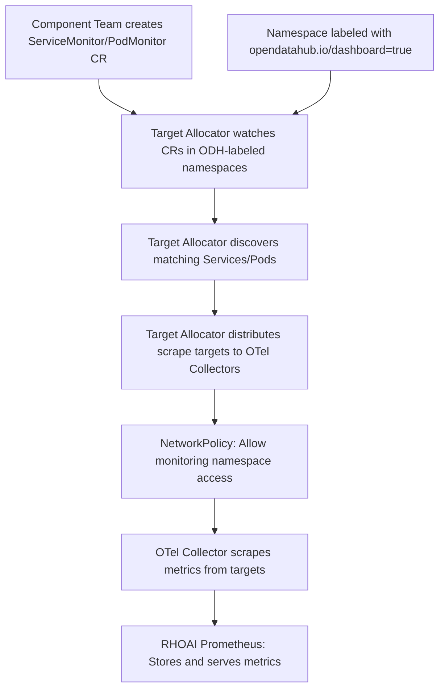

# Open Data Hub - Architecture Decision Record: RHOAI Component Metrics Scraping Guidelines

| **Date** | October 16, 2025 |
|----------|-------------------|
| **Scope** | RHOAI Platform |
| **Status** | Proposed |
| **Authors** | [Dayakar Maruboena](@dayakar349) |
| **Supersedes** | N/A |
| **Superseded by** | N/A |
| **Tickets** | RHOAIENG-25580 |
| **Other docs** | none |

## What

This ADR defines the guidelines for RHOAI component metrics scraping. It documents three supported strategies for exposing component metrics to the RHOAI monitoring infrastructure: annotation-based pod/service scraping, ServiceMonitor CRs, and PodMonitor CRs. The recommended approach uses ServiceMonitor/PodMonitor CRs with the OpenTelemetry Collector's Target Allocator for component team ownership of monitoring configuration.

## Why

As Red Hat OpenShift AI (RHOAI) grows in complexity with multiple components running across various namespaces, there is a need for clear guidelines on how components expose their metrics for collection by the RHOAI monitoring infrastructure. Different components have varying deployment patterns, service architectures, and monitoring requirements, necessitating multiple strategies for metrics collection while maintaining security and consistency.

Enabling component teams to own their monitoring configuration through ServiceMonitor/PodMonitor CRs provides better scalability, maintainability, and deployment flexibility compared to centralized annotation-based approaches.

## Goals

- Provide clear guidelines for component developers on metrics integration
- Support multiple deployment patterns (Deployments, StatefulSets, Services)
- Enable component teams to manage ServiceMonitors/PodMonitors independently
- Implement namespace-based filtering to scope discovery to ODH workloads only
- Maintain security through controlled NetworkPolicy access and namespace isolation
- Support both simple and complex metrics collection scenarios

## Non-Goals

- Support non-Prometheus metrics formats
- Provide metrics storage or visualization (handled by existing Prometheus/Grafana stack)
- Define specific metrics that components should expose
- Handle metrics collection outside of Kubernetes environments
- Support components in non-ODH-labeled namespaces (intentionally scoped)

## How

RHOAI supports three strategies for component metrics scraping, with ServiceMonitor/PodMonitor CRs as the recommended approach for new components.

### Metrics Collection Flow


```mermaid
graph TD
    A[Component Team creates ServiceMonitor/PodMonitor CR] --> B[Target Allocator watches CRs in ODH-labeled namespaces]
    B --> C[Target Allocator discovers matching Services/Pods]
    C --> D[Target Allocator distributes scrape targets to OTel Collectors]
    D --> E[NetworkPolicy: Allow monitoring namespace access]
    E --> F[OTel Collector scrapes metrics from targets]
    F --> G[RHOAI Prometheus: Stores and serves metrics]

    H[Namespace labeled with opendatahub.io/dashboard=true] --> B
```

### 1. Annotation-Based Pod/Service Scraping

Components can expose metrics by annotating their pods or services with standard Prometheus scraping annotations **plus** the required RHOAI monitoring label:

**Required:**
- `monitoring.opendatahub.io/scrape: "true"` - RHOAI monitoring enablement label

**Optional:**
- `prometheus.io/scrape: "true"` - Standard Prometheus annotation (for backwards compatibility)
- `prometheus.io/port: "<port>"` - Port where metrics are exposed (defaults to 8080)
- `prometheus.io/path: "<path>"` - Metrics endpoint path (defaults to /metrics)

**Note**: For simple use cases with basic scraping requirements. ServiceMonitor/PodMonitor CRs are recommended for advanced configurations.

**Automatic Application:** For deployments and statefulsets created by the ODH operator, the `monitoring.opendatahub.io/scrape: "true"` label is applied automatically when the component has metrics enabled.

### 2. ServiceMonitor Custom Resource (Recommended)

ServiceMonitor CRs enable component teams to manage their own monitoring configuration independently. The OpenTelemetry Collector's Target Allocator discovers ServiceMonitors in ODH-labeled namespaces.

**Required Configuration:**
- **Target Namespace Label**: Namespaces containing services to be monitored must be labeled with `opendatahub.io/dashboard: "true"`
- **ServiceMonitor Labels**: No specific labels required on the ServiceMonitor CR itself (Target Allocator uses empty selector)
- **NetworkPolicy**: Target namespace must allow ingress from `redhat-ods-monitoring`

**Target Allocator Configuration:**
```yaml
prometheusCR:
  enabled: true
  serviceMonitorSelector: {}  # Empty selector matches all ServiceMonitors cluster-wide
  # Component teams control which namespaces to scrape by configuring
  # spec.namespaceSelector in their ServiceMonitor CRs
```

**Component Team Responsibilities:**
- Create and maintain ServiceMonitor CRs in their namespace
- Ensure target namespaces (containing services to monitor) have the `opendatahub.io/dashboard: "true"` label
- Configure `namespaceSelector` in ServiceMonitor to match labeled namespaces
- Configure NetworkPolicy for metrics access
- Test metrics scraping in their deployment pipeline

### 3. PodMonitor Custom Resource (Recommended)

PodMonitor CRs enable direct pod-based metrics collection, ideal for StatefulSets and scenarios requiring pod-level granularity. The OpenTelemetry Collector's Target Allocator discovers PodMonitors in ODH-labeled namespaces.

**Required Configuration:**
- **Target Namespace Label**: Namespaces containing pods to be monitored must be labeled with `opendatahub.io/dashboard: "true"`
- **PodMonitor Labels**: No specific labels required on the PodMonitor CR itself (Target Allocator uses empty selector)
- **NetworkPolicy**: Target namespace must allow ingress from `redhat-ods-monitoring`

**Target Allocator Configuration:**
```yaml
prometheusCR:
  enabled: true
  podMonitorSelector: {}  # Empty selector matches all PodMonitors cluster-wide
  # Component teams control which namespaces to scrape by configuring
  # spec.namespaceSelector in their PodMonitor CRs
```

**Component Team Responsibilities:**
- Create and maintain PodMonitor CRs in their namespace
- Ensure target namespaces (containing pods to monitor) have the `opendatahub.io/dashboard: "true"` label
- Configure `namespaceSelector` in PodMonitor to match labeled namespaces
- Configure NetworkPolicy for metrics access
- Test metrics scraping in their deployment pipeline

### Namespace Labeling Strategy

**Critical Requirement**: For ServiceMonitor/PodMonitor to scrape metrics from target pods/services, the target namespaces MUST be labeled with the ODH identifier.

**Required Namespace Label:**
```yaml
opendatahub.io/dashboard: "true"
```

**Labeling Responsibility:**
- **ODH-Managed Namespaces**: Automatically labeled by the ODH operator when creating namespaces
- **Manually Created Namespaces**: Component teams must apply the label explicitly

**Verification:**
```bash
# Check if namespace has the required label
kubectl get namespace <namespace-name> --show-labels

# Add label to existing namespace
kubectl label namespace <namespace-name> opendatahub.io/dashboard=true
```

**Impact of Missing Label:**
- Pods/Services in unlabeled namespaces will NOT be scraped for metrics (even if ServiceMonitors/PodMonitors exist)
- Metrics from those namespaces will not be collected
- No error will be reported (silent failure)

**Security Benefit:**
Namespace-based filtering ensures that only ODH-related workloads are monitored, preventing accidental scraping of non-ODH components and reducing security exposure.

### NetworkPolicy Requirements

All approaches require that the component namespace allows ingress from the RHOAI monitoring namespace (`redhat-ods-monitoring`). Components must define appropriate NetworkPolicy resources to permit metrics scraping.

**Note**: The monitoring namespace name is typically `redhat-ods-monitoring`. If deploying in a custom environment, verify the actual monitoring namespace name by checking your RHOAI deployment configuration.

### Strategy Selection Guidelines and Use Cases

#### When to Use Annotation-Based Scraping (Default)

**Best for simple, straightforward metrics collection scenarios:**
- Components with a **single metrics endpoint** on standard port (8080) and path (/metrics)
- **Operator-managed deployments** where the ODH operator can automatically apply labels
- Components that don't require **custom scraping configuration**
- **Quick setup** with minimal configuration overhead

**Limitations of annotation-based approach:**
- Limited to basic scraping configuration
- Cannot handle multiple endpoints with different configurations
- No support for advanced authentication or TLS settings
- Limited relabeling and metric transformation capabilities

#### When to Choose ServiceMonitor CR Over Annotations

**ServiceMonitor provides advanced capabilities that annotations cannot:**

**Multiple Endpoints:** Components exposing metrics on different ports/paths require separate endpoint configurations:
```yaml
# Example: Model serving with separate inference and admin metrics
endpoints:
- port: inference-metrics    # Business metrics on :8080/metrics
  interval: 15s
- port: admin-metrics       # Admin metrics on :9090/admin/metrics  
  interval: 60s
```

**Custom Authentication & TLS:** Enterprise components requiring secure metrics access:
- Bearer token authentication beyond default ServiceAccount tokens  
- Custom TLS configuration with specific certificate validation
- mTLS requirements for sensitive metrics

**Advanced Metric Processing:** Components needing metric transformation:
- Filtering specific metrics via relabeling rules
- Renaming metrics for consistency across the platform
- Adding custom labels based on Kubernetes metadata

**Service-Based Discovery:** Components where metrics should be accessed through Services rather than direct pod access for load balancing or service mesh integration.

#### When to Choose PodMonitor CR Over Annotations

**PodMonitor provides pod-level capabilities that annotations cannot:**

**StatefulSet Scenarios:** When individual pod metrics are critical:
```yaml
# Example: Distributed training where each replica has unique metrics
# Pod my-training-0: worker_rank=0, training_loss=0.23
# Pod my-training-1: worker_rank=1, training_loss=0.19  
```

**Sidecar Pattern Integration:** Components using service mesh or logging sidecars:
- Envoy proxy metrics from Istio sidecars
- Fluentd/Fluent Bit logging metrics
- Security scanning agent metrics

**Dynamic Pod Discovery:** Scenarios where Services might not be stable:
- Job-based workloads with temporary pods
- Auto-scaling deployments where pod IPs change frequently
- Development environments with frequent pod recreation

**Pod-Level Metadata:** When metrics need pod-specific context:
- Including pod name, IP, and node information in metrics
- Tracking per-pod resource utilization
- Debugging scenarios requiring pod-level granularity

## Implementation Examples

### Annotation-Based Scraping Example

```yaml
apiVersion: apps/v1
kind: Deployment
metadata:
  name: my-component
  namespace: redhat-ods-applications
spec:
  template:
    metadata:
      labels:
        monitoring.opendatahub.io/scrape: "true"
      annotations:
        prometheus.io/scrape: "true"
        prometheus.io/port: "8080"
        prometheus.io/path: "/metrics"
    spec:
      containers:
      - name: my-component
        image: my-component:latest
        ports:
        - containerPort: 8080
          name: metrics
```

### ServiceMonitor CR Example

```yaml
apiVersion: monitoring.coreos.com/v1
kind: ServiceMonitor
metadata:
  name: my-component-monitor
  namespace: redhat-ods-applications
  labels:
    component: my-component
spec:
  selector:
    matchLabels:
      app: my-component
  endpoints:
  - port: metrics
    path: /metrics
    interval: 30s
    scrapeTimeout: 10s
  # Example: Multiple endpoints with different configurations
  - port: admin-metrics
    path: /admin/metrics
    interval: 60s
    scrapeTimeout: 15s
    relabelings:
    - sourceLabels: [__name__]
      regex: my_component_admin_(.+)
      targetLabel: __name__
      replacement: admin_${1}
  namespaceSelector:
    matchLabels:
      opendatahub.io/dashboard: "true"
```

### PodMonitor CR Example

```yaml
apiVersion: monitoring.coreos.com/v1
kind: PodMonitor
metadata:
  name: my-stateful-component-monitor
  namespace: redhat-ods-applications
  labels:
    component: my-stateful-component
spec:
  selector:
    matchLabels:
      app: my-stateful-component
  podMetricsEndpoints:
  - port: metrics
    path: /metrics
    interval: 30s
    # Add pod-specific metadata to metrics
    relabelings:
    - sourceLabels: [__meta_kubernetes_pod_name]
      targetLabel: pod_name
    - sourceLabels: [__meta_kubernetes_pod_ip]
      targetLabel: pod_ip
  namespaceSelector:
    matchLabels:
      opendatahub.io/dashboard: "true"
```

### NetworkPolicy Example

```yaml
apiVersion: networking.k8s.io/v1
kind: NetworkPolicy
metadata:
  name: allow-monitoring-ingress
  namespace: redhat-ods-applications
spec:
  podSelector:
    matchLabels:
      app: my-component
  policyTypes:
  - Ingress
  ingress:
  - from:
    # Required: Allow access from monitoring namespace
    - namespaceSelector:
        matchLabels:
          kubernetes.io/metadata.name: redhat-ods-monitoring
    ports:
    - protocol: TCP
      port: 8080
```

### Key Implementation Notes

- **Label Consistency**: For annotation-based scraping, always include `monitoring.opendatahub.io/scrape: "true"` on the Deployment/StatefulSet. For ServiceMonitor/PodMonitor approach, only the namespace label is required.
- **Namespace Isolation**: `namespaceSelector` in ServiceMonitor/PodMonitor CRs provides an additional security boundary beyond NetworkPolicy
- **Port Naming**: Use descriptive port names (`metrics`, `admin-metrics`) to improve clarity and maintainability
- **NetworkPolicy Requirements**: Every component must include NetworkPolicy rules allowing ingress from `redhat-ods-monitoring` namespace

## Technical Implementation Details

### OpenTelemetry Collector Integration with Target Allocator

The RHOAI monitoring system uses OpenTelemetry Collector with **Target Allocator** for Prometheus Custom Resource (ServiceMonitor/PodMonitor) discovery, while also supporting annotation-based pod discovery for simpler use cases.

#### Target Allocator Implementation

The Target Allocator is a component of the OpenTelemetry Operator that discovers Prometheus Custom Resources (ServiceMonitor/PodMonitor) and distributes scrape targets to OpenTelemetry Collector instances.

**Key Implementation Details:**
- Uses Target Allocator to discover ServiceMonitor/PodMonitor CRs cluster-wide
- ServiceMonitors/PodMonitors filter target namespaces using `namespaceSelector.matchLabels: {opendatahub.io/dashboard: "true"}`
- Supports both ServiceMonitor and PodMonitor discovery
- Enables decentralized monitoring configuration management

**OpenTelemetryCollector CR Configuration:**
```yaml
apiVersion: opentelemetry.io/v1beta1
kind: OpenTelemetryCollector
metadata:
  name: odh-monitoring-collector
  namespace: redhat-ods-monitoring
spec:
  mode: statefulset
  targetAllocator:
    enabled: true
    serviceAccount: odh-prometheus-operator  # Requires broad RBAC permissions
    prometheusCR:
      enabled: true
      # Empty selectors match all ServiceMonitors/PodMonitors
      serviceMonitorSelector: {}
      podMonitorSelector: {}
      # Note: Target Allocator discovers ServiceMonitor/PodMonitor CRs across all namespaces.
      # Component teams control namespace filtering by configuring spec.namespaceSelector
      # in their ServiceMonitor/PodMonitor CRs to match opendatahub.io/dashboard: "true"
  config:
    receivers:
      prometheus:
        config:
          scrape_configs:
          - job_name: 'serviceMonitor'  # Managed by Target Allocator
          - job_name: 'podMonitor'      # Managed by Target Allocator
```

**Target Allocator Capabilities:**
- **CR Discovery**: Automatically discovers ServiceMonitor and PodMonitor CRs cluster-wide
- **Target Filtering**: Each ServiceMonitor/PodMonitor specifies which namespaces to scrape using `namespaceSelector`
- **Target Distribution**: Distributes scrape targets across multiple collector instances (for scaling)
- **Dynamic Updates**: Watches for CR changes and updates scrape configs in real-time

**RBAC Requirements:**
The Target Allocator requires elevated permissions to watch ServiceMonitor/PodMonitor CRs and discover endpoints across namespaces:
```yaml
apiVersion: v1
kind: ServiceAccount
metadata:
  name: odh-prometheus-operator
  namespace: redhat-ods-monitoring
---
# ClusterRole with permissions to:
# - List/watch ServiceMonitor and PodMonitor CRs
# - List/watch Services, Endpoints, and Pods
# - Access namespace metadata for filtering
```

### Automatic Label Application

The ODH operator automatically applies the `monitoring.opendatahub.io/scrape: "true"` label to Deployments and StatefulSets when:
1. The component is managed by the ODH operator
2. The component has metrics collection enabled in its configuration
3. The RHOAI monitoring service is active

### Label Format

The monitoring label uses underscores in the Kubernetes label selector format (`monitoring_opendatahub_io_scrape`) internally but dots in the metadata format (`monitoring.opendatahub.io/scrape`).

## Open Questions

N/A

## Alternatives

N/A

## Security and Privacy Considerations

- **NetworkPolicy Enforcement**: All metrics endpoints must be protected by NetworkPolicy rules that explicitly allow access only from the monitoring namespace
- **Authentication**: Components exposing sensitive metrics should implement bearer token authentication using Kubernetes ServiceAccount tokens
- **TLS Configuration**: HTTPS endpoints should use proper TLS configuration with certificate verification
- **Metric Filtering**: Components should avoid exposing sensitive data in metric labels or values
- **Namespace Isolation**: The `monitoring.opendatahub.io/scrape` label controls scrape discovery selection. Access enforcement is handled by NetworkPolicy and RBAC

## Risks

- **Target Allocator Performance**: High number of ServiceMonitor/PodMonitor CRs across many namespaces may impact Target Allocator resource usage and discovery latency
- **RBAC Permission Scope**: Target Allocator requires broad cluster permissions to watch CRs and discover endpoints across namespaces
- **Namespace Label Dependency**: Missing or incorrect `opendatahub.io/dashboard: "true"` labels cause silent failures where metrics are not discovered
- **Network Policy Misconfiguration**: Incorrectly configured NetworkPolicies could block legitimate metrics collection or allow unauthorized access
- **Component Team Learning Curve**: Teams need to understand ServiceMonitor/PodMonitor CR semantics and Prometheus configuration
- **OpenTelemetry Collector Performance**: High-cardinality metrics from many components could impact collector performance
- **Decentralized Configuration Drift**: Without governance, component teams may create inconsistent or inefficient scraping configurations

## Stakeholder Impacts

| Group                       | Impact                                                      |
| --------------------------- | ----------------------------------------------------------- |
| Component Development Teams | Responsible for creating and maintaining ServiceMonitor/PodMonitor CRs in their namespaces; must ensure namespace labeling and NetworkPolicy configuration |
| Platform Engineering        | Deploys and maintains Target Allocator infrastructure; manages namespace labeling for ODH-managed namespaces; provides templates and documentation |

## References

- [Prometheus Operator Documentation](https://prometheus-operator.dev/)
- [OpenTelemetry Operator Documentation](https://opentelemetry.io/docs/kubernetes/operator/)
- [ServiceMonitor API Reference](https://prometheus-operator.dev/docs/operator/api/#monitoring.coreos.com/v1.ServiceMonitor)
- [PodMonitor API Reference](https://prometheus-operator.dev/docs/operator/api/#monitoring.coreos.com/v1.PodMonitor)

## Reviews

| **Reviewed by** | **Date** | **Notes** |
|-----------------|----------|-----------|
