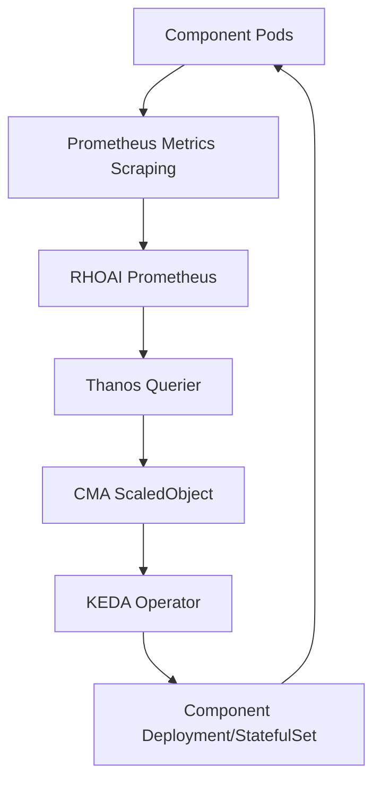

# Open Data Hub - Architecture Decision Record: RHOAI Component Metrics-Based Autoscaling

| Date          | 2025-12-04              |
| ------------- | ----------------------- |
| Scope         | RHOAI Platform          |
| Status        | Draft                   |
| Authors       | [cgoodfred](@cgoodfred) |
| Supersedes    | N/A                     |
| Superseded by | N/A                     |
| Tickets       | RHOAIENG-25599          |
| Other docs    | none                    |

## What

This ADR defines the strategy for enabling custom metrics-based autoscaling for RHOAI components using the Custom Metrics Autoscaler (CMA) operator. It provides component teams with a standardized approach to configure horizontal pod autoscaling based on Prometheus metrics collected from the RHOAI monitoring stack.

## Why

As RHOAI components scale and handle varying workloads, there is a need for dynamic resource allocation based on actual application metrics rather than static resource limits. Traditional Kubernetes HPA (Horizontal Pod Autoscaler) only supports CPU and memory metrics, which may not accurately reflect application load or business requirements. Custom metrics-based autoscaling enables components to scale based on application-specific metrics (e.g., request rates, queue depths, custom business metrics) collected through the RHOAI Prometheus/Thanos infrastructure.

## Goals

- Provide clear guidelines for component teams on implementing metrics-based autoscaling
- Enable autoscaling based on custom Prometheus metrics from the RHOAI monitoring stack
- Integrate with existing RHOAI Prometheus/Thanos infrastructure
- Maintain security through proper RBAC and authentication mechanisms
- Support flexible scaling policies with configurable thresholds and replica limits

## Non-Goals

- Replace Kubernetes native HPA for CPU/memory-based scaling
- Define specific metrics that components should use for autoscaling
- Provide autoscaling configuration for non-Kubernetes workloads
- Handle vertical pod autoscaling (VPA)
- Manage the installation or configuration of the CMA operator itself

## How

### Prerequisites

Before implementing metrics-based autoscaling:

1. **Monitoring Stack**: The component's custom Prometheus metrics are being scraped and available in the RHOAI Prometheus instance
2. **CMA Operator**: The Custom Metrics Autoscaler operator is installed in the cluster (typically in the `openshift-keda` namespace)
3. **Metrics Availability**: The metrics you want to use for autoscaling are queryable through the RHOAI Thanos querier endpoint

### Architecture Overview



### Implementation Steps

#### Step 1: Configure Monitoring Stack

Ensure your component's metrics are being scraped by the RHOAI monitoring stack. The metrics must be available in the RHOAI Prometheus instance and queryable through Thanos.

#### Step 2: Install CMA Operator

The Custom Metrics Autoscaler operator should be installed in the cluster.

#### Step 3: Create Service Account

Create a service account in the namespace where your component is deployed. This service account will be used by the CMA operator to authenticate with Thanos:

```yaml
apiVersion: v1
kind: ServiceAccount
metadata:
  name: cma-service-account
  namespace: {{.Namespace}}
```

#### Step 4: Create RBAC for Token Creation

The CMA operator needs permission to create tokens for the service account. Create a Role and RoleBinding:

```yaml
apiVersion: rbac.authorization.k8s.io/v1
kind: Role
metadata:
  name: keda-operator-token-creator
  namespace: {{.Namespace}}
rules:
- apiGroups:
  - ""
  resources:
  - serviceaccounts/token
  verbs:
  - create
  resourceNames:
  - cma-service-account
---
apiVersion: rbac.authorization.k8s.io/v1
kind: RoleBinding
metadata:
  name: keda-operator-token-creator-binding
  namespace: {{.Namespace}}
roleRef:
  apiGroup: rbac.authorization.k8s.io
  kind: Role
  name: keda-operator-token-creator
subjects:
- kind: ServiceAccount
  name: keda-operator
  namespace: openshift-keda
```

#### Step 5: Create Trigger Authentication

Create a TriggerAuthentication resource that uses the service account token for authenticating with Thanos:

```yaml
apiVersion: keda.sh/v1alpha1
kind: TriggerAuthentication
metadata:
  name: keda-trigger-auth-prometheus
  namespace: {{.Namespace}}
spec:
  boundServiceAccountToken:
    - parameter: bearerToken
      serviceAccountName: cma-service-account
```

#### Step 6: Create RBAC for Metrics Reading

Create a Role and RoleBinding that allows reading metrics from Thanos. This role grants permissions to query the metrics API:

```yaml
apiVersion: rbac.authorization.k8s.io/v1
kind: Role
metadata:
  name: thanos-metrics-reader
  namespace: {{.Namespace}}
rules:
- apiGroups:
  - ""
  resources:
  - pods
  verbs:
  - get
- apiGroups:
  - metrics.k8s.io
  resources:
  - pods
  - nodes
  verbs:
  - get
  - list
  - watch
---
apiVersion: rbac.authorization.k8s.io/v1
kind: RoleBinding
metadata:
  name: thanos-metrics-reader
  namespace: {{.Namespace}}
roleRef:
  apiGroup: rbac.authorization.k8s.io
  kind: Role
  name: thanos-metrics-reader
subjects:
- kind: ServiceAccount
  name: cma-service-account
  namespace: {{.Namespace}}
```

#### Step 7: Create ScaledObject

Create a ScaledObject that defines the autoscaling behavior based on your Prometheus metrics:

```yaml
apiVersion: keda.sh/v1alpha1
kind: ScaledObject
metadata:
  name: {{.ScaledObjectName}}
  namespace: {{.Namespace}}
spec:
  scaleTargetRef:
    name: {{.TargetDeploymentName}}
    kind: Deployment  # or StatefulSet
  minReplicaCount: {{.MinReplicas}}
  maxReplicaCount: {{.MaxReplicas}}
  pollingInterval: {{.PollingInterval}}
  cooldownPeriod: {{.CooldownPeriod}}
  triggers:
  - type: prometheus
    metadata:
      serverAddress: http://thanos-querier-data-science-thanos-querier.redhat-ods-monitoring.svc.cluster.local:10902
      namespace: redhat-ods-monitoring
      metricName: {{.MetricName}}
      threshold: "{{.Threshold}}"
      query: {{.PrometheusQuery}}
      authModes: "bearer"
    authenticationRef:
      name: keda-trigger-auth-prometheus
      kind: TriggerAuthentication
```

### Configuration Parameters

#### ScaledObject Parameters

- **scaleTargetRef.name**: The name of the Deployment or StatefulSet to scale
  - *Example*: `"keda-test-deployment"`
- **scaleTargetRef.kind**: The type of resource (Deployment or StatefulSet)
  - *Example*: `"Deployment"` or `"StatefulSet"`
- **minReplicaCount**: Minimum number of replicas (typically 1, can be 0)
  - *Example*: `1` (ensures at least one pod is always running)
- **maxReplicaCount**: Maximum number of replicas (set based on resource constraints)
  - *Example*: `10` (for moderate scaling needs)
- **pollingInterval**: How often to query metrics (in seconds)
  - *Example*: `30` (30 seconds)
- **cooldownPeriod**: Time to wait before scaling down after a scale-up event (in seconds)
  - *Example*: `300` (5 minutes - prevents rapid scale-down after temporary spikes)

#### Prometheus Trigger Parameters

- **metricName**: A descriptive name for the metric (used in HPA status)
  - *Example*: `"http-request-rate"`
- **threshold**: The target value for the metric (when exceeded, triggers scale-up)
  - *Example*: `"5"` (scale up when request rate exceeds 5 req/s)
- **query**: The Prometheus query expression to evaluate
  - *Example*: `sum(rate(http_requests_total{job="data-science-collector-collector"}[1m]))` (total request rate)
- **authModes**: Authentication mode (use `"bearer"` for service account token authentication)
  - *Example*: `"bearer"` (standard for service account token-based auth)

### InferenceService Example

InferenceService has built-in support for autoscaling utilizing different autoscaling classes, below is an example using the keda class to autoscale based on prometheus metrics collected by the RHOAI monitoring stack.

```yaml
apiVersion: serving.kserve.io/v1beta1
kind: InferenceService
metadata:
  name: granite
  namespace: keda-demo
  annotations:
    openshift.io/display-name: granite
    serving.knative.openshift.io/enablePassthrough: 'true'
    serving.kserve.io/deploymentMode: RawDeployment
    serving.kserve.io/autoscalerClass: keda
  labels:
    opendatahub.io/dashboard: 'true'
    networking.kserve.io/visibility: exposed
spec:
  predictor:
    minReplicas: 1
    maxReplicas: 2
    autoScaling:
      metrics:
        - type: External
          external:
            authenticationRef:
              authModes: bearer
              authenticationRef: 
                name: inference-prometheus-auth # auto created
            metric:
              backend: "prometheus"
              serverAddress: "http://thanos-querier-data-science-thanos-querier.redhat-ods-monitoring.svc.cluster.local:10902"
              query: |-
                (
                    histogram_quantile(0.95, sum by (le) (rate(
                        vllm:time_to_first_token_seconds_bucket{namespace="keda-demo", job="granite-metrics"}[1m]
                    )))
                    and (
                        histogram_quantile(0.95, sum by (le) (rate(
                            vllm:time_to_first_token_seconds_bucket{namespace="keda-demo", job="granite-metrics"}[1m]
                        )))
                        == histogram_quantile(0.95, sum by (le) (rate(
                            vllm:time_to_first_token_seconds_bucket{namespace="keda-demo", job="granite-metrics"}[1m]
                    )))
                )) or vector(0)
              namespace: 'keda-demo'
            target:
              type: Value
              value: "0.4"
    model:
      modelFormat:
        name: vLLM
      storageUri: hf://ibm-granite/granite-3.2-2b-instruct
      env:
        - name: HOME
          value: /tmp
        - name: HF_HOME
          value: /tmp/hf_home
        - name: VLLM_CACHE_ROOT
          value: '/tmp'
      resources:
        limits:
          cpu: '6'
          memory: 24Gi
          nvidia.com/gpu: '1'
        requests:
          cpu: '1'
          memory: 8Gi
          nvidia.com/gpu: '1'
      runtime: vllm-runtime
    tolerations:
      - effect: NoSchedule
        key: nvidia.com/gpu
        operator: Exists
```

## Open Questions

N/A

## Alternatives

### Alternative 1: Kubernetes Native HPA with Custom Metrics API

**Description**: Use Kubernetes HPA with the metrics API server configured to expose Prometheus metrics.

**Tradeoffs**: More native Kubernetes integration but requires additional setup of the metrics API server and may have limitations in query complexity compared to direct Prometheus queries.

### Alternative 2: Manual Scaling Based on Alerts

**Description**: Use Prometheus alerts to notify operators who manually scale components.

**Tradeoffs**: Full control but requires manual intervention and may not respond quickly enough to load changes.

### Alternative 3: Horizontal Pod Autoscaler with Resource Metrics Only

**Description**: Use standard Kubernetes HPA based on CPU and memory metrics only.

**Tradeoffs**: Simple to implement but may not accurately reflect application load or business requirements.

## Security and Privacy Considerations

- **Service Account Tokens**: The CMA operator uses service account tokens for authentication. Ensure proper RBAC is in place to limit token creation permissions.
- **Network Policies**: Ensure NetworkPolicy rules allow the CMA operator to communicate with Thanos and your component pods.
- **Metric Sensitivity**: Be cautious about exposing sensitive information in metric labels or values that could be queried through autoscaling.
- **Thanos Access**: The service account only needs read access to metrics, not write or administrative access.

## Risks

- **Metric Availability**: If metrics become unavailable or queries fail, autoscaling may not function correctly. Implement proper monitoring of the ScaledObject status.
- **Throttling**: Aggressive scaling policies or frequent metric queries could impact Thanos performance. Use appropriate polling intervals.
- **Resource Exhaustion**: Setting maxReplicaCount too high without proper resource limits could exhaust cluster resources.
- **Stale Metrics**: Prometheus queries may return stale data if metrics are not being scraped frequently enough.
- **Query Performance**: Complex Prometheus queries may be slow or expensive. Optimize queries for performance.

## Stakeholder Impacts

| Group                       | Impact                                                                                      |
| --------------------------- | ------------------------------------------------------------------------------------------- |
| Component Development Teams | Must configure ScaledObject resources and select appropriate metrics for autoscaling        |


## References

- [Red Hat OpenShift CMA Documentation](https://docs.redhat.com/en/documentation/openshift_container_platform/4.18/html/nodes/automatically-scaling-pods-with-the-custom-metrics-autoscaler-operator)
- [Red Hat Blog: Custom Metrics Autoscaler on OpenShift](https://www.redhat.com/en/blog/custom-metrics-autoscaler-on-openshift)
- [KEDA Prometheus Scaler Documentation](https://keda.sh/docs/2.13/scalers/prometheus/)

## Reviews

| **Reviewed by** | **Date** | **Notes** |
|-----------------|----------|-----------|

