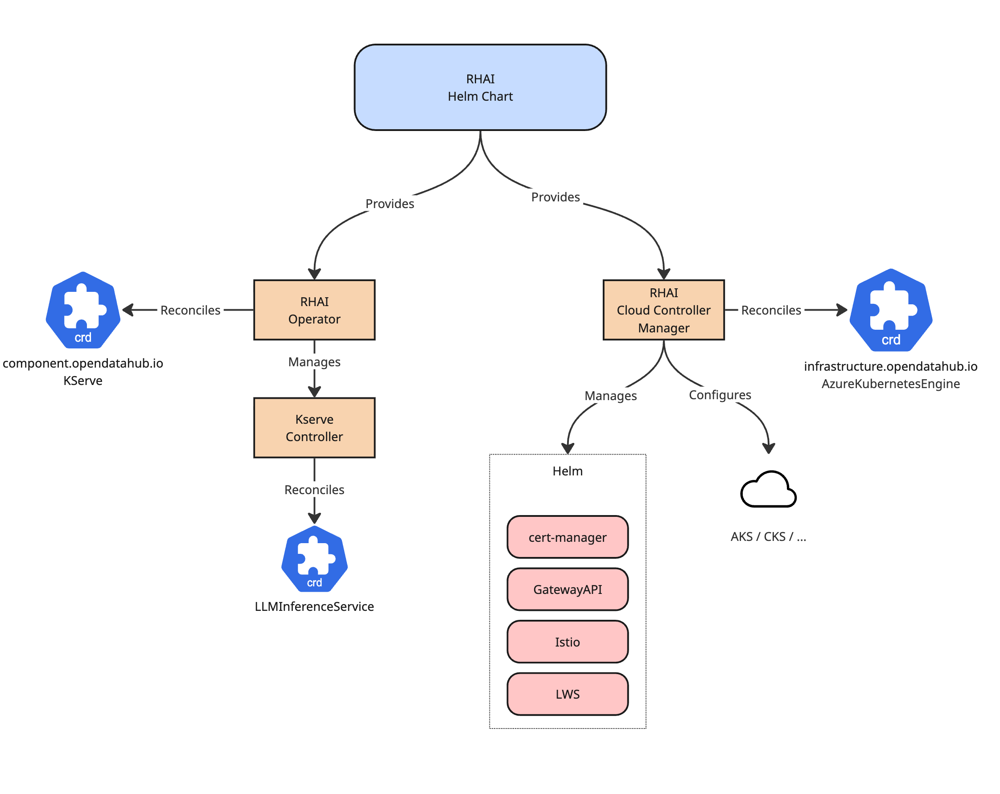

# Extending RHAI to Generic Kubernetes

|                |            |
| -------------- | ---------- |
| Date           | 2026-07-14 |
| Scope          | Operator |
| Status         | Draft |
| Authors        | [Davide Bianchi](@davidebianchi) |
| Supersedes     | N/A |
| Superseded by  | N/A |
| Tickets        | [RHOAIENG-48083](https://redhat.atlassian.net/browse/RHOAIENG-48083) |
| Other docs     | Related: [ODH-ADR-Operator-0014 — Decouple cert-manager Installation](ODH-ADR-Operator-0014-decouple-cert-manager-installation.md) |

## What

Enable a subset of RHAI components to run on generic Kubernetes distributions beyond OpenShift. The initial targets are AKS (Azure Kubernetes Service) and CoreWeave.

## Why

The RHAI Operator is tightly coupled to OpenShift through dependencies on OLM, OpenShift-specific APIs (Routes, ImageStreams), and platform features (internal service CA, ca-injection). This coupling prevents deploying RHAI components on standard Kubernetes distributions such as AKS and CoreWeave.

Decoupling the operator from OpenShift-specific primitives enables a broader reach for the product while establishing the architecture needed to support additional RHAI components on generic Kubernetes in the future.

## Goals

* Enable the RHAI Operator to install and operate on AKS and CoreWeave.
* Deliver validated RHAI components on generic Kubernetes, starting with KServe.
* Provide Helm-based packaging for generic Kubernetes environments.
* Introduce a Cloud Controller Manager (CCM) pattern to abstract environment-specific infrastructure setup.
* Replace reliance on OpenShift service CA with cert-manager for certificate management.
* Move toward GatewayAPI (HTTPRoute) for vendor-neutral traffic routing.
* Promote internal component APIs (e.g., `component.platform.opendatahub.io`) to public APIs, removing the need for DSC/DSCI objects on generic Kubernetes.

## Non-Goals

* Full RHAI suite: enabling the full RHAI component stack on non-OpenShift Kubernetes is not covered; the initial focus is on a validated subset of components.
* Replacing OLM on OpenShift: OLM remains the installation mechanism for OpenShift deployments.
* Deprecating DSC/DSCI on OpenShift: the gradual transition applies to the long-term API evolution, not an immediate removal.

## How

### Standardized Packaging with Helm

On generic Kubernetes environments, Helm becomes the primary packaging and deployment mechanism. This replaces the OLM-based flow (Subscription, channel management, upgrade plans) used on OpenShift. Helm provides a familiar interface for Kubernetes administrators and integrates with standard CI/CD pipelines. Helm charts for dependencies are embedded in the operator container image.

On OpenShift, OLM remains the installation path. The operator codebase supports both flows.

### Cloud Controller Manager (CCM) Pattern

A Cloud Controller Manager pattern is introduced as a dedicated layer for managing environment-specific infrastructure setup. On generic Kubernetes, the CCM replaces the DSCInitialization controller entirely: DSCInitialization and DataScienceCluster objects do not exist on generic Kubernetes platforms. On OpenShift, replacing DSCI is not part of this scope.

Each supported cloud provider has a dedicated CCM controller and CRD (e.g., `AzureKubernetesEngine`, `CoreWeaveKubernetesEngine`).

Responsibilities of the Cloud Controller Manager:

* **Controller deployment**: on generic Kubernetes, the CCM deploys Red Hat-preferred controllers for essential features such as Istio, LeaderWorkerSet (LWS), and cert-manager.
* **Cloud integration**: the CCM configures dependencies to integrate with cloud-specific functionality (e.g., cert-manager certificate issuers, cloud-specific LoadBalancers, or storage classes).
* **Vendor interoperability**: for users who opt out of Red Hat-provided dependencies, the CCM provides a path to integrate with existing vendor infrastructure (unsupported/advanced mode).

### Platform Agnosticism

The operator is re-architected to be independent of OpenShift-specific APIs. Controllers are enabled or disabled manually, allowing administrators to select exactly which components run on their platform.

* **Feature stripping**: the architecture supports stripping out functionalities not needed or not supported on generic Kubernetes (e.g., OpenShift-specific monitoring stacks, DSC/DSCI CRDs).
* **Platform validation**: only components that have been validated for non-OpenShift distributions are made available for activation on generic Kubernetes.

### Networking and Security

* **Certificate management**: cert-manager replaces OpenShift's internal service CA for certificate generation and CA injection. Components are gradually refactored to standardize on cert-manager across all platforms.
* **Traffic routing**: GatewayAPI (HTTPRoute) is adopted as the vendor-neutral networking layer, replacing OpenShift Routes where applicable.

### API Evolution

On generic Kubernetes, neither DataScienceCluster (DSC) nor DSCInitialization (DSCI) exist. Users interact directly with component-level CRDs (e.g., the KServe CR under `component.platform.opendatahub.io`) as the public API surface. The CCM handles infrastructure setup that DSCI would otherwise perform.

On OpenShift, the transition toward component-level APIs is a separate, longer-term effort:

1. **Gradual transition of DSC**: DataScienceCluster is gradually replaced by component APIs. During the transition, dual configuration is supported. If DSC is present, it acts as the primary configuration driver.
2. **DSC as observability layer**: long-term, DSC may be retained as a read-only, opt-in overview of active components and status. This would require a new DSC API version (likely v3).
3. **Replacement of DSCI**: DSCInitialization is gradually replaced by CCM APIs for infrastructure-level setup. If DSCI is present, it serves as the primary configuration source for the services it currently manages.

## Open Questions

* How will telemetry and usage reporting work on generic Kubernetes without OpenShift's built-in mechanisms?

## Security and Privacy Considerations

* **Certificate management**: moving from OpenShift's internal service CA to cert-manager changes the trust model. The cert-manager CA must be properly configured and its root certificate distributed to all components that need to validate TLS connections.
* **Network policies**: Generic Kubernetes environments may not have the same default network isolation as OpenShift. The operator should deploy or document appropriate NetworkPolicy resources.
* **RBAC**: the operator's RBAC requirements may differ on generic Kubernetes due to the absence of OpenShift-specific groups and roles. ClusterRole definitions must be reviewed for least-privilege on vanilla Kubernetes.

## Risks

* **Maintenance burden**: supporting multiple Kubernetes distributions increases the testing matrix and the risk of platform-specific regressions.
* **Feature gaps**: some OpenShift features (e.g., built-in monitoring, oauth-proxy) have no direct equivalent on vanilla Kubernetes. Users on generic Kubernetes may experience a reduced feature set.
* **API transition**: the dual-configuration period (DSC + component APIs) adds complexity to the operator code.

## Stakeholder Impacts

| Group                         | Key Contacts     | Date       | Impacted? |
| ----------------------------- | ---------------- | ---------- | --------- |
| Operator                      |                  | 2026-07-14 | Yes |
| KServe / Model Serving        |                  | 2026-07-14 | Yes |
| Documentation                 |                  | 2026-07-14 | Yes |
| QE                            |                  | 2026-07-14 | Yes |

* **Operator**: directly impacted. The CCM pattern, Helm packaging, platform-agnostic refactoring, and API evolution all live in the operator codebase.
* **KServe / Model Serving**: among the first components delivered on generic Kubernetes. Must validate that KServe works correctly with cert-manager and GatewayAPI instead of OpenShift Routes and service CA.
* **Documentation**: new installation guides, architecture documentation, and support matrices are needed for generic Kubernetes environments.
* **QE**: testing must expand to cover AKS and CoreWeave environments. CI infrastructure for generic Kubernetes clusters is needed.

## References

* [ODH-ADR-Operator-0006: Internal API](ODH-ADR-Operator-0006-internal-api.md)
* [ODH-ADR-Operator-0003: Component Integration](ODH-ADR-Operator-0003-component-integration.md)
* [ODH-ADR-0004: ODH Trusted CA ConfigMap](ODH-ADR-0004-odh-trusted-ca-configmap.md)
* [ODH-ADR-Operator-0012: Gateway API Authentication Architecture](ODH-ADR-Operator-0012-gateway-api-authentication-architecture.md)

## Reviews

| Reviewed by                   | Date       | Notes |
| ----------------------------- | ---------  | ------|
|                               |            |       |
