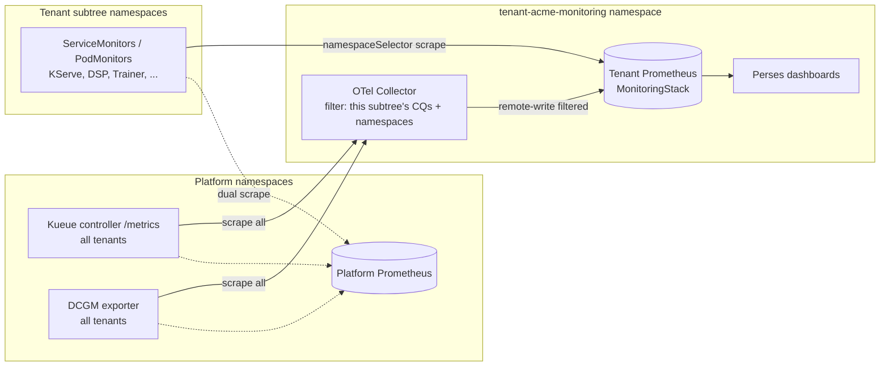
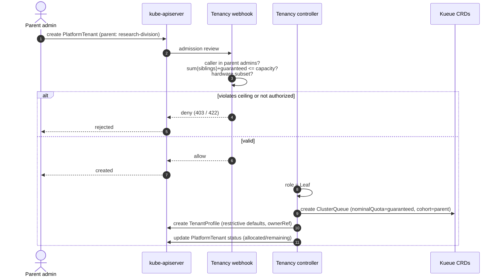
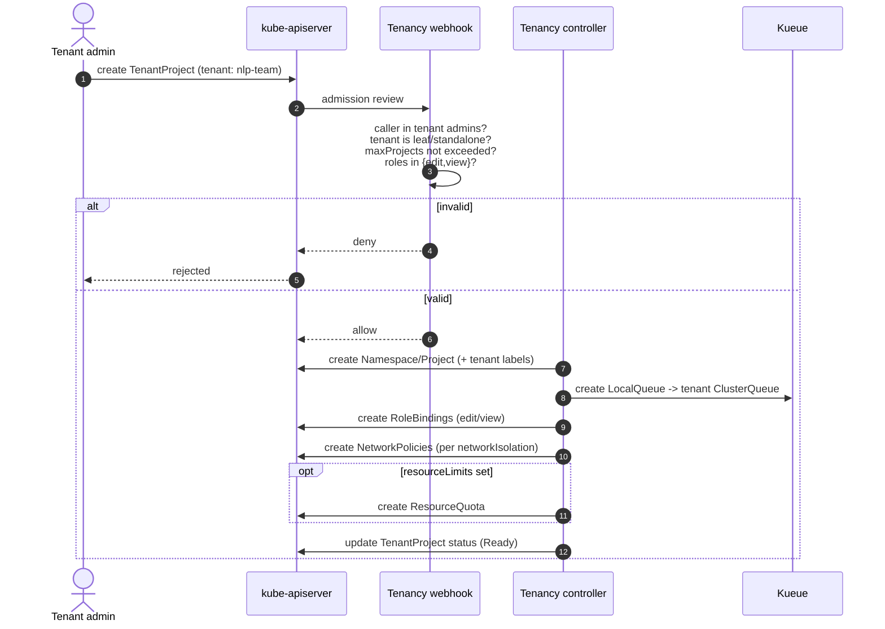
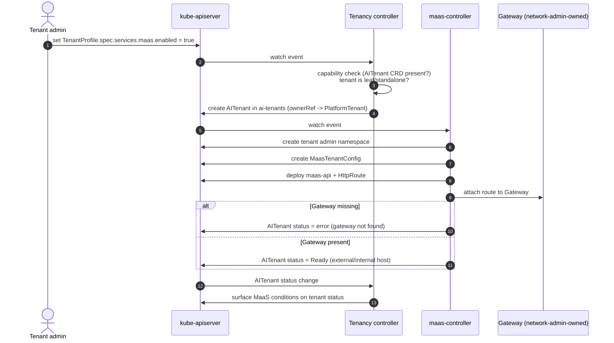
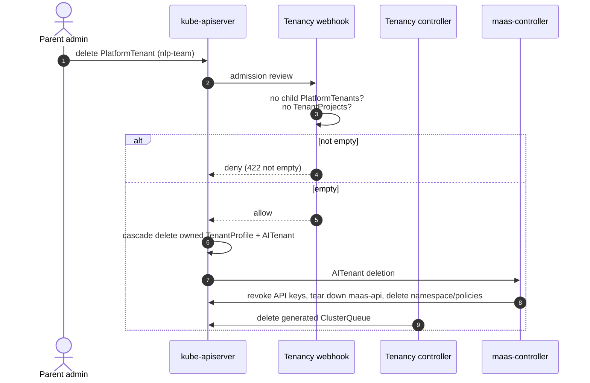
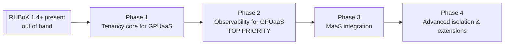

# RHOAI Multi-Tenancy Framework

|                |            |
| -------------- | ---------- |
| Date           | 2026-08-18 |
| Scope          | Operator (RHOAI platform-wide multi-tenancy) |
| Status         | Draft |
| Authors        | [Lindani Phiri](@lphiri) |
| Supersedes     | N/A |
| Superseded by: | N/A |
| Tickets        | [RHAIRFE-2922](https://redhat.atlassian.net/browse/RHAIRFE-2922), [RHAISTRAT-2554](https://redhat.atlassian.net/browse/RHAISTRAT-2554) |
| Other docs:    | operator/multi-tenancy-strategy.md; Tenancy Control Plane design (multitenant-gpuaas: PLAN.md, API-REFERENCE.md, KUEUE-API-REFERENCE.md, ADRs 0001-0033); [RHAIRFE-3115](https://redhat.atlassian.net/browse/RHAIRFE-3115) |

## What

RHOAI will introduce a top-level multi-tenancy framework: a first-class tenancy
control plane that represents, manages, and enforces isolation boundaries for
shared GPU/AI clusters. The framework is delivered as a controller plus
validating webhook under a new API group `tenancy.opendatahub.io/v1alpha1`, and
is built around three cluster-scoped custom resources:

* **`PlatformTenant`** — the allocation resource. Parent-controlled. Defines
  resource budget, hardware scope, and position in the tenant hierarchy.
* **`TenantProfile`** — the configuration resource. Self-managed by tenant
  admins. Holds admins, isolation policy, sharing preferences, defaults, and
  observability.
* **`TenantProject`** — the namespace provisioning resource. Maps 1:1 to a
  Namespace (or OpenShift Project) plus a Kueue LocalQueue, with RBAC and
  NetworkPolicies.

Rather than inventing a bespoke quota engine, the framework maps the tenant
hierarchy onto Kueue: parent tenants become Kueue Cohorts, leaf tenants become
ClusterQueues, and projects become LocalQueues. Quota, borrowing, and
preemption are enforced by Kueue at runtime; the control plane enforces the
administrative allocation budget (capacity) through the webhook. Red Hat Build of
Kueue (RHBoK) is a required dependency, provisioned out of band (not through OLM
dependency resolution) and assumed present before the framework reconciles. The
remaining capabilities activate by CRD detection (DRA, OpenShift, COO, OTel,
Perses), so the control plane degrades gracefully for those and can run on
vanilla Kubernetes as well as OpenShift.

## Why

Today, onboarding a team onto a shared RHOAI cluster means manually stitching
together namespace creation, RBAC role bindings, resource quotas, Kueue
ClusterQueues, network policies, and storage/ingress configuration. This is
slow, error-prone, and inconsistent across tenants. The operational burden
grows linearly with each new team, and the risk of security misconfiguration
grows with it. Prior analysis of the GPUaaS backlog found six different working
definitions of "multi-tenancy" and four competing primitives each claiming to
be "the tenant." Without a single, first-class tenant abstraction, every large
deployment reinvents tenancy from raw primitives.

Enterprise and sovereign-AI customers deploying RHOAI for multiple teams are
already raising escalations about RBAC drift, inconsistent quota enforcement,
and the difficulty of proving consistent isolation during compliance audits.

The driving forces are best framed by the multi-tenancy strategy
(`operator/multi-tenancy-strategy.md`), whose statement is to *build a multi-tenancy framework
that makes shared Kubernetes simple to consume, safe to operate, and
economically transparent*. That strategy treats multi-tenancy as a customer
operating model, not merely a security architecture. Its pillars map directly to
what this framework delivers:

* **Tenant lifecycle:** declarative create/update/decommission through three CRs
  instead of tickets and runbooks.
* **Isolation and governance:** the secure path is the default path;
  auto-created `TenantProfile` starts maximally restrictive (hard isolation,
  strict network, no projects) until an admin opens it up.
* **Self-service management:** delegated RBAC lets a tenant admin subdivide
  their own allocation and provision projects without platform-admin
  involvement.
* **Resource fairness:** Kueue Cohorts/ClusterQueues express the shared-resource
  contract; isolation presets (hard/guaranteed/balanced/burst) tune
  borrowing, lending, and preemption.
* **Cost attribution:** always-on metric labeling plus optional per-tenant
  dashboards and dedicated monitoring provide the consumption substrate for
  showback and chargeback.

Without a structured tenant model, RHOAI cannot serve as a shared platform at
enterprise scale and loses ground to AI platforms that ship multi-tenant
governance out of the box.

## Goals

* Provide a single, first-class tenant abstraction over Kubernetes namespaces
  and Kueue quota, replacing ad-hoc assembly from raw primitives.
* Split allocation (parent-controlled) from configuration (self-managed) into
  `PlatformTenant` and `TenantProfile` so RBAC can be scoped per resource and a
  tenant admin cannot escalate their own quota.
* Map the hierarchy onto Kueue Cohort trees, delegating runtime quota,
  borrowing, and preemption to Kueue rather than a bespoke engine.
* Enforce the delegation invariant: the sum of a parent's children's
  allocations can never exceed the parent's capacity, per resource type.
* Enable delegated self-service: a tenant admin creates sub-tenants and projects
  within their assigned budget without platform-admin intervention.
* Offer named isolation presets for quota sharing (hard/guaranteed/balanced/
  burst) and network isolation (none/tenant/strict), with a raw override escape
  hatch.
* Provide tiered observability: always-on metric labeling, opt-in Perses
  dashboards, and opt-in per-tenant dedicated monitoring for showback/chargeback.
* Activate capabilities by CRD detection so the control plane degrades
  gracefully and runs on both OpenShift and vanilla Kubernetes.
* Preserve full backward compatibility: unmanaged namespaces operate unchanged;
  adoption of existing namespaces and Kueue resources is opt-in.

## Non-Goals

* Multi-cluster tenancy federation. Single-cluster scope; cross-cluster is
  deferred to a future MultiKueue-based design.
* End-user self-service provisioning of arbitrary root tenants. Root
  `PlatformTenant` creation remains a cluster-admin function; self-service is
  limited to delegated subdivision within an assigned budget (this reconciles
  the two source tickets; see Alternatives).
* Billing and chargeback systems and FinOps reporting UIs. This framework
  delivers the consumption/metrics substrate; chargeback tooling is downstream.
* Changes to the MaaS `AITenant` schema, the maas-controller reconciliation
  logic, or the MaaS authorization model and AI Gateway data plane. The
  framework provisions MaaS tenants by creating `AITenant` CRs that
  maas-controller reconciles unchanged (see How: Delegated MaaS tenant
  provisioning); it does not alter MaaS internals.
* Per-tenant filtering of shared cluster-scoped catalogs (HardwareProfile,
  ClusterServingRuntime, WorkspaceKind, etc.) beyond DRA DeviceClass gating.
  A candidate future extension.
* StorageClass access gating (deferred past v1).
* Automated hierarchy re-parenting or role transitions. A tenant's role
  (parent/leaf/standalone) is immutable; reorganizing is done by creating new
  nodes and migrating.
* Shipping Kueue itself. RHBoK is a required dependency the framework consumes,
  provisioned out of band; this ADR does not change how Kueue is packaged,
  shipped, or installed.

## How

### Three custom resources

All three CRs are cluster-scoped. `PlatformTenant` and `TenantProfile` form a
1:1 pair with separate authorization domains; `TenantProject` represents a
namespace inside a tenant.

`PlatformTenant` is named `PlatformTenant` (not `Tenant`) deliberately, to avoid
collision with the MaaS `maas.opendatahub.io Tenant`/`AITenant` CRDs.

A `PlatformTenant` is one of three roles, fixed at creation and immutable:

| Role | Parent? | Children? | Projects? | Generates | Purpose |
|---|---|---|---|---|---|
| Parent (branch) | optional | yes | no | Cohort, TenantProfile | Sharing boundary, capacity budget, hardware scope |
| Leaf | yes | no | yes | ClusterQueue (in parent's Cohort), TenantProfile | Quota holder, workload admission |
| Standalone | no | no | yes | ClusterQueue (no Cohort), TenantProfile | Simple single-tenant, no hierarchy |

`TenantProfile` is auto-created by the controller with maximally restrictive
defaults (empty admins, `hard` isolation, no borrow/lend, `strict` network,
`maxProjects: 0`). The parent admin bootstraps the initial `admins`; from then
on those admins self-manage the profile. `TenantProject` maps 1:1 to a namespace
plus a LocalQueue and generates RBAC, NetworkPolicies, and (optionally) a
ResourceQuota.

### Mapping to Kueue and the capacity model

The hierarchy maps onto Kueue primitives:

* Parent `PlatformTenant` -> Cohort (nested under the parent's Cohort).
* Leaf `PlatformTenant` -> ClusterQueue in the parent's Cohort, with
  `nominalQuota = guaranteed`.
* `TenantProject` -> Namespace + LocalQueue pointing at the tenant's CQ.

**Capacity** is a control-plane concept that does not exist in Kueue: the
maximum total allocation a parent allows its children to divide. It is enforced
at admission by the webhook (`sum(children allocations) <= parent capacity` per
resource type), not by Kueue quota. All generated Cohorts use `nominalQuota = 0`;
sharing happens through CQ-level lending of unused guaranteed quota. This keeps
capacity a clean per-resource-type API concept and avoids Kueue's per-(flavor,
resource) distribution problem.

Delegation is protected by four layers: (1) RBAC grants tenant admins CRUD on
`TenantProfile`/`TenantProject` and create-only on child `PlatformTenant`, but
no access to Kueue CRs; (2) the validating webhook enforces the capacity ceiling
and hardware-subset rules on every create/update; (3) managed Kueue resources
are protected from direct edits; (4) Kueue enforces runtime usage against the
quotas the controller derived from the validated spec.

### Hierarchy depth

Depth is not a fixed 5-level generic tree. It emerges naturally from Kueue
Cohort nesting, and the parent/leaf/standalone role model keeps it manageable:
the common case is a **standalone** tenant (one level) or a **single parent with
leaf children** (two levels). Deeper nesting is available for organizations that
need it, but is never required and is not the default mental model. An
operator-level setting may impose a conservative maximum depth as a safety
guard, but the framework does not promote deep trees. This deliberately avoids
the complexity of the previously proposed "configurable, capped at 5 levels"
model.

### Isolation presets

Named presets configure the generated ClusterQueue (leaf) or Cohort (parent)
borrowing/lending limits and preemption policy, with a raw Kueue override
available on `TenantProfile.spec.overrides`:

* `hard` — fully isolated; no borrowing or lending.
* `guaranteed` — donates unused quota to siblings but never borrows.
* `balanced` — full sharing within the Cohort (Kueue default).
* `burst` — hoards its own quota but can borrow up to a cap for peak demand.

### Network isolation

Per-`TenantProject` `networkIsolation` generates baseline NetworkPolicies:

* `none` — no policies created.
* `tenant` — blocks cross-tenant in-cluster lateral movement; allows external
  egress (S3, registries, cloud APIs) and same-leaf-tenant traffic.
* `strict` — full lockdown; only system namespaces and DNS allowed.

System namespaces are auto-discovered from DSCI, Kueue, Gateway/Istio, and
Kuadrant and labeled for selector-based policies. Component-created
NetworkPolicies layer additively; the controller never deletes policies it does
not own. Cross-namespace `networkGrants` create matching rules on both sides.

### Observability and cost attribution

Observability is the data substrate for the strategy's cost-attribution pillar:
it makes per-tenant consumption visible for showback and chargeback without
shipping the chargeback tooling itself. It is delivered as three progressively
more isolated tiers. Tier 1 is always on; tiers 2 and 3 are opt-in and
**root-tenant-only** (a `PlatformTenant` with no parent). Restricting the higher
tiers to the root prevents a subtenant from hiding its usage behind its own
isolated monitoring, and guarantees the root can always aggregate metrics across
its entire subtree.

| Tier | What | Activation | Data isolation |
|---|---|---|---|
| 1. Metric labeling | Tenant/root-tenant labels on managed namespaces and Kueue resources | Always on | None: shared platform Prometheus, filtered by label |
| 2. Tenant dashboards | Perses dashboards + datasources scoped to the subtree | `observability.dashboards: true` (root) | None: filtered views over platform Prometheus |
| 3. Dedicated monitoring | Per-root MonitoringStack (COO) + OTel Collector routing | `observability.dedicatedMonitoring.enabled: true` (root) | Full: separate Prometheus, physically isolated data |

**Tier 1 - metric labeling (always on).** The `TenantProject` controller labels
every managed namespace with `tenancy.opendatahub.io/tenant: <leaf>` and
`tenancy.opendatahub.io/root-tenant: <root>`. Generated Kueue resources carry the
same tenant labels, and Kueue's own ClusterQueue metrics are already keyed by
`cluster_queue: tenant-<name>`, matching the naming convention. DCGM GPU metrics
carry `pod`, `namespace`, and `container` labels when `DCGM_EXPORTER_KUBERNETES`
is enabled. Together these let anyone filter the existing platform Prometheus by
tenant with no extra configuration and nothing new deployed. On OpenShift, user
workload monitoring (UWM) query isolation already stops tenants from seeing each
other's series in the platform Prometheus.

**Tier 2 - tenant dashboards (opt-in, root-only).** When a root `TenantProfile`
sets `observability.dashboards: true` and the Perses CRDs are present, the
controller generates, scoped to the root's subtree:

* a `PersesDatasource` pointing at the platform Prometheus, scoped to the
  tenant's namespaces and ClusterQueue names; and
* pre-built `PersesDashboard`s for quota utilization, GPU usage, workload counts,
  borrowing/lending activity, and admission latency.

These are filtered views over shared data, not isolation. They surface Kueue CQ
metrics (`kueue_cluster_queue_resource_usage`, `kueue_cluster_queue_nominal_quota`,
`kueue_cluster_queue_weighted_share`, `kueue_admitted_active_workloads`,
`kueue_admission_wait_time_seconds`), Kueue LQ metrics per namespace (when the
`LocalQueueMetrics` gate is on), GPU metrics (`DCGM_FI_DEV_GPU_UTIL`,
`DCGM_FI_DEV_FB_USED`, `DCGM_FI_DEV_POWER_USAGE`), and namespace CPU/memory/quota
series. This gives tenants self-service visibility without the cost of a
dedicated stack.

**Tier 3 - dedicated monitoring (opt-in, root-only).** When a root
`TenantProfile` sets `observability.dedicatedMonitoring.enabled: true` and the COO
and OTel Operator CRDs are present, the controller provisions a dedicated
monitoring namespace `<prefix><root>-monitoring` containing three components:

1. **A COO `MonitoringStack`** - a tenant-dedicated Prometheus whose
   `namespaceSelector` matches `tenancy.opendatahub.io/root-tenant: <root>`, so it
   scrapes every namespace in the subtree. With `resourceSelector: {}` it
   auto-discovers all ServiceMonitors and PodMonitors that RHOAI components
   (KServe, MLflow, Feast, DSP, Trainer, etc.) already create in those
   namespaces. No component changes are required; namespace-label selection is
   the only configuration point. Retention comes from
   `dedicatedMonitoring.retention` (default `15d`).
2. **An OpenTelemetry Collector (filtering relay).** Central metric sources
   (the Kueue controller, the DCGM exporter) run in platform namespaces and emit
   metrics for all tenants from one endpoint, so the tenant's Prometheus cannot
   scrape them directly without seeing other tenants' data. The controller
   deploys an OTel Collector that scrapes those shared endpoints, applies a
   filter processor that keeps only this subtree's ClusterQueue/Cohort names and
   namespaces, and remote-writes the filtered stream into the tenant's
   Prometheus. Filtering happens *before* data reaches the tenant Prometheus, so
   it never receives another tenant's series. The controller generates the filter
   config from the subtree it already knows (CQ names from the hierarchy,
   namespace names from `TenantProject`s) and regenerates it whenever the subtree
   changes (children or projects added or removed). The collector runs in the
   tenant monitoring namespace with controller-managed config; tenant admins
   cannot edit it, and it is the one component granted cross-namespace egress to
   the platform Kueue/DCGM endpoints.
3. **Perses datasources and dashboards** identical to tier 2 but pointed at the
   tenant's dedicated Prometheus: isolated views over isolated data.

The platform Prometheus keeps scraping tenant namespaces in parallel, so
dedicated monitoring is additive, not a replacement. Platform admins retain full
cross-tenant visibility while the tenant gets a physically isolated dataset
suitable for chargeback.

Capability gating applies throughout: tier 2 needs the Perses CRDs and tier 3
needs the COO and OTel Operator CRDs. When a requested tier's CRDs are absent the
controller ignores that tier and raises a warning condition rather than failing
the tenant. The webhook rejects `spec.observability` on non-root
`TenantProfile`s.

Tier 3 metric flow (per-namespace ServiceMonitor/PodMonitor scraping is direct;
shared Kueue/DCGM endpoints are filtered through the OTel Collector):



### Modular capability activation

RHBoK is required, so quota generation is always available. The remaining
capabilities are discovered via CRD existence and degrade when absent: without
OpenShift, the controller creates plain Namespaces instead of Projects; without
DRA, DeviceClass gating is inactive; without COO/OTel/Perses, the corresponding
observability tiers are ignored with a warning condition. RHOAI packaging
enables/disables the whole capability through a `Tenancy` component in the
DataScienceCluster, consistent with the existing per-component pattern.

### Delegated MaaS tenant provisioning

Where a tenant needs Models-as-a-Service, the framework provisions the MaaS
tenant top-down and lets the existing maas-controller do the rest. This realizes
the extension point ODH-ADR-MS-0003 already anticipated: the `AITenant` CR, "for
now managed by the maas-controller," is instead created and owned by "a higher
level platform controller."

* A `TenantProfile.spec.services.maas` block carries the MaaS-facing intent: an
  enable flag, OIDC issuer/client, optional gateway name, TLS, and optional MaaS
  control-plane quotas (maxModels, maxSubscriptions, maxApiKeys). The block is
  honored only on leaf or standalone tenants and only when the MaaS `AITenant`
  CRD is present (capability detection), consistent with the other optional
  service blocks.
* When enabled, the tenancy controller renders an `AITenant` CR in the
  `ai-tenants` registry namespace, named after the `PlatformTenant`, with an
  ownerReference back to it. The platform tenant name becomes the canonical
  tenant identity across both Kueue quota and MaaS (gateway and hostname
  `{tenant}.{domain}`).
* The maas-controller reconciles that `AITenant` exactly as it does an
  admin-created one: it provisions the tenant admin namespace, MaasTenantConfig,
  the dedicated maas-api instance and HttpRoute, and wires the Gateway. It
  remains the sole owner of every MaaS-internal resource. It is the delegated
  provisioner; the tenancy framework owns only the `AITenant` request.
* The tenancy controller watches `AITenant` status and surfaces MaaS
  provisioning conditions on the tenant status, giving one management surface for
  quota, isolation, and MaaS state.
* Lifecycle follows ownership: enabling creates the `AITenant`; disabling it, or
  deleting the tenant, deletes the `AITenant` and triggers maas-controller's
  existing cascade cleanup (api-key revocation, maas-api teardown, namespace and
  policy deletion). The Gateway CR stays network-admin-owned; if it is missing,
  the `AITenant` condition surfaces the error up to the tenant status, preserving
  the MS-0003 coordination constraint.
* Backward compatibility: hand-created `AITenant`s (including the default
  `models-as-a-service` tenant) keep working untouched; the controller manages
  only `AITenant`s it generated. An existing `AITenant` can optionally be adopted
  by binding it to a leaf tenant.

MaaS control-plane quotas (model, subscription, and API-key counts) stay
distinct from Kueue GPU/compute quota: the tenant's Kueue allocation governs what
can actually run, while the MaaS quotas are softer governance counts. The
framework can seed MaaS quota defaults from the tenant's tier but keeps the two
limits independent.

### DeviceClass gating and lifecycle

When DRA is present, a validating webhook on `ResourceClaim` and
`ResourceClaimTemplate` restricts DeviceClass usage to the namespace's tenant
`spec.hardware.deviceClasses` (parent-constrained subset). Deletion is
finalizer-guarded (block until empty). Existing namespaces and Kueue resources
can be adopted opt-in; adoption triggers a hard reconcile, so a migration
checklist must confirm the tenant spec matches existing CQ configuration to
avoid workload eviction.

### Example custom resources

The examples below are illustrative (`v1alpha1`, subject to change). All three
tenancy CRs are cluster-scoped.

**Parent `PlatformTenant`** (a root sharing boundary with a capacity budget and
hardware catalog; parent-controlled):

```yaml
apiVersion: tenancy.opendatahub.io/v1alpha1
kind: PlatformTenant
metadata:
  name: research-division
spec:
  # No spec.parent -> this is a root. Has capacity -> role is Parent.
  capacity:
    resources:
      - type: nvidia.com/gpu
        amount: "64"
  hardware:
    resourceFlavors:
      - name: a100-80gb
    deviceClasses:
      - nvidia-a100
```

**Leaf `PlatformTenant`** (a quota holder under the parent; its `guaranteed`
must fit within the parent's remaining capacity, enforced by the webhook):

```yaml
apiVersion: tenancy.opendatahub.io/v1alpha1
kind: PlatformTenant
metadata:
  name: nlp-team
spec:
  parent: research-division      # immutable; creates the Cohort nesting
  quota:
    resources:
      - name: gpu
        type: nvidia.com/gpu
        guaranteed: "16"
        flavor: a100-80gb
  hardware:
    deviceClasses:
      - nvidia-a100              # must be a subset of the parent's
```

**Standalone `PlatformTenant`** (no parent, no children; the simple one-level
common case):

```yaml
apiVersion: tenancy.opendatahub.io/v1alpha1
kind: PlatformTenant
metadata:
  name: demo-team
spec:
  quota:
    resources:
      - name: gpu
        type: nvidia.com/gpu
        guaranteed: "4"
```

**`TenantProfile`** (auto-created restrictive, then self-managed by the tenant
admins the parent bootstrapped). Root profiles may also set `observability`:

```yaml
apiVersion: tenancy.opendatahub.io/v1alpha1
kind: TenantProfile
metadata:
  name: nlp-team                # 1:1 with the PlatformTenant of the same name
spec:
  admins:
    - kind: Group
      name: nlp-team-leads
  isolation: balanced           # hard | guaranteed | balanced | burst
  fairShareWeight: 2
  defaults:
    networkIsolation: tenant    # none | tenant | strict
    maxProjects: 10
```

**Root `TenantProfile` with observability** (tiers 2 and 3 are valid only on the
root; the webhook rejects `observability` on non-root profiles):

```yaml
apiVersion: tenancy.opendatahub.io/v1alpha1
kind: TenantProfile
metadata:
  name: research-division       # the root PlatformTenant
spec:
  admins:
    - kind: Group
      name: research-admins
  isolation: balanced
  observability:
    dashboards: true            # tier 2: Perses dashboards over platform Prometheus
    dedicatedMonitoring:        # tier 3: isolated MonitoringStack + OTel Collector
      enabled: true
      retention: 30d
```

**`TenantProject`** (created by a tenant admin; maps 1:1 to a namespace +
LocalQueue, and generates RBAC, NetworkPolicies, and an optional ResourceQuota):

```yaml
apiVersion: tenancy.opendatahub.io/v1alpha1
kind: TenantProject
metadata:
  name: sentiment-analysis
spec:
  tenant: nlp-team              # must be a leaf or standalone; immutable
  users:
    - kind: Group
      name: nlp-team
      role: edit                # edit | view only
  networkIsolation: tenant
  resourceLimits:
    nvidia.com/gpu: "8"
  networkGrants:
    - to: nlp-team/shared-data  # <tenant>/<project>; rules created on both sides
      direction: egress
      ports: [8080]
```

**MaaS-enabled `TenantProfile`** (the proposed `spec.services.maas` block that
drives delegated MaaS provisioning; honored on leaf/standalone tenants when the
`AITenant` CRD is present):

```yaml
apiVersion: tenancy.opendatahub.io/v1alpha1
kind: TenantProfile
metadata:
  name: nlp-team
spec:
  admins:
    - kind: Group
      name: nlp-team-leads
  isolation: balanced
  defaults:
    networkIsolation: tenant
    maxProjects: 10
  services:
    maas:
      enabled: true
      oidc:
        issuerUrl: https://sso.example.com/realms/rhoai
        clientId: nlp-team-maas
      gateway:
        name: maas-default-gateway   # network-admin-owned; referenced, not created
      tls:
        certificateRef:
          name: nlp-team-maas-tls
          namespace: ai-tenants
      quotas:                        # MaaS control-plane counts, distinct from Kueue quota
        maxModels: 20
        maxSubscriptions: 100
        maxApiKeys: 50
```

**Generated `AITenant`** (rendered and owned by the tenancy controller; the
maas-controller reconciles it unchanged as the delegated provisioner). This is
not authored by users; it is shown to make the mapping concrete:

```yaml
apiVersion: maas.opendatahub.io/v1alpha1
kind: AITenant
metadata:
  name: nlp-team                # canonical tenant identity, from the PlatformTenant
  namespace: ai-tenants
  ownerReferences:
    - apiVersion: tenancy.opendatahub.io/v1alpha1
      kind: PlatformTenant
      name: nlp-team
      controller: true
      blockOwnerDeletion: true
  labels:
    tenancy.opendatahub.io/tenant: nlp-team
    tenancy.opendatahub.io/managed-by: tenancy-controller
spec:
  oidc:
    issuerUrl: https://sso.example.com/realms/rhoai
    clientId: nlp-team-maas
  gateway:
    name: maas-default-gateway
  tls:
    certificateRef:
      name: nlp-team-maas-tls
      namespace: ai-tenants
  resourceQuotas:
    maxModels: 20
    maxSubscriptions: 100
    maxApiKeys: 50
```

### Sequence diagrams

**Tenant allocation and provisioning.** A parent admin allocates a leaf tenant;
the webhook enforces the capacity ceiling before anything is generated.



**Project creation.** After the parent bootstraps tenant admins into the
`TenantProfile`, a tenant admin self-provisions a namespace.



**Delegated MaaS provisioning.** Enabling `services.maas` makes the tenancy
controller create an owned `AITenant`; the maas-controller does the rest.



**Tenant decommission.** Deleting the `PlatformTenant` cascades through
ownership; the maas-controller runs its existing MaaS cleanup.



## Suggested Execution Plan

This is a large surface, so the framework is delivered incrementally and
sequenced by customer value rather than by architectural layer. The near-term
driver is GPU-as-a-service (GPUaaS): give customers governed GPU quota with
credible consumption visibility. That makes observability the first headline
priority once the thin tenant core exists. Models-as-a-Service (MaaS) builds on
the tenant identity that GPUaaS establishes, so it follows. Deeper isolation and
platform extensions come last.

Every phase ships behind the opt-in `Tenancy` component and preserves backward
compatibility (see Upgrade and Migration Considerations), so each is
independently releasable and reversible.



### Phase 1 - Tenancy core for GPUaaS

* **Goal:** governed GPU quota as a first-class tenant abstraction, replacing
  ad-hoc assembly from raw primitives.
* **Deliverables:** the three `v1alpha1` CRDs; the controller; the fail-closed
  validating webhook; RBAC delegation; the Kueue mapping (Cohort / ClusterQueue /
  LocalQueue) with webhook capacity enforcement; isolation presets; baseline
  network isolation; the opt-in `Tenancy` component toggle; namespace and
  ClusterQueue adoption.
* **Exit criteria:** a cluster-admin allocates a tenant; a tenant admin
  self-provisions a project bound to a Kueue LocalQueue; quota is enforced at
  admission; the 50-tenant / 200-project scale test passes.
* **Depends on:** RHBoK 1.4+ present (out of band).

### Phase 2 - Observability for GPUaaS (top priority)

* **Goal:** make per-tenant GPU consumption visible and attributable. This is the
  substrate that makes GPUaaS sellable: customers must see and trust what they
  consume before they pay for it.
* **Deliverables:** tier 1 metric labeling (always on); tier 2 Perses dashboards;
  tier 3 dedicated `MonitoringStack` plus the OTel filtering relay; a documented
  mapping from tenant/root-tenant labels to showback/chargeback dimensions.
* **Exit criteria:** a platform admin can filter per-tenant GPU utilization and
  quota in the platform Prometheus by label with no extra config; a root tenant
  can opt into dashboards and a physically isolated Prometheus; the OTel filter
  config regenerates automatically when the subtree changes.
* **Depends on:** Phase 1 tenant labels and CQ names; COO / OTel / Perses CRDs
  for tiers 2-3 (capability-gated, degrade with a warning when absent).

### Phase 3 - MaaS integration (delegated provisioning)

* **Goal:** one-step MaaS tenants layered on the GPUaaS tenant identity.
* **Deliverables:** the `TenantProfile.spec.services.maas` block; controller
  rendering of an owner-referenced `AITenant` in `ai-tenants`; status surfacing
  onto the tenant; ownership-driven lifecycle and cascade cleanup; optional
  adoption of existing `AITenant`s.
* **Exit criteria:** enabling `services.maas` on a leaf or standalone tenant
  provisions a working MaaS tenant through the unchanged maas-controller;
  disabling or deleting the tenant cascades cleanup; the default
  `models-as-a-service` tenant is untouched.
* **Depends on:** Phase 1 tenant identity; the MaaS `AITenant` CRD (ODH-ADR-MS-0003);
  Gateway coordinated with the network admin.

### Phase 4 - Advanced isolation and extensions

* **Goal:** harden and broaden once the value path is proven.
* **Deliverables:** DRA DeviceClass gating; deeper-hierarchy support with the
  depth safety guard; raw Kueue override hardening; StorageClass gating; shared
  cluster-scoped catalog filtering; promotion of the API toward `v1beta1`; and a
  multi-cluster (MultiKueue) exploration.
* **Exit criteria:** defined per extension; downstream API review before any
  `v1beta1` promotion.
* **Depends on:** the earlier phases.

The phase ordering also informs the packaging Open Question below: Phases 1-2
can ship as an embedded platform service focused on RHOAI GPUaaS, while the
standalone / vanilla-Kubernetes story can be revisited around Phase 4.

## Open Questions

* **Packaging: embedded platform service vs standalone operator.** The strategy
  positioned the controller as a platform service inside rhods-operator
  (alongside Auth, Gateway, Monitoring); the concrete design ships it as a
  general-purpose operator that also runs on vanilla Kubernetes. Decide whether
  RHOAI embeds it as a platform service or manages it as a distinct operator
  enabled via the `Tenancy` component. This affects the operator lifecycle and
  the vanilla-K8s story.
* **Hierarchy depth safety guard.** Depth is Cohort-driven and role-managed;
  confirm whether an operator-level maximum-depth guard is needed and what a
  sensible conservative default is. The previous "cap at 5" is dropped as too
  complex.
* **MaaS intent placement and scope.** Whether the MaaS provisioning intent
  lives on `TenantProfile.spec.services.maas` (self-managed) or in a separate
  tenancy-owned service-binding CR, and whether enablement is restricted to
  leaf/standalone tenants or can be set on a parent to provision a shared
  gateway across a subtree. Gateway assignment still needs network-admin
  coordination (MS-0003).
* **Scalability targets.** Establish maximums for tenants, projects, and tree
  depth. The design targets a 50+ tenant / 200+ project scale test; larger
  enterprise targets need PM/Engineering input.

## Alternatives

**Flat, admin-managed tenant model (as originally scoped in RHAIRFE-2922).** The
RFE described tenants as individually configured namespaces, with self-service
and cost/chargeback out of scope. Simpler to build, but it does not model
organizational structure, cannot express cascading allocation ceilings, and
leaves the platform-admin bottleneck in place. We adopt the hierarchical model
instead. Reconciling the tickets: the RFE's "no end-user self-service" is
preserved for *root* tenant creation, while the strategy's delegated
*subdivision within a budget* is adopted; the RFE's "no billing/chargeback" is
preserved, while the consumption substrate is adopted as the enabler for later
FinOps.

**Single `TenancyUnit` CRD (as proposed in RHAISTRAT-2554).** One cluster-scoped
CRD with a generic key-value allocation envelope and status-based consumption
rollup. Simpler surface, but it forces one authorization domain over both
parent-controlled allocation and self-managed configuration (a tenant admin
editing the same object that holds their quota is an escalation risk), and it
reimplements quota/consumption logic Kueue already provides. We instead split
into `PlatformTenant` + `TenantProfile` (per-resource RBAC) and delegate quota to
Kueue.

**Bespoke quota and consumption engine.** Build allocation enforcement and
consumption aggregation directly in the controller (the strategy's status-rollup
approach). This duplicates Kueue's Cohort/ClusterQueue quota, borrowing, and
fair-sharing, and duplicates Prometheus for consumption. We map to Kueue for
quota and to platform Prometheus (labeled metrics + optional dedicated
monitoring) for consumption instead.

**Namespace-scoped tenant CRD.** Aligns with per-project RBAC but cannot
represent a cluster-wide org tree spanning namespaces, and complicates rollup
and delegation. Cluster scope matches Kueue ClusterQueue/Cohort and
DataScienceCluster.

**Reuse the MaaS `AITenant` CRD as the hierarchy.** `AITenant` is a
model-serving-specific gateway registry; overloading it couples org structure to
one component's subscription semantics. The two abstractions stay at separate
layers, integrated by delegated provisioning (see How).

**Bottom-up MaaS reference (`AITenant.tenancyUnitRef`).** An earlier draft had
`AITenant` reference a tenancy node so MaaS could read the allocation ceiling.
This needs a MaaS schema change and a conditional watch on the MaaS side, keeps
two separately-created tenant identities that must be kept in sync, and leaves
MaaS onboarding as a separate manual step. We instead provision top-down: the
framework creates the `AITenant` and maas-controller fulfills it, giving one
canonical tenant identity and a single onboarding workflow with no MaaS schema
change. This uses the extension point ODH-ADR-MS-0003 already documented.

**Adopt an external multi-tenancy operator (Capsule, vcluster).** Conflicts with
the platform policy of not auto-installing external operators, adds an unowned
dependency, and does not integrate with RHOAI platform services or Kueue-based
quota. A first-party control plane keeps tenancy aligned with the operator
lifecycle and the DataScienceCluster API.

**Enforce ceilings only through periodic reconciliation (no webhook).** Simpler,
but allows invalid states transiently and defers violation handling to an async
loop. A fail-closed validating webhook rejects violations at admission;
controller re-validation remains a backstop for the eventually-consistent update
race.

## Security and Privacy Considerations

* **Webhook is the authorization gate.** Kubernetes RBAC cannot scope to "only
  the tenants you own," so the `tenancy:tenant-admin` ClusterRole is broad and
  the fail-closed (`failurePolicy: Fail`) validating webhook is the real gate.
  It checks the requesting user against the relevant `TenantProfile.spec.admins`
  on every mutating operation.
* **No self-escalation of quota.** `PlatformTenant` edits require the *parent's*
  admins, not the tenant's own; capacity/guaranteed/hardware are parent-owned.
  `TenantProfile` (isolation, network, observability) is self-managed with
  parent fallback for bootstrap. Child creation is additionally checked via
  SubjectAccessReview against the parent.
* **Delegation invariant.** Four enforcement layers (RBAC, webhook capacity
  check, managed-resource protection, Kueue runtime) prevent a tenant admin from
  granting more resources than the parent allows.
* **Role restriction.** `TenantProject` user roles are limited to `edit`/`view`;
  the webhook rejects `admin`/`cluster-admin`, preventing RBAC-modification
  escalation through the project API.
* **Isolation by default.** Auto-created profiles start fully restrictive.
  Network isolation, DeviceClass gating (DRA), and namespace-scoped RBAC give
  consistent posture; this is namespace-based ("soft") multi-tenancy, so
  customers needing stronger isolation may still require virtual/dedicated
  clusters, as the strategy notes.
* **Relationship to the RHOAI Auth CR.** Platform-level RBAC (Auth service admin
  groups) and project-level RBAC (`TenantProject`) operate at different layers
  and are additive; neither overrides the other.
* **Compliance evidence.** A single management surface reporting per-tenant
  policy and status lets admins demonstrate consistent isolation during audits
  without assembling namespace-by-namespace evidence.
* **Webhook blast radius.** Fail-closed blocks tenancy CRUD during controller
  downtime but does not intercept workload resources, so existing workloads keep
  running. The consumption path reads existing metrics and introduces no new
  user-data collection.

## Upgrade and Migration Considerations

RHOAI is existing, deployed software. This framework must land on live clusters
that already run unmanaged namespaces, hand-created Kueue ClusterQueues, and
hand-created MaaS `AITenant`s without disrupting any of them. The design is
opt-in at every layer, and adoption of existing resources is explicit and
reversible in intent.

### Opt-in by default

* **Component toggle, off by default.** Tenancy ships as a `Tenancy` component in
  the DataScienceCluster, disabled by default. On upgrade, existing clusters see
  no behavioral change until an admin enables it.
* **Enabling is inert until first use.** Enabling the component installs the
  three CRDs, the controller, and the validating webhook, but generates nothing.
  No `PlatformTenant` exists, so no Cohorts, ClusterQueues, namespaces, RBAC, or
  NetworkPolicies are created. The cluster behaves exactly as before.
* **Narrow webhook scope.** The fail-closed webhook intercepts only the three
  tenancy CRs and, when DRA is present, `ResourceClaim`/`ResourceClaimTemplate`.
  It never intercepts Deployments, Pods, InferenceServices, or other workload
  resources, so it cannot block existing workloads even during controller
  downtime.
* **Unmanaged namespaces are invisible.** The controller and DRA gating act only
  on namespaces carrying the `tenancy.opendatahub.io/tenant` label. A namespace
  without that label is never touched, and DRA ResourceClaim validation passes
  through unmanaged namespaces (no label = not gated).
* **No implicit capture of Kueue resources.** Existing ClusterQueues, Cohorts,
  and LocalQueues are left alone unless explicitly adopted. Generated resources
  carry `tenancy.opendatahub.io/managed-by: tenancy-controller`; the controller
  only reconciles and protects resources it owns.

### Onboarding existing namespaces

Adoption is always initiated by the admin, never automatic:

* **Namespace adoption.** Creating a `TenantProject` whose name matches an
  existing namespace adopts it instead of failing: the controller adds tenant
  labels, creates a `default` LocalQueue if absent, and applies the requested
  NetworkPolicies. The `NamespaceReady` condition reports `Adopted`. Workloads
  already running in the namespace keep running.
* **Start permissive, tighten later.** Adopt with `networkIsolation: none` so no
  NetworkPolicies are created and existing connectivity is preserved, then move
  to `tenant` or `strict` once the traffic profile is understood. Because
  tenancy NetworkPolicies are additive and the controller never deletes policies
  it does not own, component-created policies (KServe, DSP, etc.) are unaffected.
* **ClusterQueue adoption.** Setting `tenancy.opendatahub.io/adopt-cluster-queue`
  on a `PlatformTenant` binds an existing CQ. Adoption triggers a hard reconcile
  to the tenant spec, which can evict workloads if the spec differs from the live
  CQ. A migration checklist must confirm the `PlatformTenant`/`TenantProfile`
  spec matches the existing CQ (quota, cohort, borrowing/preemption) before
  adoption, then adjust gradually.
* **MaaS tenant adoption.** Hand-created `AITenant`s (including the default
  `models-as-a-service` tenant) keep working untouched. An existing `AITenant`
  can optionally be brought under management by binding it to a leaf tenant; the
  controller then owns it going forward. Un-adopted `AITenant`s remain
  maas-controller-managed as today.

### Sequencing and rollback

* **Kueue prerequisite.** RHBoK 1.4+ (Cohort v1beta2) is required and provisioned
  out of band (not via OLM dependency resolution), so it must be installed before
  the `Tenancy` component is enabled. If an incompatible or missing Kueue is
  detected at reconcile time, `PlatformTenant`s surface `KueueVersionUnsupported`
  until it is corrected.
* **Disable path.** Disabling the `Tenancy` component stops the controller and
  webhook. Generated resources are not force-deleted on disable, so tenants and
  their workloads continue to run; management simply stops until re-enabled.
  Full teardown is an explicit, ordered delete of `PlatformTenant`s (leaf-first),
  which cascades through ownership.
* **Alpha API.** CRDs ship as `v1alpha1` with explicit alpha guarantees; schema
  may change before v1beta1. Downstream owners review the schema before
  promotion.

## Risks

* **Kueue is a required dependency provisioned out of band.** Quota generation
  requires RHBoK 1.4+ (Cohort v1beta2), and there is no OLM dependency to
  guarantee its presence or version. *Mitigation:* the out-of-band provisioning
  mechanism installs a compatible RHBoK before the `Tenancy` component is
  enabled; a version guard surfaces `KueueVersionUnsupported` if an
  incompatible or missing Kueue is detected at reconcile time.
* **CRD schema lock-in.** The three CRDs are the root dependency for the tenancy
  roadmap. *Mitigation:* v1alpha1 with explicit alpha guarantees; design review
  with downstream owners before v1beta1; per-resource-type quota keyed by Kueue
  resource names to avoid coupling.
* **Adoption hard-reconcile can evict workloads.** Adopting an existing CQ
  overwrites its config to match the spec. *Mitigation:* documented migration
  checklist; adopt with a matching spec, then adjust gradually.
* **Fail-closed webhook blocks operations during downtime.** *Mitigation:*
  leader-elected controller with fast restart; the webhook intercepts only
  tenancy (and, when DRA present, ResourceClaim) resources; controller
  re-validation and hard reconcile as backstops.
* **NetworkPolicy coexistence.** Many components create their own per-namespace
  policies. *Mitigation:* baseline-plus-additive model; the controller never
  edits policies it does not own; `strict` is "strict baseline with
  component-driven exemptions."
* **Dedicated monitoring cost and complexity.** Per-tenant MonitoringStack + OTel
  Collector adds footprint. *Mitigation:* opt-in, root-only; tiers 1 and 2 cover
  most needs without dedicated stacks.
* **Large trees stress the webhook.** Capacity validation reads siblings on
  every create/update. *Mitigation:* label-based O(1) namespace lookup and
  informer-cache reads; monitor webhook p99 once scale targets are set.

## Stakeholder Impacts

| Group                                   | Key Contacts     | Date       | Impacted? |
| --------------------------------------- | ---------------- | ---------- | --------- |
| Platform / rhods-operator               | Platform team    | 2026-08-18 | Yes |
| Distributed Workloads / Kueue (RHBoK)   | DW team          | 2026-08-18 | Yes |
| Observability (COO, OTel, Perses)       | Observability team | 2026-08-18 | Yes |
| Dashboard (odh-dashboard)               | Dashboard team   | 2026-08-18 | Yes |
| Model Serving (kserve, odh-model-controller) | Model Serving team | 2026-08-18 | Yes |
| DataScienceCluster / DSCI API           | Platform team    | 2026-08-18 | Yes |
| Security / Compliance                   | Security team    | 2026-08-18 | Yes |
| Hardware / Accelerators (DRA, DCGM)     | Accelerator team | 2026-08-18 | Yes |
| Models-as-a-Service (MaaS)              | MaaS team        | 2026-08-18 | Yes |
| Data Science Pipelines / MLflow / Feast | Component teams  | 2026-08-18 | Maybe |
| Documentation                           | Docs team        | 2026-08-18 | Yes |
| UX Design                               | UXD team         | 2026-08-18 | Yes |

Notes:

* **Platform / rhods-operator:** Primary owner. Defines the three CRDs, the
  controller, the fail-closed webhook, RBAC delegation, and the `Tenancy`
  component toggle.
* **Distributed Workloads / Kueue:** Hard dependency. The framework generates
  Cohorts, ClusterQueues, and LocalQueues and requires RHBoK 1.4+ (Cohort
  v1beta2).
* **Observability:** COO MonitoringStack, OTel Collector, and Perses are the
  substrate for tenant dashboards and dedicated monitoring.
* **Dashboard:** Hierarchy management UI, self-service subdivision UI, and
  consumption rollup views.
* **Model Serving:** Workloads run in tenant namespaces; awareness of tenancy
  labels and network isolation for InferenceService/LLMInferenceService.
* **DataScienceCluster / DSCI API:** New `Tenancy` component toggle; system
  namespaces auto-discovered from DSCI.
* **Security / Compliance:** Delegation guardrails, isolation posture, and audit
  evidence depend on this framework.
* **Hardware / Accelerators:** DRA DeviceClass gating and DCGM GPU metrics for
  consumption.
* **MaaS:** The framework creates and owns `AITenant` CRs; maas-controller
  reconciles them unchanged as the delegated provisioner (per the MS-0003
  extension point). No `AITenant` schema or maas-controller reconciliation
  changes required.
* **Component teams (DSP, MLflow, Feast, etc.):** Deploy per-namespace
  infrastructure inside tenant projects; must account for its overhead against
  project `resourceLimits` and network isolation.
* **Documentation / UXD:** Admin hierarchy-setup and tenant self-service guides;
  hierarchy and consumption UI design.

## References

* Multi-tenancy strategy: `operator/multi-tenancy-strategy.md`
* Tenancy Control Plane design (multitenant-gpuaas): `PLAN.md`,
  `API-REFERENCE.md`, `KUEUE-API-REFERENCE.md`, and ADRs 0001-0033
* [RHAIRFE-2922](https://redhat.atlassian.net/browse/RHAIRFE-2922) — Tenant
  Management Control Plane for Multi-Team RHOAI Deployments
* [RHAISTRAT-2554](https://redhat.atlassian.net/browse/RHAISTRAT-2554) — Org
  hierarchy and tenant definition as a first-class resource
* [RHAIRFE-3115](https://redhat.atlassian.net/browse/RHAIRFE-3115) — Source RFE
* Related ADRs: ODH-ADR-Operator-0007 (Auth CRD), ODH-ADR-Operator-0012
  (Gateway API authentication), ODH-ADR-MS-0002 (MaaS Tenant CR),
  ODH-ADR-MS-0003 (AI Gateway tenancy / AITenant)
* Red Hat Build of Kueue (RHBoK) 1.4+ / upstream Kueue 0.18+ (Cohort v1beta2)


## Reviews

| Reviewed by                   | Date       | Notes |
| ----------------------------- | ---------  | ------|
|                               |            |       |
