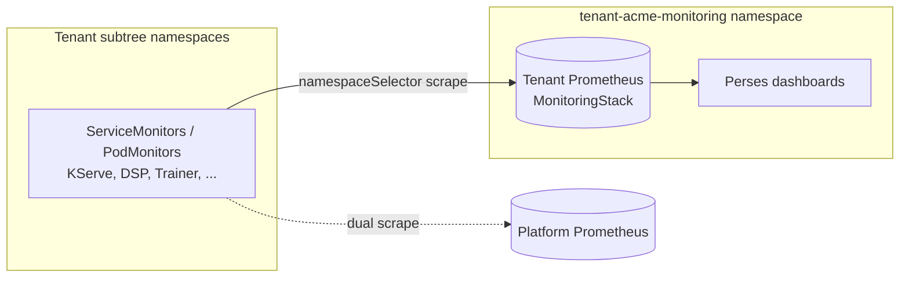
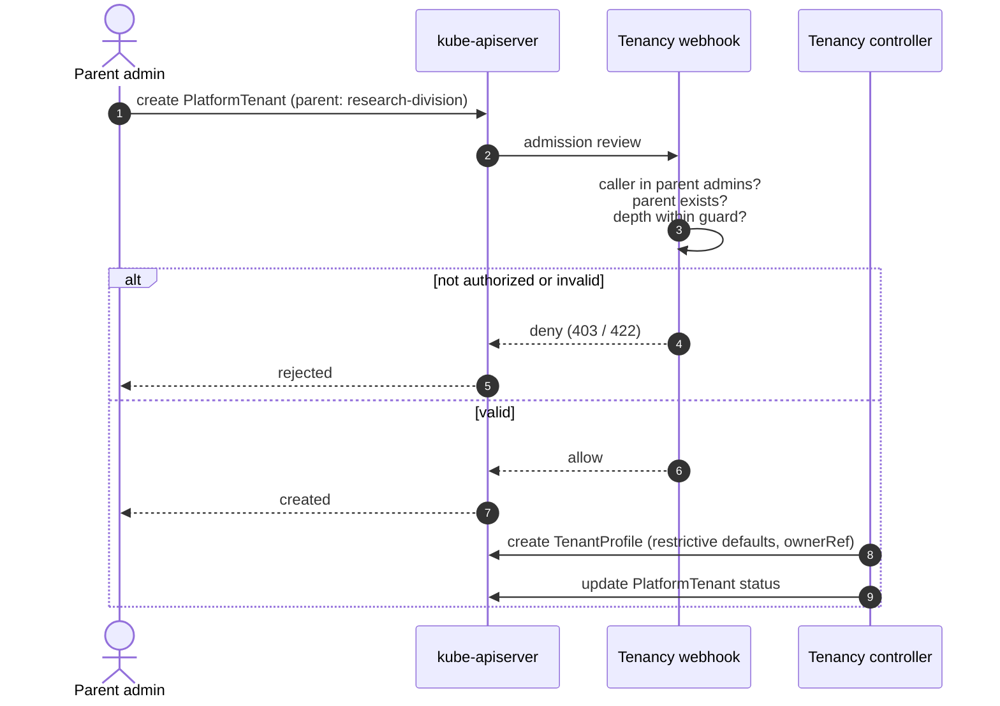
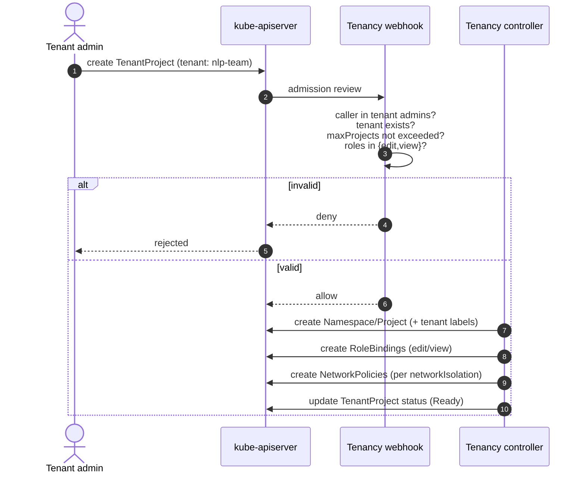
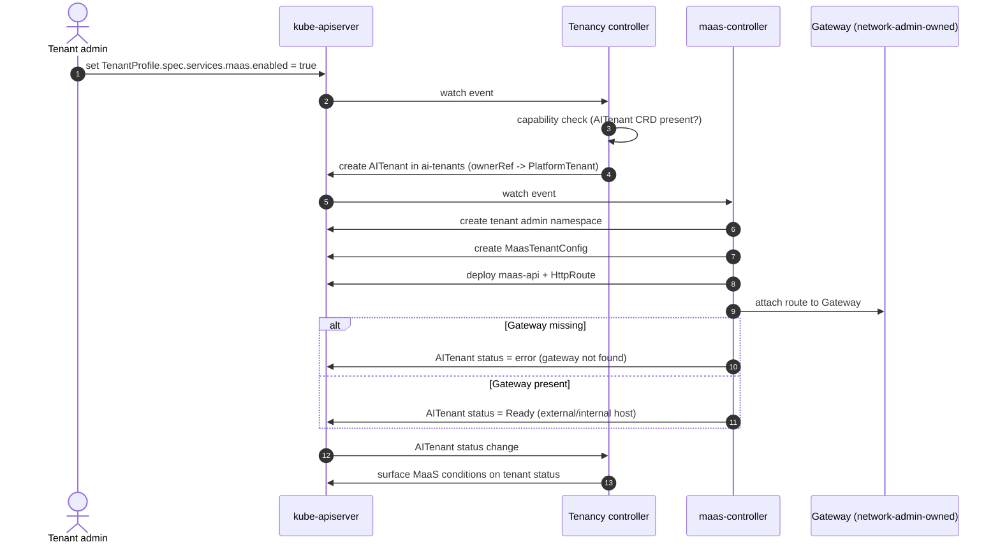
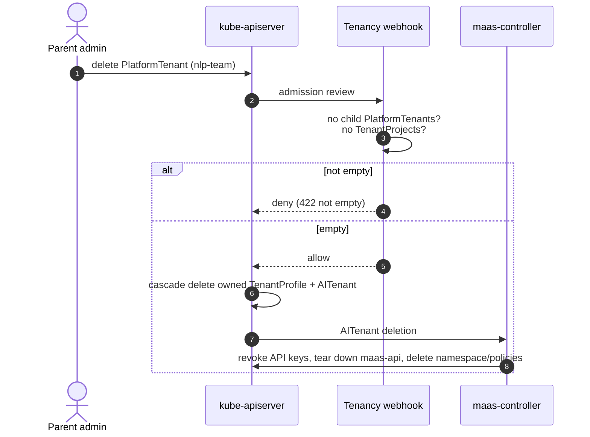
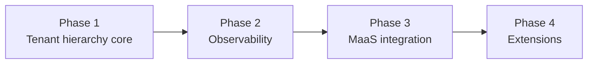

# RHOAI Multi-Tenancy Framework

|                |            |
| -------------- | ---------- |
| Date           | 2026-08-19 |
| Scope          | Operator (RHOAI platform-wide multi-tenancy) |
| Status         | Draft |
| Authors        | [Lindani Phiri](@lphiri) ,  [Chris Sams](@csams)|
| Supersedes     | N/A |
| Superseded by: | N/A |
| Tickets        | [RHAIRFE-2922](https://redhat.atlassian.net/browse/RHAIRFE-2922), [RHAISTRAT-2554](https://redhat.atlassian.net/browse/RHAISTRAT-2554) |
| Other docs:    | operator/multi-tenancy-strategy.md; Tenancy Control Plane design (multitenant-gpuaas: PLAN.md, API-REFERENCE.md); [RHAIRFE-3115](https://redhat.atlassian.net/browse/RHAIRFE-3115) |

## What

RHOAI will introduce a top-level multi-tenancy framework: a first-class tenancy
control plane that represents an organizational tenant hierarchy and provides
governed, self-service namespace provisioning with delegated administration,
network isolation, per-tenant observability, and delegated Models-as-a-Service
(MaaS) provisioning. The framework is delivered as a controller plus a
validating webhook under a new API group `tenancy.opendatahub.io/v1alpha1`, and
is built around three cluster-scoped custom resources:

* **`PlatformTenant`** — the hierarchy resource. Parent-controlled. Defines a
  tenant's existence and its position in the organizational tree.
* **`TenantProfile`** — the configuration resource. Self-managed by tenant
  admins. Holds admins, defaults, network and metadata policy, observability,
  and optional service bindings (such as MaaS).
* **`TenantProject`** — the namespace provisioning resource. Maps 1:1 to a
  Namespace (or OpenShift Project) with RBAC and NetworkPolicies.

The framework models the tenant hierarchy as a plain tree: a `PlatformTenant`
may have child `PlatformTenant`s, `TenantProject`s, or both. It provides the
tenant identity, delegation, and isolation substrate. Resource quota and
fairness (for example a Kueue-based GPU allocation model) are deliberately out of
scope here and deferred to a future ADR that can build on this tenant identity.
Capabilities activate by CRD detection (OpenShift, COO, OTel, Perses), so the
control plane degrades gracefully and runs on both OpenShift and vanilla
Kubernetes.

## Why

Today, onboarding a team onto a shared RHOAI cluster means manually stitching
together namespace creation, RBAC role bindings, network policies, and
storage/ingress configuration. This is slow, error-prone, and inconsistent
across tenants. The operational burden grows linearly with each new team, and
the risk of security misconfiguration grows with it. Prior analysis of the
backlog found six different working definitions of "multi-tenancy" and four
competing primitives each claiming to be "the tenant." Without a single,
first-class tenant abstraction, every large deployment reinvents tenancy from raw
primitives.

Enterprise and sovereign-AI customers deploying RHOAI for multiple teams are
already raising escalations about RBAC drift, inconsistent isolation, and the
difficulty of proving consistent isolation during compliance audits.

The driving forces are best framed by the multi-tenancy strategy
(`operator/multi-tenancy-strategy.md`), whose statement is to *build a
multi-tenancy framework that makes shared Kubernetes simple to consume, safe to
operate, and economically transparent*. That strategy treats multi-tenancy as a
customer operating model, not merely a security architecture. Its pillars map to
what this framework delivers:

* **Tenant lifecycle:** declarative create/update/decommission through the CRs
  instead of tickets and runbooks.
* **Isolation and governance:** the secure path is the default path; an
  auto-created `TenantProfile` starts maximally restrictive (strict network, no
  projects) until an admin opens it up.
* **Self-service management:** delegated RBAC lets a tenant admin subdivide their
  own subtree and provision projects without platform-admin involvement.
* **Cost attribution:** always-on metric labeling plus optional per-tenant
  dashboards and dedicated monitoring provide the consumption substrate for
  showback and chargeback.

The strategy's **resource fairness** pillar (quota, limits, priority) is
acknowledged but deferred to a follow-up ADR so this foundational tenant model
can land first. Without a structured tenant model, RHOAI cannot serve as a
shared platform at enterprise scale and loses ground to AI platforms that ship
multi-tenant governance out of the box.

## Goals

* Provide a single, first-class tenant abstraction over Kubernetes namespaces,
  replacing ad-hoc assembly from raw primitives.
* Model an organizational tenant hierarchy (a tree of `PlatformTenant`s) that
  supports delegated administration down the tree.
* Split hierarchy/existence (parent-controlled) from configuration
  (self-managed) into `PlatformTenant` and `TenantProfile` so RBAC can be scoped
  per resource and a tenant admin cannot change their own placement in the tree.
* Enable delegated self-service: a tenant admin creates sub-tenants and projects
  within their subtree without platform-admin intervention.
* Provide network isolation presets (none/tenant/strict) with cross-tenant
  grants.
* Provide tiered observability: always-on metric labeling, opt-in Perses
  dashboards, and opt-in per-tenant dedicated monitoring for showback/chargeback.
* Provide delegated MaaS tenant provisioning built on the tenant identity.
* Activate capabilities by CRD detection so the control plane degrades
  gracefully and runs on both OpenShift and vanilla Kubernetes.
* Preserve full backward compatibility: unmanaged namespaces operate unchanged;
  adoption of existing namespaces is opt-in.

## Non-Goals

* Resource quota and fairness. GPU/compute quota, borrowing/preemption, and
  Kubernetes ResourceQuota are out of scope for this ADR and deferred to a
  follow-up (for example a Kueue-based allocation model layered on this tenant
  identity). This framework provides the tenant hierarchy those systems attach
  to; it does not allocate or enforce resources.
* Multi-cluster tenancy federation. Single-cluster scope; cross-cluster is
  deferred to a future design.
* End-user self-service provisioning of arbitrary root tenants. Root
  `PlatformTenant` creation remains a cluster-admin function; self-service is
  limited to delegated subdivision within an assigned subtree (this reconciles
  the two source tickets; see Alternatives).
* Billing and chargeback systems and FinOps reporting UIs. This framework
  delivers the consumption/metrics substrate; chargeback tooling is downstream.
* Changes to the MaaS `AITenant` schema, the maas-controller reconciliation
  logic, or the MaaS authorization model and AI Gateway data plane. The
  framework provisions MaaS tenants by creating `AITenant` CRs that
  maas-controller reconciles unchanged (see How: Delegated MaaS tenant
  provisioning); it does not alter MaaS internals.
* Per-tenant filtering of shared cluster-scoped catalogs (HardwareProfile,
  ClusterServingRuntime, WorkspaceKind, etc.). A candidate future extension.
* Hardware/accelerator access gating (DeviceClass, StorageClass). Deferred, and
  naturally paired with the future quota ADR.
* Automated hierarchy re-parenting. A tenant's parent is immutable; reorganizing
  is done by creating new nodes and migrating.

## How

### Three custom resources

All three CRs are cluster-scoped. `PlatformTenant` and `TenantProfile` form a
1:1 pair with separate authorization domains; `TenantProject` represents a
namespace inside a tenant.

`PlatformTenant` is named `PlatformTenant` (not `Tenant`) deliberately, to avoid
collision with the MaaS `maas.opendatahub.io Tenant`/`AITenant` CRDs.

The split exists for per-resource RBAC. `PlatformTenant` records a tenant's
existence and its position in the tree (`spec.parent`); only parent admins (or
cluster-admin for roots) may create or delete it, so a tenant admin cannot
re-parent or fabricate tenants. `TenantProfile` is auto-created 1:1 with
maximally restrictive defaults (empty admins, `strict` network, `maxProjects: 0`)
and is then self-managed by the tenant admins the parent bootstraps.
`TenantProject` maps 1:1 to a namespace and generates RBAC and NetworkPolicies.

### Tenant hierarchy

The hierarchy is a plain organizational tree. A `PlatformTenant` may have child
`PlatformTenant`s, `TenantProject`s, or both. There is no fixed depth: the common
case is a single tenant (one level) or a division with team sub-tenants (two
levels), and deeper nesting is available but never required. The tree exists to
support delegated administration, subtree-scoped observability, and consistent
tenant/cost-attribution labeling, not resource allocation.

`spec.parent` is immutable. An operator-level setting may impose a conservative
maximum depth as a safety guard, but the framework does not promote deep trees.

### Delegated administration and authorization

Administration is delegated down the tree. A parent admin creates a child
`PlatformTenant` and bootstraps its initial `TenantProfile.spec.admins`; from
then on those tenant admins self-manage the profile and create projects and
sub-tenants within their subtree, up to `TenantProfile.spec.defaults.maxProjects`.

Admin authority is scoped per layer rather than inherited wholesale. Making a
parent admin an automatic admin of everything below them would collapse the
`PlatformTenant`/`TenantProfile` split and maximize blast radius, so inheritance
applies only where subtree ownership genuinely requires it:

* **Existence, placement, and admin assignment - inherited transitively.** Any
  *ancestor* admin (not only the immediate parent) may create or delete
  descendant `PlatformTenant`s and may write a descendant's
  `TenantProfile.spec.admins`. This is what owning a subtree means, and it is the
  orphan-recovery path: if a tenant's admins all leave, an ancestor (ultimately
  cluster-admin) reassigns them. Because this authority is computed from the tree,
  not from being listed in the child's `spec.admins`, a tenant admin cannot lock
  an ancestor out.
* **Configuration self-management - not inherited.** Only a tenant's own
  `spec.admins` may edit the rest of its `TenantProfile` (network defaults,
  observability, `services`) and its `TenantProject`s. An ancestor can still take
  over, but only by first rewriting `spec.admins`, which is an explicit, audited
  act rather than silent ambient access.
* **Namespace and data access - never inherited.** Access to a project's
  namespace comes solely from `TenantProject.spec.users`; ancestor admins get no
  automatic `kubectl` or data access to descendant workloads.

Delegation is protected by three layers:

1. **RBAC** grants tenant admins CRUD on `TenantProfile`/`TenantProject` and
   create-only on child `PlatformTenant`.
2. **The validating webhook** is the real authorization gate. It is fail-closed
   (`failurePolicy: Fail`) and checks, on every mutating operation, that the
   requesting user is authorized for that layer: an ancestor admin for
   `PlatformTenant` create/delete and for edits to `TenantProfile.spec.admins`;
   the tenant's own admins for the rest of `TenantProfile` and for
   `TenantProject`. "Is caller an ancestor admin?" is a bounded walk up
   `spec.parent` (capped by the depth guard) checking membership in each
   ancestor's `spec.admins`. Child creation is additionally verified with a
   SubjectAccessReview against the parent.
3. **Managed-resource protection** prevents direct edits to controller-owned
   resources (namespaces, RBAC, NetworkPolicies) outside the tenancy API.

Kubernetes RBAC cannot express "only the tenants you own," so the
`tenancy:tenant-admin` ClusterRole is intentionally broad and the webhook does
the scoping. `PlatformTenant` placement is parent-owned, so a tenant admin cannot
escalate by editing their own hierarchy node.

### Network isolation

Per-`TenantProject` `networkIsolation` generates baseline NetworkPolicies:

* `none` — no policies created.
* `tenant` — blocks cross-tenant in-cluster lateral movement; allows external
  egress (S3, registries, cloud APIs) and same-tenant traffic.
* `strict` — full lockdown; only system namespaces and DNS allowed.

System namespaces are auto-discovered from DSCI, Gateway/Istio, and Kuadrant and
labeled for selector-based policies. Component-created NetworkPolicies layer
additively; the controller never deletes policies it does not own. Cross-tenant
`networkGrants` create matching rules on both sides.

### Observability and cost attribution

Observability is the data substrate for the strategy's cost-attribution pillar:
it makes per-tenant consumption visible for showback and chargeback without
shipping the chargeback tooling itself. It is delivered as three progressively
more isolated tiers. Tier 1 is always on; tiers 2 and 3 are opt-in and
**root-tenant-only** (a `PlatformTenant` with no parent). Restricting the higher
tiers to the root prevents a subtenant from hiding its usage behind its own
isolated monitoring, and guarantees the root can always aggregate metrics across
its entire subtree.

| Tier | What | Activation | Data isolation |
|---|---|---|---|
| 1. Metric labeling | Tenant/root-tenant labels on managed namespaces | Always on | None: shared platform Prometheus, filtered by label |
| 2. Tenant dashboards | Perses dashboards + datasources scoped to the subtree | `observability.dashboards: true` (root) | None: filtered views over platform Prometheus |
| 3. Dedicated monitoring | Per-root MonitoringStack (COO) scraping the subtree | `observability.dedicatedMonitoring.enabled: true` (root) | Full: separate Prometheus, physically isolated data |

**Tier 1 - metric labeling (always on).** The `TenantProject` controller labels
every managed namespace with `tenancy.opendatahub.io/tenant: <tenant>` and
`tenancy.opendatahub.io/root-tenant: <root>`. These labels let anyone filter the
existing platform Prometheus by tenant with no extra configuration and nothing
new deployed. Namespace and workload series (CPU, memory, pod and workload
counts) are attributable per tenant purely by label. On OpenShift, user workload
monitoring (UWM) query isolation already stops tenants from seeing each other's
series in the platform Prometheus.

**Tier 2 - tenant dashboards (opt-in, root-only).** When a root `TenantProfile`
sets `observability.dashboards: true` and the Perses CRDs are present, the
controller generates, scoped to the root's subtree:

* a `PersesDatasource` pointing at the platform Prometheus, scoped to the
  tenant's namespaces; and
* pre-built `PersesDashboard`s for per-tenant resource usage, workload counts,
  and namespace activity.

These are filtered views over shared data, not isolation. They surface generic
namespace and workload metrics (`container_cpu_usage_seconds_total`,
`container_memory_working_set_bytes`, pod/workload counts, and any
component-exposed application metrics), giving tenants self-service visibility
without the cost of a dedicated stack.

**Tier 3 - dedicated monitoring (opt-in, root-only).** When a root
`TenantProfile` sets `observability.dedicatedMonitoring.enabled: true` and the COO
CRDs are present, the controller provisions a dedicated monitoring namespace
`<prefix><root>-monitoring` containing:

1. **A COO `MonitoringStack`** - a tenant-dedicated Prometheus whose
   `namespaceSelector` matches `tenancy.opendatahub.io/root-tenant: <root>`, so it
   scrapes every namespace in the subtree. With `resourceSelector: {}` it
   auto-discovers all ServiceMonitors and PodMonitors that RHOAI components
   (KServe, MLflow, Feast, DSP, Trainer, etc.) already create in those
   namespaces. No component changes are required; namespace-label selection is the
   only configuration point. Retention comes from
   `dedicatedMonitoring.retention` (default `15d`).
2. **Perses datasources and dashboards** identical to tier 2 but pointed at the
   tenant's dedicated Prometheus: isolated views over isolated data.

Because all in-scope metrics are namespace-scoped, the `namespaceSelector` on the
MonitoringStack is sufficient to isolate them; no central all-tenant metric
endpoint needs a filtering relay.

This is a deliberate simplification, not a dead end. Observability beyond
namespace scoping stays cheap to add later because the isolation boundary and the
extension point are both already in place:

* **The boundary is unchanged.** Isolation comes from the MonitoringStack's
  `namespaceSelector` on `tenancy.opendatahub.io/root-tenant`. A future
  non-namespace-scoped source is handled by adding a *second* input to the same
  tenant Prometheus, not by changing how the existing input is isolated.
* **The relay is additive.** Restoring the filtering relay means deploying one
  OTel Collector into the existing `<root>-monitoring` namespace, scraping the
  shared endpoint, filtering to the subtree, and remote-writing into the tenant
  Prometheus. It touches no CRD, the hierarchy, the webhook, or tier 1/2
  labeling.
* **The filter input already exists.** The controller already knows each
  subtree's namespaces and names from the tree, which is exactly the input a
  filter config needs, and it already regenerates on subtree changes.

The relay is required only once a metric source is *not* namespace-attributable
(a central quota or GPU-fairness exporter is the obvious case), because then
`namespaceSelector` alone can no longer prevent cross-tenant leakage. That is why
it is tied to the deferred quota ADR: whatever introduces cross-tenant metrics
brings the relay with it, rather than this ADR carrying machinery it has no
source for yet.

The platform Prometheus keeps scraping tenant namespaces in parallel, so
dedicated monitoring is additive, not a replacement. Platform admins retain full
cross-tenant visibility while the tenant gets a physically isolated dataset
suitable for chargeback.

Tier 3 metric flow (namespace-scoped scraping is naturally isolated):



Capability gating applies throughout: tier 2 needs the Perses CRDs and tier 3
needs the COO CRDs. When a requested tier's CRDs are absent the controller
ignores that tier and raises a warning condition rather than failing the tenant.
The webhook rejects `spec.observability` on non-root `TenantProfile`s.

### Modular capability activation

The controller discovers capabilities via CRD existence and degrades when they
are absent: without OpenShift, it creates plain Namespaces instead of Projects;
without COO/Perses, the corresponding observability tiers are ignored with a
warning condition; without the MaaS `AITenant` CRD, the `services.maas` block is
ignored with a warning. RHOAI packaging enables/disables the whole capability
through a `Tenancy` component in the DataScienceCluster, consistent with the
existing per-component pattern.

### Delegated MaaS tenant provisioning

Where a tenant needs Models-as-a-Service, the framework provisions the MaaS
tenant top-down and lets the existing maas-controller do the rest. This realizes
the extension point ODH-ADR-MS-0003 already anticipated: the `AITenant` CR, "for
now managed by the maas-controller," is instead created and owned by "a higher
level platform controller."

* A `TenantProfile.spec.services.maas` block carries the MaaS-facing intent: an
  enable flag, OIDC issuer/client, optional gateway name, TLS, and optional MaaS
  control-plane quotas (maxModels, maxSubscriptions, maxApiKeys). The block is
  honored only when the MaaS `AITenant` CRD is present (capability detection),
  consistent with the other optional service blocks.
* When enabled, the tenancy controller renders an `AITenant` CR in the
  `ai-tenants` registry namespace, named after the `PlatformTenant`, with an
  ownerReference back to it. The platform tenant name becomes the canonical
  tenant identity across the tenancy tree and MaaS (gateway and hostname
  `{tenant}.{domain}`).
* The maas-controller reconciles that `AITenant` exactly as it does an
  admin-created one: it provisions the tenant admin namespace, MaasTenantConfig,
  the dedicated maas-api instance and HttpRoute, and wires the Gateway. It
  remains the sole owner of every MaaS-internal resource. It is the delegated
  provisioner; the tenancy framework owns only the `AITenant` request.
* The tenancy controller watches `AITenant` status and surfaces MaaS
  provisioning conditions on the tenant status, giving one management surface for
  tenancy and MaaS state.
* Lifecycle follows ownership: enabling creates the `AITenant`; disabling it, or
  deleting the tenant, deletes the `AITenant` and triggers maas-controller's
  existing cascade cleanup (api-key revocation, maas-api teardown, namespace and
  policy deletion). The Gateway CR stays network-admin-owned; if it is missing,
  the `AITenant` condition surfaces the error up to the tenant status, preserving
  the MS-0003 coordination constraint.
* Backward compatibility: hand-created `AITenant`s (including the default
  `models-as-a-service` tenant) keep working untouched; the controller manages
  only `AITenant`s it generated. An existing `AITenant` can optionally be adopted
  by binding it to a tenant.

MaaS control-plane quotas (model, subscription, and API-key counts) are MaaS's
own soft governance counts. The framework can seed defaults from the tenant's
tier but does not otherwise interpret them.

### Example custom resources

The examples below are illustrative (`v1alpha1`, subject to change). All three
tenancy CRs are cluster-scoped.

**Root `PlatformTenant`** (an organizational node at the top of a subtree;
cluster-admin-created):

```yaml
apiVersion: tenancy.opendatahub.io/v1alpha1
kind: PlatformTenant
metadata:
  name: research-division
spec:
  displayName: "Research Division"
  # No spec.parent -> this is a root (a root can hold child tenants and projects).
```

**Child `PlatformTenant`** (a sub-tenant under the root; created by the parent's
admins):

```yaml
apiVersion: tenancy.opendatahub.io/v1alpha1
kind: PlatformTenant
metadata:
  name: nlp-team
spec:
  displayName: "NLP Team"
  parent: research-division      # immutable
```

**`TenantProfile`** (auto-created restrictive, then self-managed by the tenant
admins the parent bootstrapped):

```yaml
apiVersion: tenancy.opendatahub.io/v1alpha1
kind: TenantProfile
metadata:
  name: nlp-team                # 1:1 with the PlatformTenant of the same name
spec:
  admins:
    - kind: Group
      name: nlp-team-leads
  defaults:
    networkIsolation: tenant    # none | tenant | strict
    maxProjects: 10
    labels:
      cost-center: "cc-1234"    # applied to all TenantProject namespaces
```

**Root `TenantProfile` with observability** (tiers 2 and 3 are valid only on the
root; the webhook rejects `observability` on non-root profiles):

```yaml
apiVersion: tenancy.opendatahub.io/v1alpha1
kind: TenantProfile
metadata:
  name: research-division       # the root PlatformTenant
spec:
  admins:
    - kind: Group
      name: research-admins
  observability:
    dashboards: true            # tier 2: Perses dashboards over platform Prometheus
    dedicatedMonitoring:        # tier 3: isolated MonitoringStack
      enabled: true
      retention: 30d
```

**`TenantProject`** (created by a tenant admin; maps 1:1 to a namespace and
generates RBAC and NetworkPolicies):

```yaml
apiVersion: tenancy.opendatahub.io/v1alpha1
kind: TenantProject
metadata:
  name: sentiment-analysis
spec:
  tenant: nlp-team              # owning PlatformTenant; immutable
  users:
    - kind: Group
      name: nlp-team
      role: edit                # edit | view only
  networkIsolation: tenant
  networkGrants:
    - to: nlp-team/shared-data  # <tenant>/<project>; rules created on both sides
      direction: egress
      ports: [8080]
```

**MaaS-enabled `TenantProfile`** (the proposed `spec.services.maas` block that
drives delegated MaaS provisioning; honored when the `AITenant` CRD is present):

```yaml
apiVersion: tenancy.opendatahub.io/v1alpha1
kind: TenantProfile
metadata:
  name: nlp-team
spec:
  admins:
    - kind: Group
      name: nlp-team-leads
  defaults:
    networkIsolation: tenant
    maxProjects: 10
  services:
    maas:
      enabled: true
      oidc:
        issuerUrl: https://sso.example.com/realms/rhoai
        clientId: nlp-team-maas
      gateway:
        name: maas-default-gateway   # network-admin-owned; referenced, not created
      tls:
        certificateRef:
          name: nlp-team-maas-tls
          namespace: ai-tenants
      quotas:                        # MaaS control-plane counts
        maxModels: 20
        maxSubscriptions: 100
        maxApiKeys: 50
```

**Generated `AITenant`** (rendered and owned by the tenancy controller; the
maas-controller reconciles it unchanged as the delegated provisioner). This is
not authored by users; it is shown to make the mapping concrete:

```yaml
apiVersion: maas.opendatahub.io/v1alpha1
kind: AITenant
metadata:
  name: nlp-team                # canonical tenant identity, from the PlatformTenant
  namespace: ai-tenants
  ownerReferences:
    - apiVersion: tenancy.opendatahub.io/v1alpha1
      kind: PlatformTenant
      name: nlp-team
      controller: true
      blockOwnerDeletion: true
  labels:
    tenancy.opendatahub.io/tenant: nlp-team
    tenancy.opendatahub.io/managed-by: tenancy-controller
spec:
  oidc:
    issuerUrl: https://sso.example.com/realms/rhoai
    clientId: nlp-team-maas
  gateway:
    name: maas-default-gateway
  tls:
    certificateRef:
      name: nlp-team-maas-tls
      namespace: ai-tenants
  resourceQuotas:
    maxModels: 20
    maxSubscriptions: 100
    maxApiKeys: 50
```

### Sequence diagrams

**Tenant creation.** A parent admin creates a sub-tenant; the webhook enforces
authorization before anything is generated.



**Project creation.** After the parent bootstraps tenant admins into the
`TenantProfile`, a tenant admin self-provisions a namespace.



**Delegated MaaS provisioning.** Enabling `services.maas` makes the tenancy
controller create an owned `AITenant`; the maas-controller does the rest.



**Tenant decommission.** Deleting the `PlatformTenant` cascades through
ownership; the maas-controller runs its existing MaaS cleanup.



## Suggested Execution Plan

This is a large surface, so the framework is delivered incrementally and
sequenced by customer value. The first outcome is a governed, self-service tenant
hierarchy with consistent isolation. Observability follows so consumption is
visible and attributable, then MaaS integration builds on the tenant identity.

Every phase ships behind the opt-in `Tenancy` component and preserves backward
compatibility (see Upgrade and Migration Considerations), so each is
independently releasable and reversible.



### Phase 1 - Tenant hierarchy core

* **Goal:** a first-class, self-service tenant hierarchy with delegated
  administration and consistent isolation.
* **Deliverables:** the three `v1alpha1` CRDs; the controller; the fail-closed
  validating webhook; RBAC delegation; namespace/project provisioning; network
  isolation; the opt-in `Tenancy` component toggle; namespace adoption.
* **Exit criteria:** a cluster-admin creates a tenant; a tenant admin
  self-provisions sub-tenants and projects within their subtree; network
  isolation is enforced; the 50-tenant / 200-project scale test passes.

### Phase 2 - Observability

* **Goal:** make per-tenant consumption visible and attributable, the substrate
  for showback and chargeback.
* **Deliverables:** tier 1 metric labeling (always on); tier 2 Perses
  dashboards; tier 3 dedicated `MonitoringStack`; a documented mapping from
  tenant/root-tenant labels to showback/chargeback dimensions.
* **Exit criteria:** a platform admin can filter per-tenant resource usage in the
  platform Prometheus by label with no extra config; a root tenant can opt into
  dashboards and a physically isolated Prometheus.
* **Depends on:** Phase 1 tenant labels; COO / Perses CRDs for tiers 2-3
  (capability-gated, degrade with a warning when absent).

### Phase 3 - MaaS integration (delegated provisioning)

* **Goal:** one-step MaaS tenants layered on the tenant identity.
* **Deliverables:** the `TenantProfile.spec.services.maas` block; controller
  rendering of an owner-referenced `AITenant` in `ai-tenants`; status surfacing
  onto the tenant; ownership-driven lifecycle and cascade cleanup; optional
  adoption of existing `AITenant`s.
* **Exit criteria:** enabling `services.maas` provisions a working MaaS tenant
  through the unchanged maas-controller; disabling or deleting the tenant
  cascades cleanup; the default `models-as-a-service` tenant is untouched.
* **Depends on:** Phase 1 tenant identity; the MaaS `AITenant` CRD
  (ODH-ADR-MS-0003); Gateway coordinated with the network admin.

### Phase 4 - Extensions

* **Goal:** broaden once the value path is proven.
* **Deliverables:** resource quota and fairness (the deferred quota ADR, for
  example Kueue-based); hardware/DeviceClass and StorageClass gating; shared
  cluster-scoped catalog filtering; promotion of the API toward `v1beta1`; and a
  multi-cluster exploration.
* **Exit criteria:** defined per extension; downstream API review before any
  `v1beta1` promotion.
* **Depends on:** the earlier phases.

The phase ordering also informs the packaging Open Question below: Phases 1-2
can ship as an embedded platform service, while the standalone /
vanilla-Kubernetes story can be revisited around Phase 4.

## Open Questions

* **Packaging: embedded platform service vs standalone operator.** The strategy
  positioned the controller as a platform service inside rhods-operator
  (alongside Auth, Gateway, Monitoring); the concrete design ships it as a
  general-purpose operator that also runs on vanilla Kubernetes. Decide whether
  RHOAI embeds it as a platform service or manages it as a distinct operator
  enabled via the `Tenancy` component.
* **Hierarchy depth safety guard.** Confirm whether an operator-level
  maximum-depth guard is needed and what a sensible conservative default is.
* **MaaS intent placement and scope.** Whether the MaaS provisioning intent
  lives on `TenantProfile.spec.services.maas` (self-managed) or in a separate
  tenancy-owned service-binding CR. A per-tenant gateway and hostname
  `{tenant}.{domain}` means enabling MaaS at multiple levels of one lineage would
  create nested, overlapping MaaS tenants, so enablement needs a scope
  constraint. The leaning option is to make provisioned services like MaaS
  **root-only**, consistent with observability tiers 2 and 3: a single MaaS
  tenant per root subtree, enabled only on a `PlatformTenant` with no parent.
  This reuses the existing root-only webhook check and avoids per-lineage rules.
  Gateway assignment still needs network-admin coordination (MS-0003).
* **Relationship to the deferred quota ADR.** This ADR provides the tenant
  identity a quota model will attach to. Confirm the boundary so the quota ADR
  (for example Kueue-based) can layer cleanly without reworking these CRDs.
* **Scalability targets.** Establish maximums for tenants, projects, and tree
  depth. The design targets a 50+ tenant / 200+ project scale test; larger
  enterprise targets need PM/Engineering input.

## Alternatives

**Flat, admin-managed tenant model (as originally scoped in RHAIRFE-2922).** The
RFE described tenants as individually configured namespaces, with self-service
out of scope. Simpler to build, but it does not model organizational structure
and leaves the platform-admin bottleneck in place. We adopt the hierarchical
model instead. Reconciling the tickets: the RFE's "no end-user self-service" is
preserved for *root* tenant creation, while the strategy's delegated
*subdivision* is adopted; the RFE's "no billing/chargeback" is preserved, while
the consumption substrate is adopted as the enabler for later FinOps.

**Single `TenancyUnit` CRD (as proposed in RHAISTRAT-2554).** One cluster-scoped
CRD holding both hierarchy and configuration. Simpler surface, but it forces one
authorization domain over both parent-controlled placement and self-managed
configuration: a tenant admin editing the same object that fixes their position
in the tree is an escalation risk. We instead split into `PlatformTenant`
(parent-controlled) + `TenantProfile` (self-managed).

**Include resource quota in this ADR.** The earlier draft mapped the hierarchy
onto Kueue (Cohorts/ClusterQueues/LocalQueues) with a capacity model and
isolation presets. That coupled the foundational tenant model to a specific quota
engine and a required Kueue dependency, and made the ADR very large. We defer
quota and fairness to a follow-up ADR that can build on this tenant identity,
keeping this ADR focused on hierarchy, delegation, isolation, observability, and
MaaS.

**Namespace-scoped tenant CRD.** Aligns with per-project RBAC but cannot
represent a cluster-wide org tree spanning namespaces, and complicates rollup and
delegation. Cluster scope matches the DataScienceCluster API.

**Reuse the MaaS `AITenant` CRD as the hierarchy.** `AITenant` is a
model-serving-specific gateway registry; overloading it couples org structure to
one component's subscription semantics. The two abstractions stay at separate
layers, integrated by delegated provisioning (see How).

**Bottom-up MaaS reference (`AITenant.tenancyUnitRef`).** An earlier draft had
`AITenant` reference a tenancy node. This needs a MaaS schema change and a
conditional watch on the MaaS side, keeps two separately-created identities in
sync, and leaves MaaS onboarding as a separate step. We instead provision
top-down: the framework creates the `AITenant` and maas-controller fulfills it,
giving one canonical identity and a single onboarding workflow with no MaaS
schema change.

**Adopt an external multi-tenancy operator (Capsule, vcluster).** Conflicts with
the platform policy of not auto-installing external operators, adds an unowned
dependency, and does not integrate with RHOAI platform services. A first-party
control plane keeps tenancy aligned with the operator lifecycle and the
DataScienceCluster API.

**Enforce delegation only through periodic reconciliation (no webhook).**
Simpler, but allows invalid states transiently and defers authorization to an
async loop. A fail-closed validating webhook rejects violations at admission;
controller re-validation remains a backstop.

## Security and Privacy Considerations

* **Webhook is the authorization gate.** Kubernetes RBAC cannot scope to "only
  the tenants you own," so the `tenancy:tenant-admin` ClusterRole is broad and
  the fail-closed (`failurePolicy: Fail`) validating webhook is the real gate. It
  checks the requesting user against the relevant `TenantProfile.spec.admins` on
  every mutating operation.
* **No self-escalation of placement.** `PlatformTenant` create/delete requires an
  *ancestor's* admins, not the tenant's own; a tenant's position in the tree is
  parent-owned. Child creation is additionally checked via SubjectAccessReview
  against the parent.
* **Layered, scoped admin authority.** Authority is inherited only where subtree
  ownership requires it, never wholesale. Ancestor admins inherit existence,
  placement, and admin-assignment authority (`TenantProfile.spec.admins`)
  transitively; they do not inherit configuration self-management (the rest of
  `TenantProfile`, and `TenantProject`), which is owner-only, nor namespace/data
  access, which comes solely from `TenantProject.spec.users`. A parent override of
  a child's config is therefore possible but requires first rewriting
  `spec.admins`, an explicit and audited act. Because ancestor authority is
  computed from the tree rather than from list membership, a tenant admin cannot
  lock an ancestor out, and an orphaned tenant is always recoverable by an
  ancestor (ultimately cluster-admin).
* **Delegation enforcement.** Three layers (RBAC, webhook authorization,
  managed-resource protection) prevent a tenant admin from acting outside their
  subtree.
* **Role restriction.** `TenantProject` user roles are limited to `edit`/`view`;
  the webhook rejects `admin`/`cluster-admin`, preventing RBAC-modification
  escalation through the project API.
* **Isolation by default.** Auto-created profiles start fully restrictive
  (`strict` network, no projects). Network isolation and namespace-scoped RBAC
  give consistent posture; this is namespace-based ("soft") multi-tenancy, so
  customers needing stronger isolation may still require virtual/dedicated
  clusters, as the strategy notes.
* **Relationship to the RHOAI Auth CR.** Platform-level RBAC (Auth service admin
  groups) and project-level RBAC (`TenantProject`) operate at different layers
  and are additive; neither overrides the other.
* **Compliance evidence.** A single management surface reporting per-tenant
  policy and status lets admins demonstrate consistent isolation during audits
  without assembling namespace-by-namespace evidence.
* **Webhook blast radius.** Fail-closed blocks tenancy CRUD during controller
  downtime but does not intercept workload resources, so existing workloads keep
  running. The consumption path reads existing metrics and introduces no new
  user-data collection.

## Upgrade and Migration Considerations

RHOAI is existing, deployed software. This framework must land on live clusters
that already run unmanaged namespaces and hand-created MaaS `AITenant`s without
disrupting any of them. The design is opt-in at every layer, and adoption of
existing resources is explicit.

### Opt-in by default

* **Component toggle, off by default.** Tenancy ships as a `Tenancy` component in
  the DataScienceCluster, disabled by default. On upgrade, existing clusters see
  no behavioral change until an admin enables it.
* **Enabling is inert until first use.** Enabling the component installs the
  three CRDs, the controller, and the validating webhook, but generates nothing.
  No `PlatformTenant` exists, so no namespaces, RBAC, or NetworkPolicies are
  created. The cluster behaves exactly as before.
* **Narrow webhook scope.** The fail-closed webhook intercepts only the three
  tenancy CRs. It never intercepts Deployments, Pods, InferenceServices, or other
  workload resources, so it cannot block existing workloads even during
  controller downtime.
* **Unmanaged namespaces are invisible.** The controller acts only on namespaces
  carrying the `tenancy.opendatahub.io/tenant` label. A namespace without that
  label is never touched.

### Onboarding existing namespaces

Adoption is always initiated by the admin, never automatic:

* **Namespace adoption.** Creating a `TenantProject` whose name matches an
  existing namespace adopts it instead of failing: the controller adds tenant
  labels and applies the requested NetworkPolicies and RBAC. The `NamespaceReady`
  condition reports `Adopted`. Workloads already running in the namespace keep
  running.
* **Start permissive, tighten later.** Adopt with `networkIsolation: none` so no
  NetworkPolicies are created and existing connectivity is preserved, then move to
  `tenant` or `strict` once the traffic profile is understood. Because tenancy
  NetworkPolicies are additive and the controller never deletes policies it does
  not own, component-created policies (KServe, DSP, etc.) are unaffected.
* **MaaS tenant adoption.** Hand-created `AITenant`s (including the default
  `models-as-a-service` tenant) keep working untouched. An existing `AITenant` can
  optionally be brought under management by binding it to a tenant; the controller
  then owns it going forward.

### Rollback

* **Disable path.** Disabling the `Tenancy` component stops the controller and
  webhook. Generated resources are not force-deleted on disable, so tenants and
  their workloads continue to run; management simply stops until re-enabled. Full
  teardown is an explicit, ordered delete of `PlatformTenant`s (children first),
  which cascades through ownership.
* **Alpha API.** CRDs ship as `v1alpha1` with explicit alpha guarantees; schema
  may change before v1beta1. Downstream owners review the schema before
  promotion, including the boundary with the deferred quota ADR.

## Risks

* **CRD schema lock-in.** The three CRDs are the root dependency for the tenancy
  roadmap, including the future quota ADR. *Mitigation:* v1alpha1 with explicit
  alpha guarantees; design review with downstream owners before v1beta1; keep the
  hierarchy CRDs free of resource-allocation fields so the quota ADR can add its
  own without reworking them.
* **No resource protection until the quota ADR lands.** Without quota, this
  framework does not prevent noisy-neighbor contention. *Mitigation:* this is an
  accepted, explicit scope boundary; network isolation and namespace RBAC still
  apply, and the quota ADR follows.
* **Adoption changes namespace posture.** Adopting a namespace applies tenant
  labels and NetworkPolicies. *Mitigation:* adopt with `networkIsolation: none`
  first, then tighten; the controller never deletes policies it does not own.
* **Fail-closed webhook blocks operations during downtime.** *Mitigation:*
  leader-elected controller with fast restart; the webhook intercepts only
  tenancy resources; controller re-validation as a backstop.
* **NetworkPolicy coexistence.** Many components create their own per-namespace
  policies. *Mitigation:* baseline-plus-additive model; the controller never
  edits policies it does not own; `strict` is "strict baseline with
  component-driven exemptions."
* **Dedicated monitoring cost and complexity.** Per-tenant MonitoringStack adds
  footprint. *Mitigation:* opt-in, root-only; tiers 1 and 2 cover most needs
  without dedicated stacks.

## Stakeholder Impacts

| Group                                   | Key Contacts     | Date       | Impacted? |
| --------------------------------------- | ---------------- | ---------- | --------- |
| Platform / rhods-operator               | Platform team    | 2026-08-19 | Yes |
| Observability (COO, Perses)             | Observability team | 2026-08-19 | Yes |
| Dashboard (odh-dashboard)               | Dashboard team   | 2026-08-19 | Yes |
| Model Serving (kserve, odh-model-controller) | Model Serving team | 2026-08-19 | Yes |
| DataScienceCluster / DSCI API           | Platform team    | 2026-08-19 | Yes |
| Security / Compliance                   | Security team    | 2026-08-19 | Yes |
| Models-as-a-Service (MaaS)              | MaaS team        | 2026-08-19 | Yes |
| Distributed Workloads / Kueue (RHBoK)   | DW team          | 2026-08-19 | Maybe |
| Data Science Pipelines / MLflow / Feast | Component teams  | 2026-08-19 | Maybe |
| Documentation                           | Docs team        | 2026-08-19 | Yes |
| UX Design                               | UXD team         | 2026-08-19 | Yes |

Notes:

* **Platform / rhods-operator:** Primary owner. Defines the three CRDs, the
  controller, the fail-closed webhook, RBAC delegation, and the `Tenancy`
  component toggle.
* **Observability:** COO MonitoringStack and Perses are the substrate for tenant
  dashboards and dedicated monitoring.
* **Dashboard:** Hierarchy management UI, self-service subdivision UI, and
  consumption rollup views.
* **Model Serving:** Workloads run in tenant namespaces; awareness of tenancy
  labels and network isolation for InferenceService/LLMInferenceService.
* **DataScienceCluster / DSCI API:** New `Tenancy` component toggle; system
  namespaces auto-discovered from DSCI.
* **Security / Compliance:** Delegation guardrails, isolation posture, and audit
  evidence depend on this framework.
* **MaaS:** The framework creates and owns `AITenant` CRs; maas-controller
  reconciles them unchanged as the delegated provisioner (per the MS-0003
  extension point). No `AITenant` schema or maas-controller reconciliation
  changes required.
* **Distributed Workloads / Kueue:** Not a dependency of this ADR. Relevant to
  the deferred quota ADR, which is expected to build a Kueue-based allocation
  model on this tenant identity.
* **Component teams (DSP, MLflow, Feast, etc.):** Deploy per-namespace
  infrastructure inside tenant projects; must account for network isolation.
* **Documentation / UXD:** Admin hierarchy-setup and tenant self-service guides;
  hierarchy and consumption UI design.

## References

* Multi-tenancy strategy: `operator/multi-tenancy-strategy.md`
* Tenancy Control Plane design (multitenant-gpuaas): `PLAN.md`, `API-REFERENCE.md`
  (note: the Kueue/quota portions inform the deferred quota ADR, not this one)
* [RHAIRFE-2922](https://redhat.atlassian.net/browse/RHAIRFE-2922) — Tenant
  Management Control Plane for Multi-Team RHOAI Deployments
* [RHAISTRAT-2554](https://redhat.atlassian.net/browse/RHAISTRAT-2554) — Org
  hierarchy and tenant definition as a first-class resource
* [RHAIRFE-3115](https://redhat.atlassian.net/browse/RHAIRFE-3115) — Source RFE
* Related ADRs: ODH-ADR-Operator-0007 (Auth CRD), ODH-ADR-Operator-0012
  (Gateway API authentication), ODH-ADR-MS-0002 (MaaS Tenant CR),
  ODH-ADR-MS-0003 (AI Gateway tenancy / AITenant)
* Competitive references: Run:ai Department/Project hierarchy; AWS Organizations

## Reviews

| Reviewed by                   | Date       | Notes |
| ----------------------------- | ---------  | ------|
|                               |            |       |
