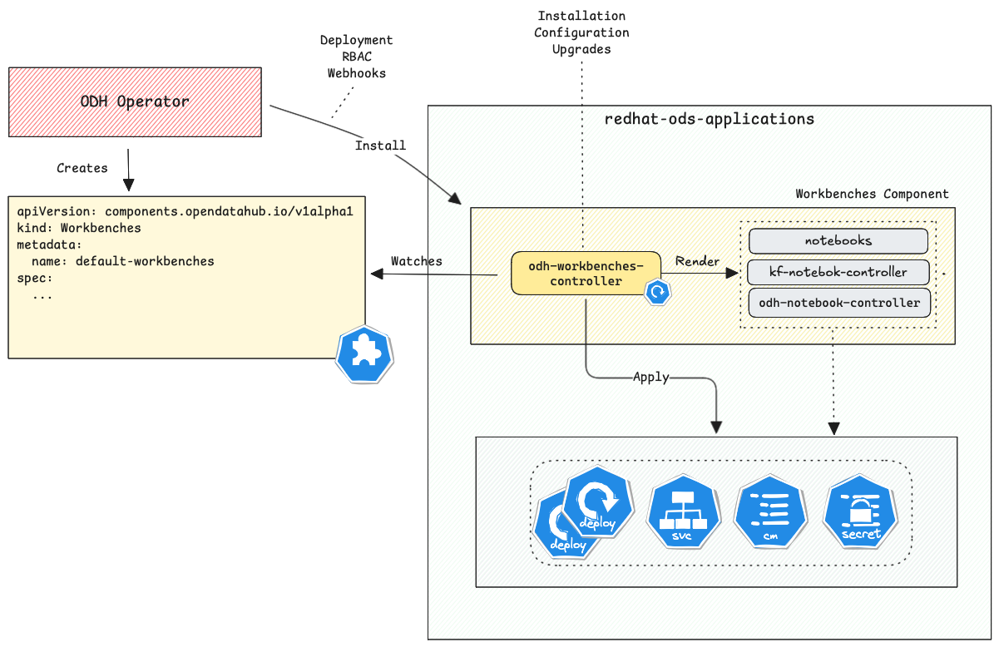

# **Onboarding Guide for ODH Operator Modules**

This document outlines the requirements and architectural standards for onboarding new modules to the Open Data Hub (ODH) Operator.

## **1\. Architectural principles & separation of concerns**

To maintain scalability and decouple lifecycles, the architecture enforces a strict separation of concerns between the **ODH Operator** (control plane) and the **module controller** (formerly companion controller).

### **Design Philosophy**

The primary driver for this architecture is to ensure modules are **as independent as possible**.

* **Standalone Design:** You should design your Module Controller as if it were a completely independent operator capable of running on a cluster without the ODH Operator.  
* **Self-Sufficiency:** It must contain all the logic, manifests, and intelligence required to manage the lifecycle of its module.  
* **Orchestration vs. Management:** The ODH Operator is merely an **orchestrator** that installs your operator. It does not "run" your module; your operator does.  
* **Upstream & Extensibility:** The Module Controller could also act as an **extender** for the upstream component. Instead of modifying the upstream codebase to add platform-specific modules (which creates maintenance debt). The controller can implement this logic **directly** (e.g., by reconciling specific platform resources) or by deploying **sub-controllers**, **sidecars**, etc.  
  **Note:** if not absolutely necessary prefer extending upstream components instead of modifying upstream code downstream



### **The ODH Operator (orchestrator)**

Acts as the central management interface. It does **not** manage the deep internal resources of the module (e.g., the specific Pods, Services, or Routes of the application).

**Responsibility**

* It watches the platform CRs (such as `DataScienceCluster`, `DSCInitialization`, `Auth`, `GatewayConfig`, `Monitoring`).  
* It deploys the **module controllers** (Deployment, RBAC, etc.).  
* Creates/Updates the **module CRs** based on the DSC configuration.  
* Watches all the created resources (CRs, Deployments, etc) having the **components.platform.opendatahub.io/managed-by** label  
* Aggregates status from the module CRs back to the DSC.  
* Prunes owned module resources and controllers when the module is not configured, handles module removal in case of upgrades

### **The module controller**

The domain expert for the specific module.

**Responsibility**

* Reconciles the **module CR**.  
* **Installation:** Owns the manifest lifecycle (install, upgrade, delete) for the actual application.  
* **Environment detection:** Auto-detects cluster states (e.g., FIPS mode, disconnected environments) and adjusts the installation accordingly.  
* **Status reporting:** Reports granular health and provisioning status back to the module CR.

## **2\. API requirements (CRD)**

Each module must provide a high-level custom resource definition (CRD).

### **2.1 Scope and metadata**

* **Scope:** Cluster  
* **Cardinality:** singleton (The system expects a single instance per cluster).  
* **Naming Enforcement:** To enforce the singleton pattern, the CRD **must** strictly validate the `metadata.name`. Use a CEL validation rule (preferred) or a Validating Webhook to ensure the name can **only** be a specific module-reserved string (e.g., `model-registry`, `kserve`).  
  * **Example CEL Rule:** `self.metadata.name == 'model-registry'`  
* **Group:** should use `components.platform.opendatahub.io` or `services.platform.opendatahub.io`.  
* **Version:** Must match the support level of the module:  
  * **Developer preview:** Must use `vXalphaY` (e.g., `v1alpha1` for the first version, `v2alpha1` for a preview of version 2).  
  * **Technology preview:** Must use `vXbetaY` (e.g., `v1beta1`, `v2beta1`).  
  * **General availability (GA):** Must use `vX` (e.g., `v1`, `v2`).

### **2.2 Spec configuration**

The CRD `spec` is the **primary source of truth** for all functional configuration. It must adhere to standard operational patterns.

**Defaults & Validation:**

* **Requirement:** Components must strive for a "zero-config" experience. Every optional field should have a sensible **default value** that results in a working configuration.  
* **Enforcement:** If a field is mandatory or requires specific formatting, strict **validation logic** (via OpenAPI schema enums, regex, or CEL validation rules) must be implemented to provide immediate feedback to the user.

**Platform-Managed Fields (Internal APIs):**

Certain global platform configurations (e.g., `Observability`, `Certificates`, `Auth`) are defined centrally in the **one of the platform CR** (such as the DSC) or are enforced by platform policy. The ODH Operator reads these platform settings and **projects** them into specific fields in your Module CR `spec`, continuously reconciling updates and strictly **reverting** any manual user edits to ensure platform compliance.

* **Requirement:** Your Module CRD must expose these fields. For example, if your module needs Authentication, expose a `spec.auth` struct. The ODH Operator will populate it.  
* **Consistency:** Do **not** use the ConfigMap for these settings.

### **2.3 Status specification (`PlatformObject`)**

The CRD status must adhere to the `PlatformObject` interface pattern to ensure the ODH operator can parse it generically.

**Required status fields:**

* `observedGeneration` (int64): The last generation observed by the controller. The ODH Operator uses this field to determine if the module controller's reconciliation is progressing normally. By comparing the Module CR's `metadata.generation` with `status.observedGeneration`, the ODH Operator can detect if reconciliation is halted or misbehaving (e.g., if the generations diverge and remain out of sync, it indicates the controller is not processing updates).  
* `conditions` (\[\]metav1.Condition): A list of standard Kubernetes conditions.  
* `releases` (Array of Objects): A list of installed components.  
  * `name` (string): The name of the component.  
  * `repoUrl` (string): The repository url of the component.  
  * `version` (string): The version of the component.

**Mandatory conditions:**

* `Ready`: The top-level aggregate status.  
  * `True`: The module is fully functional and available for use.  
  * `False`: The module is unhealthy, installing, or has failed to provision.  
* `ProvisioningSucceeded`:  
  * `True`: The underlying manifests (Deployments, Services) were successfully applied.  
  * `False`: An error occurred during manifest application.  
  * **Aggregation:** **MUST** be aggregated into `Ready`.  
* `Degraded`:  
  * `True`: The module is functioning but in a degraded state.  
  * `False`: The module is operating normally with no warnings.

**Semantics & Examples:**

* **Ready=True, Degraded=True (Partial Availability):** The main service is up, but a non-critical sub-component is failing, for example the Dashboard UI is accessible (Ready), but the metrics collector service is crash-looping (Degraded). Users can still work, but observability is lost/degraded.  
* **Ready=False (Unusable):** The main service is down or a critical dependency is missing, for example, the Dashboard UI Deployment is 0/1 replicas. The module is not usable.  
* **Aggregation:** **COULD** be aggregated into `Ready`, depending on the severity. If the degradation renders the module unusable, it should set `Ready=False`. If it is a minor warning, `Ready` can remain `True`.

**Condition Aggregation Rules:**

Use this rule-of-thumb to determine whether a condition should affect the Ready status:

| Condition Type | Impact on Ready | Rule |
|----------------|-----------------|------|
| **Critical conditions** | MUST set Ready=False | Conditions that indicate the module's core functionality is broken or unavailable. Examples: ProvisioningSucceeded=False, core service deployment failed. |
| **Degraded conditions** | SHOULD set Ready=False if severe, MAY leave Ready=True if minor | Conditions indicating impaired but not broken functionality. Evaluate: Can users still accomplish their primary tasks? |
| **Optional feature conditions** | MUST NOT affect Ready | Conditions for features that are disabled by user choice or configuration. These are informational only. Examples: NIMAvailable=False when NIM not enabled. |

**Decision Framework:**

Ask: "If this condition is False, can users still use the module for its primary purpose?"
- **No** → Set Ready=False (module is not functional)
- **Yes, but with limitations** → Evaluate severity:
  - Severe limitations → Set Ready=False, Degraded=True
  - Minor limitations → Leave Ready=True, Degraded=True
- **Yes, fully** → Leave Ready=True (e.g., optional feature disabled)

**Examples:**
- ProvisioningSucceeded=False → Ready MUST be False (manifests failed to apply, module non-functional)
- CoreServiceAvailable=False → Ready MUST be False (primary service down, module unusable)
- MetricsCollectorAvailable=False → Ready MAY be True, Degraded=True (observability impaired, but module works)
- OptionalFeatureEnabled=False → Ready stays True (user choice, not a failure)

### **2.4 Configuration via ConfigMap (Strictly Minimal)**

The ConfigMap should be kept **strictly minimal**. It is reserved for environmental overrides and hidden flags, **not** for standard application configuration.

**What belongs in the CR `spec`:**

* **User-configurable settings:** (e.g., DB connection pool size, ports, storage classes).  
* **Platform settings:** (e.g., Auth configuration, Certificates).

**What belongs in the ConfigMap:**

* **Internal Module Flags:** These flags are used to configure the behavior of the controller and should not contain APIs.

**Lifecycle & Enforcement:**

* **Out-of-the-Box Defaults:** The Module Controller manifests **must** include this ConfigMap with sensible default values. This allows module developers to ship, for example, the component with specific module flags enabled or disabled by default.  
* **ODH Operator Responsibility:** The ODH Operator applies this ConfigMap during installation. It then **enforces** its state; if a user attempts to manually modify these flags, the ODH Operator will revert the changes to ensure platform consistency and supportability.  
* **Module Controller Responsibility:** It is entirely up to the Module Controller to decide **how** to consume this ConfigMap (e.g., mounting it as a volume, watching it for changes and reconciling, polling, or restarting pods). This guide does **not** prescribe a specific mechanism; this is an implementation detail left to the module controller's discretion.

## **3\. Implementation requirements**

### **3.1 Allowed manifests**

The ODH operator will only install the **module controller** manifests. The module repository must provide a directory containing **only** the **minimal set of artifacts** required to bootstrap the module controller. The manifests should strictly encompass the artifacts needed to **deploy and run the module controller** (e.g., the controller Deployment, its RBAC, and the Module CRD), do **not** include application-level manifests (e.g., ModelMesh Serving runtime, Dashboard UI Deployment). The ODH Operator is capable of rendering and applying manifests using **Helm** or **Kustomize**. Note that these manifests are **embedded** in the ODH controller binary at **build time**, ensuring the operator is self-contained and does not require runtime network access to fetch manifests.

**Notes:** 

* The actual application manifests are **embedded** within the module controller and applied by the controller, not the ODH operator. The specific manifest types (helm, kustomize, plain yaml) and technical mechanism used to embed these manifests is a decision left to the module team, as long as the controller remains self-contained.  
* The **Helm** support is limited to templates rendering only as first stage, support for advanced features such as hooks and other helm specific features will be evaluated at later stage 

### **3.2 Logic & detection**

The module controller is responsible for "smart" behavior (a dedicated set of functionalities will be provided in the form of go modules, see [Shared Utilities Repository](#6.2-shared-utilities-repository)) , for example, the module controller could check if the cluster has FIPS enabled and switch internal crypto libraries; the module must not rely on the ODH operator to do "smart" behavior and pass that down.

### **3.3 Dependency management**

Modules must discover dependencies dynamically by querying the Kubernetes API for the existence and status of other Module/Component CRs.

The module controller must handle missing dependencies gracefully.

* **Optional dependency:** If missing, disable the related functionality and update the `Degraded` condition if necessary, but keep `Ready=True`.  
* **Critical dependency:** If a required dependency is missing, set `Ready=False` (with a clear Reason) or `Degraded=True`, but do **not** crash the controller loop. Wait for the dependency to appear.

### **3.4 Internal Certificate Management** 

Many modules require internal TLS certificates, particularly for **Admission Webhooks** or mTLS between components.

* The Module Controller should default to using **cert-manager** (we will avoid dependency on OpenShift serving certs intentionally) to provision and rotate certificates for webhooks and internal services. This ensures standard lifecycle management.

### **3.5 RBAC Permissions**

Module controllers must follow the **principle of least privilege** when defining RBAC permissions. Controllers should request only the minimum permissions required to perform their specific functions. Avoid wildcard permissions (`*`) and prefer namespace-scoped permissions (Role/RoleBinding) over cluster-scoped (ClusterRole/ClusterRoleBinding) when possible.

## **4\. Integration with DataScienceCluster (DSC)**

The `DataScienceCluster` (DSC) CR is the user-facing entry point.

* The module has a stanza in the DSC i.e. `spec.components`.  
* The ODH operator reads `spec.components.mymodule` from the DSC and projects it into the `MyModule` CR.  
* The `MyModule` CR is free to support additional `spec` fields that are **not** exposed in the DSC. This allows advanced configuration by editing the `MyModule` CR directly.  
  * *Example:* Users may need to fine-tune **resource requirements** (CPU/Memory requests and limits) for the deployed controller's Pods. While these operational details are too granular for the high-level DSC, they can be exposed in the `MyModule` CR (e.g., via `spec.controllers[].resources`), allowing administrators to adjust them directly on the module level.  
    

**Notes:** 

* The exact machinery on how the module stanza is still to be defined, ideally it should be auto generated using some module manifest (such has Helm values jsonschema)

## **5\. Example reference**

### **5.1 The Module CRD**

Below is an example of what the `ModelRegistry` module CRD might look like.

```
apiVersion: components.platform.opendatahub.io/v1alpha1 
kind: ModelRegistry 
metadata: 
  name: model-registry 
spec: 
  # General Management State (Managed, Unmanaged) 
  # Default: Managed 
  managementState: Managed 
  
  # Platform-Managed API (Populated by ODH Operator) 
  # Do not configure via ConfigMap! 
  auth: 
    enabled: true 
    audiences:
    - https://api.openshift.com
  
  # Module specific configuration 
  grpcPort: 9090 
  restPort: 8080 
  
  # Advanced config NOT necessarily exposed in DSC 
  controllers:
  - name: model-registry-controller
    resources:
      requests:
        cpu: "100m"
        memory: "512Mi"
      limits:
        cpu: "500m"
        memory: "1Gi"

status: 
  observedGeneration: 1 
  
  # Release information 
  releases: 
  - name: "model-registry"
    repoUrl: "https://github.com/kubeflow/model-registry"
    version: "v2.0.1" 

  conditions: 
  - type: Ready 
    status: "True" 
    reason: "Ready" 
    message: "All model registry components are running." 
    
  - type: ProvisioningSucceeded 
    status: "True" 
    reason: "ProvisioningComplete" 
    message: "Manifests applied successfully." 
    
  - type: Degraded 
    status: "True" 
    reason: "MissingOptionalDB" 
    message: "External DB not found, falling back to local SQLite. Performance may be impacted." 
```

### **5.2 The ConfigMap (image & module configuration)**

The ODH operator creates a ConfigMap (e.g., `model-registry-config`) that the module controller mounts or reads.

```
apiVersion: v1 
kind: ConfigMap 
metadata: 
  name: odh-model-registry-config 
  namespace: opendatahub 
data: 
  # controller (user configurable)
  controller.yaml:|
    zap:
      level: info
    pprof:
      enable: true
  # platform (injected)
  platform.yaml:|
    platform:
      distribution: openshift
      flavor: managed
      version: 3.0.0     
```

### **5.3 Complete Lifecycle Flow Example**

This section provides a detailed end-to-end example demonstrating the module onboarding architecture defined in [ADR-0012](../ODH-ADR-Operator-0012-module-onboarding.md).

**Note:** This example uses a hypothetical Kserve module for illustration. It demonstrates architectural patterns and interaction flows but does not necessarily reflect the actual Kserve module implementation.

#### Step 1: ODH Operator Provisions Module Controller

**User Action:**
```yaml
apiVersion: datasciencecluster.opendatahub.io/v1
kind: DataScienceCluster
metadata:
  name: default-dsc
spec:
  components:
    kserve:
      managementState: Managed
      serving:
        ingressGateway:
          enabled: true
        managementState: Managed
```

**ODH Operator Actions:**
1. Detects `kserve.managementState: Managed`
2. Deploys Kserve module controller resources:
   - Kserve CRD (`kserves.components.platform.opendatahub.io`)
   - Kserve module controller Deployment
   - ServiceAccount, ClusterRole, ClusterRoleBinding (RBAC)

#### Step 2: ODH Operator Creates Module CR with Projected Configuration

**ODH Operator Actions:**
1. Reads platform configuration from DSC and DSCInitialization:
   - Monitoring settings from `DSCInitialization.spec.monitoring`
2. Reads user configuration from `DSC.spec.components.kserve`
3. Creates Kserve CR with projected configuration:

```yaml
apiVersion: components.platform.opendatahub.io/v1alpha1
kind: Kserve
metadata:
  name: kserve
  labels:
    components.platform.opendatahub.io/managed-by: kserve
spec:
  # Platform-managed configuration (projected from DSC/DSCI)
  monitoring:
    enabled: true

  # User configuration (projected from DSC.spec.components.kserve)
  managementState: Managed

  serving:
    ingressGateway:
      enabled: true
    managementState: Managed
```

#### Step 3: Module Controller Provisions Required Operands

**Kserve Module Controller Actions:**
1. Watches for Kserve CR creation/updates
2. Reconciles the CR and deploys operand resources:
   - `kserve-controller` (manages InferenceService CRDs)
   - `odh-model-controller` (model serving integration)
   - `odh-maas-controller` (Model-as-a-Service functionality)
   - Supporting resources: Services, Routes, ServiceMonitors, NetworkPolicies, Webhooks

#### Step 4: Module Controller Updates CR Status

**Kserve Module Controller Actions:**
1. Monitors deployed operands (Deployments, Services, Webhooks)
2. Checks health of both Kserve and MaaS operands
3. Updates Kserve CR status:

```yaml
apiVersion: components.platform.opendatahub.io/v1alpha1
kind: Kserve
metadata:
  name: kserve
status:
  observedGeneration: 1

  conditions:
    - type: Ready
      status: "True"
      reason: ComponentsReady
      message: "Inference Ready"

    - type: ProvisioningSucceeded
      status: "True"
      reason: DeploymentSucceeded
      message: "Successfully deployed inference service"

    - type: Degraded
      status: "False"
      reason: NoDegradation
      message: "All operands operating normally"

    - type: KserveAvailable
      status: "True"
      reason: OperandReady
      message: "Available"

    - type: MaaSAvailable
      status: "True"
      reason: OperandReady
      message: "Available"

    - type: NIMAvailable
      status: "False"
      reason: OperandReady      
      message: "NIM service not enabled"
      # Note: This False condition is not reflected in the top-level Ready condition
      # because this is not an actual failure - NIM functionality is simply not enabled
      # by the user. The module remains Ready even when optional features are disabled.

  releases:
    - name: kserve-controller
      version: v0.11.2
      repoUrl: https://github.com/kserve/kserve
    - name: odh-model-controller
      version: v2.8.0
      repoUrl: https://github.com/opendatahub-io/odh-model-controller
```

#### Step 5: ODH Operator Reflects Module Status in DSC

**ODH Operator Actions:**
1. Watches Kserve CR status changes
2. Aggregates status and updates DataScienceCluster:

```yaml
apiVersion: datasciencecluster.opendatahub.io/v1
kind: DataScienceCluster
metadata:
  name: default
spec:
  components:
    kserve:
      managementState: Managed
      serving:
        ingressGateway:
          enabled: true
        managementState: Managed
status:
  conditions:
    - type: KserveReady
      status: "True"
      reason: ComponentsReady
      message: "Inference Ready"
  components:
    kserve:
      managementState: Managed
      releases:
        - name: kserve-controller
          version: v0.11.2
          repoUrl: https://github.com/kserve/kserve
        - name: odh-model-controller
          version: v2.8.0
          repoUrl: https://github.com/opendatahub-io/odh-model-controller
```

#### Configuration Update Flow

**When user updates DSC:**
```yaml
spec:
  components:
    kserve:
      serving:
        ingressGateway:
          enabled: false  # USER DISABLES INGRESS GATEWAY
```

**Flow:**
1. ODH Operator detects DSC change
2. ODH Operator updates Kserve CR `spec.serving.ingressGateway.enabled: false`
3. Kserve module controller reconciles and removes Route/Ingress resources
4. Kserve module controller updates status conditions
5. ODH Operator reflects updated status back to DSC

#### Platform Configuration Enforcement Flow

**When user manually modifies platform-managed field:**

User attempts to edit Module CR directly:
```yaml
# User manually edits Kserve CR
spec:
  monitoring:
    enabled: false  # USER TRIES TO DISABLE MONITORING
```

**Flow:**
1. User manually updates Kserve CR `spec.monitoring.enabled: false`
2. ODH Operator detects drift from DSCInitialization platform configuration
3. ODH Operator reverts Kserve CR to match DSCInitialization platform settings (`monitoring.enabled: true`)
4. Manual edit is overwritten to maintain platform compliance
5. Module controller reconciles with correct platform configuration

#### Operand Failure Scenario

**When odh-model-controller operand deployment fails:**

**Kserve Module Controller Actions:**
1. Detects `odh-model-controller` Deployment has 0/1 replicas ready
2. Updates Kserve CR status:

```yaml
status:
  conditions:
    - type: Ready
      status: "False"
      reason: OperandNotReady
      message: "odh-model-controller not ready"

    - type: ProvisioningSucceeded
      status: "True"
      reason: DeploymentSucceeded
      message: "Provisioned"

    - type: Degraded
      status: "True"
      reason: OperandDegraded
      message: "odh-model-controller is not running"
```

**ODH Operator Actions:**
1. Reflects degraded status to DSC
2. Users can still use Kserve controller for InferenceServices
3. MaaS-specific features unavailable until operand recovers

## **6\. Development Flexibility & Shared Utilities**

### **6.1 Implementation Freedom**

As long as the Module Controller adheres to the expectations and architectural contracts described in this guide (CRD API, Status reporting, separation of concerns), developers are **free to implement the operator following the rules and patterns they prefer**. The strictness of this guide applies to the **interfaces** (how the ODH Operator interacts with your module), not the internal implementation details of your controller logic.

### **6.2 Shared Utilities Repository** {#6.2-shared-utilities-repository}

To facilitate the development of operators, the OpenShift AI Core Platform team will create and maintain a shared repository containing code extracted from the current ODH Operator.

This repository aims to accelerate development by providing **common logic (go modules)** for standard tasks, including:

* Utilities for processing Kubernetes manifests, including support for:  
  * Kustomize  
  * Go Templates  
  * Helm rendering  
  * Plain YAML  
* Helpers for managing standard status conditions (Ready, Degraded, etc.).  
* Standard patterns for deploying resources and ensuring clean removal, including:  
  * Logic to allow partial modification of deployments (e.g., replicas and resources).  
  * Annotation handling to make resources unmanaged and modifiable by the user.  
  * Common labels/annotations injection.  
  * Common logic to remove leftovers on upgrades or configuration changes.  
* Helpers to enable “smart” behaviors, i.e:  
  * Detection of the actual Kubernetes distribution (OpenShift, AKS, EKS, etc)  
  * Detection of FIPS mode  
  * Etc  
* Helpers to read controller configuration  
* Helpers to monitor dependency operators conditions

**Note:** Usage of this shared code is optional but highly recommended to reduce boilerplate and ensure consistency across modules.
