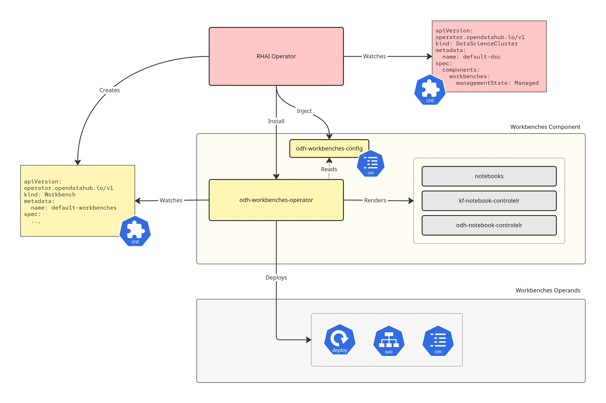
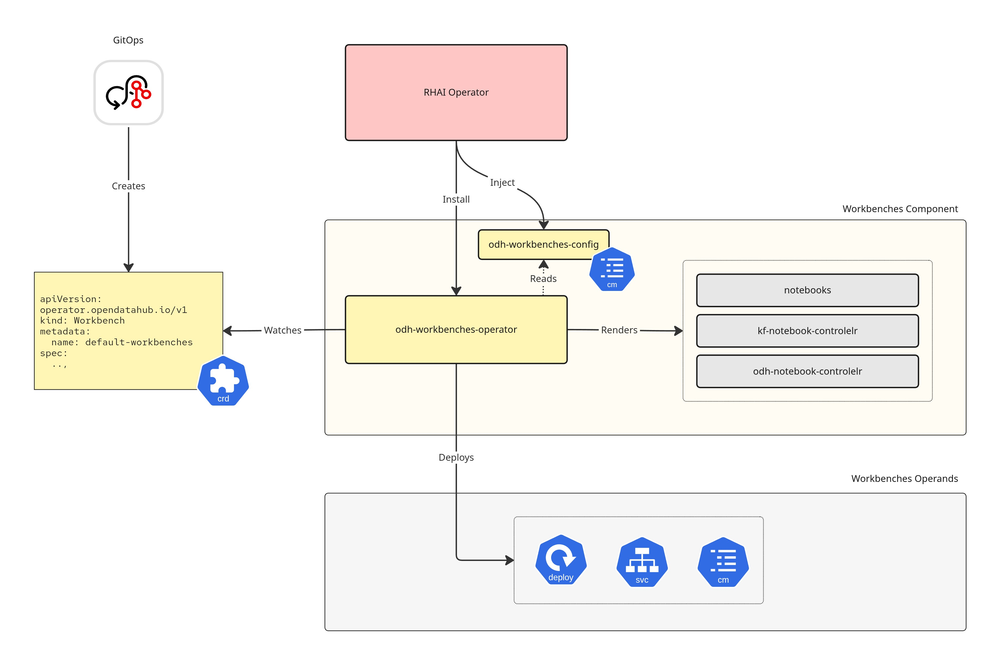

# **Onboarding Guide for ODH Operator Modules**

This document outlines the requirements and architectural standards for onboarding new modules to the Open Data Hub (ODH) Operator.

## **1\. Architectural principles & separation of concerns**

To maintain scalability and decouple lifecycles, the architecture enforces a strict separation of concerns between the **ODH Operator** (control plane) and the **module controller**.

### **Design Philosophy**

The primary driver for this architecture is to ensure modules are **as independent as possible**.

* **Standalone Design:** You should design your Module Controller as if it were a completely independent operator capable of running on a cluster without the ODH Operator.
* **Self-Sufficiency:** It must contain all the logic, manifests, and intelligence required to manage the lifecycle of its module.
* **Orchestration vs. Management:** The ODH Operator is merely an **orchestrator** that installs your operator. It does not "run" your module; your operator does.
* **Upstream & Extensibility:** The Module Controller could also act as an **extender** for the upstream component. Instead of modifying the upstream codebase to add platform-specific modules (which creates maintenance debt), the controller can implement this logic **directly** (e.g., by reconciling specific platform resources) or by deploying **sub-controllers**, **sidecars**, etc.
### **The ODH Operator (orchestrator)**

Acts as the central management interface. It does **not** manage the deep internal resources of the module (e.g., the specific Pods, Services, or Routes of the application).

**Responsibility**

* It deploys the **module controllers** (Deployment, RBAC, etc.).
* Renders platform configuration (auth, TLS, observability, networking) into each module's **ConfigMap**.
* Watches all the created resources (CRs, Deployments, etc.) having the **components.platform.opendatahub.io/managed-by** label.
* Aggregates status from the module CRs.
* Prunes owned module resources and controllers when the module is not configured, and handles module removal in case of upgrades.

The ConfigMap injection ensures the platform behaves consistently regardless of the operational mode and regardless of who owns the Module CR spec.

**DSC mode:** When the `DataScienceCluster` CR is used as the entry point, the ODH Operator additionally watches the DSC, creates/updates Module CRs based on `spec.components`, and aggregates module status back to the DSC. The ODH Operator owns the Module CR spec and will revert manual edits to maintain consistency with the DSC.


**Standalone module mode:** Modules can be used without the DSC. Users (or GitOps) create and own Module CRs directly. The ODH Operator still deploys the module controllers and projects platform configuration via ConfigMap, but does not manage Module CR lifecycle.


### **The module controller**

The domain expert for the specific module.

**Responsibility**

* Reconciles the **module CR**.
* **Installation:** Owns the manifest lifecycle (install, upgrade, delete) for the actual application.
* **Configuration merging:** Reads platform configuration from its ConfigMap and merges it with the user's spec to produce the effective configuration.
* **Environment detection:** Auto-detects cluster states (e.g., FIPS mode, disconnected environments) and adjusts the installation accordingly.
* **Status reporting:** Reports granular health and provisioning status back to the module CR.

**Status discoverability:** Any information that may be useful for other modules, controllers, or external consumers should be surfaced in the Module CR status for discoverability - for example, whether auth is enabled, which TLS mode is active, or what endpoints are available. The specific mechanism (conditions, dedicated status fields, or other approaches) is left to the module team.

## **2\. API requirements (CRD)**

Each module must provide a high-level custom resource definition (CRD).

### **2.1 Scope and metadata**

* **Scope:** Cluster
* **Cardinality:** singleton (The system expects a single instance per cluster).
* **Naming Enforcement:** To enforce the singleton pattern, the CRD **must** strictly validate the `metadata.name`. Use a CEL validation rule (preferred) or a Validating Webhook to ensure the name can **only** be a specific reserved string. The convention is `default-<module>` (e.g., `default-workbenches`, `default-kserve`).
  * **Example CEL Rule:** `self.metadata.name == 'default-workbenches'`
* **Group:**
  * `components.platform.opendatahub.io` for modules (e.g., Kserve, Workbenches)
  * `services.platform.opendatahub.io` for platform services (e.g., observability)
* **Version:** Must match the support level of the module:
  * **Developer preview:** Must use `vXalphaY` (e.g., `v1alpha1` for the first version, `v2alpha1` for a preview of version 2).
  * **Technology preview:** Must use `vXbetaY` (e.g., `v1beta1`, `v2beta1`).
  * **General availability (GA):** Must use `vX` (e.g., `v1`, `v2`).

### **2.2 Spec configuration**

The CRD `spec` is **user-owned** and represents the user's declarative intent for the module. It must adhere to standard operational patterns.

**Defaults & Validation:**

* **Requirement:** Components must strive for a "zero-config" experience. Every optional field should have a sensible **default value** that results in a working configuration.
* **Enforcement:** If a field is mandatory or requires specific formatting, strict **validation logic** (via OpenAPI schema enums, regex, or CEL validation rules) must be implemented to provide immediate feedback to the user.

**Platform configuration:**

Global platform settings (e.g., auth, TLS, observability, networking) are delivered via the module's ConfigMap (see [Section 2.4](#24-configuration-via-configmap)) and represent the platform baseline. They are **not** projected into Module CR spec fields.

The CRD schema is the access control boundary: if a field is in the spec, the user can set it. Therefore:

* Fields that must **not** be overridden by the user (e.g., TLS minimum version, auth enforcement mode) must **not** appear in the CRD spec. The ConfigMap is the only source for these values.
* Modules **may** choose to expose spec fields that overlap with platform configuration - for example, allowing the user to add additional auth audiences or override the observability log level. In this case, the module operator is responsible for merging the user's spec with the platform ConfigMap at reconciliation time.

### **2.3 Status specification (`PlatformObject`)**

For interoperability with the ODH Operator, every module CR must expose a well-defined `status` structure. In this document, `PlatformObject` refers to this required status contract, not to a literal shared Go interface or type.

**Required status fields:**

* `observedGeneration` (int64): The last generation observed by the controller.
* `conditions` (array of conditions): A list of conditions following Kubernetes condition conventions.
* `distribution` (Object): The distribution context the module is currently aligned to. Mandatory in all modes.
  * `name` (string): The distribution name (e.g., `SelfManagedRHOAI`, `OpenDataHub`, `Standalone`).
  * `version` (string): The distribution version (e.g., `3.5.1`, `0.0.0`).
* `releases` (Array of Objects): A list of installed components.
  * `name` (string): The name of the component.
  * `repoUrl` (string): The repository URL of the component.
  * `version` (string): The version of the component.

**Distribution lifecycle:**

When running as part of the platform, `status.distribution` is consumed by the ODH Operator as part of the module lifecycle contract. The module operator populates it from the ConfigMap values **only after completing any required upgrade process**. This means the module can compare the ConfigMap values (desired) against `status.distribution` (current) to determine if an upgrade is needed, perform the upgrade, and update the status once complete.

In standalone mode, this field remains part of the module status surface for informational use or consumption by another supervisor. In this mode, `name` should be `Standalone`, while `version` is module-defined (e.g., stamped at build time).

**Mandatory conditions:**

The following condition types are mandatory and are part of the supervisor contract. Modules may publish additional condition types as needed, but the condition types listed below are required because they are consumed by the ODH Operator.

* `Ready`: The top-level aggregate status.
  * `True`: The module is fully functional and available for use.
  * `False`: The module is unhealthy, installing, or has failed to provision.
* `ProvisioningSucceeded`:
  * `True`: The underlying manifests (Deployments, Services) were successfully applied.
  * `False`: An error occurred during manifest application.
  * **Aggregation:** **MUST** be aggregated into `Ready`.
* `Degraded`:
  * `True`: The module is functioning but in a degraded state.
  * `False`: The module is operating normally with no warnings.
  * The exact semantics of what constitutes a degraded state - and whether it affects readiness - are module-defined.

**Condition severity and readiness aggregation:**

In addition to standard Kubernetes condition structure, this model supports a `severity` field on conditions, following the same general idea used by Knative condition management: not every `False` condition must affect overall readiness.

The current severity model distinguishes between:

* **Error** (default): A blocking condition. A `False` or `Unknown` condition with `Error` severity contributes to overall readiness and may cause `Ready=False`.
* **Info**: A non-blocking condition. A `False` condition with `Info` severity is surfaced for visibility, but does not by itself make the module not ready.

This allows modules to report non-fatal issues without treating the entire module as unavailable. For example, an optional dependency may be reported as `False` with `Info` severity when the related feature is unavailable but the module remains otherwise usable.

The severity field also helps external observers (the ODH Operator, monitoring systems, support tooling) determine whether a `False` condition represents an actual problem requiring attention or is simply informational.

**Semantics & Examples:**

* **Ready=True, Degraded=True (Partial Availability):** The main service is up, but a non-critical sub-component is failing; for example, the Dashboard UI is accessible (Ready), but the metrics collector service is crash-looping (Degraded). Users can still work, but observability is lost/degraded.
* **Ready=False (Unusable):** The main service is down or a critical dependency is missing; for example, the Dashboard UI Deployment is 0/1 replicas. The module is not usable.
* **Aggregation:** `Degraded` does not automatically imply `Ready=False`. If the degradation renders the module unusable, it should use blocking severity and set `Ready=False`. If it is a minor or informational issue, it may remain visible without affecting readiness. The exact severity assigned to module-specific conditions is a module-level decision based on operational impact.

### **2.4 Configuration via ConfigMap**

Each module ships a dedicated ConfigMap as part of its controller manifests, in the module's namespace. As a naming convention, the ConfigMap is typically named after the module (e.g., `opendatahub-datasciencepipelines-config`), but the exact name is an implementation detail agreed between the platform and module teams. This ConfigMap contains **sensible defaults** that allow the module to work standalone without the ODH Operator.

When the module runs on a managed platform, the ODH Operator **overrides** specific keys in the ConfigMap with platform-specific values (e.g., auth mode, TLS policy, gateway configuration, platform distribution). This adapts the module to the platform without requiring changes to the module's CRD spec or code. The exact key names, number of keys, and data format are implementation details agreed between the platform and module teams.

The module operator reads its ConfigMap and deserializes the data into its own internal Go struct - no import of platform API types is required. This keeps the module decoupled from the platform operator's type system. How the module consumes the ConfigMap (volume mount, watch, polling) is an implementation detail left to the module team.

When the module runs as part of the platform, the ODH Operator **enforces** the platform-managed keys; if a user manually modifies them, the operator reverts the changes to ensure platform consistency. When the module runs standalone (without the ODH Operator), the module's shipped defaults apply and no enforcement takes place.

This pattern follows established Kubernetes precedent: CoreDNS reads `coredns` ConfigMap, kube-proxy reads `kube-proxy` ConfigMap, Istio sidecars read `istio-mesh-config`.

## **3\. Implementation requirements**

### **3.1 Manifest packaging and allowed manifests**

**Packaging:** Helm is the preferred method for packaging module controller manifests. Kustomize is supported but switching to Helm is highly encouraged. The ODH Operator renders manifests using **Helm** (template rendering only; advanced features such as hooks are not currently supported) or **Kustomize**.

The ODH operator will only install the **module controller** manifests. The module repository must provide a directory containing **only** the **minimal set of artifacts** required to bootstrap the module controller. The manifests should strictly encompass the artifacts needed to **deploy and run the module controller** (e.g., the controller Deployment, its RBAC, and the Module CRD); do **not** include application-level manifests (e.g., ModelMesh Serving runtime, Dashboard UI Deployment). These manifests are **embedded** in the ODH controller binary at **build time**, ensuring the operator is self-contained and does not require runtime network access to fetch manifests.

**Minimal manifests interface:** The manifests that the ODH Operator installs must be limited to core Kubernetes types (Deployment, ServiceAccount, ClusterRole/ClusterRoleBinding, CRD). This constraint is driven by the principle of least privilege: the ODH Operator today operates with near cluster-admin permissions, and reducing its scope to core Kubernetes types only - with no knowledge of workload-specific CRDs - is a key goal of this architecture.

**Notes:**

* The actual application manifests are **embedded** within the module controller and applied by the controller, not the ODH operator. The specific manifest types (Helm, Kustomize, plain YAML) and technical mechanism used to embed these manifests is a decision left to the module team, as long as the controller remains self-contained.

### **3.2 Deployment patterns**

The module operator is the orchestrator for its feature area: it handles upgrades, platform integration, and operand configuration. Keeping it separate from operand controllers preserves this role clearly. The following are common deployment patterns:

| Pattern | Description | When to use |
|---------|-------------|-------------|
| **Single image, multi-entrypoint** (recommended) | One repo produces one container image with multiple subcommands. 1 Deployment for the module operator + N Deployments for operand controllers. | Default choice. Single build pipeline, independent failure isolation and scaling. |
| **Multiple images, multi-Deployment** | Module operator and upstream controllers run from separate images. Module operator handles platform-specific concerns, upstream controllers remain unmodified. | Running upstream controllers alongside the module operator without forking or patching them with platform-specific logic. |
| **Single Deployment, multi-controller** (exception) | Embed module operator controller alongside operand controllers in one process. | Very simple modules where separate Deployments are not justified. Couples lifecycles and blurs the orchestrator role - treat as a tradeoff. |

### **3.3 Logic & detection**

The module controller is responsible for "smart" behavior (a dedicated set of functionalities will be provided in the form of Go modules, see [Shared Utilities Repository](#62-shared-utilities-repository)). For example, the module controller could check if the cluster has FIPS enabled and switch internal crypto libraries; the module must not rely on the ODH operator to perform "smart" behavior and pass that down.

### **3.4 Dependency management**

Modules must discover dependencies dynamically by querying the Kubernetes API for the existence and status of other Module/Component CRs.

The module controller must handle missing dependencies gracefully.

* **Optional dependency:** If missing, disable the related functionality and update the `Degraded` condition if necessary, but keep `Ready=True`.
* **Critical dependency:** If a required dependency is missing, set `Ready=False` (with a clear Reason) or `Degraded=True`, but do **not** crash the controller loop. Wait for the dependency to appear.

### **3.5 Internal Certificate Management**

Many modules require internal TLS certificates, particularly for **Admission Webhooks** or mTLS between components.

* The Module Controller should default to using **cert-manager** (we will avoid dependency on OpenShift serving certs intentionally) to provision and rotate certificates for webhooks and internal services. This ensures standard lifecycle management.

### **3.6 RBAC Permissions**

Module controllers must follow the **principle of least privilege** when defining RBAC permissions. Controllers should request only the minimum permissions required to perform their specific functions. Avoid wildcard permissions (`*`) and prefer namespace-scoped permissions (Role/RoleBinding) over cluster-scoped (ClusterRole/ClusterRoleBinding) when possible.

## **4\. Integration with DataScienceCluster (DSC)**

The ODH Operator is always present. It is responsible for installing, upgrading, and uninstalling module controllers, and for injecting platform configuration into each module's ConfigMap. This applies regardless of whether a DSC is used.

The `DataScienceCluster` (DSC) CR is an **optional** high-level entry point that controls **who creates Module CRs**:

**With DSC (e.g., RHAI):**

* The module has a stanza in the DSC, i.e., `spec.components`.
* The ODH operator reads `spec.components.mymodule` from the DSC and creates/updates the `MyModule` CR with user-facing configuration. The ODH Operator owns the DSC-projected fields and will revert manual edits to those fields.
* The `MyModule` CR is free to support additional `spec` fields that are **not** exposed in the DSC. These fields are module-owned and are not managed or reverted by the ODH Operator. This allows advanced configuration by editing the `MyModule` CR directly.
  * *Example:* Users may need to fine-tune **resource requirements** (CPU/Memory requests and limits) for the deployed controller's Pods. While these operational details are too granular for the high-level DSC, they can be exposed in the `MyModule` CR (e.g., via `spec.controllers[].resources`), allowing administrators to adjust them directly on the module level.

**Without DSC (e.g., RHAII):**

* Users or GitOps pipelines create Module CRs directly.
* The Module CR is fully self-describing - it contains all user-facing configuration without requiring DSC projection.

In both cases, platform configuration is delivered via the module's ConfigMap, not through the Module CR spec.

**Notes:**

* The exact machinery on how the DSC module stanza is generated is still to be defined; ideally, it should be auto-generated using some module manifest (such as Helm values jsonschema).

## **5\. Example reference**

### **5.1 The Module CRD**

Below is a theoretical example of what the `Workbenches` module CRD might look like. The exact semantics (field names, conditions, severity levels) should be defined by the team owning the module.

```yaml
apiVersion: components.platform.opendatahub.io/v1alpha1
kind: Workbenches
metadata:
  name: default-workbenches
spec:
  workbenchNamespace: opendatahub

status:
  observedGeneration: 1

  # Distribution context
  distribution:
    name: SelfManagedRHOAI
    version: 3.5.1

  # Component releases
  releases:
  - name: "kf-notebook-controller"
    repoUrl: "https://github.com/kubeflow/kubeflow"
    version: "v1.9.1"
  - name: "odh-notebook-controller"
    repoUrl: "https://github.com/opendatahub-io/kubeflow"
    version: "v1.9.1-odh"

  conditions:
  - type: Ready
    status: "True"
    reason: "Ready"
    message: "All workbench components are running."

  - type: ProvisioningSucceeded
    status: "True"
    reason: "ProvisioningComplete"
    message: "Manifests applied successfully."

  # Non-blocking: culling feature is unavailable but notebooks still work
  - type: Degraded
    status: "True"
    severity: Info
    reason: "CullingUnavailable"
    message: "Notebook culling controller not ready, idle notebooks will not be stopped automatically."
```

### **5.2 The ConfigMap**

The module ships a ConfigMap with default values as part of its manifests. The ODH Operator overrides platform-specific keys. The set of platform-managed keys is agreed between the platform and module teams.

```yaml
apiVersion: v1
kind: ConfigMap
metadata:
  name: odh-workbenches-config
  namespace: opendatahub-workbenches
  labels:
    platform.opendatahub.io/managed: "true"
data:
  # Example platform-managed keys (illustrative), actual keys
  # are agreed between platform and module teams
  distribution.name: SelfManagedRHOAI
  distribution.version: 3.5.1
  gateway.class: istio
  gateway.namespace: istio-system
  
  # Example module-specific keys
  controller.zap.level: info
  controller.pprof.enabled: "true"
```

### **5.3 Complete Lifecycle Flow Example**

This section provides a detailed end-to-end example demonstrating the module onboarding architecture defined in [ADR-0012](../ODH-ADR-Operator-0012-module-onboarding.md).

**Note:** This example uses the Workbenches module for illustration, consistent with the architecture diagrams. It demonstrates architectural patterns and interaction flows. The exact semantics should be defined by the team owning the module.

#### Step 1: ODH Operator Provisions Module Controller

**User Action (DSC mode):**
```yaml
apiVersion: datasciencecluster.opendatahub.io/v1
kind: DataScienceCluster
metadata:
  name: default-dsc
spec:
  components:
    workbenches:
      managementState: Managed
```

**ODH Operator Actions:**
1. Detects `workbenches.managementState: Managed`
2. Deploys Workbenches module controller resources:
   - Workbenches CRD (`workbenches.components.platform.opendatahub.io`)
   - Workbenches module controller Deployment (`odh-workbenches-operator`)
   - ServiceAccount, ClusterRole, ClusterRoleBinding (RBAC)
3. Injects platform configuration into Workbenches ConfigMap:
   ```yaml
   apiVersion: v1
   kind: ConfigMap
   metadata:
     name: odh-workbenches-config
     namespace: opendatahub-workbenches
     labels:
       platform.opendatahub.io/managed: "true"
   data:
     distribution.name: SelfManagedRHOAI
     distribution.version: 3.5.1
     monitoring.enabled: "true"
     gateway.class: istio
     gateway.namespace: istio-system
   ```

#### Step 2: ODH Operator Creates Module CR (DSC mode)

**ODH Operator Actions:**
1. Reads user configuration from `DSC.spec.components.workbenches`
2. Creates Workbenches CR with user-facing configuration:

```yaml
apiVersion: components.platform.opendatahub.io/v1alpha1
kind: Workbenches
metadata:
  name: default-workbenches
  labels:
    components.platform.opendatahub.io/managed-by: workbenches
spec:
  workbenchNamespace: opendatahub
```

#### Step 3: Module Controller Provisions Required Operands

**Workbenches Module Controller Actions:**
1. Watches for Workbenches CR creation/updates
2. Reads platform configuration from `odh-workbenches-config` ConfigMap
3. Merges platform config (from ConfigMap) with user spec (from CR) to produce effective configuration
4. Reconciles the CR and deploys operand resources:
   - `kf-notebook-controller` (manages Notebook CRDs)
   - `odh-notebook-controller` (ODH-specific notebook integration)
   - Supporting resources: Services, NetworkPolicies, Webhooks

#### Step 4: Module Controller Updates CR Status

**Workbenches Module Controller Actions:**
1. Monitors deployed operands (Deployments, Services, Webhooks)
2. Checks health of deployed operands
3. Updates Workbenches CR status:

```yaml
apiVersion: components.platform.opendatahub.io/v1alpha1
kind: Workbenches
metadata:
  name: default-workbenches
status:
  observedGeneration: 1

  distribution:
    name: SelfManagedRHOAI
    version: 3.5.1

  conditions:
    - type: Ready
      status: "True"
      reason: ComponentsReady
      message: "Workbenches ready"

    - type: ProvisioningSucceeded
      status: "True"
      reason: DeploymentSucceeded
      message: "Successfully deployed workbench controllers"

    - type: Degraded
      status: "False"
      reason: NoDegradation
      message: "All operands operating normally"

  releases:
    - name: kf-notebook-controller
      version: v1.9.1
      repoUrl: https://github.com/kubeflow/kubeflow
    - name: odh-notebook-controller
      version: v1.9.1-odh
      repoUrl: https://github.com/opendatahub-io/kubeflow
```

#### Step 5: ODH Operator Reflects Module Status in DSC

**ODH Operator Actions:**
1. Watches Workbenches CR status changes
2. Aggregates status and updates DataScienceCluster:

```yaml
apiVersion: datasciencecluster.opendatahub.io/v1
kind: DataScienceCluster
metadata:
  name: default
spec:
  components:
    workbenches:
      managementState: Managed
status:
  conditions:
    - type: WorkbenchesReady
      status: "True"
      reason: ComponentsReady
      message: "Workbenches ready"
  components:
    workbenches:
      managementState: Managed
      releases:
        - name: kf-notebook-controller
          version: v1.9.1
          repoUrl: https://github.com/kubeflow/kubeflow
        - name: odh-notebook-controller
          version: v1.9.1-odh
          repoUrl: https://github.com/opendatahub-io/kubeflow
```

#### Configuration Update Flow

**When user updates DSC:**
```yaml
spec:
  components:
    workbenches:
      managementState: Removed  # USER DISABLES WORKBENCHES
```

**Flow:**
1. ODH Operator detects DSC change
2. ODH Operator updates Workbenches CR accordingly
3. Workbenches module controller reconciles and removes operand resources
4. Workbenches module controller updates status conditions
5. ODH Operator reflects updated status back to DSC

#### Platform Configuration Enforcement Flow

**When user manually modifies platform-managed ConfigMap keys:**

```yaml
# User manually edits the ConfigMap
data:
  monitoring.enabled: "false"  # USER TRIES TO DISABLE MONITORING
```

**Flow:**
1. User manually updates the module ConfigMap
2. ODH Operator detects drift from platform configuration
3. ODH Operator reverts the ConfigMap key to the platform-enforced value (`monitoring.enabled: "true"`)
4. Module controller reconciles with correct platform configuration

#### Standalone Mode Flow

**When user creates Module CR directly (without DSC):**

```yaml
apiVersion: components.platform.opendatahub.io/v1alpha1
kind: Workbenches
metadata:
  name: default-workbenches
spec:
  workbenchNamespace: opendatahub
```

**Flow:**
1. ODH Operator has already deployed the module controller and injected platform configuration into the ConfigMap
2. User (or GitOps) creates the Workbenches CR directly
3. Workbenches module controller reads platform config from ConfigMap, merges with CR spec
4. Workbenches module controller deploys operands
5. Workbenches module controller updates CR status
6. No DSC aggregation occurs - status is only on the Module CR

#### Operand Failure Scenario

**When odh-notebook-controller operand deployment fails:**

**Workbenches Module Controller Actions:**
1. Detects `odh-notebook-controller` Deployment has 0/1 replicas ready
2. Updates Workbenches CR status:

```yaml
status:
  conditions:
    - type: Ready
      status: "False"
      reason: OperandNotReady
      message: "odh-notebook-controller not ready"

    - type: ProvisioningSucceeded
      status: "True"
      reason: DeploymentSucceeded
      message: "Provisioned"

    - type: Degraded
      status: "True"
      reason: OperandDegraded
      message: "odh-notebook-controller is not running"
```

**ODH Operator Actions (DSC mode):**
1. Reflects degraded status to DSC
2. Some notebook features unavailable until operand recovers

## **6\. Development Flexibility & Shared Utilities**

### **6.1 Implementation Freedom**

As long as the Module Controller adheres to the expectations and architectural contracts described in this guide (CRD API, Status reporting, separation of concerns), developers are **free to implement the operator following the rules and patterns they prefer**. The strictness of this guide applies to the **interfaces** (how the ODH Operator interacts with your module), not the internal implementation details of your controller logic.

### **6.2 Shared Utilities Repository** {#6.2-shared-utilities-repository}

To facilitate the development of module controllers, the OpenShift AI Core Platform team maintains the [odh-platform-utilities](https://github.com/opendatahub-io/odh-platform-utilities) repository. This library provides common Go modules extracted from the ODH Operator to accelerate module controller development and ensure consistency across modules.

Key areas covered include:

* **Reconciliation framework** - the same action pipeline pattern used by the ODH Operator itself, extracted as a reusable library. Composes reconciliation steps (render, deploy, garbage collection) as a sequence of functions sharing state through a `ReconciliationRequest`, with built-in condition management and error handling
* **Platform contract** - `PlatformObject` interface, status types, condition constants
* **Metadata conventions** - standard labels and annotations for platform integration
* **Cluster detection** - cluster type, OpenShift version, FIPS mode, platform variant, CRD existence checks
* **Manifest rendering** - Helm, Kustomize, Go templates, with caching support
* **Deploy and lifecycle** - resource deployment with drift detection, merge strategies, and garbage collection
* **Resource helpers** - Kubernetes resource decoding, label/annotation application

Teams can use the full framework or call individual packages standalone. See the [repository README](https://github.com/opendatahub-io/odh-platform-utilities/blob/main/README.md) and per-package documentation for full details.

**Note:** Usage of this shared code is optional but highly recommended to reduce boilerplate and ensure consistency across modules.
