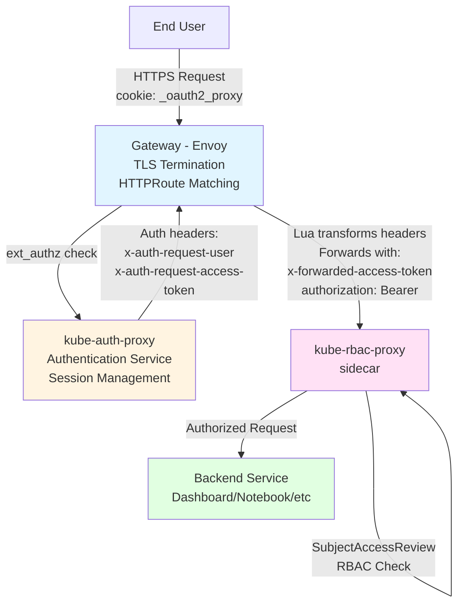
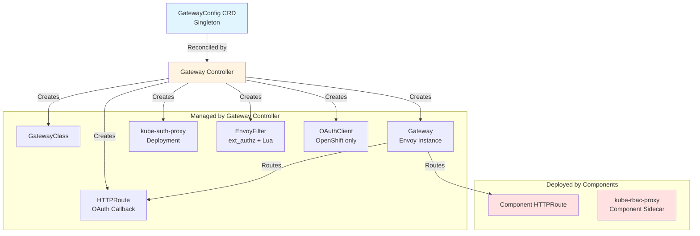
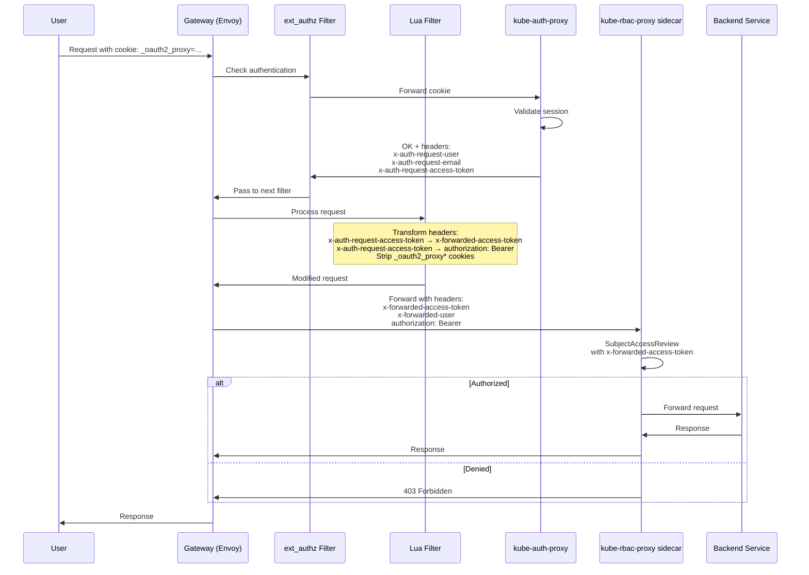
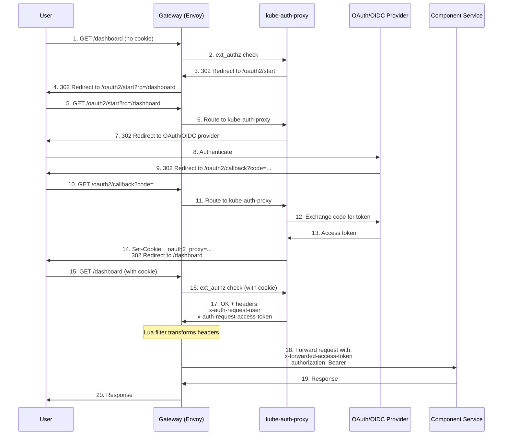
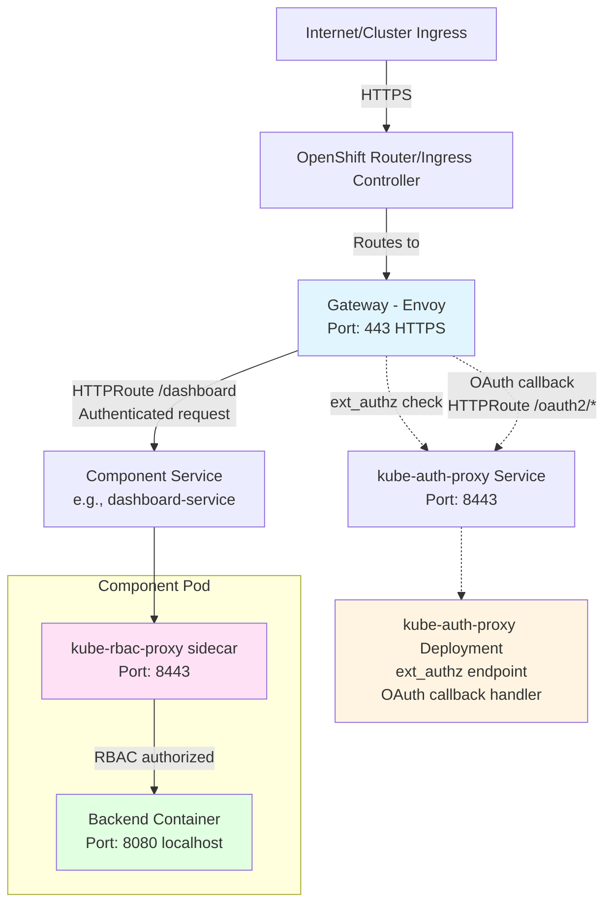

# OpenDataHub Gateway Architecture

## Overview

The OpenDataHub Gateway provides a unified, centralized entry point for accessing data science components in OpenDataHub and RHOAI (Red Hat OpenShift AI) deployments. It consolidates authentication, authorization, and routing through a single gateway using the Kubernetes Gateway API.

### Key Benefits

- **Unified Access Point**: Single domain with clean URL paths (e.g., `odh.example.com/dashboard`, `odh.example.com/notebook`)
- **Centralized Authentication**: Consistent authentication across all components
- **Flexible Auth Providers**: Supports both OpenShift Integrated OAuth and external OIDC providers
- **Security Hardening**: Pod Security Standards compliant (restricted profile)
- **Native Kubernetes**: Built on standard Gateway API (no vendor lock-in)

### When to Use

The Gateway is automatically deployed as a platform service when OpenDataHub/RHOAI is installed. Users configure it via the singleton `GatewayConfig` custom resource named `default-gateway`.

---

## Architecture Overview

### High-Level Architecture



**Key Points**:
- **Envoy (Gateway)** is the only component that forwards requests to upstream services
- **kube-auth-proxy** is called by Envoy's ext_authz filter for authentication (returns headers, not traffic)
- **Envoy's Lua filter** transforms headers and forwards to component services
- **kube-rbac-proxy sidecar** performs RBAC authorization before backend

### Component Interaction



### Request Flow (Detailed)

1. **Request Arrives**: User request hits Gateway (Envoy) with path like `/dashboard`
2. **HTTPRoute Matching**: Gateway routes request based on path to component service
3. **ext_authz Filter Triggered**: Envoy's external authorization filter intercepts request
4. **Authentication Check**: ext_authz calls kube-auth-proxy
   - If unauthenticated: kube-auth-proxy returns redirect response to OAuth/OIDC provider
   - User authenticates, OAuth redirects back to `/oauth2/callback` (routed to kube-auth-proxy via HTTPRoute)
   - kube-auth-proxy exchanges code for token, creates session cookie, redirects to original URL
   - If authenticated: kube-auth-proxy validates session cookie
5. **Auth Headers Returned**: kube-auth-proxy returns to ext_authz with headers:
   - `x-auth-request-user`: Authenticated username
   - `x-auth-request-email`: User email
   - `x-auth-request-access-token`: Kubernetes access token
6. **Header Transformation**: Envoy's Lua filter transforms headers:
   - `x-auth-request-access-token` → `x-forwarded-access-token`
   - `x-auth-request-access-token` → `authorization: Bearer <token>`
   - Strips `_oauth2_proxy*` cookies from request
7. **Forward to Component**: Envoy forwards request to component service with transformed headers
8. **RBAC Authorization**: Component's kube-rbac-proxy sidecar:
   - Extracts token from `x-forwarded-access-token` header
   - Performs SubjectAccessReview against Kubernetes RBAC
   - Validates user has required permissions
9. **Backend Access**: If authorized, kube-rbac-proxy forwards to backend service on localhost
10. **Response**: Response travels back through sidecar → Envoy → user

---

## Core Components

### 1. GatewayConfig (Custom Resource)

**API**: `services.opendatahub.io/v1alpha1`
**Kind**: `GatewayConfig`
**Scope**: Cluster-scoped
**Instance Name**: `default-gateway` (singleton enforced via CEL validation)

The `GatewayConfig` is the primary configuration interface for the gateway. Users configure authentication, certificates, domain, and other gateway settings through this resource.

**Key Responsibilities**:
- Define authentication mode (auto-detected: OpenShift OAuth vs OIDC)
- Configure OIDC provider details (if external OIDC)
- Specify custom domain/subdomain
- Configure certificate management strategy
- Set cookie and auth timeout settings

**Reference**: [GatewayConfig API Types](../api/services/v1alpha1/gateway_types.go)

### 2. Gateway Controller

**Location**: `internal/controller/services/gateway/`

The Gateway Controller is a Kubernetes controller that watches `GatewayConfig` resources and reconciles the desired state by creating and managing gateway infrastructure.

**Key Responsibilities**:
- Reconcile `GatewayConfig` changes
- Create and manage Gateway API resources (GatewayClass, Gateway)
- Deploy and configure kube-auth-proxy
- Manage authentication secrets
- Handle certificate lifecycle
- Create service mesh integration (EnvoyFilter, DestinationRule) if Istio is present
- Manage OAuth callback routes
- Update status conditions

**Owned Resources**:
- `GatewayClass` (Gateway API)
- `Gateway` (Gateway API)
- `HTTPRoute` (OAuth callback route only - component routes managed separately)
- `Deployment` (kube-auth-proxy)
- `Service` (kube-auth-proxy)
- `Secret` (kube-auth-proxy credentials)
- `OAuthClient` (OpenShift OAuth integration, conditional)
- `EnvoyFilter` (Service mesh integration, conditional)
- `DestinationRule` (Service mesh integration, conditional)

**Reference**: [Gateway Controller](../internal/controller/services/gateway/gateway_controller.go)

### 3. kube-auth-proxy (Centralized Authentication Service)

**Repository**: [opendatahub-io/kube-auth-proxy](https://github.com/opendatahub-io/kube-auth-proxy)
**Deployment Name**: `kube-rbac-proxy` (deployment name in cluster)
**Namespace**: `opendatahub` (or platform namespace)
**Type**: Centralized authentication proxy (one instance per gateway)

kube-auth-proxy is a custom disconnected fork of oauth2-proxy, specifically tailored for OpenDataHub/RHOAI authentication needs. It handles centralized authentication for all components behind the gateway.

**Key Responsibilities**:
- **Authentication**: Authenticate users via OpenShift OAuth or external OIDC providers
- **Session Management**: Create and manage encrypted session cookies
- **Token Management**: Validate, refresh, and exchange OAuth tokens
- **External Authorization**: Act as ext_authz endpoint for Envoy filters
- **Header Injection**: Add authentication headers to requests:
  - `x-forwarded-access-token`: Access token for downstream RBAC
  - `x-forwarded-user`: Authenticated username
  - `Authorization`: Bearer token
- **OAuth Callback**: Handle OAuth/OIDC callback flows
- **Metrics**: Expose Prometheus metrics

**Differences from upstream oauth2-proxy**:
- Custom disconnected fork maintained by OpenDataHub team
- Optimized for Kubernetes/OpenShift environments
- Integration with kube-rbac-proxy for RBAC authorization
- Enhanced header forwarding for Kubernetes auth

**Security Features**:
- Runs as non-root user
- Read-only root filesystem
- No privilege escalation
- All Linux capabilities dropped
- Runtime default seccomp profile
- Memory-backed `/tmp` volume (10Mi limit)

**Configuration**:
- Configured via command-line arguments (built by `buildOAuth2ProxyArgs`)
- Secrets mounted from `kube-rbac-proxy-secret`:
  - `client-id`: OAuth/OIDC client ID
  - `client-secret`: OAuth/OIDC client secret
  - `cookie-secret`: Cookie encryption key (auto-generated)
- TLS certificates from OpenShift service CA

**Reference**:
- [Deployment Code](../internal/controller/services/gateway/gateway_support.go#L591-L715)
- [GitHub Repository](https://github.com/opendatahub-io/kube-auth-proxy)

### 4. Gateway API Resources

The gateway leverages standard Kubernetes Gateway API resources:

#### GatewayClass
- **Name**: `data-science-gateway`
- **Controller**: `openshift.io/gateway-controller/v1`
- **Purpose**: Defines the gateway implementation (OpenShift's Istio-based gateway)

#### Gateway
- **Name**: `data-science-gateway`
- **Namespace**: `opendatahub`
- **Listeners**: HTTPS listener on port 443 with TLS
- **Hostname**: `data-science-gateway.{domain}` (configurable)
- **Purpose**: Actual ingress gateway instance

#### HTTPRoute
- **OAuth Callback Route**: Routes OAuth callback path (`/oauth2/callback`) to kube-auth-proxy
- **Component Routes**: Created by individual components (not managed by gateway controller)

**Reference**: [Kubernetes Gateway API](https://gateway-api.sigs.k8s.io/)

### 5. Service Mesh Integration (Conditional)

If Istio or OpenShift Service Mesh is installed, the gateway creates additional resources for deeper integration:

#### EnvoyFilter (ext_authz)

The EnvoyFilter resource (`authn-filter`) deployed in the `openshift-ingress` namespace injects two critical filters into the Envoy gateway:

**1. External Authorization Filter (ext_authz)**

- **Purpose**: Intercepts all HTTP requests for authentication
- **Endpoint**: `https://kube-auth-proxy.openshift-ingress.svc.cluster.local:8443/oauth2/auth`
- **Transport**: HTTP service (not gRPC)
- **Timeout**: Configurable via `spec.authTimeout` or `GATEWAY_AUTH_TIMEOUT` env var (default: 5s)
- **TLS**: Uses service account CA certificate for verification
- **SNI**: `kube-auth-proxy.openshift-ingress.svc.cluster.local`

**Allowed Headers**:
- **Incoming (to auth proxy)**: `cookie` - preserves session cookies during authentication
- **Outgoing (to client)**: `set-cookie` - allows auth proxy to set session cookies
- **Outgoing (to upstream)**:
  - `x-auth-request-user` - authenticated username
  - `x-auth-request-email` - user email
  - `x-auth-request-access-token` - Kubernetes access token

**2. Lua Filter (Header Transformation & Cookie Stripping)**

The Lua filter performs critical post-authentication processing:

**Behavior**:
```lua
function envoy_on_request(request_handle)
  local access_token = request_handle:headers():get("x-auth-request-access-token")

  if access_token then
    -- Transform headers for upstream services
    request_handle:headers():add("x-forwarded-access-token", access_token)
    request_handle:headers():replace("authorization", "Bearer " .. access_token)

    -- Strip OAuth2 proxy cookies (prevents leakage to components)
    -- Handles both main cookie (_oauth2_proxy) and split cookies (_oauth2_proxy_1, _oauth2_proxy_2)
    -- Only strips cookies when forwarding to upstream (not during auth check)
  end
end
```

**Key Points**:
- **Conditional Processing**: Only processes requests with `x-auth-request-access-token` header (indicating successful authentication)
- **Cookie Preservation**: Preserves cookies during ext_authz call to auth proxy (needed for session validation)
- **Cookie Stripping**: Removes `_oauth2_proxy*` cookies when forwarding to upstream services
- **Split Cookie Handling**: Pattern `^_oauth2_proxy` matches split cookies (`_oauth2_proxy_1`, `_oauth2_proxy_2`, etc.) created when cookie size exceeds limits
- **Header Transformation**: Converts `x-auth-request-access-token` to `x-forwarded-access-token` and `authorization` headers for components

**Cluster Configuration**:
```yaml
name: kube-auth-proxy
type: STRICT_DNS
connect_timeout: 5s  # Configurable
transport_socket:
  name: envoy.transport_sockets.tls
  validation_context:
    trusted_ca:
      filename: /var/run/secrets/kubernetes.io/serviceaccount/service-ca.crt
```

#### DestinationRule
- **Purpose**: Configures traffic policies for kube-auth-proxy service
- **Behavior**: Ensures proper load balancing and TLS settings for auth proxy communication

**Detection**: Service mesh resources are only created if the corresponding CRDs exist in the cluster.

**Workload Selector**: Targets gateway pods with label `gateway.networking.k8s.io/gateway-name: data-science-gateway`

**Reference**:
- [Auth Actions](../internal/controller/services/gateway/gateway_auth_actions.go)
- [EnvoyFilter Template](../internal/controller/services/gateway/resources/envoyfilter-authn.yaml)

### 6. kube-rbac-proxy (Component Sidecars)

**Repository**: [brancz/kube-rbac-proxy](https://github.com/brancz/kube-rbac-proxy)
**Type**: Sidecar container in each component pod
**Purpose**: RBAC authorization enforcement

kube-rbac-proxy is deployed as a sidecar in each data science component pod to enforce Kubernetes RBAC policies.

**Key Responsibilities**:
- **RBAC Authorization**: Perform SubjectAccessReview against Kubernetes RBAC
- **Token Validation**: Extract and validate bearer tokens from request headers
- **Permission Enforcement**: Ensure authenticated user has required permissions
- **Reverse Proxy**: Forward authorized requests to backend component service

**How It Works**:
1. Receives request from gateway with `x-forwarded-access-token` header
2. Extracts token from header
3. Performs Kubernetes SubjectAccessReview:
   ```yaml
   apiVersion: authorization.k8s.io/v1
   kind: SubjectAccessReview
   spec:
     resourceAttributes:
       namespace: <component-namespace>
       verb: get
       resource: <component-resource>
     user: <user-from-token>
   ```
4. If authorized: forwards request to backend service on localhost
5. If denied: returns 403 Forbidden

**Deployment Pattern**:
Each component pod includes kube-rbac-proxy as a sidecar:

```yaml
spec:
  containers:
    - name: kube-rbac-proxy
      image: quay.io/brancz/kube-rbac-proxy:latest
      args:
        - --secure-listen-address=0.0.0.0:8443
        - --upstream=http://127.0.0.1:8080
        - --tls-cert-file=/etc/tls/tls.crt
        - --tls-private-key-file=/etc/tls/tls.key
        - --auth-token-audiences=<audience>
      ports:
        - containerPort: 8443
          name: https
    - name: backend-service
      image: <component-image>
      ports:
        - containerPort: 8080  # Backend listens on localhost only
```

**Component Responsibilities**:
- Components must deploy their own kube-rbac-proxy sidecar
- Configure RBAC rules (Roles/ClusterRoles) for their resources
- Backend service should listen only on localhost (not exposed externally)
- Service points to kube-rbac-proxy port (8443), not backend port

**Reference**: [kube-rbac-proxy Documentation](https://github.com/brancz/kube-rbac-proxy)

---

## Authentication vs Authorization

The gateway implements a clear separation between **authentication** and **authorization**:

### Authentication (Who are you?)
**Handled by**: kube-auth-proxy (centralized)
**Mechanism**: OpenShift OAuth or external OIDC
**Purpose**: Verify user identity and establish session
**Output**: Authenticated session with access token

### Authorization (What can you do?)
**Handled by**: kube-rbac-proxy (per-component sidecar)
**Mechanism**: Kubernetes RBAC (SubjectAccessReview)
**Purpose**: Enforce fine-grained permissions per component
**Output**: Allow/Deny decision based on Kubernetes RBAC policies

### Why This Separation?

1. **Centralized Auth, Distributed Authz**: Authentication happens once at the gateway, but authorization is enforced at each component based on specific RBAC rules
2. **Scalability**: Components can have different permission models without modifying central auth
3. **Kubernetes-Native**: Leverages existing Kubernetes RBAC infrastructure
4. **Defense in Depth**: Even if gateway is bypassed, components enforce their own authorization

### Request Headers Flow



**Key Points**:
- **Envoy** manages all request/response traffic - never bypassed
- **ext_authz filter** calls kube-auth-proxy for authentication (synchronous check)
- **Lua filter** transforms headers in-line within Envoy (not a separate service call)
- **kube-rbac-proxy sidecar** receives traffic from Envoy, not from kube-auth-proxy

---

## Authentication

The gateway supports three authentication modes, automatically detected based on the cluster's Authentication configuration resource (`authentication.config.openshift.io/cluster`):

### Authentication Modes

1. **IntegratedOAuth** (`AuthModeIntegratedOAuth`)
   - Default mode for standard OpenShift clusters
   - Uses OpenShift's built-in OAuth server
   - Detected when `Authentication.Spec.Type` is `IntegratedOAuth` or empty (default)

2. **OIDC** (`AuthModeOIDC`)
   - External OIDC provider authentication
   - Used in ROSA clusters or clusters with external identity providers
   - Detected when `Authentication.Spec.Type` is `OIDC`
   - Requires `GatewayConfig.spec.oidc` configuration

3. **None** (`AuthModeNone`)
   - No authentication (external auth handling)
   - Detected when `Authentication.Spec.Type` is `None`
   - **Not supported** - controller returns error if detected
   - Use case: Clusters with externally managed authentication

**Auto-Detection**: The controller queries `authentication.config.openshift.io/cluster` resource during reconciliation to determine the mode. No manual configuration needed for IntegratedOAuth mode.

---

### OpenShift Integrated OAuth

**When Used**: Default authentication method on standard OpenShift clusters

**How It Works**:
1. kube-auth-proxy configured with `--provider=openshift`
2. Uses OpenShift's built-in OAuth server
3. OAuthClient resource created with:
   - Client ID: `data-science`
   - Redirect URI: `https://{gateway-domain}/oauth2/callback`
   - Grant method: Auto-grant
4. User redirects to OpenShift login
5. After authentication, user is redirected back with authorization code
6. kube-auth-proxy exchanges code for access token
7. Session established with encrypted cookie

**Scopes**: `user:full` (full user access)

**Configuration**: Automatic (no user configuration needed)

### External OIDC

**When Used**:
- ROSA (Red Hat OpenShift on AWS) clusters
- Clusters configured with external identity providers
- Explicitly configured via `GatewayConfig.spec.oidc`

**How It Works**:
1. kube-auth-proxy configured with `--provider=oidc`
2. User provides OIDC configuration in GatewayConfig:
   - Issuer URL
   - Client ID
   - Client Secret (via Secret reference)
3. User redirects to external OIDC provider
4. After authentication, authorization code returned
5. kube-auth-proxy exchanges code for access token
6. Session established with encrypted cookie

**Required Configuration**:
```yaml
apiVersion: services.opendatahub.io/v1alpha1
kind: GatewayConfig
metadata:
  name: default-gateway
spec:
  oidc:
    issuerURL: "https://your-oidc-provider.com"
    clientID: "your-client-id"
    clientSecretRef:
      name: oidc-client-secret
      key: client-secret
```

**OIDC Provider Setup**: Requires registering OAuth application with redirect URI: `https://{gateway-domain}/oauth2/callback`

### Authentication Flow



**Key Points**:
- All traffic flows through **Envoy** - it's the only component that talks to upstream services
- **kube-auth-proxy** is called by Envoy in two ways:
  1. **ext_authz filter**: For authentication checks (returns OK + headers or redirect)
  2. **HTTPRoute**: For OAuth flow endpoints (`/oauth2/*` paths)
- Envoy's **Lua filter** transforms headers after successful ext_authz before forwarding to components

### Session Management

**Cookie Settings**:
- **Name**: `_oauth2_proxy` (or `_oauth2_proxy_N` for splits)
- **Attributes**:
  - `HttpOnly`: Prevents JavaScript access
  - `Secure`: HTTPS only
  - `SameSite=Lax`: CSRF protection
- **Expiration**: Configurable via `GatewayConfig.spec.cookie.expire` (default: 24h)
- **Refresh**: Configurable via `GatewayConfig.spec.cookie.refresh` (default: 1h)

**Token Refresh**:
- kube-auth-proxy periodically refreshes access tokens
- Refresh interval must be less than OIDC provider's token lifespan
- Failed refresh triggers re-authentication

### Authorization Headers

**Headers from kube-auth-proxy (ext_authz response)**:
```
x-auth-request-user: {username}
x-auth-request-email: {user_email}
x-auth-request-access-token: {k8s_service_account_token}
```

**Headers transformed by Lua filter for upstream services**:
```
x-forwarded-access-token: {k8s_service_account_token}  (from x-auth-request-access-token)
x-forwarded-user: {username}  (preserved from x-auth-request-user)
authorization: Bearer {k8s_service_account_token}
```

**Header Usage**:
- `x-forwarded-access-token` - Used by kube-rbac-proxy sidecars for SubjectAccessReview
- `x-forwarded-user` - Available for logging, auditing, or application use
- `authorization` - Standard Bearer token for applications that validate tokens directly
- `x-auth-request-email` - User email (available in request context, may not be forwarded)

These headers are automatically managed by the gateway infrastructure - components receive them without any configuration.

---

## Security Model

### Pod Security Standards Compliance

The kube-auth-proxy deployment adheres to Kubernetes **Pod Security Standards (restricted profile)**:

#### Pod-Level Security Context
```yaml
securityContext:
  runAsNonRoot: true
  seccompProfile:
    type: RuntimeDefault
```

#### Container-Level Security Context
```yaml
securityContext:
  readOnlyRootFilesystem: true
  allowPrivilegeEscalation: false
  capabilities:
    drop:
      - ALL
```

**Security Rationale**:
- **RunAsNonRoot**: Prevents root execution, reducing attack surface
- **ReadOnlyRootFilesystem**: Provides immutable container filesystem
- **AllowPrivilegeEscalation**: Blocked to prevent privilege escalation attacks
- **Capabilities Dropped**: All Linux capabilities removed for minimal permissions
- **Seccomp Profile**: Runtime default profile for syscall filtering

**Reference**: [Security Context Documentation](../internal/controller/services/gateway/gateway_support.go#L591-L597)

### Temporary Storage

Since the root filesystem is read-only, a temporary volume is provided:

```yaml
volumes:
  - name: tmp
    emptyDir:
      medium: Memory
      sizeLimit: 10Mi
volumeMounts:
  - name: tmp
    mountPath: /tmp
```

**Purpose**: kube-auth-proxy session storage
**Type**: Memory-backed (ephemeral)
**Size Limit**: 10Mi (minimizes attack surface while providing sufficient space)

### Certificate Management

The gateway supports three certificate strategies:

#### 1. OpenShift Default Ingress (Default)

**When Used**: Default on OpenShift clusters
**How It Works**:
- Uses cluster's default ingress wildcard certificate
- Automatically configured
- Certificate managed by cluster administrator

**Configuration**: None required (automatic)

#### 2. Self-Signed Certificate

**When Used**: Development/testing environments
**How It Works**:
- Gateway controller generates self-signed certificate
- Certificate stored in Secret
- **Warning**: Not suitable for production (browsers will show warnings)

**Configuration**:
```yaml
spec:
  certificate:
    type: SelfSigned
```

#### 3. Provided Certificate

**When Used**: Production with custom domain or corporate certificates
**How It Works**:
- User creates Secret with TLS certificate and key
- Gateway references the Secret

**Configuration**:
```yaml
spec:
  certificate:
    type: Provided
    secretName: my-tls-cert
```

**Secret Format**:
```yaml
apiVersion: v1
kind: Secret
metadata:
  name: my-tls-cert
  namespace: opendatahub
type: kubernetes.io/tls
data:
  tls.crt: <base64-encoded-cert>
  tls.key: <base64-encoded-key>
```

### Secret Management

**kube-auth-proxy Secrets**:
- **Name**: `kube-rbac-proxy-secret`
- **Contents**:
  - `client-id`: OAuth/OIDC client ID
  - `client-secret`: OAuth/OIDC client secret
  - `cookie-secret`: Cookie encryption key (auto-generated)
- **Auto-rotation**: Cookie secret hashed and added to Deployment annotations to trigger pod restart on changes

**OIDC Client Secret**:
- User-provided Secret referenced in `GatewayConfig.spec.oidc.clientSecretRef`
- Key defaults to `client-secret` unless specified

---

## Configuration Reference

### GatewayConfig Specification

#### Complete Example

```yaml
apiVersion: services.opendatahub.io/v1alpha1
kind: GatewayConfig
metadata:
  name: default-gateway  # Must be "default-gateway" (singleton)
spec:
  # OIDC Configuration (optional - for external OIDC providers)
  oidc:
    issuerURL: "https://keycloak.example.com/realms/myrealm"
    clientID: "opendatahub"
    clientSecretRef:
      name: oidc-client-secret
      key: client-secret

  # Certificate Configuration (optional)
  certificate:
    type: Provided
    secretName: custom-tls-cert

  # Domain Configuration (optional)
  domain: "apps.example.com"

  # Subdomain Configuration (optional)
  # Defaults to "data-science-gateway"
  subdomain: "ai-gateway"

  # Cookie Configuration (optional)
  cookie:
    expire: "24h"   # Session cookie lifetime
    refresh: "1h"   # Token refresh interval

  # Auth Timeout (optional)
  # Envoy timeout for auth proxy responses
  authTimeout: "5s"
```

#### Field Descriptions

| Field | Type | Required | Default | Description |
|-------|------|----------|---------|-------------|
| `oidc` | Object | No | - | OIDC provider configuration. Only required for external OIDC auth. |
| `oidc.issuerURL` | String | Yes* | - | OIDC issuer URL (e.g., `https://keycloak.example.com/realms/myrealm`) |
| `oidc.clientID` | String | Yes* | - | OIDC client ID |
| `oidc.clientSecretRef` | SecretKeySelector | Yes* | - | Reference to Secret containing client secret |
| `certificate` | Object | No | - | Certificate management configuration |
| `certificate.type` | String | No | `OpenshiftDefaultIngress` | Certificate type: `OpenshiftDefaultIngress`, `SelfSigned`, or `Provided` |
| `certificate.secretName` | String | Yes** | - | Secret name for `Provided` certificate type |
| `domain` | String | No | Cluster ingress domain | Custom domain for gateway (e.g., `apps.example.com`) |
| `subdomain` | String | No | `data-science-gateway` | Subdomain prefix (must be DNS-compliant, max 63 chars) |
| `cookie.expire` | Duration | No | `24h` | Session cookie lifetime |
| `cookie.refresh` | Duration | No | `1h` | Token refresh interval (must be < OIDC token lifespan) |
| `authTimeout` | Duration | No | `5s` | Envoy timeout for auth proxy responses |

\* Required if using OIDC authentication
\*\* Required if `certificate.type` is `Provided`

#### Duration Format

Duration fields accept Go duration strings:
- `ns` - nanoseconds
- `us` / `µs` - microseconds
- `ms` - milliseconds
- `s` - seconds
- `m` - minutes
- `h` - hours

Examples: `30s`, `5m`, `2h`, `24h`, `1h30m`

---

## Deployment Topology

### Namespace Layout

```
opendatahub (or redhat-ods-applications)
├── GatewayClass: data-science-gateway
├── Gateway: data-science-gateway
├── HTTPRoute: oauth-callback (OAuth callback route)
├── Deployment: kube-rbac-proxy (kube-auth-proxy deployment)
├── Service: kube-rbac-proxy (kube-auth-proxy service)
├── Secret: kube-rbac-proxy-secret (auth credentials)
├── Secret: kube-rbac-proxy-tls (service CA)
├── OAuthClient: data-science (if OpenShift OAuth)
├── EnvoyFilter: auth-filter (ext_authz, if service mesh present)
└── DestinationRule: kube-rbac-proxy (if service mesh present)
```

### Resource Ownership

The Gateway Controller uses Kubernetes owner references to manage resource lifecycle:

**Owner**: `GatewayConfig/default-gateway`

**Owned Resources** (automatically deleted when GatewayConfig is deleted):
- All resources listed above
- Field owner: `platform.opendatahub.io` (for Server-Side Apply)

### Resource Creation Order

1. **Gateway Infrastructure**:
   - GatewayClass
   - Gateway
   - Certificates (if needed)

2. **Authentication Service**:
   - kube-auth-proxy Secret
   - kube-auth-proxy Service (for service CA cert injection)
   - kube-auth-proxy Deployment
   - OAuthClient (if OpenShift OAuth)

3. **Routing**:
   - OAuth callback HTTPRoute

4. **Service Mesh** (conditional):
   - EnvoyFilter
   - DestinationRule

### Network Topology



**Key Points**:
- **Solid lines**: Actual traffic flow
- **Dotted lines**: Authentication checks (ext_authz) and OAuth callbacks
- **Gateway (Envoy)** routes traffic to **component services**, not to kube-auth-proxy
- **kube-auth-proxy** is called by ext_authz filter and for OAuth callbacks only
- **Component service** points to kube-rbac-proxy sidecar port (8443)

---

## Integration Points

### How Components Integrate with Gateway

Components integrate with the gateway by creating HTTPRoute resources that reference the gateway.

#### HTTPRoute Creation Pattern

```yaml
apiVersion: gateway.networking.k8s.io/v1
kind: HTTPRoute
metadata:
  name: dashboard-route
  namespace: opendatahub
spec:
  parentRefs:
    - name: data-science-gateway
      namespace: opendatahub
  hostnames:
    - "data-science-gateway.apps.example.com"
  rules:
    - matches:
        - path:
            type: PathPrefix
            value: /dashboard
      backendRefs:
        - name: dashboard-service
          port: 8080
```

**Key Points**:
- `parentRefs` references the gateway created by the controller
- `hostnames` must match the gateway's hostname
- `matches.path` defines the URL path for the component
- `backendRefs` points to the component's Service

### Service Mesh Integration (Optional)

If Istio or OpenShift Service Mesh is installed, additional integration is available:

#### EnvoyFilter for External Authorization

The gateway creates an EnvoyFilter that:
1. Intercepts HTTP requests to protected components
2. Calls kube-auth-proxy external authorization endpoint (ext_authz)
3. Evaluates authentication before forwarding to component
4. Transforms headers via Lua filter (`x-auth-request-*` → `x-forwarded-*`, `authorization`)
5. Strips OAuth cookies from upstream requests (Lua filter)
6. Passes authorization headers to components

**Applied To**: Gateway workloads with label `gateway.networking.k8s.io/gateway-name: data-science-gateway`

### Component Requirements

Components integrating with the gateway **must** deploy a kube-rbac-proxy sidecar for RBAC authorization. Here's what's required:

#### 1. Deploy kube-rbac-proxy Sidecar

Every component pod must include a kube-rbac-proxy sidecar container:

```yaml
apiVersion: apps/v1
kind: Deployment
metadata:
  name: my-component
spec:
  template:
    spec:
      containers:
        # kube-rbac-proxy sidecar (REQUIRED)
        - name: kube-rbac-proxy
          image: quay.io/brancz/kube-rbac-proxy:latest
          args:
            - --secure-listen-address=0.0.0.0:8443
            - --upstream=http://127.0.0.1:8080  # Backend on localhost
            - --tls-cert-file=/etc/tls/tls.crt
            - --tls-private-key-file=/etc/tls/tls.key
            - --auth-token-audiences=openshift  # Or your audience
          ports:
            - containerPort: 8443
              name: https
              protocol: TCP
          volumeMounts:
            - name: tls
              mountPath: /etc/tls
              readOnly: true

        # Your backend service
        - name: backend
          image: my-component:latest
          ports:
            - containerPort: 8080  # Listen on localhost only
              name: http
              protocol: TCP

      volumes:
        - name: tls
          secret:
            secretName: my-component-tls
```

#### 2. Configure Service to Point to Sidecar

The Kubernetes Service must point to the kube-rbac-proxy port, not the backend:

```yaml
apiVersion: v1
kind: Service
metadata:
  name: my-component
spec:
  ports:
    - name: https
      port: 443
      targetPort: 8443  # kube-rbac-proxy port, NOT backend port
      protocol: TCP
  selector:
    app: my-component
```

#### 3. Create RBAC Rules

Define Kubernetes RBAC rules for your component:

```yaml
apiVersion: rbac.authorization.k8s.io/v1
kind: ClusterRole
metadata:
  name: my-component-access
rules:
  - apiGroups: [""]
    resources: ["services"]
    resourceNames: ["my-component"]
    verbs: ["get"]
---
apiVersion: rbac.authorization.k8s.io/v1
kind: ClusterRoleBinding
metadata:
  name: my-component-users
roleRef:
  apiGroup: rbac.authorization.k8s.io
  kind: ClusterRole
  name: my-component-access
subjects:
  - kind: Group
    name: system:authenticated  # Or specific groups/users
    apiGroup: rbac.authorization.k8s.io
```

#### 4. Create HTTPRoute

Register your component's URL path:

```yaml
apiVersion: gateway.networking.k8s.io/v1
kind: HTTPRoute
metadata:
  name: my-component-route
  namespace: opendatahub
spec:
  parentRefs:
    - name: data-science-gateway
      namespace: opendatahub
  hostnames:
    - "data-science-gateway.apps.example.com"
  rules:
    - matches:
        - path:
            type: PathPrefix
            value: /my-component
      backendRefs:
        - name: my-component
          port: 443  # Service port (kube-rbac-proxy)
```

#### 5. Backend Service Requirements

Your backend service should:
- **Listen on localhost only** (127.0.0.1:8080) - not exposed externally
- **Accept requests without authentication** - kube-rbac-proxy handles auth
- **Optional**: Inspect forwarded headers for user info:
  - `x-forwarded-user`: Authenticated username
  - `x-forwarded-access-token`: Access token

### Domain Resolution

**Gateway Hostname Construction**:
```
{subdomain}.{domain}
```

**Examples**:
- Default: `data-science-gateway.apps.cluster.example.com`
- Custom domain: `data-science-gateway.apps.example.com`
- Custom subdomain: `ai-gateway.apps.example.com`

**Cluster Domain Fallback**:
If `GatewayConfig.spec.domain` is not specified, the gateway uses the cluster's ingress domain (from `Ingress.config.openshift.io/cluster`).

---

## Reconciliation Logic

### Controller Reconciliation Flow

```
┌─────────────────────────────────────────────────────────────┐
│  GatewayConfig Changed (or periodic resync)                 │
└───────────────────────┬─────────────────────────────────────┘
                        │
                        ▼
┌─────────────────────────────────────────────────────────────┐
│  1. Validate GatewayConfig                                   │
│     - Check singleton name (must be "default-gateway")      │
│     - Validate OIDC config (if OIDC mode)                   │
│     - Detect auth mode (OpenShift OAuth vs OIDC)            │
└───────────────────────┬─────────────────────────────────────┘
                        │
                        ▼
┌─────────────────────────────────────────────────────────────┐
│  2. Resolve Domain                                           │
│     - Use spec.domain if provided                            │
│     - Otherwise, get cluster ingress domain                  │
│     - Build hostname: {subdomain}.{domain}                   │
└───────────────────────┬─────────────────────────────────────┘
                        │
                        ▼
┌─────────────────────────────────────────────────────────────┐
│  3. Handle Certificates                                      │
│     - OpenshiftDefaultIngress: Use cluster cert (default)   │
│     - SelfSigned: Generate self-signed cert                 │
│     - Provided: Validate secret exists                       │
└───────────────────────┬─────────────────────────────────────┘
                        │
                        ▼
┌─────────────────────────────────────────────────────────────┐
│  4. Create Gateway Infrastructure                            │
│     - GatewayClass                                           │
│     - Gateway with listeners (HTTPS on port 443)            │
│     - Wait for Gateway to be ready                           │
└───────────────────────┬─────────────────────────────────────┘
                        │
                        ▼
┌─────────────────────────────────────────────────────────────┐
│  5. Create Authentication Infrastructure                     │
│     - kube-auth-proxy Secret (client ID, secret, cookie key)│
│     - kube-auth-proxy Service (for service CA injection)    │
│     - kube-auth-proxy Deployment                             │
│     - OAuthClient (if OpenShift OAuth mode)                 │
│     - OAuth callback HTTPRoute                               │
└───────────────────────┬─────────────────────────────────────┘
                        │
                        ▼
┌─────────────────────────────────────────────────────────────┐
│  6. Create Service Mesh Integration (if applicable)         │
│     - Check if EnvoyFilter CRD exists                        │
│     - Create EnvoyFilter for external authorization         │
│     - Create DestinationRule for kube-auth-proxy            │
└───────────────────────┬─────────────────────────────────────┘
                        │
                        ▼
┌─────────────────────────────────────────────────────────────┐
│  7. Update Status                                            │
│     - Set Ready condition based on Gateway readiness        │
│     - Report any errors in status conditions                │
└─────────────────────────────────────────────────────────────┘
```

### Reconciliation Triggers

The controller reconciles on:

1. **GatewayConfig changes**: Spec or metadata updates
2. **DSCInitialization changes**: Platform configuration updates
3. **Owned resource changes**: Deployment, Service, Gateway, etc.
4. **Secret changes**: `kube-rbac-proxy-secret` modifications (triggers Deployment restart)
5. **Periodic resync**: Default Kubernetes controller resync interval

### Action Chain

The controller uses a declarative action chain:

```go
reconciler.ReconcilerFor(mgr, &serviceApi.GatewayConfig{}).
    Owns(GatewayClass).
    Owns(Gateway).
    Owns(Deployment).
    Owns(Service).
    Owns(Secret).
    Owns(HTTPRoute).
    Owns(OAuthClient).  // Conditional
    Owns(EnvoyFilter).  // Conditional
    Owns(DestinationRule) // Conditional
```

Each action:
1. Renders desired resource from templates or builders
2. Applies resource using Server-Side Apply (SSA)
3. Sets owner references for garbage collection
4. Reports errors via status conditions

### Error Handling

**Validation Errors**:
- Invalid OIDC configuration → `Ready=False`, reason `InvalidOIDCConfig`
- Missing OIDC secret → `Ready=False`, reason `SecretNotFound`
- Invalid certificate secret → `Ready=False`, reason `InvalidCertificate`

**Infrastructure Errors**:
- Gateway not ready → `Ready=False`, reason `GatewayNotReady`
- Deployment failures → `Ready=False`, reason `DeploymentFailed`

**Recovery**:
- Controller retries on errors with exponential backoff
- Status conditions provide actionable error messages
- Manual intervention may be required for configuration errors

---

## References

### API Documentation
- [GatewayConfig API Types](../api/services/v1alpha1/gateway_types.go)
- [Infrastructure Certificate Types](../api/infrastructure/v1/certificate_types.go)

### Implementation
- [Gateway Controller](../internal/controller/services/gateway/gateway_controller.go)
- [Gateway Support Functions](../internal/controller/services/gateway/gateway_support.go)
- [Authentication Actions](../internal/controller/services/gateway/gateway_auth_actions.go)
- [Controller Actions](../internal/controller/services/gateway/gateway_controller_actions.go)

### Kubernetes Gateway API
- [Gateway API Documentation](https://gateway-api.sigs.k8s.io/)
- [Gateway API Concepts](https://gateway-api.sigs.k8s.io/concepts/api-overview/)

### kube-auth-proxy
- [kube-auth-proxy Repository](https://github.com/opendatahub-io/kube-auth-proxy)
- [oauth2-proxy Documentation](https://oauth2-proxy.github.io/oauth2-proxy/) (upstream project)

### OpenShift
- [OpenShift OAuth Documentation](https://docs.openshift.com/container-platform/latest/authentication/configuring-oauth-clients.html)
- [OpenShift Service Mesh](https://docs.openshift.com/container-platform/latest/service_mesh/v2x/ossm-about.html)

---

## Appendix

### Common Patterns

#### Basic Gateway Setup (OpenShift OAuth)

```yaml
apiVersion: services.opendatahub.io/v1alpha1
kind: GatewayConfig
metadata:
  name: default-gateway
spec:
  # Use defaults - OpenShift OAuth auto-detected
  # Uses cluster ingress domain
  # Uses OpenshiftDefaultIngress certificate
```

#### OIDC with Custom Domain

```yaml
apiVersion: services.opendatahub.io/v1alpha1
kind: GatewayConfig
metadata:
  name: default-gateway
spec:
  domain: "apps.mycompany.com"
  oidc:
    issuerURL: "https://keycloak.mycompany.com/realms/data-science"
    clientID: "opendatahub"
    clientSecretRef:
      name: keycloak-client-secret
      key: client-secret
  certificate:
    type: Provided
    secretName: mycompany-tls-cert
```

#### Custom Cookie Settings for Long Sessions

```yaml
apiVersion: services.opendatahub.io/v1alpha1
kind: GatewayConfig
metadata:
  name: default-gateway
spec:
  cookie:
    expire: "168h"  # 7 days
    refresh: "12h"  # Refresh every 12 hours
```

### Constants

The following constants are defined in the gateway implementation:

| Constant | Value | Description |
|----------|-------|-------------|
| `OAuth2ProxyCookieName` | `_oauth2_proxy` | Session cookie name used by kube-auth-proxy |
| `GatewayNamespace` | `openshift-ingress` | Namespace where gateway resources are deployed |
| `GatewayName` | `data-science-gateway` | Name of the Gateway resource |
| `ServiceName` | `kube-auth-proxy` | Name of the kube-auth-proxy service |
| `AuthProxyHTTPSPort` | `8443` | HTTPS port for auth proxy |
| `AuthProxyMetricsPort` | `8444` | Metrics port for auth proxy |
| `ClientSecretLength` | `24` | Length of generated OAuth client secret |

### Environment Variables

The following environment variables can be set on the operator deployment to customize gateway behavior:

| Variable | Default | Description |
|----------|---------|-------------|
| `GATEWAY_AUTH_TIMEOUT` | `5s` | Default auth timeout (overridden by `spec.authTimeout`). Applies to both ext_authz request timeout and kube-auth-proxy cluster connect timeout. |

### Metrics

kube-auth-proxy exposes Prometheus metrics on port 8444:

**Endpoint**: `http://kube-rbac-proxy:8444/metrics`

**Key Metrics**:
- `oauth2_proxy_requests_total`: Total number of requests
- `oauth2_proxy_authentication_attempts_total`: Authentication attempts
- `oauth2_proxy_authentication_failures_total`: Authentication failures

**Note**: Metric names retain `oauth2_proxy` prefix from upstream project.

---

*Document Version: 1.0*
*Last Updated: 2025-01-19*