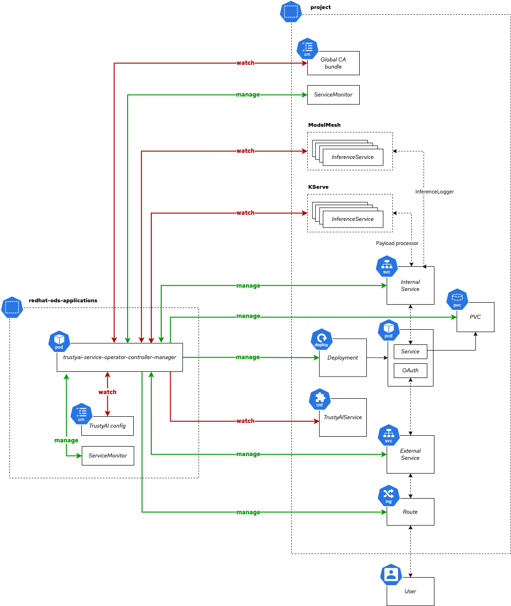

# Model Explainability Architecture



The TrustyAI operator[^operator] is responsible for managing the lifecycle of `TrustyAIService` (TAS) Custom Resources (CR).

## `TrustyAIService`

TrustyAI is designed to support a single `TrustyAIService` per namespace/project. Although multiple TASs can be created in the same namespace, and indeed work, due to the architecture this will not bring any additional benefit, and will only duplicate the computations performed by a single TAS.

In the following sections, we will always assume a single TAS per namespace.

The general syntax of the `TrustyAIService` CR is as follows:

```yaml
apiVersion: trustyai.opendatahub.io/v1alpha1
kind: TrustyAIService
metadata:
  name: trustyai-service
spec:
  storage:
    format: "PVC"
    folder: "/inputs"
    size: "1Gi"
  data:
    filename: "data.csv"
    format: "CSV"
  metrics:
    schedule: "5s"
```

- `metadata.name` specifies the name of the `TrustyAIService`.
- `spec.storage.format` specifies the storage format. Currently, only `PVC` is supported.
- `spec.storage.folder` specifies the folder where the input data is stored.
- `spec.storage.size` specifies the size of the PVC to be used for storage.
- `spec.data.filename` specifies the suffix of the storage file.
- `spec.data.format` specifies the format of the data file (only `CSV` supported at the moment).
- `metrics.schedule` specifies the interval at which the metrics are calculated, when a a calculation request is register with the service.

The default behaviour when installing a CR in a namespace is for the operator to provision the following resources:

| Type                  | Name                     | Description                                        |
|-----------------------|--------------------------|----------------------------------------------------|
| Deployment            | `$(metadata.name)`       | Deploys a pod with two containers (service and OAuth). |
| PersistentVolumeClaim | `$(metadata.name)-pvc`   | Claims a volume for the storage of the inference data. |
| Service               | `$(metadata.name)-service`| Internal service to the TrustyAI REST server.     |
| Service               | `$(metadata.name)-tls`   | Service to expose the TrustyAI OAuth server.      |
| Route                 | `$(metadata.name)`       | Route exposing the `$(metadata.name)-tls`.        |

## Payload consumption

When a `InferenceService` (IS), either ModelMesh or KServe is detected by the operator in the same namespace as a `TrustyAIService`, the operator will try to configure the `InferenceService` to send the inference data to the `TrustyAIService` for processing.

### ModelMesh

When a ModelMesh IS is detected, the operator will set the `PAYLOAD_PROCESSOR` environment to the internal `$(metadata.name)-service`. `PAYLOAD_PROCESSOR` is interpreted by ModelMesh as a space-delimited list of endpoints. If additional endpoints are present, the operator will append the `$(metadata.name)-service` to the list. If the processor is already present, the operator will not modify the list.

### KServe

In the case of KServe, the operator will either add (if not present) or replace the `spec.logger` field with the internal `$(metadata.name)-service`. As example, the final[^kserveis] IS will look similar to:

```yaml
apiVersion: serving.kserve.io/v1beta1
kind: InferenceService
metadata:
  name: sklearn-iris
spec:
  predictor:
    logger: # Added by the TrustyAI operator
      mode: all
      url: http://$(metadata.name)-service.$namespace.svc.cluster
    model:
      modelFormat:
        name: sklearn
      storageUri: gs://kfserving-examples/models/sklearn/1.0/model
```

## Authentication

Each TAS will have two associated `Services`:

- `$(metadata.name)-service` (1)
- `$(metadata.name)-tls` (2)

(1) will have no route associated with it, and will be used for internal communication between the IS and the TAS. This service does not support authentication or TLS at the moment (2) will be exposed via a `Route`, supports TLS and will be used for OAuth authentication.

Request to (2) will be authenticated using a bearer token in the request header, `Authorization: Bearer <token>`. These requests will be forwarded to the OAuth container (running `oauth-proxy`[^oauth-proxy]) for authentication. If the token is valid, the request will be forwarded to the TrustyAI service container.

Requests to (1) will not be authenticated, and will be forwarded directly to the TrustyAI service container.


[^operator]: [TrustyAI Operator repository](https://github.com/trustyai-explainability/trustyai-service-operator).
[^kserveis]: Example IS taken from [KServe's documentation](https://kserve.github.io/website/0.11/modelserving/logger/logger/#create-message-dumper).
[^oauth-proxy]: [OAuth Proxy repository](https://github.com/openshift/oauth-proxy)
