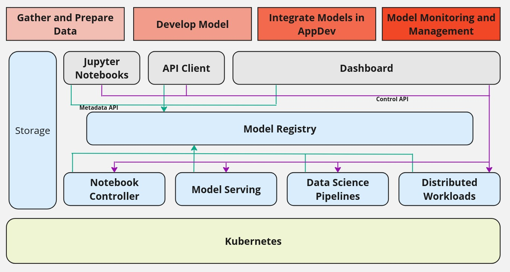
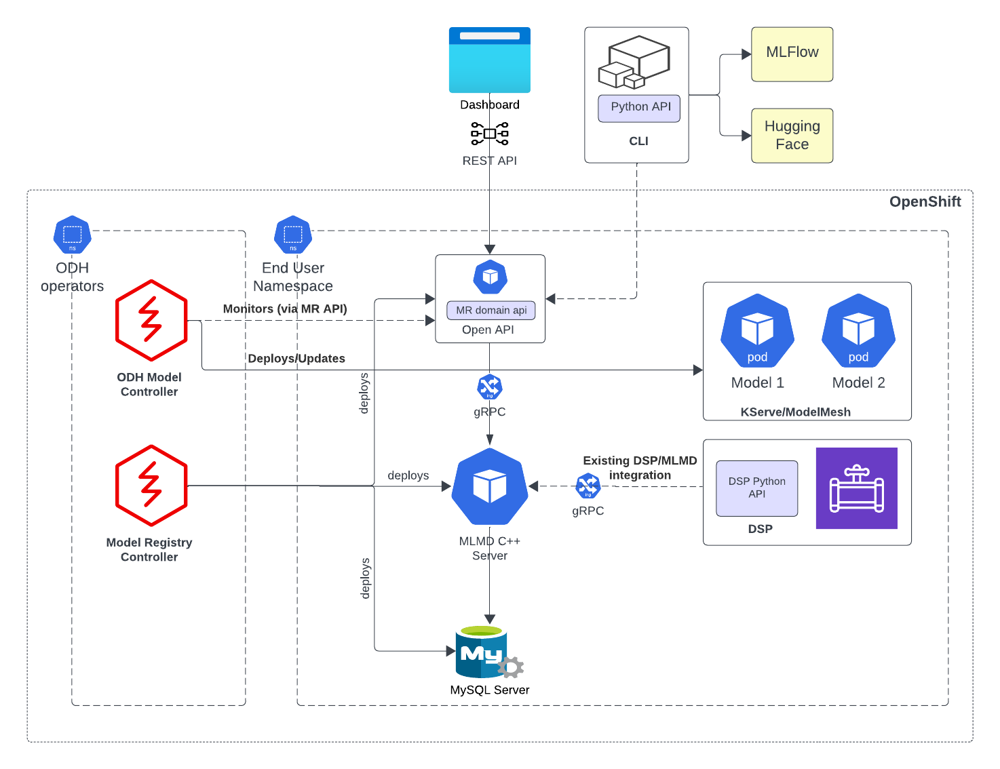
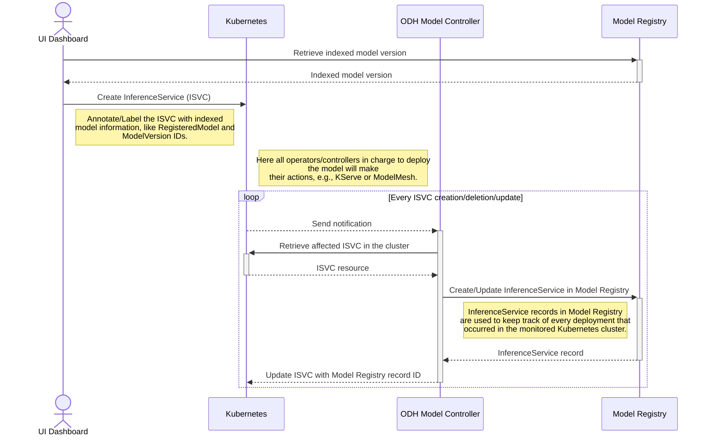

# Model Registry architecture

<!-- sources:
- "Model Registry Architecture" https://docs.google.com/document/d/1OLqy3ivdPs4Db78VrdnnGVkdPpkNPhJZAdAZkMwqUp0/edit
- "Model Registry Proposal" https://docs.google.com/document/d/1G-pjdGaS2kLELsB5kYk_D4AmH-fTfnCnJOhJ8xENjx0/edit#heading=h.ds8q4xtkmu64
-->

## Introduction

A model registry plays a pivotal role in the lifecycle of AI/ML models, serving as the central repository holding metadata pertaining to machine learning models from inception to deployment. This encompasses both high-level details like deployment environment and project origins, as well as intricate information like training hyperparameters, performance metrics, and deployment events. Acting as a bridge between model experimentation and serving, it offers a secure, collaborative interface of a metadata store for stakeholders involved in the ML lifecycle.

## Model Registry High Level Architecture 

> [!NOTE]  
> The Model Registry is a passive repository for metadata and is not meant to be a Control Plane. It does not perform any orchestration or expose APIs to perform actions on underlying OpenShift AI components. 

The model registry is a backing store for various stages of MLOps that can log user flow of a model development and deployment. The model registry meets a data scientist's need to be able to visualize a model’s lineage and trace back the training executions, parameters, metrics, etc. It also help deployment engineers visualize model pipeline events, actions, progress through deployment stages, etc. 

## Goals 
- Associate metadata from training, experimentation, studies and their metrics, with a model
- Build a catalog of models and manage model versions for deployment
- Management of model to different deployment environments
- Build an open-source solution with vibrant community (Kubeflow)
- Build a Kube Native solution
- Avoid reinvention unless it is mandatory

## Architecture

Google community project [ML-Metadata](https://github.com/google/ml-metadata) will be used as the core component to build the Model Registry. ML-Metadata provides a very extensible schema that is generic, similar to a key-value store, but also allows for the creation of logical schemas that can be queried as if they were physical schemas. Those can be manipulated using their bindings in the Python library. We intend to use this model to extend and provide metadata storage services for model serving, also known as Model Registry.

The model registry will use the ml-metadata project’s C++ server as it is given to handle the storing of the metadata while domain-specific Model Registry features will be added as extensions (aka microservices). As part of this extension, we will develop Python/Go extensions to support the Model Registry and will also develop an OpenAPI interface to expose the Model Registry API to the clients. 

Enforcing of RBAC policies will be handled at the OpenAPI API layer using service accounts with Authorino, which is currently not supported by ml-metadata (more details about ODH Auth strategy ODH OSSM Design).

## Components
- *[MLMD C++ Server](https://github.com/google/ml-metadata)*
  - This is the metadata server from Google's ml-metadata project.  This component is hosted to communicate with a backend relational database that stores the actual metadata about the models. This server exposes a “gRPC” interface for its clients to communicate with. This server provides a very flexible schema model, where using this model one can define logical data models to fit the needs of different MLOps operations, for example, metadata during the training and experimentation, metadata about metrics or model versioning, etc. 
  
- *[OpenAPI/REST Server](https://github.com/kubeflow/model-registry)*
  - This component exposes a higher-level REST API of the Model Registry. In contrast, the MLMD server exposes a lower level generic API over gRPC, whereas this REST server exposes a higher level API that is much closer to the domain model of Model Registry, like
    - Register a Model
    - Version a Model
    - Get a catalog of models
    - Manage the deployment statutes of a model
  
  - The REST API server converts its requests into one or more underlaying gRPC requests on the MLMD Server. This layer is mainly designed to be used with UI.

- *[Model Registry Controller](https://github.com/opendatahub-io/model-registry-operator)*
  - Model Registry controller is also called Model Registry Operator. The main purpose of this component is to install/deploy components of the Model Registry stack on the OpenShift. Once the components are installed, the reconciler in the controller will continuously run and monitor these components to keep them healthy and alive. 

- *[CLI (Python client, SDK)](https://github.com/kubeflow/model-registry/tree/main/clients/python)*
  - CLI is also called MR Python client/SDK, a command line tool for interacting with Model Registry. This tool can be used by a user to execute operations such as retrieving the registered models, get model’s deployment status, model’s version etc. 
  
  - The model registry intends to provide these logical mappings  

## Integration with Model Serving Components

<!-- sources:
- https://issues.redhat.com/browse/RHOAIENG-1071
- https://github.com/opendatahub-io/model-registry-bf4-kf/issues/249
- https://github.com/opendatahub-io/odh-model-controller/pull/135
-->

Once a model has been registered as a RegisteredModel resource, versions of the model and its ModelArtifacts will be created and associated with the RegisteredModel.

Model serving controller will advertise itself in the model registry by creating a `ServingEnvironment` entity. 

The Model Controller reconciler will monitor `InferenceService` CRs having pre-defined `labels`, based on those `labels` will sync the model registry by keeping track of every deployment that occurred in the cluster.
Then will update the `InferenceService` CR by linking it to the model registry record using a specific `label`.

This way, the Model Controller will sync those occurrence into the Model Registry to keep track of every deployment that occurred in the cluster for indexed models.

<!-- to be continued once finalized "Model Registry Tenancy Proposal" -->