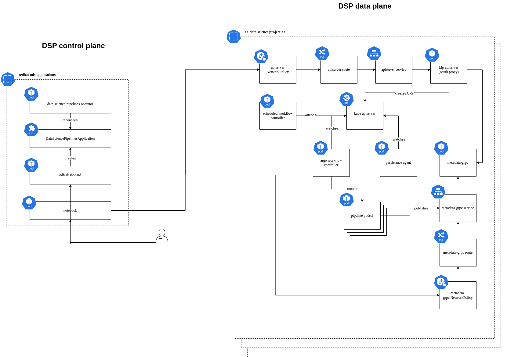

# Data Science Pipelines

Data Science Pipelines is a platform for building and deploying portable, scalable machine learning (ML) workflows based on containers. It is based on Kubeflow Pipelines and relies on Argo Workflows to run the pipelines. Additionally, Data Science Pipelines includes a custom "control plane" on top of Kubeflow Pipelines -- an operator we refer to as Data Science Pipelines Operator (DSPO). DSPO manages the "data planes", the individual "Data Science Pipelines Applications" (aka "stacks") that are deployed in each Data Science Project (kubernetes namespace).

## Data Science Pipelines Operator APIs

### DataSciencePipelinesApplication (DSPA)

* [API Reference](https://github.com/opendatahub-io/data-science-pipelines-operator/blob/main/api/v1alpha1/dspipeline_types.go)
* This CRD is responsible for defining the configuration of the Data Science Pipelines stack.

## DSP High Level Architecture

## DSP Detailed Architecture

## Kubeflow Pipelines Architecture references

Note: you must join https://groups.google.com/g/kubeflow-discuss to access these documents

[Kubeflow Pipelines v2 System Design](https://docs.google.com/document/d/1fHU29oScMEKPttDA1Th1ibImAKsFVVt2Ynr4ZME05i0/edit) -- goes into deeper detail for the data plane design. The Orchestration section in that document is particularly helpful.

[KFP v2 control flow](https://docs.google.com/document/d/1TZeZtxwPzAImIu8Jk_e-4otSx467Ckf0smNe7JbPReE/edit)
