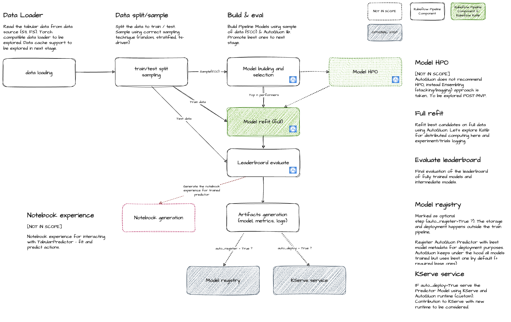

# AutoML

AutoML is an automated system for building and optimizing machine learning models for tabular data within Red Hat OpenShift AI. It leverages Kubeflow Pipelines to orchestrate the model training workflow, using the AutoGluon library to automatically build, evaluate, and select optimal models. The system integrates with Model Registry for model versioning and KServe for model deployment, producing trained predictors that can be deployed for production machine learning applications.

AutoML provides **two separate pipelines** optimized for different use cases:

1. **Classification & Regression Pipeline** - For traditional tabular ML tasks (classification and regression)
2. **Time-Series Pipeline** - For time-series forecasting tasks

Each pipeline has distinct input parameters, defaults, and configurations tailored to its specific use case.

The optimization process typically involves:

1. **Data Loading**: Loads tabular data from data sources (S3, local filesystem)
2. **Data Splitting & Sampling**: Splits data into train/test sets and samples a subset for initial model building
3. **Model Building & Selection**: Builds multiple pipeline models using sampled data and AutoGluon, promoting best performers
4. **Model Refit**: Refits best candidate models on full training data using AutoGluon
5. **Leaderboard Evaluation**: Evaluates fully trained models and generates a leaderboard ranked by performance
6. **Model Registry** (optional): Registers the best model with metadata for deployment
7. **Model Deployment** (optional): Deploys the model using KServe with AutoGluon runtime

## Table of Contents

- [Classification & Regression Pipeline](#classification--regression-pipeline)
  - [Input parameters](#input-parameters)
    - [Experiment Metadata](#1-experiment-metadata)
    - [Input Data Sources](#2-input-data-sources)
    - [Infrastructure Configuration](#3-infrastructure-configuration)
      - [Output results storage](#output-results-storage)
    - [Data Prep Configuration](#4-data-prep-configuration)
    - [Model Configuration](#5-model-configuration)
  - [Pipeline Invocation Example](#pipeline-invocation-example)
  - [Required Parameters](#required-parameters)
- [Time-Series Pipeline](#time-series-pipeline)
  - [Input parameters](#input-parameters-1)
    - [Experiment Metadata](#1-experiment-metadata-1)
    - [Input Data Sources](#2-input-data-sources-1)
    - [Infrastructure Configuration](#3-infrastructure-configuration-1)
      - [Output results storage](#output-results-storage-1)
    - [Time-Series Configuration](#4-time-series-configuration)
      - [Model Settings](#model-settings-1)
      - [Training Constraints](#training-constraints-1)
  - [Pipeline Invocation Example](#pipeline-invocation-example-1)
  - [Required Parameters](#required-parameters-1)
- [Components](#components)
  - [Data Loader](#data-loader)
  - [Train/Test Split & Sampling](#traintest-split--sampling)
  - [Model Building & Selection](#model-building--selection)
  - [Model Refit (Full)](#model-refit-full)
  - [Leaderboard Evaluation](#leaderboard-evaluation)
  - [Model Registry](#model-registry)
  - [KServe Service](#kserve-service)
- [Artifacts](#artifacts)
- [Optimization engine AutoGluon](#optimization-engine-autogluon)
- [Supported features](#supported-features)
  - [Data Configuration](#data-configuration)
  - [Infrastructure Components](#infrastructure-components)
  - [Model Types](#model-types)
  - [Interfaces](#interfaces)

## Classification & Regression Pipeline

KubeFlow Pipelines are used to build out capability for RHOAI (https://github.com/kubeflow/pipelines-components)


This pipeline is designed for traditional tabular machine learning tasks: **classification** (binary and multiclass) and **regression**.

### Input parameters

The Classification & Regression pipeline parameters are organized into the following logical groups:

> ℹ️ **Info:** Model settings and training constraints are **optional** parameters. If not provided, AutoML will use AutoGluon default values.

> 📘 **Note:** This documentation uses Kubeflow Pipelines v2 structured types (`Dict`, `List`) for complex parameters.

#### 1. Experiment Metadata

**Required Parameters:**
- `name: str` - Name of the AutoML experiment run (e.g., "AutoML run")

**Optional Parameters:**
- `description: str` - Description of the experiment (e.g., "Customer churn prediction")

#### 2. Input Data Sources

**Required Parameter:**
- `input_data_reference: Dict` - Dictionary defining tabular data source:
  - `connection_id: str` - Connection ID for the data source (e.g., S3 connection ID)
  - `bucket: str` - Bucket name containing the data
  - `path: str` - Path within the bucket/filesystem to the data file or folder
  
  Example:
  ```python
  {
    "connection_id": "s3-data-connection",
    "bucket": "my-ml-data-bucket",
    "path": "tabular_data/train.csv"
  }
  ```

**Optional Parameter:**

External test data used for leaderboard evaluation after training is completed.

- `test_data_reference: Dict` - Dictionary defining test data source:
  - `connection_id: str` - Connection ID for the test data source (e.g., S3 connection ID)
  - `bucket: str` - Bucket name containing the test data file
  - `path: str` - Path within the bucket/filesystem to the test data file (csv)


#### 3. Infrastructure Configuration

##### Output results storage
Results of the run to be stored (model artifacts, log files, summary report)

**Required Parameter:**
- `results_reference: Dict` - Dictionary defining results storage location:
  - `connection_id: str` - Connection ID for the results storage (e.g., S3 connection ID)
  - `bucket: str` - Bucket name for storing results
  - `path: str` - Path where experiment results will be stored (e.g., "automl/results")
  
  Example:
  ```python
  {
    "connection_id": "s3-automl-results-connection",
    "bucket": "results",
    "path": "automl/"
  }
  ```
##### Data Prep Configuration

**Optional Parameters:**

**Data Sampling:**
- `sampling_config: Dict` - Dictionary defining sampling technique:
  - `n_samples: int` - The number of samples to use for initial model building (optional, default: 500)
  - `sampling_method: str` - Sampling method (optional):
    - `"random"` - Random sampling for general use cases
    - `"stratified"` - Stratified sampling for classification tasks to maintain class distribution
    - `"truncate"` - Sampling last n records for time-series forecasting tasks

**Data Splitting:**
- `split_config: Dict` - Dictionary defining train/test split configuration:
  - `test_size: float` - Proportion of dataset to include in test split (default: 0.2)
  

**Example values:**

**Sampling Configuration:**
```python
{
  "n_samples": 500,
  "sampling_method": "stratified"
}
```

**Split Configuration:**
```python
{
  "test_size": 0.2
}
```

#### 5. Model Configuration

##### Required Parameters

- `task_type: str` - Type of ML task (required):
  - `"regression"` - Regression tasks (default metric: `"R2"`)
  - `"classification"` - Binary & multiclass classification tasks (default metric: `"accuracy"`)
- `label_column: str` - Name of the target/label column (required)

**Optional Parameter:**
- `selection_config: Dict` - Dictionary defining model settings (optional, defaults apply if not provided):
  - `time_limit: int` - Time limit in seconds for model training (optional)
  - `preset: str` - AutoGluon presets (e.g., `"best_quality"`, `"high_quality"`, `"good_quality_faster_inference"`)
  - `eval_metric: str` - Evaluation metric for validation data (optional, AutoGluon selects appropriate default):
    - Regression: defaults to `"root_mean_squared_error"` (can use `"R2"`, `"rmse"`, `"mae"`, etc.)
    - Binary classification: defaults to `"roc_auc"` (can use `"accuracy"`, `"f1"`, etc.)
    - Multi-class classification: defaults to `"accuracy"` (can use `"roc_auc"`, `"f1"`, etc.)
  - `top_n: int` - Number of top models to promote to refit stage (default: 3)


**Selection Configuration for Classification:**
```python
{
  "time_limit": 3600,
  "preset": "best_quality",
  "eval_metric": "roc_auc",  # Default: "roc_auc"
  "top_n": 3
}
```

**Selection Configuration for Regression:**
```python
{
  "time_limit": 3600,
  "preset": "best_quality",
  "eval_metric": "R2",  # Default: "root_mean_squared_error"
  "top_n": 3
}
```

### Pipeline Invocation Example

> ⚠️ **Warning:** This is a mocked example for demonstration purposes using KFP SDK v2. Actual implementation may vary based on the specific Kubeflow Pipelines SDK version and RHOAI configuration.

<details>
<summary>Click to expand Python SDK example with all parameters</summary>

```python
from kfp import Client

# Initialize KFP client
client = Client(host='https://your-kfp-endpoint.com')

# Prepare input data and model configuration parameters

input_data_reference = {
    "connection_id": "s3-data-connection",
    "bucket": "my-ml-data-bucket",
    "path": "tabular_data/train.csv"
}

results_reference = {
    "connection_id": "s3-automl-results-connection",
    "bucket": "results",
    "path": "automl/"
}

task_type = "classification"
label_column = "target"

sampling_config = {
    "n_samples": 500,
    "sampling_method": "stratified"
}

split_config = {
    "test_size": 0.2
}

selection_config = {
    "preset": "best_quality",
    "eval_metric": "roc_auc",
    "top_n": 3
}

# Create and submit pipeline run
run = client.create_run_from_pipeline_func(
    automl_classification_regression_pipeline,
    arguments={
        "name": "AutoML Classification Experiment",
        "description": "Customer churn prediction",
        "input_data_reference": input_data_reference,
        "results_reference": results_reference,
        "task_type": task_type,
        "label_column": label_column,
        "sampling_config": sampling_config,
        "split_config": split_config,
        "selection_config": selection_config,
        "auto_register": True,
        "auto_deploy": False
    }
)

print(f"Pipeline run created: {run.run_id}")
```

</details>

**REST API Invocation Example:**

<details>
<summary>Click to expand REST API example with all parameters</summary>

# Set your KFP endpoint and authentication token
KFP_ENDPOINT="https://your-kfp-endpoint.com"
AUTH_TOKEN="your-auth-token-here"
CLASSIFICATION_REGRESSION_PIPELINE_ID="automl-classification-regression-pipeline-id"

# Create a pipeline run using REST API
curl -X POST "${KFP_ENDPOINT}/apis/v1beta1/runs" \
  -H "Content-Type: application/json" \
  -H "Authorization: Bearer ${AUTH_TOKEN}" \
  -d '{
    "name": "AutoML Classification Experiment",
    "description": "Customer churn prediction",
    "pipeline_spec": {
      "pipeline_id": "'"${CLASSIFICATION_REGRESSION_PIPELINE_ID}"'"
    },
    "runtime_config": {
      "parameters": {
        "name": "AutoML Classification Experiment",
        "description": "Customer churn prediction",
        "input_data_reference": {
          "connection_id": "s3-data-connection",
          "bucket": "my-ml-data-bucket",
          "path": "tabular_data/train.csv"
        },
        "results_reference": {
          "connection_id": "s3-automl-results-connection",
          "bucket": "results",
          "path": "automl/"
        },
        "task_type": "classification",
        "label_column": "target",
        "sampling_config": {
          "n_samples": 500,
          "sampling_method": "stratified"
        },
        "split_config": {
          "test_size": 0.2
        },
        "selection_config": {
          "time_limit": 3600,
          "preset": "best_quality",
          "eval_metric": "roc_auc",
          "top_n": 3
        },
        "auto_register": true,
        "auto_deploy": false
      }
    }
  }'
</details>

#### Required Parameters

- `name: str` - Experiment name (required)
- `input_data_reference: Dict` - Tabular data source (required)
- `results_reference: Dict` - Results storage location (required)
- `task_type: str` - Type of ML task (required): `"regression"` or `"classification"`
- `label_column: str` - Name of the target/label column (required)

**Python SDK Example:**
```python
run = client.create_run_from_pipeline_func(
    automl_classification_regression_pipeline,
    arguments={
        "name": "AutoML Regression Experiment",
        "input_data_reference": input_data_reference,
        "results_reference": results_reference,
        "task_type": "regression",
        "label_column": "target"
    }
)
```

**REST API Example:**
```bash
curl -X POST "${KFP_ENDPOINT}/apis/v1beta1/runs" \
  -H "Content-Type: application/json" \
  -H "Authorization: Bearer ${AUTH_TOKEN}" \
  -d '{
    "name": "AutoML Experiment 2",
    "pipeline_spec": {
      "pipeline_id": "'"${CLASSIFICATION_REGRESSION_PIPELINE_ID}"'"
    },
    "runtime_config": {
      "parameters": {
        "name": "AutoML Regression Experiment",
        "input_data_reference": {
          "connection_id": "s3-data-connection",
          "bucket": "my-ml-data-bucket",
          "path": "tabular_data/train.csv"
        },
        "results_reference": {
          "connection_id": "s3-automl-results-connection",
          "bucket": "results",
          "path": "automl/"
        },
        "task_type": "regression",
        "label_column": "target"
      }
    }
  }'
```

> 💡 **Note:** When optional parameters are omitted, AutoML uses AutoGluon default values.

## Time-Series Pipeline

This pipeline is specifically designed for **time-series forecasting** tasks. It has distinct input parameters and defaults optimized for temporal data.

### Input parameters

The Time-Series pipeline parameters are organized into the following logical groups:

> ℹ️ **Info:** Model settings and training constraints are **optional** parameters. If not provided, AutoML will use AutoGluon default values for time-series tasks.


#### 1. Experiment Metadata

**Required Parameters:**
- `name: str` - Name of the AutoML experiment run (e.g., "AutoML Time-Series run")

**Optional Parameters:**
- `description: str` - Description of the experiment (e.g., "Sales forecasting")

#### 2. Input Data Sources

**Required Parameter:**
- `input_data_reference: Dict` - Dictionary defining tabular data source:
  - `connection_id: str` - Connection ID for the data source (e.g., S3 connection ID)
  - `bucket: str` - Bucket name containing the data
  - `path: str` - Path within the bucket/filesystem to the data file or folder
  
  Example:
  ```python
  {
    "connection_id": "s3-data-connection",
    "bucket": "my-ml-data-bucket",
    "path": "time_series_data/sales.csv"
  }
  ```

**Optional Parameter:**

External test data used for leaderboard evaluation after training is completed.

- `test_data_reference: Dict` - Dictionary defining test data source:
  - `connection_id: str` - Connection ID for the test data source (e.g., S3 connection ID)
  - `bucket: str` - Bucket name containing the test data file
  - `path: str` - Path within the bucket/filesystem to the test data file (csv)


#### 3. Infrastructure Configuration

##### Output results storage
Results of the run to be stored (model artifacts, log files, summary report)

**Required Parameter:**
- `results_reference: Dict` - Dictionary defining results storage location:
  - `connection_id: str` - Connection ID for the results storage (e.g., S3 connection ID)
  - `bucket: str` - Bucket name for storing results
  - `path: str` - Path where experiment results will be stored (e.g., "automl/results")
  
  Example:
  ```python
  {
    "connection_id": "s3-automl-results-connection",
    "bucket": "results",
    "path": "automl/"
  }
  ```

#### 4. Time-Series Configuration
##### Data Prep Configuration

**Optional Parameters:**

**Data Sampling:**
- `sampling_config: Dict` - Dictionary defining sampling technique:
  - `n_samples: int` - The number of samples to use for initial model building (optional, default: 500)
  - `sampling_method: str` - Sampling method (optional):
    - `"random"` - Random sampling for general use cases
    - `"stratified"` - Stratified sampling for classification tasks to maintain class distribution
    - `"truncate"` - Sampling last n records for time-series forecasting tasks

**Data Splitting:**
- `split_config: Dict` - Dictionary defining train/test split configuration:
  - `test_size: float` - Proportion of dataset to include in test split (default: 0.2)
  

**Example values:**

**Sampling Configuration:**
```python
{
  "n_samples": 500,
  "sampling_method": "truncate"
}
```

**Split Configuration:**
```python
{
  "test_size": 0.2
}
```

##### Model Settings

**Required Parameters:**
- `time_series_config: Dict` - Dictionary defining time-series specific configuration (required):
  - `timestamp_column: str` - Column name containing timestamps (required)
  - `prediction_length: int` - Number of time steps to forecast into the future (required)
  - `label_column: str` - Name of the target/label column containing time series values (required)

**Optional Parameters:**
- `time_series_config: Dict` - Additional optional time-series configuration fields (all fields below are optional):
  - `id_column: str` - Column name identifying different time series (for multi-series datasets). Optional for single time series.
  - `freq: str` - Frequency of the time series data (e.g., `"D"` for daily, `"H"` for hourly, `"W"` for weekly). If not specified, AutoGluon attempts to infer from the data.
  - `context_length: int` - Number of past time steps the model uses to make predictions (optional, default: 2 × `prediction_length`)
  - `known_covariates_names: List[str]` - List of column names representing known covariates available for the entire forecast horizon (e.g., holidays, promotions). These must be present in training data and provided during prediction.
  - `past_covariates_names: List[str]` - List of column names representing past covariates only known up to the start of the forecast horizon (e.g., sales of other products, weather conditions).
  - `static_features: List[str]` - List of column names representing static features that don't change over time (e.g., product category, store location). Integer/float columns are treated as continuous, object/string as categorical.
  - `lags: List[int]` - Lags of the target variable to use as features for predictions (optional). If not specified, AutoGluon determines automatically based on data frequency.
  - `date_features: List[str]` - Features computed from dates (e.g., `["day_of_week", "month"]`). If not specified, AutoGluon determines automatically based on data frequency.
  - `target_scaler: str` - Scaling applied to each time series (optional, default: `"mean_abs"`). Options: `"standard"`, `"mean_abs"`, `"min_max"`, `"robust"`, `None`
  - `differences: List[int]` - Differences to take of the target before computing features (optional, default: no differencing). Used for making time series stationary.

- `selection_config: Dict` - Dictionary defining model settings:
  - `eval_metric: str` - Evaluation metric for time-series (default: `"MAPE"`). Options: `"MAPE"`, `"sMAPE"`, `"MASE"`, `"RMSE"`, `"MAE"`, `"WQL"` (Weighted Quantile Loss)
  - `time_limit: int` - Time limit in seconds for model training (optional)
  - `presets: str` - AutoGluon presets (e.g., `"best_quality"`, `"high_quality"`, `"good_quality_faster_inference"`)
  
  **Example:**
  ```python
  {
    "timestamp_column": "timestamp",
    "prediction_length": 24,
    "label_column": "value",
    "id_column": "series_id",
    "freq": "H",
    "context_length": 48,
    "known_covariates_names": ["holiday", "promotion"],
    "static_features": ["store_id", "product_category"]
  }
  ```

  **Selection Configuration Example:**
  ```python
  {
    "eval_metric": "MAPE",
    "time_limit": 3600,
    "presets": "best_quality"
  }
  ```

##### Training Constraints

**Optional Parameters:**

**Data Splitting:**
- `split_config: Dict` - Dictionary defining train/test split configuration for time-series:
  - `n_last_rows: int` - Number of last rows to use as test set (alternative to `test_size`)
  - `test_size: float` - Proportion of dataset to include in test split (alternative to `n_last_rows`, default: 0.2)
  
  > ⚠️ **Note:** Time-series data must be split chronologically to preserve temporal ordering. Random or stratified sampling is not applicable. Use `sampling_method: "truncate"` in `sampling_config` for time-series tasks.

**Example values:**

**Split Configuration:**
```python
{
  "n_last_rows": 100  # Use last 100 rows as test set
}
```

### Pipeline Invocation Example

> ⚠️ **Warning:** This is a mocked example for demonstration purposes using KFP SDK v2. Actual implementation may vary based on the specific Kubeflow Pipelines SDK version and RHOAI configuration.

<details>
<summary>Click to expand Python SDK example with all parameters</summary>

```python
from kfp import Client

# Initialize KFP client
client = Client(host='https://your-kfp-endpoint.com')

# Prepare input data and time-series configuration parameters

input_data_reference = {
    "connection_id": "s3-data-connection",
    "bucket": "my-ml-data-bucket",
    "path": "time_series_data/sales.csv"
}

results_reference = {
    "connection_id": "s3-automl-results-connection",
    "bucket": "results",
    "path": "automl/"
}

sampling_config = {
    "n_samples": 500,
    "sampling_method": "truncate"
}

split_config = {
    "n_last_rows": 100
}

time_series_config = {
    "timestamp_column": "timestamp",
    "prediction_length": 24,
    "label_column": "value",
    "id_column": "series_id",
    "freq": "H",
    "context_length": 48,
    "known_covariates_names": ["holiday", "promotion"],
    "static_features": ["store_id", "product_category"]
}

selection_config = {
    "eval_metric": "MAPE",
    "time_limit": 3600,
    "presets": "best_quality"
}

# Create and submit pipeline run
run = client.create_run_from_pipeline_func(
    automl_time_series_pipeline,
    arguments={
        "name": "AutoML Time-Series Experiment",
        "description": "Sales forecasting",
        "input_data_reference": input_data_reference,
        "results_reference": results_reference,
        "sampling_config": sampling_config,
        "split_config": split_config,
        "time_series_config": time_series_config,
        "selection_config": selection_config,
        "auto_register": True,
        "auto_deploy": False
    }
)

print(f"Pipeline run created: {run.run_id}")
```

</details>

**REST API Invocation Example:**

<details>
<summary>Click to expand REST API example with all parameters</summary>

```bash
# Set your KFP endpoint and authentication token
KFP_ENDPOINT="https://your-kfp-endpoint.com"
AUTH_TOKEN="your-auth-token-here"
TIME_SERIES_PIPELINE_ID="automl-time-series-pipeline-id"

# Create a pipeline run using REST API
curl -X POST "${KFP_ENDPOINT}/apis/v1beta1/runs" \
  -H "Content-Type: application/json" \
  -H "Authorization: Bearer ${AUTH_TOKEN}" \
  -d '{
    "name": "AutoML Time-Series Experiment",
    "description": "Sales forecasting",
    "pipeline_spec": {
      "pipeline_id": "'"${TIME_SERIES_PIPELINE_ID}"'"
    },
    "runtime_config": {
      "parameters": {
        "name": "AutoML Time-Series Experiment",
        "description": "Sales forecasting",
        "input_data_reference": {
          "connection_id": "s3-data-connection",
          "bucket": "my-ml-data-bucket",
          "path": "time_series_data/sales.csv"
        },
        "results_reference": {
          "connection_id": "s3-automl-results-connection",
          "bucket": "results",
          "path": "automl/"
        },
        "sampling_config": {
          "n_samples": 500,
          "sampling_method": "truncate"
        },
        "split_config": {
          "n_last_rows": 100
        },
        "time_series_config": {
          "timestamp_column": "timestamp",
          "prediction_length": 24,
          "label_column": "value",
          "id_column": "series_id",
          "freq": "H",
          "context_length": 48,
          "known_covariates_names": ["holiday", "promotion"],
          "static_features": ["store_id", "product_category"]
        },
        "selection_config": {
          "eval_metric": "MAPE",
          "time_limit": 3600,
          "presets": "best_quality"
        },
        "auto_register": true,
        "auto_deploy": false
      }
    }
  }'
```

</details>

#### Required Parameters

- `name: str` - Experiment name (required)
- `input_data_reference: Dict` - Tabular data source (required)
- `results_reference: Dict` - Results storage location (required)
- `time_series_config: Dict` - Time-series configuration with `timestamp_column`, `prediction_length`, and `label_column` (required)

**Python SDK Example:**
```python
run = client.create_run_from_pipeline_func(
    automl_time_series_pipeline,
    arguments={
        "name": "AutoML Time-Series Experiment",
        "input_data_reference": input_data_reference,
        "results_reference": results_reference,
        "time_series_config": {
            "timestamp_column": "timestamp",
            "prediction_length": 24,
            "label_column": "value"
        }
    }
)
```

**REST API Example:**

```bash
curl -X POST "${KFP_ENDPOINT}/apis/v1beta1/runs" \
  -H "Content-Type: application/json" \
  -H "Authorization: Bearer ${AUTH_TOKEN}" \
  -d '{
    "name": "AutoML Time-Series Experiment",
    "pipeline_spec": {
      "pipeline_id": "'"${TIME_SERIES_PIPELINE_ID}"'"
    },
    "runtime_config": {
      "parameters": {
        "name": "AutoML Time-Series Experiment",
        "input_data_reference": {
          "connection_id": "s3-data-connection",
          "bucket": "my-ml-data-bucket",
          "path": "time_series_data/sales.csv"
        },
        "results_reference": {
          "connection_id": "s3-automl-results-connection",
          "bucket": "results",
          "path": "automl/"
        },
        "time_series_config": {
          "timestamp_column": "timestamp",
          "prediction_length": 24,
          "label_column": "value"
        }
      }
    }
  }'
```

> 💡 **Note:** When optional parameters are omitted, AutoML uses AutoGluon default values for time-series tasks.

### Components

#### Data Loader
Reads tabular data from data sources (S3, local filesystem). Supports S3 `connection`. Returns tabular data for processing. Torch compatible data loader to be explored. Data cache support to be explored in next stage.

#### Train/Test Split & Sampling
Splits the data into train and test sets using appropriate sampling techniques (random, stratified, time-series driven). Samples a subset of training data (default: 500 samples) for initial model building to reduce computational cost during the exploration phase.

#### Model Building & Selection
Builds multiple pipeline models using sampled data (500 samples) and AutoGluon library. Evaluates models and promotes the best performers (top n) to the next stage. Uses AutoGluon's ensembling approach (stacking/bagging) rather than traditional hyperparameter optimization.

#### Model Refit (Full)
Refits the best candidate models on the full training dataset using AutoGluon. Explores Kubeflow Katib for distributed computing and experiment/trials logging. This stage produces fully trained models ready for evaluation.

#### Leaderboard Evaluation
Performs final evaluation of fully trained models and intermediate models. Generates a leaderboard ranked by the specified evaluation metric. Provides comprehensive performance metrics for all models.

#### Model Registry
**Optional step** (controlled by `auto_register` parameter). Registers the AutoGluon Predictor with best model metadata for deployment purposes. AutoGluon keeps all models trained under the hood but uses the best one by default (plus required base ones). The storage and deployment happens outside the train pipeline.

#### KServe Service
**Optional step** (controlled by `auto_deploy` parameter). If `auto_deploy=True`, serves the Predictor Model using KServe and AutoGluon runtime (custom). Contribution to KServe with new runtime to be considered.

#### Artifacts

For each run, AutoML generates:

- **Model Artifact(s)**: Trained AutoGluon Predictor models with associated metadata:
   - Model files and weights
   - Model configuration
   - Performance metrics
   - Leaderboard rankings
- **AutoML Run Artifact**: Run status properties and URI to log file with messages
- **AutoML Experiment Summary Markdown Artifact** including:
  - Data preparation details
  - Model building and selection process
  - Leaderboard of models ranked by performance
  - Links to remaining artifacts
- **Notebook Artifact** (optional, not in scope for MVP): Notebook experience for interacting with TabularPredictor - fit and predict actions

## Optimization engine AutoGluon

The AutoGluon project is open-source and available at: [https://github.com/autogluon/autogluon](https://github.com/autogluon/autogluon).

AutoGluon is an **automated machine learning library** that provides an automated approach to building and optimizing machine learning models for tabular data. The library is designed to be **easy to use and highly automated**, requiring minimal configuration while producing high-quality models.

AutoGluon automatically:
- Handles data preprocessing and feature engineering
- Trains multiple model types (neural networks, tree-based models, etc.)
- Creates ensembles using stacking and bagging techniques
- Selects optimal models based on performance metrics
- Provides production-ready predictors

AutoGluon does not recommend traditional hyperparameter optimization (HPO); instead, it uses an **ensembling approach** (stacking/bagging) to achieve high performance. HPO may be explored post-MVP.

## Supported features

**Status**: Tech Preview - MVP

### Data Configuration

- **Data Type**: Tabular data (CSV, Parquet, etc.)
- **Data Sources**: 
  - S3 (Amazon S3)
  - Local filesystem (FS)
- **Supported Task Types**: 
  - Classification
  - Regression
  - Multiclass classification
  - Time-series forecasting

### Infrastructure Components

- **Model Training**: AutoGluon library
- **Distributed Computing**: Kubeflow Katib (to be explored for distributed training)
- **Model Registry**: RHOAI Model Registry (optional)
- **Model Serving**: KServe with AutoGluon runtime (optional, custom runtime)

### Model Types

- **Ensembling**: Stacking and bagging approaches
- **Model Families**: Neural networks, tree-based models (XGBoost, LightGBM, CatBoost), linear models, and more
- **Hyperparameter Optimization**: Not recommended by AutoGluon; ensembling approach preferred (HPO to be explored post-MVP)

### Interfaces

- **API**: Programmatic access to AutoML functionality
- **UI**: User interface for interacting with AutoML

### Future Considerations

- **Notebook Generation**: Notebook experience for interacting with TabularPredictor (not in scope for MVP)
- **Model HPO**: Traditional hyperparameter optimization (not in scope, AutoGluon uses ensembling instead)
- **Data Caching**: Data cache support to be explored in next stage
- **Torch Data Loader**: Torch compatible data loader to be explored