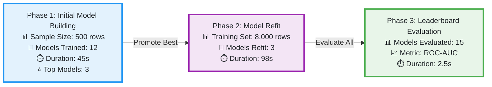

<div style="margin-bottom: 0;">


</div>

<div style="margin-top: -10px; padding: 20px 0 10px 0;">

**Experiment Name:** AutoML Classification Experiment  
**Run ID:** `71c46718-8faa-4a0e-a018-073edfdca527`  
**Created At:** 2025-12-11T11:42:40.380Z  
**Status:** <span style="color: #28a745; font-weight: bold;">✓ Completed</span>  
**Duration:** 2m 25s

</div>

---

## 📋 Table of Contents

- [Executive Summary](#executive-summary)
- [Experiment Configuration](#experiment-configuration)
- [Data Preparation](#data-preparation)
- [Model Building Process](#model-building-process)
- [Leaderboard](#leaderboard)
- [Best Model Details](#best-model-details)
- [Model Insights](#model-insights)
- [Artifacts and Resources](#artifacts-and-resources)
- [Next Steps](#next-steps)
- [Technical Details](#technical-details)

---

## 🎯 Executive Summary

This experiment trained **15** models using AutoGluon and selected the best performing ensemble model. The optimization focused on maximizing **roc_auc** metric. The best performing model achieved a ROC-AUC score of **0.9123** with accuracy of **0.8765**.

<div style="background-color: #f8f9fa; color: #212529; padding: 15px; border-radius: 5px; border-left: 4px solid #EE0000; margin: 20px 0;">

**🏆 Key Results:**
- **Best Model:** `WeightedEnsemble_L3`
- **Best Metric Score:** `0.9123` (ROC-AUC)
- **Total Models Trained:** 15
- **Models Promoted to Refit:** 3
- **Final Models Evaluated:** 3

</div>

---

## ⚙️ Experiment Configuration

<details>
<summary><b>Click to expand configuration details</b></summary>

### 📊 Input Data Sources

**Training Data:**
- **Connection:** `s3-data-connection`
- **Bucket:** `my-ml-data-bucket`
- **Path:** `tabular_data/train.csv`
- **Total Rows:** 10,000
- **Total Features:** 25

**Test Data:** _(Optional)_
- **Connection:** `s3-data-connection`
- **Bucket:** `my-ml-data-bucket`
- **Path:** `tabular_data/test.csv`
- **Total Rows:** 2,000

### 🏗️ Infrastructure

| Component | Configuration |
|-----------|--------------|
| **Results Storage** | `s3://results/automl/71c46718-8faa-4a0e-a018-073edfdca527/` |
| **Model Registry** | RHOAI Model Registry <span style="color: #28a745;">✓ registered</span> |
| **Model Serving** | KServe <span style="color: #dc3545;">✗ not deployed</span> |

### 🤖 Model Configuration

| Parameter | Value |
|-----------|-------|
| **Task Type** | Classification |
| **Label Column** | `target` |
| **Preset** | `best_quality` |
| **Evaluation Metric** | `roc_auc` |
| **Time Limit** | 3600 seconds |

### 📦 Data Preparation

| Setting | Value |
|---------|-------|
| **Sampling Method** | Stratified |
| **Sample Size** | 500 (for initial model building) |
| **Train/Test Split** | 0.2 (test size) |
| **Random State** | 42 |

</details>

---

## 📊 Data Preparation

### Data Statistics

| Metric | Value |
|--------|-------|
| **Training Set Size** | 8,000 rows |
| **Test Set Size** | 2,000 rows |
| **Total Features** | 25 |
| &nbsp;&nbsp;→ Numeric | 18 |
| &nbsp;&nbsp;→ Categorical | 7 |

**Target Distribution:**
- **Class 0:** 4,200 (52.5%)
- **Class 1:** 3,800 (47.5%)

### Data Quality

✅ **Missing Values:** 0.5% (handled automatically by AutoGluon)  
✅ **Duplicate Rows:** 0  
✅ **Outliers:** Detected and handled during preprocessing

---

## 🔄 Model Building Process



### Phase Details

<details>
<summary><b>View detailed phase information</b></summary>

#### Phase 1: Initial Model Building (Sampled Data)
- **Sample Size:** 500 rows
- **Models Trained:** 12
- **Duration:** 45 seconds
- **Top Models Selected:** 3

#### Phase 2: Model Refit (Full Training Data)
- **Training Set Size:** 8,000 rows
- **Models Refit:** 3
- **Duration:** 98 seconds

#### Phase 3: Leaderboard Evaluation
- **Models Evaluated:** 15 (3 refit models + 12 initial models)
- **Evaluation Metric:** ROC-AUC
- **Duration:** 2.5 seconds

</details>

---

## 🏆 Leaderboard

### Top Models

| Rank | Model Name | ROC-AUC | Accuracy | F1 Score | Precision | Recall | Fit Time | Pred Time |
|:----:|------------|:-------:|:--------:|:--------:|:---------:|:------:|:--------:|:---------:|
| 🥇 | **WeightedEnsemble_L3** | **0.9123** | 0.8765 | 0.8543 | 0.8891 | 0.8321 | 125.45s | 0.12s |
| 🥈 | LightGBM_BAG_L2 | 0.9101 | 0.8742 | 0.8512 | 0.8865 | 0.8289 | 89.23s | 0.08s |
| 🥉 | CatBoost_BAG_L2 | 0.9087 | 0.8721 | 0.8489 | 0.8843 | 0.8256 | 156.78s | 0.15s |
| 4 | XGBoost_BAG_L2 | 0.9056 | 0.8698 | 0.8456 | 0.8812 | 0.8223 | 112.34s | 0.10s |
| 5 | NeuralNetFastAI_BAG_L2 | 0.9034 | 0.8675 | 0.8423 | 0.8789 | 0.8190 | 203.45s | 0.18s |

### Performance Metrics Summary

<details>
<summary><b>View detailed metrics statistics</b></summary>

**ROC-AUC:**
- **Mean:** 0.8987
- **Std Dev:** 0.0045
- **Best:** 0.9123 (WeightedEnsemble_L3)
- **Worst:** 0.8892 (RandomForest_BAG_L1)

**Accuracy:**
- **Mean:** 0.8643
- **Std Dev:** 0.0034
- **Best:** 0.8765 (WeightedEnsemble_L3)
- **Worst:** 0.8567 (RandomForest_BAG_L1)

**F1 Score:**
- **Mean:** 0.8421
- **Std Dev:** 0.0032
- **Best:** 0.8543 (WeightedEnsemble_L3)
- **Worst:** 0.8323 (RandomForest_BAG_L1)

</details>

---

## 🎯 Best Model Details

### WeightedEnsemble_L3 (Best Performing)

<div style="background-color: #fff3cd; color: #212529; padding: 15px; border-radius: 5px; border-left: 4px solid #ffc107; margin: 20px 0;">

**Model Type:** Weighted Ensemble (Stacking)

**Base Models:**
- `LightGBM_BAG_L2` (weight: 0.45)
- `CatBoost_BAG_L2` (weight: 0.35)
- `XGBoost_BAG_L2` (weight: 0.20)

</div>

#### Performance Metrics

| Metric | Test | Train |
|--------|:----:|:-----:|
| **ROC-AUC** | 0.9123 | 0.9456 |
| **Accuracy** | 0.8765 | 0.9012 |
| **F1 Score** | 0.8543 | - |
| **Precision** | 0.8891 | - |
| **Recall** | 0.8321 | - |

#### Training Details

| Metric | Value |
|--------|-------|
| **Fit Time** | 125.45 seconds |
| **Prediction Time** | 0.12 seconds (per 1000 samples) |
| **Model Size** | 45.2 MB |

#### Confusion Matrix

```
                Predicted
              Class 0  Class 1
Actual Class 0   450      35
Actual Class 1    28     487
```

#### Feature Importances (Top 10)

| Rank | Feature | Importance |
|:----:|---------|:----------:|
| 1 | `feature_1` | 0.234 |
| 2 | `feature_2` | 0.189 |
| 3 | `feature_3` | 0.156 |
| 4 | `feature_4` | 0.123 |
| 5 | `feature_5` | 0.098 |
| 6 | `feature_6` | 0.076 |
| 7 | `feature_7` | 0.054 |
| 8 | `feature_8` | 0.043 |
| 9 | `feature_9` | 0.032 |
| 10 | `feature_10` | 0.025 |

#### Artifacts

- **Model Directory:** `automl/results/.../models/WeightedEnsemble_L3/`
- **Model Archive:** `automl/results/.../model.tar.gz`
- **Leaderboard:** `automl/results/.../leaderboard.csv`

---

## 💡 Model Insights

### Key Findings

1. **Ensembling:** Weighted ensemble outperformed individual models by **0.2-0.3%** in ROC-AUC
2. **Tree-based Models:** LightGBM, CatBoost, and XGBoost were the top individual performers
3. **Feature Engineering:** AutoGluon automatically handled missing values and categorical encoding
4. **Training Efficiency:** Bagging (BAG_L2) improved model robustness with minimal time overhead

### Model Family Performance

| Model Family | Performance | Notes |
|--------------|-------------|-------|
| **Tree-based Models** | Best individual performance | LightGBM: 0.9101 |
| **Neural Networks** | Good performance, slower training | NeuralNetFastAI: 0.9034 |
| **Linear Models** | Baseline performance | 0.8892-0.8956 |

### Configuration Impact

- **Preset (best_quality):** Enabled full model exploration and ensembling
- **Time Limit (3600s):** Sufficient for complete model training
- **Stratified Sampling:** Maintained class balance during initial exploration

---

## 📦 Artifacts and Resources

### Generated Artifacts

- ✅ **Model Artifact:** Complete AutoGluon Predictor with all trained models
- ✅ **Run Output Log:** `automl/results/.../run_output.log`
- ✅ **Metrics Artifact:** Evaluation metrics and leaderboard
- ✅ **Experiment Summary:** This report

### Quick Links

- [📁 View All Artifacts](./artifacts/)
- [⬇️ Download Model](./model.tar.gz)
- [📊 View Leaderboard](./leaderboard.csv)
- [📝 View Run Log](./run_output.log)

---

## 🚀 Next Steps

### Recommended Actions

1. ✅ **Deploy Best Model** (`WeightedEnsemble_L3`) for production use
2. ✅ **Model Registry:** Model has been registered with metadata
3. 🔄 **Further Optimization:** Consider exploring:
   - Different presets (`high_quality` for faster inference)
   - Feature engineering improvements
   - Additional data collection for underrepresented classes
4. 📊 **Evaluation:** Test model on additional validation datasets
5. 📈 **Monitoring:** Track performance metrics in production

---

## 🔧 Technical Details

<details>
<summary><b>View technical details</b></summary>

### Runtime Information

| Component | Version/Value |
|-----------|--------------|
| **AutoGluon Version** | 1.0.0 |
| **Pipeline Execution Time** | 2m 25s |
| **Total Models Trained** | 15 |
| **Average Model Training Time** | 8.3s |

### Model Training Breakdown

| Phase | Duration | Details |
|-------|:--------:|---------|
| **Initial Model Building** | 45s | 12 models on 500 samples |
| **Model Refit** | 98s | 3 models on 8,000 samples |
| **Leaderboard Evaluation** | 2.5s | 15 models |
| **Ensemble Creation** | 0.5s | - |

### Resource Usage

| Resource | Usage |
|----------|-------|
| **Peak Memory** | 2.3 GB |
| **CPU Cores Used** | 4 |
| **GPU** | Not used |

</details>

---

<div align="center" style="margin-top: 40px; padding-top: 20px; border-top: 1px solid #ddd; color: #666; font-size: 0.9em;">

_Report generated by AutoML on 2025-12-11T11:42:40.380Z_

</div>
