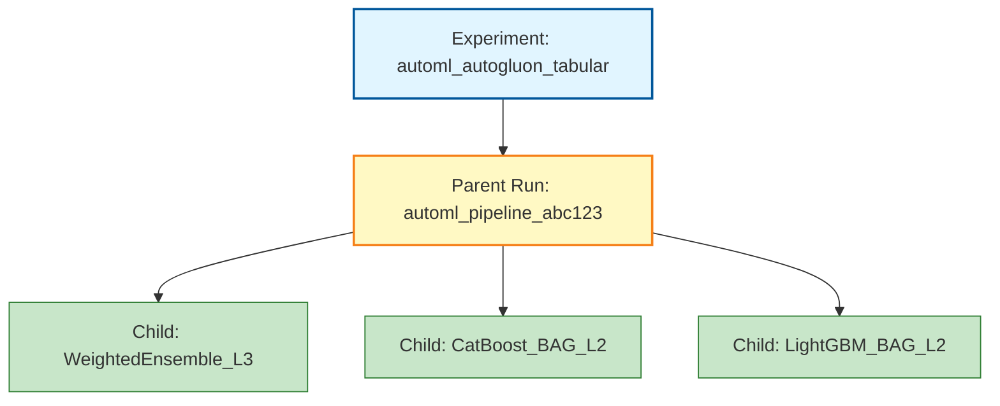

# AutoML MLflow integration

This document proposes an **MLflow** integration for OpenShift AI / ODH **AutoML** workflows implemented in [opendatahub-io/pipelines-components](https://github.com/opendatahub-io/pipelines-components) under **`components/training/automl`** and **`pipelines/training/automl`**, with product goals: **experiment tracking, comparison, reproducibility, optional enablement, low overhead, and air-gapped support**.

For architecture context (goals, workflow, ADR-level intent for MLflow), see [ODH-ADR-0001-automl](../../../../architecture-decision-records/automl/ODH-ADR-0001-automl.md) and the [AutoML component overview](../README.md).

---

## KFP MLflow integration modes (OpenShift AI 3.5+)

Starting with **OpenShift AI 3.5**, Data Science Pipelines provides two modes of MLflow integration:

1. **Automatic KFP-to-MLflow logging**: All KFP output metrics and input parameters are automatically recorded in MLflow without code changes. Works well for simple metrics.

2. **Opt-in with environment variables** (recommended for AutoML): MLflow client environment variables are pre-configured in pipeline step pods, allowing custom logging with full control over complex artifacts and metrics.

AutoML uses **mode 2** because AutoGluon produces complex artifacts (leaderboards, ensemble hierarchies, nested model metrics) that require explicit logging control beyond what KFP automatic logging can capture.

### Environment variables (RHOAI 3.5+)

When MLflow integration is enabled at the project level, the following environment variables are automatically injected into pipeline step pods:

| Environment Variable | Purpose | Example Value | Notes |
|---------------------|---------|---------------|-------|
| `MLFLOW_TRACKING_URI` | MLflow tracking server endpoint | `https://mlflow-server.example.com` | If unset, MLflow logging is disabled (optional integration) |
| `MLFLOW_WORKSPACE` | Workspace identifier for the project | `data-science-project` | Corresponds to the OpenShift AI project/namespace |
| `MLFLOW_EXPERIMENT_ID` | Auto-created experiment ID for the pipeline | `"1"` | KFP creates one experiment per pipeline; components can log to this experiment directly |
| `MLFLOW_RUN_ID` | Parent run ID for the KFP pipeline execution | `"abc123..."` | KFP creates a parent run per pipeline execution; components create child runs under this |
| `MLFLOW_TRACKING_AUTH` | Authentication mechanism | `kubernetes-namespaced` | Uses Kubernetes client auth plugin (MLflow SDK 3.11+); reads token from pod's service account or local `~/.kube/config` |

**AutoML integration approach:** Components check if `MLFLOW_TRACKING_URI` is set. If yes, they create **child runs** under the KFP-managed parent run (`MLFLOW_RUN_ID`) for each refitted model, using explicit `mlflow.log_params()` / `mlflow.log_metrics()` / `mlflow.log_artifact()` calls to capture AutoGluon-specific data.

---

## Current implementation
Per the [AutoML components README](https://github.com/opendatahub-io/pipelines-components/blob/main/components/training/automl/README.md), the **Automl** group includes:

- **[Autogluon Models Training](https://github.com/opendatahub-io/pipelines-components/tree/main/components/training/automl/autogluon_models_training)** — train AutoGluon models, select top N, refit each on the full dataset.
- **[Autogluon Timeseries Models Selection](https://github.com/opendatahub-io/pipelines-components/tree/main/components/training/automl/autogluon_timeseries_models_selection)** — train and select top N timeseries models.
- **[Autogluon Timeseries Models Full Refit](https://github.com/opendatahub-io/pipelines-components/tree/main/components/training/automl/autogluon_timeseries_models_full_refit)** — refit a single selected timeseries model on full data.
- **[Leaderboard Evaluation](https://github.com/opendatahub-io/pipelines-components/tree/main/components/training/automl/autogluon_leaderboard_evaluation)** (tabular) — evaluate refitted models and emit an **HTML leaderboard**.
- **[Timeseries Leaderboard Evaluation](https://github.com/opendatahub-io/pipelines-components/tree/main/components/training/automl/autogluon_timeseries_leaderboard_evaluation)** — same idea for timeseries.

A **`shared/`** package under `components/training/automl/` is the natural place for **common MLflow helpers** (lazy import, env checks, tagging, artifact size limits) used by both tabular and timeseries code paths.

### Artifacts and metrics (tabular)

The [leaderboard evaluation README](https://github.com/opendatahub-io/pipelines-components/blob/main/components/training/automl/autogluon_leaderboard_evaluation/README.md) documents the expected layout under the combined **`models_artifact`** from **`autogluon_models_training`**, including:

- `models_artifact.path / _FULL / metrics / metrics.json`
- `predictor / predictor.pkl`
- `notebooks / automl_predictor_notebook.ipynb`
- `metadata["model_names"]` — list of refitted model display names for ranking.

**All optimization-relevant metrics and model identifiers** needed for MLflow are available from **`metrics.json`**, leaderboard ordering, and **`model_names`** metadata after training / refit.

---

## MLflow mapping model

Design for **two pipeline families** (tabular vs timeseries) with the **same conceptual mapping**.

| MLflow concept | Proposed mapping |
|----------------|------------------|
| **Experiment** | **RHOAI 3.5+:** KFP auto-creates one experiment per pipeline (accessible via `MLFLOW_EXPERIMENT_ID`). **Pre-3.5 or custom:** e.g. `automl_autogluon_tabular` / `automl_autogluon_timeseries` (optional suffix: team, cluster, env). |
| **Parent run** | **RHOAI 3.5+:** KFP auto-creates one parent run per pipeline execution (accessible via `MLFLOW_RUN_ID`). AutoML components **resume this run** to add tags and params. **Tags:** `kfp_run_id`, `pipeline_name`, `task_type` (`tabular` \| `timeseries`), `namespace` (from `MLFLOW_WORKSPACE`), dataset **hashes or URIs** (non-secret). **Params:** `eval_metric`, `preset`, `top_n`, `pipeline_version`, `autogluon_version`. |
| **Child runs** | **One child run per leaderboard row / refitted model** (each name in `model_names` or equivalent for timeseries), created by AutoML components as nested runs under the KFP parent. Enables side-by-side comparison in the MLflow UI across models from the same pipeline run. |
| **Params** | **Parent:** `eval_metric`, `preset`, `top_n`, `task_type`, `pipeline_version`, `autogluon_version`. **Child:** `model_type`, `stack_level`, `fit_time`, `predict_time`, `num_bag_folds` / `num_stack_levels` when exposed. |
| **Metrics** | **Parent:** `best_model_score`, `total_training_time`, `num_models_trained`. **Child:** Primary validation score (`score_val`, `score_test`), task-specific metrics from AutoGluon leaderboard / `metrics.json` (e.g., `accuracy`, `f1`, `roc_auc`, `rmse`, `mae`), **fit time**. |
| **Artifacts** | **Per child:** subset of **`metrics.json`**, optional **`feature_importance.json`**. **Per parent:** **HTML leaderboard** (size-capped). **Phase 2:** reproducibility metadata file (image digest, AutoGluon version, pipeline digest). |

### Optional alignment with AutoGluon-native logging

AutoGluon can integrate with experiment trackers in some setups. Prefer **explicit MLflow calls in our components** first so KFP + OpenShift behavior stays predictable; revisit **native AutoGluon callbacks** only if they reduce duplication without fighting Kubeflow’s filesystem layout.

---

## Per-component logging details

This section provides concrete implementation guidance for MLflow integration in each AutoML pipeline component, following patterns established by MLflow’s scikit-learn and XGBoost integrations (autologging, nested runs, model signatures).

> **Important:** MLflow does **not** have native AutoGluon support. There is no `mlflow.autogluon` module or autologging capability. All tracking must be implemented via **explicit MLflow API calls** (`mlflow.log_params()`, `mlflow.log_metrics()`, `mlflow.log_artifact()`). Model logging (Phase 4) will require a custom `mlflow.pyfunc` wrapper since AutoGluon predictors cannot be logged with standard MLflow flavors.

### Component-level logging matrix (tabular pipeline)

| Component | MLflow Operation | Parameters Logged | Metrics Logged | Artifacts Logged | Run Type |
|-----------|------------------|-------------------|----------------|------------------|----------|
| **tabular_data_loader** | Params + metrics | `sampling_method`, `task_type`, `label_column`, `test_size`, `random_state`, `stratify` | `n_features`, `train_rows`, `test_rows`, `selection_train_rows`, `total_rows_loaded`, `sampling_ratio`, `dataset_memory_mb` | — | Parent |
| **autogluon_models_training** | Tags + params | `preset`, `eval_metric`, `time_limit`, `num_bag_folds`, `num_stack_levels`, `top_n`, `task_type` | `selection_time_seconds` | — | Parent |
| **autogluon_leaderboard_evaluation** | **Parent run creation + child runs** | (per parent): `pipeline_version`, `autogluon_version`, `kfp_run_id`, `namespace` | (per parent): `best_model_score`, `total_training_time` | (per parent): `leaderboard.html` | Parent + N children |
| **autogluon_leaderboard_evaluation** (per model) | Child run per model | (per child): `model_type`, `num_models_in_stack`, `fit_time`, `predict_time`, `stack_level` | (per child): `score_val`, `score_test` (if available), task-specific metrics (e.g., `accuracy`, `f1`, `roc_auc`, `rmse`) | (per child): `model_metrics.json`, `feature_importance.json` (if available) | Child (nested) |

### Component-level logging matrix (timeseries pipeline)

| Component | MLflow Operation | Parameters Logged | Metrics Logged | Artifacts Logged | Run Type |
|-----------|------------------|-------------------|----------------|------------------|----------|
| **timeseries_data_loader** | Params + metrics | `id_column`, `timestamp_column`, `target`, `known_covariates_names`, `prediction_length`, `test_size`, `selection_train_size` | `n_unique_series`, `total_rows_loaded`, `sampled_rows`, `duplicates_dropped`, `avg_series_length`, `selection_train_rows`, `extra_train_rows`, `test_rows` | — | Parent |
| **autogluon_timeseries_models_selection** | Tags + params | `preset`, `eval_metric`, `prediction_length`, `target`, `known_covariates_names`, `top_n` | `selection_time_seconds` | — | Parent |
| **autogluon_timeseries_models_full_refit** | Metrics per model | — | `refit_time_seconds` (per model) | — | Parent |
| **autogluon_timeseries_leaderboard_evaluation** | **Parent run creation + child runs** | (per parent): `pipeline_version`, `autogluon_version`, `kfp_run_id`, `namespace` | (per parent): `best_model_score`, `total_training_time` | (per parent): `leaderboard.html` | Parent + N children |
| **autogluon_timeseries_leaderboard_evaluation** (per model) | Child run per model | (per child): `model_type`, `fit_time`, `predict_time` | (per child): `score_val`, task-specific metrics (e.g., `WQL`, `MAPE`, `MASE`, `RMSE`) | (per child): `model_metrics.json` | Child (nested) |

### Data loader metrics (valuable additions)

Data loading components currently compute valuable metrics that **should be logged to MLflow** for dataset profiling, reproducibility, and data drift detection:

#### Tabular data loader

| Metric/Parameter | Type | Source | Value Example | Purpose |
|------------------|------|--------|---------------|---------|
| `n_features` | Metric | `len(X.columns)` after loading | `47` | Track feature set size for schema validation |
| `train_rows` | Metric | `len(X_train)` after split | `8000` | Actual training set size |
| `test_rows` | Metric | `len(X_test)` after split | `2000` | Actual test set size |
| `selection_train_rows` | Metric | `len(X_sel)` (sampled for model selection) | `500` | Rows used for fast model selection |
| `total_rows_loaded` | Metric | Total rows from S3 before sampling | `100000` | Original dataset size |
| `sampling_ratio` | Metric | `n_samples / total_rows` | `0.10` | Fraction of data actually used |
| `dataset_memory_mb` | Metric | `df.memory_usage(deep=True).sum() / (1024**2)` | `85.3` | In-memory footprint |
| `sampling_method` | Param | Derived (`random`, `stratified`, `none`) | `"stratified"` | How sampling was done |
| `label_column` | Param | KFP input | `"target"` | Target column name |
| `task_type` | Param | KFP input | `"binary"` | Classification or regression |

**Currently computed but NOT persisted:** Class distribution counts (for stratified sampling), exact column types, missing value counts per column.

#### Timeseries data loader

| Metric/Parameter | Type | Source | Value Example | Purpose |
|------------------|------|--------|---------------|---------|
| `n_unique_series` | Metric | `df[id_column].nunique()` | `1000` | Number of distinct time series |
| `total_rows_loaded` | Metric | Total rows from S3 | `50000` | Original dataset size |
| `sampled_rows` | Metric | Rows after duplicate removal | `48500` | Cleaned dataset size |
| `duplicates_dropped` | Metric | Rows removed (duplicate `(id, timestamp)`) | `1500` | Data quality indicator |
| `avg_series_length` | Metric | `len(df) / n_unique_series` | `48.5` | Average observations per series |
| `selection_train_rows` | Metric | `len(selection_train_df)` | `30000` | Rows for model selection |
| `extra_train_rows` | Metric | `len(extra_train_df)` | `15000` | Additional rows for full refit |
| `test_rows` | Metric | `len(test_df)` | `3500` | Held-out test set size |
| `id_column` | Param | KFP input | `"product_id"` | Series identifier column |
| `timestamp_column` | Param | KFP input | `"date"` | Time column name |
| `target` | Param | KFP input | `"sales"` | Forecast target column |
| `prediction_length` | Param | KFP input | `7` | Forecast horizon (time steps) |

**Currently computed but NOT persisted:** Time range (min/max timestamps), series length distribution (min/max/median), frequency detection.

**Implementation note:** These metrics should be logged in the data loader components **immediately after split computation** (before returning artifacts) by checking if `MLFLOW_TRACKING_URI` is set and resuming the parent run to log data-level metrics.

### Run lifecycle and hierarchy

Following MLflow’s nested run pattern (similar to GridSearchCV with parent-child structure):

```python
# Pseudocode for leaderboard_evaluation component
import mlflow
import os
import json
from typing import Optional

def log_automl_results(
    models_artifact_path: str,
    metrics_json_path: str,
    model_names: list[str],
    pipeline_params: dict
):
    """
    Log AutoML training results to MLflow.
    Pattern: Use KFP-managed parent run (MLFLOW_RUN_ID), create child runs per model.
    
    In RHOAI 3.5+, KFP automatically sets:
    - MLFLOW_TRACKING_URI: tracking server endpoint
    - MLFLOW_RUN_ID: parent run for this pipeline execution
    - MLFLOW_EXPERIMENT_ID: experiment for this pipeline
    - MLFLOW_TRACKING_AUTH: pod service account token
    - MLFLOW_WORKSPACE: project/namespace
    """
    # Check if MLflow tracking is enabled
    tracking_uri = os.getenv("MLFLOW_TRACKING_URI")
    if not tracking_uri:
        print("MLFLOW_TRACKING_URI not set, skipping MLflow logging")
        return
    
    # Get KFP-managed parent run ID (set by KFP in RHOAI 3.5+)
    parent_run_id = os.getenv("MLFLOW_RUN_ID")
    if not parent_run_id:
        print("MLFLOW_RUN_ID not set, cannot create child runs")
        return
    
    # Resume the KFP-managed parent run to add pipeline-level metadata
    with mlflow.start_run(run_id=parent_run_id) as parent_run:
        
        # --- Parent run: Pipeline-level metadata ---
        
        # Log tags for KFP correlation
        # Note: kfp_run_id can be extracted from KFP env vars or pipeline context
        kfp_run_id = os.getenv("KFP_RUN_ID", parent_run_id)  # Fallback to MLflow run ID
        mlflow.set_tags({
            "kfp_run_id": kfp_run_id,
            "pipeline_name": "autogluon_tabular_training_pipeline",
            "task_type": pipeline_params.get("task_type", "unknown"),
            "namespace": os.getenv("MLFLOW_WORKSPACE", "unknown")
        })
        
        # Log pipeline parameters (from KFP inputs)
        import autogluon
        mlflow.log_params({
            "eval_metric": pipeline_params.get("eval_metric"),
            "preset": pipeline_params.get("preset", "medium_quality"),
            "top_n": pipeline_params.get("top_n", 3),
            "task_type": pipeline_params.get("task_type"),
            "pipeline_version": os.getenv("PIPELINE_VERSION", "unknown"),  # From image label or git SHA
            "autogluon_version": autogluon.__version__
        })
        
        # Log parent-level metrics
        with open(metrics_json_path) as f:
            all_metrics = json.load(f)
        
        best_score = max(m["score_val"] for m in all_metrics.values())
        mlflow.log_metric("best_model_score", best_score)
        mlflow.log_metric("total_training_time", sum(m.get("fit_time", 0) for m in all_metrics.values()))
        mlflow.log_metric("num_models_trained", len(all_metrics))
        
        # Log parent-level artifacts
        mlflow.log_artifact("leaderboard.html", artifact_path="reports")
        # Note: repro_info.json is planned for Phase 2 (reproducibility artifacts)
        
        # --- Child runs: One per refitted model ---
        
        for model_name in model_names:
            model_metrics = all_metrics.get(model_name, {})
            
            with mlflow.start_run(
                run_name=model_name, 
                nested=True,
                tags={"model_name": model_name}
            ) as child_run:
                
                # Log model-specific parameters
                # Extract model type and stack level from model name (e.g., "CatBoost_BAG_L2")
                model_type = model_name.split("_")[0] if "_" in model_name else model_name
                stack_level = int(model_name.split("_L")[-1]) if "_L" in model_name else 1
                
                mlflow.log_params({
                    "model_type": model_type,  # e.g., "WeightedEnsemble", "CatBoost"
                    "stack_level": stack_level,  # e.g., 2, 3
                    "fit_time": model_metrics.get("fit_time", 0),
                    "predict_time": model_metrics.get("pred_time_val", 0)
                })
                
                # Log model-specific metrics
                # Primary score
                mlflow.log_metric("score_val", model_metrics.get("score_val", 0))
                if "score_test" in model_metrics:
                    mlflow.log_metric("score_test", model_metrics["score_test"])
                
                # Task-specific metrics (classification example)
                if pipeline_params.get("task_type") in ["binary", "multiclass"]:
                    for metric in ["accuracy", "f1", "precision", "recall", "roc_auc"]:
                        if metric in model_metrics:
                            mlflow.log_metric(metric, model_metrics[metric])
                
                # Regression metrics
                elif pipeline_params.get("task_type") == "regression":
                    for metric in ["rmse", "mae", "r2", "mse"]:
                        if metric in model_metrics:
                            mlflow.log_metric(metric, model_metrics[metric])
                
                # Log model-specific artifacts (small JSON only)
                model_metrics_file = f"{model_name}_metrics.json"
                with open(model_metrics_file, "w") as f:
                    json.dump(model_metrics, f, indent=2)
                mlflow.log_artifact(model_metrics_file, artifact_path="model_metrics")
                
                # Optional: log feature importance if available
                if "feature_importance" in model_metrics:
                    importance_file = f"{model_name}_feature_importance.json"
                    with open(importance_file, "w") as f:
                        json.dump(model_metrics["feature_importance"], f, indent=2)
                    mlflow.log_artifact(importance_file, artifact_path="feature_importance")
        
        print(f"Logged {len(model_names)} models to MLflow parent run: {parent_run.info.run_id}")
```

### Comparison to MLflow framework integrations

| Aspect | MLflow scikit-learn/XGBoost Autolog | AutoML MLflow Integration (RHOAI 3.5+) |
|--------|-------------------------------------|----------------------------------------|
| **Automatic logging** | `mlflow.sklearn.autolog()` captures all params/metrics automatically | **Manual logging** via explicit `mlflow.log_params()` / `mlflow.log_metrics()` calls for predictability in KFP environment. KFP **mode 1** (auto KFP→MLflow) logs simple metrics, but AutoML uses **mode 2** (custom logging) for complex artifacts. |
| **Nested runs** | GridSearchCV/RandomizedSearchCV auto-creates parent-child hierarchy | **Explicit nested runs**: parent = KFP pipeline run, children = refitted models from leaderboard |
| **Parameter logging** | Auto-captures via `estimator.get_params()` | **Selective logging**: pipeline inputs (`preset`, `eval_metric`, `top_n`) + derived params (`autogluon_version`, `stack_level`) |
| **Metric logging** | Training scores from `.score()` method, per-iteration for boosting | **Leaderboard-based**: validation scores (`score_val`, `score_test`) + task-specific metrics from `metrics.json` |
| **Model logging** | `mlflow.sklearn.log_model()` with model signature and input example | **Deferred to Phase 4**: initially log **URIs/hashes** only; full model logging via `mlflow.pyfunc.log_model()` with custom AutoGluon wrapper after storage policy defined (MLflow has no native AutoGluon flavor) |
| **Artifact logging** | Plots (feature importance, confusion matrix) via autolog | **Explicit artifacts**: `leaderboard.html`, per-model `metrics.json`, optional `feature_importance.json` |
| **Dependencies** | Auto-generates `requirements.txt`, `conda.yaml` from environment | **Reproducibility via parameters**: `autogluon_version`, `pipeline_version` logged as params. **Phase 2 (planned)**: dedicated reproducibility artifact file with full dependency tree. |
| **Run timing** | Runs created/closed automatically around `fit()` call | **Component-level**: parent run created in `leaderboard_evaluation` component after all training completes |

### Concrete parameter sources (tabular)

Parameters logged to the **parent run** are sourced from:

| Parameter | Source | Example Value | Notes |
|-----------|--------|---------------|-------|
| `eval_metric` | KFP pipeline input `eval_metric` | `"accuracy"` | From pipeline.py parameter |
| `preset` | KFP pipeline input `preset` | `"medium_quality"` | From pipeline.py parameter |
| `top_n` | KFP pipeline input `top_n` | `3` | From pipeline.py parameter |
| `task_type` | KFP pipeline input `task_type` | `"binary"` | From pipeline.py parameter |
| `label_column` | KFP pipeline input `label_column` | `"target"` | From pipeline.py parameter (data loader) |
| `sampling_method` | Derived in data loader | `"stratified"` | Based on data size and task type |
| `test_size` | Data loader split config | `0.2` | Train/test split ratio |
| `pipeline_version` | Git SHA or image digest | `"a1b2c3d"` | From `PIPELINE_VERSION` env var, image label, or git SHA |
| `autogluon_version` | Python package version | `"1.1.0"` | Via `autogluon.__version__` |
| `kfp_run_id` | KFP workflow environment variable | `"run-abc123"` | From `KFP_RUN_ID` env var or context |
| `namespace` | Kubernetes namespace | `"data-science-project"` | From pod metadata or env var |

Parameters logged to each **child run** (per model):

| Parameter | Source | Example Value | Notes |
|-----------|--------|---------------|-------|
| `model_type` | Model name parsing | `"CatBoost"` | Extracted from model name like `CatBoost_BAG_L2` |
| `stack_level` | Model name parsing | `2` | Extracted from suffix `_L2` in model name |
| `num_models_in_stack` | Metadata or model inspection | `5` | If available from AutoGluon metadata |
| `fit_time` | `metrics.json` → `fit_time` | `42.5` | Seconds to train the model |
| `predict_time` | `metrics.json` → `pred_time_val` | `0.8` | Seconds to predict on validation set |

### Concrete metric sources (tabular)

Metrics logged to the **parent run**:

**Data-level metrics (from data loader):**

| Metric | Source | Example Value | Notes |
|--------|--------|---------------|-------|
| `n_features` | `len(X.columns)` | `47` | Number of feature columns |
| `train_rows` | `len(X_train)` | `8000` | Training set size |
| `test_rows` | `len(X_test)` | `2000` | Test set size |
| `selection_train_rows` | `len(X_sel)` | `500` | Rows for model selection (sampled) |
| `total_rows_loaded` | Rows from S3 | `100000` | Original dataset size |
| `sampling_ratio` | `n_samples / total_rows` | `0.10` | Fraction of data used |
| `dataset_memory_mb` | `df.memory_usage(deep=True).sum() / (1024**2)` | `85.3` | Memory footprint |

**Training-level metrics (from leaderboard evaluation):**

| Metric | Source | Example Value | Notes |
|--------|--------|---------------|-------|
| `best_model_score` | Max `score_val` from `metrics.json` | `0.947` | Best validation score across all models |
| `total_training_time` | Sum of `fit_time` from `metrics.json` | `187.3` | Total seconds spent training all models |
| `num_models_trained` | Count of entries in `metrics.json` | `15` | Including intermediate and refitted models |

Metrics logged to each **child run** (per model):

| Metric | Source | Example Value | Notes |
|--------|--------|---------------|-------|
| `score_val` | `metrics.json` → `score_val` | `0.947` | Validation score for ranking (higher is better after AutoGluon transform) |
| `score_test` | `metrics.json` → `score_test` | `0.942` | Test score if available |
| `accuracy` | `metrics.json` → `accuracy` | `0.947` | Classification: fraction correct |
| `f1` | `metrics.json` → `f1` | `0.935` | Classification: F1 score |
| `roc_auc` | `metrics.json` → `roc_auc` | `0.982` | Classification: ROC AUC |
| `precision` | `metrics.json` → `precision` | `0.928` | Classification: precision |
| `recall` | `metrics.json` → `recall` | `0.943` | Classification: recall |
| `rmse` | `metrics.json` → `rmse` | `12.4` | Regression: root mean squared error |
| `mae` | `metrics.json` → `mae` | `9.1` | Regression: mean absolute error |
| `r2` | `metrics.json` → `r2` | `0.89` | Regression: R² score |

**Note:** Metric names in `metrics.json` align with AutoGluon’s leaderboard output. The evaluation component should map these to MLflow metrics based on the `task_type` to ensure consistency.

### Artifacts and naming conventions

| Artifact | Type | Location | Size Guidance | Logged To | Status |
|----------|------|----------|---------------|-----------|--------|
| `leaderboard.html` | HTML report | `mlflow-artifacts/<run_id>/reports/leaderboard.html` | < 1 MB (cap at 5000 rows if needed) | Parent run | Phase 1 |
| `<model>_metrics.json` | JSON metrics | `mlflow-artifacts/<run_id>/model_metrics/<model>_metrics.json` | < 50 KB | Child run (per model) | Phase 1 |
| `<model>_feature_importance.json` | JSON feature importance | `mlflow-artifacts/<run_id>/feature_importance/<model>_feature_importance.json` | < 100 KB | Child run (optional, tabular only) | Phase 1 |
| `reproducibility_metadata.json` | JSON metadata (pipeline version, AutoGluon version, image digest, pip freeze subset) | `mlflow-artifacts/<run_id>/metadata/reproducibility_metadata.json` | < 20 KB | Parent run | **Phase 2 (planned)** |
| `predictor.pkl` | Pickled model | **Not logged by default** (stays in KFP artifact store) | Can be GBs | Phase 4 only | **Phase 4 (planned)** |

**Best practice:** Follow MLflow’s artifact organization by using `artifact_path` parameter in `mlflow.log_artifact()` to create logical groupings (`reports/`, `metadata/`, `model_metrics/`, `feature_importance/`).

### Error handling and partial logging

If MLflow logging fails (network issues, auth problems), the pipeline **must continue** successfully and only **warn** about logging failure. This ensures MLflow remains **optional** and doesn’t block training workflows.

```python
def safe_log_to_mlflow(log_fn, *args, **kwargs):
    """Wrapper to make MLflow logging failures non-blocking."""
    try:
        log_fn(*args, **kwargs)
    except Exception as e:
        print(f"WARNING: MLflow logging failed (non-blocking): {e}")
```

If a parent run is created but child run logging fails partway through, the parent run should still be **closed gracefully** with whatever metrics/artifacts were successfully logged.

---

## Integration phases

### Phase 1 — Core tracking (highest value, smallest change)

1. Add **`mlflow`** to the **AutoML component images** that execute data loading, training, or leaderboard evaluation (tabular and timeseries), wherever Python deps are centralized for those steps.

2. In **`tabular_data_loader`** / **`timeseries_data_loader`** (immediately after split computation):
   - If **`MLFLOW_TRACKING_URI`** is unset → **no-op** (optional integration).
   - Else: resume the **KFP-managed parent run** (`MLFLOW_RUN_ID`) and log **data-level metrics** (dataset size, feature count, split sizes, sampling ratio, duplicates dropped, etc.) as detailed in [Data loader metrics](#data-loader-metrics-valuable-additions). These metrics enable reproducibility validation and data drift detection across runs.

3. In **`autogluon_leaderboard_evaluation`** / **`autogluon_timeseries_leaderboard_evaluation`** (and optionally immediately after the last refit in **`autogluon_models_training`** / timeseries refit):
   - If **`MLFLOW_TRACKING_URI`** is unset → **no-op** (optional integration).
   - Else: resume the **KFP-managed parent run** (`MLFLOW_RUN_ID`) to add pipeline-level tags, params, and training metrics; for each ranked model, create a **child run** (nested under the parent) with `log_params`, `log_metrics`, and `log_artifact` for bounded-size files (e.g. per-model slice of `metrics.json`, not entire `predictor.pkl` by default).

4. **Auth / TLS (RHOAI 3.5+):** Authentication is handled automatically via **`MLFLOW_TRACKING_AUTH`** (pod service account token) set by KFP. For **custom CA** (corporate / OpenShift routes with private PKI), set `SSL_CERT_FILE` or `REQUESTS_CA_BUNDLE` to the cluster CA bundle path if needed.

5. **Performance:** lazy `import mlflow`; avoid logging **large binaries** (`predictor.pkl`) by default; offer **`mlflow.log_model()`** only behind an explicit flag or a later phase after storage strategy is agreed (S3 URI vs MLflow artifact store).

### Phase 2 — Reproducibility artifacts (planned)

- **Create and log** a **`reproducibility_metadata.json`** artifact to the **parent run** containing:
  - AutoGluon version (`autogluon.__version__`)
  - Pipeline version (git SHA of `pipelines-components` or image digest)
  - Container image digest (from `PIPELINE_VERSION` env var or image labels)
  - `pip freeze` subset (core ML dependencies: autogluon, pandas, numpy, scikit-learn versions)
  - Normalized pipeline parameters (KFP inputs as a canonical dict)
  - KFP run metadata (namespace, pipeline name, execution timestamp)
- Log **checksum** of the combined `models_artifact` path or of `metrics.json` as a parent param for quick diff across reruns.
- **Note:** Phase 1 logs version info as **parameters** (`autogluon_version`, `pipeline_version`); Phase 2 consolidates this into a comprehensive reproducibility artifact file.

---

## MLflow UI visualization example

This section shows how an AutoML run would appear in the MLflow UI, demonstrating the nested run hierarchy and logged metrics.

### Run hierarchy in MLflow UI



### Parent run view (Pipeline-level)

**Run Name:** `automl_pipeline_abc123`  
**Status:** ✅ FINISHED  
**Duration:** 3m 24s  
**User:** service-account-dspa-pipelines

#### Parameters (15)

| Parameter | Value |
|-----------|-------|
| `eval_metric` | `accuracy` |
| `preset` | `medium_quality` |
| `top_n` | `3` |
| `task_type` | `binary` |
| `label_column` | `churn` |
| `sampling_method` | `stratified` |
| `test_size` | `0.2` |
| `pipeline_version` | `a1b2c3d` |
| `autogluon_version` | `1.1.0` |
| `kfp_run_id` | `run-abc123-def456` |
| `namespace` | `fraud-detection` |

#### Metrics (10)

| Metric | Value |
|--------|-------|
| **Data-level** | |
| `n_features` | 47 |
| `train_rows` | 8,000 |
| `test_rows` | 2,000 |
| `selection_train_rows` | 500 |
| `total_rows_loaded` | 100,000 |
| `sampling_ratio` | 0.10 |
| `dataset_memory_mb` | 85.3 |
| **Training-level** | |
| `best_model_score` | 0.947 |
| `total_training_time` | 187.3 |
| `num_models_trained` | 15 |

#### Tags (5)

| Tag | Value |
|-----|-------|
| `kfp_run_id` | `run-abc123-def456` |
| `pipeline_name` | `autogluon_tabular_training_pipeline` |
| `task_type` | `tabular` |
| `namespace` | `fraud-detection` |
| `mlflow.runName` | `automl_pipeline_abc123` |

#### Artifacts (1)

```
📁 reports/
  └── 📄 leaderboard.html (245 KB)
```

---

### Child run view - Model 1 (Best performing)

**Run Name:** `WeightedEnsemble_L3`  
**Parent:** `automl_pipeline_abc123`  
**Status:** ✅ FINISHED  
**Duration:** 42.5s

#### Parameters (5)

| Parameter | Value |
|-----------|-------|
| `model_type` | `WeightedEnsemble` |
| `stack_level` | `3` |
| `fit_time` | `42.5` |
| `predict_time` | `0.8` |

#### Metrics (7) - Binary Classification

| Metric | Value | Chart |
|--------|-------|-------|
| `score_val` | 0.947 | ████████████████████ 94.7% |
| `score_test` | 0.942 | ███████████████████▌ 94.2% |
| `accuracy` | 0.947 | ████████████████████ 94.7% |
| `f1` | 0.935 | ███████████████████▌ 93.5% |
| `roc_auc` | 0.982 | ████████████████████ 98.2% |
| `precision` | 0.928 | ███████████████████▌ 92.8% |
| `recall` | 0.943 | ███████████████████▌ 94.3% |

#### Artifacts (2)

```
📁 model_metrics/
  └── 📄 WeightedEnsemble_L3_metrics.json (12 KB)
📁 feature_importance/
  └── 📄 WeightedEnsemble_L3_feature_importance.json (18 KB)
```

---

### Child run view - Model 2

**Run Name:** `CatBoost_BAG_L2`  
**Parent:** `automl_pipeline_abc123`  
**Status:** ✅ FINISHED  
**Duration:** 38.2s

#### Parameters (5)

| Parameter | Value |
|-----------|-------|
| `model_type` | `CatBoost` |
| `stack_level` | `2` |
| `fit_time` | `38.2` |
| `predict_time` | `0.6` |

#### Metrics (7) - Binary Classification

| Metric | Value | Chart |
|--------|-------|-------|
| `score_val` | 0.941 | ███████████████████▌ 94.1% |
| `score_test` | 0.938 | ███████████████████▌ 93.8% |
| `accuracy` | 0.941 | ███████████████████▌ 94.1% |
| `f1` | 0.929 | ███████████████████▌ 92.9% |
| `roc_auc` | 0.978 | ████████████████████ 97.8% |
| `precision` | 0.922 | ███████████████████▌ 92.2% |
| `recall` | 0.936 | ███████████████████▌ 93.6% |

#### Artifacts (2)

```
📁 model_metrics/
  └── 📄 CatBoost_BAG_L2_metrics.json (11 KB)
📁 feature_importance/
  └── 📄 CatBoost_BAG_L2_feature_importance.json (16 KB)
```

---

### Child run view - Model 3

**Run Name:** `LightGBM_BAG_L2`  
**Parent:** `automl_pipeline_abc123`  
**Status:** ✅ FINISHED  
**Duration:** 35.8s

#### Parameters (5)

| Parameter | Value |
|-----------|-------|
| `model_type` | `LightGBM` |
| `stack_level` | `2` |
| `fit_time` | `35.8` |
| `predict_time` | `0.5` |

#### Metrics (7) - Binary Classification

| Metric | Value | Chart |
|--------|-------|-------|
| `score_val` | 0.938 | ███████████████████▌ 93.8% |
| `score_test` | 0.935 | ███████████████████▌ 93.5% |
| `accuracy` | 0.938 | ███████████████████▌ 93.8% |
| `f1` | 0.926 | ███████████████████▌ 92.6% |
| `roc_auc` | 0.975 | ████████████████████ 97.5% |
| `precision` | 0.919 | ███████████████████▌ 91.9% |
| `recall` | 0.933 | ███████████████████▌ 93.3% |

#### Artifacts (2)

```
📁 model_metrics/
  └── 📄 LightGBM_BAG_L2_metrics.json (10 KB)
📁 feature_importance/
  └── 📄 LightGBM_BAG_L2_feature_importance.json (15 KB)
```

---

### MLflow Experiments Table View

When viewing the experiment `automl_autogluon_tabular`, users see a table of all runs:

| Run Name | Created | Duration | User | best_model_score | total_training_time | task_type | preset |
|----------|---------|----------|------|------------------|---------------------|-----------|--------|
| automl_pipeline_abc123 | 2026-04-22 14:35 | 3m 24s | sa-dspa | **0.947** | 187.3 | binary | medium_quality |
| automl_pipeline_xyz789 | 2026-04-21 09:12 | 4m 18s | sa-dspa | 0.932 | 245.6 | binary | good_quality |
| automl_pipeline_fed456 | 2026-04-20 16:47 | 2m 55s | sa-dspa | 0.928 | 156.2 | binary | medium_quality |

**Nested runs** can be expanded inline to compare individual models across pipeline runs.

---

### MLflow Compare Runs View

Users can select multiple **child runs** (models) to compare side-by-side:

**Selected Runs:**
- ✅ `WeightedEnsemble_L3` (from run abc123)
- ✅ `CatBoost_BAG_L2` (from run abc123)
- ✅ `WeightedEnsemble_L3` (from run xyz789)

**Metric Comparison Chart:**

```
ROC AUC ─────────────────────────────────────
  1.00 ┤
  0.98 ┤ ●                    ●
  0.96 ┤       ○
  0.94 ┤
       └────────────────────────────────────
         Run1  Run2  Run3
         
         ● WeightedEnsemble_L3 (abc123): 0.982
         ○ CatBoost_BAG_L2 (abc123): 0.978
         ● WeightedEnsemble_L3 (xyz789): 0.979
```

**Parameter Difference:**

| Parameter | Run 1 | Run 2 | Run 3 |
|-----------|-------|-------|-------|
| `stack_level` | `3` | `2` | `3` |
| `fit_time` | `42.5` | `38.2` | `51.3` |

---

### Time Series Example (Parent Run)

**Run Name:** `automl_timeseries_pipeline_ghi789`  
**Experiment:** `automl_autogluon_timeseries`

#### Parameters (12)

| Parameter | Value |
|-----------|-------|
| `eval_metric` | `WQL` |
| `preset` | `medium_quality` |
| `top_n` | `3` |
| `target` | `sales` |
| `id_column` | `product_id` |
| `timestamp_column` | `date` |
| `prediction_length` | `7` |
| `test_size` | `0.2` |
| `selection_train_size` | `0.6` |

#### Metrics (13)

| Metric | Value |
|--------|-------|
| **Data-level** | |
| `n_unique_series` | 1,000 |
| `total_rows_loaded` | 50,000 |
| `sampled_rows` | 48,500 |
| `duplicates_dropped` | 1,500 |
| `avg_series_length` | 48.5 |
| `selection_train_rows` | 30,000 |
| `extra_train_rows` | 15,000 |
| `test_rows` | 3,500 |
| **Training-level** | |
| `best_model_score` | 0.234 (WQL, lower-displayed-as-higher) |
| `total_training_time` | 425.8 |
| `num_models_trained` | 12 |

---

### Key UI Benefits

1. **Experiment-level view**: Compare pipeline runs across different dates, presets, and datasets
2. **Parent run view**: See complete pipeline configuration and overall performance at a glance
3. **Child run view**: Drill into individual model performance with full metrics and artifacts
4. **Compare runs**: Select multiple models (from same or different pipeline runs) for side-by-side comparison
5. **Search/Filter**: Filter by tags (`task_type:binary`, `namespace:fraud-detection`), parameters (`preset:medium_quality`), or metrics (`best_model_score > 0.94`)
6. **Charts**: Auto-generated charts for metric comparison across runs
7. **Artifact browser**: Download leaderboard HTML, model metrics JSON, or feature importance files

### Navigation Example

```
Experiments
  └── automl_autogluon_tabular
      ├── automl_pipeline_abc123  ← Click to view parent run
      │   ├── WeightedEnsemble_L3  ← Click to view child run (best model)
      │   ├── CatBoost_BAG_L2
      │   └── LightGBM_BAG_L2
      ├── automl_pipeline_xyz789
      │   ├── WeightedEnsemble_L3
      │   ├── CatBoost_BAG_L2
      │   └── XGBoost_BAG_L2
      └── automl_pipeline_fed456
          └── ... (3 child runs)
```

Users can **compare models across pipeline runs** (e.g., how does WeightedEnsemble perform when `preset=medium_quality` vs `preset=good_quality`?) or **track data drift** (how has `total_rows_loaded` or `n_features` changed over time?).
---

## References

### AutoML Implementation

- Upstream AutoML components: [opendatahub-io/pipelines-components — `components/training/automl`](https://github.com/opendatahub-io/pipelines-components/tree/main/components/training/automl)
- Upstream AutoML pipelines: [opendatahub-io/pipelines-components — `pipelines/training/automl`](https://github.com/opendatahub-io/pipelines-components/tree/main/pipelines/training/automl)
- End-user examples (RH): [red-hat-ai-examples — `examples/automl`](https://github.com/red-hat-data-services/red-hat-ai-examples/tree/main/examples/automl)

### MLflow on RHOAI

- **MLflow on RHOAI Integration Guide** (internal): Contact Matt Prahl or Humair Khan in `#wg-openshift-ai-mlflow-integration` for the latest integration guide
- MLflow Operator: [opendatahub-io/mlflow-operator](https://github.com/opendatahub-io/mlflow-operator)
- MLflow Workspaces documentation: [MLflow 3.10 release notes](https://github.com/mlflow/mlflow/releases/tag/v3.10.0) (workspace feature contributed by Red Hat)
- MLflow RBAC authorization plugin: [Kubernetes auth plugin documentation](https://mlflow.org/docs/latest/auth/index.html#kubernetes-authorization)

### MLflow Framework Integration

- MLflow Python Function (custom models): [MLflow pyfunc documentation](https://mlflow.org/docs/latest/python_api/mlflow.pyfunc.html#creating-custom-pyfunc-models)
- MLflow Tracking: [MLflow Tracking documentation](https://mlflow.org/docs/latest/tracking.html)
- MLflow Model Registry: [MLflow Model Registry documentation](https://mlflow.org/docs/latest/model-registry.html)
