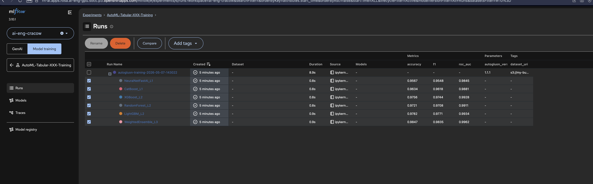
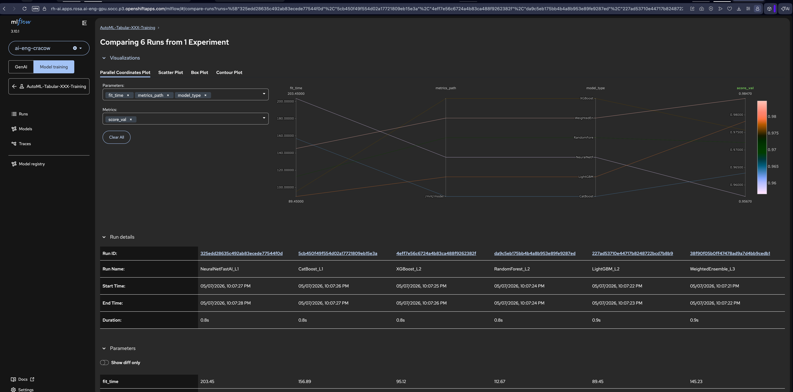

# AutoML MLflow integration

This document proposes an **MLflow** integration for OpenShift AI / ODH **AutoML** workflows implemented in [opendatahub-io/pipelines-components](https://github.com/opendatahub-io/pipelines-components) under **`components/training/automl`** and **`pipelines/training/automl`**, with product goals: **experiment tracking, comparison, reproducibility**.

**RHOAI 3.5 scope:** Core MLflow integration with KFP environment variables, parent/child run hierarchy, MLflow fields on the existing **`component_stage_map`** artifact, and existing training artifacts (leaderboard, metrics, feature importance, confusion matrix).


## Table of Contents

- [KFP MLflow integration modes (OpenShift AI 3.5+)](#kfp-mlflow-integration-modes-openshift-ai-35)
  - [Environment variables (RHOAI 3.5+)](#environment-variables-rhoai-35)
- [MLflow mapping model](#mlflow-mapping-model)
  - [Alignment with AutoGluon-native logging](#alignment-with-autogluon-native-logging)
  - [MLflow UI Examples](#mlflow-ui-examples)
- [Implementation guidance](#implementation-guidance)
- [KFP artifact: component stage map](#kfp-artifact-component-stage-map)
  - [Extending `component_stage_map.json`](#extending-component_stage_mapjson)
- [References](#references)
  - [AutoML Implementation](#automl-implementation)
  - [MLflow on RHOAI](#mlflow-on-rhoai)
  - [MLflow Framework Integration](#mlflow-framework-integration)

---

## KFP MLflow integration modes (OpenShift AI 3.5+)

Starting with **OpenShift AI 3.5**, Data Science Pipelines provides **opt-in with environment variables** (recommended for AutoML): MLflow client environment variables are pre-configured in pipeline step pods, allowing custom logging with full control over complex artifacts and metrics.

AutoML uses this approach because AutoGluon produces complex artifacts (leaderboards, ensemble hierarchies, nested model metrics) that require explicit logging control beyond what KFP automatic logging can capture.


### Environment variables (RHOAI 3.5+)

When MLflow integration is enabled at the project level, the following environment variables are automatically injected into pipeline step pods:

| Environment Variable | Purpose | Example Value | Notes |
|---------------------|---------|---------------|-------|
| `MLFLOW_TRACKING_URI` | MLflow tracking server endpoint | `https://mlflow-server.example.com` | If unset, MLflow logging is disabled (optional integration) |
| `MLFLOW_WORKSPACE` | Workspace identifier for the project | `data-science-project` | Corresponds to the OpenShift AI project/namespace |
| `MLFLOW_EXPERIMENT_ID` | Auto-created experiment ID for the pipeline | `"1"` | KFP creates one experiment per pipeline; components can log to this experiment directly |
| `MLFLOW_RUN_ID` | Parent run ID for the KFP pipeline execution | `"abc123..."` | KFP creates a parent run per pipeline execution; components create child runs under this |
| `MLFLOW_TRACKING_AUTH` | Authentication mechanism | `kubernetes-namespaced` | |

**AutoML integration approach:** Components check if `MLFLOW_TRACKING_URI` is set. If yes, they create **child runs** under the KFP-managed parent run (`MLFLOW_RUN_ID`) for each refitted model, using explicit `mlflow.log_params()` / `mlflow.log_metrics()` / `mlflow.log_artifact()` calls to capture AutoGluon-specific data.

---

## MLflow mapping model

Design for **two pipeline families** (tabular vs timeseries) with the **same conceptual mapping**.

| MLflow concept      | Proposed mapping                                                                                                                                                                                                                                                                                                                                                                                                                                       |
|---------------------|--------------------------------------------------------------------------------------------------------------------------------------------------------------------------------------------------------------------------------------------------------------------------------------------------------------------------------------------------------------------------------------------------------------------------------------------------------|
| **Experiment**      | KFP auto-creates one experiment per pipeline (accessible via `MLFLOW_EXPERIMENT_ID`).                                                                                                                                                                                                                                                                                                                                                                  |
| **Parent run**      | KFP auto-creates one parent run per pipeline execution (accessible via `MLFLOW_RUN_ID`). AutoML components **resume this run** to add tags, params, and **aggregate metrics**. **Tags:** `pipeline_name`, `kfp_run_name`, `kfp_run_id`, `kfp_version`, `image`, `autogluon_version`. **Params:** `task_type` (`binary` \| `multiclass` \| `regression` \| `time_series`), `eval_metric`, `preset`, `top_n`, dataset **hashes or URIs** (non-secret).   |
| **Parent Metrics**  | **Metrics:** `best_score`, `worst_score`, `mean_score`, `num_models_trained`, `total_fit_time_seconds`.                                                                                                                                                                                                                                                                                                                                                |
| **Child runs**      | **One child run per leaderboard row / refitted model** (each `name` in `model_names` or equivalent for timeseries), created by AutoML components as nested runs under the KFP parent. Enables side-by-side comparison in the MLflow UI across models from the same pipeline run. Params: `model_type`, `stack_level`, `fit_time`, `predict_time`, `num_bag_folds` / `num_stack_levels` when exposed.                                                   |
| **Child Metrics**   | Task-specific metrics from AutoGluon leaderboard / `metrics.json` (e.g., `accuracy`, `f1`, `roc_auc`, `rmse`, `mae`).                                                                                                                                                                                                                                                                                                                                  |
| **Child Artifacts** | Pointer to **`metrics`** (containing model's insights like confusion matric etc.), pointer to trained model binaries **`predictor`**, and pointer to **`notebook`**.                                                                                                                                                                                                                                                                                   |

### Alignment with AutoGluon-native logging

AutoGluon can integrate with experiment trackers in some setups. Revisit **native AutoGluon callbacks** to stream out results iteratively (as soon as model is trained the data should be logged).

### MLflow UI Examples

The following screenshots demonstrate the MLflow UI integration with AutoML workflows:

**Experiment Runs View:**



*The MLflow UI showing the AutoML experiment with parent pipeline run and child runs for each model (WeightedEnsemble_L3, CatBoost_L1, etc.) with task-specific metrics (accuracy, f1, roc_auc) and parameters.*

**Run Comparison View:**



*The parallel coordinates plot comparing 6 runs from the experiment, enabling side-by-side analysis of model performance across different metrics.*

---

## Implementation guidance

This section provides concrete implementation guidance for MLflow integration in AutoML pipeline component, following patterns established by MLflow’s scikit-learn and XGBoost integrations (autologging, nested runs, model signatures).

> **Important:** MLflow does **not** have native AutoGluon support. There is no `mlflow.autogluon` module or autologging capability. All tracking must be implemented via **explicit MLflow API calls** (`mlflow.log_params()`, `mlflow.log_metrics()`, `mlflow.log_artifact()`). Model logging would require a custom `mlflow.pyfunc` wrapper since AutoGluon predictors cannot be logged with standard MLflow flavors.

Following MLflow’s nested run pattern (similar to GridSearchCV with parent-child structure):

```python
import mlflow
import os
import json

def log_automl_results(metrics_json_path: str, model_names: list[str], pipeline_params: dict, 
                       kfp_context: dict, models_artifact_path: str):
    """
    Log AutoML results to MLflow using KFP-managed parent run.
    KFP automatically sets MLFLOW_TRACKING_URI, MLFLOW_RUN_ID, MLFLOW_EXPERIMENT_ID.
    """
    parent_run_id = os.getenv("MLFLOW_RUN_ID")
    if not parent_run_id:
        print("MLflow not enabled, skipping logging")
        return
    
    # Resume KFP-managed parent run
    with mlflow.start_run(run_id=parent_run_id):
        # Log parent run tags
        import autogluon
        mlflow.set_tags({
            "pipeline_name": kfp_context.get("pipeline_name", "autogluon_training_pipeline"),
            "kfp_run_id": kfp_context.get("run_id"),
            "kfp_run_name": kfp_context.get("run_name"),
            "task_type": pipeline_params.get("task_type")  # binary | multiclass | regression | time_series
        })
        
        # Log parent run params
        mlflow.log_params({
            "eval_metric": pipeline_params.get("eval_metric"),
            "preset": pipeline_params.get("preset", "medium_quality"),
            "top_n": pipeline_params.get("top_n", 3),
            "image_version": os.getenv("IMAGE_VERSION", "unknown"),
            "kfp_version": kfp_context.get("kfp_version", "unknown"),
            "autogluon_version": autogluon.__version__
        })
        
        # Log parent run metrics (aggregated across all models)
        with open(metrics_json_path) as f:
            all_metrics = json.load(f)
        
        # Find best model
        scores = {name: m.get("score_val", float('-inf')) for name, m in all_metrics.items()}
        best_model_name = max(scores, key=scores.get)
        best_score = scores[best_model_name]
        
        # Aggregate metrics
        mlflow.log_metric("best_score", best_score)
        mlflow.log_metric("worst_score", min(scores.values()))
        mlflow.log_metric("mean_score", sum(scores.values()) / len(scores))
        mlflow.log_metric("num_models_trained", len(all_metrics))
        
        # Total fit time (sum of marginal times, or max of total times for ensembles)
        fit_times = [m.get("fit_time", 0) for m in all_metrics.values()]
        mlflow.log_metric("total_fit_time_seconds", sum(fit_times))
        
        # Log best model name as param
        mlflow.log_param("best_model_name", best_model_name)
        
        mlflow.log_artifact("leaderboard.html", artifact_path="reports")
        
        # Create child runs for each model
        for model_name in model_names:
            model_metrics = all_metrics.get(model_name, {})
            
            with mlflow.start_run(run_name=model_name, nested=True):
                # Log child run params
                model_type = model_name.split("_")[0] if "_" in model_name else model_name
                stack_level = int(model_name.split("_L")[-1]) if "_L" in model_name else 1
                
                mlflow.log_params({
                    "model_type": model_type,
                    "stack_level": stack_level,
                    "fit_time": model_metrics.get("fit_time", 0),
                    "predict_time": model_metrics.get("pred_time_val", 0)
                })
                
                # Log child run metrics (task-specific)
                mlflow.log_metric("score_val", model_metrics.get("score_val", 0))
                for metric in ["accuracy", "f1", "roc_auc", "rmse", "mae"]:
                    if metric in model_metrics:
                        mlflow.log_metric(metric, model_metrics[metric])
                
                # Log child run artifacts (pointers to KFP artifacts)
                model_artifact_dir = f"{models_artifact_path}/{model_name}_FULL"
                mlflow.log_param("metrics_path", f"{model_artifact_dir}/metrics")
                mlflow.log_param("predictor_path", f"{model_artifact_dir}/predictor")
                mlflow.log_param("notebook_path", f"{model_artifact_dir}/notebooks/automl_predictor_notebook.ipynb")
```
---

## KFP artifact: component stage map

AutoML tabular and time-series pipelines already run **`publish_component_stage_map`** as the first task ([`component_stage_map_publisher`](https://github.com/opendatahub-io/pipelines-components/tree/main/components/training/automl/component_stage_map_publisher)). That component writes **`component_stage_map.json`** with the static component/stage/step catalog plus runtime fields **`kfp_run_id`** and **`published_at`**.


Artifact path (unchanged):

```text
publish-component-stage-map/<task_id>/component_stage_map/component_stage_map.json
```

### Extending `component_stage_map.json`

Add a top-level **`mlflow`** object when the stage map is published. Other fields (`pipeline_id`, `description`, `components`, `kfp_run_id`, `published_at`) stay as today.

**When MLflow tracking is enabled** (`MLFLOW_TRACKING_URI` set):

```json
{
  "pipeline_id": "autogluon-tabular-training-pipeline",
  "description": "Tabular AutoGluon pipeline: load and split data, train and refit models, build leaderboard.",
  "components": [ "..." ],
  "kfp_run_id": "run-abc123-def456",
  "published_at": "2026-05-19T12:00:00Z",
  "mlflow": {
    "tracking_enabled": true,
    "tracking_uri": "https://mlflow-server.example.com",
    "experiment_id": "5",
    "run_id": "a3f8b2c1d4e5f6g7h8i9j0k1l2m3n4o5",
    "workspace": "data-science-project",
    "run_url": "https://mlflow-server.example.com/#/experiments/5/runs/a3f8b2c1d4e5f6g7h8i9j0k1l2m3n4o5"
  }
}
```

**When MLflow tracking is disabled:**

```json
{
  "pipeline_id": "autogluon-tabular-training-pipeline",
  "components": [ "..." ],
  "kfp_run_id": "run-abc123-def456",
  "published_at": "2026-05-19T12:00:00Z",
  "mlflow": {
    "tracking_enabled": false
  }
}
```

| `mlflow` field | Type | Source | Description |
|----------------|------|--------|-------------|
| `tracking_enabled` | bool | `bool(MLFLOW_TRACKING_URI)` | Whether MLflow tracking was active for this run |
| `tracking_uri` | string | `MLFLOW_TRACKING_URI` | MLflow tracking server endpoint (omitted when disabled) |
| `experiment_id` | string | `MLFLOW_EXPERIMENT_ID` | KFP-managed experiment for this pipeline |
| `run_id` | string | `MLFLOW_RUN_ID` | KFP-managed parent run for this execution |
| `workspace` | string | `MLFLOW_WORKSPACE` | OpenShift AI project / namespace |
| `run_url` | string | Computed from `tracking_uri`, `experiment_id`, `run_id` | Deep-link to MLflow UI parent run |

Downstream training components still resume the parent run via **`MLFLOW_RUN_ID`** in the pod environment; the stage map is for **discovery and deep-linking** (AutoML Dashboard, KFP UI, CI/CD), not for replacing env-based logging.

**`publish_component_stage_map`** populates the `mlflow` block from the same KFP-injected environment variables at pipeline start. No new KFP output parameter or pipeline task is required—the existing **`component_stage_map`** artifact remains the single dashboard join artifact.

---


## References

### AutoML Implementation

- Component stage map publisher: [opendatahub-io/pipelines-components — `component_stage_map_publisher`](https://github.com/opendatahub-io/pipelines-components/tree/main/components/training/automl/component_stage_map_publisher)
- Upstream AutoML components: [opendatahub-io/pipelines-components — `components/training/automl`](https://github.com/opendatahub-io/pipelines-components/tree/main/components/training/automl)
- Upstream AutoML pipelines: [opendatahub-io/pipelines-components — `pipelines/training/automl`](https://github.com/opendatahub-io/pipelines-components/tree/main/pipelines/training/automl)
- End-user examples (RH): [red-hat-ai-examples — `examples/automl`](https://github.com/red-hat-data-services/red-hat-ai-examples/tree/main/examples/automl)
- Sample notebook (mocked MLflow data): [mlflow_mocks.ipynb](https://github.com/LukaszCmielowski/prototypes/blob/main/AutoML/mlflow_integration/mlflow_mocks.ipynb)

### MLflow on RHOAI

- **MLflow on RHOAI Integration Guide** (internal): Contact Matt Prahl or Humair Khan in `#wg-openshift-ai-mlflow-integration` for the latest integration guide
- MLflow Operator: [opendatahub-io/mlflow-operator](https://github.com/opendatahub-io/mlflow-operator)
- MLflow Workspaces documentation: [MLflow 3.10 release notes](https://github.com/mlflow/mlflow/releases/tag/v3.10.0) (workspace feature contributed by Red Hat)
- MLflow RBAC authorization plugin: [Kubernetes auth plugin documentation](https://mlflow.org/docs/latest/auth/index.html#kubernetes-authorization)

### MLflow Framework Integration

- MLflow Python Function (custom models): [MLflow pyfunc documentation](https://mlflow.org/docs/latest/python_api/mlflow.pyfunc.html#creating-custom-pyfunc-models)
- MLflow Tracking: [MLflow Tracking documentation](https://mlflow.org/docs/latest/tracking.html)
- MLflow Model Registry: [MLflow Model Registry documentation](https://mlflow.org/docs/latest/model-registry.html)
