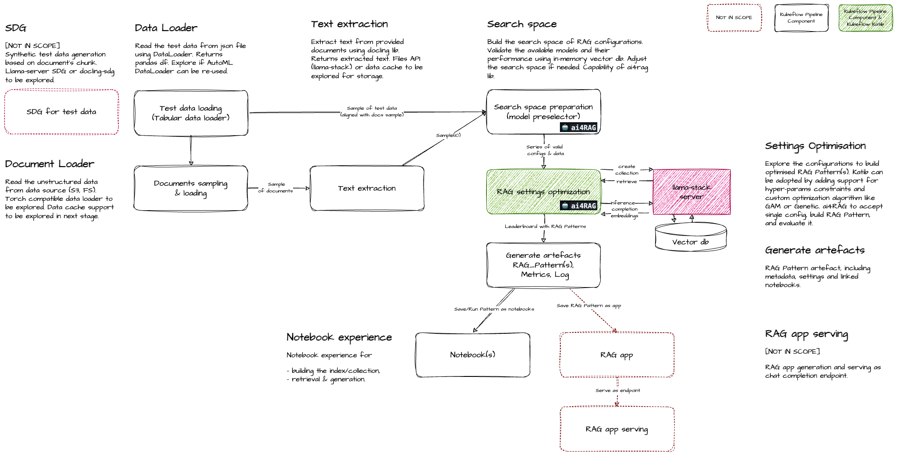

# AutoRAG

AutoRAG is an automated system for building and optimizing Retrieval-Augmented Generation (RAG) applications within Red Hat OpenShift AI. It leverages __Kubeflow Pipelines__ to orchestrate the optimization workflow, using the __ai4rag__ optimization engine to systematically explore RAG configurations and identify the best performing parameter settings based on an upfront-specified quality metric.  
The system integrates with __llama-stack__ API for inference and vector database operations, producing optimized RAG Patterns as artifacts that can be deployed and used for production RAG applications. It can also communicate with externally provided __MLFlow__ server in order to support advanced experiment tracking features.  

The optimization process typically involves:

1. **Search Space Preparation**: Builds and validates the search space of RAG configurations, including model preselection and validation using in-memory vector databases
2. **Configurations Exploration**: Systematically tests different RAG configurations from the defined search space
3. **Evaluation**: Assesses each configuration's performance using test data
4. **Pattern Generation**: Produces artifacts including, among others, the RAG Pattern, associated metrics, logs and notebooks
5. **Leaderboard**: Maintains a leaderboard of RAG Patterns ranked by performance

## Table of Contents

- [Kubeflow Pipeline](#kubeflow-pipeline)
  - [Input parameters](#input-parameters)
    - [Experiment Metadata](#1-experiment-metadata)
    - [Input Data Sources](#2-input-data-sources)
      - [Document Data](#document-data)
      - [Test Data](#test-data)
    - [Infrastructure Configuration](#3-infrastructure-configuration)
      - [Vector Database](#vector-database)
      - [Output results storage](#output-results-storage)
    - [Optimization Configuration](#4-optimization-configuration)
      - [Optimization Settings](#optimization-settings)
      - [Search Space Constraints](#search-space-constraints)
  - [Pipeline Invocation Example](#pipeline-invocation-example)
  - [Required Parameters](#required-parameters)
  - [Components](#components)
    - [Document Loader](#document-loader)
    - [Test Data Loading (Tabular Data Loader)](#test-data-loading-tabular-data-loader)
    - [Documents Sampling & Loading](#documents-sampling--loading)
    - [Text Extraction](#text-extraction)
    - [Search Space Preparation (Model Preselector)](#search-space-preparation-model-preselector)
    - [RAG Settings Optimization](#rag-settings-optimization)
  - [Artifacts](#artifacts)
- [Optimization engine `ai4rag`](#optimization-engine-ai4rag)
- [Supported features](#supported-features)
  - [RAG Configuration](#rag-configuration)
  - [Infrastructure Components](#infrastructure-components)
  - [Processing Methods](#processing-methods)
  - [Interfaces](#interfaces)
- [Glossary](#glossary)

## Kubeflow Pipeline

KubeFlow Pipelines are used to build out capability for RHOAI (https://github.com/kubeflow/pipelines-components)


### Input parameters

The AutoRAG pipeline parameters are organized into the following logical groups:

#### 1. Experiment Metadata

**Required Parameters:**
- `name: str` - Name of the AutoRAG experiment run (e.g., "AutoRAG run")

**Optional Parameters:**
- `description: str` - Description of the experiment (e.g., "RHOAI Kubeflow Pipelines Docs")

#### 2. Input Data Sources

##### Document Data

**Required Parameter:**
- `input_data_reference: dict` - Dictionary defining document data source:
  - `connection_id: str` - Connection ID for the data source (e.g., S3 connection ID)
  - `bucket: str` - Bucket name containing the documents
  - `path: str` - Path within the bucket/filesystem to the documents folder or single file
  
  Example:
  ```python
  {
    "connection_id": "s3-documents-connection",
    "bucket": "my-documents-bucket",
    "path": "rh_documents/"
  }
  ```

##### Test Data

Test data json file is supported only.

**Required Parameter:**
- `test_data_reference: dict` - Dictionary defining test data source:
  - `connection_id: str` - Connection ID for the test data source (e.g., S3 connection ID)
  - `bucket: str` - Bucket name containing the test data file
  - `path: str` - Path within the bucket/filesystem to the test data file
  
  Example:
  ```python
  {
    "connection_id": "s3-benchmarks-connection",
    "bucket": "autorag_benchmarks",
    "path": "my-folder/test_data.json"
  }
  ```

#### 3. Infrastructure Configuration

##### Vector Database

**Optional Parameter:**
- `vector_database_id: str` - Vector database id (e.g., registered in llama-stack Milvus database). If not provided, an in-memory database will be used.

##### Output results storage
Results of the run to be stored (python code, log file, summary report)

**Required Parameter:**
- `results_reference: dict` - Dictionary defining results storage location:
  - `connection_id: str` - Connection ID for the results storage (e.g., S3 connection ID)
  - `bucket: str` - Bucket name for storing results
  - `path: str` - Path where experiment results will be stored (e.g., "autorag/results")
  
  
  Example:
  ```python
  {
    "connection_id": "s3-autorag-results-connection",
    "bucket": "results",
    "path": "autorag/"
  }
  ```

##### MLFlow Integration (Experiment Tracking)

**Optional Parameter:**
- `mlflow_config: dict` - Dictionary defining MLFlow configuration for experiment tracking (optional):
  - `tracking_uri: str` - MLFlow tracking server URI (e.g., "http://mlflow-server:5000" or S3 path)
  - `experiment_name: str` - MLFlow experiment name (default: uses pipeline `name` parameter)
  - `enabled: bool` - Enable/disable MLFlow tracking (default: `True` if `mlflow_config` is provided)
  
  When enabled, AutoRAG will automatically log:
  - Experiment metadata (name, description, run parameters)
  - Optimization metrics (answer_correctness, faithfulness, context_correctness)
  - Configuration parameters (chunking, embeddings, generation, retrieval settings)
  - Leaderboard rankings and best pattern information
  - Artifact references (RAG Pattern artifacts, summary reports)
  - Execution timestamps and duration
  
  Example:
  ```python
  {
    "tracking_uri": "http://mlflow-server.redhat-ods-applications.svc.cluster.local:5000",
    "experiment_name": "AutoRAG Experiments",
    "enabled": True
  }
  ```
  
  > 💡 **Note:** If `mlflow_config` is not provided, MLFlow tracking will be disabled. To use MLFlow, ensure the MLFlow server is accessible from the pipeline execution environment.

#### 4. Optimization Configuration

##### Optimization Settings

**Optional Parameter:**
- `optimization: dict` - Dictionary defining optimization settings:
  - `max_number_of_rag_patterns: int` - Maximum number of RAG patterns to generate (default: 4)
  - `metric: str` - Metric to optimize (e.g., `"answer_correctness"` or `"faithfulness"`)
  
  Supported metrics are: `faithfulness` and `answer_correctness`. On top of those the `context_correctness` is automatically calculated measuring the retrieved chunks quality.

  Example:
  ```python
  {
    "max_number_of_rag_patterns": 4,
    "metric": "answer_correctness"
  }
  ```

##### Search Space Constraints

Constraints define the search space for RAG optimization. Each constraint section is provided as a list parameter:

**Optional Parameters:**

**Chunking Constraints:**
- `chunking_constraints: list[dict]` - List of dictionaries defining chunking configurations:
  - Each dictionary contains: `method: str`, `chunk_overlap: int`, `chunk_size: int`

**Embeddings Constraints:**
- `embeddings_constraints: list[dict]` - List of dictionaries defining embedding models:
  - Each dictionary contains: `model: str`

**Generation Constraints:**
- `generation_constraints: list[dict]` - List of dictionaries defining generation models:
  - Each dictionary contains: `model: str`, optional `context_template_text: str`, optional `messages: list[dict]` array

**Retrieval Constraints:**
- `retrieval_constraints: list[dict]` - List of dictionaries defining retrieval method configurations:
  - Each dictionary contains: `method: str`, `number_of_chunks: int`, optional `hybrid_ranker: dict` (with `strategy: str`, `sparse_vectors: str`, `alpha: float`, `k: int`)

**Example values:**

**Chunking Constraints:**
```python
[
  {
    "method": "recursive",
    "chunk_overlap": 256,
    "chunk_size": 2048
  }
]
```

**Embeddings Constraints:**
```python
[
  {
    "model": "ibm/slate-125m-english-rtrvr-v2"
  },
  {
    "model": "intfloat/multilingual-e5-large"
  }
]
```

**Generation Constraints:**
```python
[
  {"model": "mistralai/mixtral-8x7b-instruct-v01"},
  {"model": "ibm/granite-13b-instruct-v2"},
  {
    "model": "ibm/granite-3-8b-instruct",
    "context_template_text": "\n[Document]\n{document}",
    "messages": [
      {
        "role": "system",
        "content": "system-message-content",
        "name": "system-message-name"
      },
      {
        "role": "user",
        "content": "user-message-content",
        "name": "user-message-name"
      }
    ]
  }
]
```

**Retrieval Constraints:**
```python
[
  {
    "method": "simple",
    "number_of_chunks": 2,
    "hybrid_ranker": {
      "strategy": "weighted",
      "alpha": 0.6
    }
  },
  {
    "method": "simple",
    "number_of_chunks": 2
  }
]
```

**Pipeline Invocation Example:**

> ⚠️ **Warning:** This is a mocked example for demonstration purposes using KFP SDK v2. Actual implementation may vary based on the specific Kubeflow Pipelines SDK version and RHOAI configuration.

<details>
<summary>Click to expand Python SDK example with all parameters</summary>

```python
from kfp import Client

# Initialize KFP client
client = Client(host='https://your-kfp-endpoint.com')

# Prepare input data, optimization and constraint parameters as native Python types

input_data_reference = {
    "connection_id": "s3-documents-connection",
    "bucket": "my-documents-bucket",
    "path": "rh_documents/"
}

test_data_reference = {
    "connection_id": "s3-benchmarks-connection",
    "bucket": "autorag_benchmarks",
    "path": "my-folder/test_data.json"
}

results_reference = {
    "connection_id": "s3-autorag-results-connection",
    "bucket": "results",
    "path": "autorag/"
}

mlflow_config = {
    "tracking_uri": "http://mlflow-server.redhat-ods-applications.svc.cluster.local:5000",
    "experiment_name": "AutoRAG Experiments",
    "enabled": True
}

optimization = {
    "max_number_of_rag_patterns": 4,
    "metric": "answer_correctness"
}

chunking_constraints = [
    {
        "method": "recursive",
        "chunk_overlap": 256,
        "chunk_size": 2048
    }
]

embeddings_constraints = [
    {"model": "ibm/slate-125m-english-rtrvr-v2"},
    {"model": "intfloat/multilingual-e5-large"}
]

generation_constraints = [
    {"model": "mistralai/mixtral-8x7b-instruct-v01"},
    {"model": "ibm/granite-13b-instruct-v2"},
    {
        "model": "ibm/granite-3-8b-instruct",
        "context_template_text": "\n[Document]\n{document}",
        "messages": [
            {
                "role": "system",
                "content": "system-message-content",
                "name": "system-message-name"
            },
            {
                "role": "user",
                "content": "user-message-content",
                "name": "user-message-name"
            }
        ]
    }
]

retrieval_constraints = [
    {
        "method": "simple",
        "number_of_chunks": 2,
        "hybrid_ranker": {
            "strategy": "weighted",
            "alpha": 0.6
        }
    },
    {
        "method": "simple",
        "number_of_chunks": 2
    }
]

# Create and submit pipeline run with constraints
run = client.create_run_from_pipeline_func(
    autorag_pipeline,
    arguments={
        "name": "AutoRAG Experiment 1",
        "description": "RHOAI Kubeflow Pipelines Docs",
        "input_data_reference": input_data_reference,
        "test_data_reference": test_data_reference,
        "vector_database_id": "milvus-database",
        "results_reference": results_reference,
        "mlflow_config": mlflow_config,
        "optimization": optimization,
        "chunking_constraints": chunking_constraints,
        "embeddings_constraints": embeddings_constraints,
        "generation_constraints": generation_constraints,
        "retrieval_constraints": retrieval_constraints,
    }
)

print(f"Pipeline run created: {run.run_id}")
```

</details>

**REST API Invocation Example:**

<details>
<summary>Click to expand REST API example with all parameters</summary>

```bash
# Set your KFP endpoint and authentication token
KFP_ENDPOINT="https://your-kfp-endpoint.com"
AUTH_TOKEN="your-auth-token-here"
PIPELINE_ID="autorag-pipeline-id"

# Create a pipeline run using REST API
curl -X POST "${KFP_ENDPOINT}/apis/v1beta1/runs" \
  -H "Content-Type: application/json" \
  -H "Authorization: Bearer ${AUTH_TOKEN}" \
  -d '{
    "name": "AutoRAG Experiment 1",
    "description": "RHOAI Kubeflow Pipelines Docs",
    "pipeline_spec": {
      "pipeline_id": "'"${PIPELINE_ID}"'"
    },
    "runtime_config": {
      "parameters": {
        "name": "AutoRAG Experiment 1",
        "description": "RHOAI Kubeflow Pipelines Docs",
        "input_data_reference": {
          "connection_id": "s3-documents-connection",
          "bucket": "my-documents-bucket",
          "path": "rh_documents/"
        },
        "test_data_reference": {
          "connection_id": "s3-benchmarks-connection",
          "bucket": "autorag_benchmarks",
          "path": "my-folder/test_data.json"
        },
        "vector_database_id": "milvus-database",
        "results_reference": {
          "connection_id": "s3-autorag-results-connection",
          "bucket": "results",
          "path": "autorag/"
        },
        "mlflow_config": {
          "tracking_uri": "http://mlflow-server.redhat-ods-applications.svc.cluster.local:5000",
          "experiment_name": "AutoRAG Experiments",
          "enabled": true
        },
        "optimization": {
          "max_number_of_rag_patterns": 4,
          "metric": "answer_correctness"
        },
        "chunking_constraints": [
          {
            "method": "recursive",
            "chunk_overlap": 256,
            "chunk_size": 2048
          }
        ],
        "embeddings_constraints": [
          {"model": "ibm/slate-125m-english-rtrvr-v2"},
          {"model": "intfloat/multilingual-e5-large"}
        ],
        "generation_constraints": [
          {"model": "mistralai/mixtral-8x7b-instruct-v01"},
          {"model": "ibm/granite-13b-instruct-v2"},
          {
            "model": "ibm/granite-3-8b-instruct",
            "context_template_text": "\n[Document]\n{document}",
            "messages": [
              {
                "role": "system",
                "content": "system-message-content",
                "name": "system-message-name"
              },
              {
                "role": "user",
                "content": "user-message-content",
                "name": "user-message-name"
              }
            ]
          }
        ],
        "retrieval_constraints": [
          {
            "method": "simple",
            "number_of_chunks": 2,
            "hybrid_ranker": {
              "strategy": "weighted",
              "alpha": 0.6
            }
          },
          {
            "method": "simple",
            "number_of_chunks": 2
          }
        ]
      }
    }
  }'
```

</details>

#### Required Parameters

- `name: str` - Experiment name
- `input_data_reference: dict` - Document data source
- `test_data_reference: dict` - Test data source
- `results_reference: dict` - Results storage location

**Python SDK Example:**
```python
run = client.create_run_from_pipeline_func(
    autorag_pipeline,
    arguments={
        "name": "AutoRAG Experiment 2",
        "input_data_reference": input_data_reference,
        "test_data_reference": test_data_reference,
        "results_reference": results_reference,
    }
)
```

**REST API Example:**

```bash
curl -X POST "${KFP_ENDPOINT}/apis/v1beta1/runs" \
  -H "Content-Type: application/json" \
  -H "Authorization: Bearer ${AUTH_TOKEN}" \
  -d '{
    "name": "AutoRAG Experiment 2",
    "pipeline_spec": {
      "pipeline_id": "'"${PIPELINE_ID}"'"
    },
    "runtime_config": {
      "parameters": {
        "name": "AutoRAG Experiment 2",
        "input_data_reference": {
          "connection_id": "s3-documents-connection",
          "bucket": "my-documents-bucket",
          "path": "rh_documents/"
        },
        "test_data_reference": {
          "connection_id": "s3-benchmarks-connection",
          "bucket": "autorag_benchmarks",
          "path": "my-folder/test_data.json"
        },
        "results_reference": {
          "connection_id": "s3-autorag-results-connection",
          "bucket": "results",
          "path": "autorag/"
        }
      }
    }
  }'
```

> 💡 **Note:** When optional parameters are omitted, AutoRAG uses default values or explores the full available search space.

### Components

For detailed information about AutoRAG component structure and organization, see [Components Documentation](components.md).

#### Document Loader
Reads unstructured data from data sources (S3, local filesystem). Supports S3 `connection`. Returns documents for processing. 

#### Test Data Loading (Tabular Data Loader)
Reads test data from JSON files using a DataLoader component. Returns data as a pandas DataFrame.

#### Documents Sampling & Loading
Samples a subset of documents from the input dataset for processing (based on metadata). This component handles document sampling and loading operations, preparing documents for text extraction.

Sampling methods supported:
- test data driven sampling. Sample documents referenced in test data. Add noise documents up to 1GB limit (in-memory).


#### Text Extraction
Extracts text from provided documents using the `docling` library. Returns extracted text content. 


#### Search Space Preparation (Model Preselector)
Builds and validates the search space of RAG configurations. Validates available models and their performance using in-memory vector database. Adjusts the search space as needed. Outputs a series of valid configurations and data for optimization. Uses `ai4rag` library.

#### RAG Settings Optimization
Is based on `ai4rag` core optimization component that explores configurations to build optimized RAG Pattern(s). Uses Generalized Additive Models (GAM) to select next configuration by predicting the evaluation score before execution. Uses Vector Database to create collection operations and retrieval requests during the optimization process (supports both Milvus and Milvus Lite). 

Produces a leaderboard with RAG Patterns ranked by performance ([see Artifacts section for details](#artifacts)).

#### Artifacts

AutoRAG generates per each experiment execution:

- RAG Pattern Artifact(s) (multiple) consisting of properties and uri to tar archive with notebooks:
   - **Index building notebook**: For building the vector index/collection in case of an in-memory database. When dealing with persistent vector stores the notebook populates the already existing index/collection (created during exeriment) with all of the user's documents (please remember the documents sampling step at the very start of an experiment).
   - **Retrieval/generation notebook**: For performing retrieval and generation operations
- AutoRAG Run Artifact (single) with status properties and uri to log file with messages
- AutoRAG experiment summary Markdown Artifact including:
  - Data preparation details
  - Search space and explored configurations
  - Leaderboard of RAG Patterns ranked by performance
  - Links to remaining Artifacts
    
For detailed information about AutoRAG artifacts, see [Artifacts Documentation](artifacts.md).


## Optimization engine `ai4rag`

The `ai4rag` project is open-source and available at: [https://github.com/IBM/ai4rag](https://github.com/IBM/ai4rag).

`ai4rag` is a **RAG Templates Optimization Engine** that provides an automated approach to optimizing Retrieval-Augmented Generation (RAG) systems. The engine is designed to be **LLM and Vector Database provider agnostic**, making it flexible and adaptable to various RAG implementations.

 It accepts a variety of RAG templates and search space definitions, then systematically explores different parameter configurations to find optimal settings. The engine returns initialized RAG templates with optimal parameter values, which are referred to as **RAG Patterns**.


## Supported features

**Status**: Tech Preview - May 2026 (MVP)

### RAG Configuration

- **RAG Type**: Documents (documents provided as input)
- **Supported Languages**: English
- **Supported Document Types**: PDF, DOCX, PPTX, Markdown, HTML, Plain text
- **Document Data Sources**: 
  - S3 (Amazon S3)
  - Local filesystem (FS)

### Infrastructure Components

- **Vector Databases**: 
  - Milvus
  - Milvus Lite
- **LLM Provider**: Llama-stack-supported models and vendors
- **Experiment Tracking**: 
  - MLFlow (optional) - For experiment tracking, metrics logging, and artifact management


### Processing Methods

- **Chunking Method**: Recursive
- **Retrieval Methods**: Simple, Simple with hybrid ranker

### Interfaces

- **API**: Programmatic access to AutoRAG functionality
- **UI**: User interface for interacting with AutoRAG


## Glossary

### RAG Configuration

A **RAG Configuration** is a specific set of parameter values that define how a Retrieval-Augmented Generation system operates. It includes settings for:

- **Chunking**: Method and parameters for splitting documents into smaller pieces (e.g., recursive method with chunk_size=2048, chunk_overlap=256)
- **Embeddings**: The embedding model used to convert text into vector representations (e.g., `intfloat/multilingual-e5-large`)
- **Generation**: The language model used for generating responses (e.g., `ibm/granite-13b-instruct-v2`) along with its parameters
- **Retrieval**: The method for retrieving relevant document chunks (e.g., simple retrieval or hybrid ranker with specific parameters)

During AutoRAG optimization, multiple RAG configurations are explored to find the best performing combination of these parameters.

### RAG Pattern

A **RAG Pattern** is an optimized RAG configuration that has been evaluated and ranked by AutoRAG. It represents a complete, deployable RAG system with:

- Validated parameter settings that have been tested and evaluated
- Performance metrics (e.g., answer_correctness, faithfulness, context_correctness)
- Executable notebooks for indexing and inference operations
- A position in the leaderboard based on performance

RAG Patterns are the final output artifacts from AutoRAG experiments and can be directly deployed for production use.

### RAG Template

A **RAG Template** is a reusable blueprint or framework that defines the structure and workflow of a RAG system. It specifies:

- The overall architecture and flow of the RAG pipeline
- The types of components required (chunking, embeddings, retrieval, generation)
- How these components interact with each other
- The framework used (e.g., LangGraph for sequential processing)

Templates are parameterized, meaning they accept different configuration values. AutoRAG uses templates as the foundation and optimizes the parameter values to create RAG Patterns.