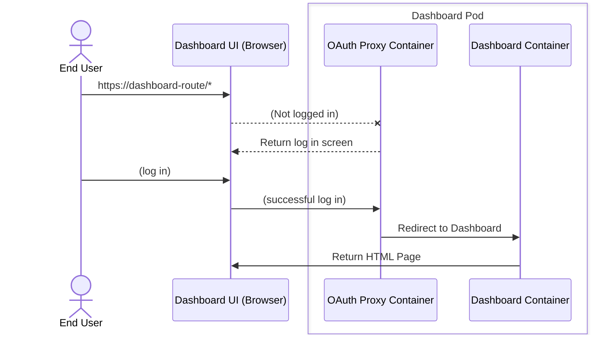
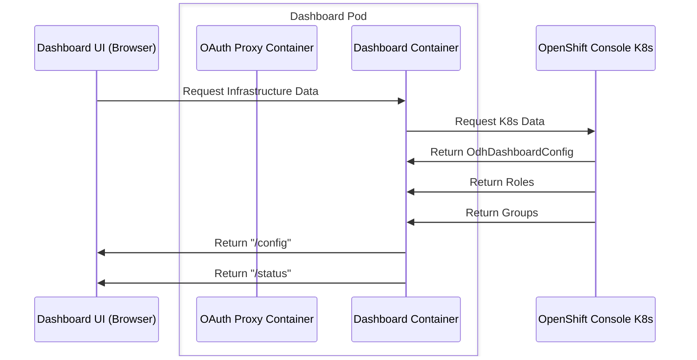
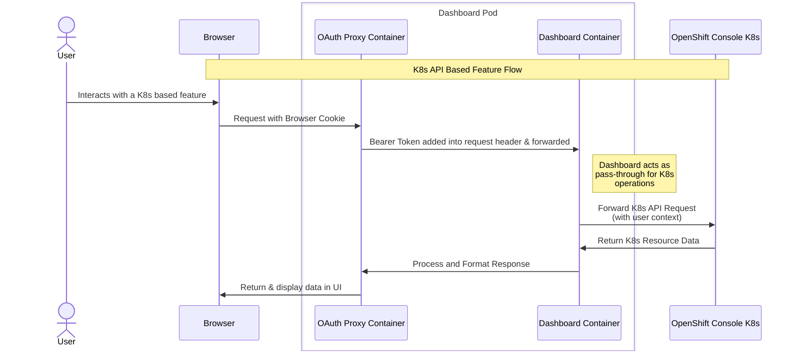
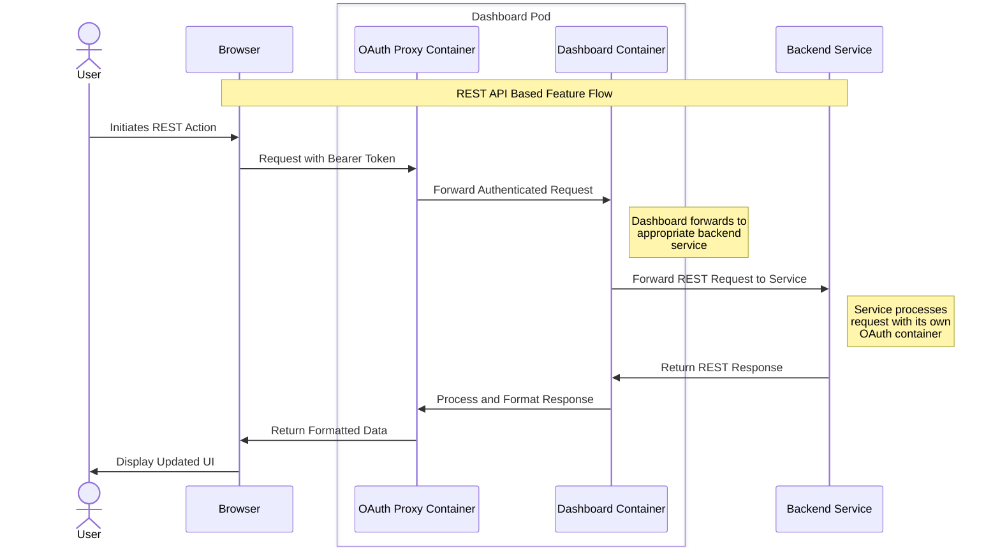

# Dashboard

> These docs are best viewed in Dark Mode. Improvements for Light Mode are coming soon.

The Dashboard is the primary UI provided for OpenShift AI. The Dashboard serves as a [thin-layer of UI](#the-thin-wrapped-layer) functionality to interact with the flows provided through OpenShift AI. 

* [Architecture](#architecture)
    * [Overview](#overview)
    * [Feature Types](#feature-types)
    * [The Thin Wrapped Layer](#the-thin-wrapped-layer)
* [Configuring & Interacting with the Dashboard](#configuring--interacting-with-the-dashboard)
    * [Dashboard Feature Details](#dashboard-feature-details)
* [How Dashboard Stores Data](#how-dashboard-stores-data)
* [User Access - Permissions](#user-access---permissions)
* [Supported Components](#supported-components)
* [Projects - OpenShift vs Data Science Differences](#projects---openshift-console-vs-data-science-differences)
* [Dashboard Custom Resource Definitions (CRDs)](#dashboard-custom-resource-definitions-crds)

## Architecture

### Overview

#### 1. User Authentication Flow and UI Initialization

This section illustrates how an end user interacts with the Dashboard UI and the OAuth Proxy for authentication. The OAuth Proxy is a sidecar pattern inside the dashboards pod in OpenShift. It ensures that all traffic has a valid token, and that subsequent requests are authenticated. 

#### 2. Data Fetching and Integration
The Dashboard retrieves infrastructure data by interacting with the OpenShift Console Kubernetes API.

#### Key takeaways:

* OAuth Proxy does our login screen -- Dashboard does *not* have one, all requests go through the Oauth Proxy
* Every request cross the OAuth Proxy line on the way to getting data, and thus is authenticated through that mechanism per request (using bearer tokens on each request)
* Our backend serves as a pass-through to get additional information from K8s (OpenShift Console) 
* There are multiple startup calls for various information, see the rest of the doc for more detailed information. 

### Feature Types

This section describes at a high level how feature connectivity works. For specific details on features, see the [Dashboard Feature Details](#dashboard-feature-details) section.

There are a couple ways features work today, through a k8s direct backend or a REST based OpenShift AI component backend.

#### K8s API Based Feature

K8s API based features are things that make use of custom resources (aka CRs, backed by CRDs) or K8s resources. These are features that have likely a controller managing the resources and/or it makes use of other K8s based resource concepts. Security is provided by K8s RBAC.

Features that use this model are (some examples):
* DS Projects
* Workbenches
* Model Serving
* etc...

#### REST API Based Feature

Rest API based features are features that rely on a custom REST endpoint usually shared via an internal `Service` (or an external `Route` object) provided by the backend component. These services (and sometimes external routes) are usually created by a custom resource that is deployed in the Data Science Project. Security is provided by OAuth Containers.

Features that use this model are (some examples):
* Model Registry
* DS Pipelines
* etc...

### The Thin Wrapped Layer

The Dashboard does not watch resources, so it does not manage the lifecycle of them (not even CRD variants we own). We simply CRUD data at runtime (when the user reaches a page or the backend node instance/pod starts up).

All functionality to do something complex is driven by backend components and not something the Dashboard ever owns. From a stack perspective, Dashboard is not required to use our API / features and thus cannot be the glue to make it happen.

## Configuring & Interacting with the Dashboard

The Dashboard does not expose direct API, rest or otherwise. Our Pod HTTPS endpoints are a Tier 4 API system (not for external consumption), and thus not intended for anyone to use other than our frontend UI client.

However, the dashboard has some ways to configure it and how we will store information the user does internally, which most of the time can be configured externally if desired.

Read more about the specifics in [Configuring the Dashboard](./configuringDashboard.md)

### Dashboard Feature Details

Most features in the Dashboard are documented by other component's documentation. However, there are details about connectivity & specific Dashboard feature that are documented in the [Features](./features/README.md) section.

## How Dashboard Stores Data

The Dashboard does not contain a self-storage (eg. DBs, in-memory caches[1], etc). We use K8s resources for storage for all things shared between users. We also use some browser storage to maintain user preferences.

> [1] Note: The dashboard has a 2-min in-memory cache of some resources to help with performance; these are copies of on-cluster resources and not unique storages.

Read more details about our storage mechanisms in [Dashboard Storage Mechanisms](./dashboardStorage.md)

## User Access - Permissions

Conceptually, the Dashboard uses the user's RBAC permissions granted directly on K8s to control the flow of what they can do and how to do it. We make use of SelfSubjectAccessReview (SSAR) checks to determine if a user can successfully perform an action before we render UI. This helps us show a dynamic UI based on what the user has access to.

Our API layers are to make use of the OAuth Proxy's user token and just pass that through to the K8s or REST endpoints. Effectively making the call on behalf of the user.

There are a few exceptions that are mostly deprecated and have a desire to be removed:

* Jupyter tile
    * Users do not have direct access to the namespace where Notebook resources are deployed, and thus do not have K8s RBAC access
    * The Dashboard Service Account manages their resources
    * **Future Goal:** Restructure the way Jupyter tile manages the data in such a fashion the user can have proper permissions over their resources
* Some base infrastructure 
    * Understanding installed stack components (Platform)
        * **Future Goal:** Currently no plans to shift away from the Service Account
    * Retrieving infrastructure based files from the deployment namespace
        * **Future Goal:** Convert to read-only for users to understand static items (much like `ImageStreams` are today for Workbench images)
    * Understanding user permissions
        * **Future Goal:** Likely required to stay on the Service Account, but infrastructure may be able to change so its less Admin vs User and "what you have access to"
    * The Dashboard Service Account manages getting the needed information to validate and operate on these functionalities
* [Admin access](#admins) (aka "Settings" navigation)
    * All UI admin functionality is done by the Service Account despite the user maybe having valid permissions to do so
    * **Future Goal:** Empower those picked as Admins to have direct permissions & shift to a SSAR model for Admin views

### Fundamental User Types

**Note:** This is not a section to discuss user personas. This is the technical understanding on how users will be impacted and will consume data from the API in the UI.

There are fundamentally 3 types of users to understand.

1. Cluster Admins (`cluster-admin` role granted at the cluster level)
   * Cluster admins on the OpenShift Cluster are read in as Product admins to the Dashboard
   * They also have _all_ k8s permissions one can have
   * It is expected that this type of user is extremely small in number due to the implicit security concerns it would mean to the cluster's cluster
   * This is a k8s concept ([external docs](https://kubernetes.io/docs/reference/access-authn-authz/rbac/#user-facing-roles))
2. Product Admins
   * Product admins, aka RHOAI Admins, are admins of the product who see `Settings` and who will be responsible for configuring the way Dashboard features work
   * All functionality they have is done through our Service Account
   * More information can be found in the [admins](#admins) section
3. **Project** users
   * aka just users with a project
   * Without a project, these users are as basic as they come -- they should have no access to anything and permissions do anything
   * This role concept can be combined with Product Admins today; combining it with Cluster Admins is expected to do nothing additional
   * There are 3 variants to this:
     1. **Admin**; can change permissions (invite/remove people from the project) & modify the name/description of the project
     2. **Contributor** (aka Edit); Can do everything but what is explicitly noted for Admins 
     3. **View**; We do not support this state -- but effectively they can change nothing and also cannot see secrets (Connections)

**Note:** Self provisioning role is not covered in the list above -- assume this is separate of content in this section.

### Admins

Admins today are determined by being in one of these groups:

* The OdhDashboardConfig resource has a field for "admin_groups"; any valid OpenShift Group resource listed here is considered an admin group -- any users within should see the Settings navigation
* The `cluster-admin` Role is granted in a RoleBinding to the user

Note: Any other ways today, including comprehensive Role bindings or the initial kube:admin user do not inherently get the definition of an admin.

Note: You can add `cluster-admin` role to the user or add them to an existing admin group to grant them access. Kube-admin specifically can be referenced by `b64:kube:admin` in the users of a Group.

## Supported Components

The Dashboard supports the stack with UI components. Each backend functionality can expose in multiple different ways in the Dashboard. Such as an admin-only configuration, a top-level navigation, or a sub-section of another component.

Current supported OpenShift AI components are:

- Workbenches
- Data Science Pipelines
- Model Serving
- Platform
- Distributed Workloads
- Model Registry (soon)

Concepts not provided by OpenShift AI that are supported are:

- OpenShift Projects ([these overlap with Data Science Projects](#projects---openshift-console-vs-data-science-differences))
- K8s PersistentVolumeClaims (aka PVCs or Cluster Storage)
- Various K8s Secrets & Configmaps in different fashions 

## Projects - OpenShift Console vs Data Science Differences

Short answer: **There is no difference**. All projects the user has access to is viable for OpenShift AI flows and thus can be a "Data Science Project".

More details:

* Initially there was an intent to have Projects created by the Dashboard to have specific flows to provide to users; this since has become a point of confusion and frustration trying to extend existing Projects
* Projects created in the Dashboard have a `opendatahub.io/dashboard` label to indicate they are Dashboard Data Science Projects
* Some namespaces are ignored despite permissions, these are namespaces that are not intended for data science flows (infrastructure namespaces, configuration namespaces, etc)
* Most resources within projects have the `opendatahub.io/dashboard` label to help indicate their intent for Data Science flows
    * Note: There is a goal to reduce this to pure K8s resources and all AI custom resources (Notebook, ServingRuntimes, InferenceServices, etc) should not need the label 

> Note: You can read more about `opendatahub.io/dashboard` in [Dashboard K8s Labels & Annotations](./k8sLabelsAndAnnotations.md#opendatahubiodashboard)

## Dashboard Custom Resource Definitions (CRDs)

A CRD is a definition of a resource that extends the K8s library of resources. Each Dashboard CRD has a purpose that can be extended by other components or by the customers if they wish to contribute items.

### OdhDashboardConfig (singleton)

**odhdashboardconfigs.opendatahub.io/v1alpha**

> **Note:** This resource is partially configurable with in-app Admin flows

This resource should only ever be created once in the same namespace the Dashboard is deployed. This resource is auto created by the Dashboard on initialization or by the Operator part of deploying the RHOAI Dashboard.

This resource configures the feature flags, details about the Jupyter tile, user groups, and notebook/serving size defaults.

### OdhApplication

**odhapplications.dashboard.opendatahub.io/v1**

These are resources that provide a tile to the Applications (Enabled/Explore pages). These resources can have OdhDocument & OdhQuickStart references.

The Jupyter tile is one of these resources that we specifically read in values of to render the tile.

### OdhDocument

**odhdocuments.dashboard.opendatahub.io/v1**

These resources provide access to link to external documentation about how-tos and other types. These resources appear in the resources section.

### OdhQuickStart

**odhquickstarts.console.openshift.io/v1**

These resources provide access to have embedded quick starts, where the users can access the quick start and follow a guided experience.

### AcceleratorProfiles

**acceleratorprofiles.dashboard.opendatahub.io/v1**

> **Note:** This resource is fully configurable with in-app Admin flows

These resources help provide information of your accelerators on your cluster and gives the admin the ability to configure or disable them as they see fit. In turn, the user can get access to "profiles" of how 
