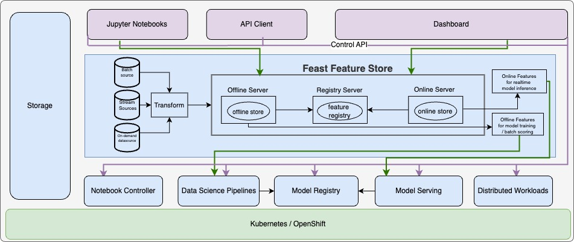
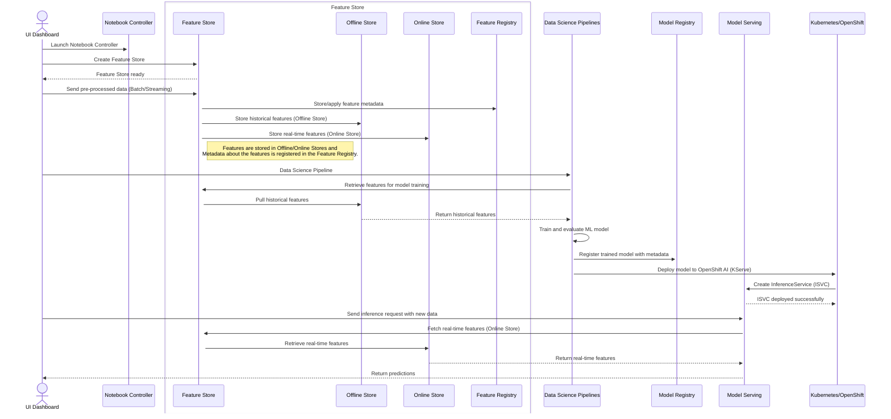

# Feast Feature Store Architecture

<!-- sources:
https://docs.feast.dev/
https://rtd.feast.dev/
-->

## Introduction

Feast (Feature Store) is an open-source feature store that helps teams operate production ML systems at scale by allowing them to define, manage, validate, and serve features for production AI/ML.

## Feast Feature Store High Level Architecture

The architecture diagram presents a high level overview of OpenShift AI environment that integrates Feast for feature store, and other component like Data Science Pipelines / Notebooks for Model training, a Model Registry for using models, and Model Serving for model inference/serving. 

## Goals

- Integrate Feast Feature Store as a centralized repository for feature management within OpenShift AI. 
- Provide a unified view of features used during model training and serving stages.

## Components

Feast's feature store is composed of below foundational components: 
<!-- sources:
https://docs.feast.dev/getting-started/components

-->

1. [**Offline Store**](https://docs.feast.dev/getting-started/components/offline-store) : Used for historical feature extraction used in model training.
2. [**Online Store**](https://docs.feast.dev/getting-started/components/online-store): Used for serving features at low-latency for inference requests in production. 
3. [**Registry**](https://docs.feast.dev/getting-started/components/registry): Used to keep track of feature store definitions and state (optionally backed by GCS or S3 based persistent storage). The Feast Registry acts as the backbone for storing feature definitions, which are typically written in Python, stored in feature repositories, and shared across environments such as staging and production.
4. [**Feast Python SDK/CLI**](https://docs.feast.dev/reference/feast-cli-commands): The primary user facing SDK
   - Manage version controlled feature definitions.
   - Materialize (load) feature values into the online store.
   - Build and retrieve training datasets from the offline store.
   - Retrieve online features.
5. [**Batch Materialization Engine**](https://docs.feast.dev/getting-started/components/batch-materialization-engine) : A batch materialization engine is a component of Feast that's responsible for moving data from the offline store into the online store.
6. [**Feature Repository**](https://docs.feast.dev/reference/feature-repository/feature-store-yaml) : Contains Feature definitions files written in Python , and the `feature_store.yaml` file to configure the feature store, including data sources with Feast project.
7. [**Feature Server**](https://docs.feast.dev/reference/feature-servers/python-feature-server): The Feature Server is a core architectural component in Feast, designed to provide low-latency feature retrieval and updates for machine learning applications.
      It is a REST API server built using [FastAPI](https://fastapi.tiangolo.com/) and exposes a limited set of endpoints to serve features, push data, and support materialization operations. The server is scalable, flexible, and designed to work seamlessly with various deployment environments, including local setups and cloud-based systems.
8. [**Feature Store Controller/Operator**](https://github.com/feast-dev/feast/tree/master/infra/feast-operator): The Feature Store Controller/Operator is responsible for the deployment and management of the Feast servers ([Offline Server](https://docs.feast.dev/reference/feature-servers/offline-feature-server), [Online Server](https://docs.feast.dev/reference/feature-servers/python-feature-server), [Registry Server](https://github.com/feast-dev/feast/blob/master/docs/reference/feature-servers/registry-server.md)) in Kubernetes/OpenShift environments:

## Feature Store Flow with OpenShift AI.

**1. Feature Store Initialization**
The UI Dashboard initializes/Creates the FeatureStore CR and sets the config for feature services used for data ingestion, transformation, and storage.

**2. Data Ingestion into Feature Store**
Data can be sent to Feast either pre-processed (e.g., via batch or streaming data pipelines) or raw and transformed by the Feast feature server during data ingestion (i.e., transformed prior to being written to the online store). Feast simplifies the integration with various data sources by providing an opinionated yet flexible API.

**3. Data Storage in Feature Store**

**Offline Store:** Persistent storage (database/warehouse) for historical feature data used in model training and batch scoring.
**Offline Store**: A lower-cost, persistent storage system (e.g., data warehouse) optimized for storing large volumes of historical feature data used in model training and batch scoring. It prioritizes storage efficiency over low-latency access.

**Online Store**: A higher-cost, low-latency storage system (e.g., in-memory database or cache) designed to provide rapid access to frequently used features during real-time inference, optimizing for speed and responsiveness.
**Feature Registry:** Metadata storage to track feature definitions, feature transformations, and feature metadata.

**4. Data Retrieval for Model Training**
Data Science Pipelines retrieve historical features from the Offline Store. Feature views in the Feature Registry define how features are joined and retrieved.

**5. Model Training**
The retrieved data is split into train, test, and hold-out sets. The model is iteratively trained and evaluated on these datasets.

**6. Model Evaluation**
The trained model is validated on a hold-out dataset to assess its accuracy, generalizability, and impact to its domain.
**Workflow:** Data retrieved → Train/Test split → Train Model → Evaluate Performance.

**7. Model Registration**
The trained model is registered in the Model Registry. 

**8. Model Deployment**
The registered model is deployed to the Model Server.

**9. Inference Request**
There are three ways to orchestrate inference requests. 
    1. The applications sends an inference requests to the Model Server and the Model Server retrieves real-time features from the Feature Server and generates predictions using the retrieved features and deployed model.
    2. The application sends an inference request to the Feature Server and the Feature Server sends the features to the Model Server and generates predictions using the deployed model.
    3. The application sends a request to the Feature Server and sends the features to the Model Server whcih generates predictions using the deployed model.

