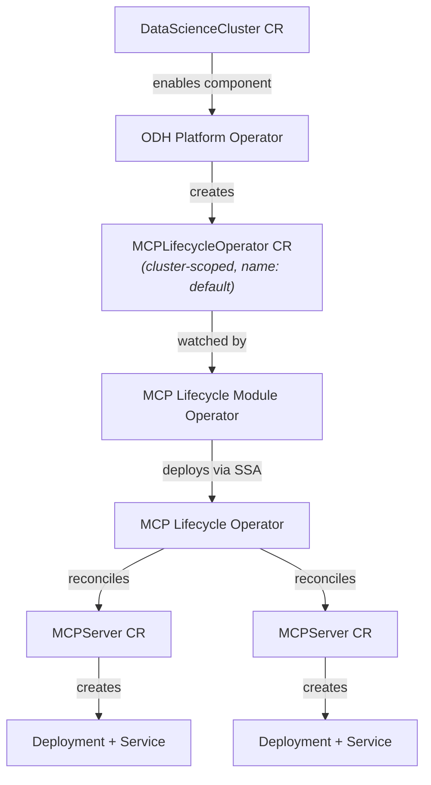

# MCP Lifecycle Operator

## Overview

The MCP Lifecycle Operator provides a declarative Kubernetes API for deploying and managing [Model Context Protocol (MCP)](https://modelcontextprotocol.io/) servers. It handles the full lifecycle of MCP servers: creating Deployments and Services, performing MCP protocol handshakes, tracking server capabilities, and managing health checks.

The operator is an upstream Kubernetes SIG Apps project ([kubernetes-sigs/mcp-lifecycle-operator](https://github.com/kubernetes-sigs/mcp-lifecycle-operator)) and is integrated into ODH/RHOAI through the modular operator architecture.

## Components

- **[MCP Lifecycle Operator](https://github.com/kubernetes-sigs/mcp-lifecycle-operator)** (upstream)
  - The core operator that reconciles `MCPServer` custom resources. For each MCPServer, it creates a Deployment and Service, performs an MCP protocol handshake to discover server capabilities, and reports the cluster-internal address for consumption by other workloads.
  - Maintained under [Kubernetes SIG Apps](https://github.com/kubernetes/community/blob/main/sig-apps/README.md). Licensed under Apache 2.0.

- **[MCP Lifecycle Module Operator](https://github.com/opendatahub-io/mcp-lifecycle-module-operator)** (ODH integration)
  - An ODH module operator that manages the deployment and lifecycle of the MCP Lifecycle Operator as a component within the ODH platform. It follows the [ODH modular architecture](https://docs.google.com/document/d/1FgN_U-6XH8M-Mu6XNeldUlTPsnw7UyPCWg5NVJJdYnw) pattern, reconciling a `MCPLifecycleOperator` CR created by the ODH platform operator.

- **[MCP Lifecycle Operator](https://github.com/opendatahub-io/mcp-lifecycle-operator)** (midstream fork)
  - The opendatahub-io fork of the upstream operator, used as the operand image source for RHOAI deployments. The module operator vendors manifests from this fork.

## Architecture



### Deployment Flow

1. The ODH platform operator creates a `MCPLifecycleOperator` CR (cluster-scoped, name must be `default`).
2. The MCP Lifecycle Module Operator watches the CR and renders vendored operand manifests. The operand image is injected via the `RELATED_IMAGE_ODH_MCP_LIFECYCLE_OPERATOR_IMAGE` environment variable.
3. The module operator applies resources via Server-Side Apply (SSA) and garbage-collects stale resources.
4. Once the operand Deployment is ready, the module operator sets the `Ready` condition on the `MCPLifecycleOperator` CR.
5. Users can then create `MCPServer` resources, which the MCP Lifecycle Operator reconciles into Deployments and Services.

### MCPServer Reconciliation

For each `MCPServer` resource, the MCP Lifecycle Operator:

1. Validates the spec (image reference, port, storage paths, security context).
2. Creates or updates a Deployment with the specified container image, ports, environment variables, and storage mounts.
3. Creates or updates a Service with session affinity based on the `mcp.stateless` configuration.
4. Performs an MCP protocol handshake using the [MCP Go SDK](https://github.com/modelcontextprotocol/go-sdk) to discover server capabilities (tools, resources, prompts, logging, completions).
5. Reports the cluster-internal address (e.g., `http://<name>.<namespace>.svc.cluster.local:<port>/mcp`) in the status for service discovery.

## APIs

### MCPLifecycleOperator (`components.platform.opendatahub.io/v1alpha1`)

Cluster-scoped CR created by the ODH platform operator. Controls whether the MCP Lifecycle Operator operand is deployed.

| Field | Description |
|---|---|
| `spec.managementState` | `Managed` (deploy and reconcile the operand) or `Removed` (delete all operand resources) |
| `status.phase` | `Ready` or `NotReady` |
| `status.conditions` | `Ready`, `ProvisioningSucceeded`, `Degraded`, `MCPLifecycleOperatorAvailable` |
| `status.releases` | Reports the module operator version and repository URL |

```yaml
apiVersion: components.platform.opendatahub.io/v1alpha1
kind: MCPLifecycleOperator
metadata:
  name: default
spec:
  managementState: Managed
```

### MCPServer (`mcp.x-k8s.io/v1alpha1`)

Namespaced CR created by users to deploy MCP servers.

| Field | Description |
|---|---|
| `spec.source` | Container image reference for the MCP server (currently supports `ContainerImage` type) |
| `spec.config` | Server configuration: port, arguments, environment variables, storage mounts, HTTP path |
| `spec.runtimeConfig` | Replicas, security context, resource requests/limits, health probes |
| `spec.mcp` | MCP-specific settings (e.g., `stateless` for session affinity control) |
| `status.address` | Cluster-internal URL for connecting to the MCP server |
| `status.serverInfo` | MCP server identity and capabilities discovered via protocol handshake |
| `status.conditions` | `Accepted` (configuration validity) and `Ready` (overall readiness) |

```yaml
apiVersion: mcp.x-k8s.io/v1alpha1
kind: MCPServer
metadata:
  name: kubernetes-mcp-server
  namespace: my-project
spec:
  source:
    type: ContainerImage
    containerImage:
      ref: quay.io/containers/kubernetes_mcp_server:latest
  config:
    port: 8080
  runtimeConfig:
    security:
      serviceAccountName: mcp-server-sa
  mcp:
    stateless: true
```

## References

- [MCP Lifecycle Operator documentation](https://mcp-lifecycle-operator.sigs.k8s.io/)
- [MCP Lifecycle Operator upstream repository](https://github.com/kubernetes-sigs/mcp-lifecycle-operator)
- [MCP Lifecycle Module Operator repository](https://github.com/opendatahub-io/mcp-lifecycle-module-operator)
- [MCP Lifecycle Operator midstream fork](https://github.com/opendatahub-io/mcp-lifecycle-operator)
- [ODH Modular Architecture Onboarding Guide](https://docs.google.com/document/d/1FgN_U-6XH8M-Mu6XNeldUlTPsnw7UyPCWg5NVJJdYnw)
- [Model Context Protocol specification](https://modelcontextprotocol.io/)