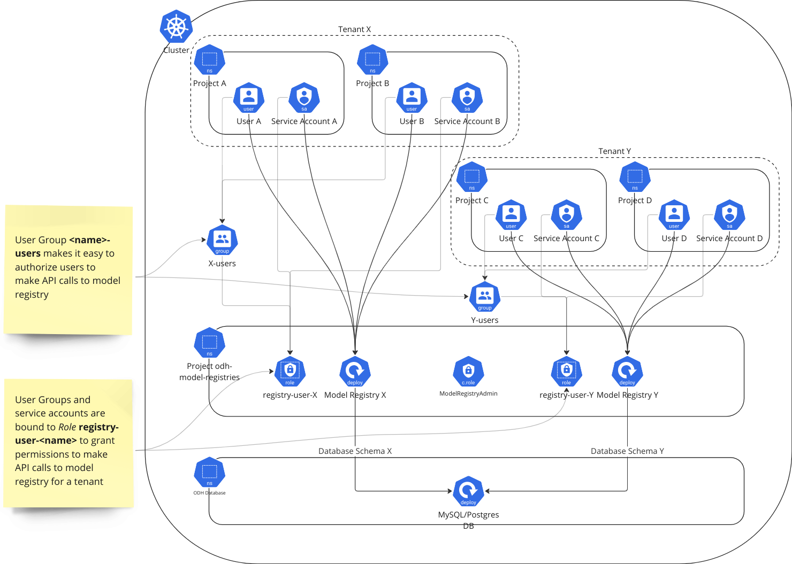

# Model Registry Tenancy

 OpenShift AI deploys components per RedHat OpenShift AI Project. In this model, all OpenShift AI components are deployed per Project (Kubernetes namespace) (except for Dashboard, which is per-cluster).   

Model Registry needs to support sharing ML Model metadata across multiple projects/environments, etc. The current RHOAI per-namespace deployment model uses “namespaces” as the tenant, i.e. any users or service accounts that are members of that namespace share all data as a single tenant. Ideally, there should be a _logical_ tenancy model that allows users to group ML Model development based on teams, groups, or organizations, independent of the underlying Kubernetes deployment architecture. 

 This document lays tenancy architecture behind Model registry, which gives them complete control over what kind of deployment models a cluster Admin can choose. 

## Model Registry Logical Architecture

The diagram below shows the core components at a logical level without going into authentication and authorization implementation details. 

At a high level Model Registry architecture consists of the following:

* Clients, which can be users or service accounts for client processes
* Kubernetes Deployment that provides a Model Registry service. This service exposes the following API ports
    * An MLMD CPP Server that implements a gRPC API
    * A Golang Server that implements an HTTP REST API
* An external user provided database service to store ML model metadata

clients could be either human users that have authenticated with their user credentials and make API calls through the dashboard, CLI or could be other pods/clients using service accounts or non-human credentials such as secrets and tokens. 

## Deployment Architecture - Use Service Mesh and Authorino for RBAC

This architecture calls for deploying the Model Registry deployment(s) in a known namespace such as “odh-model-registries”, where OpenShift AI administrators can provision any number of Model Registries with a unique name. For example, the administrator can install a single Model Registry called “public” and configure its permissions such that any authenticated user to the Kubernetes cluster has access to its APIs. Similarly, another instance can be configured to be accessible to a set of known users/groups. 

The namespace “odh-model-registries” will be automatically signed up as a member of the service mesh and all the model registry deployments will be configured to run an envoy proxy as a sidecar component. 

For all the inter-service communication mTLS will be configured using a “DestinationRule”. For exposing the model registry’s service endpoints a “_Virtual Service_” will be configured. A “_Gateway_” for each “_Virtual Service_” is configured if the service needs to be exposed externally or to a non-mesh-member component. 

Service Mesh will also be configured with CUSTOM “AuthorizationPolicy” to delegate the authorization decisions to Authorino. An “_AuthPolicy_” to support Authorino will be configured to enforce the “_Role_” based RBAC rules for accessing the Model Registry that has been created by the administrator.

**Note:** This proposal follows the [Principle of Least Privilege](https://en.wikipedia.org/wiki/Principle_of_least_privilege) for RBAC rules and resources. This ensures that any access granted is to a very specific resource to avoid accidentally granting access to other resources. 

The diagram below shows the RBAC proxy deployment model:

Model Registry Operator will create the following:

* Kubernetes Role `registry-user-<registry-name>` - allows the verb `GET` on the Kubernetes service created for `registry-name`. This role will make it convenient for users, group, and service accounts to be granted access to a specific Model Registry service. 
* OpenShift User Group `<registry-name>-users` - with role binding to role `registry-user-<registry-name>` to help registry administrators easily add users to this group and grant them access to the registry. 

Using the above two resources to handle the access permissions, Model Registry creates the tenancy model.

### Multiple “Model Registry” deployments in OpenShift AI

This is the prescribed deployment model for multiple Model Registries in the MVP release with tenancy model. The tenancy is enforced with RBAC access to given instance of the Model Registry.

