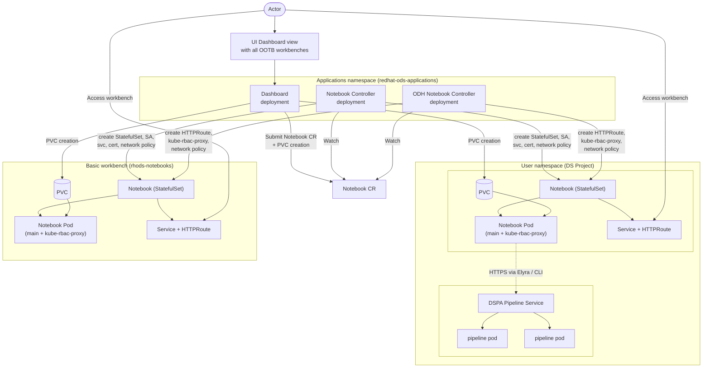
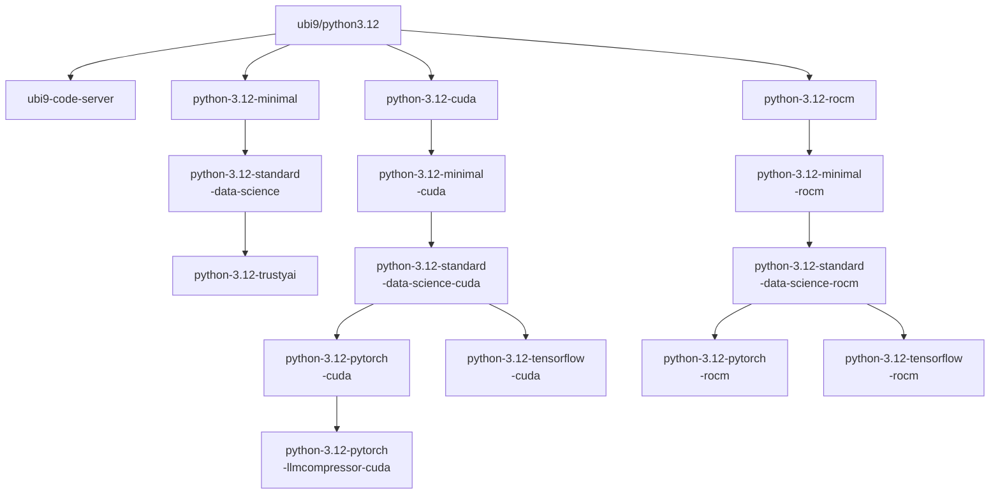
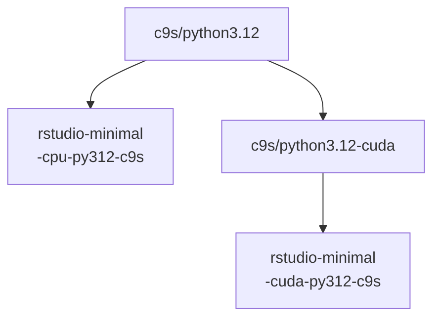
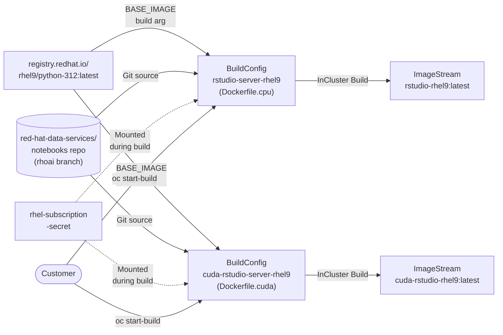
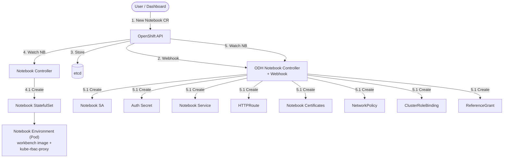

# Workbenches architecture

<!-- sources:
- "Kubeflow Notebooks Architecture" https://www.kubeflow.org/docs/components/notebooks/overview/
- "Kubeflow Architecture" https://www.kubeflow.org/docs/started/architecture/
- opendatahub-io/notebooks ARCHITECTURE.md https://github.com/opendatahub-io/notebooks/blob/main/ARCHITECTURE.md
- opendatahub-io/kubeflow ARCHITECTURE.md https://github.com/opendatahub-io/kubeflow/blob/main/ARCHITECTURE.md
-->

The Workbenches component provides a platform to run web-based development environments inside an OpenShift cluster. In the ML lifecycle, workbenches serve as the platform for the Model Development stage, providing an environment for Data Scientists to explore and experiment during model development.

Key features include:

- Native support for [JupyterLab](https://github.com/jupyterlab/jupyterlab), [RStudio](https://github.com/rstudio/rstudio), and [code-server](https://github.com/coder/code-server) (VS Code in the browser).
- Tailored integrated environments equipped with the latest tools and libraries.
- Users can create notebook containers directly in the cluster.
- Admins can provide standard notebook images for their organization with required packages pre-installed.
- Access control is managed by Admins, enabling easier notebook management in the organization.

Components:

- *[Notebooks/workbenches](https://github.com/opendatahub-io/notebooks/wiki/Workbenches)*
  - A collection of container images tailored for data analysis, machine learning, research, and coding within the OpenShift ecosystem. Designed to streamline data science workflows, these workbenches offer an integrated environment equipped with the latest tools and libraries. They are intended to be used with the ODH Notebook Controller as the launcher. Workbench images are supported for at least one year, with major refreshes approximately every six months. All current images are based on **Python 3.12**.

  - **CPU workbenches** (UBI9, except RStudio which uses C9S):
    - Minimal (JupyterLab)
    - DataScience (JupyterLab, numpy, scipy, pandas, etc.)
    - TrustyAI (JupyterLab, trustyai, etc.)
    - CodeServer (code-server with DataScience stack)
    - RStudio (RStudio Server)

  - **CUDA 12.8 workbenches** (UBI9/RHEL9, except RStudio which uses C9S):
    - Minimal (JupyterLab)
    - PyTorch (JupyterLab, torch, etc.)
    - PyTorch LLMCompressor (JupyterLab, torch, llm-compressor, etc.)
    - TensorFlow (JupyterLab, tensorflow, etc.)
    - RStudio (RStudio Server)

  - **ROCm 6.3 workbenches** (UBI9/RHEL9, x86_64 only):
    - Minimal (JupyterLab)
    - PyTorch (JupyterLab, torch, etc.)
    - TensorFlow (JupyterLab, tensorflow, etc.)

  - GPU/accelerator support: NVIDIA (CUDA 12.8), AMD (ROCm 6.3)
  - Multi-architecture support: x86_64, aarch64, ppc64le, s390x (varies per image; GPU images are limited to vendor-supported architectures)

- *[Notebook Controller](https://github.com/opendatahub-io/kubeflow/tree/v1.10-branch/components/odh-notebook-controller)*
  - A two-controller design that acts as the backend for the Workbenches component. The upstream **Kubeflow notebook controller** watches `Notebook` custom resource events to manage the notebook StatefulSet lifecycle and idle culling. The **ODH notebook controller** runs alongside it and provides OpenShift-specific capabilities:
    - Kubernetes Gateway API integration (HTTPRoute-based routing)
    - kube-rbac-proxy sidecar injection for authentication and authorization
    - Idle culling (upstream controller scales StatefulSet to zero when idle, scales back up on access)
    - Network policy management
    - DSPA (Data Science Pipelines Application) secret injection
    - Feast configuration injection
    - MLflow integration
    - Runtime class handling
    - Mutating and validating admission webhooks

- *[Elyra](https://github.com/opendatahub-io/elyra)*
  - A JupyterLab extension plugin for notebooks that enables submission of ML pipeline workflows. This component extends the open-source [Elyra](https://github.com/elyra-ai/elyra) with support for the Data Science Pipelines v2 API. Key extensions include:
    - Pipeline Visual Editor
    - Python Editor
    - Code Snippet Editor

- *[Pipeline runtimes](https://github.com/opendatahub-io/notebooks/tree/main/runtimes)*
  - Lightweight container images used by Elyra for pipeline step execution. These mirror the workbench flavors but without the full IDE (no JupyterLab UI). They require curl and Python so that additional packages can be installed at runtime. Current runtime images (Python 3.12):
    - CPU: Minimal, DataScience
    - CUDA 12.8: PyTorch, PyTorch LLMCompressor, TensorFlow
    - ROCm 6.3: PyTorch, TensorFlow


## High Level architecture



## Workbenches

### Architecture

Each workbench image is a standalone multi-stage Dockerfile whose parent is referenced via `FROM`. The structure of the build chain is derived from the parent image. To better comprehend this concept, refer to the following graph.



Each notebook inherits the properties of its parent. For instance, the TrustyAI notebook inherits all the installed packages from the DataScience notebook, which in turn inherits the characteristics from its parent, the Minimal notebook.

RStudio workbenches differ between ODH and RHOAI:

- **ODH:** RStudio is shipped as pre-built container images based on CentOS Stream 9 (C9S), available in both CPU and CUDA variants.
- **RHOAI:** RStudio remains in **Dev Preview**. Instead of pre-built images, only BuildConfig definitions are provided. Customers must use these BuildConfig files to build the RStudio images themselves on their cluster.

The ODH pre-built image hierarchy:



The RHOAI BuildConfig-based flow (Dev Preview):

In RHOAI, two BuildConfig/ImageStream pairs are provided via [manifests](https://github.com/red-hat-data-services/notebooks/tree/rhoai-3.3/manifests/base) -- one for CPU (`rstudio-server-rhel9`) and one for CUDA (`cuda-rstudio-server-rhel9`). Both use `registry.redhat.io/rhel9/python-312:latest` as the base image and clone the [red-hat-data-services/notebooks](https://github.com/red-hat-data-services/notebooks) repo as the build source. A RHEL subscription secret (`rhel-subscription-secret`) is required for the build. Customers apply the manifests to their cluster and trigger builds via `oc start-build`.




## Notebook Controller

### Architecture

The Notebook Controller is a two-controller design:

- The **upstream Kubeflow notebook controller** manages the core lifecycle: creating the StatefulSet, Service, and handling idle culling (scaling to zero when idle, scaling back up on access).
- The **ODH notebook controller** runs alongside and handles OpenShift-specific concerns: Gateway API routing (HTTPRoute), authentication (kube-rbac-proxy injection), network policies, and platform integrations (DSPA, Feast, MLflow).



### Spec

The user needs to specify the PodSpec for the Workbenches. Based on the selection made by the user, the Dashboard component submits the Custom Resource to the cluster.
For example:

```yaml
apiVersion: kubeflow.org/v1
kind: Notebook
metadata:
  name: my-notebook
spec:
  template:
    spec:
      containers:
        - name: my-notebook
          image: quay.io/opendatahub/odh-workbench-jupyter-datascience-cpu-py312-ubi9:latest
          args:
            [
              "start.sh",
              "lab",
              "--LabApp.token=''",
              "--LabApp.allow_remote_access='True'",
              "--LabApp.allow_root='True'",
              "--LabApp.ip='*'",
              "--LabApp.base_url=/test/my-notebook/",
              "--port=8888",
              "--no-browser",
            ]
```

The required fields are `containers[0].image` and (`containers[0].command` and/or `containers[0].args`).
That is, the user should specify what and how to run.

All other fields will be filled in with default values if not specified.

By default, when the ODH notebook controller is deployed along with the
Kubeflow notebook controller, it will expose the notebook via the Kubernetes
Gateway API by creating an `HTTPRoute` object (targeting the `data-science-gateway`
in the `openshift-ingress` namespace by default, configurable via `NOTEBOOK_GATEWAY_*`
environment variables).

If the notebook annotation `notebooks.opendatahub.io/inject-auth` is set to
true, the kube-rbac-proxy will be injected as a sidecar in the notebook
deployment to provide authentication and authorization capabilities:

```yaml
apiVersion: kubeflow.org/v1
kind: Notebook
metadata:
  name: example
  annotations:
    notebooks.opendatahub.io/inject-auth: "true"
```

A [mutating webhook](https://github.com/opendatahub-io/kubeflow/tree/v1.10-branch/components/odh-notebook-controller/controllers/notebook_mutating_webhook.go)
is part of the ODH notebook controller. It adds the kube-rbac-proxy sidecar to
the notebook deployment. The controller will create all the objects needed by
the proxy as explained in the architecture diagram.

When accessing the notebook, you will have to authenticate with your OpenShift
user, and you will only be able to access it if you have the necessary
permissions.

The authorization is delegated to OpenShift RBAC via `SubjectAccessReview`.
The kube-rbac-proxy verifies that the authenticated user is authorized to
perform a `GET` operation on the specific `Notebook` resource. This is
configured via a `--config-file` flag pointing to a YAML file that sets
`authorization.resourceAttributes`:

```yaml
authorization:
  resourceAttributes:
    verb: get
    resource: notebooks
    apiVersion: kubeflow.org/v1
    name: example
    namespace: opendatahub
```

That is, you will only be able to access the notebook if you can perform a `GET`
notebook operation on the cluster:

```shell
oc get notebook example -n <YOUR_NAMESPACE>
```
