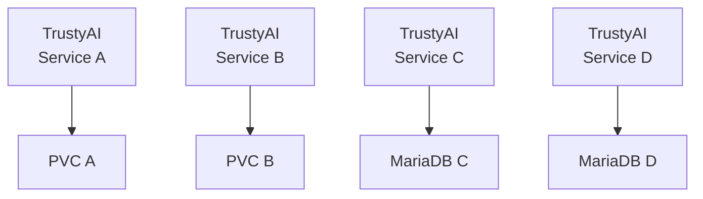

# TrustyAI service database configuration

|                |                                                                  |
| -------------- |------------------------------------------------------------------|
| Date           | 8 Jun 2024                                                       |
| Scope          | Explainability                                                   |
| Status         | Review                                                           |
| Authors        | [Rui Vieira](https://github.com/ruivieira)                                         |
| Supersedes     | N/A                                                              |
| Superseded by: | N/A                                                              |
| Tickets        | [Tracking Issue](https://issues.redhat.com/browse/RHOAIENG-8178) |
| Other docs:    | none                                                             |


## What

This document describes the decision to add configuration options to the `TrustyAIService` (TAS) Custom Resource Definition (CRD) in order to support database backends.

## Why

TASs require a way to store data. Currently, TASs store data in files in a Persistent Volume Claim (PVC). This is a simple and effective way to store data, but it has limitations.
Implementing a database backend will allow TASs to store data in a more efficient, secure and scalable way.

In order to configure the TAS/Database communication new fields need to be added to the TAS CRD.

We will distinguish the following modes throughout this document:

* **PVC-mode**: the currently supported mode. Data is stored in files in a PVC
* **DB-mode**: future mode where data is stored in a database.

## Goals

This ADR aims to:

* Define required fields to configure a database connection for TASs
* Provide backwards compatibility with previous CRs (PVC-mode)
* Define custom DB connections using the TAS CRD

## Non-Goals

This ADR does **not** aim to:

* Define database details or architecture beyond the connection level (e.g. schemas) and CRD configuration fields
* Document how to deploy or manage the database backend. A running database is assumed to be available.

## How

The type of database is abstracted by using Hibernate's ORM. This means that, technically, all Hibernate supported databases should also be transparently supported by the TrustyAI service (although at this stage, only the `mysql` family will be supported). We will focus on the required fields to configure the database connection.

The current TAS CRD is typically defined as follows:

```yaml
apiVersion: trustyai.opendatahub.io/v1alpha1
kind: TrustyAIService
metadata:
  name: trustyai-service-example
spec:
  storage:
  format: "PVC"
  folder: "/inputs"
  size: "1Gi"
    data:
  filename: "data.csv"
  format: "CSV"
    metrics:
  schedule: "5s"
  batchSize: 5000 # Optional, defaults to 5000
```

The proposed configuration introduces the following fields:

_TAS CR_

| Field | Mandatory | Note |
|-------|-----------|------|
|`databaseConfigurations`|No|Secret name with the connection credentials, service and port. If omitted, operator will look in `$(metadata.name)-db-credentials`|

_Secret:_

| Field            | Mandatory | Note |
|------------------|-----------|------|
| `databaseKind`     |Yes|The type of the database (only `mysql` supported at this stage)|
| `databaseUsername` |Yes|Username|
| `databasePassword` |Yes|Password|
| `databaseService`  |Yes|The Kubernetes service to communicate with the database|
|`databasePort`|Yes|The port over which communication is made|

### Example

```yaml
apiVersion: trustyai.opendatahub.io/v1alpha1
kind: TrustyAIService
metadata:
  name: trustyai-service-example
spec:
  storage:
  format: "DATABASE"
  databaseConfigurations: db-credentials # Optional
    metrics:
  schedule: "5s"
  batchSize: 5000 # Optional, defaults to 5000
```

```yaml
apiVersion: v1
kind: Secret
metadata:
  name: db-credentials
type: Opaque
data:
  databaseKind: mysql
  databaseUsername: foo
  databasePassword: bar
  databaseService: mariadb-service
  databasePort: 3306
```

From the above example, the operator will:

* Read the provided `Secret` with the connection credentials
* If not provided, it will look for a secret named `$(metadata.name)-db-credentials`
  * Use the secret’s `databaseService`, `databasePort`, `databaseKind` and credentials to connect to the database

_Following the Principle Of Least Astonishment:_

* An invalid database configuration (_e.g._ invalid DB location) will not default to PVC, but instead prevent the TAS to be deployed, with respective feedback information (_e.g_ Kubernetes error Event + condition in the status of the CRD)
* If databaseCredentials is omitted, the operator will look for a Kubernetes Secret in the same namespace with name _$(metadata.name)-db-credentials_.
  * If no such secret is found, the TAS will not be created

> **Note**
> _TBD: If the databaseService is of a file type DB (e.g. H2), a PVC will still be created to store the DB._
> _This means that the fields (spec.storage.folder and spec.storage.size still need to be provided._

The values in the CRD will be passed to the TAS as environment variables, which will be used to configure the Hibernate connection.

### Scenarios

#### PVC-mode

The PVC-mode is the only mode currently supported. As such, for backwards compatibility, with the current typical CR
```yaml
apiVersion: trustyai.opendatahub.io/v1alpha1
kind: TrustyAIService
metadata:
  name: trustyai-service-example
spec:
  storage:
  format: "PVC"
  folder: "/inputs"
  size: "1Gi"
    data:
  filename: "data.csv"
  format: "CSV"
    metrics:
  schedule: "5s"
  batchSize: 5000 # Optional, defaults to 5000
```

**PVC will take precedence over other types**. This means that if other DB related fields are added erroneously, the operator will ignore them and proceed with the PVC-mode.

```yaml
apiVersion: trustyai.opendatahub.io/v1alpha1
kind: TrustyAIService
metadata:
  name: trustyai-service-example
spec:
  storage:
  format: "PVC"
  databaseConfigurations: my-secret
  folder: "/inputs"
  size: "1Gi"
    data:
  filename: "data.csv"
  format: "CSV"
    metrics:
  schedule: "5s"
  batchSize: 5000 # Optional, defaults to 5000
```

The operator will display a warning in the logs, but proceed with the PVC-mode as previously.

#### DB-mode

##### Example: MariaDB

```yaml
apiVersion: trustyai.opendatahub.io/v1alpha1
kind: TrustyAIService
metadata:
  name: trustyai-service-example
spec:
  storage:
  format: "DATABASE"
  databaseConfigurations: db-credentials # Optional
    metrics:
  schedule: "5s"
  batchSize: 5000 # Optional, defaults to 5000
```

```yaml
apiVersion: v1
kind: Secret
metadata:
  name: db-credentials
type: Opaque
data:
  databaseKind: mysql
  databaseUsername: foo
  databasePassword: bar
  databaseService: mariadb-service
  databasePort: 3306

```

### Migration

Options for migration.

#### Migration with an existing PVC-mode

**If**

* `storage.format` is `DATABASE`

**And**

* Both `storage.folder` and `data.filename` are set

Then the operator will pass the information to the service, so that it migrates from the PVC files to the DB.
The details of this process are outside the scope of this ADR.

#### Migration direction

* Migrating from PVC-mode to DB-mode will be supported.
* Migrating from DB-mode to PVC will **not** be supported.

### Co-existence

Different TASs can co-exist in different modes or the same mode, since they are isolated.



However, this does not prevent deployment mistakes, such as two different services sharing the same database.


## Alternatives

Since the TAS configuration and deployment is managed by the operator, there are currently no alternatives to configure the database connection from the CR.

An alternative would be to provide a separate ConfigMap with the database connection details, but this would require additional manual intervention and there would be no way to specify a database connection instead of a PVC directly in the CR.

## Stakeholder Impacts

## References

* [Hibernate supported databases](https://github.com/hibernate/hibernate-orm/blob/main/dialects.adoc)

Reviews

Reviewed by
Date
Notes
name
date
?


